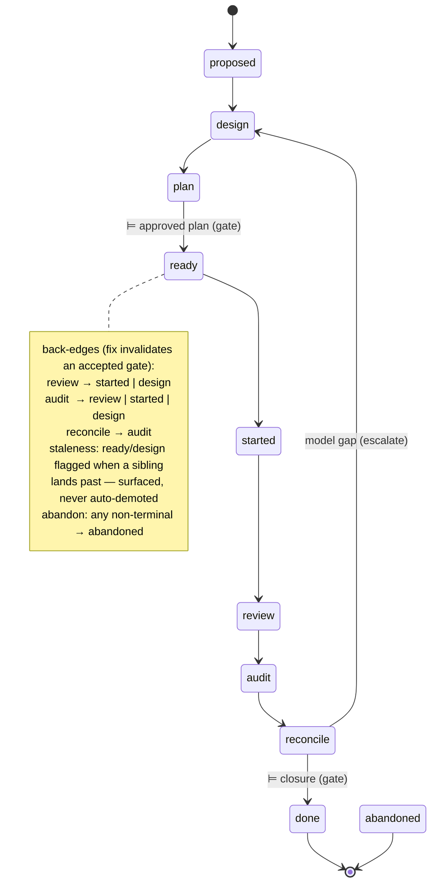

# ADR-009: Slice lifecycle state machine and conduct axis

## Context

ADR-003 set the canonical loop and the audit/reconcile/close seam but **deferred
the machinery** (§11) and anticipated its own split: *"may later split into a
loop ADR and a lifecycle-truth ADR."* Enacting the reconcile half (SL-028)
surfaced two facts ADR-003 left implicit and two decisions it never made:

- **The slice lifecycle is inert.** `slice-NNN.toml` `status` is hand-edited;
  there is no transition verb, and the vocabulary `{proposed, ready, started,
  audit, done, abandoned}` predates the reconcile step — no `reconcile`, no
  `review` state.
- **Doctrine diverges from spec-driver on where requirement truth comes from,**
  and ADR-003 §4/§5 only half-state it. spec-driver *derives* requirement status
  from coverage by precedence; doctrine forbids derivation and reconciles
  explicitly. The differentiator is unnamed.

This ADR records the two project-global decisions that follow — the slice
lifecycle **as an explicit state machine**, and the **conduct axis** (how the
loop is conducted, orthogonal to what it is) — and names the requirement/coverage
truth model. It **amends** ADR-003 (staged below); it does not supersede it —
ADR-003 remains the loop-and-seam ADR.

Forces: doctrine is a framework, not only its own repo (ADR-006 neutrality); the
house read surface **tolerates drift and surfaces it** rather than rejecting;
ceremony shapes strictness, not truth (ADR-003 §10); the pure/imperative split.

## Decision

### 1. The slice lifecycle is an explicit state machine

The authored `status` vocabulary becomes the state set of an explicit FSM:

- **Gates are transitions, not states — except `ready`,** the lone gate-as-state:
  the "no code without an approved plan" human handoff, the one point where a
  slice routinely sits *approved-but-idle*. `design-ready` is dropped — reaching
  `plan` *is* design-accepted.
- **Back-edges are predicate-driven** (human/skill judgement, not verb-enforced):
  a correction stays in-state unless it invalidates an accepted gate, then it
  falls back to `started` (re-exec) or `design` (redesign). Audit remediation
  lands **upstream** — audit never fixes in place (ADR-003 §7).
- **`reconcile → design`** escalates when reconcile finds the spec/governance
  *model itself* inadequate (not mere instance drift).
- **Staleness** of `ready`/`design` (a sibling slice landing past — ADR-006 D5
  branch-point staleness) is **surfaced, never auto-demoted** (ADR-003 §5;
  mirrors memory staleness). The terminal set stays `{done}`; `abandoned` is
  terminal but not divergent.
- **The `review` state is the lifecycle *position* where ADR-007's per-phase
  review (the `RV-` ledger) occurs.** This ADR names the position; ADR-007 owns
  the mechanism. It does not redefine review.
- **Transitions are classified, not jailed.** A transition verb (`slice status`)
  advances the FSM; only an **out-of-vocab target** or **leaving a terminal
  state** is refused. Every other move writes and **surfaces its nature**
  (advance / back-edge / skip / abandon), consistent with the read surface's
  drift tolerance. Write-time *enforcement* of the gates remains deferred
  (ADR-003 §8/§11) — this ADR sets the machine; the closure gate gains teeth
  later.

### 2. The conduct axis — how the loop is conducted

Orthogonal to *what* the loop is (the FSM), **how** it is conducted is a second
axis, assignable per state/gate:

- **`actor`** ∈ `{agent, self, peer, team}` — who performs a state's work / accepts
  its gate.
- **`autonomy`** ∈ `{auto, draft, gate}` — how autonomously the agent may advance
  *out* of a state: `auto` (perform + self-advance), `draft` (perform, human
  accepts), `gate` (human-only).

Home: a new **`doctrine.toml [conduct]`** table — the structured sibling of
`governance.md`. **Advisory in v1** — parsed and surfaced, not enforced
(ADR-003 §8, discipline-now-gate-later). Baked defaults: `self`/`auto`
everywhere, **except `plan` and `reconcile` default to `gate`** — doctrine's two
load-bearing human gates expressed in a zero-config repo.

- **Peer review is a conduct role assignment, not new states** — either the peer
  performs `review`/`audit`, or the author completes and the peer holds the
  closure gate (`reconcile → done`).
- **`conduct.actor = team` corresponds to ADR-006 D8** (team delta-branch + PR);
  `self`/`agent` to solo trunk. The correspondence is named, not yet wired.
- **Unattended-except-escalation** is `autonomy = auto` broadly, with escalation
  triggered by the `gate` transitions and any agent-unresolvable decision.

### 3. Requirement truth is authored and reconciled, never derived

Two distinct enums, two distinct tiers:

- **Requirement lifecycle (authored, normative)** — `{pending, in-progress,
  active, deprecated, retired, superseded}`.
- **Coverage (observed evidence)** — `{planned, in-progress, verified, failed,
  blocked}`.

**Doctrine diverges from spec-driver here, deliberately.** spec-driver's `sync`
computes `requirement.status = f(coverage)` by precedence. ADR-003 §4/§5 forbid
exactly that: coverage/audit is **observed evidence and a prompt to reconcile**;
requirement and spec truth are **authored**; `/reconcile` is the **sole explicit
writer**; authority is never rewritten by precedence, timestamp, or overlay. This
explicit-authorship-not-derivation stance is doctrine's differentiator.

Status meanings (canonical): *pending* not started · *in-progress* under active
work · *active* in force, verified · *deprecated* soft — still honoured but
discouraged · *retired* hard — withdrawn, no successor · *superseded* replaced by
a named successor (`supersedes` edge).

In v1 the enums land as **vocabulary only**; the derivation engine, the
coverage-block substrate, and the requirement-state registry are deferred.

## Amends ADR-003 (staged — applied to `adr-003.md` on acceptance of this ADR)

1. **§4/§5** — add a paragraph naming the rejected mechanism: spec-driver's
   `requirement.status = f(coverage)` derive-by-precedence. State doctrine's
   divergence explicitly — coverage is observed evidence and a prompt; `/reconcile`
   is the sole explicit writer; truth is never derived by precedence.
2. **§11 deferred-machinery map** — record that SL-028 lands the slice FSM +
   transition verb + conduct vocabulary (advisory) + the requirement/coverage
   enums; mark the reconcile skill/artefact/CLI, the coverage engine, and
   conduct/closure **enforcement** as still deferred.
3. **§7** — note the observed seam violation (today `/audit` *writes*
   `design.md`/governance fixes) as the written target for the follow-on
   audit/reconcile tuning. Identification only; the fix is follow-on.

## Consequences

### Positive

- The inert slice lifecycle becomes advanceable; the CLAUDE.md
  "no slice lifecycle transition" gap closes.
- The conduct axis names the orchestration/automation dimension **once**, folding
  peer review, ADR-006 solo/team, and the auto/draft/gate spectrum into one
  surface instead of scattering them.
- Doctrine's differentiator — explicit reconcile vs derive-by-precedence — is
  **named**, not implicit, so follow-on work has an unambiguous target.
- Purely additive: no slice migration; the deferred machinery attaches to a
  stable target (ADR-003 §11).

### Negative

- v1 describes more than it enforces — the FSM and conduct are advisory, so
  discipline carries the gates until enforcement lands; drift can occur unflagged.
- Two ADRs (003 + 009) now co-describe the loop; a reader must hold both.
- `doctrine.toml` is a new configuration surface consumers must learn.

### Neutral

- No runtime enforcement required today (mirrors ADR-003/004).
- Does not mandate dispatch or team mode; the solo-trunk default is untouched.
- The FSM vocabulary and conduct knobs can grow (a `retired`-setter, per-run
  conduct override) without restructuring.

## Verification

- `SLICE_STATUSES` is the 9+1 vocabulary; the spec-lockstep canary
  `slice_statuses_matches_the_spec_vocabulary` updates with the `slices-spec.md`
  edit.
- `slice status <id> <state>` advances the FSM, classifies the move, refuses only
  an out-of-vocab target or leaving a terminal state, is edit-preserving, and
  keeps the terminal set `{done}`.
- Conduct parses from `doctrine.toml [conduct]`, surfaces on `slice status`/`show`,
  is advisory only, and defaults `plan`/`reconcile` to `gate`.
- `ReqStatus` carries `{pending, in-progress, active, deprecated, retired,
  superseded}`; `CoverageStatus` carries `{planned, in-progress, verified, failed,
  blocked}`; **no derivation function exists** (`ReqStatus = f(coverage)` is
  absent by design).
- The `review` state does not redefine ADR-007's review mechanism; `reconcile` is
  distinct from `audit` and `close`.
- `.doctrine/state/boot.md` Core-process prose names `… audit → reconcile →
  close`; the routing-table *skill* row is unchanged (the `/reconcile` skill is
  deferred).

## References

- ADR-003 (canonical change loop & seam — **amended** by this ADR; the staged
  amendment applies on acceptance).
- ADR-004 (relations outbound-only). This ADR's "Amends ADR-003" linkage is
  **unmodelled governance debt, not deferred wiring**: the ADR schema has no
  `amends` relation kind (only `supersedes`/`superseded_by`/`related`/`tags`, all
  inert in v1) and no relation-set CLI, so the amendment edge cannot be stored
  today and lives in prose. ADR-004 is not violated (nothing is stored); the gap
  is a missing relation kind, named here for the relation-surface follow-on.
- ADR-006 D8 (solo/team coordination branch — the `conduct.actor` fold) and D5
  (branch-point staleness — the FSM staleness phenomenon).
- ADR-007 (adversarial review ledger — the mechanism behind the `review` state).
- SL-028 `design.md` — this ADR's design surface.
- spec-driver `requirement.py` / `verification.py` / `coverage.py` — the
  derive-by-precedence engine doctrine deliberately rejects.
- `doc/slices-spec.md` § Lifecycle, `doc/spec-entity-spec.md` § Lifecycle — the
  evergreen-spec propagation targets (edited on acceptance, in execution).
