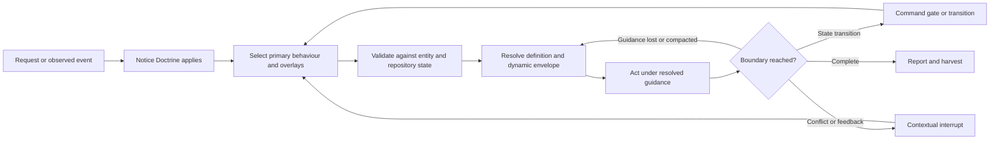
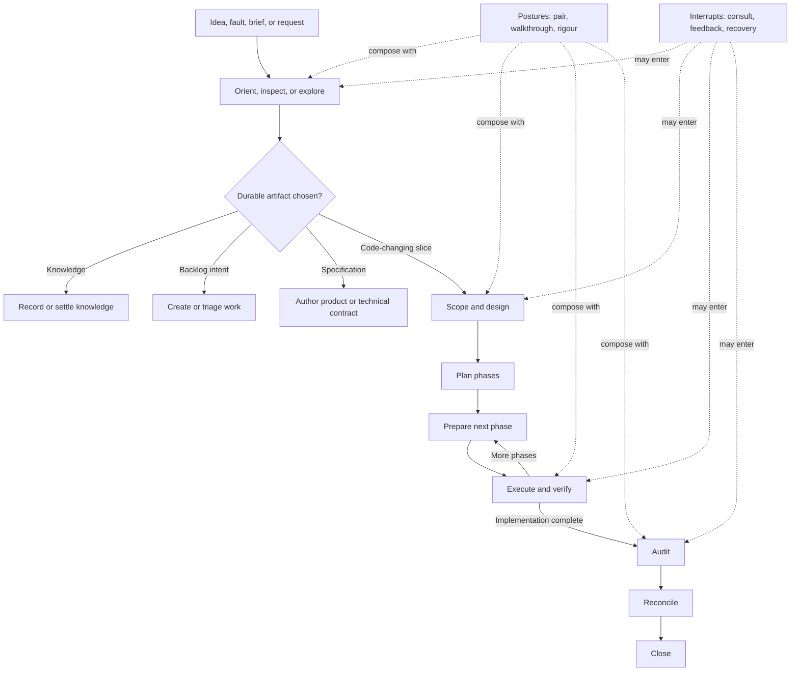

# RFC-021: Dynamic behaviours and minimal projection

## Context

Doctrine currently conflates several relationships under `install/`: assets the
binary consumes internally, material it publishes for humans and agents,
project-owned files that belong in a client repository, and behavioural prose
that a harness loads into privileged context.

`src/install.rs` embeds the whole tree and the installer projects nearly every
embedded file into `.doctrine/`. Embedding and installation are therefore the
same policy by accident. Templates, reference documents, hymns, agent
definitions, and integrations all enlarge and obscure the client-facing surface
whether or not a user can meaningfully service them.

Doctrine's skills have a related ownership problem. Harnesses preload skill
names and descriptions into privileged context and load bodies on activation.
That helps implicit activation, but the static catalog duplicates Doctrine's
lifecycle vocabulary in every harness and makes updates depend on refreshing
installed files. Much of the machinery already requires the Doctrine binary.

SPEC-023 offers another boundary: the binary can select and compose Markdown
guidance by harness, model traits, role, stage, and project. Doctrine could own
canonical behaviour definitions and serve contextual guidance through a stable
harness protocol instead of treating copied skill files as the primary source
of behavioural truth.

That direction is attractive but not free. Tool calls add latency and
transcript tokens, stochastic tool-call ids can invalidate prompt-cache
suffixes, and dynamic guidance does not automatically inherit the effective
authority or activation reliability of privileged harness instructions. A
smaller static catalog could improve ownership and context economy while making
Doctrine easier to miss. A Doctrine-owned corpus could improve coherence while
becoming harder to inspect, patch, or use when the binary is unavailable.

The question is therefore not whether static skills should be replaced by one
dynamic router. It is how Doctrine should divide ownership, publication,
projection, activation, resolution, and enforcement so that the resulting
system optimizes adherence, determinism, token efficiency, operational clarity,
and user control together.

## Three separately decidable claims

This RFC advances three separately decidable and falsifiable claims with
controlled dependencies. Evidence for one must not be allowed to lend unearned
certainty to another, but neither should their interfaces be treated as someone
else's problem.

| Claim | Direction | Present confidence |
| --- | --- | --- |
| **C1 — semantic ownership and minimal projection** | Embedding, publication, and project installation should be explicit, separate policies. Stable project paths should be reserved for content with operational, integration, discoverability, or user-control value. | High |
| **C2 — Doctrine-owned behaviour definitions** | Doctrine should own canonical behaviour definitions, contextual composition, local workflow semantics, validation, and supported override seams. Harness files should be adapters rather than parallel behavioural implementations. | Moderately high |
| **C3 — workflow-derived activation** | The privileged and dynamic activators for those behaviours should be designed from explicit workflow maps and empirical adherence evidence. No particular activator, including `/route`, is presumed primary. | Open and experimental |

C1 remains valuable if dynamic behaviours fail. C2 remains valuable if several
behaviours permanently require privileged activation descriptions. C3 may
produce a route-like general entrypoint, a compact generated trigger catalog,
several interrupt-style hooks, transition-local activation, or a hybrid.
Progressive disclosure does not require identical disclosure policy for every
behaviour.

The dependencies are material. C2 needs C1-quality publication and explanation
surfaces to remain inspectable. C3 experiments depend on C2's resolver semantics
and presentation, so an adoption failure may indict delivery rather than
activation. C2 may in turn require C1 to project adapters, recovery material, or
development bundles. Each claim can be accepted or rejected separately, but its
boundary conditions travel with it.

## Semantic ownership and explicit projection

The information-architecture principle is:

> A client installation contains only files whose presence at a stable project
> path is operationally necessary or materially improves project-level
> discoverability, integration, control, or supported customization. Other
> Doctrine material remains framework-owned and is exposed intentionally.

Project ownership is one reason to project a file, not the criterion itself. A
framework-managed `.gitignore`, discoverable configuration surface, or required
harness adapter may legitimately occupy a stable project path. Conversely,
framework-owned material may be public, auditable, copyable, or customizable
through a declared seam without being installed by default. Every projected
file must have an explicit owner, mutation policy, and project-level reason to
exist.

Physical roots should follow semantic ownership. A candidate source shape is:

```text
templates/      artifact and configuration templates
hymns/          composable guidance and exposed fragments
behaviours/     sealed definitions and registry metadata
reference/      curated explanatory material
integrations/   scripts, workflows, modules, harness assets
install/        base projection policy and its projected files
memory/         shipped memory corpus
```

Exact names are downstream design work. The invariant is that `install/` ceases
to own material merely because the binary embeds it.

Embedding and publication are also distinct. A library manifest declares which
assets are public, with stable logical address, source, content kind, title or
summary, licence, and customization status. An embedded file does not become
public API accidentally, and Doctrine ownership does not make a published asset
opaque.

At least five properties must remain independent:

```text
Doctrine-owned       canonical responsibility and change authority
Doctrine-versioned   compatibility and provenance identity
Doctrine-distributed delivery with an application release or content package
Doctrine-embedded    compiled into the executable as one storage mechanism
runtime-loaded       selected from an external or development source at runtime
```

Embedding may be an excellent production default without becoming the only
development, experimentation, packaging, or emergency-repair mechanism.

### Curated library and federated search

`doctrine library` is the candidate read-only API for published Doctrine
material, regardless of whether its production source is embedded or externally
packaged:

```text
doctrine library list [path]
doctrine library tree [path]
doctrine library show <logical-path>
```

Logical paths are stable POSIX-like addresses independent of embed layout.
`show` emits clean bytes to stdout for piping. Semantic materialization remains
with the owning feature; the library does not install or overwrite project
files.

Initial collections may include entity and configuration templates,
overridable hymns, curated references, and selected scripts, workflows, Just
modules, and similar reusable sources. Publication policy must be deliberate:
"embedded," "published," "customizable," and "projected" are four independent
properties.

Publication and licence are separate metadata. MIT is the candidate licence for
material people reasonably need to copy or adapt through supported
customization: authoring schemas, examples, editable starters, selectors, and
declared seams. Shipped process bodies, internal registry definitions, engine
contracts, orchestration knowledge, and other internals remain GPL even when
represented as prose. The classification rule must be crisp and auditable;
semantic categories that users cannot predict would make the library surprising
and difficult to govern.

Bare `doctrine search <query>` should search every discoverable corpus. Known
results remain retrievable through native commands such as `memory show`, `rfc
show`, and `library show`. Unified search exposes only common discovery
arguments; specialized query languages remain on native searches.

Human results are grouped by corpus rather than globally interleaved. Provider
scores are not necessarily comparable, and memory results retain trust,
severity, and staleness. Machine output has a common outer envelope with typed
result groups.

### Minimal project installation

One candidate harness-independent base installation is:

```text
.doctrine/
├── .gitignore
├── boot-project.md
└── doctrine.toml
```

- `.gitignore` owns disposable paths beneath `.doctrine/`; installation stops
  modifying the repository root ignore file.
- `doctrine.toml` is the fully commented example written as the real config
  when absent. It is an important onboarding cue despite built-in defaults.
- `boot-project.md` contains concise project orientation and pointers.

An alternative retains a fourth `.doctrine/governance.md` for low-volatility,
high-consequence standing rules while `boot-project.md` carries more volatile
orientation and onboarding content. Shared boot placement is not sufficient
reason to combine them: volatility, trust approval, cache behaviour, mutation
authority, and lifecycle should decide the boundary. One physical file with
separately trusted sections is possible but is likely harder to review and
explain.

Installation names the orientation surface as the primary project-specific
onboarding step; `doctor` may report an unchanged placeholder as advisory.
Behaviours may propose improvements, but an agent requires explicit user
acceptance to edit any high-leverage authoritative surface.

Entity roots are created on first use. Hymns appear on disk only when a
customization is materialized. Templates, docs, workflows, scripts, `mod.just`,
agent definitions, and integrations are not base projections. A selected
harness may install the specific adapter it requires.

This projection is directional rather than pre-approved implementation detail.
The specification must justify each stable path by operational necessity,
discoverability, integration, control, or supported customization; declare its
owner and mutation policy; and test whether removing every other file preserves
onboarding, inspection, customization, offline recovery, and advanced-user
workflows. The three-file and split-governance candidates should both remain
live until those criteria are applied.

Existing-install migration is out of scope for the first implementation: there
is no meaningful external user base, and cleanup machinery would add code
without present value.

## Doctrine-owned behaviours

`behaviour` names a registry-owned unit of active guidance. The current corpus
suggests several composition roles rather than a closed two-case ontology:
primary processes (design, audit, close), overlays or postures (pair,
walkthrough), interrupts (consult, feedback), and recovery/bootstrap guidance.
A behaviour may suspend, redirect, resume, or compose with another; the final
role vocabulary and compatibility algebra must descend from workflow analysis
rather than being fixed here. A harness adapter establishes when and how
resolved Doctrine guidance is to be treated as active instruction; it is not a
second implementation of the behaviour.

Doctrine should own canonical identity and markers, composition roles,
compatibility, required inputs, local lifecycle predicates and transitions,
selection, composition, validation, and executable enforcement. Hymns own
agent-facing prose, model/harness/role adaptations, project policy, and declared
refinements. Hymns are selected content, not a programming language:
conditional judgment happens in the agent or between smaller processes.

The existing SPEC-023 cascade should be reused and generalized rather than
duplicated. Core definitions are sealed and contain every instruction required
to perform the process correctly. Optional examples and references may remain
pull-based; required steps must not hide behind an optional lookup.

Doctrine ownership does not prescribe storage. Canonical definitions may ship
as embedded defaults, a versioned bundle beside the binary, a signed content
package, or an embedded production corpus with an external development
override. The storage and deployment design must preserve version compatibility,
reproducibility, inspection, A/B experimentation, and a clear production trust
boundary without requiring the agent to reason about those mechanics.

### Workflow semantics boundary

C2 necessarily owns a partial workflow state machine. Calling it anything else
would only scatter the same transition knowledge across commands and prose. In
scope are declared local validity predicates, named states and transitions,
current-state inspection, compatibility rules, and atomic enforcement at the
commands that mutate Doctrine state.

Out of scope are a generic state-machine interpretation language, autonomous
multi-step execution, generalized recovery planning, and an engine that can
derive arbitrary workflows from registry metadata. Later design may decide
whether repeated local semantics justify such an engine, but this RFC neither
requires one nor pretends that it owns no workflow semantics.

Projects cannot replace a whole core behaviour. The registry declares named
default fragments users may customize, such as commit policy, review
priorities, or candidate promotion. Each exposed fragment has stable identity,
purpose, default hymn, applicable behaviour, licence, and eventually any
insertion seam. Project-defined Doctrine behaviours are deferred; unrelated
harness-native skills remain available.

The cascade's coarse ordering may not be sufficient when a project fragment
needs locality inside a process. Preserve an extension requirement for
framework-owned semantic insertion seams, but initially rely on ordinary
project-band guidance until evidence shows anchors are needed. Line numbers,
arbitrary priorities, and a general placeholder language are not intended.

### Resolution, validity, and context economy

MCP should expose a generic behaviour-resolution capability rather than one
tool per behaviour; the CLI mirrors it through a `doctrine behaviour
resolve`-class surface. One resolution may return the active primary behaviour
composed with applicable overlays, interrupts, and contextual hymns. A process
chain resolves incrementally: audit guidance is loaded for audit, then
reconcile guidance when that transition is reached.

Three concerns should remain distinct even if one public fast path combines
them:

```text
activation / routing   notice intent and propose or select a behaviour
resolution             compose its definition and contextual state
validation             accept or refuse an input, action, or transition
```

This is an internal responsibility split and test seam, not a commitment to
three public commands.

Two resolver payloads must not be conflated:

- the **behaviour definition** has stable content identity and is composed from
  identified, versioned fragments;
- the **resolution envelope** contains point-in-time selection, authority,
  applicability, and state facts, with declared refresh boundaries.

A definition is immutable for a particular content identity, but it is not
unconditionally valid for a whole session. Its applicability is bounded by the
axes that selected it: framework and protocol version, harness, model traits,
role, project configuration, accepted override set, and any other declared
inputs. A changed selection fingerprint may require a new definition even when
the previous bytes remain available.

The resolver is initially session-stateless. Doctrine does not remember what an
agent has viewed. After compaction or lost guidance the full definition remains
recoverable. Stable identity supports provenance, reproduction, and
adapter-managed caching, but this RFC does not prescribe a hash-negotiation
protocol or require an unaided agent to retain and return cache keys. Where
Doctrine observes a transition, the transition command should return or require
the next envelope rather than depending on the agent to remember a distant
refresh instruction.

Session-aware elision, speculative memory matching, and automatic reference
inlining are future optimizations. Static references may be inlined where
clearly worthwhile; dynamic data must not masquerade as durable guidance. The
goal is to minimize avoidable tool boundaries while preserving meaningful
information boundaries, not to minimize calls at any cost.

### Resolver epistemics

A resolver must not launder an agent's uncertain self-report into a Doctrine-
branded decision. Inputs and outputs need typed provenance at least sufficient
to distinguish:

- facts Doctrine derived from current repository, entity, configuration, or
  workflow state;
- artifact identifiers or content Doctrine inspected directly;
- direct user declarations and accepted project authority;
- agent observations and classifications;
- agent recommendations;
- unresolved unknowns.

Doctrine should derive every mechanically available fact itself and should
treat agent-provided classifications as fallible proposals. Validation should
test the governing artifacts and current state rather than merely confirming
that the agent's submitted story is internally consistent. Outputs must retain
the epistemic status of assumptions and unknowns instead of converting them
into facts by repetition.

### Authority and trust

Resolved guidance needs an explicit harness contract establishing that it is
active Doctrine instruction. Doctrine cannot make ordinary tool output
literally acquire system-message placement merely by labelling it authoritative;
effective adoption is a harness capability and an empirical model-adherence
property. The protocol should reinforce the distinction between active
instructions, project overrides, dynamic state, untrusted evidence, and
optional reference material without paying a large repeated provenance tax.

Within Doctrine's domain, the intended authority is:

```text
direct user instruction
  > accepted project-local authoritative truth
  > Doctrine framework rules
  > agent judgment
  > repository-supplied but unaccepted instructions
  > untrusted, stale, conflicting, or superseded artifacts
```

Project-local presence is not acceptance. A clone, branch switch, pull,
template, collaborator, or agent commit may introduce guidance the current user
has never reviewed. A defined trust mechanism must establish which repository,
revision, signer, authoritative surface, or content identity the user accepts;
detect relevant changes; and determine when re-acceptance is required. The
mechanism may be supplied by the harness or Doctrine and is downstream design,
but the distinction is architectural.

Normal framework guidance need not repeatedly explain its own authority. An
accepted project override is visibly marked and supersedes its corresponding
default without escalation because the applicable trust decision has already
expressed user intent through a supported control surface. Unaccepted project
guidance remains advisory or untrusted according to policy. Memories lack
instructional authority. Any inlined memory or untrusted artifact carries
explicit provenance and trust framing.

An unexpected contradiction between independent authoritative sources is
different from a declared override and may be fresh drift. Conflicts between
normative truth and empirical evidence or a lower-authority artifact sometimes
admit a small factual correction without interruption, but incorrect autonomy
is costlier than unnecessary escalation and different models warrant different
latitude.

## Workflow-derived activation

Doctrine should not select its privileged catalog by starting with existing
skill names or assuming the primacy of `/route`. It should first diagram the
workflows it intends to support, including entry signals, state transitions,
decision boundaries, interruptions, recovery paths, and deterministic command
gates. Activators are then placed where each workflow needs reliable noticing,
selection, continuation, or recovery.

The generic behavioural path is:



The principal lifecycle is only one workflow family, and postures and
interrupts cross-cut it:



These diagrams are orientation, not a complete workflow specification. The
design exercise must enumerate at least:

- explicit behaviour requests and natural-language equivalents;
- bare entity orientation and read-only recommendation;
- `continue <ENTITY-ID>` and other bounded autonomy signals;
- handovers and fresh-context recovery;
- amorphous shaping, diagnosis, and artifact choice;
- lifecycle processes and phase loops;
- posture composition and process chains;
- mid-flight conflicts, feedback, surprises, and escalation;
- deterministic transition prerequisites and refusals;
- exact, request-scoped bypass;
- compaction, unavailable tooling, protocol mismatch, and stale guidance.

For every enumerated workflow edge, record what must be noticed, whether the
trigger is semantic or mechanically observable, the consequence of missing it,
where it can be enforced, and which activator supplies recovery. The result is
an activation-coverage map, not a restatement of the current skill catalog.

That map is not a completeness model for semantic agent work. Architectural
implications, reframing evidence, brainstorming intent, and judgment-sensitive
surprises may not correspond to a known edge. Evaluation and design must keep
three evidence classes distinct:

```text
enumerated workflow coverage    known processes, transitions, and command gates
open semantic trigger coverage  meaning classifications sampled by test cases
uncategorized observed failures cases the current map and taxonomy do not explain
```

Uncategorized failures remain first-class evidence and may expand or falsify
the map. They must not be forced into an existing edge to manufacture a false
coverage denominator.

### Activator palette

Candidate mechanisms are complementary rather than mutually exclusive:

- **privileged activation interrupts** — terse, cacheable descriptions for
  semantic triggers whose omission would fail silently or cause material harm;
- **a general orientation or routing adapter** — useful when the request is
  substantive but the artifact or next process is unresolved;
- **explicit `#name` markers** — high-confidence, harness-neutral user signals;
- **ordinary natural-language inference** — appropriate where models classify
  intent reliably and validation catches mistakes;
- **entity and continuation signals** — identifiers, handovers, lifecycle state,
  and bounded-autonomy phrases interpreted with deterministic context;
- **transition-local outputs** — commands emit or require the next resolution
  when Doctrine observes a state change;
- **tool-local prerequisites and refusals** — deterministic gates at the point
  where an invalid action would occur;
- **recovery/bootstrap guidance** — stable instructions for missing binaries,
  protocol mismatch, compaction, and lost active definitions.

The privileged control plane should be scarce, not presumptively singular. Its
job is noticing, authority establishment, protocol bootstrap, and recovery.
Doctrine owns behavioural substance, contextual composition, and validation.
Commands enforce every rule they can observe. The eventual catalog is the
smallest set that provides acceptable activation coverage, not the smallest set
that can be made to pass one favorable demonstration.

Every activator candidate must also declare its deployment and refresh model
per harness: where it is generated, when the harness loads or snapshots it, how
binary or corpus upgrades refresh it, how semantic and protocol compatibility
are checked, and what happens when the harness cannot update it dynamically.
Centralizing behaviour bodies while leaving privileged activation metadata
stale does not solve activation drift.

Registered `#name` markers remain natural-language signifiers, not a workflow
expression grammar. Processes can form an evident sequence and postures can
compose:

```text
#audit #reconcile #close SL-123

Let's #walkthrough this code, #pair on refactoring, then #reconcile and #close.
```

Doctrine need not formally parse marginal combinations. An unclear pile of
markers is an ambiguous request and should be clarified rather than assigned
invented precedence rules. Explicit invocation takes precedence over inferred
next action, subject to compatibility validation; it does not disable implicit
activation.

Doctrine aspires to remain default-on, but that is a C3 feasibility question
rather than a self-enforcing invariant:

> Can each supported harness enforce Doctrine-default-on without requiring a
> resolver call for every substantive request?

An implementation must identify its actual mechanism: a universal substantive-
task check, a mechanical harness pre-hook, or activation hooks with a measured
residual miss rate. The third cannot claim perfect coverage by definition. The
prompt, latency, and tool tax of the first two are experimental costs, not
details to hide. Only the exact, request-scoped user token `BYPASS-DOCTRINE`
suspends Doctrine once a supported default-on mechanism is active. Bypassed
turns end with `[BYPASS]: short description` and do not nag the user to re-enter
routing.

### Deterministic enforcement hierarchy

Dynamic prose should not become a sophisticated substitute for application
invariants:

```text
Enforce in code when Doctrine can observe the condition.
Require an explicit agent operation when the condition is not directly observable.
Use standing behavioural prose for genuinely semantic judgment.
```

If `close` requires reconciliation, the transition can refuse. If candidate
promotion has prerequisites, the promotion command can verify them. If a state
transition invalidates an envelope, the command can return the next operation.
Activators are most important where the system cannot mechanically observe that
a semantic event occurred.

Safety-relevant validation belongs at the final mutating operation against
current state. Earlier resolution or validation is orientation, not a durable
authorization. Mutating commands should atomically validate and transition
where possible, or carry explicit optimistic-concurrency preconditions such as
expected entity revision, workflow state, or Git HEAD. A stale envelope must
not convert "valid twelve tool calls ago" into permission now.

### Contextual escalation as an exemplar

The existing `/consult` skill describes an action rather than a magical
process: when the user is present, raising the issue directly is consulting.
Agents nevertheless adhere poorly to judgment-triggered instructions compared
with immediate commands or tool-local prerequisites.

A future escalation resolver is therefore a strong test of dynamic, contextual
policy. The agent initiates it when a qualifying conflict appears and identifies
the governing artifact and conflicting evidence. Doctrine derives the active
workflow, repository and entity state, accepted authority, applicable autonomy
directive, and other mechanically available facts. The agent may propose
classifications such as interruption cost, factual versus architectural
significance, reversibility, scope, and a recommended resolution, but those
remain fallible assertions rather than resolver facts.

Model-sensitive policy returns one of two operational outcomes:

- `proceed`, with bounded authority and instructions to record or report the
  correction; or
- `escalate`, with a contextually appropriate question to put directly to the
  user.

The unresolved problem is noticing the qualifying conflict. Workflow mapping
must decide where the trigger is reinforced: privileged interrupts, active
behaviour runlists, tool or transition gates, or some combination. A complete
escalation decision model—and any generic interpretation, autonomous execution,
or recovery-planning engine above the existing locally enforced workflows—is
downstream work. This RFC preserves the seam rather than defining those engines.

## Design tensions and operating principles

The following tensions are inputs to later specification and design, not
incidental implementation risks.

### Activation is recursively dependent on activation

Policy hidden behind a resolver cannot help an agent notice that it should call
the resolver. Every important workflow class needs a kernel-recognizable or
mechanically reinforced activation path. Silent omission is more dangerous than
a hard protocol failure because the agent may appear coherently governed under
the wrong process.

**Principle:** design activation coverage from workflow edges and measure
noticing separately from downstream task success.

### Ownership and activation policy are separate

Canonical binary ownership eliminates drift and enables contextual composition;
it does not prove that all activation metadata should leave privileged context.

**Principle:** centralize behavioural substance while treating privileged
activation coverage as an independently budgeted reliability layer.

### Declared authority is not privileged placement

A protocol can identify active Doctrine instructions, but effective authority
depends on harness support and model adherence. Recent or concrete lower-trust
text may still dominate an abstract hierarchy.

**Principle:** make instruction, override, state, evidence, and reference
boundaries unmistakable; test adoption rather than assuming it.

### Repository presence is not project authority

Cloned or updated repositories can contain high-leverage instructions that the
current user did not author or approve. Treating every local file as authority
would let provenance disappear at the filesystem boundary.

**Principle:** separate repository-supplied content from accepted project
authority; make the trust anchor, accepted scope, change detection, and
re-acceptance policy explicit.

### Doctrine ownership can become opacity or rigidity

Centralizing prose under Doctrine improves coherence but may make debugging,
auditing, experimentation, packaging, and advanced customization harder if
ownership is equated with executable embedding.

**Principle:** observability is part of the behaviour contract. Provide
`behaviour show`, resolution explanation, exact fragment ordering and identities,
selection axes, visible overrides, route rationale in diagnostic mode, and
reproduction from recorded inputs. Select embedding and runtime-loading policy
separately from canonical ownership.

### Availability replaces staleness as a failure mode

Removing copied fallbacks avoids stale imitation but makes a compatible binary
and resolver operational dependencies. Hard failure may be correct, but it is
not free.

**Principle:** test unavailable-tooling and protocol-mismatch recovery
explicitly. Choose failure and fallback policy from evidence, not cleanliness
alone.

### Project overrides are control-plane mutations

`boot-project.md`, governance files, hymn fragments, selectors, and override
mappings can change high-leverage agent behaviour. This is not usefully reduced
to generic prompt injection; the relevant risks are absent trust establishment,
unauthorized mutation, misleading provenance, over-broad selectors, and
expansion beyond a declared seam.

**Principle:** require a defined trust decision and change-detection policy,
explicit diffs where approval is required, affected-behaviour and selector-reach
visibility, preserved provenance, and validation that only declared seams can
override sealed defaults.

### Static adapters and registries can drift semantically

Protocol versions catch structural incompatibility but not a timeless-looking
stub whose activation concepts no longer cover the registry.

**Principle:** add conformance checks between reserved signals, activator
coverage, registry behaviours, refresh operations, and override seams.

### Deferred refresh instructions are fragile

Agents may skip an invalidation rule many turns after reading it, and not every
harness exposes compaction as a reliable event.

**Principle:** couple refresh to observable commands and transitions where
possible; keep explicit recovery paths where the harness or agent must notice
context loss.

### Default-on needs an implementable mechanism

No instruction can make Doctrine default-on after every relevant activator has
already failed. Universal checks and mechanical pre-hooks carry real cost;
coverage-based hooks retain a residual miss rate.

**Principle:** treat default-on as a per-harness feasibility and cost question,
state the operative mechanism, and measure both misses and unnecessary checks.

### Minimal projection can reduce user control

An unprojected asset can still be something a user reasonably wants to inspect,
copy, fork, or repair offline. Filesystem visibility and service ownership are
different, but both matter.

**Principle:** pair minimal projection with a stable published library,
materialization paths for supported customizations, and an explicit offline and
failure-recovery story.

### Projection boundaries must follow volatility and risk

Orientation, onboarding hints, standing governance, and authority conventions
may all enter boot context while changing at different rates and carrying very
different consequences. Combining them can cause cache churn and all-or-nothing
trust approval; splitting them adds surface area.

**Principle:** choose physical project boundaries by volatility, trust,
mutation authority, consequence, and lifecycle as well as footprint.

### Workflow maps have an open-world boundary

Known lifecycle edges can be enumerated, but semantic surprises and reframings
do not form a closed transition set.

**Principle:** use maps for known workflow coverage while retaining open
semantic tests and uncategorized failures as independent evidence.

### Licence boundaries can surprise

Publication, customization, and licence do not collapse into one property.
Prose that looks like an editable template may still encode GPL process logic.

**Principle:** make licence rules predictable, manifest-driven, and auditable
before inviting copying through the library.

### The RFC contains three programs

Install/library information architecture, behaviour delivery, and contextual
escalation share principles but have different evidence and failure modes.

**Principle:** specify and stage them independently. Do not hold C1 hostage to
C3, and do not let a successful dynamic delivery experiment imply successful
implicit activation.

## Evaluation and staged descent

Evaluation begins with workflow inventory, not catalog deletion. The authored
workflow map and activation-coverage matrix provide the fixed basis for known
processes, while the semantic-trigger corpus and uncategorized-failure ledger
remain open to evidence the map does not contain.

### Stage 1 — ownership and projection contract

Specify semantic roots, publication metadata, library inspection, search
federation, project projection, materialization, licence, trust boundaries, and
recovery. Compare the three-file and split-governance installations against
onboarding, authority, cache stability, and customization workflows before
treating either as settled.

### Stage 2 — dynamic delivery without activation collapse

Create the behaviour registry and move a small, contrasting set of canonical
bodies behind it while existing privileged activators delegate to the resolver.
Exercise at least one embedded or production-style source and one external
development or experiment source. Include an explicit primary process, a
semantically inferred process, and an overlay or interrupt. This isolates
whether resolved guidance can be composed, adopted, followed, refreshed,
explained, and recovered without simultaneously changing discovery.

### Stage 3 — activator experiments

Derive candidate static and dynamic activator sets from workflow coverage.
Reasonable variants include:

1. the current static skill catalog delegating to canonical definitions;
2. a compact generated trigger index plus dynamic resolution;
3. a general route/orientation adapter plus selected activation interrupts;
4. explicit markers and transition-local activation reinforced by a minimal
   default-on bootstrap;
5. other hybrids justified by the workflow map.

No variant is the architectural favourite in advance. Results may justify
different activators for different behaviours. Each variant includes its actual
per-harness deployment and refresh path; a generated catalog with no update
mechanism is not a complete variant.

### Adherence pipeline

Task outcome alone is too noisy. Record each stage independently:

1. **Notice** — did the agent recognize that Doctrine applied?
2. **Select** — did it choose the correct primary behaviour and overlays?
3. **Invoke** — did it call the resolver or required operation?
4. **Adopt** — did it treat returned guidance as active instruction?
5. **Adhere** — did it follow the required process?
6. **Refresh** — did it re-resolve when validity or state changed?
7. **Recover** — after compaction, interruption, or tooling failure, did it
   restore the right guidance?
8. **Complete** — was the substantive result correct?

This decomposition distinguishes the need for stronger activation metadata,
clearer resolver output, a deterministic gate, better transition coupling,
model-specific prose, or abandonment of dynamic delivery for a behaviour.
Record uncategorized failures without assigning them to the nearest known stage
until evidence supports that classification.

### Corpus and deployments

The fixed corpus covers explicit and implicit activation, bare entity
orientation, continuation, handovers, amorphous shaping and diagnosis, process
chains, posture composition, judgment conflicts, exact bypass, newcomer
prompts, recovery, and tool unavailability. Include adversarially mundane
requests: systems often activate correctly when a prompt resembles a benchmark
and fail when the same trigger is embedded in ordinary work.

The corpus must also test false positives: trivial edits, ordinary
conversation, harmless discrepancies, requests that should remain exploratory,
and cases where artifact creation would be premature. More activation is not
automatically safer if it trains users and agents to ignore Doctrine or reach
for bypass routinely.

Run multiple fresh sessions per case in representative deployments:

- Claude Code with Sonnet;
- Pi with DeepSeek, as a capable but less adherent benchmark.

Additional models and Codex are diagnostic follow-ups where they can resolve a
specific uncertainty; a complete factorial matrix is not required. The control
comes from comparing activator variants under repeated conditions rather than
pretending to isolate every harness and model effect.

### Decision dimensions

Record activation and selection correctness, silent false negatives,
unnecessary activations and resolver calls, unnecessary user interruptions,
time to first useful action, bypass frequency and context, outcome correctness,
deterministic enforcement, transcript tokens, resident privileged tokens, tool
boundaries, cache behaviour, latency, install footprint, observability,
recovery, and agent confusion.

There is no fake scalar acceptance formula. There should nevertheless be
predeclared floors for critical dimensions—especially silent activation
failure, invalid transition acceptance, recovery, and correctness—so a favored
architecture cannot excuse a material regression after seeing the results.
Tradeoffs above those floors are holistic and must carry explicit rationale.

The evaluation should explore the Pareto frontier, reject architectures
dominated by another tested variant, enforce hard floors on safety and
correctness, and make an explicit holistic choice among the remaining
non-dominated variants across:

- adherence and recovery;
- Doctrine ownership and update coherence;
- deterministic enforcement;
- token and cache economy;
- latency and tool-boundary cost;
- operational clarity and inspectability;
- user control and supported customization.

The experiment may also support a public technical write-up on progressive
disclosure and dynamic agent guidance.

## Explicit non-goals

This RFC does not design or implement:

- cleanup or migration of existing installations;
- the final workflow specification or activation-coverage matrix;
- a predetermined route-only or catalog-free architecture;
- the final behaviour-role taxonomy or composition algebra;
- the storage location or distribution format of canonical behaviours;
- the trust-anchor storage, approval UX, or signing mechanism;
- an agent-managed content-hash cache-negotiation protocol;
- a formal `#` workflow grammar;
- project-defined Doctrine behaviours;
- internal conditional evaluation in hymns;
- semantic insertion anchors in the first implementation;
- server-side session/view tracking or automatic context elision;
- speculative reference or memory enrichment;
- a generic workflow interpretation, autonomous execution, or recovery-planning
  engine beyond locally declared and enforced lifecycle semantics;
- the complete escalation policy model;
- consolidation of handover, `/next`, handover artifacts, and thread memories.

## Outcome

**Open, with directional consensus on C1 and C2 and no selected C3
architecture.** The claims are separately decidable with controlled
dependencies. The proposed direction is:

- separate embedding, publication, customization, and project projection;
- pursue a minimal, explicitly justified base installation;
- expose published Doctrine-owned material through a curated `library` plus
  federated, grouped `search`;
- make Doctrine the canonical owner of behaviour definitions, contextual
  composition, local workflow semantics, validation, and supported override
  seams without presuming executable embedding;
- distinguish repository-supplied guidance from accepted project authority;
- diagram Doctrine's known workflow families, build an activation-coverage
  map, and retain open semantic and uncategorized-failure evidence;
- derive and empirically compare ergonomic activator sets across adherence,
  ownership, determinism, token efficiency, operational clarity, and recovery;
- retain as much privileged activation metadata as the evidence justifies, and
  no more.

This RFC should descend into multiple durable contracts rather than one slice.
Likely specification boundaries are:

1. install projection, publication, library, and search discovery;
2. workflow model, local lifecycle semantics, activation coverage, and
   semantic-trigger evaluation requirements;
3. behaviour registry, source/distribution model, resolution, epistemics,
   authority, validity, observability, concurrency, and protocol;
4. project trust establishment, hymn-cascade extensions, override integrity,
   and contextual escalation where those concerns warrant independent
   contracts.

Those specs may emit separate experimental and implementation slices. Workflow
mapping precedes activator selection; dynamic-delivery evaluation precedes
catalog reduction. Slice design, observed implementation truth, evaluation,
audit, and reconciliation should drive later revisions instead of preserving
speculation.

Open mechanisms include exact root names and manifest schema; behaviour CLI/MCP
shapes; definition identity and dynamic-envelope inputs; fragment
materialization and semantic insertion seams; workflow notation and coverage
schema; the activator set and its per-harness refresh paths; unavailable-source
policy; the accepted-project trust anchor and change-detection policy;
behaviour source and development override models; role taxonomy and resumption
semantics; validation concurrency tokens; adapter-managed caching; and the
eventual escalation decision model.

## References

- IDE-029 — Lifecycle-stage hymn seams for project customisation; the narrower
  idea that led to this umbrella direction.
- ADR-005 — Shipped knowledge is tiered by access pattern.
- ADR-011 — Harness-agnostic mechanisms and per-harness capability altitude.
- PRD-003 / SPEC-010 — Current shipped-skill and marketplace contract; likely
  revision targets if dynamic delivery proves viable.
- PRD-006 / SPEC-009 — Current install and embedded-asset projection contract.
- SPEC-023 — Prompt cascade: selection, ordering, provenance, sealing, and
  replacement.
- RFC-011 — Dispatch token efficiency; adjacent empirical context.
- IMP-059 — Harvest-pointer overlap across notes, handover, next, and reviews;
  related deferred workflow consolidation.
