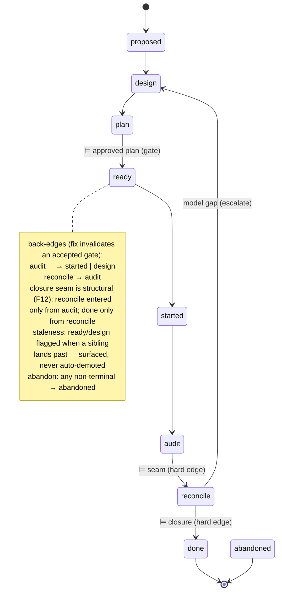

# Design SL-028: Enact ADR-003 reconcile seam and lifecycle states

<!-- Reference forms (.doctrine/glossary.md § reference forms): entity ids padded
     (SL-020, REQ-059, ADR-004); doc-local refs bare — OQ-1 (§6), D1 (§7),
     R1 (§10), Q1. -->

## 1. Design Problem

ADR-003 set the canonical loop `slice → design → plan → phases → [review] →
audit → reconcile → close` and the normative/observed doctrine behind it, but
deferred the machinery (§11). The loop's **observe → reconcile → close** capstone
(§3–§8) has no home, and two structural facts surfaced while shaping this slice:

- **The slice lifecycle is inert.** `slice-NNN.toml` `status` is hand-edited;
  there is **no transition verb**. The vocabulary `{proposed, ready, started,
  audit, done, abandoned}` predates ADR-003's reconcile step — it has no
  `reconcile` and no `review` state.
- **Doctrine deliberately diverges from spec-driver, and ADR-003 only half-states
  it.** spec-driver *derives* requirement truth from coverage by precedence
  (`sync`: `requirement.status = f(coverage)`). ADR-003 §4/§5 **forbid exactly
  that** — drift is a *prompt to reconcile*; authority is never rewritten by
  precedence. So doctrine's differentiator is **reconcile-as-explicit-authorship
  vs derive-by-precedence** — committed in §4/§5 but never named against the
  mechanism it rejects.

**The cut (D1).** This slice is a **lifecycle-FSM vertical + a holistic revision
of the canon**, not the whole capstone. It *builds* the slice FSM + transition
verb + conduct vocabulary (advisory) + the requirement/coverage enums; it
*revises* ADR-003 and authors ADR-009 so the canon expresses the full holistic
model. The reconcile machinery (skill, artefact, CLI), the coverage derivation
engine, and conduct/closure **enforcement** are deferred to follow-on slices that
attach to this locked canon.

## 2. Current State

- **`SLICE_STATUSES`** (`src/slice.rs:349`) `= [proposed, ready, started, audit,
  done, abandoned]`; the sole vocabulary authority, guarding **read/filter input
  only**. `is_terminal_status = {done}` (`:380`), `is_hidden = {done, abandoned}`
  (`:358`), `is_drifted` renders out-of-vocab stored status with `?` (`:368`),
  `is_divergent` keys on the terminal set (`:394`). **No write/transition verb** —
  the five non-`proposed` states are reached only by hand-editing (CLAUDE.md
  "no slice lifecycle transition" gap; `slices-spec.md` § Lifecycle).
- **`adr status`** (`src/adr.rs`) is the closest verb precedent — a flat
  any→any `ValueEnum` over `set_adr_status` (edit-preserving). The slice FSM is
  *ordered*, so it needs a transition classifier `adr status` lacks.
- **Edit-preserving status transition** seam exists
  (`mem.pattern.entity.edit-preserving-status-transition`;
  `adr::set_adr_status`, `backlog::set_backlog_status`,
  `backlog::validate_transition`).
- **`ReqStatus`** (`src/requirement.rs:72`) `= {pending, active, deprecated,
  superseded}` (serde kebab) — the requirement-lifecycle enum *already exists*;
  it lacks an active-work state and a hard-withdrawal terminal.
- **No `coverage` concept** exists anywhere in `src/`.
- **No `doctrine.toml`.** `.doctrine/governance.md` is a thin *pointer* layer,
  explicitly not a knobs file.
- **`/audit` over-reaches the §7 seam** — it currently *writes* spec/governance
  fixes ("design was wrong → reconcile `design.md`"). Identification-only is the
  ADR-003 §7 target; this slice *names* the violation, the fix is follow-on.

## 3. Forces & Constraints

- **ADR-003** §4 (specs own normative truth; audit = observed evidence), §5
  (drift reconciled explicitly, never by precedence), §7 (audit identifies /
  reconcile writes), §8 (closure gate), §9 (PROD/TECH lifecycle states), §10
  (ceremony shapes strictness not truth), §11 (deferred machinery, stable target).
- **ADR-004** — relations stored outbound-only; ADR-009 cites ADR-003 outbound.
- **ADR-006** — D8 solo/team coordination branch (the `conduct.actor` fold);
  D5 branch-point check (the FSM staleness phenomenon); storage tiers pre-adapt
  (authored disjoint per slice, runtime per-worktree).
- **House posture** — write-time gating is deferred *by design*; the read surface
  **tolerates** out-of-vocab status and **surfaces** drift rather than rejecting.
  The transition verb must match: surface, don't block.
- **No parallel implementation** — extend `ReqStatus`, do not stub a second
  lifecycle enum; reuse the `set_*_status` seam, the `validate_statuses` guard,
  the `ValueEnum` pattern.
- **Storage rule** — `doctrine.toml` is user-owned authored config (committed,
  like `governance.md`), not a doctrine entity (no id); no derived/queried data.
- **Clippy denies** — `HashSet`/`HashMap` banned → `BTreeMap`
  (`mem.pattern.lint.disallowed-types-collections`); suppress with
  `expect(reason=…)` never bare `allow` (`mem.pattern.lint.expect-not-allow`);
  self-clearing `dead_code` for the leaf-ahead-of-consumer
  (`mem.pattern.lint.dead-code-self-clearing-leaf`).
- **Pure/imperative split** — `classify` and `resolve` are pure; the date is
  shell-injected (`clock::today()`); disk/parse in the thin shell.

## 4. Guiding Principles

- **Name the whole; build the vertical.** The canon (ADR-003 + ADR-009)
  expresses the full holistic model so it is not locked blind; the code is a thin
  FSM vertical.
- **Surface, don't block — except the closure seam.** The FSM is *encoded as data*
  and the verb *classifies* a move; out-of-vocab, leaving-terminal, and the two
  closure-seam edges (`→ reconcile`, `→ done`) hard-refuse — everything else writes
  and surfaces. Humans drive any non-seam skip; agents see the move flagged.
  (ADR-003 §5 read-surface posture; §7/§8 closure spine — F12.)
- **Explicit reconcile, never derive.** `ReqStatus` is authored/normative;
  `CoverageStatus` is observed evidence; doctrine reconciles them by explicit
  authorship, never `ReqStatus = f(coverage)`.
- **Conduct is orthogonal to the FSM.** *What* the loop is (axis A, states) is
  separate from *how it is conducted* (axis B, `actor × autonomy`). Peer review
  is a conduct role assignment, not new states.
- **DRY the vocabulary** — extend `ReqStatus`; reuse the status-transition seam.

## 5. Proposed Design

### 5.1 System Model

Three **orthogonal** structures, only the first two of which gain machinery here:

1. **Slice lifecycle FSM** (axis A) — how a *change* moves. Built: vocabulary +
   transition verb + classifier.
2. **Conduct axis** (axis B) — `actor × autonomy` per state, advisory. Built:
   vocabulary + `doctrine.toml [conduct]` parse + surfacing.
3. **Requirement/coverage** (the deferred engine) — two enums land as vocabulary
   only; derivation/registry/blocks deferred.

### 5.2 Interfaces & Contracts

**Transition verb** (`src/slice.rs`, wired in `src/main.rs`):

```
doctrine slice status <id> <state> [--note <s>]
```

- `state: SliceStatus` — a `clap::ValueEnum` mirroring the expanded
  `SLICE_STATUSES`, guarded by `validate_statuses` (reused).
- Pure classifier:
  ```rust
  enum Transition { Advance, BackEdge, Skip, Abandon, Noop, FromTerminal, SeamBreach }
  fn classify(from: &str, to: &str) -> Transition;
  ```
- `set_slice_status(root, id, to, note, today) -> Result<…>` — edit-preserving
  (`DocumentMut`), no-op guard before write, F-1 refuse on malformed (missing
  scaffold key), shell-injected date.
- **Hard-refuse:** `to` out-of-vocab; `from ∈ {done, abandoned}` (`FromTerminal`
  — reopening deferred); and the **closure seam** (`SeamBreach`, F12) — `to =
  reconcile` from any `from ≠ audit`, or `to = done` from any `from ≠ reconcile`.
  All other moves write and print their classification (+ the conduct posture).
- **Closure seam is structural (F12).** `audit → reconcile → close` is ADR-003's
  closure spine (§7/§8); a verb that wrote `started → done` (classified `Skip`)
  would author a "closed" slice whose specs were never reconciled, and
  `is_divergent` (phase-rollup only, not spec drift) would not flag it. So the two
  seam-entry edges are refused structurally — distinct from *conduct* enforcement
  of the soft gates (`plan`, etc.), which stays deferred/advisory (ADR-003
  §8/§11). Everything off the seam remains classify-don't-jail.
- **Transition-terminal is its own predicate (F13).** The FromTerminal set
  `{done, abandoned}` is a **third** slice-status predicate, distinct from
  `is_terminal_status` (divergence, `{done}`) and `is_hidden` (presentation,
  `{done, abandoned}`). The verb must **not** reuse `is_terminal_status` (adding
  `abandoned` there false-flags `⚠` on abandoned-incomplete slices — `slice.rs`
  comments forbid it) nor `is_hidden` (a presentation predicate, semantically
  unrelated). Add `is_transition_terminal(status) -> bool` beside the others,
  documented as the reopening-refusal set; the three predicates diverge by design.

**Conduct** (`src/conduct.rs`, new):

```rust
enum Actor    { Agent, Author, Peer, Team }     // serde: Author renames to "self"
enum Autonomy { Auto, Draft, Gate }            // serde kebab
struct Conduct { actor: Actor, autonomy: Autonomy }
fn resolve(cfg: &ConductConfig, state: &str) -> Conduct;   // pure, default fallback
```

`doctrine.toml [conduct]` schema:

```toml
[conduct]
default-actor    = "self"
default-autonomy = "auto"
[conduct.plan]      # the "no code without an approved plan" gate
autonomy = "gate"
[conduct.reconcile] # the closure gate (ADR-003 §8)
autonomy = "gate"
```

`slice status` resolves the **source** state's exit posture — `resolve(from)`,
since `autonomy` governs advancing *out* of a state, so `reconcile = gate` gates
`reconcile → done` (the closure gate) and `plan = gate` gates `plan → ready` (the
approved-plan gate) — and **prints** it (e.g. `reconcile → done [conduct:
self/gate — human acceptance expected]`). Resolving the *target* would gate the
wrong edge (entering `plan` rather than leaving it). **Never blocks in v1.**
`slice show` displays the current state's exit posture (`resolve(current)`).

**Enums** (`src/requirement.rs`):

```rust
enum ReqStatus { Pending, InProgress, Active, Deprecated, Retired, Superseded }   // +InProgress +Retired
enum CoverageStatus { Planned, InProgress, Verified, Failed, Blocked }            // new, stub
```

Documented meanings (carried to `spec-entity-spec.md` + ADR-003):
*pending* not started · *in-progress* under active work · *active* in force,
verified · *deprecated* soft — still honoured, discouraged · *retired* hard —
withdrawn, no successor · *superseded* replaced by a named successor
(`supersedes` edge).

### 5.3 Data, State & Ownership

- **Vocabulary** `SLICE_STATUSES = [proposed, design, plan, ready, started,
  audit, reconcile, done, abandoned]` (no `review` state — F11) — **purely
  additive**; every prior token survives, so existing slices need **no
  migration**. `is_terminal_status`
  (`{done}`, divergence) and `is_hidden` (`{done, abandoned}`, presentation)
  unchanged; the transition verb adds a **third** predicate
  `is_transition_terminal` (`{done, abandoned}`, reopening-refusal) rather than
  overloading either (F13).
- **`doctrine.toml`** — project-root, **authored/committed** (user-owned config,
  the structured sibling of `governance.md`); located via `root::find`. Absent →
  baked defaults. Not a doctrine entity.
- **Conduct defaults** (baked, when file/key absent): `actor = self`, `autonomy =
  auto` everywhere, **except `plan` and `reconcile` default to `gate`** — the two
  load-bearing human gates expressed in a zero-config repo.
- **`ReqStatus` / `CoverageStatus`** — owned by the requirement entity
  (`requirement-NNN.toml`); `CoverageStatus` has no producer yet (stub).

### 5.4 Lifecycle, Operations & Dynamics

The FSM (carried verbatim into ADR-009):



- **Gates-as-transitions**, except `ready` — the lone gate-as-state, the "no code
  without an approved plan" human handoff. `design-ready` dropped: reaching
  `plan` *is* design-accepted. **No `review` state (F11):** per-phase review runs
  *during* `started` (ADR-003 §6); the whole-slice read *is* `audit` (§7).
- **Closure seam is structural (F12).** Entering `reconcile` (only from `audit`)
  and `done` (only from `reconcile`) are **hard-refused** otherwise — `audit →
  reconcile → close` is ADR-003's closure spine; a blessed `started → done`
  writer would author an unreconciled "closed" slice that no read-side detector
  surfaces. The softer gates stay classify-don't-jail.
- **Back-edge predicate** (human/skill judgement, not verb-enforced): stay
  in-state for a correction that doesn't invalidate an accepted gate; fall back to
  `started` (re-exec) or `design` (redesign) when it does; `audit` remediation
  lands **upstream** (audit never fixes in place, §7).
- **`reconcile → design`** — escalation when reconcile finds the spec/governance
  *model* itself inadequate (not mere instance drift).
- **Staleness** — `ready`/`design` flagged when a sibling slice lands past
  (= ADR-006 branch-point staleness); **surfaced, never auto-demoted** (§5;
  mirrors memory staleness). Detection mechanism deferred.

### 5.5 Invariants, Assumptions & Edge Cases

- **Additive vocab ⇒ no migration.** Behaviour-preservation gate: existing
  `slice list` rollup/divergence/`is_drifted` *behaviour* suites stay green
  unchanged. **Exception (by design):** the spec-lockstep canary
  `slice_statuses_matches_the_spec_vocabulary` (`slice.rs:1450`) updates in
  lockstep with the `slices-spec.md` edit — that is the canary functioning, not a
  regression (cf. `adr_known_set_matches_variants`).
- **Transition from a drifted status** — if the stored `from` is out-of-vocab,
  `classify` falls through to `Skip` (allowed, surfaced); the verb never refuses
  a move *out of* drift, only an out-of-vocab *target*, a terminal source, or a
  closure-seam breach. Note the seam still binds from drift: `to = done` /
  `reconcile` from an out-of-vocab `from` is a `SeamBreach` refusal (the seam is
  about the *target* edge, not the source's validity).
- **Terminal exit refused** (`FromTerminal`); reopening is deferred, deliberate.
- **Closure seam refused** (`SeamBreach`, F12) — `to = reconcile` requires
  `from = audit`; `to = done` requires `from = reconcile`. The one invariant
  ADR-003 §8 protects is structural; everything off the seam classifies and
  writes.
- **No-op guard** before write (content + mtime hold); **F-1 refuse** on
  malformed TOML (never tail-`insert` → silent corruption).
- **`CoverageStatus` unused** → self-clearing `expect(dead_code, reason=…)`.
- **`BTreeMap`** for `[conduct.<state>]` overrides (HashMap banned).
- **Date shell-injected**; `classify`/`resolve` pure.

## 6. Open Questions & Unknowns

- **OQ-1 `--force` lever.** When conduct moves advisory→enforced, a `gate` move by
  an agent is what would demand `--force`/escalation. v1: warn only, no `--force`.
  Follow-up tied to conduct enforcement.
- **OQ-2 `retired` transition-setter.** `retired` lands as vocabulary now, but
  *what sets it* is the reconcile engine (deferred). Documented meaning, no
  producer.
- **OQ-3 Staleness detection.** The mechanism (anchor/diff vs moved siblings) is
  deferred; v1 names the back-edge only.
- **OQ-4 Per-slice / per-run conduct override.** Deferred to follow-on (named in
  ADR-009); v1 is project-level `doctrine.toml` only.
- **OQ-5 `slices-spec.md` / `spec-entity-spec.md` edit scope.** § Lifecycle in
  both updates to the new vocab — confirm the edit stays definitional (not a
  rewrite).

## 7. Decisions, Rationale & Alternatives

- **D1 — Cut: lifecycle-FSM vertical + holistic canon revision.** Alt: whole
  capstone (sprawl, rejected); canon-only spike (ships nothing). Chosen: build the
  inert-lifecycle fix, name the rest.
- **D2 — FSM shape: gates-as-transitions, `ready` the lone gate-state,
  `design-ready` and `review` both dropped.** Alt: doing/gate-state pairs
  throughout (asymmetric, verbose) or a `green`/`implemented` gate-state (no real
  idle wait). `review` was initially a post-`started` state but is dropped (F11):
  per-phase review is an event *during* `started` (ADR-003 §6), and the
  whole-slice read *is* `audit` (§7) — a `review` state re-splits what §7 fused.
- **D3 — Verb `slice status <id> <state>`; classify, don't jail — except the
  closure seam.** Alt: `slice advance` (can't express back-edges/abandon); a hard
  transition gate everywhere (contradicts house surface-don't-block posture).
  Chosen middle (F12): classify-and-write for all moves *except* the two
  closure-seam entry edges (`→ reconcile`, `→ done`), which are structurally
  refused — the spine ADR-003 §8 protects, the one place "surface, don't block"
  would let an unreconciled slice claim closure unflagged.
- **D4 — Explicit reconcile, never derive** — the named spec-driver divergence.
- **D5 — Conduct advisory v1** (`actor × autonomy`, `doctrine.toml [conduct]`).
  Alt: enforce now (premature — ADR-003 §8 defers enforcement).
- **D6 — Vehicle C: light-amend ADR-003 + new ADR-009.** Alt: amend-all-in-ADR-003
  (mutates an accepted record's substance); supersede (90% of ADR-003 still holds).
  Matches the ADR-006/007/008 satellite pattern; ADR-003 anticipates the split.
- **D7 — Extend `ReqStatus`, don't parallel.** DRY; the enum already exists.
- **D8 — `retired` added** (cheap), splitting hard-withdrawal out of `deprecated`'s
  overload. Meanings documented in-code + ADR + `spec-entity-spec.md`.

## 8. Risks & Mitigations

- **Canon locked blind to the deferred engine** → mitigated: ADR-003/009 name the
  two-enum model + explicit-vs-derive + the deferred-machinery map.
- **Scope sprawl** → mitigated by D1's cut; follow-ups enumerated in scope doc.
- **Advisory→enforced churn** → conduct vocabulary + defaults chosen now so
  enforcement is additive (gate the same `autonomy` values, add `--force`).
- **Audit §7 over-reach left unfixed** → named in the ADR so the follow-on tuning
  has a written target; not silently tolerated.
- **`ReqStatus` variant added but unset** → `in-progress`/`retired` parse and
  render; producers arrive with the change process / reconcile engine.

## 9. Quality Engineering & Validation

- **`classify`** — table test: advance, each back-edge, skip, abandon-from-each,
  noop, from-terminal, out-of-vocab, and **seam-breach** (`→ reconcile` from
  non-`audit`, `→ done` from non-`reconcile`, incl. from a drifted source) —
  F12. Plus the legitimate seam path `audit → reconcile → done` classifies
  `Advance` and writes.
- **`set_slice_status`** — round-trip preserves comments + `[relationships]`;
  no-op guard (content+mtime hold); F-1 refuse on malformed.
- **`conduct`** — parse round-trip; default fallback (absent file, absent key);
  `plan`/`reconcile` gate defaults; `resolve` precedence; `slice status` prints
  the posture.
- **enums** — `InProgress`/`Retired` serde + `as_str`; `CoverageStatus` serde
  round-trip.
- **Behaviour preservation** — `slice list`, rollup, divergence, `is_drifted`
  *behaviour* suites green **unchanged**; the vocab canary (`slice.rs:1450`)
  updates with the spec edit (F1).
- `just check` zero warnings; `cargo clippy` clean (bins/lib).

## 10. Review Notes

### Adversarial pass — 2026-06-09

- **F1 (medium, corrected).** "Suites green unchanged" was too broad — the
  spec-lockstep canary `slice_statuses_matches_the_spec_vocabulary`
  (`slice.rs:1450`) pins the exact vocabulary and **must** update with the
  `slices-spec.md` edit. Narrowed in §5.5/§9; the canary updating *is* the gate
  working (cf. `adr_known_set_matches_variants`). `:831`/`:1405` iterate the const
  and adapt free.
- **F2 (medium, doctrinal).** The `reconcile` lifecycle *state* ships here, but
  the `/reconcile` *skill* is deferred. Updating the boot **routing-table skill
  column** to point at `/reconcile` would be a shipped-not-reachable footgun
  (`mem.pattern.distribution.shipped-not-reachable`). **Resolution:** edit boot
  **Core-process prose** to name the stages (`… audit → reconcile → close`,
  factual — the state exists); leave the routing-table *skill* row for the
  reconcile-skill slice. Scope/affected-surface corrected.
- **F3 (low, scope limit — stated).** `slice status` is **invoker-blind in v1**:
  it surfaces the move classification + the *target state's* conduct, but does not
  know whether an agent or a human invoked it. So "agent can't skip without
  approval" (§4 #4) is **neither enforced nor actor-surfaced** in v1 — it arrives
  with conduct enforcement (OQ-1, `--force`). Explicit, accepted limitation.
- **F4 (low, edge case — fixed).** Transition *from* a drifted status →
  classified `Skip`, allowed. Added to §5.5.
- **F5 (low, naming — fixed).** `Actor::Self_` (keyword workaround) → `Actor::Author`,
  serde-renamed to `"self"`. Cleaner, idiomatic.
- **F6 (low, corrected).** `doctrine.toml` is **root-level user config, not a
  `.doctrine/` entity** — it does **not** need the gitignore-negation/manifest-dir
  wiring (`mem.pattern.install.authored-entity-wiring`, which is for gitignored
  `.doctrine/` subtrees). At most an optional install **seed/template** (like
  `governance.md`). Scope affected-surface corrected.
- **F7 (medium, process).** ADR-009 lands `proposed`; the slice **builds the FSM
  it describes**, so ADR-009 must be **accepted** (user) as the canon-acceptance
  step before the implementation phases — else we build ahead of accepted canon.
  A `/plan` sequencing constraint: ADR phases (author + accept) precede the code
  phases. Mirrors design-acceptance gating the plan.
- **F8 (medium, cross-ADR coherence — SUPERSEDED by F11).** Originally: frame the
  `review` state as the position where ADR-007's review happens, don't redefine it.
  The external pass (F11) showed the framing was insufficient — there is no single
  slice-level position to name, so the `review` state was **dropped** entirely.
  F8's concern dissolves with the state.
- **F9 (low).** `[conduct.<unknown-state>]` keys — `resolve` **tolerates** (house
  surface-don't-block posture), optionally warns; never hard-errors.
- **F10 (trivial).** The mermaid is duplicated in `design.md` + ADR-009; ADR-009
  is the canonical home, `design.md` the working copy. Accepted minor drift risk.

### External adversarial pass (codex) — 2026-06-09

Hostile review of `design.md` + `adr-009.md` via the codex MCP, attack axes per
the slice handover. Seven findings beyond F1–F10; the three canon-shape decisions
(F11/F12/F15) were resolved with the user (2026-06-09) and applied below.

- **F11 (critical, FSM coherence — RESOLVED: dropped).** `review` as a *linear
  slice-level state* between `started` and `audit` misrepresents both ADR-003 §6
  and ADR-007. ADR-003 §6 makes review **per-phase, optional, possibly
  non-blocking** (running *while the next phase begins*) — it lives **inside** the
  per-phase loop, not as a whole-slice stage. ADR-007's review is a **generic
  ledger kind** (`RV-`) used across design/plan/impl/audit/reconcile. A single
  slice state represents neither; worse, the whole-slice holistic read **already
  is `audit`** (§7), so a `review` state re-splits what §7 deliberately fused.
  F8's "names the position" was insufficient — there is *no single position* to
  name. **Resolved: dropped from the FSM** (user, 2026-06-09). Per-phase review
  lives in `started` + the `RV-` ledger; `audit` is the holistic read; peer/team
  review is a conduct role on `audit` (§2). Applied to §5.3/§5.4/§7 D2 + ADR-009
  §1/§2/Verification/References. **Follow-on note:** a code review may still be
  heavy enough to warrant its own agent session/context — that is an
  *audit-refinement* concern (how audit is conducted), not a reason for an FSM
  state. Carried to the audit/close tuning follow-on.

- **F12 (critical, ADR-003 §7/§8 seam — DECISION).** "Classify, don't jail" makes
  the verb a **blessed writer for skip-to-`done`**: `started → done`,
  `design → reconcile`, `proposed → done` all write cleanly, classified `Skip`.
  Read-tolerating drifted disk state (house posture) is not the same as *shipping a
  writer* that frictionlessly authors a closed slice that never audited/reconciled.
  The divergence detector (`is_divergent`) only catches phase-rollup mismatch, **not
  spec drift** — so the one invariant ADR-003 §8 protects ("a closed slice's owning
  specs are coherent") has **zero surfacing** on a skip-to-`done`. Tension: ADR-003
  §11 explicitly defers the closure *gate* ("no closure gate in v1"), so advisory-
  only is defensible. **Resolved: harden the two closure-seam entry edges** (user,
  2026-06-09) — refuse entry to `done` except from `reconcile`, and to `reconcile`
  except from `audit` (`SeamBreach`); everything else stays classify-don't-jail.
  This protects the FSM *topology* ADR-003 §8 depends on — distinct from the soft-
  gate *conduct* enforcement §11 defers, which stays deferred. Applied to
  §5.2/§5.4/§5.5/§7 D3/§9 + ADR-009 §1/Verification.

- **F13 (high, internal contradiction — FIXED).** §5.2 refuses `from ∈ {done,
  abandoned}` (FromTerminal) but §5.3 says reuse `is_terminal_status`, which is
  `{done}` only — and `slice.rs` comments **explicitly forbid** adding `abandoned`
  to it (would false-flag `⚠` on abandoned-incomplete slices via `is_divergent`).
  The verb's *refuse-from-terminal* set (`{done, abandoned}`) is a **third**
  predicate, distinct from both `is_terminal_status` (divergence, `{done}`) and
  `is_hidden` (presentation, `{done, abandoned}` — semantically unrelated, must not
  be reused). Fixed in §5.2/§5.3: name a distinct transition-terminal predicate.

- **F14 (high, F2 sharpened — ACCEPTED w/ statement).** Beyond F2's prose-vs-
  routing-table point: naming `reconcile` only in boot **Core-process prose** while
  the **routing table** still sends "implementation done" → `/audit → /close` means
  the routed process **never directs an agent into the `reconcile` state**. The
  state is reachable by the *verb* but not by the *governance an agent follows*.
  Accepted for v1 **only as explicit discipline**: reconcile-entry is a manual step
  until the `/reconcile` skill lands (the routing row moves then, per F2's shipped-
  not-reachable guard). Stated here so it is a chosen limitation, not a gap. (The
  boot edit itself is execution-phase work, not a design-now defect.)

- **F15 (high, conduct sufficiency — RESOLVED: keep + tighten).** `slice status` is
  invoker-blind (F3): it cannot tell agent from author/peer/team, so `actor` is
  **neither enforced nor truthfully attributable** in v1 — the command can only
  print the target state's *configured* posture. ADR-009 §2 sold `actor × autonomy`
  as a governance surface; that overclaimed. **Resolved: keep `actor` as advisory
  *config* declaring intended conduct** (what `slice show` displays, what a future
  enforcer reads once invocation identity is plumbed — OQ-1) and **tightened
  ADR-009 §2** to "advisory config, not runtime actor-aware governance" (user,
  2026-06-09). Vocabulary fixed now so enforcement is additive. Supersedes F3's
  "accepted limitation" framing with an explicit honesty correction in the ADR.

- **F16 (medium, ADR-004 — FIXED).** ADR-009's "cross-links are prose until the
  relation surface is wired" overstates: there is **no `amends` relation kind** in
  the ADR schema (only `supersedes`/`superseded_by`/`related`/`tags`, all inert v1)
  and **no relation-set CLI** (`adr` has only new/list/show/status). The amendment
  linkage genuinely **cannot** be modelled now — it is honest schema debt, not a
  deferred wiring. ADR-004 (outbound-only) is not violated (nothing is stored), but
  the framing is corrected in ADR-009 References to name the debt explicitly.

- **F17 (low, differentiator operability — ACCEPTED, deferred).** The explicit-
  reconcile-vs-derive stance is, in v1, a **prohibition** ("`ReqStatus = f(coverage)`
  must not exist") with the reconcile writer / coverage producer / registry all
  deferred — so the differentiator is named, not yet an operable contract. This is
  consistent with ADR-003 §11 (machinery deferred, stable target set). Accepted as-
  is; a minimal reconcile-contract sketch (evidence inputs → authored surface
  mutated → invariants preserved) is a candidate ADR-009 addition but not lock-
  blocking. Noted for the reconcile-engine follow-on slice.

### External adversarial pass 2 (codex, verification) — 2026-06-09

Re-review of the F11–F17 revisions. Confirmed F11/F12/F15 **sound**, F13/F14/
F16/F17 clean, mermaid topology byte-identical across both files, conduct story
coherent after dropping `review`. Two narrow new findings, both fixed:

- **F18 (medium — FIXED).** ADR-009 Verification asserted (present tense) that boot
  Core-process prose *names* `audit → reconcile → close`, but the boot edit is
  execution-phase work (F14) — false as written. Reworded to target tense ("on
  acceptance + the execution-phase boot edit, will name …"); reconcile-entry stated
  as manual discipline until the `/reconcile` skill lands.
- **F19 (medium — FIXED).** §5.2 conduct surfacing said `slice status` calls
  `resolve(to)` with example `→ done [peer/gate]` — but `autonomy` is **exit**
  semantics ("advance *out* of a state"). Resolving the *target* gates the wrong
  edge (entering `plan` rather than leaving it); the gate lives on the **source**
  state's exit. Fixed: `resolve(from)`, example `reconcile → done [self/gate]`,
  `slice show` shows `resolve(current)`. The `reconcile = gate` default now
  correctly gates `reconcile → done` (closure) and `plan = gate` gates
  `plan → ready` (approved-plan), matching the seam (F12).
