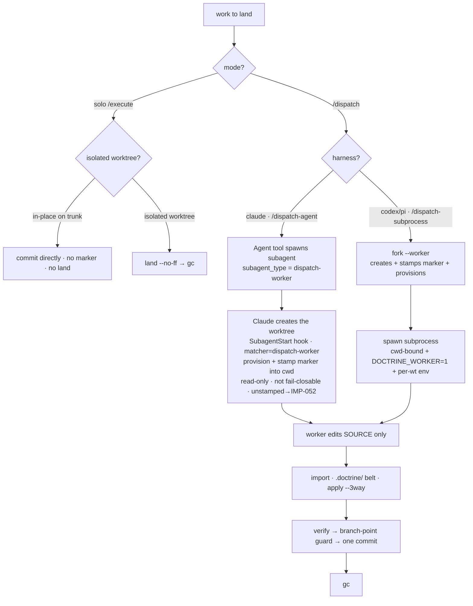

# SL-056 Design — Orchestrator spawn interface: worktree mechanism into CLI verbs

> Clean redesign (post-8th-inquisition target, round-9 charges integrated). The
> round-1→7 reasoning trail lives in `design-history.md`; round one is
> `inquisition.md` (unsuffixed), rounds 2→9 are `inquisition-2.md`…`-9.md`.
> This document states **what we build**, not how we argued to it. Scope:
> `slice-056.md`. Evidence base: `.doctrine/slice/055/research/worktree-orchestration.md`
> (shared with sibling SL-055).

## 1. Thesis

**Mechanism belongs in the CLI verb; judgment and harness concessions belong in
prose.** The worktree/dispatch creation ladder, the import funnel, the solo land
merge, build isolation, and the worker-mode guard move out of fail-open skill prose
into fail-closed, golden-testable CLI verbs — identical under claude/codex/pi by
construction — with an **orchestrator-owned fork + a disk marker as the
harness-agnostic worker identity.**

This is the **pure/imperative wall lifted to the orchestration layer.** The binary
is the pure mechanism core; the harness spawn — a subprocess for codex/pi, the
`Agent` tool for claude — is the thin impure shell. Every decision below applies
that wall.

## 2. Decision tree



The harness axis splits **only the spawn shell** (§4); the cadence after a worker
produces its delta — `import → verify → branch-point → one commit → gc` — is the
identical CLI verb sequence for both (§7, the slice's whole payoff). Solo bypasses
`import` (it lands a multi-commit branch via `land`, §6).

## 3. Worker identity — disk marker primary

Worker-mode is a property of the **worker**, signalled by a **disk marker the
trusted orchestrator stamps before the worker runs.** Disk is the one identity
medium *every* harness has; an env channel is not (claude's `Agent` tool has none,
and `claude -p` is API-billed + harness-specific — rejected).
[[mem.pattern.dispatch.spawn-backend-harness-agnostic-no-free-env-seam]] binds this
floor.

```
marker path:  <root>/.doctrine/state/dispatch/worker      (withheld runtime tier)
worker_mode(root) := (is_linked_worktree(root) && marker_present(root))  // PRIMARY, agnostic
                     OR env DOCTRINE_WORKER set                          // codex/pi worker-on-main catch
guard (in run(), before dispatching a write-classed OR Orchestrator Command):
    if worker_mode(root): refuse(verb)   // names the verb
```

- **Marker is primary and harness-agnostic.** Present in a linked worktree ⇒ writes
  refused. Presence-only, no contents.
- **`DOCTRINE_WORKER=1` env is a codex/pi *optimisation*, not the identity.** Its one
  job: catch the **worker-on-main** hazard (ADR-006 D2b — the harness drops the worker
  on the coordination root, where no marker exists and `is_linked_worktree` is false).
  Available only where a subprocess spawn carries env (codex/pi). For **claude** it is
  unavailable, so worker-on-main stays the deferred D2b residual, mitigated by
  always-isolating the worker + the hook-stamped marker.
- Solo `/execute` (in-place or isolated) sets **neither** signal → writes freely.
  **Mode, not location, decides** (ADR-006 D6a). `is_linked_worktree` is the existing
  predicate (memory squash-warn, RV-verb refusal — now a third consumer).
- **Unstamped claude worker (hook-failure fail-open) — fenced by the funnel + jail, not
  the write seam.** Marker-absent is *not* worker-mode (above), so a stamp-failed worker
  is **not** CLI-refused; its blast radius is bounded by the `import` belt + the
  bubblewrap jail (no push), and stamp-failure is kept non-silent by the orchestrator
  post-spawn marker abort (IMP-052). The re-amendment rationale + the `P×harm`/jail
  weighing live in ADR-006 D2a and `worker-mode-floor-decision.md` §6 (owner-locked VH).
- **Lifecycle (owned):** written by `fork --worker` (codex/pi) or the SubagentStart
  `marker --stamp-subagent` hook (claude); removed by `gc`; rolled back if `fork` fails;
  cleared by `marker
  --clear` for a stray marker (below). A tree may become a coordination/direct-writer
  root only after the **`doctrine worktree status --assert`** check (the named owner of
  the assert-marker-absent gate, charge-3 — `Read`-classed, no mutation) that, on a stray
  marker in a linked worktree, exits non-zero with a distinct **`stale-marker`** token and
  **names the remedy** (`marker --clear --operator`) — detection carries a cure. `--assert`
  is **not a parallel implementation**: it derives its exit from the *same*
  `describe_mode` state the human status line reads (no `classify_writable` twin); the
  early check is a pre-flight of the *very same* worker-mode condition the `run()` guard
  enforces later (`is_linked && marker_present`), surfaced at the transition so a stale
  marker is cleared **before** a direct-writer is confused by a mid-work refusal. The
  single chokepoint is called at **every** transition of a linked worktree into a
  direct-writer role: (1) `/execute`'s isolated-worktree entry; (2) any solo
  worktree→direct-writer handoff; (3) `land`/`gc` when they operate on a tree as a
  direct-writer rather than the coordination root. **Solo `/execute` included** (D6a makes
  solo a full self-orchestrator in a linked worktree). Listing the callers here keeps the
  gate from being lost to the skill prose this slice shrinks.
- **`marker --clear` (bespoke class — see §5).** Removes the marker at the cwd tree
  root, loud receipt. Refused if `DOCTRINE_WORKER` set, if cwd is not the marker's
  tree root, and — when the cwd tree is a **linked worktree** — unless `--operator` is
  passed (accident-fence). **Never** refused by the marker conjunct itself (locking the
  marker's only remover behind the marker is the self-brick we reject).
- **Observability (required):** a new **`doctrine worktree status`** verb (`Read`-classed,
  charge-4) prints the resolved mode and its cause — `worker fork: yes — writes refused;
  signal: env|marker|both` or `worker fork: no — writes allowed` — so the mode is
  discoverable without knowing the gitignored marker path. Pure core
  `describe_mode(is_linked, marker_present, env_set) -> StatusLine`; §11 adds the
  subcommand, §12 goldens all four signal states.
- **Withheld tier:** `.doctrine/state/**` is already gitignored, provision-dropped, and
  absent from the import delta — the marker inherits every exclusion with zero new tier
  logic (confirm in the `is_withheld` test).

**Env blast-radius bound.** `DOCTRINE_WORKER` is set **only in the spawned child's
env**, never `export`ed into the orchestrator's shell; the orchestrator never sets it
on itself. When the **env disjunct** trips `worker_mode` on a tree that is **not a
linked worktree** (main, a plain checkout — where a real worker fork never is), the
state is provably either a worker-on-main *or* a leak. Every verb refused this way —
authoring (`slice new`/`design`/`plan`) **and** `Orchestrator` funnel verbs — carries
a **named dual-cause** message ("`DOCTRINE_WORKER` set outside a worker worktree: a
worker was dropped on the coordination root → re-dispatch isolated; **or** the env
leaked into this process → unset it"), never a bare "worker refused."

## 4. Per-harness spawn

The mechanism/concession line falls between **what the binary does** (create-or-mark
+ provision + per-wt env *contract* emission — harness-identical) and **how the
worker is spawned** (harness-shaped → prose, selected by the `/dispatch-*` router).

### 4a. codex/pi — `/dispatch-subprocess`

`doctrine worktree fork --base <B> --branch <name> --dir <path> --worker` creates the
worktree, stamps the marker, provisions, emits the per-wt env contract on stdout. The
orchestrator then spawns the subprocess **with its cwd bound to the fork**:

```sh
fork_env="$(doctrine worktree fork --base "$B" --branch "$BR" --dir "$D" --worker)" \
  || { echo "fork failed: $?" >&2; exit 1; }      # halt, do NOT spawn
env -C "$D" DOCTRINE_WORKER=1 $fork_env codex exec "<pre-distilled prompt>"
#       ^ cwd→fork    ^ worker-on-main optim   ^ per-wt env    ^ harness-shaped line
```

- **`env -C "$D"` binds the worker process cwd to the fork.** Without it `codex exec`
  inherits the orchestrator's cwd (the coordination root it ran `fork` from) and the
  worker's *source* edits land on the trusted branch — bypassing `import`, the belt,
  and branch-point discipline; the `DOCTRINE_WORKER` guard catches only
  doctrine-mediated writes, never a raw editor write to cwd. The cwd-bind is a
  **spawn-shell mechanism**, not a prompt instruction. Portable fallback if `env -C` is
  absent: `( cd "$D" && exec env DOCTRINE_WORKER=1 $fork_env codex exec … )`. Under D6,
  `bwrap … --chdir "$D"` is the confined equivalent.
- **Capture + check `$?`; never `eval "$(…)"`** — `eval` swallows the exit status, a
  fail-open trap. `$fork_env` is the stdout env block; status went to stderr.

`fork` steps (deterministic, harness-identical) — **compensating cleanup, not a true
transaction:** git mutations are not atomic, so any failure after step 1 triggers a
best-effort rollback (`git worktree remove --force`, `git branch -D`, reap the dir);
a rollback that itself fails **names the leftover and exits non-zero** — never a
silent half-rollback:
1. `git worktree add -b <branch> <dir> <B>` (correct syntax: `-b <branch>` for a new
   branch at `<B>`). Refuses if `<dir>`/`<branch>` exist or `<B>` is not a commit.
   `<dir>` must be **unique per branch** and outside the repo root or a gitignored
   in-repo path (else a concurrent same-slice batch collides / dirties the tree).
2. `doctrine worktree provision <dir>` (existing sole-copier; withheld tier excluded).
3. If `--worker`: write the marker **before** any spawn window. Solo omits `--worker`.
4. Emit the **per-worktree env contract** on stdout (`KEY=value` per line); human
   status to stderr. The contract is *generalisable* — the project declares its per-wt
   env; doctrine-the-repo declares `CARGO_TARGET_DIR=<jail-root>/wt/<branch>` (§8, a
   project-local consumer, not a framework primitive).

### 4b. claude — `/dispatch-agent`

> **Pivot history (SL-056 PHASE-02/03, locked — `g2-draft.md`, ADR-006 D9 amendment,
> ADR-011 D6).** The original draft put create+provision+stamp inside a **WorktreeCreate
> `create-fork`** hook. The O3 spike (PHASE-02) found the deployed WorktreeCreate payload
> carries **no `agent_type`, no target path, no base** — so `create-fork` is **not
> buildable** and is **deferred** (until the payload grows type+path, or an IDE-004
> channel lands). The live claude mechanism is **SubagentStart-stamp**, locked at PHASE-03;
> build target `g2-draft.md §4`. The prose below is the live design.

No `fork` verb, no env channel. The orchestrator launches the worker via the `Agent` tool
with `subagent_type: dispatch-worker` and `isolation: worktree`. **Claude default-creates
the worktree** — doctrine does not intermediate creation (the WorktreeCreate path is
deferred). A **matcher-scoped, sync-blocking `SubagentStart` hook** then runs the claude
analog of `fork --worker`'s mark step — `doctrine worktree marker --stamp-subagent` —
reading the payload `{cwd, agent_type, …}` JSON on stdin:

```
SubagentStart hook command:  doctrine worktree marker --stamp-subagent   (reads payload JSON on stdin)
    matcher: dispatch-worker                         # the gate — scopes the hook to dispatch workers (σ)
    parse stdin JSON                                 # TRUST BOUNDARY — harness-facing untrusted input
        missing/empty cwd               → refuse missing-cwd
        cwd not under repo / not linked → refuse bad-dir
        missing agent_type              → refuse missing-agent-type
    doctrine worktree provision <cwd>                # ADR-006 D9 allowlist + .worktreeinclude (withheld excluded)
    write_marker(<cwd>)                              # the marker = worker identity
    # NO `git worktree add` (Claude already created it); NO compensating worktree rollback (it owns no worktree).
    # Read-only event: a non-zero exit does NOT abort the worker — a refusal means an UNSTAMPED worker.
```

- **Not fail-closable — the stamp is best-effort (ADR-011 D6, O3-red).** SubagentStart
  is a **read-only** hook event (official `hooks.md`): a non-zero exit only shows stderr;
  the subagent runs **regardless**. So unlike WorktreeCreate (which *does* fail creation
  on non-zero), the stamp hook **cannot abort the worker**. Two empirical findings fix the
  altitude (PHASE-02/03-A, `notes.md`):
  - **Blocking ⇒ no write race (finding 1).** The command hook **gates worker execution
    until it exits** (WORKER_FIRST tracks the hook's sleep 1:1, strictly after HOOK_DONE).
    So **on hook success** the marker + provisioning are mechanically present before the
    worker's first action — not a timing race.
  - **Fail-OPEN on hook failure (finding 2).** On a stamp failure the worker proceeds
    **unstamped and un-gateable by any hook** (no exit-status gate exists). The fence
    against an unstamped worker is therefore **not** a hook exit code but the layered
    funnel: the `import` `.doctrine/`/`.claude/` belt (§7) + the worker-mode guard (§3) +
    the pre-distilled worker prompt + the **orchestrator post-spawn marker check that
    aborts an unstamped fork (IMP-052)** — enforced where the harness *can* abort.
- **Worker-mode floor = positive signal (Option C, locked PHASE-05).** `worker_mode =
  (is_linked_worktree && marker_present) OR env DOCTRINE_WORKER` — **marker present ⇒
  refuse; marker absent ⇒ allow.** The marker-absent **fail-closed** floor (the original
  B2/B3 disposition) was **reversed**: `P(SubagentStart hook failure) ≈ 0` (it blocks; a
  miss needs a crash) × *jail-bounded* harm (bubblewrap, no push ⇒ worst case = lost
  unpushed progress) ⇒ the security delta vs a fail-closed floor is negligible, and the
  one real residual — a failing hook *silently* normalising — is closed at the
  **orchestrator** layer (IMP-052 post-spawn abort), the layer that *can* abort, not the
  CLI seam (`worker-mode-floor-decision.md §7`).
- **Failure posture — un-rollback-able (M3).** Because `provision` + `write_marker` run
  inside the read-only hook on a worktree **Claude created and owns**, a mid-`provision`
  failure leaves a **half-provisioned worktree with a worker already cleared to run** —
  the stamp verb cannot `git worktree remove` it (it never added it) nor abort the worker
  (read-only event). So the verb does **not** attempt a compensating worktree rollback (ρ
  does **not** apply — there is no `git worktree add` it owns); on any failure it
  **reports loudly on stderr and exits non-zero**, surfacing the broken fork to the
  orchestrator's post-spawn check (IMP-052) rather than silently half-stamping.
- **`agent_type` is the discriminator — one source of truth (τ).** The matcher
  (`matcher: dispatch-worker`) is now the gate (not a WorktreeCreate body branch); the
  literal is replicated across the `Agent` `subagent_type`, the SubagentStart matcher,
  `install/agents/claude/dispatch-worker.md`'s `name`, and the `/dispatch-agent` skill. A
  one-character **drift fails OPEN**: the matcher never fires ⇒ no stamp ⇒ `marker_present
  == false` ⇒ `worker_mode == false` ⇒ the worker writes unrefused (contained by the same
  belt+IMP-052 fence as any unstamped worker). So a single **`const
  DISPATCH_WORKER_AGENT_TYPE`** in the binary is the source of truth; the agent-def `name`
  and the skill's `subagent_type` are **pinned** to it; a cross-surface **drift test REDS
  on mismatch** (§12). ([[mem.pattern.dispatch.claude-subagentstart-worker-identity]])
- **σ moot — no else-branch, no blast radius.** The matcher scopes the stamp to
  `dispatch-worker` cleanly, so **benign isolated subagents never hit the hook** and keep
  Claude's default worktree creation untouched. There is **no replicate-default
  else-branch** and no shared-core blast radius — the WorktreeCreate σ question is dead
  (there is no usable WorktreeCreate gating at all; PHASE-02 RED).
  ([[mem.pattern.dispatch.claude-worktreecreate-payload-minimal-no-type-no-path]])
- **Identity = the disk marker; concurrency first-class in EXECUTION (SR-2, υ).** No env,
  no arm sentinel, no lease, no serial constraint. Each SubagentStart fires independently
  for its own worktree ⇒ **concurrent file-disjoint claude dispatch is first-class *in
  execution*.** **v1 buys parallel EXECUTION, not parallel LANDING (υ):** the funnel-back
  is serialized by `import`'s stationary-head precond (§7c — one orchestrator, `HEAD ==
  B`): the orchestrator's own sequential imports bump HEAD `B→B+1` after each landing, so
  the next sibling (forked at B) then hits `head-moved` (§7a) and must **re-dispatch onto
  the bumped base** — one landing per base, not an orderly N-drain (in-verb re-anchor
  deferred, §13/IMP-043). `DOCTRINE_WORKER` and bwrap are unavailable; the worker shares
  the jail-wide build target (§8); worker-on-main is the deferred D2b residual.
- **Base-pinning — confessed residual, sharper than assumed (charge-2 / M1).** The
  SubagentStart payload carries **no base/parent field** (like WorktreeCreate), so the
  worker forks from **session HEAD** — and the spike found the default-created worktree's
  base is **opaque and not orchestrator-controlled**, *sharper* than the original residual.
  Under the §7c stationary-head constraint session HEAD **is** B in the common case; a move
  between base capture and spawn is **caught — late, not silently** — at `import`
  `head-moved` (§7a), the worker re-dispatching onto the bumped base (same invalidation
  path as the codex/pi own-batch case; the cost is a **wasted worker run**, not a
  base-integrity violation). No hook-time `base-moved` pre-refusal in v1 (the hook sees no
  B); in-verb re-anchor + an import-time content-base assertion are deferred (§13,
  IMP-043). Named in the §10 altitude table.
- **Stamp privilege (§5).** `marker --stamp-subagent` is **Hook-mint**-classed (refused
  under `worker_mode`). The legitimate first-stamp is allowed because at stamp time the
  target worktree **bears no marker yet** ⇒ `worker_mode == false` (Option C's positive
  signal) — so the exemption **falls out of the floor**, not a verb-identity carve-out
  (which the *reversed* fail-closed rule had required). The class still bites a re-entrant
  caller in an **already-marked** worktree (a worker minting a sub-marker) ⇒ refused. See
  the §5 ⚠ reconciliation note.

### 4c. claude self-clear residual (confessed, not closed)

The marker is a file *inside* the worker's worktree and the env is shell-strippable, so
a **non-compliant** worker of any harness can `rm` the marker or `env -u
DOCTRINE_WORKER` directly. The `--operator`/env-lock hardening on `marker --clear`
fences **accidents, not malice, on every harness.** For claude there is **no mechanism
floor against a deliberate self-clear** (no env-lock; bwrap is codex/pi-only) until a
free env channel or OS confinement (IDE-004 channels / userns-bwrap) lands. claude
worker-sole-writer is therefore **accident-fenced + prompt-enforced, not malice-proof**
— stated plainly in the §10 per-harness altitude table. The malice containment on the
**dispatch funnel** is the import `.doctrine/`-rejection belt (§7), not the marker.

## 5. Privilege classes

`write_class` (exhaustive over `Command`) is **unchanged** (behaviour-preserving). Three
classes join the worker-mode guard, one stays open, one is bespoke:

| Class | Members | Refused under `worker_mode`? |
|---|---|---|
| **Orchestrator** | `fork`, `import`, `land`, `gc` | **Yes** — they mutate git refs/dirs (create/remove worktrees, delete branches, merge commits, reap dirs). Classifying them `Read` because they spare the authored TOML corpus is a category error (a worker could delete branches, violating ADR-006 D2). |
| **Hook-mint** | `marker --stamp-subagent` | **Yes** — it mints the worker marker (and provisions the worktree). A *worker* invoking it is a privilege bypass on the claude path. The **legitimate first-stamp is exempt by the floor, not a carve-out:** the SubagentStart hook targets the payload `cwd` worktree, which at stamp time **bears no marker yet** ⇒ `worker_mode == false` (Option C positive signal) ⇒ allowed; a re-entrant call in an already-marked worktree is refused (`already-marked`, F-9). (`create-fork` is **deferred** — §4b — so it leaves this class.) |
| **write** | authoring writes (`slice new`/`design`/`plan`/`memory record`/status-transition) **and `claude install`** (+ its hidden `skills install` alias, §9 — installs skills/agents/hooks into `.claude/`) | Yes. `claude install` is new to the guard (charge-5); the rest unchanged. **Justification (corrected): ADR-006 D2 applied uniformly — a worker performs no doctrine-mediated writes, and must not reconfigure its own harness (hooks/agents) mid-run. NOT a ride-back defense** — `.claude/` is gitignored, so a worker's installer output can never funnel back through `import` and is torn down at `gc` regardless. |
| **Read** | `provision`, `check-allowlist`, `branch-point-check`, `status` | No — open to workers |
| **`marker --clear`** | bespoke 5th class (§3) | **No** — locking the marker's only remover behind the marker is the self-brick. Refused instead by env-set, cwd-not-tree-root, and the `--operator` accident-fence in a linked worktree. |

The claude `marker --stamp-subagent` hook verb (§4b) **mints** the marker. It is
**Hook-mint-classed → refused under `worker_mode`**, so a worker process in a marked
worktree cannot call it; the legitimate first-stamp is allowed because its target worktree
bears no marker yet (`worker_mode` false). Refused-when-already-a-worker,
allowed-for-the-first-stamp is one classification, not two.

> **✅ PHASE-10 lock CONFIRMED (owner VH sign-off, RV-016/F-15).** The PHASE-03 D ruling
> specified an *explicit verb-identity* exemption for `marker --stamp-subagent`, predicated
> on the B2/B3 **fail-closed** marker-absent floor. PHASE-05's **Option C reversed** that
> floor to a positive signal (marker-absent → allow), which makes the legit first-stamp
> allowed *automatically* (no marker yet ⇒ `worker_mode` false) — so **no verb-identity
> carve-out is implemented**. The alternative — keep an explicit identity exemption as
> defense-in-depth, should a future change re-introduce a fail-closed floor — is noted, not
> taken. **Confirmed acceptable at PHASE-10 lock; the re-entrant case is fenced separately
> by the `already-marked` refusal (F-9).**

## 6. `land` — solo `/execute`'s coordination merge

Solo's analog of dispatch's `import`: a fail-closed verb that lands a solo
isolated-worktree TDD branch onto the coordination branch, **structurally non-squash**,
so gc's ancestry leg (§6.1) and memory-anchor sha-stability (ADR-006 D8) both hold.
`Orchestrator`-classed. **Solo-only** — dispatch uses `import` (single distilled
commit, ancestry severed); `land` is for solo's multi-commit branch (ancestry
preserved). The in-place solo path needs no `land` (it commits directly).

```
doctrine worktree land --fork <branch>      # runs at the coordination root
```

1. **precond** — tree clean (`git status --porcelain --untracked-files=no`-empty, same
   scoping as `import`) else `tree-unclean`; HEAD is the coordination branch;
   `<branch>` exists else `no-such-fork`; `<branch>`'s **live linked worktree** does
   *not* bear the worker marker else `dispatch-fork` (a marker-bearing fork is a
   dispatch worker — its delta must funnel through the belted `import`, never `land`'s
   beltless merge); **and `<branch>` must *have* a live linked worktree** — the marker
   is uncommitted and unreachable once the worktree is gone, so a worktree-less branch
   would pass `dispatch-fork` *vacuously* → refuse **`worktree-gone`** ("cannot verify
   it is not a dispatch fork; re-create the worktree, route through `import`, or
   `--force` knowingly"). The marker guard is honestly a **live-worktree
   accident-fence**, not a universal provenance proof.
2. `git merge --no-ff <branch>` — **never `--squash`** (the verb cannot express one).
   Ancestry preserved ⇒ fork commits reachable ⇒ gc's ancestry leg reaps.
3. on conflict → **`git merge --abort` first** (restore the clean tree step 1 demands),
   *then* refuse `merge-conflict`, report + halt — never auto-resolve. `git merge`
   mutates the index/tree and sets `MERGE_HEAD` *before* reporting the conflict, so the
   half-merge **must** be aborted else it wedges the tree against the verb's own
   re-entry guard. The abort is itself fallible and guarded to fire **only mid-merge**
   (`MERGE_HEAD` present): step 3 reached with no merge in progress → refuse
   **`inconsistent-merge-state`** (never a silent abort masquerading as a clean
   conflict). Abort success → ordinary `merge-conflict`, tree guaranteed clean. Abort
   **failure** → a **distinct non-zero `wedged-merge`** naming `MERGE_HEAD`, the
   unmerged paths, that the tree is **not** clean, and the manual remedy.

**Refusal set:** `{tree-unclean, no-such-fork, dispatch-fork, worktree-gone,
merge-conflict, wedged-merge, inconsistent-merge-state}`.

Pure core: `classify_land(tree_status, head, fork_state) -> Result<Merge, Refusal>`
where `fork_state = {exists, has_live_worktree, bears_marker}`; imperative shell drives
`git merge --no-ff` and the mid-merge-guarded abort. Reuses the tree-clean check shared
with `import` (no parallel implementation).

## 7. The funnel belt + `import`

### 7a. `import` (dispatch funnel)

```
doctrine worktree import --base <B> --fork <branch>      # runs at coordination root
```

`Orchestrator`-classed. **Dispatch path only** (a single distilled worker commit,
ancestry severed); solo uses `land`. **v1 is the stationary-head case only**, each step
a hard refusal (no auto-merge):
1. **precond — two guards:** `HEAD == B` (`branch-point-check`, a ref-equality compare)
   **and** the tree is clean (`git status --porcelain --untracked-files=no`-empty —
   tracked + staged only). Untracked files are **excluded deliberately** (benign
   scratch/memory/withheld sheets must not false-`tree-unclean` the common case).
   `HEAD != B` → `head-moved`; dirty → `tree-unclean`.
2. `S^ == B` (single-non-merge fork delta) else `multi-commit`.
3. **belt:** reject if the `B..S` **name-only** diff touches any **governance/config
   tier** path (prefix-match, **tracked files only**): a `.doctrine/` touch →
   `doctrine-touch`; a `.claude/` touch → `claude-touch`. **Honest scope (charge-5,
   corrected — `.claude/` is wholly gitignored, `.gitignore` `.claude`).** Because the
   diff is tracked-files-only and *all* of `.claude/` is gitignored, **normal** installer
   output and the harness's own permission-grant writes to `.claude/settings.local.json`
   **never appear in the diff and cannot ride back** — so the original "installer output
   rides back as source" framing was wrong. The `.claude/` leg closes exactly **one**
   residual: a **deliberately force-added** `.claude/` path (`git add -f`) becomes
   *tracked in commit `S`*, would show in `B..S`, and `git apply --index` would carry it
   into the coordination commit. That is **malice-containment parity with the `.doctrine/`
   leg and the forced-added-marker note** — not a defense against normal `.claude/`
   activity, which is gitignored and invisible to import. A force-added marker is caught
   by the `.doctrine/` leg the same way (defense in depth).
4. `git apply --3way --index` (non-committing). Under **both** preconds the patch
   applies onto the exact tree it was cut from ⇒ cannot conflict ⇒ `apply-conflict` is
   **not** a v1 refusal. The orchestrator commits **separately** (ADR-006 D7 cadence;
   import ≠ commit). **No runtime receipt is stamped** — a flag born before the commit,
   in the gitignored tier, survives a crash and lies "landed" to `gc`; instead `gc`
   derives landed-ness from durable git state (§6.1).

**Refusal set (v1):** `{head-moved, tree-unclean, multi-commit, doctrine-touch, claude-touch}`.

Pure core: `classify_import(diff, base, head) -> Result<Apply, Refusal>`; imperative
shell drives git + apply.

### 7b. Belt scope (honest)

The governance/config-tier rejection belt (`.doctrine/` **and** `.claude/`, charge-5)
is the **dispatch/import-path** containment — a dispatch worker's doctrine delta (and a
**force-added** `.claude/` path, §7a) never funnels back through `import`. It is **not**
an unconditional all-funnel containment: solo's `land` (§6) is a second, **beltless**
sanctioned funnel — solo is a trusted self-orchestrator that *legitimately* lands
doctrine, so a belt there is a category error. The belt's true scope: the import/dispatch
path, conditioned on dispatch deltas routing through `import` and never `land` —
mechanised by `land`'s `dispatch-fork` + `worktree-gone` guards (§6). **The `.claude/`
leg is narrow (corrected):** since `.claude/` is wholly gitignored, normal installer/
harness output is invisible to the tracked-files-only diff and cannot ride back — the leg
contains **only force-add injection**, parity with the `.doctrine/` leg. The *worker
running the installer at all* is a separate concern, handled by the §5 write-class
refusal on `claude install` (ADR-006 D2, not ride-back).

### 7c. Quiescence constraint

Stationary-head v1 import **requires a coordination branch with no concurrent HEAD
movers — external *or* the orchestrator's own batch (υ).** Two invalidation sources, one
mechanism:
- **External committers.** On a live main, each external commit moves HEAD to `B+1` and
  forces every in-flight worker's import to refuse `head-moved` → re-dispatch →
  re-invalidated — **livelock**. The constraint: **a live main mandates delta-branch
  coordination (ADR-006 D8 team mode)**; solo-on-main dispatch is safe only when main is
  quiescent for the run.
- **The orchestrator's own concurrent-batch imports (υ — the same invalidation).** Even
  with no external committer, a concurrent batch self-invalidates: importing worker A,
  then committing (§7a step 4), moves HEAD `B→B+1`; worker B — **also forked at B** — then
  reads `HEAD != B` and refuses `head-moved`, re-dispatching onto the bumped base. This is
  why v1 lands **one worker per base**, not a whole batch (§4b): parallel execution, not
  parallel landing.

In both cases the orchestrator **detects** a moved coordination HEAD via the branch-point
guard and **reports the mover** (external committer named; own-batch advance acknowledged)
rather than silently re-dispatching into livelock. The in-verb re-anchor (and/or a single
multi-fork import) is the real fix — deferred (§13, IMP-043).

## 8. `gc`

```
doctrine worktree gc --fork <branch> [--superseded-head <SHA>] [--force] [--dry-run]
```

`Orchestrator`-classed. Reaps, in one act: (1) `git worktree remove` the fork dir
(removing its marker); (2) `git branch -D` the fork branch (never a git-ancestor, so
`-d` always refuses — the patch-id gate, not `-d`, is the safety); (3) reap the
`wt/<branch>` target dir (closes the §8 disk loop); (4) warn (stderr) that
`env!(CARGO_MANIFEST_DIR)`-baked test binaries need recompile.

**Ordering is forced:** `git branch -D` refuses a branch checked out in a live
worktree, so the worktree must go first. The crash window between (1) and (2) — *branch
alive, worktree gone, marker unreachable* — is **intrinsic to git**, closed downstream
by `land`'s `worktree-gone` refusal (§6) and within `gc` by idempotent rerun (§8.2).

### 8.1. The "landed" oracle — durable patch-id, no receipt

`gc` deletes **only** when the fork's commit has *provably landed*, tested against
durable git state (not a runtime flag). `--merged` is wrong (apply-funnel branch is
never a git-ancestor); delta-emptiness is also unsound (`git diff B..fork` is never
empty for real work; `diff HEAD..fork` false-diverges when a sibling moves HEAD). v1
uses **two legs, union** via `git cherry <coordination-HEAD> <fork-branch>`:
- **ancestry** — `<fork-tip>` is an ancestor of `<coordination-HEAD>` (the `land`
  route: fork commits reachable), **OR**
- **patch-id** — every commit `git cherry` lists is `-` (the `import` route: ancestry
  severed, but each commit's *patch* landed).

A non-ancestor tip with any `+` ⇒ not (fully) landed ⇒ refuse unless
`--superseded-head`/`--force`. **A squash-merge is structurally uncertifiable** (it
destroys both ancestry and per-commit patch-id) — so solo **must** land via the
non-squash `land` verb; a manually squash-merged fork trips neither leg and gc refuses
with a **named** message ("cannot certify a squash-merge — re-land via `worktree land`
(--no-ff), or `--force` knowingly"). **Crash-proof:** a crash between apply and commit
leaves no commit ⇒ `git cherry` reports `+` ⇒ gc refuses (a receipt would have lied
"landed" and reaped the only copy).

**Superseded forks — `--superseded-head <SHA>`, no stored flag.** Moved-HEAD
re-dispatch is the common case: a re-dispatched fork is spent yet never landed (`+`) →
bare gc would demand `--force`, training the reflex the oracle exists to kill.
`--superseded-head <SHA>` reaps **iff** `<SHA>` equals the branch's current head — an
**operator assertion** that this exact, still-current commit is spent-and-abandoned
(the head-match is a TOCTOU movement-guard, **not** a landing proof). Fail-safe both
ways: a lost SHA only costs a `--force` (gc refuses — the safe side); a wrong SHA
cannot match a live head unless it *is* that head. No stored record ⇒ no removal owner
to forget, no branch-name key to false-match.

**Observability:** `gc --fork <b>` / `--dry-run` prints the per-fork verdict ("`<b>`:
landed ✓ / not-landed — `--force` to reap"), computed from git, so the operator never
`--force`s blind.

### 8.2. `gc` is an idempotent state machine

`gc` that crashed between any two destructive steps **completes on rerun or names the
leftover** — never strands its own debris. Pure `classify_gc(state) -> GcPlan` over
impure-gathered `{branch_exists, worktree_present, target_present, landed_verdict?}`:
- **Gate runs only while the branch lives.** The oracle requires B; it is monotone and
  re-runnable (a landed fork stays landed), so a rerun re-certifies and resumes.
- **Branch-gone ⇒ the deletion *is* the certificate.** A fork branch is deleted only
  through `branch -D` after the gate passed, so branch-absent ⇒ already-certified. The
  only branch-gone residue is **T** (the `wt/<branch>` target dir) — derived build
  cache, never the only copy, path a pure function of the branch *name*
  (`target_dir_for_branch`), so a rerun reaps it from `--fork <branch>` alone. (gc's
  own ordering removes W before deleting B; "branch gone + live linked worktree" is
  git-impossible — `branch -D` refuses a checked-out branch.)
- **Skip completed steps** — reaping an absent thing is a no-op.
- **Every destructive step is honest on failure** — worktree-remove / `branch -D` /
  target-reap each name their leftover and exit non-zero; a stale administrative
  worktree entry is folded into the worktree leg (`git worktree prune`).

**Cleanup ownership:** the caller of `fork` owns `gc`. `/dispatch` concludes with `gc`
(after `import`); solo `/execute` ends with `land` then `gc`. The two-leg oracle spans
both routes.

## 9. Install — `claude install`

Skills currently install via `doctrine skills install` (RustEmbed from `plugins/`,
direct symlink into `.claude/skills` for Claude, `npx skills` delegation otherwise).
This slice **renames `skills install` → `claude install`** and extends it to install,
for the Claude surface:
- **skills** (unchanged behaviour);
- **agents** — `install/agents/claude/dispatch-worker.md` symlinked into
  `.claude/agents/` (parallel to skills; user-serviceable markdown — name +
  description + tool allowlist — not a Rust type);
- **the SubagentStart hook** (matcher-scoped to `dispatch-worker`) — merged into
  `.claude/settings.local.json` via the existing `HookSpec` merge core (`src/boot.rs`),
  the same machinery that wires the `SessionStart` boot/sync hooks. The hook command is
  the one line in §4b (`doctrine worktree marker --stamp-subagent`).

> **Scope note.** The rename touches the CLI surface, goldens, and skill docs that say
> "skills install" — a deliberate SL-056 inclusion, not just the claude mechanism. The
> agents leg and the hook leg are the essential parts; the rename is the
> consolidation that makes one Claude-surface installer.
>
> **Orphan-reference sweep (SR-3).** Renaming strands references: the memory
> `[[mem.pattern.distribution.skill-refresh-command]]` and any skill docs that say
> "skills install". Resolution: keep `skills install` as a **hidden deprecated alias**
> dispatching the same handler (no flag-day break), sweep the docs to `claude install`,
> and update the memory. The alias is a plan-level deliverable, called out here so it is
> not forgotten.
>
> **`settings.local.json` non-interference (charge-5 follow-up).** `claude install`
> merges the WorktreeCreate `HookSpec` into `.claude/settings.local.json` via the
> existing `HookSpec` merge core, which **preserves pre-existing entries** (χ golden) and
> writes only the **hooks** key. It must **not** collide with Claude Code's own
> permission-grant persistence (non-sandbox/non-YOLO "always allow" → harness appends to
> the **permissions** key of the same file): different keys, and the doctrine worker-mode
> guard gates only `doctrine` subcommands, never the harness's own writes. The `.claude/`
> import belt is tracked-files-only and `.claude/` is gitignored, so harness permission
> writes never enter the diff. **Constraint on the future D6 bwrap profile (§11):** it
> ro-binds **only the marker**, never `.claude/settings.local.json` — a confined worker
> must keep writing its (ephemeral, gitignored) permission state, else interactive
> permission flow breaks under confinement.

`doctrine worktree marker --stamp-subagent` is the verb the hook calls:
`classify_stamp(agent_type, cwd_present, cwd_valid, already_marked) -> Stamp | Refuse`
reads the SubagentStart payload JSON on stdin, validates `cwd` (present, under repo, a
**linked** worktree) and `agent_type`, gates on `agent_type == DISPATCH_WORKER_AGENT_TYPE`
(τ), then **provisions** (D9) + `write_marker`s into `cwd`. There is **no `classify_create`
/ `ForkWorker | PlainCreate | Refuse`** three-way and **no else-branch** (σ moot — the
matcher gates; benign subagents never hit the hook). The refusals (`missing-cwd`,
`bad-dir`, `missing-agent-type`, and `already-marked` — a re-entrant stamp of an
already-marked worktree, F-9) fail the **stamp**, not creation — the worker runs regardless
(SubagentStart is read-only, §4b), so a refusal means an **unstamped worker** fenced by the
belt+guard+prompt+IMP-052. The validation lives in the binary (testable), the hook stays
dumb — honoring the §1 thesis. The `create-fork` WorktreeCreate verb is **deferred** (§4b —
payload lacks type+path+base).

## 10. Governance deliverables

Decisions govern → land first; the design *produces the drafts*. Sequence: **G1+G3 →
O3 spike → G2 → G4 → remaining code** (the guard+privilege spike precedes the ADR-006
amend it validates).

- **G1 — ADR-008 revise→accept** (the gate). Fold §5.1 evidence; record D-B2 (ro
  `~/.cargo/bin` ⇒ no in-jail install race); re-scope D-B3 around the userns question.
- **G2 — ADR-006 amend.** (a) for **codex/pi**, demote the native WorktreeCreate hook as
  a *creation* preference (base-pinning + subprocess spawn supersede it); for **claude**,
  **promote a custom WorktreeCreate hook as the create+provision+stamp handler** (it
  *replaces* default git creation — fail-closed), with SubagentStart-stamp as the named
  fallback. (b) replace the `DOCTRINE_WORKER=1` self-arm with the **disk-marker-primary**
  signal (agnostic), env a codex/pi optimisation, plus the `Orchestrator` verb class.
  State the per-harness enforcement altitude. **Spike-first:** the guard/privilege model
  and the claude WorktreeCreate marker path (incl. named-subagent `agent_type`
  propagation) are validated by the O3 spike *before* G2 amends the accepted ADR.
- **G3 — the spawn-interface ADR (new, id allocated by `doctrine adr new` — cited by
  that canonical id once it exists; do not pre-guess).** The spawn-interface
  **contract** (orchestrator owns fork-or-mark + provision + per-wt env emission;
  worker identity is the disk marker) + a **per-harness capability/altitude table**.
  **Blast-radius confession (σ) — RESOLVED MOOT (§4b).** This confession applied only to a
  WorktreeCreate hook that intermediates creation for ALL `isolation: worktree` subagents.
  The O3 spike (PHASE-02) dropped that path: the live **SubagentStart** hook is
  **matcher-scoped to `dispatch-worker`**, so benign isolated subagents never hit it and
  keep Claude's default creation — **no else-branch, no shared-core blast radius**. The σ
  confession is retained here as provenance of the gate's design, not as a live residual.
  - **codex/pi:** subprocess spawn ⇒ env-arm + per-wt env + bwrap (full mechanism floor
    *under D6*; accident-fenced absent D6).
  - **claude:** `Agent` tool + **SubagentStart-stamp** (Claude default-creates; the
    matcher-scoped hook provisions+stamps), marker-only altitude (no env, no per-wt target,
    no bwrap); **accident-fenced + prompt-enforced, not malice-proof** against a deliberate
    self-clear (§4c) — deferred to IDE-004 / userns-bwrap. **Base-pinning is a confessed
    residual, not parity (charge-2):** the hook forks from session HEAD (opaque base), not an
    explicit `--base <B>`; correct under §7c quiescence, a moved HEAD is caught late by
    `import`'s `head-moved` (cost: a wasted worker run, not a base-integrity breach). The φ
    altitude is **RESOLVED to the O3-red row** (PHASE-02/03, ADR-011 D6 `accepted`):
    - **O3 RED (the outcome).** WorktreeCreate carries no `agent_type`/path/base ⇒
      fail-closed-via-WorktreeCreate is **not achievable**; `create-fork` deferred. The
      live altitude is the **SubagentStart-stamp** path: blocking ⇒ stamp-before-worker on
      hook success, **fail-OPEN on hook failure** (read-only event, no exit gate), the
      unstamped-worker case fenced by the import belt + worker-mode guard +
      prompt-enforcement + the orchestrator IMP-052 post-spawn abort.
    - **Concurrency** is execution-only in both arms: concurrent file-disjoint *execution*
      is first-class, but v1 funnels **one landing per base** (υ, §7c) — no serial
      *execution* constraint, but **not** parallel landing.
  - No harness-specific command (`claude -p`) is a required element. The fail-closed cell
    and the env/spike claims stay `proposed` until the O3 gate is green.
- **G4 — SPEC-012 rewrite.** Reframe Overview/Concerns (the funnel is now enforced
  code); rewrite D3 (fail-open env → fail-closed marker-primary guard); state the
  achievable altitude per harness, the quiescence constraint, the solo non-squash-land
  constraint, and the belt's honest scope; add FRs (fork, import, land, gc, marker
  guard, per-wt env contract).

Untouched: ADR-007, ADR-001/003/004, the withheld-tier model.

## 11. Code impact

| Path | Change |
|---|---|
| `src/worktree.rs` | `run_fork` (compensating-cleanup rollback, honest non-zero), `run_import` (`classify_import`), `run_land` (`classify_land`; `git merge --abort` mid-merge-guarded → `wedged-merge`/`inconsistent-merge-state`; `worktree-gone`), `run_gc` (**idempotent state machine** — `classify_gc(state) -> GcPlan`; two-leg oracle `--is-ancestor` OR `git cherry` patch-id; `--superseded-head`; squash → named refusal), `run_marker_clear` (`--operator`), **`run_stamp_subagent`** (claude **SubagentStart** handler — parses stdin payload with **bad-payload refusals** `missing-cwd`/`bad-dir`/`missing-agent-type`/`already-marked` (ψ — fail the **stamp**, not creation: the worker runs regardless, §4b; `already-marked` refuses a re-entrant stamp of an already-marked worktree, F-9), validates `cwd` is a **linked** worktree + `agent_type == DISPATCH_WORKER_AGENT_TYPE` (τ) + `cwd` marker-absent, then **provisions** + `write_marker`s into `cwd`. **No `git worktree add`** (Claude owns the worktree) and **no compensating worktree rollback** (ρ N/A — owns no worktree); on any `provision`/`write_marker` failure it reports loudly + exits non-zero (M3 — surfaced to the orchestrator IMP-052 post-spawn check, never silently half-stamped). `create-fork` is **deferred** — §4b). New **`run_status`** verb (charge-4 observability + charge-3 gate; `--assert` derives a non-zero `stale-marker` exit from the same state as the human line — **no separate gate verb or `classify_writable` twin**). `run_import`'s belt now rejects **`.claude/`** as well as `.doctrine/` (charge-5 — distinct `claude-touch` token) and pins `-c core.quotePath=false` + `--no-renames` so a quoted/rename-disguised governance path cannot evade it (F-3/F-4). Pure: `target_dir_for_branch`, `marker_path`, `classify_import` (belt over both `.doctrine/`+`.claude/`), `classify_land`, `classify_gc`, **`classify_stamp(agent_type, cwd_present, cwd_valid, already_marked)`** (two-valued: `Stamp | Refuse` — no `PlainCreate` else-branch, σ moot; the `already_marked` arm is F-9), and **`describe_mode(is_linked, marker_present, env_set)`** (the single source for both the status line and the `--assert` exit). **`const DISPATCH_WORKER_AGENT_TYPE`** is the single source of truth `classify_stamp` reads (τ). New `write_marker`/`marker_present`/`remove_marker` (`write_marker` invoked by `fork --worker` and `marker --stamp-subagent`). Third `is_linked_worktree` consumer. **Deleted vs history: `run_marker_arm`/`run_marker_disarm`, `arm_path`, the lease/single-slot apparatus — obviated by the per-worktree-creation hook.** |
| `src/main.rs` | `fork`/`import`/`gc`/`land`/**`status [--assert]`** (charge-4 observability + charge-3 gate — one `Read`-classed verb, `--assert` swaps the human line for a `stale-marker` non-zero exit; no second verb) subcommands + `marker {--clear --operator, --stamp-subagent}` (watch bool/arg clippy ceilings, [[mem.pattern.lint.cli-handler-args-struct]]). Worker-mode guard `worker_mode(root) = (is_linked_worktree && marker_present) OR env DOCTRINE_WORKER`. The exhaustive `write_class` mapping is **behaviour-preserving for existing members**; the worker-mode *refusal set* gains three entries: **`fork`/`import`/`gc`/`land` = `Orchestrator`** (refused, NOT `Read`); **`marker --stamp-subagent` = `Hook-mint`** (charge-1 — refused under `worker_mode`; the legit first-stamp targets a worktree with no marker yet ⇒ worker_mode false ⇒ allowed, exemption falls out of Option C's positive signal, §4b/§5; `create-fork` deferred); **`claude install` (+ hidden `skills install` alias) = `write`** (charge-5 — refused under `worker_mode`). The env-leg refusal on a non-linked tree carries the named dual-cause message for authoring **and** funnel verbs. |
| `src/skills.rs` → install surface | **Rename `skills install` → `claude install`** (keep `skills install` as a **hidden deprecated alias** → same handler, SR-3); add the **agents** leg (symlink `install/agents/claude/*.md` into `.claude/agents/`) and trigger the WorktreeCreate hook merge. Update `Write("skills install")` audit label + goldens; sweep docs + the `[[mem.pattern.distribution.skill-refresh-command]]` memory. **χ: every leg is golden-pinned in §12** — alias→same-handler, agent-def symlink presence, hook merge that preserves pre-existing hooks, idempotent reinstall, rename audit-label. |
| `src/boot.rs` | A **`SubagentStart`** `HookSpec` **matcher-scoped to `dispatch-worker`** reusing the existing merge core; wired by `claude install`. The hook command **provisions + stamps** the marker into the payload `cwd` (no `git worktree add` — Claude owns the worktree); **not fail-closable** (read-only event, SR-1 met at the orchestrator/IMP-052 layer instead, §4b). No σ else-branch (matcher gates); bad-payload → stamp refusal (ψ). The `HookSpec` may land here or with the install leg (PHASE-11) — the *handler* (`run_stamp_subagent`) is PHASE-10. |
| `src/git.rs` | new reads behind the verbs: worktree list, **patch-id reachability** (`git cherry`), `B..S` name-only diff. Impure boundary only. |
| `install/agents/claude/dispatch-worker.md` | **New** — the dispatch-worker subagent definition (name, description, tool allowlist). Its `name` is **pinned to `DISPATCH_WORKER_AGENT_TYPE`** (τ); the drift test reds if it diverges. |
| `plugins/doctrine/skills/{worktree,dispatch,execute}/SKILL.md` + new `{dispatch-subprocess,dispatch-agent}/SKILL.md` | Rewrite prose to *call* the verbs. **`/dispatch` becomes a harness router** → `/dispatch-subprocess` (codex/pi) \| `/dispatch-agent` (claude). Router input: the agent's harness self-belief **cross-checked against env-marker detection** (`CLAUDECODE` etc., names resolved in-skill/at spike — see IDE-005 for pushing this into the binary); routes only when detection **agrees**; mismatch/unknown → refuse **naming the cause**, never a blind spawn. The detection signal is itself spike-gated **per harness** (a green for claude does not bless codex/pi). `/dispatch-subprocess` binds the worker cwd (`env -C "$D"` / bwrap `--chdir`); `/dispatch-agent` spawns `subagent_type: dispatch-worker` — **the literal pinned to `DISPATCH_WORKER_AGENT_TYPE`** (τ; drift test reds on mismatch). One identical cadence, two ~2-line spawn templates. Re-embed ritual [[mem.pattern.distribution.skill-refresh-command]]. |
| ADR-008 / ADR-006 / **the spawn-interface ADR (new — id via `doctrine adr new`)** / SPEC-012 | G1–G4. |
| `flake.nix` | none for the spike; a `dispatch-worker` bwrap profile only if D6 lands (`--ro-bind`s **the marker only** so a confined worker cannot `rm` it — **never `.claude/settings.local.json`**, which must stay writable for the harness's permission-grant persistence, §9). |

## 12. Verification

- **Black-box CLI goldens** ([[mem.pattern.testing.black-box-cli-golden]], `force_no_tty`):
  `fork` (env on stdout, status on stderr, marker written; `git worktree add -b` syntax
  pinned); `import` happy + each refusal (`head-moved`, `tree-unclean`, `multi-commit`,
  `doctrine-touch`, **`claude-touch`** — a `.claude/` touch in the `B..S` diff rejected,
  charge-5); `land` happy (`--no-ff` commit, fork commits reachable) + refusals
  (`tree-unclean`, `no-such-fork`, `dispatch-fork`, `worktree-gone`, `merge-conflict`
  with verified `git merge --abort` + clean tree, `wedged-merge`,
  `inconsistent-merge-state`); `gc` (worktree+branch+target reaped, two-leg oracle,
  squash named-refusal, `--superseded-head` honesty, `--dry-run` verdict).
- **Worker-mode guard — invariant test driving `run()`, not a pure helper**
  ([[mem.pattern.review.invariant-test-must-drive-the-write-seam]]): (a) linked worktree
  + marker → authoring/status-transition refuse (the **primary** signal); (b)
  `DOCTRINE_WORKER` on the coordination root → refuse (env optim); (c) worktree without
  marker, no env (solo) → allowed; (d) non-worktree tempdir, no env → allowed. Tests
  unset `DOCTRINE_WORKER` *and* run outside a marked worktree
  ([[mem.pattern.dispatch.worker-verify-unset-doctrine-worker]]).
- **`Orchestrator`-class refusal — exhaustive, every current member:** from a marked
  fork **and** from an env-set process, **`fork`, `import`, `land`, `gc`** are each
  refused — drive `run()`. `marker --clear` is **kept out** of this class and its
  bespoke refusal rules are tested separately (§3). *(This is the round-7 Charge π fix:
  the list is exhaustive and includes `land`.)*
- **`Hook-mint`-class refusal (charge-1) — drive `run()`:** from a marked fork **and**
  from an env-set process, **`marker --stamp-subagent`** is refused (a worker cannot mint
  a marker). Paired positive: invoked against a worktree with **no marker yet**
  (`worker_mode` false — the legit first-stamp) it runs normally — the exemption falls out
  of Option C's positive signal (§4b/§5), not a carve-out. (`create-fork` is deferred — no
  test.)
- **`claude install` worker-mode refusal (charge-5) — drive `run()`:** from a marked
  fork **and** from an env-set process, **`claude install`** *and its hidden `skills
  install` alias* are both refused (a worker cannot mutate `.claude/` skills/agents/hooks).
  Both spellings, both signals.
- **`marker --stamp-subagent` gate (the claude path):** `classify_stamp` golden — a valid
  payload (`cwd` a **linked** worktree + `agent_type == DISPATCH_WORKER_AGENT_TYPE` + `cwd`
  marker-absent) → **provision + marker written** into `cwd`; reads `cwd`/`agent_type` from
  the **payload**, not the hook's process cwd (SR-4). There is **no else-branch / no
  `PlainCreate`** (σ moot — the matcher gates) and **no worktree-path printed** (it stamps
  an existing worktree, it does not create one). A re-entrant stamp of an **already-marked**
  `cwd` → `already-marked` refusal (F-9 — no re-provision over live worker state).
- **`marker --stamp-subagent` failure posture (M3 — un-rollback-able, surfaced not
  silenced):** a forced `provision`/`write_marker` failure → **non-zero exit + loud
  stderr**; assert the verb does **NOT** attempt to `git worktree remove` the worktree
  (Claude owns it — there is nothing to roll back) and leaves the half-stamped fork for the
  orchestrator's IMP-052 post-spawn check. (No `orphan-leftover`/`ρ` rollback case — the
  verb adds no worktree.)
- **`marker --stamp-subagent` bad-payload refusals (ψ — fail the stamp, not creation):**
  goldens for missing/empty `cwd` → `missing-cwd`; `cwd` not under repo / not a linked
  worktree → `bad-dir`; **missing `agent_type` → `missing-agent-type`**; an already-marked
  `cwd` → **`already-marked`** (F-9). Each a distinct non-zero exit; the worker still runs
  (read-only event) ⇒ an unstamped worker, fenced by the belt+guard+prompt+IMP-052.

> **DEFERRED create-fork goldens (provenance, F-10).** The dropped create+provision+stamp
> path's goldens (`create-fork` gate / orphan cleanup / bad-payload / σ-default) are **not
> shipped tests** (§4b/§9 — the WorktreeCreate payload is too thin). The shipped claude-path
> goldens are the `marker --stamp-subagent` ones above + the `dispatch-worker` drift test
> below. The deferred goldens' provenance text is preserved in git history (sl056-coord §12).
- **`dispatch-worker` drift test (τ — reds on mismatch):** assert the installed agent-def
  `name`, the `/dispatch-agent` skill's `subagent_type`, **and the SubagentStart matcher**
  all resolve to `DISPATCH_WORKER_AGENT_TYPE`; a divergent literal **REDS** the test. The
  const is the gate's only key — a typo cannot silently miss the matcher (which would leave
  the worker unstamped).
- **`marker --clear` (self-brick cure):** a stale marker on a linked-worktree
  coordination root → writes + `gc` refused; `marker --clear --operator` (env unset)
  restores both from within the CLI; refused when `DOCTRINE_WORKER` set or run outside
  the marker's tree; a bare `--clear` in a linked worktree refuses (accident-fence).
- **`worktree status [--assert]` — observability (charge-4) and the assert-marker-absent
  gate (charge-3), one verb.** Plain `status` goldens the four signal states — (a) no
  signal → `writes allowed`; (b) marker only → `refused; signal: marker`; (c) env only →
  `refused; signal: env`; (d) both → `refused; signal: both` (`force_no_tty`-pinned line).
  `status --assert` goldens the gate from the *same* state: (a) clean direct-writer entry
  (linked worktree, no marker) → exit 0; (b) stale marker in a linked worktree → non-zero
  `stale-marker` **naming the remedy** (`marker --clear --operator`); (c) exit 0 after
  `marker --clear --operator`. Both behaviours read one pure `describe_mode` — assert that
  the human line and the `--assert` exit never disagree (no parallel implementation).
- **`fork` compensating cleanup:** a forced provision failure rolls back leaving no
  orphan; a rollback that half-fails exits non-zero naming the leftover; a pre-marker
  failure leaves no unmarked fork.
- **`gc` idempotent rerun (round-7 Charge ξ):** inject/simulate failure after **each**
  destructive step, rerun `gc`, assert either full cleanup or a named non-zero leftover.
  Include the **branch-gone / target-present** case (reap T from the branch name alone,
  no live branch) and the gc-own-ordering case (W removed before B).
- **`claude install` surface (χ — the installer is mechanism, golden-pinned like the
  verbs):**
  - **alias→same-handler:** `skills install` (hidden deprecated alias) and `claude
    install` dispatch the **identical** handler — golden the two surfaces produce the same
    effect (SR-3, no flag-day break).
  - **agents leg:** after `claude install`, `install/agents/claude/dispatch-worker.md` is
    present as a symlink under `.claude/agents/` (assert the link lands and resolves).
  - **hook merge preserves pre-existing hooks:** merging the WorktreeCreate `HookSpec`
    into a `.claude/settings.local.json` that **already** carries unrelated hooks leaves
    those hooks intact (cite the boot `HookSpec` merge tests as prior art — same merge
    core, §11).
  - **idempotent reinstall:** running `claude install` twice yields no duplicate symlinks
    and no duplicate hook entries.
  - **rename audit-label/golden:** the `Write(...)` audit label and goldens reflect
    `claude install` (the renamed surface), not the stale `skills install` string.
- **O3 spike (claude marker path) — THE gate, RESOLVED RED (PHASE-02/03-A, `notes.md`).**
  The deployed WorktreeCreate payload carries **`{session_id, transcript_path, cwd,
  hook_event_name, name}`** — **no `agent_type`, no target path, no base/parent field** (and
  the official docs diverge from the deployed shape) ⇒ `create-fork` **cannot gate-on-type,
  cannot target, cannot base-pin** ⇒ **not buildable**, deferred. WorktreeCreate *is*
  fail-closed (non-zero fails creation), but that capability is unusable without a type
  gate. The σ matcher question is therefore **moot**. The selected path is
  **SubagentStart-stamp**, empirically confirmed: payload carries **`agent_type` + `cwd` =
  worktree**, **matcher-scopable** to `dispatch-worker` (doc-supported), the command hook
  **blocks** worker execution until exit (marker present before the worker's first action
  on success), but SubagentStart is **read-only** (not fail-closable — exit 2 does not abort
  the worker). So the claude altitude is *stronger on the race axis* (no write race) but
  carries a **hook-failure fail-open** fenced at the orchestrator/IMP-052 layer, not the
  hook exit. This record feeds ADR-011 D6 (φ→O3-red) and the PHASE-10 stamp verb; the
  remaining live test is the **drift test** above (the matcher↔const↔agent-def↔skill gate).
- **D5 (codex/pi):** two parallel worktree builds, no cargo-lock contention, each spawns
  its correct `CARGO_BIN_EXE`. (Claude shares the jail-wide target — the §5.1 rituals
  are the proof there, not isolation.)
- **D6 (if landed):** an out-of-tree write from the worker process is OS-denied; the
  confined worker cannot `rm` its ro-bound marker.
- **Behaviour-preservation gate — precise.** The migration legitimately *changes*
  worker-mode behaviour (env→marker trigger): the old `DOCTRINE_WORKER` guard tests are
  **rewritten** to the marker, not kept green. What stays green *unchanged* (the
  preservation proof): `select_copies`/provision, `branch-point-check`,
  `is_withheld`/allowlist, the `git.rs` born-frame capture.

## 13. Open questions (post-lock)

- **OQ-1 (IMP-043):** moved-HEAD import (`--allow-reanchor`: 3-way onto a moved HEAD +
  computable path-disjointness, [[mem.pattern.dispatch.reanchor-base-on-disjoint-head-move]])
  is a named backlog follow-up — **not** v1 scope, **not** fail-open prose. v1 refuses
  `head-moved` → re-dispatch.
- **OQ-2:** bwrap userns feasibility — empirical at the D6 spike (probe `bwrap
  --unshare-user --ro-bind / / true` inside the jail).
- **OQ-3:** disk pressure under N concurrent `wt/<branch>` targets — gc reaps; a worktree
  cap or `sccache` only if it bites.
- **OQ-4 (IDE-005):** push harness detection into the binary to shrink the `/dispatch-*`
  router decision surface — a named idea, **not** SL-056 scope.
- **OQ-5 (IMP-045):** macOS OS-confinement (Seatbelt / `sandbox-exec`, with bwrap
  fallback) — the cross-platform analog of D6/O7 nested bwrap: the OS floor under §4c's
  deliberate-self-clear residual on non-Linux. A named backlog follow-up (the structured
  edge already exists), **not** SL-056 scope.

## Appendix — resolved findings

Nine adversarial passes shaped this design. The full reasoning trail and per-charge
dispositions are preserved, not re-litigated here:
- `design-history.md` — the round-1→7 narrative (superseded).
- `inquisition.md` (round 1) and `inquisition-2.md` … `inquisition-9.md` (rounds
  2→9) — the charges and sentencing per round.

Headline dispositions carried into this clean design:
- **Round-8 ρ** (`create-fork` orphan on post-`add` failure) → §4b compensating-cleanup
  rollback + `orphan-leftover`, §11 reuses `run_fork`'s core, §12 asserts the orphan GONE.
- **Round-8 σ** (replicate-default else-branch hand-waved, repo-wide blast radius) → §4b
  matcher promoted to a HARD gating O3 outcome (matcher-green deletes the branch); absent
  it, a *serviceable* doctrine-convention default (NOT a Claude-fidelity mirror); §10/G3
  confesses all-isolated-subagent intermediation.
- **Round-8 τ** (`"dispatch-worker"` literal drift fails open) → §4b/§11
  `const DISPATCH_WORKER_AGENT_TYPE`, agent-def + skill pinned, §12 drift test reds.
- **Round-8 ψ** (`create-fork` stdin trust boundary, no bad-state refusal) → §4b/§9
  `bad-payload`/`missing-agent-type`/`missing-cwd`/`bad-dir`, fail-closed, §12 goldens.
- **Round-8 υ** (concurrency oversold) → §4b/§7c/§10 re-scoped: parallel execution, NOT
  parallel landing; own-batch imports named as a head-moved invalidation source.
- **Round-8 φ** (fail-closed altitude oversold vs O3-contingent) → §10/G3 two-valued
  altitude (O3-green fail-closed / O3-red fail-open SubagentStart window), cell `proposed`.
- **Round-8 χ** (install surface unverified) → §12 alias/agents/hook-merge/idempotent/
  rename goldens.
- **Round-9 charges 1–8** → §3/§5/§7/§9/§10/§11/§12. Each *introduced* mechanism was put
  through the design-history **Mechanism admission rule** (ten questions); the contested
  answers and corrections:
  - **charge-1 Hook-mint class** (`create-fork`/`marker --stamp-subagent`): Q5 → new
    Hook-mint class, **refused under `worker_mode`**; Q7 → a worker cannot mint a
    worktree/marker; the legit hook is exempt because it runs at worker_mode=false. Admitted.
  - **charge-3 stale-marker gate**: admitted **without new parallel surface** — folded
    into **`worktree status --assert`** (one `describe_mode`, Q1–Q4 N/A: stateless read;
    Q8 `stale-marker` + remedy; Q9 §12 golden; Q10 a pre-flight of the `run()` guard, not
    new enforcement).
  - **charge-4 `worktree status`**: read-only observability verb, mints nothing — trivially
    admitted (Q9 four-state golden).
  - **charge-5 `.claude/` containment — CORRECTED.** The original "installer output rides
    back as source" claim **failed Q6/Q7/Q10**: `.claude/` is wholly gitignored
    (`.gitignore` `.claude`), the import belt is tracked-files-only, so normal installer/
    harness output **never enters the diff and cannot ride back**. Honestly rescoped: the
    `.claude/` belt leg contains **only force-add injection** (parity with `.doctrine/`);
    the `claude install` worker-refusal is justified by **ADR-006 D2 uniformly**, not
    ride-back. Non-interference with the harness's `settings.local.json` permission writes
    (different key, gitignored, guard gates only `doctrine`) documented in §9; D6 bwrap
    ro-binds **the marker only**.
- **Round-7 ν** (codex/pi cwd not bound to fork) → §4a `env -C "$D"` / bwrap `--chdir`.
- **Round-7 ξ** (gc no idempotent recovery) → §8.2 idempotent state machine.
- **Round-7 ο** (arm-lease uses timeout as proof-of-death) → **dissolved**: the
  per-worktree-creation-hook redesign removes the arm sentinel entirely (§4b); there is
  no lease, no race.
- **Round-7 π** (Orchestrator-class verification omits `land`) → §12 exhaustive list
  (`fork`/`import`/`land`/`gc`).
- **Rounds 3–6 (B/C/γ/θ/κ/μ/ζ/η/λ/ι …)** — the marker/sentinel/belt/router lineage; the
  arm-sentinel charges (γ/θ/κ/ο) are obviated by the empirical hook findings
  ([[mem.pattern.dispatch.claude-subagentstart-worker-identity]],
  [[mem.pattern.dispatch.claude-agent-worktree-not-fork-provisioned]]); the surviving
  invariants (belt scope, land guards, router cross-check, altitude honesty) are stated
  in §3–§10.
