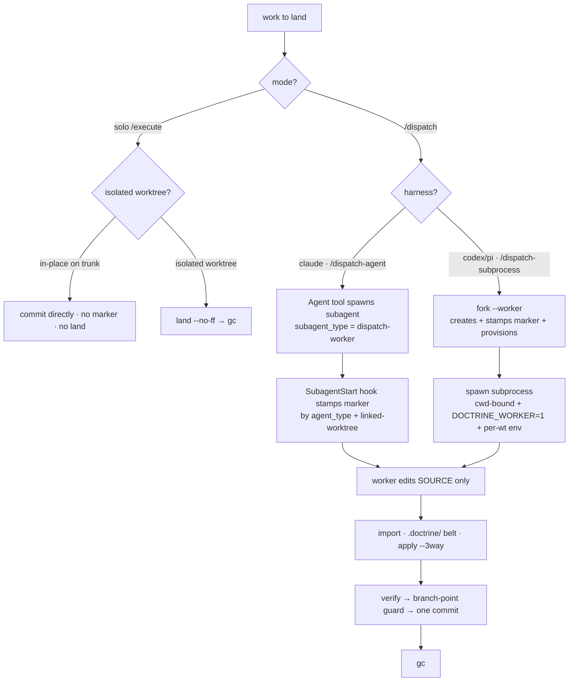

# SL-056 Design — Orchestrator spawn seam: worktree mechanism into CLI verbs

> Clean redesign (8th-inquisition target). The round-1→7 reasoning trail lives in
> `design-history.md`; the per-charge dispositions in `inquisition-1.md`…`-7.md`.
> This document states **what we build**, not how we argued to it. Scope:
> `slice-056.md`. Evidence base: `.doctrine/slice/055/research/worktree-orchestration.md`
> (shared with sibling SL-055).

## 1. Thesis

**Mechanism belongs in the CLI verb; judgment and harness concessions belong in
prose.** The worktree/dispatch creation ladder, the import funnel, the solo land
merge, build isolation, and the worker-mode guard move out of fail-open skill prose
into fail-closed, golden-testable CLI verbs — identical under claude/codex/pi by
construction — with an **orchestrator-owned fork + a disk marker as the
harness-agnostic keystone.**

This is the **pure/imperative wall lifted to the orchestration layer.** The binary
is the pure mechanism core; the harness spawn — a subprocess for codex/pi, the
`Agent` tool for claude — is the thin impure shell. Every decision below applies
that wall.

## 2. Decision tree



The harness axis splits **only the spawn shell** (§4); the cadence after a worker
produces its delta — `import → verify → branch-point → one commit → gc` — is the
identical CLI verb sequence for both (§7, the slice's whole payoff). Solo bypasses
`import` (it lands a multi-commit branch via `land`, §6).

## 3. Worker identity — disk marker primary

Worker-mode is a property of the **worker**, signalled by a **disk marker the
trusted orchestrator stamps before the worker runs.** Disk is the one identity
substrate *every* harness has; an env seam is not (claude's `Agent` tool has none,
and `claude -p` is API-billed + harness-specific — rejected).
[[mem.pattern.dispatch.spawn-backend-harness-agnostic-no-free-env-seam]] binds this
floor.

```
marker path:  <root>/.doctrine/state/dispatch/worker      (withheld runtime tier)
worker_mode(root) := (is_linked_worktree(root) && marker_present(root))  // PRIMARY, agnostic
                     OR env DOCTRINE_WORKER set                          // codex/pi worker-on-main catch
guard (in run(), before dispatching a write-classed OR Orchestrator Command):
    if worker_mode(root): refuse(verb)   // names the verb
```

- **Marker is primary and harness-agnostic.** Present in a linked worktree ⇒ writes
  refused. Presence-only, no contents.
- **`DOCTRINE_WORKER=1` env is a codex/pi *optimisation*, not the identity.** Its one
  job: catch the **worker-on-main** hazard (ADR-006 D2b — the harness drops the worker
  on the coordination root, where no marker exists and `is_linked_worktree` is false).
  Available only where a subprocess spawn carries env (codex/pi). For **claude** it is
  unavailable, so worker-on-main stays the deferred D2b residual, mitigated by
  always-isolating the worker + the hook-stamped marker.
- Solo `/execute` (in-place or isolated) sets **neither** signal → writes freely.
  **Mode, not location, decides** (ADR-006 D6a). `is_linked_worktree` is the existing
  predicate (memory squash-warn, RV-verb refusal — now a third consumer).
- **Lifecycle (owned):** written by `fork --worker` (codex/pi) or the SubagentStart
  hook (claude); removed by `gc`; rolled back if `fork` fails; cleared by `marker
  --clear` for a stray marker (below). A tree may become a coordination/direct-writer
  root only after an **assert-marker-absent** check that, on a stray marker, refuses
  and **names the remedy** (`marker --clear`) — detection carries a cure. This gates
  *every* transition of a linked worktree into a direct-writer role, **solo
  `/execute` included** (D6a makes solo a full self-orchestrator in a linked worktree).
- **`marker --clear` (bespoke class — see §5).** Removes the marker at the cwd tree
  root, loud receipt. Refused if `DOCTRINE_WORKER` set, if cwd is not the marker's
  tree root, and — when the cwd tree is a **linked worktree** — unless `--operator` is
  passed (accident-fence). **Never** refused by the marker conjunct itself (locking the
  marker's only remover behind the marker is the self-brick we reject).
- **Observability (required):** `doctrine worktree` status prints `worker fork: yes —
  writes refused; signal: env|marker`, so the mode is discoverable without knowing the
  gitignored path.
- **Withheld tier:** `.doctrine/state/**` is already gitignored, provision-dropped, and
  absent from the import delta — the marker inherits every exclusion with zero new tier
  logic (confirm in the `is_withheld` test).

**Env blast-radius bound.** `DOCTRINE_WORKER` is set **only in the spawned child's
env**, never `export`ed into the orchestrator's shell; the orchestrator never sets it
on itself. When the **env disjunct** trips `worker_mode` on a tree that is **not a
linked worktree** (main, a plain checkout — where a real worker fork never is), the
state is provably either a worker-on-main *or* a leak. Every verb refused this way —
authoring (`slice new`/`design`/`plan`) **and** `Orchestrator` funnel verbs — carries
a **named dual-cause** message ("`DOCTRINE_WORKER` set outside a worker worktree: a
worker was dropped on the coordination root → re-dispatch isolated; **or** the env
leaked into this process → unset it"), never a bare "worker refused."

## 4. Per-harness spawn

The mechanism/concession line falls between **what the binary does** (create-or-mark
+ provision + per-wt env *contract* emission — harness-identical) and **how the
worker is spawned** (harness-shaped → prose, selected by the `/dispatch-*` router).

### 4a. codex/pi — `/dispatch-subprocess`

`doctrine worktree fork --base <B> --branch <name> --dir <path> --worker` creates the
worktree, stamps the marker, provisions, emits the per-wt env contract on stdout. The
orchestrator then spawns the subprocess **with its cwd bound to the fork**:

```sh
fork_env="$(doctrine worktree fork --base "$B" --branch "$BR" --dir "$D" --worker)" \
  || { echo "fork failed: $?" >&2; exit 1; }      # halt, do NOT spawn
env -C "$D" DOCTRINE_WORKER=1 $fork_env codex exec "<pre-distilled prompt>"
#       ^ cwd→fork    ^ worker-on-main optim   ^ per-wt env    ^ harness-shaped line
```

- **`env -C "$D"` binds the worker process cwd to the fork.** Without it `codex exec`
  inherits the orchestrator's cwd (the coordination root it ran `fork` from) and the
  worker's *source* edits land on the trusted branch — bypassing `import`, the belt,
  and branch-point discipline; the `DOCTRINE_WORKER` guard catches only
  doctrine-mediated writes, never a raw editor write to cwd. The cwd-bind is a
  **spawn-shell mechanism**, not a prompt instruction. Portable fallback if `env -C` is
  absent: `( cd "$D" && exec env DOCTRINE_WORKER=1 $fork_env codex exec … )`. Under D6,
  `bwrap … --chdir "$D"` is the confined equivalent.
- **Capture + check `$?`; never `eval "$(…)"`** — `eval` swallows the exit status, a
  fail-open trap. `$fork_env` is the stdout env block; status went to stderr.

`fork` steps (deterministic, harness-identical) — **compensating cleanup, not a true
transaction:** git mutations are not atomic, so any failure after step 1 triggers a
best-effort rollback (`git worktree remove --force`, `git branch -D`, reap the dir);
a rollback that itself fails **names the leftover and exits non-zero** — never a
silent half-rollback:
1. `git worktree add -b <branch> <dir> <B>` (correct syntax: `-b <branch>` for a new
   branch at `<B>`). Refuses if `<dir>`/`<branch>` exist or `<B>` is not a commit.
   `<dir>` must be **unique per branch** and outside the repo root or a gitignored
   in-repo path (else a concurrent same-slice batch collides / dirties the tree).
2. `doctrine worktree provision <dir>` (existing sole-copier; withheld tier excluded).
3. If `--worker`: write the marker **before** any spawn window. Solo omits `--worker`.
4. Emit the **per-worktree env contract** on stdout (`KEY=value` per line); human
   status to stderr. The contract is *generalisable* — the project declares its per-wt
   env; doctrine-the-repo declares `CARGO_TARGET_DIR=<jail-root>/wt/<branch>` (§8, a
   project-local consumer, not a framework primitive).

### 4b. claude — `/dispatch-agent`

No `fork` verb, no env seam. The orchestrator launches the worker via the `Agent` tool
with `subagent_type: dispatch-worker` and `isolation: worktree`. The harness creates a
real linked worktree (`.claude/worktrees/agent-<id>`) and fires a **`SubagentStart`
hook** for that subagent, before it runs, with payload `{agent_type, cwd(=worktree),
agent_id, …}`. The orchestrator-installed hook (§8) stamps the marker:

```
SubagentStart hook command:  doctrine worktree provision <payload.cwd>      # ADR-006 D9 — see below
                              doctrine worktree marker --stamp-subagent      # reads payload JSON on stdin
    both gated:  act iff  payload.agent_type == "dispatch-worker"  AND  payload.cwd is a linked worktree
    else exit 0   (benign subagents are neither provisioned-as-workers nor branded)
```

- **The hook owns provisioning *and* stamping for claude (SR-1).** A claude `Agent`
  worktree is born by the harness, **not** by `doctrine worktree fork`, so nothing has
  run ADR-006 D9 provisioning (the gitignored-allowlist copy, withheld tier excluded).
  The native `WorktreeCreate` hook **cannot** stand in: its payload carries `name`, not
  `agent_type`, so it cannot discriminate a dispatch worker from a benign isolated
  subagent. `SubagentStart` is the only agent_type-gated seam that fires before the
  worker runs (after the worktree exists), so it provisions **then** stamps — gated on
  `agent_type`, so non-dispatch isolated subagents get neither. (For codex/pi `fork`
  still does both, §4a.)
- **`agent_type` is the discriminator** (the orchestrator controls it via
  `subagent_type`); **`payload.cwd` is the provision + stamp target** — the verb reads
  cwd from the **payload**, never its own process cwd (the hook runs at the
  orchestrator root, where `worker_mode` is false, so the minting verb is never
  self-refused; §5). Each SubagentStart fires for its own subagent independently ⇒
  **claude dispatch workers can be spawned and executed concurrently** (file-disjoint),
  not a serial degrade — grounded in a live probe: two simultaneous
  `isolation:worktree` subagents produced two independent events with distinct
  `cwd`/`agent_id`, no shared slot
  ([[mem.pattern.dispatch.claude-subagentstart-worker-identity]]).
- **Concurrency is in worker *execution*, not the funnel (SR-2).** The marker-stamping
  apparatus is concurrent-safe; the **funnel-back is still serialized** by `import`'s
  stationary-head precond (§7c — one orchestrator, `HEAD == B`), exactly as for
  codex/pi. The redesign removes the *stamping* serialization (the old arm sentinel),
  not the import serialization. A concurrent batch runs workers in parallel and funnels
  their deltas one at a time.
- **No arm sentinel, no lease, no single-slot lock, no `marker --arm/--disarm`, no
  serial-only constraint, no WorktreeCreate stamp path.** The empirical probe proved
  that whole apparatus unnecessary (it was an artifact of guessing claude's hooks API).
- **Identity = the hook-stamped marker (disk).** `DOCTRINE_WORKER` and bwrap are
  unavailable; the worker shares the jail-wide build target (§8); worker-on-main is the
  deferred D2b residual.
- **Spike-gated (§9), version-fragile facts:** that SubagentStart fires *before* the
  worker's first write (the marker lands in time), the payload shape, and `agent_type`
  stability. **Named fallback if refuted:** prompt-enforced worker-sole-writer (no
  marker mechanism) — altitude-table-confessed, symmetric with the D6 bwrap back-out.

### 4c. claude self-clear residual (confessed, not closed)

The marker is a file *inside* the worker's worktree and the env is shell-strippable, so
a **non-compliant** worker of any harness can `rm` the marker or `env -u
DOCTRINE_WORKER` directly. The `--operator`/env-lock hardening on `marker --clear`
fences **accidents, not malice, on every harness.** For claude there is **no mechanism
floor against a deliberate self-clear** (no env-lock; bwrap is codex/pi-only) until a
free env seam or OS confinement (IDE-004 channels / userns-bwrap) lands. claude
worker-sole-writer is therefore **accident-fenced + prompt-enforced, not malice-proof**
— stated plainly in the §10 per-harness altitude table. The malice containment on the
**dispatch funnel** is the import `.doctrine/`-rejection belt (§7), not the marker.

## 5. Privilege classes

`write_class` (exhaustive over `Command`) is **unchanged** (behaviour-preserving). Two
classes join the worker-mode guard, one stays open, one is bespoke:

| Class | Members | Refused under `worker_mode`? |
|---|---|---|
| **Orchestrator** | `fork`, `import`, `land`, `gc` | **Yes** — they mutate git refs/dirs (create/remove worktrees, delete branches, merge commits, reap dirs). Classifying them `Read` because they spare the authored TOML corpus is a category error (a worker could delete branches, violating ADR-006 D2). |
| **write** | authoring writes (`slice new`/`design`/`plan`/`memory record`/status-transition) | Yes (unchanged) |
| **Read** | `provision`, `check-allowlist`, `branch-point-check`, status | No — open to workers |
| **`marker --clear`** | bespoke 4th class (§3) | **No** — locking the marker's only remover behind the marker is the self-brick. Refused instead by env-set, cwd-not-tree-root, and the `--operator` accident-fence in a linked worktree. |

The `marker --stamp-subagent` entry point (§4b) **mints** the marker; it runs in the
orchestrator's session at the coordination root (worker_mode false there) targeting the
payload `cwd`, so it is never self-refused — the same posture as `fork --worker`'s
marker write.

## 6. `land` — solo `/execute`'s coordination merge

Solo's analog of dispatch's `import`: a fail-closed verb that lands a solo
isolated-worktree TDD branch onto the coordination branch, **structurally non-squash**,
so gc's ancestry leg (§6.1) and memory-anchor sha-stability (ADR-006 D8) both hold.
`Orchestrator`-classed. **Solo-only** — dispatch uses `import` (single distilled
commit, ancestry severed); `land` is for solo's multi-commit branch (ancestry
preserved). The in-place solo path needs no `land` (it commits directly).

```
doctrine worktree land --fork <branch>      # runs at the coordination root
```

1. **precond** — tree clean (`git status --porcelain --untracked-files=no`-empty, same
   scoping as `import`) else `tree-unclean`; HEAD is the coordination branch;
   `<branch>` exists else `no-such-fork`; `<branch>`'s **live linked worktree** does
   *not* bear the worker marker else `dispatch-fork` (a marker-bearing fork is a
   dispatch worker — its delta must funnel through the belted `import`, never `land`'s
   beltless merge); **and `<branch>` must *have* a live linked worktree** — the marker
   is uncommitted and unreachable once the worktree is gone, so a worktree-less branch
   would pass `dispatch-fork` *vacuously* → refuse **`worktree-gone`** ("cannot verify
   it is not a dispatch fork; re-create the worktree, route through `import`, or
   `--force` knowingly"). The marker guard is honestly a **live-worktree
   accident-fence**, not a universal provenance proof.
2. `git merge --no-ff <branch>` — **never `--squash`** (the verb cannot express one).
   Ancestry preserved ⇒ fork commits reachable ⇒ gc's ancestry leg reaps.
3. on conflict → **`git merge --abort` first** (restore the clean tree step 1 demands),
   *then* refuse `merge-conflict`, report + halt — never auto-resolve. `git merge`
   mutates the index/tree and sets `MERGE_HEAD` *before* reporting the conflict, so the
   half-merge **must** be aborted else it wedges the tree against the verb's own
   re-entry guard. The abort is itself fallible and guarded to fire **only mid-merge**
   (`MERGE_HEAD` present): step 3 reached with no merge in progress → refuse
   **`inconsistent-merge-state`** (never a silent abort masquerading as a clean
   conflict). Abort success → ordinary `merge-conflict`, tree guaranteed clean. Abort
   **failure** → a **distinct non-zero `wedged-merge`** naming `MERGE_HEAD`, the
   unmerged paths, that the tree is **not** clean, and the manual remedy.

**Refusal set:** `{tree-unclean, no-such-fork, dispatch-fork, worktree-gone,
merge-conflict, wedged-merge, inconsistent-merge-state}`.

Pure core: `classify_land(tree_status, head, fork_state) -> Result<Merge, Refusal>`
where `fork_state = {exists, has_live_worktree, bears_marker}`; imperative shell drives
`git merge --no-ff` and the mid-merge-guarded abort. Reuses the tree-clean check shared
with `import` (no parallel implementation).

## 7. The funnel belt + `import`

### 7a. `import` (dispatch funnel)

```
doctrine worktree import --base <B> --fork <branch>      # runs at coordination root
```

`Orchestrator`-classed. **Dispatch path only** (a single distilled worker commit,
ancestry severed); solo uses `land`. **v1 is the stationary-head case only**, each step
a hard refusal (no auto-merge):
1. **precond — two guards:** `HEAD == B` (`branch-point-check`, a ref-equality compare)
   **and** the tree is clean (`git status --porcelain --untracked-files=no`-empty —
   tracked + staged only). Untracked files are **excluded deliberately** (benign
   scratch/memory/withheld sheets must not false-`tree-unclean` the common case).
   `HEAD != B` → `head-moved`; dirty → `tree-unclean`.
2. `S^ == B` (single-non-merge fork delta) else `multi-commit`.
3. **belt:** reject if the `B..S` **name-only** diff touches any `.doctrine/` path
   (prefix-match, tracked files only) else `doctrine-touch`. A forced-added marker is
   caught too (defense in depth).
4. `git apply --3way --index` (non-committing). Under **both** preconds the patch
   applies onto the exact tree it was cut from ⇒ cannot conflict ⇒ `apply-conflict` is
   **not** a v1 refusal. The orchestrator commits **separately** (ADR-006 D7 cadence;
   import ≠ commit). **No runtime receipt is stamped** — a flag born before the commit,
   in the gitignored tier, survives a crash and lies "landed" to `gc`; instead `gc`
   derives landed-ness from durable git state (§6.1).

**Refusal set (v1):** `{head-moved, tree-unclean, multi-commit, doctrine-touch}`.

Pure core: `classify_import(diff, base, head) -> Result<Apply, Refusal>`; imperative
shell drives git + apply.

### 7b. Belt scope (honest)

The `.doctrine/`-rejection belt is the **dispatch/import-path** containment — a
dispatch worker's doctrine delta never funnels back through `import`. It is **not** an
unconditional all-funnel containment: solo's `land` (§6) is a second, **beltless**
sanctioned funnel — solo is a trusted self-orchestrator that *legitimately* lands
doctrine, so a belt there is a category error. The belt's true scope: the
import/dispatch path, conditioned on dispatch deltas routing through `import` and never
`land` — mechanised by `land`'s `dispatch-fork` + `worktree-gone` guards (§6).

### 7c. Quiescence constraint

Stationary-head v1 import **requires a coordination branch with no concurrent external
committers.** On a live main, each external commit moves HEAD to `B+1` and forces every
in-flight worker's import to refuse `head-moved` → re-dispatch → re-invalidated —
**livelock**. The constraint: **a live main mandates delta-branch coordination
(ADR-006 D8 team mode)**; solo-on-main dispatch is safe only when main is quiescent for
the run. The orchestrator **detects** a moved coordination HEAD via the branch-point
guard and **reports the external mover by name** rather than silently re-dispatching
into livelock. The in-verb re-anchor is the real fix — deferred (§13, IMP-043).

## 8. `gc`

```
doctrine worktree gc --fork <branch> [--superseded-head <SHA>] [--force] [--dry-run]
```

`Orchestrator`-classed. Reaps, in one act: (1) `git worktree remove` the fork dir
(removing its marker); (2) `git branch -D` the fork branch (never a git-ancestor, so
`-d` always refuses — the patch-id gate, not `-d`, is the safety); (3) reap the
`wt/<branch>` target dir (closes the §8 disk loop); (4) warn (stderr) that
`env!(CARGO_MANIFEST_DIR)`-baked test binaries need recompile.

**Ordering is forced:** `git branch -D` refuses a branch checked out in a live
worktree, so the worktree must go first. The crash window between (1) and (2) — *branch
alive, worktree gone, marker unreachable* — is **intrinsic to git**, closed downstream
by `land`'s `worktree-gone` refusal (§6) and within `gc` by idempotent rerun (§8.2).

### 8.1. The "landed" oracle — durable patch-id, no receipt

`gc` deletes **only** when the fork's commit has *provably landed*, tested against
durable git state (not a runtime flag). `--merged` is wrong (apply-funnel branch is
never a git-ancestor); delta-emptiness is also unsound (`git diff B..fork` is never
empty for real work; `diff HEAD..fork` false-diverges when a sibling moves HEAD). v1
uses **two legs, union** via `git cherry <coordination-HEAD> <fork-branch>`:
- **ancestry** — `<fork-tip>` is an ancestor of `<coordination-HEAD>` (the `land`
  route: fork commits reachable), **OR**
- **patch-id** — every commit `git cherry` lists is `-` (the `import` route: ancestry
  severed, but each commit's *patch* landed).

A non-ancestor tip with any `+` ⇒ not (fully) landed ⇒ refuse unless
`--superseded-head`/`--force`. **A squash-merge is structurally uncertifiable** (it
destroys both ancestry and per-commit patch-id) — so solo **must** land via the
non-squash `land` verb; a manually squash-merged fork trips neither leg and gc refuses
with a **named** message ("cannot certify a squash-merge — re-land via `worktree land`
(--no-ff), or `--force` knowingly"). **Crash-proof:** a crash between apply and commit
leaves no commit ⇒ `git cherry` reports `+` ⇒ gc refuses (a receipt would have lied
"landed" and reaped the only copy).

**Superseded forks — `--superseded-head <SHA>`, no stored flag.** Moved-HEAD
re-dispatch is the common case: a re-dispatched fork is spent yet never landed (`+`) →
bare gc would demand `--force`, training the reflex the oracle exists to kill.
`--superseded-head <SHA>` reaps **iff** `<SHA>` equals the branch's current head — an
**operator assertion** that this exact, still-current commit is spent-and-abandoned
(the head-match is a TOCTOU movement-guard, **not** a landing proof). Fail-safe both
ways: a lost SHA only costs a `--force` (gc refuses — the safe side); a wrong SHA
cannot match a live head unless it *is* that head. No stored record ⇒ no removal owner
to forget, no branch-name key to false-match.

**Observability:** `gc --fork <b>` / `--dry-run` prints the per-fork verdict ("`<b>`:
landed ✓ / not-landed — `--force` to reap"), computed from git, so the operator never
`--force`s blind.

### 8.2. `gc` is an idempotent state machine

`gc` that crashed between any two destructive steps **completes on rerun or names the
leftover** — never strands its own debris. Pure `classify_gc(state) -> GcPlan` over
impure-gathered `{branch_exists, worktree_present, target_present, landed_verdict?}`:
- **Gate runs only while the branch lives.** The oracle requires B; it is monotone and
  re-runnable (a landed fork stays landed), so a rerun re-certifies and resumes.
- **Branch-gone ⇒ the deletion *is* the certificate.** A fork branch is deleted only
  through `branch -D` after the gate passed, so branch-absent ⇒ already-certified. The
  only branch-gone residue is **T** (the `wt/<branch>` target dir) — derived build
  cache, never the only copy, path a pure function of the branch *name*
  (`target_dir_for_branch`), so a rerun reaps it from `--fork <branch>` alone. (gc's
  own ordering removes W before deleting B; "branch gone + live linked worktree" is
  git-impossible — `branch -D` refuses a checked-out branch.)
- **Skip completed steps** — reaping an absent thing is a no-op.
- **Every destructive step is honest on failure** — worktree-remove / `branch -D` /
  target-reap each name their leftover and exit non-zero; a stale administrative
  worktree entry is folded into the worktree leg (`git worktree prune`).

**Cleanup ownership:** the caller of `fork` owns `gc`. `/dispatch` concludes with `gc`
(after `import`); solo `/execute` ends with `land` then `gc`. The two-leg oracle spans
both routes.

## 9. Install + wiring — `claude install`

Skills currently install via `doctrine skills install` (RustEmbed from `plugins/`,
direct symlink into `.claude/skills` for Claude, `npx skills` delegation otherwise).
This slice **renames `skills install` → `claude install`** and extends it to install,
for the Claude surface:
- **skills** (unchanged behaviour);
- **agents** — `install/agents/claude/dispatch-worker.md` symlinked into
  `.claude/agents/` (parallel to skills; user-serviceable markdown — name +
  description + tool allowlist — not a Rust type);
- **the SubagentStart hook** — merged into `.claude/settings.local.json` via the
  existing `HookSpec` merge core (`src/boot.rs`), the same machinery that wires the
  `SessionStart` boot/sync hooks. The hook command is the one line in §4b.

> **Scope note.** The rename touches the CLI surface, goldens, and skill docs that say
> "skills install" — a deliberate SL-056 inclusion, not just the claude mechanism. The
> agents leg and the hook leg are the load-bearing parts; the rename is the
> consolidation that makes one Claude-surface installer.
>
> **Orphan-reference sweep (SR-3).** Renaming strands references: the memory
> `[[mem.pattern.distribution.skill-refresh-command]]` and any skill docs that say
> "skills install". Resolution: keep `skills install` as a **hidden deprecated alias**
> dispatching the same handler (no flag-day break), sweep the docs to `claude install`,
> and update the memory. The alias is a plan-level deliverable, called out here so it is
> not forgotten.

`marker --stamp-subagent` is the verb the hook calls: reads the SubagentStart payload
JSON on stdin, `classify_stamp(payload) -> Stamp | Skip` (a plain function, one golden
— no heavy type ceremony), writes the marker on `Stamp`, exits 0 on `Skip`. The gate
lives in the binary (testable), the hook stays dumb — honoring the §1 thesis without
over-engineering.

## 10. Governance deliverables

Decisions govern → land first; the design *produces the drafts*. Sequence: **G1+G3 →
O3 spike → G2 → G4 → remaining code** (the guard+privilege spike precedes the ADR-006
amend it validates).

- **G1 — ADR-008 revise→accept** (the gate). Fold §5.1 evidence; record D-B2 (ro
  `~/.cargo/bin` ⇒ no in-jail install race); re-scope D-B3 around the userns question.
- **G2 — ADR-006 amend.** (a) demote the native WorktreeCreate hook as a *creation*
  preference (base-pinning + subprocess spawn supersede it for codex/pi); **claude's
  marker-stamping seam is now the SubagentStart hook, not WorktreeCreate.** (b) replace
  the `DOCTRINE_WORKER=1` self-arm with the **disk-marker-primary** signal (agnostic),
  env a codex/pi optimisation, plus the `Orchestrator` verb class. State the
  per-harness enforcement altitude. **Spike-first:** the guard/privilege model and the
  claude SubagentStart marker path are validated by the O3 spike *before* G2 amends the
  accepted ADR.
- **G3 — ADR (new, id via `doctrine adr new` — likely ADR-011).** The spawn-seam
  **contract** (orchestrator owns fork-or-mark + provision + per-wt env emission;
  worker identity is the disk marker) + a **per-harness capability/altitude table**:
  - **codex/pi:** subprocess spawn ⇒ env-arm + per-wt env + bwrap (full mechanism floor
    *under D6*; accident-fenced absent D6).
  - **claude:** `Agent` tool + SubagentStart-hook marker (a **first-class** backend, not
    a degraded rung); **concurrent-safe** (no serial constraint — the redesign);
    marker-only altitude (no env, no per-wt target, no bwrap); **accident-fenced +
    prompt-enforced, not malice-proof** against a deliberate self-clear (§4c) — deferred
    to IDE-004 / userns-bwrap. The marker-stamp path is O3-spike-contingent with the
    prompt-enforced fallback.
  - No harness-specific command (`claude -p`) is a required element. The env/spike
    claims stay `proposed` until the O3 gate is green.
- **G4 — SPEC-012 rewrite.** Reframe Overview/Concerns (the funnel is now enforced
  code); rewrite D3 (fail-open env → fail-closed marker-primary guard); state the
  achievable altitude per harness, the quiescence constraint, the solo non-squash-land
  constraint, and the belt's honest scope; add FRs (fork, import, land, gc, marker
  guard, per-wt env contract).

Untouched: ADR-007, ADR-001/003/004, the withheld-tier model.

## 11. Code impact

| Path | Change |
|---|---|
| `src/worktree.rs` | `run_fork` (compensating-cleanup rollback, honest non-zero), `run_import` (`classify_import`), `run_land` (`classify_land`; `git merge --abort` mid-merge-guarded → `wedged-merge`/`inconsistent-merge-state`; `worktree-gone`), `run_gc` (**idempotent state machine** — `classify_gc(state) -> GcPlan`; two-leg oracle `--is-ancestor` OR `git cherry` patch-id; `--superseded-head`; squash → named refusal), `run_marker_clear` (`--operator`), **`run_stamp_subagent`** (reads SubagentStart payload, `classify_stamp`, writes marker on match). Pure: `target_dir_for_branch`, `marker_path`, `classify_import`, `classify_land`, `classify_gc`, `classify_stamp`. New `write_marker`/`marker_present`/`remove_marker` (`write_marker` also invoked by `--stamp-subagent`). Third `is_linked_worktree` consumer. **Deleted vs history: `run_marker_arm`/`run_marker_disarm`, `arm_path`, the lease/single-slot apparatus — obviated by the SubagentStart mechanism.** |
| `src/main.rs` | `fork`/`import`/`gc`/`land` subcommands + `marker {--clear --operator, --stamp-subagent}` (watch bool/arg clippy ceilings, [[mem.pattern.lint.cli-handler-args-struct]]). Worker-mode guard `worker_mode(root) = (is_linked_worktree && marker_present) OR env DOCTRINE_WORKER`. `write_class` unchanged. **`fork`/`import`/`gc`/`land` are the new `Orchestrator` class** (refused under `worker_mode`, NOT `Read`). The env-leg refusal on a non-linked tree carries the named dual-cause message for authoring **and** funnel verbs. |
| `src/skills.rs` → install surface | **Rename `skills install` → `claude install`** (keep `skills install` as a **hidden deprecated alias** → same handler, SR-3); add the **agents** leg (symlink `install/agents/claude/*.md` into `.claude/agents/`) and trigger the SubagentStart hook merge. Update `Write("skills install")` audit label + goldens; sweep docs + the `[[mem.pattern.distribution.skill-refresh-command]]` memory. |
| `src/boot.rs` | A **SubagentStart** `HookSpec` reusing the existing merge core; wired by `claude install`. The hook command **provisions then stamps** (SR-1), both gated on `agent_type == dispatch-worker` + linked-worktree `payload.cwd`. |
| `src/git.rs` | new reads behind the verbs: worktree list, **patch-id reachability** (`git cherry`), `B..S` name-only diff. Impure seam only. |
| `install/agents/claude/dispatch-worker.md` | **New** — the dispatch-worker subagent definition (name, description, tool allowlist). |
| `plugins/doctrine/skills/{worktree,dispatch,execute}/SKILL.md` + new `{dispatch-subprocess,dispatch-agent}/SKILL.md` | Rewrite prose to *call* the verbs. **`/dispatch` becomes a harness router** → `/dispatch-subprocess` (codex/pi) \| `/dispatch-agent` (claude). Router input: the agent's harness self-belief **cross-checked against env-marker detection** (`CLAUDECODE` etc., names resolved in-skill/at spike — see IDE-005 for pushing this into the binary); routes only when detection **agrees**; mismatch/unknown → refuse **naming the cause**, never a blind spawn. The detection signal is itself spike-gated **per harness** (a green for claude does not bless codex/pi). `/dispatch-subprocess` binds the worker cwd (`env -C "$D"` / bwrap `--chdir`); `/dispatch-agent` spawns `subagent_type: dispatch-worker` (cwd is the worktree by construction). One identical cadence, two ~2-line spawn templates. Re-embed ritual [[mem.pattern.distribution.skill-refresh-command]]. |
| ADR-008 / ADR-006 / **ADR-011 (new)** / SPEC-012 | G1–G4. |
| `flake.nix` | none for the spike; a `dispatch-worker` bwrap profile only if D6 lands (`--ro-bind`s the marker so a confined worker cannot `rm` it). |

## 12. Verification

- **Black-box CLI goldens** ([[mem.pattern.testing.black-box-cli-golden]], `force_no_tty`):
  `fork` (env on stdout, status on stderr, marker written; `git worktree add -b` syntax
  pinned); `import` happy + each refusal (`head-moved`, `tree-unclean`, `multi-commit`,
  `doctrine-touch`); `land` happy (`--no-ff` commit, fork commits reachable) + refusals
  (`tree-unclean`, `no-such-fork`, `dispatch-fork`, `worktree-gone`, `merge-conflict`
  with verified `git merge --abort` + clean tree, `wedged-merge`,
  `inconsistent-merge-state`); `gc` (worktree+branch+target reaped, two-leg oracle,
  squash named-refusal, `--superseded-head` honesty, `--dry-run` verdict).
- **Worker-mode guard — invariant test driving `run()`, not a pure helper**
  ([[mem.pattern.review.invariant-test-must-drive-the-write-seam]]): (a) linked worktree
  + marker → authoring/status-transition refuse (the **primary** signal); (b)
  `DOCTRINE_WORKER` on the coordination root → refuse (env optim); (c) worktree without
  marker, no env (solo) → allowed; (d) non-worktree tempdir, no env → allowed. Tests
  unset `DOCTRINE_WORKER` *and* run outside a marked worktree
  ([[mem.pattern.dispatch.worker-verify-unset-doctrine-worker]]).
- **`Orchestrator`-class refusal — exhaustive, every current member:** from a marked
  fork **and** from an env-set process, **`fork`, `import`, `land`, `gc`** are each
  refused — drive `run()`. `marker --clear` is **kept out** of this class and its
  bespoke refusal rules are tested separately (§3). *(This is the round-7 Charge π fix:
  the list is exhaustive and includes `land`.)*
- **`marker --stamp-subagent` gate (the claude path):** `classify_stamp` golden —
  `agent_type == dispatch-worker` + linked-worktree `payload.cwd` → marker written
  (verb reads cwd from the **payload**, not its process cwd — SR-4); wrong agent_type →
  exit 0, no marker; non-worktree cwd → exit 0, no marker (a benign subagent is never
  branded). **Provisioning (SR-1):** the same agent_type gate provisions the
  Agent-born worktree (D9 allowlist, withheld tier excluded) — assert a dispatch-worker
  cwd is provisioned, a benign subagent cwd is not.
- **`marker --clear` (self-brick cure):** a stale marker on a linked-worktree
  coordination root → writes + `gc` refused; `marker --clear --operator` (env unset)
  restores both from within the CLI; refused when `DOCTRINE_WORKER` set or run outside
  the marker's tree; a bare `--clear` in a linked worktree refuses (accident-fence).
- **`fork` compensating cleanup:** a forced provision failure rolls back leaving no
  orphan; a rollback that half-fails exits non-zero naming the leftover; a pre-marker
  failure leaves no unmarked fork.
- **`gc` idempotent rerun (round-7 Charge ξ):** inject/simulate failure after **each**
  destructive step, rerun `gc`, assert either full cleanup or a named non-zero leftover.
  Include the **branch-gone / target-present** case (reap T from the branch name alone,
  no live branch) and the gc-own-ordering case (W removed before B).
- **O3 spike (claude marker-via-SubagentStart):** confirm the hook fires **before** the
  worker's first write (marker lands in time), the payload shape (`agent_type`, `cwd`),
  and `agent_type` stability; confirm **two concurrent** dispatch-worker subagents each
  get their own stamp (no shared slot); exercise the **spike-failure branch**
  (prompt-enforced fallback, no marker). Per-harness: a green for claude does not bless
  codex/pi env propagation, which is its own gate.
- **D5 (codex/pi):** two parallel worktree builds, no cargo-lock contention, each spawns
  its correct `CARGO_BIN_EXE`. (Claude shares the jail-wide target — the §5.1 rituals
  are the proof there, not isolation.)
- **D6 (if landed):** an out-of-tree write from the worker process is OS-denied; the
  confined worker cannot `rm` its ro-bound marker.
- **Behaviour-preservation gate — precise.** The migration legitimately *changes*
  worker-mode behaviour (env→marker trigger): the old `DOCTRINE_WORKER` guard tests are
  **rewritten** to the marker, not kept green. What stays green *unchanged* (the
  preservation proof): `select_copies`/provision, `branch-point-check`,
  `is_withheld`/allowlist, the `git.rs` born-frame seam.

## 13. Open questions (post-lock)

- **OQ-1 (IMP-043):** moved-HEAD import (`--allow-reanchor`: 3-way onto a moved HEAD +
  computable path-disjointness, [[mem.pattern.dispatch.reanchor-base-on-disjoint-head-move]])
  is a named backlog follow-up — **not** v1 scope, **not** fail-open prose. v1 refuses
  `head-moved` → re-dispatch.
- **OQ-2:** bwrap userns feasibility — empirical at the D6 spike (probe `bwrap
  --unshare-user --ro-bind / / true` inside the jail).
- **OQ-3:** disk pressure under N concurrent `wt/<branch>` targets — gc reaps; a worktree
  cap or `sccache` only if it bites.
- **OQ-4 (IDE-005):** push harness detection into the binary to shrink the `/dispatch-*`
  router decision surface — a named idea, **not** SL-056 scope.

## Appendix — resolved findings

Eight adversarial passes shaped this design. The full reasoning trail and per-charge
dispositions are preserved, not re-litigated here:
- `design-history.md` — the round-1→7 narrative (superseded).
- `inquisition-1.md` … `inquisition-7.md` — the charges and sentencing per round.

Headline dispositions carried into this clean design:
- **Round-7 ν** (codex/pi cwd not bound to fork) → §4a `env -C "$D"` / bwrap `--chdir`.
- **Round-7 ξ** (gc no idempotent recovery) → §8.2 idempotent state machine.
- **Round-7 ο** (arm-lease uses timeout as proof-of-death) → **dissolved**: the
  SubagentStart redesign removes the arm sentinel entirely (§4b); there is no lease, no
  race.
- **Round-7 π** (Orchestrator-class verification omits `land`) → §12 exhaustive list
  (`fork`/`import`/`land`/`gc`).
- **Rounds 3–6 (B/C/γ/θ/κ/μ/ζ/η/λ/ι …)** — the marker/sentinel/belt/router lineage; the
  arm-sentinel charges (γ/θ/κ/ο) are obviated by the empirical SubagentStart finding
  ([[mem.pattern.dispatch.claude-subagentstart-worker-identity]]); the surviving
  invariants (belt scope, land guards, router cross-check, altitude honesty) are stated
  in §3–§10.
