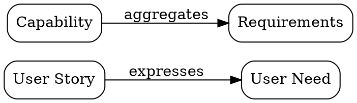
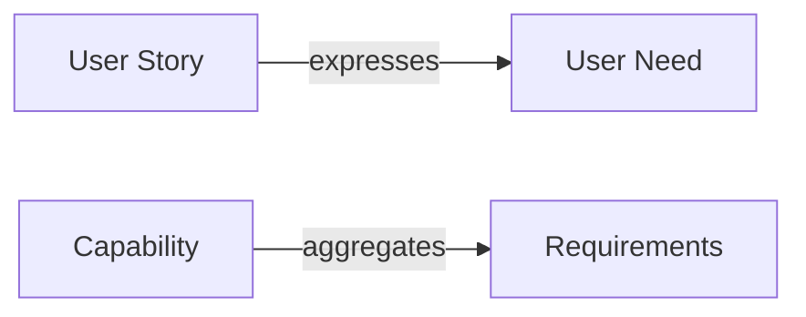

# SL-074 Design: Concept Map Entity + CLI

## 1. Architecture & Module Layout

### Tier placement (ADR-001)

```
Command tier:
  src/main.rs                 → ConceptMap enum variant + ConceptMapCommand enum

Engine tier:
  src/concept_map.rs          → Kind constant, scaffold, DSL parser, reader,
                                 diagnostics, export renderers, CLI handlers

Install assets:
  install/assets/templates/concept-map.toml    → scaffold template
  install/assets/templates/concept-map.md      → optional prose scaffold
```

Single file `src/concept_map.rs`. The concept map is a simple authored
artifact — no subdirectory warranted. If it grows, split internally (parser,
renderer, export modules) without breaking callers.

The file is organised in two layers (ADR-001):
- **Pure layer** (top): `read_concept_map`, `parse_dsl`, `check`,
  `render_dot`, `render_mermaid`, `render_json_value`, `rename_node_in_dsl`,
  `derive_node_key`, `dot_escape`, `mermaid_escape`. These functions take
  `&str` or parsed structs and return data — they never touch disk, clock,
  git, root discovery, Clap, or terminal formatting. The future web endpoint
  calls these directly.
- **Impure shell** (bottom): `run_new`, `run_list`, `run_show`, `run_add`,
  `run_remove`, `run_rename_node`, `run_check`, `run_export`. These handle
  root discovery, file I/O, `toml_edit` mutation, and stdout printing. They
  call the pure functions and marshal the results.

**No new crate dependencies.** No cordage integration. No catalog integration.
No graph database. The concept map is an authored artifact, not a hydrated
corpus projection. Edit-distance diagnostics use a small local implementation
(~20 lines of Levenshtein), not a crate.

### CLI command enum (src/main.rs)

```rust
#[derive(Subcommand)]
enum ConceptMapCommand {
    New { slug: Option<String>, title: Option<String>, path: Option<PathBuf> },
    List { #[command(flatten)] list: CommonListArgs, path: Option<PathBuf> },
    Show { reference: String, format: Format, edges: bool, nodes: bool, path: Option<PathBuf> },
    Add { id: String, source: String, rel: String, target: String, path: Option<PathBuf> },
    Remove { id: String, source: String, rel: String, target: String, path: Option<PathBuf> },
    RenameNode { id: String, old: String, new: String, dry_run: bool, case_sensitive: bool, path: Option<PathBuf> },
    Check { id: String, path: Option<PathBuf> },
    Export { id: String, format: ExportFormat, path: Option<PathBuf> },
}
```

`id` arguments accept canonical ref (`CM-001`) or bare number (`1`).
Resolution follows the `canonical_id` convention: `listing::parse_canonical_id("CM", s)`.

### Entity kind

```rust
pub(crate) const CONCEPT_MAP_KIND: Kind = Kind {
    dir: ".doctrine/concept-map",
    prefix: "CM",
    scaffold: concept_map_scaffold,
};
```

The scaffold produces:
- `concept-map-<nnn>.toml` — authored metadata + DSL payload
- `concept-map-<nnn>.md` — optional prose rationale
- `<nnn>-<slug>` symlink (human alias, standard entity engine convention)

The dir tree mirrors the slice pattern (numeric dirs, <nnn>-slug symlinks)
but lives under `.doctrine/concept-map/`, not `.doctrine/slice/`.

## 2. TOML Schema

```toml
id = 1
title = "Product specification context"
status = "draft"
created = "2026-06-16"
updated = "2026-06-16"
description = "Traditional concept map for product-facing specification entities."

dsl = '''
User Story > expresses > User Need
Capability > aggregates > Requirements
Feature > realizes > Capability
'''

[[relation]]
label = "contextualizes"
target = "PRD-010"
```

`id` is numeric (the directory basename `001`). The canonical ref `CM-001`
is derived from `CONCEPT_MAP_KIND.prefix` (`"CM"`) and `id`: single source
of truth, never stored as a TOML field. `created` and `updated` are standard
entity timestamps following existing Doctrine conventions (`{{date}}` in the
scaffold).

### Rust structs

```rust
/// The authored concept map as read from TOML.
#[derive(Debug, Deserialize)]
struct AuthoredConceptMap {
    id: u32,
    #[serde(skip)]  // derived: "CM-{id:03}"
    canonical: String,
    title: String,
    status: ConceptMapStatus,
    created: Option<String>,
    updated: Option<String>,
    #[serde(default)]
    description: Option<String>,
    #[serde(default)]
    dsl: String,
    #[serde(default, rename = "relation")]
    relations: Vec<Relation>,
}

/// Lifecycle status for concept maps — minimal, authored-artifact vocabulary.
#[derive(Debug, Clone, Copy, PartialEq, Eq, Deserialize, Serialize)]
#[serde(rename_all = "snake_case")]
enum ConceptMapStatus {
    Draft,
    Accepted,
    Superseded,
}
```

The `dsl` field holds the multiline string exactly as authored. The
`[[relation]]` rows are standard tier-1 edges authored via `doctrine link` —
concept maps can link to specs, ADRs, slices, etc. No separate
`[relationships]` dep/seq block — concept maps are authored artifacts, not
work items with hard/soft prerequisites.

The `Relation` type reuses the existing `crate::relation::Relation`:
`{ label: String, target: String }`.

Supersession uses `doctrine supersede CM-002 CM-001`, which writes
`supersedes`/`superseded_by` on the respective TOML files — these are relation
edges stored by the `supersede` verb itself, not fields on `AuthoredConceptMap`.
The concept-map reader ignores unknown TOML keys, so these fields coexist
without schema changes.

### Status semantics

- `draft` — the map is being authored; edges and nodes may change freely.
- `accepted` — the map is stable and represents agreed-upon understanding.
- `superseded` — a newer concept map replaces this one.

No `proposed→design→plan` ceremony — concept maps are authored artifacts,
not work items. The `supersede` verb is the standard ADR-004 `supersede`
pattern: `doctrine supersede CM-002 CM-001` flips CM-001 to `superseded`
and records `CM-002.supersedes += CM-001`, `CM-001.superseded_by += CM-002`.

## 3. DSL Parser

### Grammar

```
dsl_line  = source " > " relation " > " target
source    = non-empty text, trimmed
relation  = non-empty text, trimmed
target    = non-empty text, trimmed

Empty lines and lines starting with '#' (after optional whitespace) are ignored.
```

### Parsing algorithm

`parse_dsl(dsl: &str) -> ParsedConceptMap`

```
For each line in dsl (preserve raw line for diagnostics):
  1. If raw.trim() is empty → skip.
  2. If raw.trim_start().starts_with('#') → skip (comment).
  3. Split raw on literal " > " (no trimming before split).
  4. If segment count != 3 → MalformedLine (includes 2 or 4+ segments).
  5. Trim each of the 3 segments.
  6. If any trimmed segment is empty → EmptyLabel (reports which segment).
  7. Derive node key from label: lowercase, collapse whitespace/underscores/hyphens
     to single hyphen, strip non-alphanumeric-except-hyphen.
  8. Record node (key, label) and edge (from_key, from_label, rel, to_key,
     to_label, line).
```

Key property: do NOT trim before splitting. A line like `" > rel > target"`
splits on literal `" > "` into `["", "rel", "target"]` — count is 3, step 6
trims each and finds the first segment empty, producing `EmptyLabel { segment:
"source" }` rather than `MalformedLine`. This makes the empty-segment detection
reliable.

Why split on `" > "` not bare `>`: if `>` appears inside a label
(e.g. `"A -> B" > becomes > "C"`), it won't be surrounded by spaces on
both sides. The conventional concept-map form uses ` > ` with spaces. This
avoids ambiguity without complex escaping logic.

### Node key derivation

```rust
fn derive_node_key(label: &str) -> String
```

- Lowercase.
- Replace runs of whitespace, hyphens, and underscores with a single hyphen.
- Strip all other non-alphanumeric characters.
- Trim leading/trailing hyphens.

Examples:
- `"User Story"` → `"user-story"`
- `"PRD-010"` → `"prd-010"`
- `"Epistemic Record"` → `"epistemic-record"`
- `"Some_Case"` → `"some-case"`

Node identity is by **key**, not label. This supports future entity
resolution: `"prd-010"` can resolve to the `PRD-010` entity when corpus
composition lands.

### Output types

```rust
/// A parsed node: canonical key + authored display label.
#[derive(Debug, Clone, PartialEq, Eq, Serialize)]
struct ConceptMapNode {
    key: String,
    label: String,
}

/// A parsed edge: source/target keys and labels, relation text, line origin.
#[derive(Debug, Clone, PartialEq, Eq, Serialize)]
struct ConceptMapEdge {
    from_key: String,
    from_label: String,
    rel: String,
    to_key: String,
    to_label: String,
    line: usize,  // 1-indexed
}

/// The parsed concept map: nodes, edges, and any parse diagnostics.
#[derive(Debug, Serialize)]
struct ParsedConceptMap {
    nodes: Vec<ConceptMapNode>,
    edges: Vec<ConceptMapEdge>,
    diagnostics: Vec<ConceptMapDiagnostic>,
}
```

Nodes are deduplicated by key — the first label encountered is canonical.
When two lines produce the same node key but different authored labels
(e.g. `"User Story"` vs `"user story"`), the first label wins and a
`CanonicalNodeCollision` diagnostic is emitted.

### Diagnostic types

```rust
#[derive(Debug, PartialEq, Eq)]
enum ConceptMapDiagnostic {
    /// A DSL line that couldn't be split into exactly three segments.
    MalformedLine { line: usize, text: String },
    /// A segment (source/rel/target) was empty after trimming.
    EmptyLabel { line: usize, segment: SegmentKind },
    /// An exact duplicate edge (same from_key, rel, to_key) already exists.
    DuplicateEdge { line: usize, existing_line: usize, from_key: String, rel: String, to_key: String },
    /// A self-edge: from_key == to_key (informational, not an error).
    SelfEdge { line: usize, node_key: String },
    /// Two different labels normalise to the same node key.
    CanonicalNodeCollision { key: String, first_label: String, first_line: usize, label: String, line: usize },
    /// Two node labels are close in edit distance (likely spelling drift).
    SimilarNodeLabel { label_a: String, line_a: usize, label_b: String, line_b: usize },
    /// Two relation texts are close in edit distance (likely drift).
    RelationDrift { rel_a: String, line_a: usize, rel_b: String, line_b: usize },
    /// A label matches the entity-ref pattern but cannot be resolved in v1.
    /// Informational only — never treated as an error.
    EntityRefLike { label: String, line: usize },
}

#[derive(Debug, PartialEq, Eq)]
enum SegmentKind { Source, Relation, Target }
```

`CanonicalNodeCollision` fires when `derive_node_key(a) == derive_node_key(b)`
but `a != b` — a structural collision the parser already resolved (first-wins)
but the author should know about.

`SimilarNodeLabel` and `RelationDrift` use a local Levenshtein implementation
(~20 lines, no crate dependency). Threshold: distance ≤ 2 and both strings
≥ 4 chars. The diagnostic carries both labels and their line numbers so the
author knows where to fix.

`EntityRefLike` matches the pattern `[A-Z]{2,5}-\d{3}`. It is purely
informational — concept maps are expected to contain entity refs. The
diagnostic surfaces them for awareness, not correction. Never causes a
non-zero exit.

`check()` returns diagnostics. It does not mutate. It never fails on
informational diagnostics (`SelfEdge`, `EntityRefLike`). Structural errors
(`MalformedLine`, `EmptyLabel`) cause a non-zero exit.

## 4. Reader API

```rust
/// Read an authored concept map from TOML text. Pure — no disk, clock, or root.
fn read_concept_map(toml_text: &str) -> Result<AuthoredConceptMap, Error>

/// Parse the DSL string into nodes, edges, and diagnostics.
fn parse_dsl(dsl: &str) -> ParsedConceptMap

/// Validate a parsed map and return diagnostics (structural + heuristic).
fn check(parsed: &ParsedConceptMap) -> Vec<ConceptMapDiagnostic>
```

The reader is reusable by:
- `concept-map show` (CLI)
- `concept-map check` (CLI)
- `concept-map export` (CLI)
- Future web endpoints (GET /map/CM-001, etc.)

The CLI shell reads the TOML file from disk and passes `&str` to the
reader. The future web endpoint will call the same functions. The reader
is CLAP-free and I/O-free.

## 5. CLI Commands

### New

```
doctrine concept-map new [<slug>] --title <title>
```

Allocates next id via `entity::candidate_id`, scaffolds the entity via
`entity::materialise` with `CONCEPT_MAP_KIND`. Slug defaults to a
kebab derivation from the title if omitted. Prompts for title if neither
`--title` nor positional slug is given (reuses the interactive input from
`slice new`). Both `slug` and `title` are optional at the CLI level —
at least one must be provided to derive the other.

### List

```
doctrine concept-map list [-f <filter>] [-s <status>] [--format json]
```

Tabular listing: `CM-001`, status, title. Reuses `CommonListArgs` and the
existing `meta` list-reader pattern (`meta::scan_and_format`).

### Show

```
doctrine concept-map show CM-001 [--edges] [--nodes] [--format json]
```

Prints metadata (id, title, status, description, created, updated) and the
raw DSL block. `--edges` adds a parsed edge table. `--nodes` adds a parsed
node table. `--format json` emits structured JSON. No separate `--json` flag —
output format is controlled by `--format table|json` (consistent with other
Doctrine show commands).

### Add

```
doctrine concept-map add CM-001 "Source" "rel" "Target" [--force]
```

1. Read the TOML file.
2. Validate: reject empty source/rel/target (exit non-zero).
3. Parse existing DSL.
4. If an exact duplicate edge exists (same source, rel, target after trimming):
   - Without `--force`: print "edge already exists at line N" and exit zero (no-op).
   - With `--force`: append the duplicate line anyway.
5. If no duplicate, append the new line to the DSL block.
6. Write the TOML file (using `toml_edit` for edit-preserving round-trip).

The add verb does NOT run spelling-drift checks — those belong to `check`.
Add only guards against accidental exact-duplicate no-ops.

### Remove

```
doctrine concept-map remove CM-001 "Source" "rel" "Target"
```

1. Read the TOML file.
2. Find the matching DSL line: exact match after trimming each segment,
   case-sensitive for all three segments.
3. Remove it from the DSL block.
4. Write the TOML file.
5. If no match found, report and exit non-zero.

### Rename Node

```
doctrine concept-map rename-node CM-001 "Old Label" "New Label" [--dry-run] [--case-sensitive]
```

1. Read the TOML file.
2. Parse DSL lines (line-by-line, preserving original text for rewrite).
3. For each line, check source/target labels for match:
   - Default: case-insensitive, exact after trimming.
   - `--case-sensitive`: exact case-sensitive after trimming.
4. Rewrite matching source/target terms with the new label.
5. Report: "Rewrote N occurrences across M edges."
6. `--dry-run`: print the rewritten DSL to stdout, don't write.
7. Write the TOML file.

The rename operates on **authored labels in the DSL text**, not parsed node
keys. This preserves the DSL format (whitespace, line order) exactly, only
swapping matched label text. The `" > "` separator and relation text are
never touched.

Implementation note: the rename MUST operate on the parsed segments
(split on `" > "`), not a naive substring-replace on the whole line.
If labels `"Story"` and `"User Story"` both exist, renaming `"Story"`
to `"Task"` must not match inside `"User Story"`. Match the full trimmed
segment text against the old label, then rewrite that segment only.
Otherwise the rewrite is a bounded string-replace on the segment within
the line — the `" > "` separators and relation text are never touched.

### Check

```
doctrine concept-map check CM-001
```

1. Read and parse the TOML.
2. Run `parse_dsl()` + `check()`.
3. Print diagnostics, one per line.
4. Exit zero if no errors (warnings are informational).
5. Exit non-zero if any `MalformedLine` or `EmptyLabel` errors exist.

### Export

```
doctrine concept-map export CM-001 --format dot|mermaid|json
```

1. Read and parse the TOML.
2. Call the appropriate renderer.
3. Print to stdout.

`ExportFormat` enum:

```rust
#[derive(Clone, clap::ValueEnum)]
enum ExportFormat {
    Dot,
    Mermaid,
    Json,
}
```

## 6. Export Renderers

All pure functions over `ParsedConceptMap`. They produce `String` output for
the CLI; the `json` variant can also produce `serde_json::Value` for
programmatic consumers.

### DOT

```rust
fn render_dot(parsed: &ParsedConceptMap, title: &str) -> String
fn dot_escape(s: &str) -> String  // escape ", \, and newlines for DOT string literals
```



Node ids are the canonical keys, always double-quoted in DOT output (hyphens
make them unsafe as bare identifiers). Labels and relation text pass through
`dot_escape` to handle embedded double quotes, backslashes, and newlines.

Node and edge output is sorted by key for deterministic output.

### Mermaid

```rust
fn render_mermaid(parsed: &ParsedConceptMap) -> String
fn mermaid_escape(s: &str) -> String  // escape ", [, ], |, `, and newlines for Mermaid labels
```



Node identifiers are synthetic (`n_0`, `n_1`, …) — renderer-safe, no collision
with Mermaid reserved words (`end`, `graph`, etc.). Authored labels are emitted
as display text inside `["..."]` brackets, escaped via `mermaid_escape`.
Relation text inside `|...|` is also escaped.

### JSON

```rust
fn render_json_value(parsed: &ParsedConceptMap) -> serde_json::Value
```

```json
{
  "nodes": [
    {"key": "user-story", "label": "User Story"},
    {"key": "user-need", "label": "User Need"}
  ],
  "edges": [
    {"from": "user-story", "from_label": "User Story", "rel": "expresses", "to": "user-need", "to_label": "User Need"}
  ]
}
```

`render_json` calls `render_json_value` and serializes to a formatted string.

## 7. DSL Mutation Helpers

Reading and writing the TOML DSL field requires careful handling to preserve
formatting and non-DSL content. Two helper functions operate on the TOML
text level:

```rust
/// Replace the `dsl` value in a TOML string, preserving all other content
/// and formatting. Operates on the raw TOML text via `toml_edit`.
fn set_dsl(toml_text: &str, new_dsl: &str) -> Result<String, Error>

/// Read the `dsl` field from a TOML string.
fn get_dsl(toml_text: &str) -> Result<String, Error>
```

These use `toml_edit` for edit-preserving round-trips. The `dsl` value is a
multiline string literal — writing it back must preserve the triple-quoted
form.

**Test requirement**: a TOML file containing both a `dsl` field and
`[[relation]]` rows must survive an add/remove/rename round-trip with both
the DSL content and all relation rows intact and unchanged (modulo the
intended DSL mutation).

## 8. Key Test Cases

### Parser tests

- Empty DSL → no nodes, no edges, no diagnostics
- Single valid line → 2 nodes, 1 edge
- Comment lines ignored (`# this is a comment`)
- Empty lines ignored
- Malformed line: 2 segments (`A > rel`) → MalformedLine
- Malformed line: 4 segments (`A > rel > B > C`) → MalformedLine
- Empty source (`" > rel > target"` splits to `["", "rel", "target"]`) → EmptyLabel { segment: Source }
- Empty relation (`"source >  > target"`) → EmptyLabel { segment: Relation }
- Empty target (`"source > rel > "`) → EmptyLabel { segment: Target }
- Duplicate edge → DuplicateEdge (structured: from_key, rel, to_key)
- Self-edge → SelfEdge (informational)
- Canonical collision: same key, different labels → CanonicalNodeCollision
- Node key derivation: "User Story" → "user-story"
- Node key derivation: "PRD-010" → "prd-010"
- Node key derivation: "Some_Case" → "some-case"
- Multiple edges with same node → merged keys
- Leading/trailing whitespace on segments trimmed after split

### Check tests

- Entity ref pattern (e.g. "SL-072") → EntityRefLike diagnostic (informational)
- Canonical collision: "User Story" + "user story" → CanonicalNodeCollision
- Similar labels: "User Story" vs "User Stories" → SimilarNodeLabel
  (edit distance 1 after removing final 's' — threshold ≤ 2, both ≥ 4 chars)
- Relation drift: "decomposes into" line 3 vs "decomposes-into" line 7 → RelationDrift
- Clean valid map → no diagnostics

### Edge add/remove tests

- Add edge to empty DSL → single line
- Add edge with trailing whitespace on segments → segments trimmed before append
- Add duplicate edge (no `--force`) → no-op, exit zero, message printed
- Add duplicate edge with `--force` → line appended
- Remove existing edge (case-sensitive exact match) → line gone
- Remove non-existent edge → error, exit non-zero
- Remove with wrong case → no match, exit non-zero
- Add edge to non-empty DSL → appended after last line

### Rename node tests

- Rename matching label → all occurrences rewritten
- Case-insensitive match (default) → "User Stories" matches "user stories"
- Case-sensitive match → only exact case
- Non-matching label → no changes
- Dry run → DSL printed, file unchanged
- Label appears as both source and target → both rewritten
- Relation text unchanged through rename

### Export tests

- DOT: nodes sorted, edges sorted, valid graphviz syntax
- DOT: special characters in labels escaped
- Mermaid: valid syntax, labels in brackets
- JSON: valid JSON, matches parsed map structure
- Empty map: valid output with no nodes/edges

### Entity lifecycle tests

- `concept-map new` creates valid TOML + optional MD
- `concept-map list` shows all concept maps
- Canonical ID resolution: `CM-001` and bare `1` both resolve
- `concept-map show` renders metadata + DSL
- `concept-map show --edges` renders parsed edge table
- `concept-map show --nodes` renders parsed node table

### Integration tests

- Full round-trip: new → add (3 edges) → show → check → export dot → remove edge → rename node → show → check
- `concept-map check` exits zero on warnings, non-zero on errors
- `concept-map export` stdout is valid DOT/Mermaid/JSON

## 9. Template Files

### install/assets/templates/concept-map.toml

```toml
id = {{id}}
title = "{{title}}"
status = "draft"
created = "{{date}}"
updated = "{{date}}"

description = ""

dsl = '''
'''

# Add DSL edges with `doctrine concept-map add`:
#   doctrine concept-map add {{ref}} "Source" "relationship" "Target"
#
# Each non-empty, non-comment line has the form:
#   Source > relationship > Target
#
# Structural relations with other Doctrine entities are authored via `doctrine link`:
#   doctrine link {{ref}} governed_by ADR-NNN
#   doctrine link {{ref}} contextualizes PRD-NNN
# `doctrine inspect {{ref}}` shows inbound + outbound edges.
```

Tokens: `{{id}}` (bare number, e.g. `1`), `{{title}}`, `{{date}}`,
`{{ref}}` (canonical id like `CM-001`). The `dsl` field is scaffolded as an
empty multiline literal so the first `add` can append without reformatting.
No `[relationships] needs/after` block — concept maps are authored artifacts,
not work items with hard/soft prerequisites. `[[relation]]` rows are authored
via `doctrine link`.

### install/assets/templates/concept-map.md (optional prose scaffold)

```markdown
# {{title}}

## Purpose

## Concepts

## Relationships

## References
```

Scaffolded but never parsed by tooling (the entity-model storage rule: prose
is optional and tooling-agnostic).

## 10. Design Decisions

| Decision | Rationale |
|---|---|
| Single file `src/concept_map.rs` | Small entity, ~500-800 LOC. No subdirectory warranted. Split later if needed. |
| Split DSL on `" > "` (with spaces) | Conventional concept-map form. Avoids ambiguity with `>` in labels. |
| Node key = lowercase + hyphens | Simple, deterministic, human-readable. Supports future entity resolution. |
| Parse on every read, no cache | Maps are small (dozens of lines). Premature cache adds complexity. |
| `status`: draft/accepted/superseded | Minimal lifecycle for authored artifacts. No work-item FSM. |
| DOT as primary export, Mermaid + JSON secondary | SL-072's Graphviz bridge already consumes DOT. JSON for programmatic use. |
| Warn, never fail, on messiness | Informational diagnostics (SelfEdge, EntityRefLike) never cause non-zero exit. Only structural errors (MalformedLine, EmptyLabel) fail. |
| Duplicate edge add is no-op by default | Prevents accidental duplication. `--force` to append anyway. |
| `toml_edit` for DSL mutation | Edit-preserving round-trips keep non-DSL content intact. Already in the dep tree. |
| DSL scaffolded as multiline literal from day one | The first `add` appends without reformatting a basic string into a multiline. |
| Line-by-line rename, not parse→reconstruct | Preserves DSL formatting. Avoids whitespace/ordering surprises. |
| No `focus` in v1 | Neighbourhood projection is a follow-up slice. Reader API supports it later. |
| Optional .md scaffold | Consistent with entity model: prose is optional, tooling never parses it. |

## 11. Open Questions (resolved)

| Question | Resolution |
|---|---|
| Entity kind name | `concept-map` |
| ID prefix | `CM` (CM-001) |
| Relation labels free-text? | Yes, free-text in v1 |
| Node rename: exact or canonical? | Case-insensitive exact label match after trim; `--case-sensitive` flag |
| Entity refs: warn or fail? | Informational only (`EntityRefLike`). Never an error. |
| First export target? | DOT (SL-072 Graphviz bridge); Mermaid + JSON secondary |
| Prose .md required? | Optional |

## 12. Implementation Notes

### Relation rules registration

The `doctrine link` verb validates source kind against `RELATION_RULES`
(the legal vocabulary). The concept-map kind must be registered before
`doctrine link CM-001 governed_by ADR-001` will accept it. Locate the
registration point by inspecting the existing kind entries in the relation
rules table.

### DSL split convention

The `" > "` delimiter assumes ASCII space (0x20) on both sides of `>`.
Non-breaking spaces, tabs, or other Unicode whitespace around `>` will
produce a malformed-line diagnostic. Document the `" > "` convention in
the scaffold template comment and in the `help` text.

## 13. Verification Alignment

- `cargo test` passes: parser, check, export, rename, CLI unit + integration
- `cargo clippy` zero warnings
- `just gate` passes
- Manual acceptance: create a concept map, add edges, show, check, export DOT,
  rename a node, remove an edge — each step succeeds and output is correct
- DOT output renders correctly in Graphviz (`dot -Tsvg` produces valid SVG)
