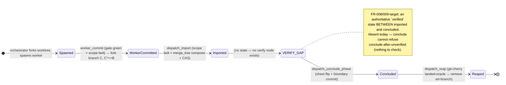
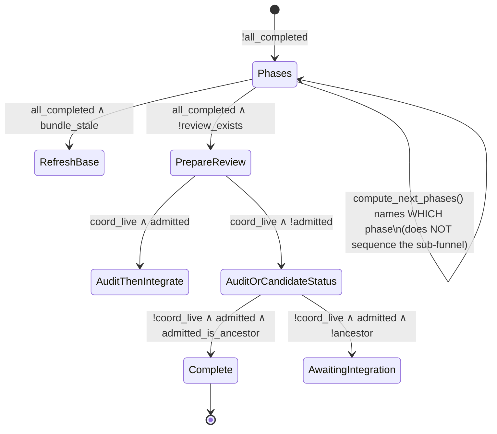

# SL-228 — As-built dispatch funnel state machine (pre-design extraction)

> **Status:** design input (option a — committed). Read-only recon; **no code
> changed.** Feeds `/design` the *visible delta* so design works on top of the
> as-built graph rather than re-deriving it. Anchors are `file:line` at the
> `edge` tip this was taken on. Crux findings up front; full extraction below.

## Crux findings (confirm / falsify)

| # | Claim (REV-032 / handover) | Verdict | Evidence |
|---|---|---|---|
| **1** | **No distinct `verified` state today** — sizes move A the most | **CONFIRMED absent** | `ReceiptStatus` (`src/dispatch.rs:3533-3546`) is `NotStarted / InProgress / Blocked / Completed / ConcludeIncomplete / Unknown` — no `Verified`. `NextGuidance` (`:4127-4139`) has no verify node. `dispatch_conclude_phase` (`src/mcp_server/dispatch.rs:362-393`) takes `(code_start, code_end, note?)` and lands the boundary with **no verification evidence required or checked**. |
| **2** | **Position is derived, stored nowhere, enforced nowhere** | **CONFIRMED** | Both position surfaces are **pure derivations over live reads**, never persisted: `derive_receipt_status(sheet, has_boundary)` (`:3590-3616`) and `select_guidance(GuidanceInputs)` (`:4092-4124`). No funnel verb reads a persisted position; each checks only *local* invariants (scope belt / CAS / landed-oracle) — see the invariant table. |
| **3** | **`is_linked_worktree` already exists** (move-E reuse target) | **CONFIRMED** | `pub(crate) fn is_linked_worktree(root) -> Result<bool>` at `src/worktree/shared.rs:54-58` — `--git-dir` vs `--git-common-dir`; already consumed by marker/jail/provision/gc/`memory record`. **Relocate/wrap into the read-verb surface; do not reimplement** (RV-300 F-7 parallel-impl trap). |

## 1. As-built state diagram

The funnel runs at **two independent altitudes** that today never meet in one
graph. This is the single most load-bearing extraction fact for move A.

### Altitude A — per-phase sub-funnel (the funnel move A targets)

Latent only: it lives in the *sequence of tool calls* + the `ReceiptStatus`
derivation. **No node is persisted; no verb is position-gated; there is no
`verified` node.**

Derived-position mapping (what `ReceiptStatus` actually reports for a phase — it
is NOT this sub-funnel; it fuses a *disposable* sheet tier with a *committed*
boundary tier):

| ReceiptStatus | Source | Sub-funnel meaning |
|---|---|---|
| `NotStarted` | sheet `Ok(None)` / `planned` | pre-spawn / no progress row |
| `InProgress` | sheet `in_progress` | worker running |
| `Blocked` | sheet `blocked` | worker halted |
| `ConcludeIncomplete` | sheet `completed` **∧ no** committed boundary | concluded-in-sheet but boundary not landed (the gap the enum exists to surface) |
| `Completed` | sheet `completed` **∧** committed boundary present | boundary landed |
| `Unknown` | sheet read `Err` | fail-loud |

Note: `ReceiptStatus` has **no `Imported` and no `Reaped`** distinction —
import advances the coord tip but leaves no per-phase position mark, and reap is
invisible to it. Position is genuinely *scattered and partial*, not modelled.

### Altitude B — slice-lifecycle guidance (`select_guidance` / `NextGuidance`)

This is the **existing seven-variant machine** (surfaced via `dispatch status`
→ `next:`). It is **one altitude UP** from the per-phase sub-funnel: it decides
*which phase to dispatch* then jumps straight to *slice-level* prepare→audit→
integrate. It does **not** descend into import/verify/conclude/reap.

The decision ladder is pure and precomputed (`select_guidance`,
`src/dispatch.rs:4092-4124`): `!all_completed → bundle_stale → !review_exists →
(coord_live,admitted) → (admitted,ancestor) → fallback`.

**Key structural finding for FR-010.** The per-phase sub-funnel is **not
currently inside `select_guidance` at all** — so FR-010's "carve the sub-funnel
out of the full guidance domain" is more precisely *"author a NEW `dispatch
next` oracle for a sub-funnel that has no guidance node today,"* sitting **below**
`NextGuidance::Phases`. `Phases` stops at "dispatch PHASE-NN"; everything between
"phase dispatched" and "phase completed+boundary landed" is unsequenced. The
seven-state overlap REV-032 warns of is the *slice-lifecycle* tail (PrepareReview
/ Audit / Integrate), which FR-010 explicitly keeps out of the oracle's scope.

## 2. Per-verb invariant table (what each verb checks TODAY)

Every write verb resolves the coord **server-side by slice-id**
(`resolve_coord`, `src/mcp_server/dispatch.rs:128-159`) — no caller path. None
reads a persisted funnel *position*; none refuses "illegal here, run X next."

| Verb | File:line | Invariants checked today | Position-gated? | Refusal tokens |
|---|---|---|---|---|
| `worker_commit` | `src/mcp_server/worker_commit.rs` | non-empty pre-fmt delta → two-tier scope belt (`.doctrine//.claude/` hard reject + selector) → `HEAD==B` (wrong-base) → `check commit` gate (fmt+lint+test+build) → one non-merge commit `C`, `C^==B` | **No** (checks base `HEAD==B`, not funnel position) | `empty-delta`, `scope`, `wrong-base`, `commit-gate-red` |
| `dispatch_import` | `dispatch.rs:235-347` | `resolve_coord` → `classify_import` scope belt (HARD pre-compose) → `merge_tree` compose (coord-tip ⊕ fork) → `commit_on_behalf` CAS onto coord tip | **No** (scope + CAS only) | `unknown-slice`/`ambiguous`/`stale`, `scope`, `merge-conflict`, `empty-delta`, `lost-ref-race` |
| `dispatch_conclude_phase` | `dispatch.rs:362-393` | `resolve_coord` → `set_phase_status` gitignored sheet flip (+ auto-mirror to primary) → `land_boundary_row` (UPSERT-by-phase) via `commit_on_behalf` CAS | **No** — **does not check import ran, does not check verification** | coord tokens, `empty-delta`, `lost-ref-race` |
| `dispatch_reap` | `dispatch.rs:432-443` | `resolve_coord` → `run_gc` **patch-id landed-oracle** (`git cherry`) refuses reaping an unlanded fork | **Partial** — the *only* cross-verb ordering check, and it is patch-identity (landed?), **not position** | coord tokens, `not-landed` (from `run_gc`) |
| `dispatch_next_ready` (read) | `dispatch.rs:578-590` | `resolve_coord` → `compute_next_phases(plan_next_rows)` verbatim | reports Altitude-B readiness only | coord tokens |
| `dispatch_phase_receipt` (read) | `dispatch.rs:527-552` | `resolve_coord` → `phase_receipt_status(sheet, has_boundary)` | reports derived `ReceiptStatus` | coord tokens |
| `dispatch_authored_divergence` (read) | `dispatch.rs:612-634` | `resolve_coord` → `trunk_commit` → `diff_doctrine_paths` | n/a | coord tokens |

**Ordering is enforced by *coupling*, not by a gate.** The only reason
conclude "must" follow import is that conclude's CAS commits onto `coord.tip`,
which import advanced — but conclude does **not refuse** if import never ran (it
would just conclude onto an un-advanced tip). Reap's landed-oracle is the sole
real ordering guard, and it certifies *patch-landed*, not *funnel-position*.
This is exactly the FR-009 gap: **no verb reads position and names the expected
next verb.**

## 3. Guidance domain vs. sub-funnel (FR-010)

- `select_guidance` routes **Altitude B** (slice lifecycle): 7 `NextGuidance`
  variants, all at or above "which phase to dispatch."
- The **per-phase sub-funnel** (import→verify→conclude→reap) has **no node in
  `select_guidance`** — it is latent in tool-call order + `ReceiptStatus`.
- ⇒ FR-010 `dispatch next` is a **new oracle one altitude below `Phases`**, not
  a carve-out of existing branches. Candidate/close/audit sourcing (Altitude B's
  tail — `AuditThenIntegrate` etc.) stays **out of scope** (REV-032, RV-300 F-6).

## 4. SL-199 machine shape (FR-011)

**There is no state-machine object today.** SL-199 landed a **transactional
commit primitive**, not a machine:

- `resolve_coord` (`dispatch.rs`-mcp:128-159) = pure `classify_coord` + one
  gather round-trip → `CoordTarget { root, tip }`. The `tip` is the CAS
  `expected_old` a subsequent write guards against.
- `commit_on_behalf` (`src/dispatch.rs:4322-4352`) = object-db-only `commit-tree`
  onto an **explicit** `target_ref` + `update_ref_cas` against `expected_old`.
  Typed refusals `empty-delta` / `lost-ref-race`; ref/index/worktree
  byte-unchanged on any fault. Transport-agnostic — routed only by `(root, slice)`.

The transition *semantics* are **not centralized**. Each transport composes the
same three shared primitives — the **scope belt** (`classify_import`, shared with
`worker_commit`), the **CAS commit** (`commit_on_behalf`), the **landed-oracle**
(`run_gc`/`git cherry`) — in its own call order:

- **claude arm:** worker `worker_commit` → fork branch → orchestrator
  `dispatch_import` → `dispatch_conclude_phase` → `dispatch_reap`.
- **subprocess (codex/pi) arm:** `worktree fork --worker` + CLI
  `record-boundary`/`sync` (not yet forced through the gated funnel).

⇒ FR-011 = **extract the transition semantics into one authority** that each
transport *projects* into (records the same transitions), keeping per-transport
*altitude* (REQ-291/REQ-335) independently verifiable. Confirmed arm-specific
composition of shared primitives today — **not** one machine with three doors.

## 5. Open-id feed (carry into `/design`)

### OQ-2 — run-state record home + CAS/concurrency contract

Candidate homes observed, ranked:

1. **Extend the committed boundaries ledger** —
   `.doctrine/dispatch/<NNN>/boundaries.toml`, `BoundaryRow { phase,
   code_start_oid, code_end_oid, provenance }` (`src/boundary.rs:38-49`).
   Already **per-phase, committed, UPSERT-by-phase, single-writer via
   `land_boundary_row`→`commit_on_behalf` CAS**. Adding a `position` (+ a
   `verified` evidence field) here reuses the exact single-writer + idempotent-
   recovery contract FR-008 demands — **strongest fit**.
2. The CAS **journal** (committed on `dispatch/<slice>`) — ref-projection
   plumbing, wrong grain for per-phase position.
3. The **gitignored runtime sheet** (`set_phase_status`, `phases_dir`) —
   **disqualified** for the authoritative half: disposable, not crash-safe. It
   is exactly the tier `ReceiptStatus` today has to *fuse with* the committed
   boundary to recover truth. Consolidating position onto the committed record
   collapses that split.

**CAS/concurrency already exists** at the primitive layer: `commit_on_behalf`'s
`update_ref_cas(target_ref, new, expected_old)` gives single-writer + lost-ref-
race refusal + idempotent replay. The design pivot is *where the position field
lives*, not *whether a CAS exists*.

### NEW-OQ-A — governing SPEC home (new tech spec vs inline SPEC-021)

The as-built graph spans **two altitudes** (per-phase sub-funnel + slice
lifecycle) and **three verb families** (worker/import/conclude/reap + the read
trio) — arguably evergreen mechanism at its own altitude, favouring a **new
spec**; against, it is tightly bound to SPEC-021's orchestrator process. Weigh
in `/design`.

### NEW-OQ-B — derive-from-code vs. drift-resistance

This extraction diagram is itself a **single-source candidate**: the graph is
derivable from `ReceiptStatus` + `NextGuidance` + the verb invariant set. If move
A **persists** position, the persisted enum becomes the single source and a
governing spec risks drift from it — argues for a derivation/check (e.g. a
`spec validate` leg or a generated diagram) over hand-authored prose. Decide
whether the residual gap needs a check.

## Anchors (for `/design`)

- `src/dispatch.rs:3533-3616` — `ReceiptStatus` enum + `derive_receipt_status`
- `src/dispatch.rs:4078-4170` — `GuidanceInputs` / `select_guidance` / `NextGuidance`
- `src/dispatch.rs:4322-4352` — `commit_on_behalf` (SL-199 CAS primitive)
- `src/dispatch.rs:4357+` — `land_boundary_row` (boundary UPSERT writer)
- `src/mcp_server/dispatch.rs:128-159` — `resolve_coord` / `classify_coord`
- `src/mcp_server/dispatch.rs:235-443` — `dispatch_import` / `dispatch_conclude_phase` / `dispatch_reap`
- `src/mcp_server/dispatch.rs:527-634` — the three read tools
- `src/mcp_server/worker_commit.rs` — worker self-commit gate
- `src/worktree/shared.rs:54-58` — `is_linked_worktree` (move-E reuse target)
- `src/boundary.rs:38-49` — `BoundaryRow` (OQ-2 extend candidate)
