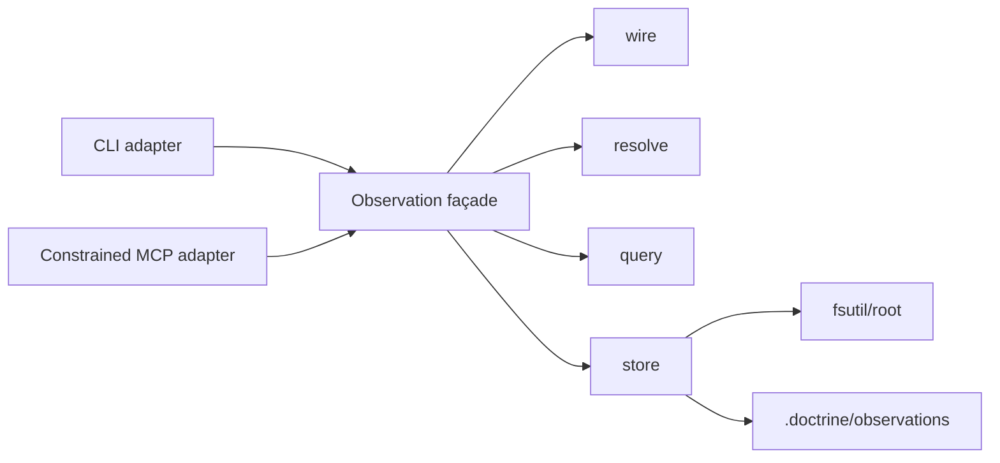

# Design — SL-231 friction observation ledger and capture interface

## 1. Target behaviour and boundary

RFC-011 currently records friction by appending prose to one shared Markdown
file. That makes capture contend on one path, makes individual occurrences
unaddressable, and forces every later reader to re-read and reinterpret an
unbounded document.

SL-231 replaces that live capture mechanism with a reusable observation ledger.
An observation is a raw occurrence signal: cheap to record, immutable,
UUID-addressed, independently stored, and searchable. It is not itself a
backlog item, knowledge record, memory, conclusion, or aggregate pattern.
Downstream analysis may later correlate observations and promote a significant
result into one of those authored homes.

The slice provides collection and inspection only:

- public capture of friction plus a typed schema and closed registered-source
  admission seam for trustworthy machine measurements;
- one-file-per-observation storage;
- resolved and historical reads;
- lexical search and structured filtering;
- append-only correction; and
- CLI capture/read plus a confined MCP capture capability.

Frequency analysis, clustering, prioritisation, backlog-coverage reporting,
impact measurement, automatic promotion, retention, and archival are
follow-ups. The existing RFC-011 case-note corpus remains historical evidence
and is neither migrated nor rewritten.

## 2. Observation contract

### 2.1 Identity, envelope, and storage

Every observation is one self-contained TOML document at:

```text
.doctrine/observations/records/<tail-2>/<uuid>.toml
```

The authoritative path is a pure function of identity alone. `<tail-2>` is the
last two lowercase hexadecimal characters of the canonical UUID, excluding
hyphens; for UUIDv7 those characters are in the random tail. The named shard
function and path constants are defined once. Kind and time remain validated
envelope fields but never participate in identity lookup.

The filename UUID and envelope UUID must agree. The envelope has a fixed schema
discriminator plus exactly four required core fields:

```toml
schema = "doctrine.observation"
schema_version = 1
uid = "019f..."
kind = "friction"
recorded_at = "2026-07-26T10:11:12Z"
```

`uid` is caller-supplied for replay or generated as UUIDv7 by the command
shell. `recorded_at` is supplied by the shell rather than read inside the pure
model. Exact lookup and create-new compute one path directly from `uid`; neither
operation scans the corpus or consults a mutable registry. The record has no
Markdown companion and no numbered alias.

The core stays deliberately small. Kind-specific payloads and optional
metadata are typed, independently versioned structures. Unknown facts are
omitted rather than represented by guessed values or empty sentinels.

Authoritative records are authored collection data by default: committed,
diffable TOML. Capture itself never stages or commits, so a new record remains
visibly untracked until an operator or coordinator commits it. A project may
ignore `.doctrine/observations/records/` repository-wide, or a developer may
exclude it locally, to keep instrumentation out of reviews. That choice makes
the corpus local-only and gives up shared durability, correlation, and audit
history unless another transport replaces Git.

An optional chronological view may later be derived as relative symlinks:

```text
.doctrine/observations/by-month/<year>/<month>/<uuid>.toml
  -> ../../../records/<tail-2>/<uuid>.toml
```

The chronological view is reserved follow-up direction, not an SL-231 output:
this slice installs no `by-month/**` ignore pattern or deriving verb. If it is
later introduced, it is disposable navigation only and capture and queries
must not enumerate or trust it. Reserved publication temporary names are
gitignored and ignored by corpus loading.

### 2.2 Primary kinds

`friction` is the first primary kind. Its payload requires only a non-empty
`summary`; `detail` is optional. Capture never performs a duplicate search or
requires classification before writing.

`measurement` carries a machine-produced measurement that can be correlated
with another observation or run. It is not a human or agent estimate. V1
defines and validates the measurement wire schema, but neither the public CLI
nor MCP capture tool can write it. A measurement is admitted only for a
registered machine source whose source contract has been settled under
QUE-176. The production source registry is empty until such a source exists;
tests use an injected fake source registration. The registry is an admission
check, not a harness extraction API. EVD-002 makes `claude -p` the leading
first adapter candidate, subject to verification of its exact metrics and
completeness.

The ledger reserves typed control kinds for `supersession` and `retraction`.
Controls are observations themselves and therefore preserve the append-only
history. A **primary observation** means a non-control `friction` or
`measurement` record.

### 2.3 Facets

V1 defines five optional typed facets:

- `provenance`: exceptional attribution such as a human author, witness, or
  ratifier; ordinary capture may simply omit it;
- `execution`: `interface`, `product_surface`, `command`,
  `repository_context` (`primary` or `worker`), harness, model, role,
  execution mode or arm, lifecycle stage, and skill where known;
- `work_context`: canonical slice, phase, backlog, change, or other work
  references;
- `correlation`: `agent_id`, session, run, request, parent-observation, or
  related observation identifiers; and
- `usage`: trustworthy machine-measured usage with its source, scope, units,
  completeness, and supported counters.

Each facet declares its own schema version. Field-level origin metadata records
whether a value was explicit or automatically enriched. Explicit values take
precedence over automatic values field by field. Conflicting automatic values
are never silently merged.

The usage facet records only measurements exposed authoritatively by a harness
or API. It does not accept agent-estimated token counts, compute efficiency
scores, normalize workloads, or imply completeness that the source did not
provide. Usage that becomes available after an occurrence is written is
captured as a separate correlated `measurement`; the original observation is
not edited.

### 2.4 Validation and compatibility

Writes are strict. Unsupported kinds, schemas, fields, invalid UUIDs or
timestamps, UUID/path disagreement, invalid explicit facets, and empty required
payload fields fail before publication. The writer applies deterministic UTF-8
byte limits: 1 KiB summary, 32 KiB detail, 512 bytes per facet string, and
64 KiB for the complete serialized record. It rejects NUL and over-limit input
with a field-specific diagnostic and never silently truncates.

Every authored string is untrusted data. TOML and JSON use structured
serializers; terminal views escape control characters and escape sequences;
and any later agent-facing rendering frames observation content as untrusted
data rather than trusted instruction.

Reads are tolerant. A malformed or unsupported record produces a diagnostic
carrying its path and reason while other valid records remain available.
Resolution and query order are deterministic and do not depend on filesystem
enumeration order.

## 3. Capture contract

### 3.1 CLI

The primary cheap path is:

```text
doctrine observation record friction <summary>
```

The record command also accepts:

- optional detail;
- a caller-supplied UUID;
- repeatable typed facet fields;
- a complete friction request from standard input or a file; and
- an option to disable automatic enrichment.

The public record verb accepts `friction` only. Measurement creation is an
internal service operation gated by the registered machine-source admission
set; caller-asserted source metadata cannot open that gate.

The shell resolves the repository root, current time, and default UUID, gathers
only allowlisted context, invokes the shared observation service, and prints a
machine-readable receipt containing at least the UUID, kind, recorded time,
relative path, and whether the operation created or replayed the record.

Automatic enrichment is best-effort and safe by construction:

- the CLI adapter supplies the constants `interface=cli`, its Doctrine CLI
  product surface, and `command=observation record` to the corresponding
  `execution` fields;
- the MCP adapter supplies `interface=mcp`, its Doctrine MCP product surface,
  and `command=observation_record` to the corresponding `execution` fields;
- the established worker marker or server destination-resolution seam may
  supply `execution.repository_context=primary|worker`;
- an opaque agent identifier is written to `correlation.agent_id` only when
  already supplied through the capture context;
- explicit caller values win;
- unavailable or failed automatic enrichment warns and capture proceeds;
- invalid explicit data fails; and
- no general environment inspection, prompt body, arbitrary process metadata,
  incidental-string inference, or repository content is captured.

Harness, model, role, dispatch arm, lifecycle stage, skill, and run/session
correlation are explicit or trusted-adapter fields in V1, otherwise absent.
IDE-005 owns later harness detection from individually named environment
markers.

Recording owns only atomic file creation and its receipt. It does not stage,
commit, push, index, aggregate, triage, or create another entity.

### 3.2 Idempotency and atomicity

The store computes one authoritative destination from UUID. Distinct UUIDs
never contend on one corpus file; the same UUID always contends on the same
path regardless of kind, clock skew, or retry month.

If a caller-supplied UUID already exists:

- the same caller intent—kind, typed payload, and explicit facets—returns a
  replay receipt without rewriting;
- different caller intent fails as an identity collision; and
- no content-based duplicate detection is attempted across different UUIDs.

Automatically generated time and enrichment are fixed by the first successful
write and are not regenerated or included in replay-intent comparison.

SL-231 adds a shared `fsutil` atomic no-clobber publication primitive:

1. extract the entity machinery's component-wise parent creation/check into
   `fsutil`, rejecting a symlink or non-directory squatter;
2. write and close the complete bytes at a unique reserved sibling temporary
   name;
3. call `std::fs::hard_link(temp, destination)` to publish the complete inode
   or receive an already-exists collision; and
4. remove the temporary name after publication or an already-exists
   collision, including replay and identity-collision outcomes.

A crash before the link may leave only an ignored temporary file. A crash
after the link may leave the complete inode under both names. Loading ignores
reserved temporary names, and stale temporary names may be removed without
affecting published records. The guarantee covers partial-authoritative-record
prevention, no-clobber concurrency, and encountered parent squatters on macOS
and Linux; it does not claim protection from a malicious local actor
continuously swapping directory components.

### 3.3 MCP

The Doctrine MCP server exposes:

```text
observation_record({
  uid?,
  summary,
  detail?,
  facets?,
  enrich?
}) -> receipt
```

It calls the same service and applies the same validation, enrichment,
idempotency, and receipt contract as the CLI.

For confined Claude workers the capability is deliberately narrower than the
trusted CLI:

- it creates `friction` only;
- the server resolves the registered primary repository root;
- the caller cannot supply an arbitrary filesystem path; and
- supersession and retraction controls are refused.

The tool therefore bypasses the worktree filesystem wall only for bounded
friction creation. It is not a general write primitive. Subprocess worker
parity remains IMP-319.

### 3.4 Dogfood activation by capability

RFC-011 and project governance must not publish one role-blind CLI
instruction:

- trusted agents in the primary tree use the CLI;
- confined Claude workers use `observation_record`;
- `observation record`, `supersede`, and `retract` are Write-classed by the
  existing worker-mode guard, while `show`, `list`, and `search` are
  Read-classed;
- the guard refuses those write verbs in any marked worker fork, with a
  diagnostic directing a confined worker to `observation_record` and other
  workers to report the signal for primary-tree capture;
- a solo agent in a marked worktree likewise does not write an observation
  there: it carries the signal in its runtime phase sheet or handoff and
  records it after returning to the coordination tree; and
- until IMP-319 lands, their orchestrator may capture friction they report.

The historical case-note file remains untouched. This activation preserves the
dispatch forbidden-zone invariant rather than making observation capture a
reason for import or `worker_commit` refusal.

## 4. Read and correction contract

The trusted CLI supplies:

```text
doctrine observation show <uuid>
doctrine observation list [filters]
doctrine observation search <text> [filters]
doctrine observation supersede <old-uuid> <replacement-uuid> [reason]
doctrine observation retract <uuid> [reason]
```

`show` addresses an exact UUID and can render either the raw record or its
resolved state. Resolved lookup follows effective supersession edges
transitively to the first record without an effective successor. If that
terminus is retracted, it remains the resolved terminus and is rendered with
its retracted state and correction chain; lookup never substitutes an earlier
active record. `list` and `search` default to the resolved active projection;
an explicit history mode includes inactive records and controls. Filters cover
kind, time range, and typed facet fields.

Observations follow the uniform `<kind> <verb>` grammar and reuse shared
table/JSON rendering conventions, but they are not entity kinds. Their list
surface does not flatten SPEC-013's `CommonListArgs` or join its entity
list-conformance matrix. Bare UUID is their explicit canonical-ID exception,
and observation-specific black-box parse and rendering goldens pin the public
surface.

Search reuses the shared lexical tokenizer and case-folding rules. Every query
token must occur somewhere in the combined summary, detail, and string facet
values. Matching is Boolean, deterministic, and unranked. Results order by
`recorded_at` descending and then UUID. Pagination uses an opaque keyset cursor
over that ordered pair and resumes strictly after the last returned key; head
inserts do not duplicate or shift traversed rows. The contract does not promise
a frozen corpus snapshot.

Supersession requires an existing primary, kind-compatible replacement and
creates one supersession control linking the old and replacement UUIDs.
Retraction creates one retraction control targeting an exact primary UUID.
Controls cannot target controls. Each command performs one atomic create-new
write and never edits or deletes an existing record.

Resolution validates and applies each control independently in canonical
`(recorded_at, uid)` order:

- malformed, dangling, kind-incompatible, cycle-introducing, and losing
  conflicting controls are individually diagnostic and inert;
- repeated retractions and repeated supersessions to the same replacement are
  idempotent;
- retraction dominates supersession for the same target;
- among distinct successors, the earliest valid supersession is effective and
  later alternatives are diagnostic; and
- a cycle-introducing edge is inert without cancelling earlier valid edges.

Appending invalid material therefore cannot resurrect an observation or cancel
a valid correction. History always exposes controls and diagnostics.
Corrections are intentionally irreversible through the V1 product surface:
exact lookup and history remain complete, but a mistaken correction cannot be
cancelled by another control. Manual removal of the mistaken control is the
only active-view recovery and is an exceptional operational repair outside
this slice. Hard redaction, if ever required, is likewise a manual operational
exercise.

Processing state—analysed, triaged, aggregated, or consumed—does not live on an
observation. Each future consumer owns its own cursor or materialized state so
that one workflow cannot overwrite another workflow's interpretation.

## 5. Architecture

SL-231 introduces a dedicated engine rather than extending the authored-entity
engine. The lifecycles are materially different, but the implementation reuses
the shared repository-root and safe-filesystem primitives.



| Module | ADR-001 tier | Purity / responsibility |
|---|---|---|
| `observation::wire` | leaf | Pure typed envelopes, payloads, facets, origins, controls, schema dispatch, strict validation, canonical serialization |
| `observation::resolve` | leaf | Pure active/history projection and deterministic per-control diagnostics |
| `observation::query` | leaf | Pure filtering, shared lexical matching, total ordering, and keyset cursors |
| `observation::store` | leaf | Imperative filesystem seam: UUID-shard loading, atomic no-clobber publication, replay and collision checks |
| `observation` façade | leaf | Shared service over injected root, identity, time, enrichment, and registered measurement-source admission inputs |
| `commands::observation` | command | CLI argument adaptation and rendering |
| MCP tool adapter | command | Structured request adaptation, capability narrowing, and receipt rendering |

No clock, RNG, Git, disk, environment lookup, terminal rendering, or MCP type
enters the pure wire, resolution, or query logic. The store is the only
observation disk seam. CLI and MCP adapters contain no duplicate storage or
resolution implementation.

The authoritative ADR-001 classification is `observation = "leaf"` with no
sub-classification: the umbrella imports only existing leaves such as
`fsutil`, `root`, and `lexical`. `commands` and the MCP command surface remain
command tier. The architecture gate must add that exact classification and
refuse any new upward edge or tangle growth.

## 6. Verification

### Wire and validation

- Round-trip every core record, primary payload, control, and facet.
- Reject invalid explicit fields without creating a file.
- Prove omission means unknown and field origins survive round-trip.
- Enforce the summary, detail, facet-string, whole-record, and NUL limits
  without truncation.
- Exercise hostile strings through structured TOML/JSON, escaped terminal
  rendering, and explicitly untrusted agent-facing framing.
- Verify supported-version dispatch and tolerant diagnostics for unsupported
  or malformed records.
- Prove public CLI/MCP capture refuses measurements while a fake registered
  source can exercise the internal measurement service contract.

### Store and concurrency

- Concurrent distinct UUIDs both survive.
- The same UUID under a different requested kind or after a month boundary
  resolves to the same authoritative path and cannot be duplicated.
- Replay with identical caller intent returns the existing receipt and retains
  the first write's time and enrichment.
- Different caller intent at the same UUID fails without overwrite.
- UUID/shard/path disagreement fails validation.
- Symlink and non-directory parent squatters are refused.
- Pin the publication seam: it accepts only a closed complete sibling
  temporary file, creates the destination only through a no-clobber hard link,
  never opens the destination for write, removes the temporary name after
  publication or collision, and leaves only an ignored temporary name if
  interrupted before publication.

### Resolution and query

- Supersession selects the replacement while history retains both records and
  the control.
- Supersession refuses a missing, control-kind, or kind-incompatible
  replacement without creating a control.
- Retraction removes the target from active views while history retains it.
- A later dangling, cyclic, conflicting, or malformed control is individually
  inert and cannot cancel an earlier valid correction.
- Repeated retraction and same-replacement supersession are idempotent.
- Retraction dominates supersession; distinct successors and cycle edges obey
  canonical control ordering without component-wide rollback.
- Resolved lookup follows supersession chains transitively and reports a
  retracted terminus as retracted.
- Corrections cannot be cancelled through the product surface; exact and
  history views retain the complete correction chain.
- Exact UUID lookup works regardless of active state.
- Default queries use the resolved projection; history mode exposes controls
  and inactive records.
- Search reuses shared tokenization over the enumerated fields.
- A keyset continuation neither duplicates nor shifts prior rows when a new
  observation is inserted at the head.

### Interface and confinement

- Equivalent CLI and MCP create requests produce equivalent records and
  receipts.
- Explicit facet values override automatic values field by field.
- The named v1 enrichment source-to-field allowlist is exhaustive; unknown
  environment and process values are not inspected.
- Automatic-enrichment failure warns and continues; invalid explicit input
  fails.
- MCP resolves only the registered primary root, rejects arbitrary paths, and
  refuses control kinds.
- Agent-conformance checks admit the named observation capability for confined
  workers without admitting unrelated MCP tools.
- Dogfood guidance routes primary-tree agents to CLI, confined Claude workers
  to MCP, and workers without a broker away from fork-local CLI capture.
- Worker-mode guard tests classify observation writes as Write and observation
  reads as Read, and pin the refusal diagnostic for dispatched and solo marked
  forks.

### Regression gates

- `tests/architecture_layering.rs` classifies `observation` as `leaf` without
  adding a forbidden upward edge or tangle.
- Existing entity, memory, comparison-ledger, dispatch, and MCP tests remain
  green unchanged.
- CLI and MCP end-to-end tests prove the public contracts against a temporary
  repository.

## 7. Code impact

| Path | Intended change |
|---|---|
| `src/observation/**` | New wire, resolution, query, store, and façade implementation |
| `src/fsutil.rs` | Add shared component-wise safe parent creation and atomic no-clobber complete-content publication |
| `src/entity.rs` | Replace the private parent-walk implementation with the shared `fsutil` primitive without changing entity behaviour |
| `src/commands/observation.rs` | CLI adapter and rendering |
| `src/commands/cli.rs` | Register the `observation` command family |
| `src/commands/guard.rs` | Classify observation capture and corrections as worker-refused writes and observation reads as reads |
| `src/commands/mod.rs` | Export the command adapter |
| `src/main.rs` | Register the observation engine and CLI parsing coverage |
| `src/mcp_server/tools.rs` | Register and dispatch `observation_record` through the shared service |
| `src/doctor_checks.rs` | Extend confined-worker capability conformance |
| `src/commands/doctor.rs` | Update conformance fixtures and diagnostics |
| `install/agents/claude/dispatch-worker.md` | Grant the bounded capture tool to confined Claude workers, and tell the worker the capability exists |
| `src/install.rs` | Project the reserved-temporary ignore rule into a client and prove records stay authored |
| `src/worktree/allowlist.rs` | Classify the reserved publication temporary as a withheld fork tier, records excluded |
| `tests/e2e_observation.rs` | CLI/store/resolution/query end-to-end coverage |
| `tests/e2e_mcp_server.rs` | MCP parity, root confinement, and control refusal |
| `tests/architecture_layering.rs` | Gate the new leaf classification and dependency direction |
| `.doctrine/adr/001/layering.toml` | Classify the `observation` umbrella as `leaf` |
| `.gitignore` | Ignore reserved publication temporary names in this repository |
| `install/manifest.toml` | Install the reserved-temporary observation ignore pattern into client repositories |
| `install/using-doctrine.md` | Document authored-by-default observations, PR-review noise, and repository/local ignore tradeoffs |
| `.doctrine/governance.md` | Replace the live shared-file append instruction after verification |
| `.doctrine/rfc/011/rfc-011.md` | Point live instrumentation at the observation interface while retaining the historical corpus |

`src/lexical.rs` and shared rendering helpers are reused unchanged and are not
design targets. SPEC-013's entity list-conformance tests remain unchanged. No
existing case-note archive is a design target, and no new embedded-asset root is
introduced.

## 8. Decisions, constraints, and follow-ups

DEC-043 and the answered QUE-174 place observations in the dedicated PRD-018 /
SPEC-028 capability rather than memory, comparison, or a premature generic
ledger abstraction. DEC-044 through DEC-052 record the external-review design
corrections: UUID-only paths, per-control resolution, capability-aware dogfood,
shared atomic publication, closed measurement writers, named enrichment,
content bounds, UUID-native reads, and authored-storage disposition.

DEC-048 deliberately establishes the measurement wire and closed admission
boundary before the first producer. That keeps measurement unavailable to
generic callers and lets stored measurements round-trip without freezing a
harness-specific adapter API. QUE-176 and the first instrumentation slice own
the concrete adapter interface and may revise the versioned measurement
payload if real source evidence requires it; SL-231 adds no general adapter
registry abstraction beyond the closed source-registration check at the
service boundary.

POL-002 requires Doctrine to own the contract rather than relying on harness
conventions; STD-001 requires paths, shard rules, source vocabularies, limits,
and temporary patterns to be named once; ADR-001 governs the exact leaf
classification; ADR-008 governs worker confinement. SPEC-007 and SPEC-024 are
precedents, not lifecycle homes for the new primitive. SPEC-013 supplies
command/rendering conventions but its entity-list spine does not govern this
non-entity ledger.

IMP-319 owns subprocess-worker broker parity. IMP-320 owns default-off
configuration and boot guidance for asking agents to record friction. IDE-005
owns reliable harness detection from named environment markers. QUE-176 owns
per-harness usage-source verification, with `claude -p` the first candidate.
Reporting and aggregation remain a later slice.
