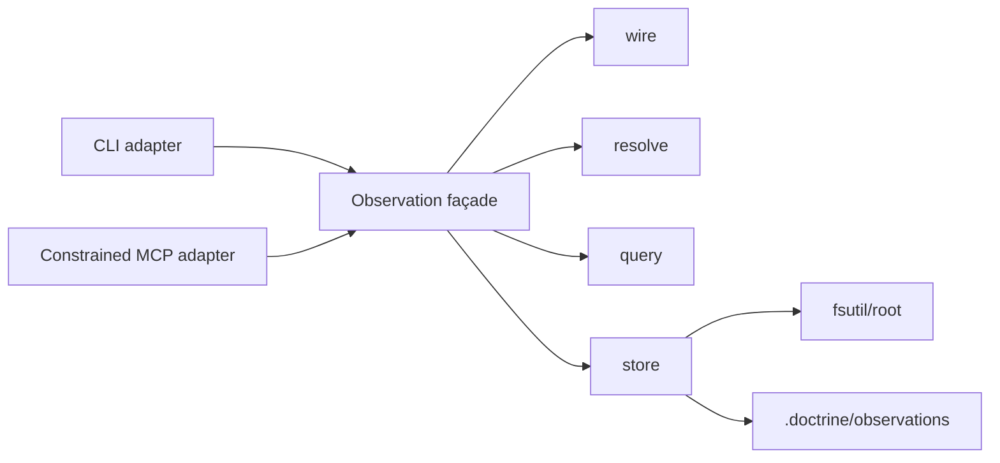

# Design — SL-231 friction observation ledger and capture interface

## 1. Target behaviour and boundary

RFC-011 currently records friction by appending prose to one shared Markdown
file. That makes capture contend on one path, makes individual occurrences
unaddressable, and forces every later reader to re-read and reinterpret an
unbounded document.

SL-231 replaces that live capture mechanism with a reusable observation ledger.
An observation is a raw occurrence signal: cheap to record, immutable,
UUID-addressed, independently stored, and searchable. It is not itself a
backlog item, knowledge record, memory, conclusion, or aggregate pattern.
Downstream analysis may later correlate observations and promote a significant
result into one of those authored homes.

The slice provides collection and inspection only:

- typed capture of friction and trustworthy machine measurements;
- one-file-per-observation storage;
- resolved and historical reads;
- lexical search and structured filtering;
- append-only correction; and
- CLI capture/read plus a confined MCP capture capability.

Frequency analysis, clustering, prioritisation, backlog-coverage reporting,
impact measurement, automatic promotion, retention, and archival are
follow-ups. The existing RFC-011 case-note corpus remains historical evidence
and is neither migrated nor rewritten.

## 2. Observation contract

### 2.1 Identity, envelope, and storage

Every observation is one self-contained TOML document at:

```text
.doctrine/observations/<kind>/<year>/<month>/<uuid>.toml
```

The filename UUID and envelope UUID must agree. The envelope has exactly four
required core fields:

```toml
schema = "doctrine.observation"
schema_version = 1
uid = "019f..."
kind = "friction"
recorded_at = "2026-07-26T10:11:12Z"
```

`uid` is caller-supplied for replay or generated as UUIDv7 by the command
shell. `recorded_at` is supplied by the shell rather than read inside the pure
model. The UTC year and month derived from `recorded_at` select the partition.
The record has no Markdown companion and no numbered alias.

The core stays deliberately small. Kind-specific payloads and optional
metadata are typed, independently versioned structures. Unknown facts are
omitted rather than represented by guessed values or empty sentinels.

### 2.2 Primary kinds

`friction` is the first primary kind. Its payload requires only a non-empty
`summary`; `detail` is optional. Capture never performs a duplicate search or
requires classification before writing.

`measurement` carries a machine-produced measurement that can be correlated
with another observation or run. It is not a human or agent estimate.

The ledger reserves typed control kinds for `supersession` and `retraction`.
Controls are observations themselves and therefore preserve the append-only
history.

### 2.3 Facets

V1 defines five optional typed facets:

- `provenance`: exceptional attribution such as a human author, witness, or
  ratifier; ordinary capture may simply omit it;
- `execution`: harness, model, role, execution mode or arm, lifecycle stage,
  skill, command, and product surface where known;
- `work_context`: canonical slice, phase, backlog, change, or other work
  references;
- `correlation`: session, run, request, parent-observation, or related
  observation identifiers; and
- `usage`: trustworthy machine-measured usage with its source, boundary,
  completeness, and supported counters.

Each facet declares its own schema version. Field-level origin metadata records
whether a value was explicit or automatically enriched. Explicit values take
precedence over automatic values. A caller may replace an automatically
assembled facet with an explicit facet, but the implementation does not merge
two conflicting values silently.

The usage facet records only measurements exposed authoritatively by a harness
or API. It does not accept agent-estimated token counts, compute efficiency
scores, normalize workloads, or imply completeness that the source did not
provide. Usage that becomes available after an occurrence is written is
captured as a separate correlated `measurement`; the original observation is
not edited.

### 2.4 Validation and compatibility

Writes are strict. Unsupported kinds, schemas, fields, invalid UUIDs or
timestamps, inconsistent paths, invalid explicit facets, and empty required
payload fields fail before any file is created. Every authored string is
treated as hostile input at parsing, rendering, terminal, and MCP boundaries.

Reads are tolerant. A malformed or unsupported record produces a diagnostic
carrying its path and reason while other valid records remain available.
Resolution and query order are deterministic and do not depend on filesystem
enumeration order.

## 3. Capture contract

### 3.1 CLI

The primary cheap path is:

```text
doctrine observation record friction <summary>
```

The record command also accepts:

- optional detail;
- a caller-supplied UUID;
- repeatable typed facet fields;
- a complete structured request from standard input or a file; and
- an option to disable automatic enrichment.

The exact flag spelling is settled in the technical specification or plan from
the CLI's established conventions; the semantic contract is fixed here.

The shell resolves the repository root, current time, and default UUID, gathers
only allowlisted context, invokes the shared observation service, and prints a
machine-readable receipt containing at least the UUID, kind, recorded time,
relative path, and whether the operation created or replayed the record.

Automatic enrichment is best-effort and safe by construction:

- only explicitly allowlisted, bounded, non-secret values are considered;
- explicit caller values win;
- unavailable or failed automatic enrichment warns and capture proceeds;
- invalid explicit data fails; and
- no environment dump, prompt body, arbitrary process metadata, or repository
  content is captured.

Recording owns only atomic file creation and its receipt. It does not stage,
commit, push, index, aggregate, triage, or create another entity.

### 3.2 Idempotency and atomicity

The store creates a new file atomically. Distinct UUIDs never contend on one
corpus file.

If a caller-supplied UUID already exists:

- byte-equivalent canonical content returns a replay receipt without rewriting;
- different content fails as a collision; and
- no content-based duplicate detection is attempted across different UUIDs.

Parent partition creation must reject symlink or non-directory path squatters.
A failed or interrupted write must not expose a partial observation.

### 3.3 MCP

The Doctrine MCP server exposes:

```text
observation_record({
  uid?,
  kind,
  payload,
  facets?,
  enrich?
}) -> receipt
```

It calls the same service and applies the same validation, enrichment,
idempotency, and receipt contract as the CLI.

For confined Claude workers the capability is deliberately narrower than the
trusted CLI:

- `kind` may be `friction` or `measurement`;
- the server resolves the registered primary repository root;
- the caller cannot supply an arbitrary filesystem path; and
- supersession and retraction controls are refused.

The tool therefore bypasses the worktree filesystem wall only for creation of
bounded primary observations. It is not a general write primitive. Subprocess
worker parity remains IMP-319.

## 4. Read and correction contract

The trusted CLI supplies:

```text
doctrine observation show <uuid>
doctrine observation list [filters]
doctrine observation search <text> [filters]
doctrine observation supersede <uuid> <replacement-request>
doctrine observation retract <uuid> [reason]
```

`show` addresses an exact UUID and can render either the raw record or its
resolved state. `list` and `search` default to the resolved active projection;
an explicit history mode includes inactive records and controls. Filters cover
kind, time range, and typed facet fields. Search is lexical over defined text
fields and makes no clustering or ranking claim. Results use a stable total
order and stable pagination.

Supersession creates a new replacement observation and one supersession control
linking old and new UUIDs. Retraction creates one retraction control targeting
an exact UUID. Neither operation edits or deletes an existing record.
Dangling targets, cycles, multiple terminal controls, malformed controls, and
unsupported schemas remain inspectable and produce deterministic diagnostics.
Hard redaction, if ever required, is a manual operational exercise outside this
slice.

Processing state—analysed, triaged, aggregated, or consumed—does not live on an
observation. Each future consumer owns its own cursor or materialized state so
that one workflow cannot overwrite another workflow's interpretation.

## 5. Architecture

SL-231 introduces a dedicated engine rather than extending the authored-entity
engine. The lifecycles are materially different, but the implementation reuses
the shared repository-root and safe-filesystem primitives.



| Module | Layer | Responsibility |
|---|---|---|
| `observation::wire` | leaf within the observation umbrella | Typed envelopes, payloads, facets, origins, controls, schema dispatch, strict validation, canonical serialization |
| `observation::resolve` | pure engine | Active/history projection and deterministic correction diagnostics |
| `observation::query` | pure engine | Filtering, lexical matching, total ordering, and pagination |
| `observation::store` | imperative engine seam | Partition discovery, tolerant loading, atomic create-new, UUID replay and collision checks |
| `observation` façade | engine | Shared create/read service over injected root, identity, time, and enrichment inputs |
| `commands::observation` | command | CLI argument adaptation and rendering |
| MCP tool adapter | command/interface | Structured request adaptation, capability narrowing, and receipt rendering |

No clock, RNG, Git, disk, environment lookup, terminal rendering, or MCP type
enters the pure wire, resolution, or query logic. The store is the only
observation disk seam. CLI and MCP adapters contain no duplicate storage or
resolution implementation.

## 6. Verification

### Wire and validation

- Round-trip every core record, primary payload, control, and facet.
- Reject invalid explicit fields without creating a file.
- Prove omission means unknown and field origins survive round-trip.
- Exercise hostile strings through TOML, terminal, and JSON/MCP rendering.
- Verify supported-version dispatch and tolerant diagnostics for unsupported
  or malformed records.

### Store and concurrency

- Concurrent distinct UUIDs both survive.
- Identical caller-UUID replay returns the existing receipt.
- Different content at the same UUID fails without overwrite.
- Kind, date, UUID, and path disagreement fails containment validation.
- Symlink and non-directory partition squatters are refused.
- Failure cannot leave a visible partial record.

### Resolution and query

- Supersession selects the replacement while history retains both records and
  the control.
- Retraction removes the target from active views while history retains it.
- Dangling, cyclic, conflicting, and malformed controls yield deterministic
  diagnostics.
- Exact UUID lookup works regardless of active state.
- Default queries use the resolved projection; history mode exposes controls
  and inactive records.
- Filters, lexical search, ordering, and pagination are stable.

### Interface and confinement

- Equivalent CLI and MCP create requests produce equivalent records and
  receipts.
- Explicit facet values override enrichment.
- Automatic-enrichment failure warns and continues; invalid explicit input
  fails.
- MCP resolves only the registered primary root, rejects arbitrary paths, and
  refuses control kinds.
- Agent-conformance checks admit the named observation capability for confined
  workers without admitting unrelated MCP tools.

### Regression gates

- `tests/architecture_layering.rs` classifies the new umbrella without adding a
  forbidden upward edge or cycle.
- Existing entity, memory, comparison-ledger, dispatch, and MCP tests remain
  green unchanged.
- CLI and MCP end-to-end tests prove the public contracts against a temporary
  repository.

## 7. Code impact

| Path | Intended change |
|---|---|
| `src/observation/**` | New wire, resolution, query, store, and façade implementation |
| `src/commands/observation.rs` | CLI adapter and rendering |
| `src/commands/cli.rs` | Register the `observation` command family |
| `src/commands/mod.rs` | Export the command adapter |
| `src/main.rs` | Register the observation engine and CLI parsing coverage |
| `src/mcp_server/tools.rs` | Register and dispatch `observation_record` through the shared service |
| `src/doctor_checks.rs` | Extend confined-worker capability conformance |
| `src/commands/doctor.rs` | Update conformance fixtures and diagnostics |
| `install/agents/claude/dispatch-worker.md` | Grant the bounded capture tool to confined Claude workers |
| `tests/e2e_observation.rs` | CLI/store/resolution/query end-to-end coverage |
| `tests/e2e_mcp_server.rs` | MCP parity, root confinement, and control refusal |
| `tests/architecture_layering.rs` | Classify and gate the new module |
| `.doctrine/governance.md` | Replace the live shared-file append instruction after verification |
| `.doctrine/rfc/011/rfc-011.md` | Point live instrumentation at the observation interface while retaining the historical corpus |

No existing case-note archive is a design target. New embedded-asset roots are
not introduced.

## 8. Decisions, constraints, and follow-ups

The accepted decision series DEC-012 through DEC-041 records the interactive
design choices underlying this document. POL-002 requires Doctrine to own the
contract rather than relying on harness conventions; STD-001 requires the wire
vocabulary and paths to be named once; ADR-001 governs layering; ADR-008
governs worker confinement. SPEC-007 and SPEC-024 are precedents, not lifecycle
homes for the new primitive.

Before planning, QUE-174 must settle whether this reusable primitive requires a
new evergreen specification or a revision to an existing specification.
IMP-319 owns subprocess-worker broker parity. IMP-320 owns default-off
configuration and boot guidance for asking agents to record friction.
QUE-176 owns investigation of per-harness usage instrumentation. Reporting and
aggregation remain a later slice.
