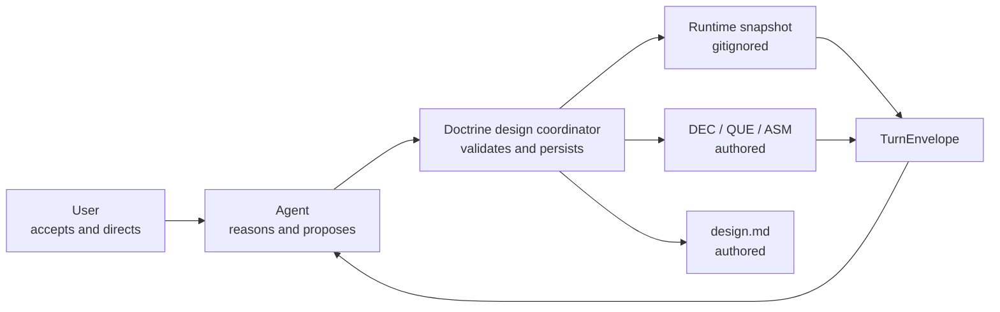

# Design SL-233: CLI-managed design runs and inquiry maps

<!-- Reference forms (.doctrine/glossary.md § reference forms): entity ids padded
     (SL-020, REQ-059, ADR-004); doc-local refs bare — OQ-1 (§6), D1 (§7),
     R1 (§10), Q1. -->

> **Status: provisional reconstruction.** Sections 1–9 preserve the substance
> aligned during the design interview and recovered from its durable knowledge
> graph and compaction summary. QUE-195 remains open. This document has not yet
> received the required integrated adversarial review.

## 1. Design Problem

The `/design` skill currently makes the model interpret and remember a large
workflow definition while doing the design reasoning. It must maintain the
interview structure, select questions, remember gates, create knowledge
records, draft and review sections, and recover after compaction. Those
deterministic obligations compete with the reasoning the model is useful for
and are followed unevenly even by frontier models.

Users consequently cannot inspect whether a long interview follows a coherent
inquiry structure, how far it has progressed, or why its traversal changed.
Continuity also depends too heavily on conversational context.

SL-231 demonstrated the useful counterexample: timely DEC, QUE, and ASM records
preserved accepted semantic state across several compactions before its design
document existed. SL-233 productises that behaviour and adds a lightweight,
inspectable inquiry map without mistaking provisional process state for
authored truth.

The target is a managed run in which Doctrine owns deterministic coordination
and durable protocol mechanics, the agent owns reasoning and proposals, and
the user owns acceptance and direction. V1 is design-specific, with
extraction-friendly internals rather than a generic workflow platform
(DEC-056).

## 2. Current State

The active `plugins/doctrine/skills/design/SKILL.md` contains a monolithic
workflow state machine whose live state is implicit in conversation. It
encourages incremental knowledge capture, but creation remains a separate
ritual and historically has low adoption.

Doctrine already supplies authored slices and knowledge records, gitignored
runtime state, prompt resolution and sealed hymns, session attribution, review
ledgers, and relation validation. It lacks a design-run model, inquiry-map
projection, transition protocol, or prompt-fragment receipts.

RFC-021 supports Doctrine ownership of canonical managed behaviour but does
not make dynamic tool output system-authoritative. Static skill activation
therefore remains part of the v1 authority chain.

## 3. Forces & Constraints

- Authored knowledge and final design prose are committed truth; run state,
  drafts, receipts, and inquiry traversal are disposable runtime state.
- The inquiry map is an inspectable proposal, not evidence that reasoning is
  coherent. Provenance and material restructuring must remain visible.
- Agent map edits may be frictionless, but accepted semantic truth remains
  user-owned.
- The protocol must stay cheaper than the context and adherence costs it
  removes. Normal projections cannot reinject the whole map or skill.
- Runtime enables exact resume; after its loss, authored records allow only
  semantic reconstruction (DEC-057).
- Managed checkpoint creation crosses runtime and authored tiers without
  filesystem ACID. Recovery must be conservative and narrow (DEC-083).
- Coarse prompts and explicit predicates should let process changes land
  without routine Rust changes.
- SL-233 does not solve RFC-021's general authority contract or build a generic
  workflow, spawning, broker, review-posture, or user-override framework.
- Existing slice, knowledge, prompt, and unrelated skill behaviour is a
  compatibility surface.
- Live candidate skill evaluation cannot be faithful until the plugin changes
  have landed and been installed (DEC-079).

## 4. Guiding Principles

1. **Mechanism in Doctrine; judgement in the model.**
2. **Durable domain state displaces unstructured handover prose.**
3. **Stage, inquiry lifecycle, traversal, review, and recovery stay
   orthogonal.**
4. **Sparse declarations minimise protocol friction.**
5. **Forward gates use current evidence; regression records why.**
6. **Recovery and import never invent procedural history.**
7. **Reusable instructions are omitted only by exact content receipt.**

## 5. Proposed Design

### 5.1 System Model



The pure `design_run` core receives the current model, a sparse submission, and
mechanically derived facts. It returns a validated candidate plus effects, or
structured refusals. Disk, git, clock, randomness, entity creation, and prompt
I/O remain in the command shell. There is one active run per slice in v1, with
an explicit run UID for stale-context detection.

### 5.2 Interfaces & Contracts

The public namespace is design-specific (DEC-075):

```text
doctrine design start SL-233
doctrine design show SL-233
doctrine design apply SL-233 --input <json-or-file>
doctrine design inspect SL-233
doctrine design resume SL-233
doctrine design materialise SL-233
```

`start` creates a run; `show` emits its bounded projection; `apply` validates
one sparse idempotent mutation; `inspect` exposes full protocol and map detail;
`resume` emits everything a fresh context needs next; and `materialise` renders
runtime sections into authored prose.

Happy-path recovery needs only `doctrine design resume SL-233`. Optional run UID
and known revision arguments add explicit assumption checking or change-only
projection; they are not required addressing.

All reads derive from one structured `TurnEnvelope`, projected as prompt, JSON,
or human status (DEC-064). It carries run identity/revision, stage, next closed
obligation, active path and nearby frontier, blockers and material map delta,
relevant durable records, section/review state, derived slice facts, fragment
metadata, and the next mutation contract. The dynamic envelope is always
emitted.

`apply` accepts a sparse object or array of declarations. Omitted state
persists; `null` clears a nullable scalar; `[]` clears a collection; and a
stable-ID object partially updates its subject. One batch is unordered,
duplicate subjects are refused, and the complete candidate is validated before
mutation. V1 has lifecycle transitions rather than deletion (DEC-063).

Every submission asserts `run_uid`, `known_revision`, and an idempotent
`submission_id`.

### 5.3 Data, State & Ownership

The canonical snapshot is
`.doctrine/state/slice/<NNN>/design.toml`. It is schema-versioned and contains a
monotonic revision used for compare-and-swap (DEC-059). It groups, rather than
flattens:

- run header, stage, next obligation, and submission receipts;
- inquiry map, cursor, and traversal posture;
- gate evidence;
- fingerprinted draft sections;
- content-bound review attestations and runtime findings;
- prompt-fragment receipts;
- recoverable checkpoint intent.

Writes use atomic sibling replacement. Unknown schema versions and stale
revisions are refused. Exact procedural resume depends on this file; after its
loss Doctrine reconstructs only what authored slice prose and linked knowledge
can support (DEC-057).

Each inquiry node has a stable run-local `inq-*` ID, concise question, optional
primary parent, provenance, lifecycle `open | resolved | deferred | pruned`,
and sparse `needs` references. `blocked` is derived. Cursor and traversal
posture are separate (DEC-060, DEC-061).

The primary-parent tree provides a readable decomposition while `needs`
captures the minimum non-tree dependency. Map edits do not require approval.
Resolving a node requires a semantic disposition: create or adopt a record,
retain an explicitly unresolved outcome, or mark the exchange intentionally
non-durable. Accepted truth remains user-owned (DEC-062).

Normal output contains the active path, nearby frontier, blockers, counts, and
material changes. Full inspection is explicit. Adaptive traversal establishes
major branches breadth-first, pursues a consequential or blocking branch
depth-first, then reassesses; the user may pin a node or select breadth/depth
posture at any time.

### 5.4 Lifecycle, Operations & Dynamics

The coarse stages are:

`exploring | inquiring | drafting | reviewing | locked`

They are landmarks, not an exhaustive FSM. Inquiry lifecycle, cursor/posture,
review state, delegation, and recovery are separate state models (DEC-065).

Forward boundaries have explicit predicates:

- exploring → inquiring: governing context and initial concerns recorded;
- inquiring → drafting: blocking inquiries dispositioned and the user accepts
  sufficiency;
- drafting → reviewing: required sections exist and materialisation is current;
- reviewing → locked: current section attestations and integrated review exist,
  blocking findings are disposed, and the user explicitly accepts.

Evidence is bound to its subject fingerprint. Material change invalidates only
affected clearance (DEC-066). A direct regression records a reason. Returning
forward does not require ceremonial replay of every command, but every
applicable cumulative gate must again hold against current content (DEC-067).

Draft sections are runtime records with stable ID, order, title, body, and
fingerprint. `materialise` records its output fingerprint and refuses to
overwrite foreign edits (DEC-072).

Human and adversarial section review are first-class content-bound
attestations. Findings remain runtime data unless promoted to knowledge or the
final authored review ledger. V1 defaults to human section review with
adversarial review opt-in; integrated adversarial review remains mandatory.
Configurable reviewer/posture commands are deferred to IDE-045 (DEC-073,
DEC-074).

Handover short-circuits when structured state is current: it verifies
persistence and returns the slice/run reference plus only residual unstructured
state. Delegation exports one bounded obligation and accepts an attributed
proposal, but only the coordinator mutates state; stale proposals are refused,
not rebased. V1 defines no spawn transport or broker (DEC-058, DEC-068).

### 5.5 Invariants, Assumptions & Edge Cases

Checkpoint disposition has mutually exclusive `create` and `adopt` forms:

```json
{"checkpoint": {
  "id": "cp-017",
  "disposes": "inq-012",
  "create": {
    "kind": "decision",
    "title": "Design apply owns recoverable checkpoints",
    "body": "...",
    "status": "accepted"
  }
}}
```

```json
{"checkpoint": {
  "id": "cp-017",
  "disposes": "inq-012",
  "adopt": {"record": "DEC-083"}
}}
```

`adopt` validates the canonical record, its kind and usable status, applies the
required legal `shapes` edge when absent, and records the same canonical
disposition without creating a duplicate. Reliably discovering an applicable
pre-existing record is a retrieval concern outside v1; substituting a supplied
ID is first-class and cheap.

For `create`, the shell journals a narrow recovery intent keyed by submission
ID, validates both candidates, calls the existing knowledge engine, captures
the returned canonical ID, then completes the snapshot. Retrying resumes a
known partial operation. Authored records are never rolled back. An ambiguous
crash after creation but before identity capture blocks for explicit
reconciliation rather than risking duplication (DEC-083).

The active skill becomes a thin activation/recovery adapter. A sealed invariant
hymn lives at `install/hymns/stage/design.md`; the closed prompt pack contains
`inquiry.md`, `drafting.md`, `reviewing.md`, and `delegation.md` beneath
`install/design-prompts/`. Doctrine selects at most one coarse process fragment
from the next obligation. Rendered guidance is invariant hymn + process
fragment + TurnEnvelope. V1 has one orchestrator role/model family and no
variant matrix (DEC-077).

Every reusable fragment prints `name@digest` and carries the same JSON
metadata. A known receipt omits a fragment only when its digest is current; a
stale receipt re-emits it. The TurnEnvelope is never omitted (DEC-078). The
prompt pack is a closed design-specific content store, not a second general
selector algebra.

Expected implementation homes are:

- `src/design_run/` for the pure model, submissions, gates, projections,
  prompt selection, and serialization contract;
- `src/commands/design.rs` for persistence, entity effects, recovery, and CLI
  rendering;
- `src/main.rs` for command wiring;
- `plugins/doctrine/skills/design/SKILL.md` and
  `plugins/doctrine/skills/handover/SKILL.md`;
- `install/hymns/stage/design.md` and `install/design-prompts/*.md`;
- new/amended product and technical specs, including the applicable SPEC-023
  and skill-contract boundaries;
- focused unit/integration tests and architecture-layer indexing.

The pure layer receives derived facts and generated IDs as inputs. Every new
embedded asset root must also be included in the Nix `srcWithDist` source
graft.

## 6. Open Questions & Unknowns

- **OQ-1 — discovery of applicable existing knowledge.** V1 accepts an
  existing canonical DEC/QUE/ASM as a checkpoint disposition. Reliably
  discovering a relevant but not-yet-linked record at the right conversational
  moment remains a retrieval-quality problem. The envelope may surface known
  linked context but does not claim comprehensive discovery.
- **OQ-2 / RSK-229 — managed-instruction authority.** Boot establishes strong
  routing obligations but not RFC-021's general contract for the authority of
  dynamically resolved behaviour. This does not block v1. A concise
  user-owned `.doctrine/governance.md` primer is a cheap measurement arm, not a
  shipped substitute for the missing product/harness contract.

## 7. Decisions, Rationale & Alternatives

- **DEC-056:** design-specific contract with extraction-friendly internals; no
  generic workflow platform.
- **DEC-057:** exact resume while runtime survives; semantic reconstruction
  from authored records after loss.
- **DEC-058:** design-aware handover short-circuits to structured state.
- **DEC-059:** schema-versioned snapshot with monotonic revision and
  compare-and-swap mutation.
- **DEC-060:** inquiry lifecycle, cursor, and traversal remain separate;
  blocking is derived.
- **DEC-061:** primary-parent tree plus only a sparse `needs` edge.
- **DEC-062:** proposal map edits need no approval; resolution requires a
  semantic disposition and accepted truth remains user-owned.
- **DEC-063:** atomic sparse declarations, whole-candidate validation,
  submission idempotency, and no deletion.
- **DEC-064:** one structured TurnEnvelope is the canonical read model.
- **DEC-065:** coarse stages with orthogonal state models, not a hierarchical
  FSM or generic interpreter.
- **DEC-066:** forward boundaries are explicit gates.
- **DEC-067:** direct reasoned regression with cumulative current evidence
  required to move forward again.
- **DEC-068:** delegation is proposal-only; the coordinator is sole writer.
- **DEC-072:** sections are fingerprinted runtime records materialised into
  authored `design.md`.
- **DEC-073:** human and adversarial section review use content-bound
  attestations.
- **DEC-074:** human section review is the v1 default; configurable reviewer
  postures are deferred to IDE-045.
- **DEC-075:** the public command family is `doctrine design …`.
- **DEC-077:** SL-233 delivers the thin skill, one invariant hymn, and a small
  coarse process prompt pack.
- **DEC-078:** reusable fragments identify as `name@digest` and are omitted
  only for an exact current receipt.
- **DEC-079:** SL-233 delivers deterministic evaluation materials; CHR-049 runs
  the live comparison immediately after landing and installation.
- **DEC-083:** `design apply` creates recoverable DEC/QUE/ASM checkpoints rather
  than requiring a separate adherence-sensitive ritual. The same disposition
  contract accepts a supplied existing canonical record to avoid duplication.
- **DEC-084:** existing authored designs enter only through explicit,
  conservative import; plain resume never infers missing procedural history.
- **DEC-085:** import bootstraps direct non-terminal shaping QUEs as durable
  inquiries and conventional Open Questions OQs as unverified prose proposals;
  only an explicit canonical citation merges them.

Rejected alternatives include a fully specified/hierarchical workflow machine,
a general process DSL, a full arbitrary inquiry graph, separate record-creation
choreography, silent stale-proposal rebase, prompt omission by fragment name,
automatic reconstruction of missing procedural evidence, and live skill
evaluation from an uninstalled dispatch worktree.

## 8. Risks & Mitigations

- **R1 — protocol ceremony exceeds its value.** Use sparse declarations,
  bounded projections, exact fragment receipts, and measure interaction cost in
  CHR-049.
- **R2 — false confidence from a tidy inquiry map.** Show provenance,
  unresolved branches, material restructuring, blockers, and traversal
  changes. Well-formed is not complete or correct.
- **R3 — orthogonal state collapses into an accidental HSM.** Keep stage,
  inquiry lifecycle, cursor/posture, review, delegation, and recovery as
  separate types with derived facts.
- **R4 — runtime and authored truth diverge.** Store canonical references,
  bind evidence to fingerprints, refuse foreign materialisation overwrite, and
  label semantic reconstruction honestly.
- **R5 — cross-tier failure duplicates authored knowledge.** Journal before
  authored mutation, key work by submission ID, never roll back records, and
  block an ambiguous recovery window.
- **R6 — agents still omit semantic checkpoints.** Make checkpoint disposition
  a managed gate and a single apply operation; measure timely unprompted
  creation/adoption after actual installation.
- **R7 — dynamically delivered obligations are treated as optional.** Retain
  static skill activation and sealed invariant guidance; route authority
  findings to RSK-229 rather than silently increasing prompt volume.
- **R8 — embedded assets vanish from release builds.** Reuse the existing
  `install/` embed root and verify asset presence in cargo/install and host-side
  Nix builds.
- **R9 — legacy import manufactures history.** If QUE-195 accepts import, make
  it explicit and mark imported sections unreviewed.
- **R10 — abstractions harden before evidence.** Keep public semantics
  design-specific and extract only independently useful pure seams.

## 9. Quality Engineering & Validation

Verification separates mechanism correctness from behavioural adoption so an
authority failure is not misdiagnosed as a state-engine defect.

### 9.1 Pure engine

Table-driven and property-style tests cover:

- legal/illegal stages, direct regression, and cumulative forward gates;
- evidence invalidation by changed fingerprints;
- parent/`needs` cycles, derived blockers, and reverse dependants;
- required dispositions for resolved inquiry nodes;
- section-edit invalidation and reviewer-policy combinations;
- sparse omission, `null`, and empty-collection semantics;
- unordered batches, duplicate-subject refusal, and whole-candidate validation.

These tests operate only on values and injected `DerivedDesignFacts`.

### 9.2 Persistence and protocol

Wire and end-to-end tests prove:

- deterministic TOML round-trip and useful schema-version refusal;
- atomic rewrite and unchanged state after validation failure;
- expected-revision conflict reporting;
- submission retry idempotency and refusal of changed payload under a reused ID;
- safe receipt-history eviction that preserves the latest and
  outstanding-delegation receipts;
- exact resume from runtime and semantic reconstruction with a new run UID;
- optional run assertion and changes-since-revision projection;
- stale delegated proposals remain unapplied and inspectable;
- checkpoint recovery resumes each known journal phase without duplication;
- ambiguous record-creation recovery blocks explicitly;
- adopting an existing record creates no duplicate.

Hostile inputs include malformed IDs, unsafe paths, unknown subjects, dangling
parents/dependencies, cycles, oversized bodies, invalid record references, and
inconsistent slice/run identity.

### 9.3 Projection and token bounds

A generated large-run fixture contains hundreds of inquiry nodes, durable
references, and changes. Named limits bound normal TurnEnvelope frontier,
change-summary, blocker, and declaration-example detail. Full `inspect` may
scale with the run; normal `show` must not.

Prompt tests prove:

- exactly one coarse process fragment is selected;
- emitted fragments identify as `name@digest`;
- an exact known receipt omits the body while a stale digest re-emits it;
- the dynamic TurnEnvelope is never omitted;
- the harness-delivered skill body is not repeated;
- invariant hymn, process fragment, and envelope appear in order.

### 9.4 Assets and compatibility

Tests verify the active plugin skill, handover adapter, invariant hymn, and four
prompt files ship in publication/embed surfaces. Prompt checks, install tests,
and existing skill/plugin tests remain green. The host-side Nix build must
resolve every fragment from the produced binary. Existing slice lifecycle,
knowledge, review, prompt-cascade, installation, and architecture-layer suites
remain unchanged and green as behaviour-preservation evidence.

### 9.5 Evaluation kit delivered by SL-233

Before closure the slice authors:

- a fixed repository/slice fixture;
- a moderator scenario containing decision, question, assumption, correction,
  traversal-redirection, and context-break opportunities;
- a preserved baseline skill identity/content reference;
- a rubric separating process adherence from design quality;
- commands collecting run state, knowledge deltas, prompt receipts, and
  token/tool estimates;
- a blinded adversarial-review protocol where practical;
- limitations covering stochasticity, moderator effects, and sample size.

Deterministic tests prove these evidence surfaces. A live model run is not a
closure gate because an installed agent cannot faithfully consume an unlanded
worktree skill.

### 9.6 Immediate post-close measurement

CHR-049 runs once the changed plugin is genuinely installed. Its primary signal
is timely, unprompted creation, adoption, and linking of appropriate DEC, QUE,
and ASM checkpoints—historically weak despite the current skill's prose.

It also measures map steering, refresh, recovery, repeated-fragment elision,
interaction cost, human usefulness, and resulting design quality. Evidence is
classified separately as adopt, adhere, refresh, recover, and complete. If
activation succeeds but resolved obligations are ignored, the exercise may add
the `.doctrine/governance.md` authority-primer arm from RSK-229.

## 10. Review Notes

- This design was written immediately after context compaction using both the
  durable SL-233 knowledge graph and the original assistant-authored section
  presentations recovered from the Codex JSONL session history.
- QUE-195 and QUE-196 are answered by DEC-084 and DEC-085.
- The pre-existing-record adoption form was added after the user identified
  the duplicate-decision edge case. It extends DEC-083 without making
  comprehensive record discovery part of v1.
- Design-target selectors remain unrecorded while the design is provisional and
  specification artifact IDs/paths are not allocated.
- Next: reconcile scope, run the integrated adversarial review, integrate
  findings, record final selectors, and seek explicit lock approval.
