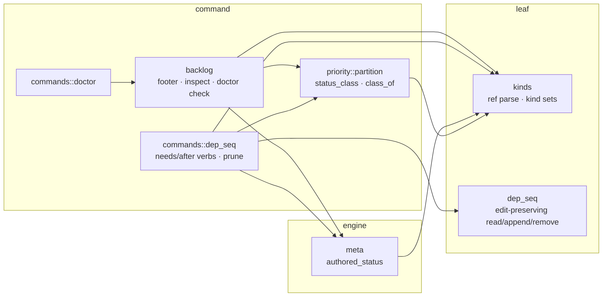
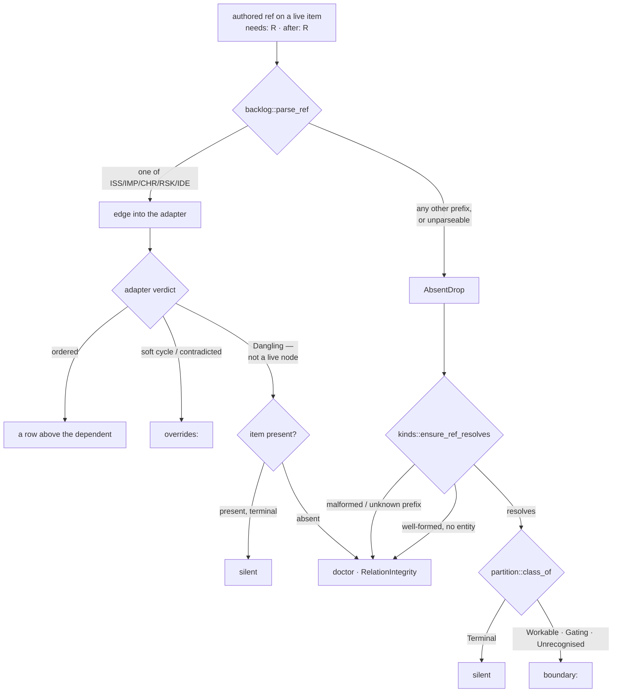

<!-- doctrine:section sec-1 -->
# 1. What changes, and where the boundary sits

## The surface

`doctrine backlog list --by sequence` prints the backlog as a **work order**: every
non-terminal issue, improvement, chore, risk and idea, sorted so that a prerequisite
appears above the item that depends on it. Two authored axes feed that sort —
`needs` (a hard prerequisite) and `after` (a soft manual sequence hint) — and the
sort itself is delegated to the `backlog_order` cordage adapter.

A backlog item may declare either axis on an entity that is **not** a backlog item:
a slice, an open question, a decision. The corpus carries **30 such edges** today
(measured 2026-08-15), 21 of them on the `needs` axis. The ordering machinery cannot
represent them: its node key `ItemId` is a `(backlog kind, number)` pair over exactly
five prefixes, so a `QUE-219` or `SL-251` target has no node to be, no rank to hold,
and no row to appear above.

This design does not change that, and `DEC-231` is the reason: `--by sequence` is a
*backlog-induced work order*, not an actionability gate. `doctrine next` already
says what is startable and correctly excludes the nine live items hanging off the
two open questions `QUE-218` and `QUE-219`; `doctrine blockers ISS-327` already
names `QUE-219` as the reason. Three surfaces answering three questions is the
intended architecture. What is wrong is narrower: on this one surface the edge is
**invisible**. `ISS-327` sits at rank 357 with nothing on screen saying a
prerequisite exists, where an ordinary backlog prerequisite would at least render
as a row above it.

That asymmetry is the whole defect. Inside the backlog, a live prerequisite is
disclosed *by being ordered*. Across the kind boundary it cannot be ordered, so it
must be disclosed some other way — or it is disclosed not at all, which is where
the surface stands now.

## Current behaviour

The `overrides:` footer under the table is the honest record of edges the order
could not honour. Until commit `74b773690` it reported every cross-kind edge as:

```
  ISS-028 → SL-182 dropped (dangling: SL-182 absent)
```

Every one of those claims was false — all the named entities exist. The line came
from the project-level `AbsentDrop` leg of `render_overrides`, which fires whenever
`backlog::parse_ref` fails to turn a ref into an `ItemId`, and which hardcoded the
word `absent` for a condition it had not checked. `74b773690` silenced those lines
as an interim. The footer is now empty repo-wide: the lie is gone and nothing
replaced it.

Three further faults sit behind that one, and this design closes all four:

1. **Nothing re-checks the refs after authoring.** `doctrine validate` is
   id-integrity only, and `relation_graph::validate_relations` consumes tier-1
   `[[relation]]` rows, not `[relationships] needs`/`after`. A fixture item
   carrying `needs = ["not-a-ref", "ISS-999", "QUE-219", "SL-9999"]` yields
   `doctor: corpus clean` on all four refs.
2. **The footer states one relation in two directions.** The `AbsentDrop` leg
   renders dependent-first; the adapter's `Override.from` is documented as
   uniformly the *predecessor*, so the same fact appears as `ISS-001 → not-a-ref`
   two lines from `ISS-999 → ISS-001`.
3. **The terminality probe is wrong, in four copies.** `backlog::run_after`'s
   `--prune` leg and `commands::dep_seq::run_after_prune` are near-verbatim
   duplicates of each other, and each duplicates its own read-parse-status block
   internally. All four hardcode `status == "resolved" || status == "closed"` —
   *backlog* vocabulary. A slice is terminal at `done` (ADR-009), a question at
   `answered`. So `doctrine after IMP-172 --prune`, with the edge present and
   `SL-154` at `done`, reports `nothing to prune`.

And one gap that is not cross-kind-specific at all: **`needs` has no removal verb**
for any kind. `doctrine unlink` operates on tier-1 relation rows, a different
storage; the dep/seq leaf implements removal for `after` only.

## Target behaviour

Every authored `needs`/`after` ref acquires exactly one destination, chosen by what
the reader of that destination needs to know (`DEC-232`):

| the ref | destination | rendered as |
|---|---|---|
| resolves to a live backlog item | the order itself | a row above the dependent |
| evicted or contradicted by the adapter | `overrides:` | `IMP-172 → ISS-084 dropped (soft cycle)` |
| resolves cross-kind, target **not** terminal | `boundary:` (new) | `ISS-327 needs QUE-219 (open)` |
| resolves, target terminal | nowhere | — |
| does not resolve at all | `doctrine doctor` | a `RelationIntegrity` error |

Alongside that, the edges become clearable on both axes and the terminality probe
that decides *clearable* collapses to one implementation shared with the footer.

Four surfaces, four questions, stated so the split can be checked rather than
remembered:

- `backlog list --by sequence` — **where does this work sit**, and what could not be
  ordered.
- `backlog inspect <ID>` — **what does this item declare**, and what state is each
  declared target in.
- `doctrine doctor` — **what is broken** in the authored data.
- `doctrine after <ID> --prune` / `--remove`, `doctrine needs <ID> <TGT> --remove` —
  **what can be cleared**.

## What does not change

- **No ordering effect, on either axis.** A cross-kind edge is diagnosed and never
  ordered, never used to withhold a dependent, never admitted as a phantom node.
  `backlog_order.rs`, `ItemId`, and the cordage adapter are untouched, so row order
  and row membership are unchanged and the `backlog_order` and `priority` suites are
  expected green **unmodified** (`DEC-231`).
- **No new flag.** The footer's shape is invocation-independent; `-a/--all` keeps
  its single row-membership meaning (`DEC-234`).
- **No relation vocabulary change.** No new label, no new axis, no widening of which
  kinds may author dep/seq. `doctrine unlink` stays tier-1-only.
- **No corpus edit.** The 30 authored refs are legal data. Clearing individual spent
  edges is a judgement call for after the tooling can make it honestly.
- **`backlog::parse_ref` is not widened.** Its five other callers depend on it
  hard-failing on a non-backlog prefix.

## Where the pieces live



The one new module-level edge in that picture is `meta → kinds`, engine to leaf and
therefore downward. Every other edge already exists in the crate today, which is
what keeps the ADR-001 command-tier tangle baseline untouched (§3).

<!-- doctrine:section sec-2 -->
# 2. Where an authored ref goes, and what each destination says

## The rule

`DEC-232` gives the footer one contract: **it states only what is needed to
understand the rendered content.** Everything follows from applying that to each
class of authored ref, and the classes are decided by two questions the code can
answer — *did this ref become an ordering node?* and *is its target terminal?*



Read across the two halves and the same rule appears on both sides of the kind
boundary: **a satisfied prerequisite is silent, a live one is shown, and broken data
goes to `doctor`.** Inside the backlog, "shown" means *ordered as a row*; across the
boundary it cannot be, so it becomes a `boundary:` line. That symmetry is the
argument for the whole shape — the surface has one rule, not a rule plus an
exception for the kinds it cannot sort.

## `overrides:` — edges that could have ordered and did not

Unchanged in vocabulary, narrowed in membership. It keeps the two adapter verdicts
that are genuinely about *this* render:

```
overrides:
  IMP-172 → ISS-084 dropped (soft cycle)
  IMP-390 → ISS-084 dropped (contradicts a need)
```

Both legs it loses are legs that were never about the render:

- The **project-level `AbsentDrop` leg** is deleted. It reported a validation
  failure under a listing command, in the minority arrow direction, using a word
  (`absent`) it had not checked. The direction clash named as defect 2 in §1
  therefore dissolves **by deletion**, not by adjudicating which leg should flip —
  which is why no golden on the adapter leg moves.
- The **`Dangling` leg** is deleted. A `Dangling` override means the ref parsed to
  an `ItemId` that is not a live node, which is only ever one of two things: a
  terminal backlog item (already suppressed today by the IDE-019 rule, and still
  suppressed — a satisfied prerequisite explains nothing) or an absent one (now a
  `doctor` finding). With both arms routed elsewhere the leg has nothing left to
  print.

`Override::from` stays the predecessor, `Override::to` stays the dependent, and the
surviving lines keep the arrow. Nothing in `backlog_order.rs` is touched.

## `boundary:` — edges that were never in this order's universe

A separate block, below `overrides:`, in the same footer:

```
boundary:
  ISS-327 needs QUE-219 (open)
  ISS-355 needs, after QUE-218 (open)
  IMP-390 after SL-251 (ready)
  ISS-401 needs RV-350 (status unavailable)
```

The line form is **dependent-first, relation word, target, target status** — no
arrow. Four choices worth stating:

- **Dependent-first with the relation word** reads as the sentence the author
  actually wrote (`ISS-327 needs QUE-219`), and it sidesteps the arrow's ambiguity:
  the block has one direction because it renders an authored declaration, not a
  graph edge the adapter processed.
- **No `dropped`.** The edge was never a candidate for this order, so calling it
  dropped is the same false verb the footer is being cured of.
- **The status in parentheses is the target's own authored status word**, not a
  translation into backlog vocabulary. `QUE-219` is `open`; `SL-251` is `ready`.
  The reader is being handed the thing they would look up next.
- **One line per `(dependent, target)` pair**, with the axes joined in canonical
  order when an item declares both (`needs, after`). The footer's job is one line's
  worth of information about a target; the *authored* record, undeduplicated, is
  `backlog inspect`'s (§4).

Lines sort by `(dependent, target)` so the block is deterministic for goldens.

Two suppressions, both consequences of the contract rather than noise heuristics:

- **A terminal target prints nothing.** On the live corpus that is 15 of the 25
  edges that reach the footer, so the default block is 10 lines, not 25.
- **A terminal *dependent* never reaches the footer at all**, because the ordering
  projection only admits live items as nodes. Five of the 30 edges are in that
  position. Their refs are still checked by `doctor`, which walks the authored
  corpus rather than the live node set (§5).

## `doctor` — authored data that is wrong

Every ref-integrity failure leaves the listing surface entirely: a malformed ref, a
well-formed ref to an absent backlog id, and a well-formed cross-kind ref that does
not resolve. All three are the same fact — *this ref names nothing* — and they are
reported once, in the one place that exists to list what is broken, at the existing
`RelationIntegrity` (Error) severity.

The removal is only honest because the errors have somewhere to go: nothing
re-checks these refs today, so deleting the `AbsentDrop` leg without adding the
check would make a malformed ref surface nowhere. That is why the check is folded
into this slice rather than deferred.

## The one status the probe cannot read

`RV`'s status is *derived* at command tier from its authored finding ledger, above
the tier the probe reaches. `DEC-233` refuses to let that read as anything else:
the target renders `(status unavailable)`, a token that names the tooling gap rather
than occupying the status slot, and it classifies `Unrecognised`, which is not
suppressed. An unreadable status must never be silently classed `Terminal` — that
is the precise path by which an open prerequisite would vanish from a work order,
and it is the failure this design exists to remove rather than relocate.

Worth stating plainly, because it changes how the case is tested: **the authoring
gate already refuses `RV` and `REC` as dep/seq targets.** `kinds::ADMISSIBLE_DEP_TARGETS`
is work-like ∪ record, and neither `RV` nor `REC` is in it, so `doctrine needs
ISS-401 RV-350` is rejected at author time. The `Unavailable` arm is therefore
**defensive**, reachable only through a hand-edited or legacy toml. It is still
worth building — the footer's job is to be honest about data it did not author —
but its test fixture must be hand-written rather than produced through the CLI, and
the standing pin on the derived-status kind set (§3) is what keeps it correct as
kinds are added.

<!-- doctrine:section sec-3 -->
# 3. The probe: what a cross-kind target's status is, and who may ask

Three consumers need the same fact about a cross-kind target — the `boundary:`
block needs its status to print, the suppression rule needs its class, and
`after --prune` needs to know whether it is spent. `DEC-233` settles how that fact
is obtained, and the constraint is layering rather than cost.

## Why not the obvious route

`src/catalog/scan.rs` already owns an all-kind status read and claims sole ownership
of the KINDS walk. It is unusable here in both of its shapes:

- `scan_entities`, the full 24-kind walk, costs `doctrine validate` 3.6s and
  `doctrine doctor` 10.8s on a ~4,400-entity corpus, against `backlog list --by
  sequence`'s 0.19s. A ~20× regression on the default listing command.
- `status_and_title_for`, the targeted per-ref read, is refused by governance, not
  cost. ADR-001 classifies `catalog::scan` as **command** tier and records that it
  reaches `backlog`; a `backlog → catalog::scan` edge closes a command-tier cycle
  the layering ratchet rejects.

Both named horns are dead, so the probe is composed instead from two seams the
consumers already reach *downward*.

## The composition

**Resolution is leaf.** `kinds::ensure_ref_resolves` (via `parse_resolvable_ref`)
turns a ref into a `(&'static KindRef, u32)` and, for a canonical ref, costs a
single directory stat with no file read. This is the same function `run_needs` uses
at authoring time and the same one `doctor`'s new check uses (§5), so authoring
and health agree by construction rather than by two tables kept in step.

**Status is engine.** `meta::read_meta` is one toml parse per **distinct** target —
about 15 in the live corpus, ~8ms against a 190ms baseline.

**Classification is policy.** `priority::partition::status_class` stays the sole
per-kind terminality authority, which is what REQ-238 requires and what makes the
`VA` criterion checkable: no second terminal-status vocabulary may survive anywhere.

## The three-way, and where its vocabulary lives

`read_meta` deserializes a strict `Meta` that demands a top-level `status`, so it
cannot be pointed at every kind. Two kinds author none, for opposite reasons, and
telling them apart is the whole point of a three-way return:

```rust
// src/kinds/mod.rs — leaf, beside WORK_LIKE / RECORD / ADMISSIBLE_DEP_TARGETS

/// Kinds that author no top-level `status` because they have no lifecycle.
pub(crate) const STATUS_LESS: &[&str] = &[REC];

/// Kinds whose status is DERIVED above the tier an engine-tier reader can reach
/// (`RV` — `review::derived_status_string` reads the finding ledger at command
/// tier). A reader below that tier can only report the gap, never the status.
pub(crate) const DERIVED_STATUS: &[&str] = &[RV];

/// What an entity's authored status is, as far as the kind vocabulary and an
/// engine-tier read can say.
pub(crate) enum AuthoredStatus {
    /// Read from the entity's own toml.
    Known(String),
    /// The kind is genuinely status-less — `status_class` defines this Terminal.
    Absent,
    /// The kind's status is derived above this tier. NEVER Terminal.
    Unavailable,
}
```

```rust
// src/meta.rs — engine

pub(crate) fn authored_status(
    root: &Path,
    kref: &'static kinds::KindRef,
    id: u32,
) -> anyhow::Result<AuthoredStatus>
```

Detection is **static, from the parsed kind** — never inferred from a read failure.
That distinction is load-bearing: an entity whose directory resolves but whose toml
is missing or unparseable is a *corpus defect*, and it must keep its existing
channel (an `Err` the caller reports) rather than being laundered into
`Unavailable`. A tooling limit and a broken file must not share a signal.

```rust
// src/priority/partition.rs — the policy tier

pub(crate) fn class_of(kind: &entity::Kind, status: &AuthoredStatus) -> StatusClass
```

`class_of` is four lines over `status_class`: `Known(s)` → `status_class(kind,
Some(s))`; `Absent` → `status_class(kind, None)`, which the table already documents
as `Terminal`; `Unavailable` → `Unrecognised`, which the default-quiet rule does not
hide. It exists rather than being inlined at each consumer so the `Unavailable`
rule is stated once, in the module REQ-238 designates as the home of per-kind
terminality policy.

## The three standing rules the degradation carries

1. **`Unavailable` never suppresses.** It classifies `Unrecognised`; only
   `Terminal` is suppressed. The edge is always disclosed, with a token that reads
   as a tooling gap.
2. **The derived-status set is pinned by a test.** A future kind that derives its
   status and is not added to `DERIVED_STATUS` must fail a test, not degrade
   quietly.
3. **A genuine read failure is a different trip.** It is `doctor`'s business, never
   a rendered status, and never silently dropped.

## One table, not two

`catalog::scan::status_and_title_for` currently spells the same two special cases as
inline string literals (`"REC" =>`, `"RV" =>`). Introducing the consts above without
touching it would create exactly the duplicated vocabulary STD-001 forbids — and
would hollow out rule 2, since the pin would guard one reader while the other
drifted. So its match arms re-source from `kinds::STATUS_LESS` /
`kinds::DERIVED_STATUS`. Two lines, and it makes the pin bind both readers.

## Layering, stated so it can be checked

Every module-level edge the design needs already exists in the crate, with one
exception:

| edge | status | tier direction |
|---|---|---|
| `backlog → priority` | exists (`priority::surface::show_value_line`) | command → command |
| `backlog → meta`, `backlog → kinds` | exist | command → engine / leaf |
| `commands → priority` | exists (`commands::inspect`, `commands::compare`) | command → command |
| `commands → backlog`, `commands → dep_seq`, `commands → kinds` | exist | command → command / leaf |
| `priority → kinds` | exists (`partition` already imports it) | command → leaf |
| **`meta → kinds`** | **new** | engine → leaf, downward |

The layering gate records edges at top-level-module granularity, so reaching a new
*function* inside a module the source already imports adds no edge. The single new
edge is downward and therefore cannot join a cycle. **The command-tier tangle
baseline of 76 does not move**, and that is a test assertion, not a claim to be
taken on trust (§7).

<!-- doctrine:section sec-4 -->
# 4. The listing path: keeping the composition pure

## The wall this has to get past

`project` and `render_overrides` are pure over the already-read corpus — no clock,
no disk — and `compose` chains them. The `boundary:` block needs a fact none of them
can obtain: the *status of an entity outside the backlog corpus*. `read_all` reads
the five backlog directories and nothing else, and `BacklogItem` carries a backlog
`Status`, not an `entity::Kind` plus an arbitrary status word.

The purity is worth keeping — it is why the ordering has unit tests over literal
corpora rather than fixtures on disk. So the shell resolves, and the pure layer
renders what it is handed.

## The three steps, and which one touches disk

```rust
// list_rows — the impure shell, already the only seam with disk access
let corpus = read_all(root)?;
let ordering = match by {
    OrderBy::Sequence => {
        let (inputs, absent) = project(&corpus);        // pure
        let boundary = probe_boundary(root, &absent);   // IMPURE — the one new read
        Some(compose(&corpus, inputs, &boundary)?)      // pure
    }
    OrderBy::Id => None,
};
```

`project` is hoisted out of `compose` so the probe can sit between them; it is walked
once, not twice, and there is no second traversal of the corpus asking the same
question a different way.

## What `project` gains

Exactly one field. The `boundary:` line must name the relation word, and an
`AbsentDrop` does not currently record which axis it came from:

```rust
/// Which authored axis an edge was declared on.
#[derive(Clone, Copy, PartialEq, Eq, PartialOrd, Ord)]
pub(crate) enum Axis { Needs, After }

pub(crate) struct AbsentDrop {
    from: ItemId,
    reference: String,
    axis: Axis,      // NEW
}
```

The resolve closure inside `project` takes the axis it is called for. Nothing else
about the projection changes: the node set is still the non-terminal items, the
`A-distinct` keying still holds, and a ref that fails `parse_ref` still contributes
no edge.

`AbsentDrop` keeps its name. It is no longer a *footer* input — it is the set of
refs the ordering universe could not represent, which is precisely what the
boundary probe consumes.

## The probe's output is the rendered answer

```rust
/// One disclosed boundary edge, ready to render.
struct BoundaryRow {
    dependent: ItemId,
    target: String,      // the authored canonical ref, verbatim
    axes: Vec<Axis>,     // canonical order; both when the pair is declared twice
    status: StatusToken,
}

/// What the footer prints in the parenthesis.
enum StatusToken {
    /// The target's own authored status word — `open`, `ready`, `accepted`.
    Status(String),
    /// The kind's status is derived above the probe's tier (`DEC-233`).
    Unavailable,
    /// The directory resolved but the toml could not be read or parsed.
    Unreadable,
}

/// IMPURE. Resolve each DISTINCT ref in `absent`, classify it, and return the rows
/// the footer discloses — deduplicated per `(dependent, target)`, sorted, with
/// terminal targets and unresolvable refs already dropped.
fn probe_boundary(root: &Path, absent: &[AbsentDrop]) -> Vec<BoundaryRow>
```

Per distinct ref: `kinds::ensure_ref_resolves` → `meta::authored_status` →
`partition::class_of`. `Terminal` is dropped (a satisfied prerequisite explains
nothing about the render), an unresolvable ref is dropped (it is `doctor`'s, §5),
everything else becomes a row. About 15 distinct targets on the live corpus, one
stat and one parse each.

`Unreadable` is the third token because of `DEC-233`'s third standing rule: a
present-but-broken toml is a *corpus defect*, and it must not be laundered into
`Unavailable` (a tooling limit) nor silently dropped. It is disclosed here and
reported as a defect by `doctor`'s existing TOML-parse check, which already walks
the corpus for exactly this. Both non-status tokens classify `Unrecognised`, so
neither can be suppressed.

## What the pure render becomes

```rust
fn render_overrides(
    corpus: &BTreeMap<ItemId, &BacklogItem>,
    boundary: &[BoundaryRow],
    overrides: &[Override],
) -> String
```

- The `absent` parameter is replaced by `boundary` — already resolved, already
  classified, already sorted.
- The `AbsentDrop` loop is deleted.
- The adapter loop keeps `SoftCycleEvicted` and `Contradicted` and drops the
  `Dangling` arm entirely.
- A `boundary:` block is appended after `overrides:` when `boundary` is non-empty.
  Either block may be present without the other; when both are empty there is no
  footer at all, as today.

`classify_dangling` is **deleted**. Its terminal arm produced a display string for a
line that no longer exists, and its `absent` arm named a condition `doctor` now
derives directly from the authored ref — a dir stat over the ref, rather than an
inference from the ItemId not being a live node. Nothing else calls it.

## Membership, order, and the JSON envelope

Unchanged, and this is the load-bearing non-goal. `list_rows` still documents that
the ordering never filters; sequence stays a permutation of id; the composed
positions come from the same adapter over the same inputs. Under `--json` the
envelope still carries rows only, with both footer blocks routed to stderr
alongside the cycle warning. The `Degraded` cycle path still falls back to the id
sort and still carries the footer.

## `inspect` and `show` gain the target's state

`DEC-234` puts the full authored record on `backlog inspect <ID>`, which already
prints both axes, in full and undeduplicated. It lacks only what state each declared
target is in — which is the probe's return value.

`run_show_inspect` resolves the item's own cross-kind refs through the same probe
and threads a `&BTreeMap<String, StatusToken>` into `format_metadata`, beside the
value and estimate lines it already threads:

```
relationships:
  needs: QUE-219 (open), ISS-084
  after: SL-154 (done)
```

Four rules on that rendering:

- **Only cross-kind targets are annotated.** A backlog target's status is already
  carried by the rows of every listing the reader has.
- **Never deduplicated.** `needs: SL-154` and `after: SL-154` are two authored
  facts under two labels. `DEC-232`'s dedup is a *footer* rule, where one line's
  worth of information is the point. Tidying `inspect` to match it would delete
  authored truth.
- **A terminal target is annotated like any other** — this is the record view, not
  the work order, and the whole class the footer suppresses (15 edges) is visible
  here. That is what makes the footer's quiet defensible.
- **An unresolvable target renders `(unresolved)`**, and the derived-status arm
  renders `(status unavailable)` on the same terms as the footer: named, never
  silently omitted.

The `--json` projection is left faithful to the authored record — no annotation, on
the same principle that keeps the footer out of the JSON envelope. The renderer is
shared by `backlog show`, which therefore gains the annotation too; both verbs print
the authored record, so one of them carrying the target's state and the other not
would be the odd outcome.

<!-- doctrine:section sec-5 -->
# 5. The doctor check: authored refs that name nothing

## Why it is in this slice

Deleting the footer's `AbsentDrop` leg removes the only place a malformed
`needs`/`after` ref is ever mentioned. Nothing else looks at these refs after
authoring: `doctrine validate` is id-integrity only, and
`relation_graph::validate_relations` consumes tier-1 `[[relation]]` rows, a
different storage. Probed on a fixture carrying
`needs = ["not-a-ref", "ISS-999", "QUE-219", "SL-9999"]`, `doctrine doctor` reports
`corpus clean` on all four.

So the removal is only honest if the errors have somewhere to go, and the check
lands with the removal rather than after it (`DEC-232`).

## Shape

```rust
/// Every authored `needs`/`after` ref on every backlog item, checked for
/// resolution. Lines rather than `Finding`s — `run_doctor` wraps them in the
/// existing category, the same hand-back shape `relation_graph::validate_relations`
/// already uses.
pub(crate) fn dep_seq_ref_findings(root: &Path) -> Vec<String>
```

Sited in `backlog.rs` beside `lifecycle_findings`, which is the standing precedent
for a backlog-owned doctor check, and wired into `run_doctor` immediately after the
existing relation-integrity leg:

```rust
// #2 — Relation Integrity (Error)
let rel_lines = crate::relation_graph::validate_relations(&root)?;
findings.extend(Finding::from_lines(Category::RelationIntegrity, rel_lines));
findings.extend(Finding::from_lines(
    Category::RelationIntegrity,
    crate::backlog::dep_seq_ref_findings(&root),
));
```

`RelationIntegrity` is reused rather than a new category minted: it is already the
Error-severity home for target-resolution failures, and adding a `Category` variant
touches six sites with a known failure mode where a missed site drops findings
silently.

## What it checks, and over what

For every backlog item — **including terminal ones** — and for every ref on both
axes: `kinds::ensure_ref_resolves(root, reference)`. On `Err`, one line naming the
dependent, the axis, the ref, and the resolver's own reason:

```
ISS-001 needs `not-a-ref` — `not-a-ref` is not a canonical ref (expected e.g. SL-031)
ISS-001 needs `ISS-999` — `ISS-999` does not resolve to an entity
ISS-001 after `SL-9999` — `SL-9999` does not resolve to an entity
```

Three properties worth stating because each is a deliberate divergence from how the
footer sees the same corpus:

- **Terminal dependents are included.** The footer structurally cannot see them —
  `project` admits only live items as nodes, which is why 5 of the 30 authored
  cross-kind edges never reach it. A broken ref on a closed issue is still broken
  data.
- **Both axes, undeduplicated.** The same bad ref on both axes is two authored
  facts needing two repairs.
- **Resolution only.** A ref that resolves is not further judged here, even if its
  kind is one the authoring gate would refuse (`ADMISSIBLE_DEP_TARGETS` excludes
  governance docs, `RV`, and `REC`). Admissibility is a different claim from
  resolution, and folding it in would be this slice's fourth scope growth — §9
  raises it as a follow-up.

The resolver is the same `kinds::ensure_ref_resolves` that `backlog needs` and
`doctrine needs` use at authoring time, so what the check reports and what the
authoring gate refuses cannot drift apart: one function, both directions.

Cost is one directory stat per authored ref, against `doctor`'s existing 10.8s on a
~4,400-entity corpus. A read failure of the corpus itself degrades to no findings,
mirroring `lifecycle_findings`.

## The repair path has to exist

A check that reports what cannot be fixed converts a silent defect into a loud one
without closing it. Every failure this check reports must be clearable by a CLI
verb, which is §6's subject — and is the reason `needs --remove` is in this slice
rather than raised separately.

<!-- doctrine:section sec-6 -->
# 6. Clearing: one implementation, both axes

## What is actually missing

`DEC-235` was handed a fork between widening `backlog::parse_ref` and inventing a
kind-neutral clearing verb, and neither was needed. Probed on a scratch corpus:

- `doctrine after IMP-172 SL-154 --remove` **succeeds** and clears the cross-kind
  edge — the kind-neutral verb already exists, gated by `resolve_dep_seq_src` over
  `kinds::parse_resolvable_ref`.
- `doctrine backlog after IMP-172 SL-154 --remove` **fails** with
  `unknown backlog prefix SL` — the backlog-scoped twin is a duplicate that refuses
  what its sibling accepts.
- `doctrine unlink IMP-172 needs SL-154` **refuses**: `unlink` operates on tier-1
  relation rows, and the dep/seq leaf implements removal for `after` only. The
  `needs` axis is append-only **for every kind**, not merely for cross-kind targets
  — and 21 of the 30 authored cross-kind edges are on it.

So the work is subtraction plus one small addition. `backlog::parse_ref` is not
touched, and its five other hard-failing callers keep their contract.

## The leaf gains a `needs` removal, symmetric with `append`

```rust
// src/dep_seq.rs — leaf

/// Remove `needs` refs matching `to` from `[relationships].needs`.
/// F-1 strict refuse on a missing seeded array, as `remove_after` does.
pub(crate) fn remove_needs(doc: &mut toml_edit::DocumentMut, to: &str)
    -> anyhow::Result<usize>;

/// One removal against one axis — the mirror of `RelEdit`, which `append` takes.
pub(crate) enum RelRemove<'a> {
    Needs(&'a str),
    After { to: &'a str, rank_ceiling: Option<i32> },
}

/// IO wrapper: read → parse → core → write-once. Keeps its name; the axis moves
/// into the argument, exactly as `append(path, &RelEdit)` already does.
pub(crate) fn remove(toml_path: &Path, rm: &RelRemove<'_>) -> anyhow::Result<usize>;
```

`needs` is a plain string array, so `remove_needs` is the simpler sibling — collect
matching indices forward, remove in reverse, no inline-table walk and no rank
ceiling. `remove_after` is unchanged; the enum exists so there is one IO wrapper
rather than two names for one read-parse-write, and so the leaf's remove seam is
shaped like its append seam.

Three call sites move to the new form, two of which are being rewritten anyway.

## `doctrine needs <SRC> <TGT> --remove`

```rust
// src/commands/cli.rs
Command::Needs { source, target, remove: bool, path }

// src/commands/dep_seq.rs
pub(crate) fn run_needs_remove(path: Option<PathBuf>, source: &str, target: &str)
    -> anyhow::Result<()>;
```

Echoes `{source_id} needs {target_id} removed (N edges)` and bails when nothing
matched, mirroring `run_after_remove`. No `needs --prune`: a satisfied *hard*
prerequisite is meaningful history, and dropping it unasked is a judgement the tool
should not make. `--remove` is explicit and sufficient.

### The remove path gates the source, not the target

`run_after_remove` currently resolves both endpoints through `resolve_dep_seq_src`,
which requires the **target** to resolve on disk and be an admissible kind. That is
right for authoring and wrong for repair: it means the refs §5's check is about to
report at Error severity — `not-a-ref`, `ISS-999`, `SL-9999` — are exactly the refs
`--remove` refuses to touch, leaving hand-editing the toml as the only path. The
gap is latent by construction, not by luck.

So on the remove path, both axes gate the **source** only (`resolve_dep_seq_src_path`
— still work-like, still a real entity) and treat the target as an authored string:

```rust
let needle = kinds::parse_canonical_ref(target)
    .map(|(k, id)| kinds::canonical_id(k.kind.prefix, id))   // SL-1 → SL-001
    .unwrap_or_else(|_| target.to_string());                  // verbatim otherwise
```

No disk probe on the target. The canonicalisation keeps today's `SL-1` tolerance
for refs that parse; anything else is matched verbatim, because a ref that names
nothing is still a string in an array that has to come out. This is a deliberate
behaviour change on `after --remove` — it now accepts a target it used to refuse —
and it is what makes §5's check repairable.

## `backlog after` stops being a second implementation

All three legs of `backlog::run_after` delegate to the kind-neutral shell:

| leg | today | after |
|---|---|---|
| append | `require_item(to)` → backlog-only | `commands::dep_seq::run_after_edge` |
| `--remove` | `require_item(to)` → backlog-only | `commands::dep_seq::run_after_remove` |
| `--prune` | its own probe, duplicated internally | `commands::dep_seq::run_after_prune` |

`DEC-235`'s move (2) names `--remove` and `--prune`, but its stated goal is that
"the backlog-scoped verb accepts exactly what the top-level one does" — and leaving
the append leg behind would produce a verb that removes a cross-kind edge it
refuses to create. The source is a backlog ref either way, which
`resolve_dep_seq_src_path` accepts as work-like.

`backlog needs` (append) is **not** routed: it is not a duplicate. It takes several
prerequisites at once and refuses a closing `needs` cycle before writing, using the
adapter as the single cycle oracle — capability the kind-neutral verb does not have.
It already resolves its prerequisites through `kinds::ensure_ref_resolves`, so it is
already cross-kind-correct.

Echo strings unify on the canonical source id, which is a small output change on the
backlog-scoped legs.

## `--prune`'s probe, collapsed

Four hardcoded copies of `status == "resolved" || status == "closed"` — two
functions that are near-verbatim duplicates of each other, each of which reads and
parses the target twice internally, once to decide and once to describe. They
collapse to one probe in one function:

```
for each `after` edge of SRC:
    parse_canonical_ref(edge.to)
      Err                      -> prunable  (a ref that names nothing)
      Ok(kref, id):
        entity dir absent      -> prunable
        present:
          class_of(kind, authored_status(root, kref, id))
            Terminal           -> prunable
            anything else      -> keep
```

One read per edge instead of two, and the terminality question routes through
`partition::status_class` — closing the STD-001 duplicated-table violation and the
REQ-238 routing breach together, which is why the vocabulary bug could exist at all.

Three consequences, each of which must be tested as what it is:

- **A behaviour change, not a refactor.** An `after` edge onto a `done` slice or an
  `answered` question becomes prunable where today it is not. `IMP-172 → SL-154` is
  the standing live instance.
- **Conservative on uncertainty.** `Workable`, `Gating` and `Unrecognised` all
  keep the edge. `Unrecognised` covers the `Unavailable` and unreadable arms, so a
  status the tool cannot read never causes a removal.
- **The reason word loses its `/resolution` suffix.** Today's leg re-reads the raw
  toml to render `closed/wont-do`; `Meta` carries no `resolution` field, and adding
  one to a type this widely shared to decorate an untested repair message is not the
  trade. Output becomes `dropped (dangling: closed)`. The two copies' divergent
  unparseable wording (`(unparseable)` against `absent (unparseable ref)`) unifies
  on one form at the same time.

`--prune` has **no test coverage at all, in either copy**. Characterisation tests
land before the probe is replaced, so the collapse can be shown to be
behaviour-preserving where it should be and intentional where it should not.

<!-- doctrine:section sec-7 -->
# 7. Verification

## What the evidence has to establish

Three different kinds of claim, and they need different evidence:

- **New behaviour** — the routing rule of §2, the probe's three arms, the two new
  clearing capabilities. Ordinary red-first tests.
- **Preserved behaviour** — row order, membership, and the adapter's own goldens.
  Proved by existing suites staying green **unmodified**; a suite that had to be
  edited to pass is a finding, not a pass.
- **Deliberately changed behaviour** — `--prune`'s vocabulary, `after --remove`'s
  target gate, and the two interim tests from `74b773690`. Each needs its
  before-state pinned first, so the change is visible as a change.

## The footer

- `a live cross_kind needs emits one boundary line naming target and status` —
  `ISS-327 needs QUE-219 (open)`; the word `absent` appears nowhere in the output.
- `a terminal cross_kind target emits no boundary line` — the 15-edge class.
- `a pair declared on both axes emits one boundary line with both relation words`.
- `boundary lines sort by dependent then target`.
- `an unresolvable ref emits no footer line at all` — malformed, absent backlog id,
  and unresolvable cross-kind ref, each asserted absent from stdout **and** stderr.
- `overrides keeps soft cycle and contradicted and nothing else` — the `Dangling`
  arm gone, the two surviving reasons rendered as today.
- `a terminal dependent contributes no boundary line` — the five edges the
  projection never admits.
- `the json envelope carries rows only and both footer blocks go to stderr`.

## The probe

- `authored_status reads a known status for each admissible target kind`.
- `authored_status returns Unavailable for a derived status kind without reading`
  — and the read is not attempted, so a fixture with no toml at all still returns
  `Unavailable`.
- `class_of never returns Terminal for Unavailable` — the standing rule stated as
  an assertion; `Terminal` is the one class the footer suppresses.
- `the derived status kind set is pinned` — `DERIVED_STATUS == ["RV"]`, so a future
  kind that derives its status and is not added fails here rather than degrading
  quietly. `STATUS_LESS` pinned the same way.
- `catalog scan special cases resolve from the kinds constants` — the second reader
  of the same vocabulary, so the pin binds both.
- An unreadable toml surfaces as `Unreadable`, disclosed, and never as `Terminal`.

The `Unavailable` fixture is **hand-authored**, not produced through the CLI:
`ADMISSIBLE_DEP_TARGETS` refuses `RV` and `REC` as dep/seq targets, so the arm is
reachable only through a hand-edited or legacy toml (§2).

## `doctor`

- `a malformed needs ref raises a RelationIntegrity finding` — with the resolver's
  own reason in the message.
- `a needs ref to an absent backlog id raises a finding`.
- `an unresolvable cross kind ref raises a finding`.
- `a resolvable cross kind ref raises nothing` — the positive control; without it a
  check that reports everything looks identical to one that works.
- `a broken ref on a terminal item is still reported` — the class the footer
  structurally cannot see.
- `both axes are checked independently`.

## Clearing

- `after prune clears an edge onto a done slice` and `... onto an answered
  question` — the deliberate vocabulary change, `IMP-172 → SL-154` being the live
  instance.
- `after prune keeps an edge onto a live target` and `... keeps an edge whose
  status cannot be read` — conservative on uncertainty.
- `needs remove clears one edge and reports the count`, `needs remove bails when no
  edge matches`.
- `needs remove clears a ref that does not resolve` and `after remove clears a ref
  that does not resolve` — the repair path §5's check depends on.
- `remove canonicalises a parseable ref and matches an unparseable one verbatim`.
- `backlog after accepts a cross kind target on every leg` — append, `--remove`,
  `--prune`, each asserted against the same target that fails today.
- `remove_needs refuses a malformed entity without touching the file` — the leaf's
  F-1 posture, matching `remove_after`.

**Characterisation first.** `--prune` has no coverage in either copy, so its
current behaviour — including the reason wording and the `resolved`/`closed`
vocabulary — is pinned before the probe is replaced. Otherwise the collapse cannot
be shown to be behaviour-preserving where it should be, or intentional where it
should not.

## Preservation, and the changes that must be named

- The `backlog_order` and `priority` suites stay green **unmodified**. No node is
  admitted, no comparator changes, no adapter input changes.
- `list_sequence_and_id_share_membership_differ_on_order` holds — sequence remains
  a permutation of id.
- `tests/architecture_layering.rs` stays green with the **tangle baseline
  unchanged at 76**. The one new module edge is `meta → kinds`, engine to leaf.
- Two interim tests from `74b773690` are **superseded, not relaxed**:
  `list_sequence_stays_silent_on_a_cross_kind_drop_but_names_a_malformed_ref`
  asserts both that a live cross-kind target is silent (now disclosed) and that a
  malformed ref is named in the footer (now `doctor`'s) — superseded on two counts;
  `list_sequence_emits_no_footer_when_every_drop_is_cross_kind` asserts no footer
  where there is now a `boundary:` block. Each replacement states what it now
  asserts and why the old assertion no longer holds.

## Agent-verified

- **No second terminal-status vocabulary survives.** Every inline
  `resolved`/`closed` status probe is gone from `src/backlog.rs` and
  `src/commands/dep_seq.rs`, with `partition::status_class` the sole classifier —
  established by grep over the tree, with the four known sites named.
- **Every intentional output change is named in the reconciliation brief with its
  reason**, including the two superseded tests, `--prune`'s dropped `/resolution`
  suffix, the unified unparseable wording, and the canonical-id echo on the routed
  `backlog after` legs.

<!-- doctrine:section sec-8 -->
# 8. Code impact, and the design targets

## Files this design commits to changing

| path | change |
|---|---|
| `src/kinds/mod.rs` | `STATUS_LESS` / `DERIVED_STATUS` consts and the `AuthoredStatus` three-way, beside the existing membership constants; `Axis` is backlog-local, not here. |
| `src/meta.rs` | `authored_status(root, kref, id)` — the engine-tier status read, static on the two kind sets. The one new module edge, `meta → kinds`. |
| `src/priority/partition.rs` | `class_of(kind, &AuthoredStatus)` over the existing `status_class`; the `Unavailable → Unrecognised` rule stated once, in the policy module. |
| `src/catalog/scan.rs` | `status_and_title_for`'s two special-case arms re-source from the new consts — two lines, so the pin binds both readers of the vocabulary. |
| `src/backlog.rs` | `AbsentDrop` gains an axis; `project` hoisted out of `compose` into `list_rows`; `probe_boundary` (the one new read); `render_overrides` takes `BoundaryRow`s, loses the `AbsentDrop` leg and the `Dangling` arm, gains the `boundary:` block; `classify_dangling` deleted; `dep_seq_ref_findings` added; `run_after`'s three legs routed to the kind-neutral shell; `run_show_inspect` / `format_metadata` thread the target-status annotation. |
| `src/commands/dep_seq.rs` | `run_after_prune`'s probe replaced and its internal double-read collapsed; `run_after_remove` gates the source only; `run_needs_remove` added. |
| `src/dep_seq.rs` | `remove_needs` core; `RelRemove`; `remove` re-shaped to take it. |
| `src/commands/cli.rs` | `--remove` on the `needs` verb and its dispatch arm. |
| `src/commands/doctor.rs` | one `extend` for the new check under `RelationIntegrity`. |

Test modules move with their subjects: `src/backlog.rs`'s footer goldens and
`backlog list` fixtures, `src/commands/dep_seq.rs`'s module, and new pins in
`src/kinds/mod.rs` and `src/priority/partition.rs`.

## Files deliberately not touched

- **`src/backlog_order.rs`** — no widening of `ItemId`, no phantom node, no
  comparator change. `Override::from` stays the predecessor. This is what keeps the
  behaviour-preservation gate meaningful.
- **`src/priority/graph.rs`, `order.rs`, `channels.rs`** — cross-kind gating is
  already correct there, and no new accessor is added. In particular the
  conservative blocker rule stays implemented over `dep_overlay` only: treating
  status uncertainty as a gate would silently harden a soft preference into a
  blocker.
- **`src/relation_graph.rs`** — the new check consumes authored `[relationships]`
  refs, not tier-1 `[[relation]]` rows. Different storage, different function.
- **`src/kinds/resolve.rs`, `src/listing.rs`** — read-only consumer seams, expected
  unchanged.

## Design-target selectors

```
src/backlog.rs
src/commands/dep_seq.rs
src/commands/cli.rs
src/commands/doctor.rs
src/dep_seq.rs
src/kinds/mod.rs
src/meta.rs
src/priority/partition.rs
src/catalog/scan.rs
```

The slice's existing `scope-relevant` set is wider on purpose — it carries
`src/backlog_order.rs` and three `src/priority/` files that the inquiry had to read
and this design then ruled out. Two of those are now positive statements about what
must **not** change, so they stay scope-relevant and are absent from the target set.

<!-- doctrine:section sec-9 -->
# 9. What this design settles beyond the decisions, and what it leaves open

## Where the drafting went past the decisions' letter

Each of these is a place the accepted decisions specified a mechanism and the
implementation surface argued for a different one. They are recorded here rather
than absorbed silently, because a reviewer holding `DEC-231`…`DEC-235` should be
able to see exactly where the design and the record differ and judge each.

1. **`classify_dangling` is deleted, not converted.** `DEC-232` anticipated turning
   it into a classifier whose `absent` arm routes rather than renders. Once both of
   its arms are routed — terminal target suppressed, absent target to `doctor` —
   the adapter's whole `Dangling` leg has nothing left to print, and `doctor`
   derives the absent case directly from the authored ref rather than inferring it
   from an `ItemId` that failed to be a live node. The separation of logic from
   display that the decision was after is achieved by removing the display.

2. **The remove path drops the target gate, on both axes.** `DEC-235` wires
   `needs --remove` through "the same `resolve_dep_seq_src` gate as `after
   --remove`". That gate requires the target to resolve on disk, which would make
   the refs §5's check reports at Error severity precisely the refs `--remove`
   cannot clear. The source gate is kept; the target becomes an authored string
   (§6). This also changes `after --remove`, which today refuses an unresolvable
   target.

3. **`backlog after`'s append leg is routed too.** `DEC-235`'s move (2) names
   `--remove` and `--prune`, but its stated goal — the backlog-scoped verb accepting
   exactly what the top-level one does — is not met by a verb that removes a
   cross-kind edge it refuses to create.

4. **`catalog::scan` is touched.** Not named by any decision. Introducing the
   `STATUS_LESS` / `DERIVED_STATUS` consts without re-sourcing `status_and_title_for`
   would create the duplicated vocabulary STD-001 forbids and would hollow out
   `DEC-233`'s pin, which would then guard one reader while the other drifted.

5. **`backlog show` gains the annotation alongside `backlog inspect`.** They share
   one renderer, and both print the authored record.

6. **`--prune`'s reason word loses its `/resolution` suffix.** `Meta` carries no
   `resolution` field, and widening a type this shared to decorate an untested
   repair message is not the trade.

## Facts found in drafting that the records do not hold

- **`DEC-233`'s `Unavailable` arm is unreachable through the CLI.**
  `kinds::ADMISSIBLE_DEP_TARGETS` excludes `RV` and `REC`, so the authoring gate
  refuses them as dep/seq targets. The arm is defensive — correct to build, since
  the footer's job is honesty about data it did not author, but reachable only
  through a hand-edited or legacy toml, which is what its fixture must be.
- **The layering objection dissolves on measurement.** `backlog → priority` and
  `commands → priority` already exist, so reaching `partition` from either adds no
  module edge; the gate records edges at top-level-module granularity. The single
  new edge is `meta → kinds`, engine to leaf, and the command-tier tangle baseline
  of 76 does not move.

## Risks, at the state this design leaves them

- **R1 — ordering divergence. Dissolved.** No node admission, no comparator change,
  no adapter change. The `backlog_order` and `priority` suites are the proof and
  must stay green unmodified.
- **R2 — golden churn. Realised and bounded.** Two named tests are superseded
  deliberately, one of them on two counts. Every other intentional output change is
  enumerated in §7 and must be named in the reconciliation brief.
- **R3 — untested leg.** `--prune` has no coverage in either copy, and this design
  changes its behaviour twice over (vocabulary, reason word). Characterisation tests
  precede the probe replacement.
- **R4 — soft-axis over-reach. Held by non-goal.** An `after` edge onto an
  unrecognised-status target must not withhold or order; `priority/channels.rs` is
  untouched, and the boundary block has no ordering effect to over-reach with.
- **R5 — surface growth. Live, and this design adds to it.** The slice grew three
  times during inquiry — the `doctor` check, the probe's loudness rules, and
  `needs --remove` with the duplicate-path collapse. Drafting adds items 2–4 above.
  Each is a counterpart something else required, and none of them is large, but the
  work is now materially more than "make the footer honest" and the phase plan
  should be built against §8's file list rather than that sentence.
- **A2 — still unverified, and still inert.** Whether any non-backlog entity
  authors a `needs`/`after` edge whose target is a backlog item. Nothing here
  depends on the answer, since no ordering effect is added either way.

## Follow-ups

- **`IMP-432`** — `doctrine next` lacks kind/tag/status filters. The complement that
  makes `DEC-231`'s three-surface split whole: the pressure to make `--by sequence`
  gate came from "the actionable backlog" not being expressible.
- **`IMP-433`** — lift `RV`'s derived status to a tier engine-side readers can
  reach, retiring `DEC-233`'s `Unavailable` arm and one of §7's pins with it.
- **New: the `doctor` check is backlog-scoped.** Slices and revisions author
  `needs`/`after` too, and `dep_seq::read` is kind-neutral, so widening the check to
  every dep/seq-authoring kind is cheap. It is left out because it would be this
  slice's fourth scope growth, not because the gap is acceptable.
- **New: the check does not judge target admissibility.** A hand-edited ref to a
  kind `ADMISSIBLE_DEP_TARGETS` excludes resolves cleanly and is reported nowhere.
  This is the same class of gap the slice is closing, one level up.
- **New: `format_metadata`'s parameter list.** Eight positional arguments after
  this change, threaded through `BacklogTableFn` and two renderers. A `ShowContext`
  collapse is the right cleanup and is out of this slice's blast radius.
- **`IDE-019` divergences, for reconcile.** It asked for the absent-ref case to be
  surfaced *in the footer* (`DEC-232` routes it to `doctor`) and for a
  `--verbose`/`--explain` flag on `backlog list` (`DEC-234` declines the flag and
  sites the record on `inspect`). Both deliver its intent; neither its mechanism.
  `IDE-019` must close against what was built.
- **Parallel-implementation debt, unchanged.** `backlog_order.rs` survives as a
  second cordage consumer beside `priority/graph.rs`. `DEC-231` declined to clear it
  here — removal needs a SPEC-015 revision, since REQ-218 names `backlog_order` in
  the requirement itself.
- **Measured aside, out of scope.** `doctor` at 10.8s and `validate` at 3.6s on a
  ~4,400-entity corpus are slow enough to deserve their own item.

