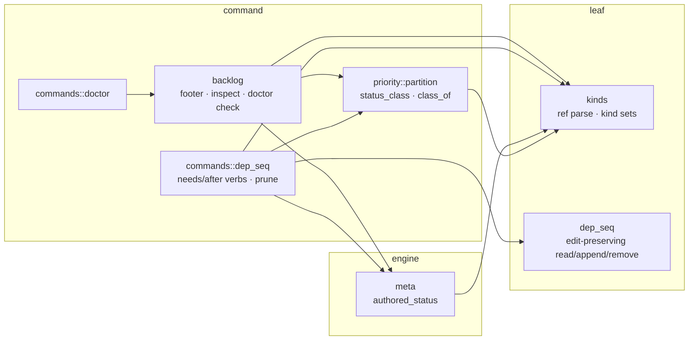

<!-- doctrine:section sec-1 -->
# 1. What changes, and where the boundary sits

## The surface

`doctrine backlog list --by sequence` prints the backlog as a **work order**: every
non-terminal issue, improvement, chore, risk and idea, sorted so that a prerequisite
appears above the item that depends on it. Two authored axes feed that sort —
`needs` (a hard prerequisite) and `after` (a soft manual sequence hint) — and the
sort itself is delegated to the `backlog_order` cordage adapter.

A backlog item may declare either axis on an entity that is **not** a backlog item:
a slice, an open question, a decision. The corpus carries **30 such edges** today
(measured 2026-08-15), 21 of them on the `needs` axis. The ordering machinery cannot
represent them: its node key `ItemId` is a `(backlog kind, number)` pair over exactly
five prefixes, so a `QUE-219` or `SL-251` target has no node to be, no rank to hold,
and no row to appear above.

This design does not change that, and `DEC-231` is the reason: `--by sequence` is a
*backlog-induced work order*, not an actionability gate. `doctrine next` already
says what is startable and correctly excludes the nine live items hanging off the
two open questions `QUE-218` and `QUE-219`; `doctrine blockers ISS-327` already
names `QUE-219` as the reason. Three surfaces answering three questions is the
intended architecture. What is wrong is narrower: on this one surface the edge is
**invisible**. `ISS-327` sits at rank 357 with nothing on screen saying a
prerequisite exists, where an ordinary backlog prerequisite would at least render
as a row above it.

That asymmetry is the whole defect. Inside the backlog, a live prerequisite is
disclosed *by being ordered*. Across the kind boundary it cannot be ordered, so it
must be disclosed some other way — or it is disclosed not at all, which is where
the surface stands now.

## Current behaviour

The `overrides:` footer under the table is the honest record of edges the order
could not honour. Until commit `74b773690` it reported every cross-kind edge as:

```
  ISS-028 → SL-182 dropped (dangling: SL-182 absent)
```

Every one of those claims was false — all the named entities exist. The line came
from the project-level `AbsentDrop` leg of `render_overrides`, which fires whenever
`backlog::parse_ref` fails to turn a ref into an `ItemId`, and which hardcoded the
word `absent` for a condition it had not checked. `74b773690` silenced those lines
as an interim. The footer is now empty repo-wide: the lie is gone and nothing
replaced it.

Three further faults sit behind that one, and this design closes all four:

1. **Nothing re-checks the refs after authoring.** `doctrine validate` is
   id-integrity only, and `relation_graph::validate_relations` consumes tier-1
   `[[relation]]` rows, not `[relationships] needs`/`after`. A fixture item
   carrying `needs = ["not-a-ref", "ISS-999", "QUE-219", "SL-9999"]` yields
   `doctor: corpus clean` on all four refs.
2. **The footer states one relation in two directions.** The `AbsentDrop` leg
   renders dependent-first; the adapter's `Override.from` is documented as
   uniformly the *predecessor*, so the same fact appears as `ISS-001 → not-a-ref`
   two lines from `ISS-999 → ISS-001`.
3. **The terminality probe is wrong, in four copies.** `backlog::run_after`'s
   `--prune` leg and `commands::dep_seq::run_after_prune` are near-verbatim
   duplicates of each other, and each duplicates its own read-parse-status block
   internally. All four hardcode `status == "resolved" || status == "closed"` —
   *backlog* vocabulary. A slice is terminal at `done` (ADR-009), a question at
   `answered`. So `doctrine after IMP-172 --prune`, with the edge present and
   `SL-154` at `done`, reports `nothing to prune`.

And one gap that is not cross-kind-specific at all: **`needs` has no removal verb**
for any kind. `doctrine unlink` operates on tier-1 relation rows, a different
storage; the dep/seq leaf implements removal for `after` only.

## Target behaviour

Every authored `needs`/`after` ref acquires exactly one destination, chosen by what
the reader of that destination needs to know (`DEC-232`):

| the ref | destination | rendered as |
|---|---|---|
| resolves to a live backlog item | the order itself | a row above the dependent |
| evicted or contradicted by the adapter | `overrides:` | `IMP-172 → ISS-084 dropped (soft cycle)` |
| resolves cross-kind, target **not** terminal | `boundary:` (new) | `ISS-327 needs QUE-219 (open)` |
| resolves, target terminal | nowhere | — |
| does not resolve at all | `doctrine doctor` | a `RelationIntegrity` error |

Alongside that, the edges become clearable on both axes and the terminality probe
that decides *clearable* collapses to one implementation shared with the footer.

Four surfaces, four questions, stated so the split can be checked rather than
remembered:

- `backlog list --by sequence` — **where does this work sit**, and what could not be
  ordered.
- `backlog inspect <ID>` — **what does this item declare**, and what state is each
  declared target in.
- `doctrine doctor` — **what is broken** in the authored data.
- `doctrine after <ID> --prune` / `--remove`, `doctrine needs <ID> <TGT> --remove` —
  **what can be cleared**.

## What does not change

- **No ordering effect, on either axis.** A cross-kind edge is diagnosed and never
  ordered, never used to withhold a dependent, never admitted as a phantom node.
  `backlog_order.rs`, `ItemId`, and the cordage adapter are untouched, so row order
  and row membership are unchanged and the `backlog_order` and `priority` suites are
  expected green **unmodified** (`DEC-231`).
- **No new flag.** The footer's shape is invocation-independent; `-a/--all` keeps
  its single row-membership meaning (`DEC-234`).
- **No relation vocabulary change.** No new label, no new axis, no widening of which
  kinds may author dep/seq. `doctrine unlink` stays tier-1-only.
- **No corpus edit.** The 30 authored refs are legal data. Clearing individual spent
  edges is a judgement call for after the tooling can make it honestly.
- **`backlog::parse_ref` is not widened.** Its five other callers depend on it
  hard-failing on a non-backlog prefix.

## Where the pieces live



The one new module-level edge in that picture is `meta → kinds`, engine to leaf and
therefore downward. Every other edge already exists in the crate today, which is
what keeps the ADR-001 command-tier tangle baseline untouched (§3).

<!-- doctrine:section sec-2 -->
# 2. Where an authored ref goes, and what each destination says

## The rule

`DEC-232` gives the footer one contract: **it states only what is needed to
understand the rendered content.** Everything follows from applying that to each
class of authored ref, and the classes are decided by two questions the code can
answer — *did this ref become an ordering node?* and *is its target terminal?*

```mermaid
flowchart TD
  R["authored ref on a live item<br/>needs: R  ·  after: R"] --> PR{"backlog::parse_ref"}
  PR -- "one of ISS/IMP/CHR/RSK/IDE" --> ADP["edge into the adapter"]
  PR -- "any other prefix,<br/>or unparseable" --> AD["AbsentDrop"]

  ADP --> OV{"adapter verdict"}
  OV -- "ordered" --> ROW["a row above the dependent"]
  OV -- "soft cycle / contradicted" --> FOOT["overrides:"]
  OV -- "Dangling —<br/>not a live node" --> DT{"item present?"}
  DT -- "present, terminal" --> NONE1["silent"]
  DT -- "absent" --> DOC["doctor · RelationIntegrity"]

  AD --> CR{"kinds::ensure_ref_resolves"}
  CR -- "malformed / unknown prefix" --> DOC
  CR -- "well-formed, no entity" --> DOC
  CR -- "resolves" --> CL{"partition::class_of"}
  CL -- "Terminal" --> NONE2["silent"]
  CL -- "Workable · Gating · Unrecognised" --> BND["boundary:"]
```



Read across the two halves and the same rule appears on both sides of the kind
boundary: **a satisfied prerequisite is silent, a live one is shown, and broken data
goes to `doctor`.** Inside the backlog, "shown" means *ordered as a row*; across the
boundary it cannot be, so it becomes a `boundary:` line. That symmetry is the
argument for the whole shape — the surface has one rule, not a rule plus an
exception for the kinds it cannot sort.

## `overrides:` — edges that could have ordered and did not

Unchanged in vocabulary, narrowed in membership. It keeps the two adapter verdicts
that are genuinely about *this* render:

```
overrides:
  IMP-172 → ISS-084 dropped (soft cycle)
  IMP-390 → ISS-084 dropped (contradicts a need)
```

Both legs it loses are legs that were never about the render:

- The **project-level `AbsentDrop` leg** is deleted. It reported a validation
  failure under a listing command, in the minority arrow direction, using a word
  (`absent`) it had not checked. The direction clash named as defect 2 in §1
  therefore dissolves **by deletion**, not by adjudicating which leg should flip —
  which is why no golden on the adapter leg moves.
- The **`Dangling` leg** is deleted. A `Dangling` override means the ref parsed to
  an `ItemId` that is not a live node, which is only ever one of two things: a
  terminal backlog item (already suppressed today by the IDE-019 rule, and still
  suppressed — a satisfied prerequisite explains nothing) or an absent one (now a
  `doctor` finding). With both arms routed elsewhere the leg has nothing left to
  print.

`Override::from` stays the predecessor, `Override::to` stays the dependent, and the
surviving lines keep the arrow. Nothing in `backlog_order.rs` is touched.

## `boundary:` — edges that were never in this order's universe

A separate block, below `overrides:`, in the same footer:

```
boundary:
  ISS-327 needs QUE-219 (open)
  ISS-355 needs, after QUE-218 (open)
  IMP-390 after SL-251 (ready)
  ISS-401 needs RV-350 (status unavailable)
```

The line form is **dependent-first, relation word, target, target status** — no
arrow. Four choices worth stating:

- **Dependent-first with the relation word** reads as the sentence the author
  actually wrote (`ISS-327 needs QUE-219`), and it sidesteps the arrow's ambiguity:
  the block has one direction because it renders an authored declaration, not a
  graph edge the adapter processed.
- **No `dropped`.** The edge was never a candidate for this order, so calling it
  dropped is the same false verb the footer is being cured of.
- **The status in parentheses is the target's own authored status word**, not a
  translation into backlog vocabulary. `QUE-219` is `open`; `SL-251` is `ready`.
  The reader is being handed the thing they would look up next.
- **One line per `(dependent, target)` pair**, with the axes joined in canonical
  order when an item declares both (`needs, after`). The footer's job is one line's
  worth of information about a target; the *authored* record, undeduplicated, is
  `backlog inspect`'s (§4).

Lines sort by `(dependent, target)` so the block is deterministic for goldens.

Two suppressions, both consequences of the contract rather than noise heuristics:

- **A terminal target prints nothing.** On the live corpus that is 15 of the 25
  edges that reach the footer, so the default block is 10 lines, not 25.
- **A terminal *dependent* never reaches the footer at all**, because the ordering
  projection only admits live items as nodes. Five of the 30 edges are in that
  position. Their refs are still checked by `doctor`, which walks the authored
  corpus rather than the live node set (§5).

## `doctor` — authored data that is wrong

Every ref-integrity failure leaves the listing surface entirely: a malformed ref, a
well-formed ref to an absent backlog id, and a well-formed cross-kind ref that does
not resolve. All three are the same fact — *this ref names nothing* — and they are
reported once, in the one place that exists to list what is broken, at the existing
`RelationIntegrity` (Error) severity.

The removal is only honest because the errors have somewhere to go: nothing
re-checks these refs today, so deleting the `AbsentDrop` leg without adding the
check would make a malformed ref surface nowhere. That is why the check is folded
into this slice rather than deferred.

## The one status the probe cannot read

`RV`'s status is *derived* at command tier from its authored finding ledger, above
the tier the probe reaches. `DEC-233` refuses to let that read as anything else:
the target renders `(status unavailable)`, a token that names the tooling gap rather
than occupying the status slot, and it classifies `Unrecognised`, which is not
suppressed. An unreadable status must never be silently classed `Terminal` — that
is the precise path by which an open prerequisite would vanish from a work order,
and it is the failure this design exists to remove rather than relocate.

Worth stating plainly, because it changes how the case is tested: **the authoring
gate already refuses `RV` and `REC` as dep/seq targets.** `kinds::ADMISSIBLE_DEP_TARGETS`
is work-like ∪ record, and neither `RV` nor `REC` is in it, so `doctrine needs
ISS-401 RV-350` is rejected at author time. The `Unavailable` arm is therefore
**defensive**, reachable only through a hand-edited or legacy toml. It is still
worth building — the footer's job is to be honest about data it did not author —
but its test fixture must be hand-written rather than produced through the CLI, and
the standing pin on the derived-status kind set (§3) is what keeps it correct as
kinds are added.

<!-- doctrine:section sec-3 -->
# 3. The probe: what a cross-kind target's status is, and who may ask

Three consumers need the same fact about a cross-kind target — the `boundary:`
block needs its status to print, the suppression rule needs its class, and
`after --prune` needs to know whether it is spent. `DEC-233` settles how that fact
is obtained, and the constraint is layering rather than cost.

## Why not the obvious route

`src/catalog/scan.rs` already owns an all-kind status read and claims sole ownership
of the KINDS walk. It is unusable here in both of its shapes:

- `scan_entities`, the full 24-kind walk, costs `doctrine validate` 3.6s and
  `doctrine doctor` 10.8s on a ~4,400-entity corpus, against `backlog list --by
  sequence`'s 0.19s. A ~20× regression on the default listing command.
- `status_and_title_for`, the targeted per-ref read, is refused by governance, not
  cost. ADR-001 classifies `catalog::scan` as **command** tier and records that it
  reaches `backlog`; a `backlog → catalog::scan` edge closes a command-tier cycle
  the layering ratchet rejects.

Both named horns are dead, so the probe is composed instead from two seams the
consumers already reach *downward*.

## The composition

**Resolution is leaf.** `kinds::ensure_ref_resolves` (via `parse_resolvable_ref`)
turns a ref into a `(&'static KindRef, u32)` and, for a canonical ref, costs a
single directory stat with no file read. This is the same function `run_needs` uses
at authoring time and the same one `doctor`'s new check uses (§5), so authoring
and health agree by construction rather than by two tables kept in step.

**Status is engine.** `meta::read_meta` is one toml parse per **distinct** target —
about 15 in the live corpus, ~8ms against a 190ms baseline.

**Classification is policy.** `priority::partition::status_class` stays the sole
per-kind terminality authority, which is what REQ-238 requires and what makes the
`VA` criterion checkable: no second terminal-status vocabulary may survive anywhere.

## The three-way, and where its vocabulary lives

`read_meta` deserializes a strict `Meta` that demands a top-level `status`, so it
cannot be pointed at every kind. Two kinds author none, for opposite reasons, and
telling them apart is the whole point of a three-way return:

```rust
// src/kinds/mod.rs — leaf, beside WORK_LIKE / RECORD / ADMISSIBLE_DEP_TARGETS

/// Kinds that author no top-level `status` because they have no lifecycle.
pub(crate) const STATUS_LESS: &[&str] = &[REC];

/// Kinds whose status is DERIVED above the tier an engine-tier reader can reach
/// (`RV` — `review::derived_status_string` reads the finding ledger at command
/// tier). A reader below that tier can only report the gap, never the status.
pub(crate) const DERIVED_STATUS: &[&str] = &[RV];

/// What an entity's authored status is, as far as the kind vocabulary and an
/// engine-tier read can say.
pub(crate) enum AuthoredStatus {
    /// Read from the entity's own toml.
    Known(String),
    /// The kind is genuinely status-less — `status_class` defines this Terminal.
    Absent,
    /// The kind's status is derived above this tier. NEVER Terminal.
    Unavailable,
}
```

```rust
// src/meta.rs — engine

pub(crate) fn authored_status(
    root: &Path,
    kref: &'static kinds::KindRef,
    id: u32,
) -> anyhow::Result<AuthoredStatus>
```

Detection is **static, from the parsed kind** — never inferred from a read failure.
That distinction is load-bearing: an entity whose directory resolves but whose toml
is missing or unparseable is a *corpus defect*, and it must keep its existing
channel (an `Err` the caller reports) rather than being laundered into
`Unavailable`. A tooling limit and a broken file must not share a signal.

```rust
// src/priority/partition.rs — the policy tier

pub(crate) fn class_of(kind: &entity::Kind, status: &AuthoredStatus) -> StatusClass
```

`class_of` is four lines over `status_class`: `Known(s)` → `status_class(kind,
Some(s))`; `Absent` → `status_class(kind, None)`, which the table already documents
as `Terminal`; `Unavailable` → `Unrecognised`, which the default-quiet rule does not
hide. It exists rather than being inlined at each consumer so the `Unavailable`
rule is stated once, in the module REQ-238 designates as the home of per-kind
terminality policy.

## The three standing rules the degradation carries

1. **`Unavailable` never suppresses.** It classifies `Unrecognised`; only
   `Terminal` is suppressed. The edge is always disclosed, with a token that reads
   as a tooling gap.
2. **The derived-status set is pinned by a test.** A future kind that derives its
   status and is not added to `DERIVED_STATUS` must fail a test, not degrade
   quietly.
3. **A genuine read failure is a different trip.** It is `doctor`'s business, never
   a rendered status, and never silently dropped.

## One table, not two

`catalog::scan::status_and_title_for` currently spells the same two special cases as
inline string literals (`"REC" =>`, `"RV" =>`). Introducing the consts above without
touching it would create exactly the duplicated vocabulary STD-001 forbids — and
would hollow out rule 2, since the pin would guard one reader while the other
drifted. So its match arms re-source from `kinds::STATUS_LESS` /
`kinds::DERIVED_STATUS`. Two lines, and it makes the pin bind both readers.

## Layering, stated so it can be checked

Every module-level edge the design needs already exists in the crate, with one
exception:

| edge | status | tier direction |
|---|---|---|
| `backlog → priority` | exists (`priority::surface::show_value_line`) | command → command |
| `backlog → meta`, `backlog → kinds` | exist | command → engine / leaf |
| `commands → priority` | exists (`commands::inspect`, `commands::compare`) | command → command |
| `commands → backlog`, `commands → dep_seq`, `commands → kinds` | exist | command → command / leaf |
| `priority → kinds` | exists (`partition` already imports it) | command → leaf |
| **`meta → kinds`** | **new** | engine → leaf, downward |

The layering gate records edges at top-level-module granularity, so reaching a new
*function* inside a module the source already imports adds no edge. The single new
edge is downward and therefore cannot join a cycle. **The command-tier tangle
baseline of 76 does not move**, and that is a test assertion, not a claim to be
taken on trust (§7).

