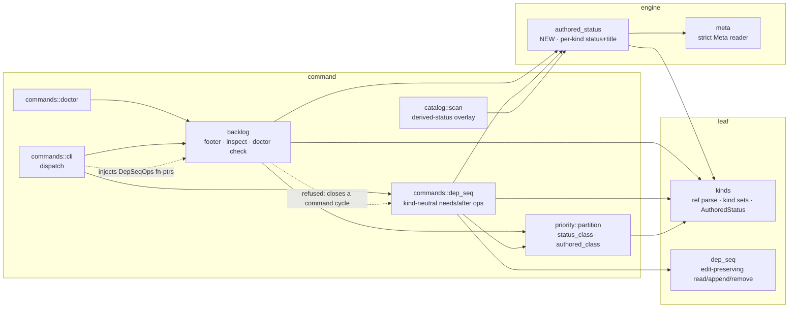
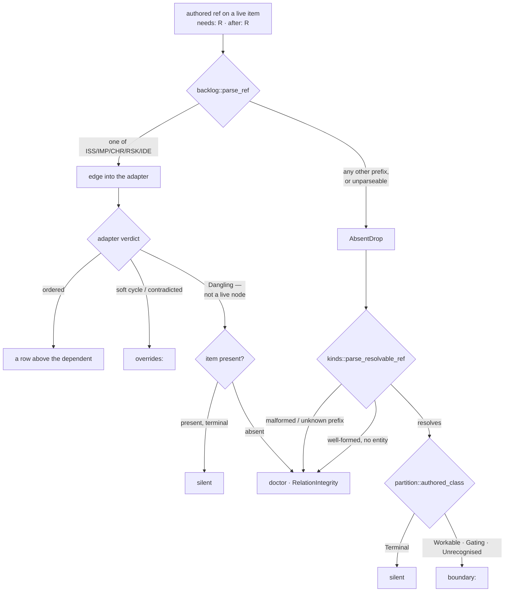

<!-- doctrine:section sec-1 -->
# 1. What changes, and where the boundary sits

## The surface

`doctrine backlog list --by sequence` prints the backlog as a **work order**: every
non-terminal issue, improvement, chore, risk and idea, sorted so that a prerequisite
appears above the item that depends on it. Two authored axes feed that sort —
`needs` (a hard prerequisite) and `after` (a soft manual sequence hint) — and the
sort itself is delegated to the `backlog_order` cordage adapter.

A backlog item may declare either axis on an entity that is **not** a backlog item:
a slice, an open question, a decision. The corpus carries **31 such edges**
(re-scanned 2026-08-16), 16 of them on the `needs` axis and 15 on `after`.

Every corpus figure in this design is a **dated snapshot of a moving population**,
not an invariant, and is quoted to show scale rather than to be depended on. The
count was 30 earlier the same day; `ISS-367` was authored with an `after` edge onto
`SL-256` in between. Nothing here breaks when it moves again — the tests fixture
the *classes*, never the counts (§7) — and a later reader finding a different total
has found drift, not an error.

The ordering machinery cannot represent them: its node key `ItemId` is a
`(backlog kind, number)` pair over exactly five prefixes, so a `QUE-219` or `SL-251`
target has no node to be, no rank to hold, and no row to appear above.

This design does not change that, and `DEC-231` is the reason: `--by sequence` is a
*backlog-induced work order*, not an actionability gate. `doctrine next` already
says what is startable and correctly excludes the nine live items hanging off the
two open questions `QUE-218` and `QUE-219`; `doctrine blockers ISS-327` already
names `QUE-219` as the reason. Three surfaces answering three questions is the
intended architecture. What is wrong is narrower: on this one surface the edge is
**invisible**. `ISS-327` sits at rank 357 with nothing on screen saying a
prerequisite exists, where an ordinary backlog prerequisite would at least render
as a row above it.

That asymmetry is the whole defect. Inside the backlog, a live prerequisite is
disclosed *by being ordered*. Across the kind boundary it cannot be ordered, so it
must be disclosed some other way — or it is disclosed not at all, which is where
the surface stands now.

## Current behaviour

The `overrides:` footer under the table is the honest record of edges the order
could not honour. Until commit `74b773690` it reported every cross-kind edge as:

```
  ISS-028 → SL-182 dropped (dangling: SL-182 absent)
```

Every one of those claims was false — all the named entities exist. The line came
from the project-level `AbsentDrop` leg of `render_overrides`, which fires whenever
`backlog::parse_ref` fails to turn a ref into an `ItemId`, and which hardcoded the
word `absent` for a condition it had not checked. `74b773690` silenced those lines
as an interim. The footer is now empty repo-wide: the lie is gone and nothing
replaced it.

Three further faults sit behind that one, and this design closes all four:

1. **Nothing re-checks the refs after authoring.** `doctrine validate` is
   id-integrity only, and `relation_graph::validate_relations` consumes tier-1
   `[[relation]]` rows, not `[relationships] needs`/`after`. A fixture item
   carrying `needs = ["not-a-ref", "ISS-999", "QUE-219", "SL-9999"]` yields
   `doctor: corpus clean` on all four refs.
2. **The footer states one relation in two directions.** The `AbsentDrop` leg
   renders dependent-first; the adapter's `Override.from` is documented as
   uniformly the *predecessor*, so the same fact appears as `ISS-001 → not-a-ref`
   two lines from `ISS-999 → ISS-001`.
3. **The terminality probe is wrong, in four copies.** `backlog::run_after`'s
   `--prune` leg and `commands::dep_seq::run_after_prune` are near-verbatim
   duplicates of each other, and each duplicates its own read-parse-status block
   internally. All four hardcode `status == "resolved" || status == "closed"` —
   *backlog* vocabulary. A slice is terminal at `done` (ADR-009), a question at
   `answered`. So `doctrine after IMP-172 --prune`, with the edge present and
   `SL-154` at `done`, reports `nothing to prune`. All four also launder a failed
   read into an empty status word, which STD-003 forbids (§6).

And one gap that is not cross-kind-specific at all: **`needs` has no removal verb**
for any kind. `doctrine unlink` operates on tier-1 relation rows, a different
storage; the dep/seq leaf implements removal for `after` only.

## Target behaviour

Every authored `needs`/`after` ref acquires exactly one destination, chosen by what
the reader of that destination needs to know (`DEC-232`):

| the ref | destination | rendered as |
|---|---|---|
| resolves to a live backlog item | the order itself | a row above the dependent |
| evicted or contradicted by the adapter | `overrides:` | `IMP-172 → ISS-084 dropped (soft cycle)` |
| resolves cross-kind, target **not** terminal | `boundary:` (new) | `ISS-327 needs QUE-219 (open)` |
| resolves, target terminal | nowhere | — |
| does not resolve at all | `doctrine doctor` | a `RelationIntegrity` error |

The last row leaves the listing surface, so the listing surface says one thing about
it: when the probe drops at least one unresolvable ref, a **count-only advisory**
goes to stderr naming no individual ref and pointing at `doctor` (§2). That is a
signpost, not the report — the footer's contract is unchanged, and the reader is not
left to discover a validation failure by running a command nothing prompted them to
run.

Alongside that, the edges become clearable on both axes and the terminality probe
that decides *clearable* collapses to one implementation shared with the footer.

Four surfaces, four questions, stated so the split can be checked rather than
remembered:

- `backlog list --by sequence` — **where does this work sit**, and what could not be
  ordered.
- `backlog inspect <ID>` — **what does this item declare**, and what state is each
  declared target in.
- `doctrine doctor` — **what is broken** in the authored data.
- `doctrine after <ID> --prune` / `--remove`, `doctrine needs <ID> <TGT> --remove` —
  **what can be cleared**.

## What does not change

- **No ordering effect, on either axis.** A cross-kind edge is diagnosed and never
  ordered, never used to withhold a dependent, never admitted as a phantom node.
  `backlog_order.rs`, `ItemId`, and the cordage adapter are untouched, so row order
  and row membership are unchanged and the `backlog_order` and `priority` suites are
  expected green **unmodified** (`DEC-231`).
- **No new flag.** The footer's shape is invocation-independent; `-a/--all` keeps
  its single row-membership meaning (`DEC-234`).
- **No relation vocabulary change.** No new label, no new axis, no widening of which
  kinds may author dep/seq. `doctrine unlink` stays tier-1-only.
- **No corpus edit.** The 31 authored refs are legal data, and none of them is
  broken today — a full scan on 2026-08-16 found **zero** unresolvable authored
  `needs`/`after` refs. Clearing individual spent edges is a judgement call for
  after the tooling can make it honestly.
- **`backlog::parse_ref` is not widened.** Its five other callers depend on it
  hard-failing on a non-backlog prefix.

## Where the pieces live



Two dotted edges, and the pair is the whole layering story of §6. `backlog`
reaching into `commands` for the shared dep/seq operations is the obvious spelling
and it is refused — the two modules are in different SCCs, so that back edge merges
two clusters into one tangle. `cli` already depends on `backlog` downward, so it
passes the operations *in* instead. No new edge, one implementation.

The picture answers a layering question this design got wrong twice, at two
different seams — and got two *different* right answers, which is the part worth
holding on to.

The first draft sited the per-kind status read in `meta` and defended the resulting
`meta → kinds` edge as safe because it pointed downward. True, and beside the point:
`meta`'s charter is that it carries *zero per-kind knowledge*, which is what makes
it safe for the fifteen modules that consume it (§3). A second draft had `backlog` call the
dep/seq operations where they happen to live, inside `commands`, and defended it as
reuse. Also true, also beside the point: `backlog` does not import `commands` at
all, and that edge closes a command-tier cycle (§6).

Same error twice — judging an edge by its *direction* rather than by what it does to
the module at either end. But the repairs diverge, and the reason they diverge is
the actual rule:

- The **status read** has no command-tier dependency. It is misfiled engine logic,
  so it moves down into its own module, `src/authored_status.rs`, and both consumers
  import it downward.
- The **dep/seq operations** do have one: `--prune` classifies terminality through
  `partition::authored_class`, and `priority` is command tier. They are not misfiled;
  they belong where they are. So the *dependency* inverts instead — `cli` injects
  them into `backlog` — and nothing moves.

Relocate a seam when it sits above its natural tier; invert the dependency when it
does not. Reaching for either move without asking which case you are in is how both
drafts went wrong. **Every new edge is downward, and no new edge joins two existing
command modules.** The command-tier tangle baseline of 76 is untouched, and §7 makes
that a test rather than a claim (§3, §7).


<!-- doctrine:section sec-2 -->
# 2. Where an authored ref goes, and what each destination says

## The rule

`DEC-232` gives the footer one contract: **it states only what is needed to
understand the rendered content.** Everything follows from applying that to each
class of authored ref, and the classes are decided by two questions the code can
answer — *did this ref become an ordering node?* and *is its target terminal?*



Read across the two halves and the same rule appears on both sides of the kind
boundary: **a satisfied prerequisite is silent, a live one is shown, and broken data
goes to `doctor`.** Inside the backlog, "shown" means *ordered as a row*; across the
boundary it cannot be, so it becomes a `boundary:` line. That symmetry is the
argument for the whole shape — the surface has one rule, not a rule plus an
exception for the kinds it cannot sort.

## `overrides:` — edges that could have ordered and did not

Unchanged in vocabulary, narrowed in membership. It keeps the two adapter verdicts
that are genuinely about *this* render:

```
overrides:
  IMP-172 → ISS-084 dropped (soft cycle)
  IMP-390 → ISS-084 dropped (contradicts a need)
```

Both legs it loses are legs that were never about the render:

- The **project-level `AbsentDrop` leg** is deleted. It reported a validation
  failure under a listing command, in the minority arrow direction, using a word
  (`absent`) it had not checked. The direction clash named as defect 2 in §1
  therefore dissolves **by deletion**, not by adjudicating which leg should flip —
  which is why no golden on the adapter leg moves.
- The **`Dangling` leg** is deleted. A `Dangling` override means the ref parsed to
  an `ItemId` that is not a live node, which is only ever one of two things: a
  terminal backlog item (already suppressed today by the IDE-019 rule, and still
  suppressed — a satisfied prerequisite explains nothing) or an absent one, which
  `project` now records as an `AbsentDrop` in its own right (§4) so that it reaches
  `doctor` — and the advisory below — by the same route every other unresolvable
  ref takes, rather than by an inference from the adapter's verdict. `project`
  admits every non-terminal item as a node and pre-filters no edges
  (`backlog.rs:742`), so there is no third case. With both arms routed elsewhere
  the leg has nothing left to print.

  **What is deleted is the render leg, not the verdict.** The adapter goes on
  computing `Dangling` overrides exactly as it does today — §7 asserts no adapter
  input changes — and `render_overrides` now discards them. So for an absent
  backlog id the fact is briefly carried twice, once as an adapter verdict that
  is dropped unprinted and once as the `AbsentDrop` `project` records. That is
  deliberate: retiring the adapter's computation would be an ordering-machinery
  change for a rendering problem, and it is the adapter's verdict that the
  suppressed terminal case still rides. Named because a reader of the bullet
  above could otherwise conclude `Dangling` no longer exists.

`Override::from` stays the predecessor, `Override::to` stays the dependent, and the
surviving lines keep the arrow. Nothing in `backlog_order.rs` is touched.

## `boundary:` — edges that were never in this order's universe

A separate block, below `overrides:`, in the same footer. On the live corpus it is
exactly these four lines plus seven more of the same shape:

```
boundary:
  IMP-386 needs QUE-218 (open)
  IMP-390 after SL-251 (ready)
  ISS-290 needs QUE-219 (open)
  ISS-327 needs QUE-219 (open)
```

The line form is **dependent-first, relation word, target, target status** — no
arrow. Four choices worth stating:

- **Dependent-first with the relation word** reads as the sentence the author
  actually wrote (`ISS-327 needs QUE-219`), and it sidesteps the arrow's ambiguity:
  the block has one direction because it renders an authored declaration, not a
  graph edge the adapter processed.
- **No `dropped`.** The edge was never a candidate for this order, so calling it
  dropped is the same false verb the footer is being cured of.
- **The status in parentheses is the target's own authored status word**, not a
  translation into backlog vocabulary. `QUE-219` is `open`; `SL-251` is `ready`.
  Two tokens are not statuses and say so: `(status unavailable)` for a kind whose
  status is derived above the probe's tier, and `(unreadable)` for a target whose
  toml is present but will not parse. Neither is ever suppressed (§3, §4).
- **One line per `(dependent, target)` pair**, with the axes joined in canonical
  order when an item declares both — `ISS-355 needs, after QUE-218 (open)`. The
  footer's job is one line's worth of information about a target; the *authored*
  record, undeduplicated, is `backlog inspect`'s (§4).

Lines sort by the rendered `(dependent, target)` pair, so the block is
deterministic for goldens — which is why the sample above reads `IMP` before `ISS`.

Two suppressions, both consequences of the contract rather than noise heuristics:

- **A terminal target prints nothing.** On the live corpus that is 15 of the 26
  edges that reach the footer, so the default block is 11 lines, not 26.
- **A terminal *dependent* never reaches the footer at all**, because the ordering
  projection only admits live items as nodes. Five of the 31 edges are in that
  position. Their refs are still checked by `doctor`, which walks the authored
  corpus rather than the live node set (§5).

## `doctor` — authored data that is wrong

Every ref-integrity failure leaves the listing surface entirely: a malformed ref, a
well-formed ref to an absent backlog id, and a well-formed cross-kind ref that does
not resolve. All three are the same fact — *this ref names nothing* — and they are
reported once, in the one place that exists to list what is broken, at the existing
`RelationIntegrity` (Error) severity.

## The signpost the listing surface keeps

Routing that class to `doctor` removes the only mention it has ever had on the
surface where the work happens. Today a malformed ref at least produces a line under
the table; after this change the table is silent about it, and the report lives in a
command nothing obliges anyone to run.

So when the probe drops **one or more** unresolvable refs, `backlog list` emits a
single count-only advisory to stderr:

```
backlog list: 3 authored needs/after refs name nothing — run `doctrine doctor`
```

Four properties make this a signpost rather than a second report, and keep
`DEC-232` intact:

- **It names no ref.** The footer's contract is untouched, because this is not in
  the footer: stderr already carries advisories in exactly this voice, beside the
  `Ordering::Degraded` cycle warning (`backlog.rs:1159-1162`), and `--json` routes
  it there on the same terms as the footer blocks.
- **The count is over distinct `(dependent, axis, ref)` occurrences**, so one bad ref
  declared on both axes reads as two repairs — matching §5's undeduplicated check
  rather than the footer's per-pair dedup. The axis belongs in the key: without it
  the same ref on `needs` and on `after` is one occurrence, and the count would say
  one repair where there are two edges to remove. `needs` and `after` are stored as
  separate authored arrays (`backlog.rs:628-635`), so they are two facts.
- **It counts all three broken-ref classes, not the two the projection notices
  first.** A malformed ref and an unresolvable cross-kind ref both fail
  `backlog::parse_ref` and are `AbsentDrop`s already. A well-formed ref to an
  **absent backlog id** (`ISS-999`) parses cleanly and would otherwise reach only
  the adapter, as the `Dangling` override whose leg is deleted above — leaving the
  one class that produces a `doctor` error and no signpost at all. §4 closes that
  by recording it as an `AbsentDrop` too, so the advisory's count and §5's check
  report the same population. A signpost that points at `doctor` for a subset of
  what `doctor` will say is worse than no signpost, because the reader who follows
  it once and finds it complete will trust it when it is not.
- **It fires only under `--by sequence`**, because `--by id` never composes and so
  never probes. That matches today's footer behaviour exactly, and adding a probe to
  `--by id` purely to emit the line would buy a warning at the cost of the very read
  the order mode exists to avoid.

Measured 2026-08-16, the advisory does not fire: a full scan of every authored
`needs`/`after` ref found **zero** unresolvable. That is not luck — every authoring
path is already gated by `ensure_ref_resolves` — so the check and its signpost are
for *drift*: a hand-edit, or a target deleted out from under a live ref. Neither is
checked anywhere today, which is why the check earns its place, and why §5 is honest
to describe it as a drift check rather than a cleanup.

## The one status the probe cannot read

`RV`'s status is *derived* at command tier from its authored finding ledger, above
the tier an engine-tier probe reaches. `DEC-233` refuses to let that read as
anything else: the target renders `(status unavailable)`, a token that names the
tooling gap rather than occupying the status slot, and it classifies `Unrecognised`,
which is not suppressed. An unreadable status must never be silently classed
`Terminal` — that is the precise path by which an open prerequisite would vanish
from a work order, and it is the failure this design exists to remove rather than
relocate.

Worth stating plainly, because it changes how the case is tested: the authoring gate
refuses `RV` and `REC` as dep/seq targets. `kinds::ADMISSIBLE_DEP_TARGETS` is
work-like ∪ record, and neither `RV` nor `REC` is in it, so `doctrine needs ISS-401
RV-350` is rejected at author time.

**That is true of one authoring path and not the other.** `backlog needs` never
applies the gate — it checks only that each prerequisite resolves
(`backlog.rs:1963-1964`) — so `doctrine backlog needs ISS-401 RV-350` succeeds
today. The `Unavailable` arm on this surface is therefore live rather than
defensive, and an earlier draft claimed the opposite. §6 routes that loop through
the shared gate and closes it; what the fix cannot do is unauthor an edge already
written, so the arm remains worth building on its own terms — the footer's job is
to be honest about data it did not author — and §7 tests it from a CLI-authored
fixture as well as a hand-authored one. The standing pin on the derived-status kind
set (§3) is what keeps it correct as kinds are added.


<!-- doctrine:section sec-3 -->
# 3. The probe: what a cross-kind target's status is, and who may ask

Three consumers need the same fact about a cross-kind target — the `boundary:`
block needs its status to print, the suppression rule needs its class, and
`after --prune` needs to know whether it is spent. `DEC-233` settles how that
fact is obtained, and the constraint is layering rather than cost.

## Why the obvious route is refused, and what that refusal does not license

`src/catalog/scan.rs` already owns an all-kind status read. It is unusable *as a
call* in both of its shapes:

- `scan_entities`, the full 24-kind walk, costs `doctrine validate` 3.6s and
  `doctrine doctor` 10.8s on a ~4,400-entity corpus, against `backlog list --by
  sequence`'s 0.19s. A ~20× regression on the default listing command.
- `status_and_title_for`, the targeted per-ref read, is refused by governance,
  not cost. ADR-001 classifies `catalog::scan` as **command** tier, and it
  reaches `backlog` (`scan.rs:65-66`), so a `backlog → catalog::scan` edge
  closes a command-tier cycle the layering ratchet rejects.

**The refusal is about the call, not about the code.** `status_and_title_for` is
already exactly the reader this design needs: `(root, kref, id)`, dispatched on
the canonical prefix — `REC` status-less, `RV` derived, every other kind one
`meta::read_meta` that yields status and title from a single parse. Writing a
second reader beside it and reconciling only the two string constants would
leave two readers that **disagree by construction** on `RV`: one answering
`Some(derived)`, the other `Unavailable`, with the pin guarding a membership
list and nothing guarding the behaviour. That is the parallel implementation
this project forbids, dressed as layering compliance.

So the reader moves **down**, and the caller that can see further stays where it
is.

## Where it moves to, and why that is not `meta`

A new engine module, `src/authored_status.rs`.

Not `meta`, whose module doc forbids it in as many words: *"The reader, status
filter, and aligned formatter are status/path-parametric — they carry **zero
per-kind knowledge** — so they live here once and every kind calls them"*, and
*"deliberately not `entity.rs`, which stays a kind-blind scaffold engine"*
(`src/meta.rs:3-14`). A reader that branches on `RV` and `REC` is per-kind
knowledge by definition, and fifteen modules consume `meta` on the strength of
that blindness. An earlier draft of this design routed the read through
`meta` and argued the resulting `meta → kinds` edge was safe because it pointed
downward. The direction was never the question.

The new module costs nothing in layering. `src/integrity.rs` is already an
engine module importing `kinds`, `meta` and `entity` (`integrity.rs:19-20`), so
`engine → {kinds, meta, entity}` is a precedented edge set and this design adds
no new module edge at all.

## The composition

**Resolution is leaf.** `kinds::parse_resolvable_ref` (`kinds/resolve.rs:63`)
turns a ref into a `(&'static KindRef, u32)` and, for a canonical ref, costs a
single directory stat with no file read. `ensure_ref_resolves` (`:33`) is the
`-> Result<()>` wrapper over that same function, and is what `backlog needs`
uses at authoring time (`backlog.rs:1963`) and what `doctor`'s new check uses
(§5). The probe needs the pair, so it calls the delegate directly. One resolver,
three callers, agreeing by construction rather than by two tables kept in step.

`parse_resolvable_ref` also accepts the **bare** form (`31`, not just `SL-031`),
scanning all kinds for a unique match. An authored bare ref therefore resolves
and is disclosed by its ref verbatim; no consumer needs to special-case it, and
§6 names the one place where the distinction bites.

**Status is engine.** The new module, one toml parse per **distinct** target —
about 16 in the live corpus, ~8ms against a 190ms baseline.

**Classification is policy.** `priority::partition::status_class` stays the sole
per-kind terminality authority, which is what REQ-238 requires and what makes
the `VA` criterion checkable: no second terminal-status vocabulary may survive
anywhere.

## The types

```rust
// src/kinds/mod.rs — leaf, beside WORK_LIKE / RECORD / ADMISSIBLE_DEP_TARGETS

/// Kinds that author no top-level `status` because they have no lifecycle.
pub(crate) const STATUS_LESS: &[&str] = &[REC];

/// Kinds whose status is DERIVED above the tier an engine-tier reader can reach
/// (`RV` — `review::derived_status_string` reads the finding ledger at command
/// tier). A reader below that tier can only report the gap, never the status.
pub(crate) const DERIVED_STATUS: &[&str] = &[RV];

/// What an entity's authored status is, as far as the kind vocabulary and an
/// engine-tier read can say.
pub(crate) enum AuthoredStatus {
    /// Read from the entity's own toml.
    Known(String),
    /// The kind is genuinely status-less — `status_class` defines this Terminal.
    Absent,
    /// The kind's status is derived above this tier. NEVER Terminal.
    Unavailable,
}
```

The vocabulary stays in `kinds` (leaf, `out=0`) so that both the engine reader
and the command-tier classifier depend only on leaf for the type.

```rust
// src/authored_status.rs — engine

pub(crate) struct Authored {
    pub(crate) status: AuthoredStatus,
    pub(crate) title: String,
}

pub(crate) fn read(
    root: &Path,
    kref: &kinds::KindRef,
    id: u32,
) -> anyhow::Result<Authored>
```

The `kref` is a plain borrow, deliberately **not** `&'static`. The overlay below
delegates from `catalog::scan::status_and_title_for`, whose own parameter carries
no `'static` bound (`scan.rs:412`), so a `'static` requirement here would be
unmeetable at the one call site this design commits to writing. Nothing in `read`
needs it: it borrows nothing out of the `kref`, and the `&'static entity::Kind`
the projections carry (§4) comes from `parse_resolvable_ref`, not from here.

The title rides along rather than being a second read: `meta::Meta` already
carries both fields, and SL-050 `F-1` collapsed precisely this pair into one
parse. A caller wanting only the status discards the title; nobody pays twice.
Three arms, each **static from the parsed kind**:

| kind set | status | title |
|---|---|---|
| `DERIVED_STATUS` | `Unavailable` | lenient read |
| `STATUS_LESS` | `Absent` | lenient read |
| otherwise | `Known(s)` from one `meta::read_meta` | same parse |

The lenient title reader moves here from `catalog::scan::title_for`, which
repairs something adjacent: `meta.rs`'s `IdOnly` doc states that leniency over a
status-less toml is *confined to that path*, and `title_for` was a second
lenient reader living outside the confinement.

## The one status the probe cannot read, and who can

`RV`'s status is derived at command tier from its authored finding ledger
(`review::derived_status_string`), and `review` is itself command tier
(`layering.toml:114`), so no engine-tier reader can obtain it. The engine
returns `Unavailable`, and `catalog::scan::status_and_title_for` becomes the
command-tier **overlay** that can do better:

```rust
let a = authored_status::read(root, kref, id)?;
match a.status {
    AuthoredStatus::Unavailable => (Some(review::derived_status_string(root, id)?), a.title),
    AuthoredStatus::Absent      => (None, a.title),
    AuthoredStatus::Known(s)    => (Some(s), a.title),
}
```

One implementation, one parse, and the `DERIVED_STATUS` arm decided in exactly
one place — so the pin binds *behaviour*, not merely a membership list.

On the listing surface `DEC-233` refuses to let `Unavailable` read as anything
else: the target renders `(status unavailable)`, a token that names the tooling
gap rather than occupying the status slot, and it classifies `Unrecognised`,
which is not suppressed. An unreadable status must never be silently classed
`Terminal` — that is the precise path by which an open prerequisite would vanish
from a work order, and it is the failure this design exists to remove rather
than relocate.

Worth stating plainly, because it changes how the case is tested: the authoring
gate refuses `RV` and `REC` as dep/seq targets (`kinds::ADMISSIBLE_DEP_TARGETS`,
`kinds/mod.rs:78`), so `doctrine needs ISS-401 RV-350` is rejected at author time.

**On one path only, today.** `backlog needs` validates its prerequisites with
`kinds::ensure_ref_resolves` alone and never applies that gate
(`backlog.rs:1963-1964`), so `doctrine backlog needs ISS-401 RV-350` is accepted
right now. The `Unavailable` arm is therefore **not** defensive on the listing
path, and an earlier draft of this section said it was. §6 closes the hole by
routing that prerequisite loop through the shared gate; until it lands the arm is
CLI-reachable, and §7 accordingly keeps a CLI-authored fixture beside the
hand-authored one rather than mandating hand-authoring as the only route.

It is not defensive in `catalog::scan` either, which reads every `RV` in the
corpus on every walk — which is a second reason the arm belongs to one shared
reader.

## `authored_class`

```rust
// src/priority/partition.rs — the policy tier

pub(crate) fn authored_class(kind: &entity::Kind, status: &AuthoredStatus) -> StatusClass
```

Four lines over `status_class`: `Known(s)` → `status_class(kind, Some(s))`;
`Absent` → `status_class(kind, None)`, which the table already documents as
`Terminal` (`partition.rs:244-247`); `Unavailable` → `Unrecognised`, which the
default-quiet rule does not hide. It exists rather than being inlined at each
consumer so the `Unavailable` rule is stated once, in the module REQ-238
designates as the home of per-kind terminality policy. The inline comment on
that `None` arm — *"The only status-less kind is REC"* — re-sources from
`kinds::STATUS_LESS` at the same time, so the fact has one home rather than
three.

`authored_class` is a **new shared abstraction**, and `DEC-233` said there would not be
one. §9 records it as a departure with the reasoning; what belongs here is the
consequence, which is that adding an arm to this function is now the way the
`Unavailable` rule changes, and there is exactly one such place.

### Why `Unavailable` is not `Gating` either

`status_class` sorts a status into four classes, and `Gating` is one of them
(`partition.rs:255`). `ADR-017` is what put it there: an unsettled knowledge record
gates the work that declares `needs` on it, and this file is the ADR's *sole* engine
delta. So a design that adds an arm to this table owes an answer about `Gating`, not
only about `Terminal`, and the earlier draft answered only the second.

The answer is that the two say opposite things about the same evidence. `Gating`
means *a status was read, and it is one this kind treats as unsettled* — a claim
about the target. `Unavailable` means *no status was read at all*, because the kind
derives its status above the tier the probe can reach (`DEC-233`). Classing an
unread status as `Gating` would assert unsettledness nobody observed, which is
`ADR-017`'s vocabulary used on absence of evidence. `Unrecognised` is the honest
class: it says *this tool could not place this*, which is what happened.

**What that choice does not do is change what blocks work today**, and the
distinction matters because an earlier draft of this paragraph claimed it did.
`next` and `blockers` do not call `authored_class` at all — `channels.rs:37`
defines its own local classifier over the raw status
(`status_class(attr.kind, attr.status.as_deref())`), and the conservative blocker
rule at `:69` and `:116` runs through that. So a `Gating` mapping here would not
withhold work anywhere; it would be wrong on the meaning of the class rather than
on any current behaviour. That is a weaker consequence than the draft asserted and
still a sufficient reason, because the class is what a future consumer would
inherit — and the point of putting the rule in one function (§9 item 9) is that
whoever adds that consumer gets the right answer without re-deciding it.

It is also why §8 pins `priority/graph.rs`, `order.rs` and `channels.rs` as
unmodified. `ADR-017` implements gating as an inbound `needs` edge on a
non-`Terminal` dep-overlay predecessor; that mechanism is untouched, and nothing in
this design widens what gates work. It changes only what is *disclosed*.

## The three standing rules the degradation carries

1. **`Unavailable` never suppresses.** It classifies `Unrecognised`; only
   `Terminal` is suppressed. The edge is always disclosed, with a token that
   reads as a tooling gap.
2. **The derived-status set is pinned by a test.** A future kind that derives its
   status and is not added to `DERIVED_STATUS` must fail a test, not degrade
   quietly — and because there is now one reader, the pin binds what every
   caller does, not just what one of them lists.
3. **A read failure is a corpus defect, not a tooling gap — STD-003.** `read`
   returns `Err`, never `Unavailable` and never `Absent`, so a broken file and a
   tooling limit can never share a signal; detection is static from the parsed
   kind, never inferred from a failed read. *How* that `Err` is handled belongs
   to each caller, and STD-003 fixes the floor: no caller may propagate it into
   a command failure, and none may drop the edge silently. §4 discloses it on
   the listing surface under its own token, §6 keeps the edge and says why, §5
   reports it as a finding.

## Layering, stated so it can be checked

| edge | status | tier direction |
|---|---|---|
| `backlog → priority` | exists (`priority::surface::show_value_line`) | command → command |
| `backlog → meta`, `backlog → kinds` | exist | command → engine / leaf |
| `commands → priority` | exists (`commands::inspect`, `commands::compare`) | command → command |
| `commands → backlog`, `commands → dep_seq`, `commands → kinds` | exist | command → command / leaf |
| `priority → kinds` | exists (`partition` already imports it) | command → leaf |
| `backlog → authored_status`, `commands → authored_status`, `catalog → authored_status` | **new module** | command → engine, downward |
| `authored_status → {kinds, meta, entity}` | **new module**, precedented by `integrity` | engine → engine / leaf, downward |
| `backlog → commands` | **refused** — see §6 | command → command, closes a cycle |

Every edge is downward and none is new *in kind* — `integrity.rs:19-20` already
carries the engine module's whole import set. **The command-tier tangle baseline
of 76 (`layering.toml:190`) does not move**, and that is a test assertion, not a
claim to be taken on trust (§7). `layering.toml` gains one authored row for the new
module, beside the comment inventory every other module carries.

The last row is the one that shaped §6, and the reason it is stated as an edge
rather than as a note is that it is easy to reach for by accident. The gate
measures at **top-level-module** granularity, and the two halves of that cut both
matter here. Reaching a new *function* inside a module the source already imports
adds nothing — which is why `partition::authored_class` costs no edge at all:
`backlog` and `commands` already import `priority` (rows 1 and 3). Reaching into a
module the source does not import is a new edge no matter how deep inside it the
target sits, and no sub-classification row can make it otherwise — which is why
`authored_status`'s three consumers each *do* cost an edge. What none of the three
costs is **tangle**: an edge into an engine-tier module joins no command-tier
cycle, so the count the gate asserts is unmoved while the graph legitimately grows.
§6 carries the measurement.


<!-- doctrine:section sec-4 -->
# 4. The listing path: keeping the composition pure

## The wall this has to get past

`project` and `render_overrides` are pure over the already-read corpus — no clock,
no disk — and `compose` chains them. The `boundary:` block needs a fact none of them
can obtain: the *status of an entity outside the backlog corpus*. `read_all` reads
the five backlog directories and nothing else, and `BacklogItem` carries a backlog
`Status`, not an `entity::Kind` plus an arbitrary status word.

The purity is worth keeping — it is why the ordering has unit tests over literal
corpora rather than fixtures on disk. So the shell resolves, and the pure layer
renders what it is handed.

## The three steps, and which one touches disk

```rust
// list_rows — the impure shell, already the only seam with disk access
let corpus = read_all(root)?;
let ordering = match by {
    OrderBy::Sequence => {
        let (inputs, absent) = project(&corpus);        // pure
        let probe = probe_boundary(root, &absent);      // IMPURE — the one new read
        Some(compose(inputs, &probe, ...)?)             // pure
    }
    OrderBy::Id => None,
};
```

`project` is hoisted out of `compose` so the probe can sit between them; it is walked
once, not twice, and there is no second traversal of the corpus asking the same
question a different way.

## What `project` gains

One field and one case.

**The field.** The `boundary:` line must name the relation word, and an
`AbsentDrop` does not currently record which axis it came from:

```rust
/// Which authored axis an edge was declared on.
#[derive(Clone, Copy, PartialEq, Eq, PartialOrd, Ord)]
pub(crate) enum Axis { Needs, After }

pub(crate) struct AbsentDrop {
    from: ItemId,
    reference: String,
    axis: Axis,      // NEW
}
```

The resolve closure inside `project` takes the axis it is called for.

**The case.** An `AbsentDrop` is also recorded when the ref *parses* but its
`ItemId` matches no item in the corpus — the absent-backlog-id class (`ISS-999`)
that §2 routes to `doctor`. Without it that class reaches only the adapter, as the
`Dangling` override whose leg §2 deletes, and it would be the single broken-ref
class the stderr advisory could not count.

Three properties keep it cheap and keep §7's preservation claims true:

- **Pure.** `project` already holds the whole corpus — terminal items included —
  so membership is a lookup, not a disk touch. The probe's later stat on the ref
  is the same one every other `AbsentDrop` gets.
- **A record, not a filter.** The edge is still emitted to the adapter, so the
  adapter's inputs are byte-identical: row order and row membership cannot move,
  because nothing the adapter sees has changed.
- **Corpus membership, not node membership.** `project`'s standing contract is
  that it *never pre-filters edges by node membership* (`backlog.rs:728-731`), and
  this does not touch it: the two sets differ by exactly the terminal items, and it
  is the wider one being asked. So a ref to a terminal item is not an `AbsentDrop`
  — it is the satisfied-prerequisite case, which §2 keeps silent by deleting the
  leg that would have printed it, not by suppressing a row this probe emitted.

Nothing else about the projection changes: the node set is still the non-terminal
items, the `A-distinct` keying still holds, and a ref that fails `parse_ref` still
contributes no edge.

`AbsentDrop` keeps its name, and the added case is what makes the name exact. It
is no longer a *footer* input — it is the set of refs the ordering universe could
not represent, and a ref naming an item that does not exist is as unrepresentable
as one that will not parse.

## The probe's output is the rendered answer

```rust
/// One disclosed boundary edge, ready to render.
struct BoundaryRow {
    dependent: ItemId,
    target: String,      // the authored canonical ref, verbatim
    axes: Vec<Axis>,     // canonical order; both when the pair is declared twice
    status: RefState,    // never `Unresolved` here — those are counted, not shown
}

/// What one authored cross-kind ref turns out to be. The shared answer, before
/// any surface has decided what to do with it.
enum RefState {
    /// The ref resolved to an entity. Carries BOTH halves, because classifying
    /// is the projection's job and `authored_class` needs the kind as well as
    /// the status — `AuthoredStatus` alone cannot say whether `done` is terminal.
    Resolved {
        kind: &'static entity::Kind,
        status: AuthoredStatus,        // Known(s) | Absent | Unavailable — §3
    },
    /// The directory resolved but the toml could not be read or parsed.
    /// Renders `(unreadable)`.
    Unreadable,
    /// The ref names no entity at all. Renders `(unresolved)` where it is shown,
    /// and is counted rather than shown on the listing surface.
    Unresolved,
}

/// IMPURE, and the only disk touch: classify ONE authored ref. Memoised per
/// distinct ref by each caller below.
fn probe_ref(root: &Path, target: &str) -> RefState

/// What the shell hands the pure renderer plus what it hands stderr.
struct BoundaryProbe {
    rows: Vec<BoundaryRow>,
    /// Distinct `(dependent, axis, ref)` occurrences whose ref resolved to
    /// nothing — the count behind §2's stderr advisory. The refs themselves
    /// are `doctor`'s.
    unresolved: usize,
}

/// IMPURE. The LISTING projection: classify each distinct ref in `absent`, and
/// return the rows the footer discloses — deduplicated per `(dependent, target)`,
/// sorted, with terminal targets dropped and unresolvable refs counted, not shown.
fn probe_boundary(root: &Path, absent: &[AbsentDrop]) -> BoundaryProbe

/// IMPURE. The RECORD projection, for `show` / `inspect`: classify EVERY ref this
/// item declares, keyed by the axis it was declared on. Nothing is dropped — a
/// terminal target and an unresolvable ref are both part of the record. Backlog-
/// shaped refs are probed too, not filtered out ahead of the probe: `ISS-999`
/// parses as an `ItemId` and still names nothing, and only resolving it says so.
/// Which of the results earn a rendered annotation is the renderer's rule below.
fn probe_item_refs(root: &Path, item: &BacklogItem) -> BTreeMap<(Axis, String), RefState>
```

Per distinct ref, `probe_ref` is `kinds::parse_resolvable_ref` → `authored_status::read`
→ `partition::authored_class`. About 16 distinct targets on the live corpus, one stat and
one parse each.

**Two projections, one classification, and the split is load-bearing.** An earlier
draft had `probe_boundary` serve both callers, and it cannot: its input is
`&[AbsentDrop]`, which only the listing path's `project` produces, while
`run_show_inspect` starts from a single `BacklogItem` it read directly
(`backlog.rs:1648`) and never builds a projection at all. Nor do the two want the
same answers — the footer drops terminal targets and withholds unresolvable ones,
and the record view is required to show both. Sharing the *classification* is what
stops the two surfaces disagreeing about what a ref is; sharing the *projection*
would have meant one of them lying about what it found.

`RefState` **wraps** `AuthoredStatus` rather than replacing it, and that is the
correction an earlier draft needed. That draft flattened the state to a bare status
word, which loses two things the projections cannot do without: the **kind**, since
`authored_class(kind, &status)` is what decides terminality and `done` is not
terminal for every kind; and the **status-less** case, since a `REC` target has no
status field at all and `AuthoredStatus::Absent` is how §3 says so. A flattened
`Status(String)` had nowhere to put either, so `probe_boundary` could not have
dropped terminal targets and a `REC` target had no representable state.

What `RefState` adds on top of the engine's three-way is the two outcomes that are
not statuses at all: `Unreadable`, because a read failure is an `Err` and never an
`AuthoredStatus` (§3, rule 3), and `Unresolved`, because an unresolvable ref never
reaches the reader in the first place. The engine answers *what could be read*;
this answers *what the ref turned out to be*, which is a strictly larger question.

Rendering follows from the pair: `Known(s)` prints `(s)`, `Unavailable` prints
`(status unavailable)`, `Unreadable` prints `(unreadable)`, `Unresolved` prints
`(unresolved)` on the record view and is counted on the listing view, and `Absent`
prints no parenthesis at all — a status-less kind has no status to state, and
inventing a word for it would be the invention `DEC-233` refused.

That `Err` is where STD-003 binds. `probe_boundary` neither propagates it — one
corrupt entity would take down the default listing command — nor drops the row,
which is the exact disappearance §2 exists to prevent. It **discloses** it, under a
token distinct from `Unavailable` so a corpus defect and a tooling limit never share
a signal, and `doctor`'s existing TOML-parse leg (`doctor.rs:50-51`,
`Category::TomlParse`) reports the defect itself. Both non-status tokens classify
`Unrecognised`, so neither can be suppressed.

## What the pure render becomes

```rust
fn render_overrides(boundary: &[BoundaryRow], overrides: &[Override]) -> String
```

- The `absent` parameter is replaced by `boundary` — already resolved, already
  classified, already sorted.
- The `corpus` parameter is **deleted**. It was read only by the `Dangling` arm —
  the terminal-dependent suppression (`backlog.rs:2316`) and `classify_dangling`
  (`:2338`) — and both go. The surviving `SoftCycleEvicted` and `Contradicted` arms
  render from `ov.from()`/`ov.to()` alone. `compose`'s `cmap` build (`:1151-1154`)
  existed solely to feed it and goes with it; leaving either in place is a
  `dead_code` denial, not a tidiness question.
- The `AbsentDrop` loop is deleted.
- The adapter loop keeps `SoftCycleEvicted` and `Contradicted` and drops the
  `Dangling` arm entirely.
- A `boundary:` block is appended after `overrides:` when `boundary` is non-empty.
  Either block may be present without the other; when both are empty there is no
  footer at all, as today.

`classify_dangling` is **deleted**. Its terminal arm produced a display string for a
line that no longer exists, and its `absent` arm named a condition `doctor` now
derives directly from the authored ref — a dir stat over the ref, rather than an
inference from the ItemId not being a live node. Nothing else calls it.

## Membership, order, and the JSON envelope

Unchanged, and this is the load-bearing non-goal. `list_rows` still documents that
the ordering never filters; sequence stays a permutation of id; the composed
positions come from the same adapter over the same inputs. Under `--json` the
envelope still carries rows only, with both footer blocks and the unresolved-ref
advisory routed to stderr alongside the cycle warning. The `Degraded` cycle path
still falls back to the id sort and still carries the footer.

## `inspect` and `show` gain the target's state

`DEC-234` puts the full authored record on `backlog inspect <ID>`, which already
prints both axes, in full and undeduplicated. It lacks only what state each declared
target is in — which is the probe's return value.

`run_show_inspect` classifies the item's own cross-kind refs through `probe_item_refs`
— the record projection over the shared `probe_ref`, not the footer's — and threads
its `&BTreeMap<(Axis, String), RefState>` into `format_metadata`, beside the
value and estimate lines it already threads:

```
relationships:
  needs: QUE-219 (open), ISS-084
  after: SL-154 (done)
```

Five rules on that rendering:

- **Cross-kind targets are annotated, and so is any ref that does not resolve.** A
  backlog target's status is already carried by the rows of every listing the
  reader has — which is exactly why the second clause is needed rather than being
  a widening: a ref that names nothing has no row *anywhere* to carry it. So
  `needs: ISS-999` and `needs: not-a-ref` are annotated here despite being
  backlog-shaped, and a resolvable backlog target still is not.
- **Never deduplicated.** `needs: SL-154` and `after: SL-154` are two authored
  facts under two labels — which is why the map is keyed by `(Axis, String)` and
  not by the ref alone. `DEC-232`'s dedup is a *footer* rule, where one line's
  worth of information is the point. Tidying `inspect` to match it would delete
  authored truth.
- **A terminal target is annotated like any other** — this is the record view, not
  the work order, and the whole class the footer suppresses (15 edges) is visible
  here. That is what makes the footer's quiet defensible.
- **An unresolvable target renders `(unresolved)`.** Here it is shown rather than
  counted: `inspect` is the record view, and a ref that names nothing is part of the
  record. This is `RefState::Unresolved`, the one case the footer's projection never
  emits — the divergence the two projections exist to carry.
- **The remaining two render as they do in the footer** — `(status unavailable)`
  and `(unreadable)` — on the same STD-003 terms: named, never silently omitted,
  never mistaken for each other.

The `--json` projection is left faithful to the authored record — no annotation, on
the same principle that keeps the footer out of the JSON envelope. The renderer is
shared by `backlog show`, which therefore gains the annotation too; both verbs print
the authored record, so one of them carrying the target's state and the other not
would be the odd outcome.


<!-- doctrine:section sec-5 -->
# 5. The doctor check: authored refs that name nothing

## Why it is in this slice

Deleting the footer's `AbsentDrop` leg removes the only place a malformed
`needs`/`after` ref is ever mentioned. Nothing else looks at these refs after
authoring: `doctrine validate` is id-integrity only, and
`relation_graph::validate_relations` consumes tier-1 `[[relation]]` rows, a
different storage. Probed on a fixture carrying
`needs = ["not-a-ref", "ISS-999", "QUE-219", "SL-9999"]`, `doctrine doctor` reports
`corpus clean` on all four.

So the removal is only honest if the errors have somewhere to go, and the check
lands with the removal rather than after it (`DEC-232`).

## What it is for: drift, not cleanup

Measured 2026-08-16 over every authored `needs`/`after` ref in the corpus: **zero**
unresolvable. That is by construction rather than by luck — every authoring path
already gates on `kinds::ensure_ref_resolves` (`backlog.rs:1963` for `backlog
needs`, `resolve_dep_seq_src` for the top-level verbs), so a bad ref cannot be
written through the CLI.

The two ways a ref goes bad afterwards are a **hand-edit** and **the target being
deleted out from under it**, and neither is checked anywhere today. So this is a
drift check, and `doctor` is the right cadence for drift — a periodic health sweep,
not a one-off cleanup with a backlog of known defects waiting behind it. Stating
that is what keeps the check honest about its own value: it is cheap insurance on a
population that is currently empty and has no other guard.

That also bounds §2's stderr advisory: on today's corpus it never fires.

## Shape

```rust
/// Every authored `needs`/`after` ref on every backlog item, checked for
/// resolution. Lines rather than `Finding`s — `run_doctor` wraps them in the
/// existing category, the same hand-back shape `relation_graph::validate_relations`
/// already uses. (`lifecycle_findings`, the siting precedent below, returns
/// `Finding`s; the shapes differ because the categories do.)
pub(crate) fn dep_seq_ref_findings(root: &Path) -> Vec<String>
```

Sited in `backlog.rs` beside `lifecycle_findings`, which is the standing precedent
for a backlog-owned doctor check, and wired into `run_doctor` immediately after the
existing relation-integrity leg:

```rust
// #2 — Relation Integrity (Error)
let rel_lines = crate::relation_graph::validate_relations(&root)?;
findings.extend(Finding::from_lines(Category::RelationIntegrity, rel_lines));
findings.extend(Finding::from_lines(
    Category::RelationIntegrity,
    crate::backlog::dep_seq_ref_findings(&root),
));
```

`RelationIntegrity` is reused rather than a new category minted: it is already the
Error-severity home for target-resolution failures, and adding a `Category` variant
touches six sites with a known failure mode where a missed site drops findings
silently.

## What it checks, and over what

For every backlog item — **including terminal ones** — and for every ref on both
axes: `kinds::parse_resolvable_ref(root, reference)`. On `Err`, one line naming the
dependent, the axis, the ref, and which of the two failures it was:

```
ISS-001 needs `not-a-ref` — not a canonical ref
ISS-001 needs `ISS-999` — no such entity
ISS-001 after `SL-9999` — no such entity
```

**The resolver is the oracle for the verdict, not for the wording**, and that
distinction is deliberate. `parse_resolvable_ref`'s own dangling message interpolates
`dir.display()` (`kinds/resolve.rs:74-77`), which is an absolute path — folding it
verbatim into a `doctor` finding would put a machine-specific path into
golden-tested, user-facing output. So the check re-classifies with a second pure
call: `parse_canonical_ref` failing means *not a canonical ref*, succeeding means
*no such entity*. Two reasons, deterministic, path-free, and no shared function is
touched to get them.

What is shared is the decision. `parse_resolvable_ref` is the same function the
authoring gate resolves through, so what this check reports and what authoring
refuses cannot drift apart — one resolver, both directions — even though each states
it in its own register.

Three properties worth stating because each is a deliberate divergence from how the
footer sees the same corpus:

- **Terminal dependents are included.** The footer structurally cannot see them —
  `project` admits only live items as nodes, which is why 5 of the 31 authored
  cross-kind edges never reach it. A broken ref on a closed issue is still broken
  data.
- **Both axes, undeduplicated.** The same bad ref on both axes is two authored
  facts needing two repairs — and it is the same count §2's advisory reports.
- **Resolution only.** A ref that resolves is not further judged here, even if its
  kind is one the authoring gate would refuse (`ADMISSIBLE_DEP_TARGETS` excludes
  governance docs, `RV`, and `REC`). Admissibility is a different claim from
  resolution, and folding it in would be this slice's fourth scope growth — §9
  raises it as a follow-up.

## When the check itself cannot read the corpus

`lifecycle_findings` returns an empty `Vec` when `read_all` fails (`backlog.rs:2374`).
This check does **not** mirror that, and STD-003 is why: a diagnostic surface that
reports nothing because it could not read is asserting health it never observed, and
`doctor: corpus clean` over an unreadable corpus is a false statement of exactly the
kind this slice exists to remove.

Replacing the empty `Vec` with a single finding is **not sufficient**, and this is
the half an earlier draft left implicit. `read_all` is all-or-nothing by
construction: it calls `read_kind` per kind, which does
`items.push(read_item(root, item_kind, id)?)` (`backlog.rs:912-917`) — the `?`
abandons the whole walk on the first item that will not parse. A check built on it
turns one malformed entity into total blindness across every other entity, and
reports one finding while silently withholding all the others. That satisfies
STD-003's *disclose* and fails its *tolerate*, and STD-003 requires both.

So the check reads the corpus item by item and accumulates:

```rust
/// The DIAGNOSTIC read: never abandons the walk. Every id under every kind tree is
/// attempted; a failure becomes a `ReadFailure` beside the items that did parse.
/// `read_all`'s fail-fast contract is correct for the MUTATING verbs — never write
/// against a corpus you could not fully read — and wrong for a report, which is
/// why this is a second named reader and not a change to the first.
fn read_all_tolerant(root: &Path) -> (Vec<BacklogItem>, Vec<ReadFailure>)

struct ReadFailure { entity: String, reason: String }
```

Both halves land as findings, in the same category and on the same channel:

```
ISS-001 needs `not-a-ref` — not a canonical ref
IMP-204 — cannot read backlog-204.toml: expected `=` at line 12
```

A tree that is missing entirely is still the empty set, not a failure — that is
`entity::scan_ids`'s existing total-function tolerance (`C2`) and a virgin repo
must stay clean. What is new is that an entity which *exists* and cannot be read is
named, and that its siblings are still checked. §7 pins exactly that: one unreadable
item beside one broken ref, and both must appear.

Cost is one directory stat per authored ref, against `doctor`'s existing 10.8s on a
~4,400-entity corpus.

## The repair path has to exist

A check that reports what cannot be fixed converts a silent defect into a loud one
without closing it. Every failure this check reports must be clearable by a CLI
verb, which is §6's subject — and is the reason `needs --remove` is in this slice
rather than raised separately, and the reason §6's remove path stops gating on the
target.


<!-- doctrine:section sec-6 -->
# 6. Clearing: one implementation, both axes

## What is actually missing

`DEC-235` was handed a fork between widening `backlog::parse_ref` and inventing a
kind-neutral clearing verb, and neither was needed. Probed on a scratch corpus:

- `doctrine after IMP-172 SL-154 --remove` **succeeds** and clears the cross-kind
  edge — the kind-neutral verb already exists, gated by `resolve_dep_seq_src` over
  `kinds::parse_resolvable_ref`.
- `doctrine backlog after IMP-172 SL-154 --remove` **fails** with
  `unknown backlog prefix SL` — the backlog-scoped twin is a duplicate that refuses
  what its sibling accepts.
- `doctrine unlink IMP-172 needs SL-154` **refuses**: `unlink` operates on tier-1
  relation rows, and the dep/seq leaf implements removal for `after` only. The
  `needs` axis is append-only **for every kind**, not merely for cross-kind targets
  — and 16 of the 31 authored cross-kind edges are on it.

So the work is subtraction plus one small addition. `backlog::parse_ref` is not
touched, and its five other hard-failing callers keep their contract.

## The leaf gains a `needs` removal, symmetric with `append`

```rust
// src/dep_seq.rs — leaf

/// Remove `needs` refs matching `to` from `[relationships].needs`.
/// F-1 strict refuse on a missing seeded array, as `remove_after` does.
pub(crate) fn remove_needs(doc: &mut toml_edit::DocumentMut, to: &str)
    -> anyhow::Result<usize>;

/// One removal against one axis — the mirror of `RelEdit`, which `append` takes.
pub(crate) enum RelRemove<'a> {
    Needs(&'a str),
    After { to: &'a str, rank_ceiling: Option<i32> },
}

/// IO wrapper: read → parse → core → write-once. Keeps its name; the axis moves
/// into the argument, exactly as `append(path, &RelEdit)` already does.
pub(crate) fn remove(toml_path: &Path, rm: &RelRemove<'_>) -> anyhow::Result<usize>;
```

`needs` is a plain string array, so `remove_needs` is the simpler sibling — collect
matching indices forward, remove in reverse, no inline-table walk and no rank
ceiling. `remove_after` is unchanged; the enum exists so there is one IO wrapper
rather than two names for one read-parse-write, and so the leaf's remove seam is
shaped like its append seam.

Three call sites move to the new form, two of which are being rewritten anyway.

## `doctrine needs <SRC> <TGT> --remove`

```rust
// src/commands/cli.rs
Command::Needs { source, target, remove: bool, path }

// src/commands/dep_seq.rs
pub(crate) fn run_needs_remove(path: Option<PathBuf>, source: &str, target: &str)
    -> anyhow::Result<()>;
```

Echoes `{source_id} needs {target_id} removed (N edges)` and bails when nothing
matched, mirroring `run_after_remove`. No `needs --prune`: a satisfied *hard*
prerequisite is meaningful history, and dropping it unasked is a judgement the tool
should not make. `--remove` is explicit and sufficient.

### The remove path gates the source, not the target

`run_after_remove` currently resolves both endpoints through `resolve_dep_seq_src`,
which requires the **target** to resolve on disk and be an admissible kind. That is
right for authoring and wrong for repair: it means the refs §5's check is about to
report at Error severity — `not-a-ref`, `ISS-999`, `SL-9999` — are exactly the refs
`--remove` refuses to touch, leaving hand-editing the toml as the only path. The
gap is latent by construction, not by luck.

So on the remove path, both axes gate the **source** only (`resolve_dep_seq_src_path`
— still work-like, still a real entity) and treat the target as an authored string
to be canonicalised where possible and matched verbatim otherwise:

```rust
let needle = kinds::parse_resolvable_ref(root, target)          // SL-1, 154, SL-154
    .or_else(|_| kinds::parse_canonical_ref(target))            // SL-9999 — parses, absent
    .map(|(k, id)| kinds::canonical_id(k.kind.prefix, id))
    .unwrap_or_else(|_| target.to_string());                    // not-a-ref — verbatim
```

Three tiers, and the middle one is the point. `parse_resolvable_ref` first, so
today's **bare-id** tolerance survives — `doctrine after SL-100 154 --remove` works
now and must keep working; resolving is what turns `154` into `SL-154`. Then
`parse_canonical_ref`, pure and disk-free, so a well-formed ref to a *deleted*
target still canonicalises and can be cleared. Then verbatim, because a ref that
names nothing is still a string in an array that has to come out.

**What this does not reach: a stored ref that is well-formed but not padded.**
Both parsing tiers hand off to `kinds::canonical_id`, so the needle is always
canonical — a hand-authored `needs = ["SL-1"]` is sought as `SL-001` and never
matches, and the verbatim tier does not rescue it because `SL-1` *parses*. The
bare form is fine (`154` → `SL-154`); it is the short hyphenated form that is
unreachable. The gap is narrow by construction: such a ref resolves, so §5's check
does not report it either, and every CLI-authored ref is stored canonical. It is
named here rather than fixed because normalising on read is a `kinds` change with
five other callers, out of this slice's scope — §7 asserts the bound instead of
the capability.

The only disk touch is the first tier's stat, and its failure is not fatal. This is
a deliberate behaviour change on `after --remove` — it now accepts a target it used
to refuse — and it is what makes §5's check repairable.

## `backlog after` stops being a second implementation

All three legs of `backlog::run_after` run the kind-neutral operation instead of a
backlog-only twin — reached by injection rather than by import, for the reason
below:

| leg | today | after |
|---|---|---|
| append | `require_item(to)` → backlog-only | `ops.edge` → `commands::dep_seq::run_after_edge` |
| `--remove` | `require_item(to)` → backlog-only | `ops.remove` → `commands::dep_seq::run_after_remove` |
| `--prune` | its own probe, duplicated internally | `ops.prune` → `commands::dep_seq::run_after_prune` |

`DEC-235`'s move (2) names `--remove` and `--prune`, but its stated goal is that
"the backlog-scoped verb accepts exactly what the top-level one does" — and leaving
the append leg behind would produce a verb that removes a cross-kind edge it
refuses to create. The source is a backlog ref either way, which
`resolve_dep_seq_src_path` accepts as work-like.

Echo strings unify on the canonical source id, which is a small output change on the
backlog-scoped legs.

### How `backlog` reaches them: injection, not import

The obvious spelling of that table is `backlog::run_after` calling
`commands::dep_seq::run_after_edge` directly, and it is refused.

`src/backlog.rs` reaches `commands` nowhere today; `src/commands/cli.rs:495` and
`:1705` reach `backlog`. The layering gate records edges between **top-level
modules** — `tests/architecture_layering.rs:162-171` takes the source file's
top-level module as the `FROM` side, and `discover_units` admits only top-level
names, which is why a `"commands::dep_seq" = "engine"` sub-classification row would
be recorded and still not help: `count_tangle_edges` resolves each endpoint's tier
through its top-level name, and that name is `commands`. So a `backlog → commands`
edge closes a command-tier cycle, and not a small one — `backlog` and `commands`
sit in **different** SCCs today, so the back edge merges two clusters rather than
adding one edge inside one. That is the case `layering.toml:185-187` writes down as
*measure, never predict*.

The dependency is inverted instead. `commands` already depends on `backlog`
downward, so `commands` supplies the operations and `backlog` receives them:

```rust
// src/backlog.rs — every command-tier operation backlog's dep/seq verbs need, as
// the caller supplies them. NOT the withdrawn `src/dep_seq_ops.rs` below: this is
// a struct of function pointers held at command tier, and it relocates no code.
pub(crate) struct DepSeqOps {
    pub edge:   fn(Option<PathBuf>, &str, &str, i32) -> anyhow::Result<()>,
    pub remove: fn(Option<PathBuf>, &str, &str, i32) -> anyhow::Result<()>,
    pub prune:  fn(Option<PathBuf>, &str)            -> anyhow::Result<()>,
    /// The admissible-target gate `backlog needs` is missing — see below.
    /// Takes the target *ref* as well as its kind — see that subsection.
    pub admit_target: fn(&'static entity::Kind, &str) -> anyhow::Result<()>,
}

pub(crate) fn dispatch(cmd: BacklogCommand, color: bool, ops: &DepSeqOps) -> anyhow::Result<()>
fn run_after(path: Option<PathBuf>, …, ops: &DepSeqOps) -> anyhow::Result<()>
fn run_needs(path: Option<PathBuf>, …, ops: &DepSeqOps) -> anyhow::Result<()>
```

**The rank parameters are `i32`, and `remove` keeps one.** An earlier revision
typed `edge` with `Option<i32>` and gave `remove` no rank at all; a type prototype
of this design refused both. `run_after_edge` and `run_after_remove` each take
`rank: i32` (`commands/dep_seq.rs:131`, `:157`), and `rank == 0` is already the
"unset" sentinel the callee decodes — `let ceiling = if rank == 0 { None } else
{ Some(rank) }` (`:166`), with `--rank` defaulting to 0 (`cli.rs:741`). An
`Option` would invent a `None`/`Some(0)` distinction no consumer reads, and it
would relocate a decoding step that already lives past the pointer. Dropping
`remove`'s rank is the worse error: on `--remove` that argument is an **upper
bound** — "only edges with rank ≤ N are removed" (`cli.rs:738-740`) — so a
rankless pointer would silently discard a documented ceiling on the backlog-scoped
leg, an unnamed behaviour change of exactly the kind §7 exists to forbid. Matching
the existing signatures also keeps the churn at zero: `run_after_edge` and
`run_after_remove` and their top-level call sites are untouched. `run_needs_remove`
stays rankless because the `needs` array carries no rank, and it is not a
`DepSeqOps` member — the struct's `remove` serves the `after` leg only.

**The injection point is `dispatch`, and naming it matters.** `cli.rs`'s
`Command::Backlog` arm calls `crate::backlog::dispatch(command, color)`
(`cli.rs:1705`) and reaches no `run_*` function itself — `dispatch` is what fans
out to them (`backlog.rs:275`, `:283`). So the struct is filled in `cli.rs`, where
`commands::dep_seq` is already in scope, and threaded through the single entry
point to the two verbs that need it. Every leg then runs one implementation,
`backlog` gains no import, and the tangle baseline is untouched.

**This is an established idiom in this file, not a device invented for the gate.**
`run_show_inspect` already takes `BacklogTableFn` (`backlog.rs:1636-1643`) — a
renderer injected by the command layer for the same reason. `SL-238` is the second
use, and the pattern is recorded as
`mem.pattern.lint.back-edge-tangle-inject-fnptr`.

**The rule, not the membership.** Every command-tier operation `backlog` needs
arrives through `DepSeqOps`; `backlog` gains no `crate::commands` path in
production code, and §7 asserts *that* rather than asserting which operations the
struct happens to carry. Stating it as a rule is what makes `admit_target` a
consequence rather than a second decision: a design that had enumerated three
operations would have had to re-argue the layering question the moment the
`backlog needs` gate below needed a fourth.

**The alternative, and why it lost.** An earlier revision of this design moved the
operations into a new engine module, `src/dep_seq_ops.rs`, so both callers could
import them downward — the move §3 makes for `authored_status`. It was withdrawn
after `RV-358` `F-1`'s verification round, and the reason is worth keeping because
it decides the cohesion question rather than dodging it. `--prune`'s probe
classifies terminality through `partition::authored_class`, and `priority` is
**command** tier (`layering.toml:109`). An engine-tier module calling it would be
an *upward* edge — a worse violation than the cycle it was introduced to remove,
and one no sub-classification row can launder, for the same top-level-granularity
reason above. Inverting that second dependency too would have meant a new module
*plus* an injected classifier, to reach a module whose contents were never
tier-pure to begin with.

That is the substantive finding: these operations are not misfiled engine logic. A
dep/seq verb resolves refs, consults per-kind terminality policy, and echoes — it
legitimately consumes command-tier policy, so command tier is where it belongs.
`authored_status` moved because a per-kind *status read* has no command-tier
dependency and `meta`'s charter forbade it there; the dep/seq operations stay
because they do have one. The two seams got different answers because they are
different seams, not because the rule bent.

### `backlog needs` is routed for its target gate, and keeps its cycle oracle

`backlog needs` (append) is **not** collapsed into the kind-neutral verb: it takes
several prerequisites at once and refuses a closing `needs` cycle before writing,
using the adapter as the single cycle oracle — capability the kind-neutral verb does
not have. That much of it stays.

Its **target admission** is a different question, and the answer it gives today is
wrong. `run_needs` validates each prerequisite with `kinds::ensure_ref_resolves`
alone (`backlog.rs:1963-1964`) and never applies `is_admissible_dep_target`. So it
accepts *any* resolvable kind — an `RV`, a `REC`, a governance doc — where
`doctrine needs` refuses all three (`commands/dep_seq.rs:92-97`). The backlog-scoped
verb creates edges its kind-neutral sibling would not, which is `DEC-235`'s
complaint verbatim, one axis over.

So the prerequisite loop gains the shared gate — and it arrives by injection, for
the reason the section has just finished making. `is_admissible_dep_target` is not
in `kinds`: it is `commands::dep_seq`'s (`dep_seq.rs:34`), built from that module's
`is_work_like`, and its refusal message interpolates `record_kind_list_slash()`,
which reads `knowledge::RecordKind::ALL` (`:40-46`). Calling it from `backlog`
would be the `backlog → commands` edge this section refuses; re-authoring
the message in `backlog` would be a second refusal vocabulary drifting from the
first, and would drag `knowledge` in behind it. So it rides `DepSeqOps` as the
fourth member:

```rust
// src/commands/dep_seq.rs — the existing ensure! at :92-97, extracted and named,
// so `resolve_dep_seq_src` and the injected pointer refuse in one voice. It takes
// the target ref as well as its kind because the message interpolates both.
pub(crate) fn ensure_admissible_dep_target(
    kind: &'static entity::Kind,
    target: &str,
) -> anyhow::Result<()>

// src/backlog.rs — run_needs' prerequisite loop
let (tkref, _tid) = kinds::parse_resolvable_ref(&root, prereq)?;
(ops.admit_target)(tkref.kind, prereq)?;
```

**Why the ref rides along.** The `ensure!` being extracted interpolates two
things, not one — `` `{target}` is a {} entity `` over the caller's ref string
*and* `tkref.kind.prefix` (`dep_seq.rs:92-97`). A signature carrying only the
kind has thrown the ref away by the time the message is built, and the best it
can render is `` `ADR` is a ADR entity `` — the prefix twice, the ref nowhere.
That defeats the stated purpose: one voice means the *same* message, and a
message that has lost its subject is a second message. A type prototype of this
design caught this; the earlier revision's narrower signature is the defect it
found.

One gate, one message, no import — and `knowledge::RecordKind::ALL` stays exactly
where §8 commits to leaving it.

This refuses input that was previously accepted, and it is named here as a
behaviour change rather than absorbed as a tidy-up (§9). It also closes the gap §2
and §3 depend on: with it, an `Unavailable`-class target can no longer be
**authored** through any CLI path, which is what makes those sections' reachability
statement true going forward rather than merely true of the corpus as it stands.
What it cannot do is unauthor history, so §7 keeps a CLI-authored fixture beside the
hand-authored one.

## `--prune`'s probe, collapsed

Four hardcoded copies of `status == "resolved" || status == "closed"` — two
functions that are near-verbatim duplicates of each other, each of which reads and
parses the target twice internally, once to decide and once to describe. They
collapse to one probe in one function:

```
for each `after` edge of SRC:
    kinds::parse_resolvable_ref(root, edge.to)
      Err                      -> prunable  (a ref that names nothing)
      Ok(kref, id):
        authored_status::read(root, kref, id)
          Err                  -> KEEP, and say so on stderr  (STD-003)
          Ok(a) -> authored_class(kref.kind, &a.status)
            Terminal           -> prunable
            anything else      -> keep
```

One read per edge instead of two, one resolver instead of a hand-rolled
parse-then-stat, and the terminality question routes through
`partition::authored_class` onto `status_class` — closing the STD-001
duplicated-table violation and the REQ-238 routing breach together, which is why
the vocabulary bug could exist at all.

The collapse also closes four instances of the pattern STD-003 forbids. All four
copies (`backlog.rs:2019-2022`, `:2043-2046`; `commands/dep_seq.rs:202-206`,
`:222-226`) do `read_to_string(..).unwrap_or_default()` then fall back to an empty
`toml::Table`, yielding `status == ""` — so a corrupt target is silently exempted
from a prune the user explicitly asked for, and the exemption is indistinguishable
from a legitimate live status. The replacement keeps the edge, which is the right
conservative call, and **says why on stderr**: a repair verb that quietly declines
to repair is the same class of dishonesty this slice is about.

Four consequences, each of which must be tested as what it is:

- **A behaviour change, not a refactor.** An `after` edge onto a `done` slice or an
  `answered` question becomes prunable where today it is not. `IMP-172 → SL-154` is
  the standing live instance.
- **Conservative on uncertainty.** `Workable`, `Gating` and `Unrecognised` all keep
  the edge, as does the `Err` arm. `Unrecognised` covers the `Unavailable` case; the
  unreadable case is the `Err` arm above, never an `AuthoredStatus` (§3, rule 3). A
  status the tool cannot read never causes a removal, and never passes unremarked.
- **The reason word loses its `/resolution` suffix.** Today's leg re-reads the raw
  toml to render `closed/wont-do`; `Meta` carries no `resolution` field, and adding
  one to a type this widely shared to decorate an untested repair message is not the
  trade. Output becomes `dropped (dangling: closed)`.
- **A bare ref resolves instead of being deleted.** Both copies probe with
  `parse_canonical_ref` (`backlog.rs:2014`, `commands/dep_seq.rs:197`), which does
  not accept the bare form, and route its `Err` to *prunable* — so a hand-authored
  `after = [{ to = "154" }]` onto a live `SL-154` is silently removed by a verb
  asked to drop only spent edges. `parse_resolvable_ref` accepts both forms and is
  the resolver every other surface in this design already routes through (§3, §5),
  so the bare ref resolves and is judged on its target's status like any other.
  This is what §3 means when it says no consumer needs to special-case the bare
  form; today exactly one consumer does, wrongly. The `Err` arm keeps its meaning —
  *the ref names nothing* — and absorbs the missing-directory case with it, so the
  three reason strings the two copies render today (`absent`, `(unparseable)`,
  `absent (unparseable ref)`) collapse to one: `dropped (dangling: unresolved)`,
  reusing the token §4 already gives that state rather than minting a fourth.

`--prune` has **no test coverage at all, in either copy**. Characterisation tests
land before the probe is replaced, so the collapse can be shown to be
behaviour-preserving where it should be and intentional where it should not.


<!-- doctrine:section sec-7 -->
# 7. Verification

## What the evidence has to establish

Three different kinds of claim, and they need different evidence:

- **New behaviour** — the routing rule of §2, the probe's three arms, the two new
  clearing capabilities. Ordinary red-first tests.
- **Preserved behaviour** — row order, membership, and the adapter's own goldens.
  Proved by existing suites staying green **unmodified**; a suite that had to be
  edited to pass is a finding, not a pass.
- **Deliberately changed behaviour** — `--prune`'s vocabulary, `after --remove`'s
  target gate, and the two interim tests from `74b773690`. Each needs its
  before-state pinned first, so the change is visible as a change.

## The footer

- `a live cross_kind needs emits one boundary line naming target and status` —
  `ISS-327 needs QUE-219 (open)`; the word `absent` appears nowhere in the output.
- `a terminal cross_kind target emits no boundary line` — the 15-edge class.
- `a pair declared on both axes emits one boundary line with both relation words`.
- `boundary lines sort by dependent then target` — asserted on a fixture whose
  correct order interleaves kinds (`IMP` before `ISS`), so a sort that groups by
  kind fails rather than passing by accident.
- `overrides keeps soft cycle and contradicted and nothing else` — the `Dangling`
  arm gone, the two surviving reasons rendered as today.
- `a terminal dependent contributes no boundary line` — the five edges the
  projection never admits.
- `the json envelope carries rows only and both footer blocks go to stderr`.

## The unresolved-ref signpost

- `an unresolvable ref emits no footer line` — malformed, absent backlog id, and
  unresolvable cross-kind ref, each asserted absent from **stdout**.
- `an unresolvable ref emits one count-only advisory on stderr` — the count is
  present, no individual ref appears in it, and `doctrine doctor` is named.
- `the advisory counts distinct dependent-axis-ref occurrences` — the same bad ref on
  both axes counts twice, matching §5's undeduplicated check rather than the footer's
  dedup. The axis is in the key, and this test is what forces it to be: under a
  `(dependent, ref)` key the case it asserts is unreachable.
- `the advisory counts an absent backlog id` — `needs: ISS-999` on a live item,
  where the ref parses to an `ItemId` and names no entity. One `doctor` finding,
  no footer line, and **one on the advisory's count**. Under a projection that
  recorded only `parse_ref` failures this case reaches the adapter alone, so the
  count reads zero while `doctor` reports one; this test is what forces §4's added
  projection case, and it is red without it.
- `a corpus with no unresolvable refs emits no advisory` — the positive control, and
  the state of the live corpus.
- `--by id emits neither footer nor advisory` — the order mode never probes.

## The probe

- `authored_status read returns a known status for each admissible target kind`.
- `authored_status read returns Unavailable for a derived status kind without
  reading` — the read is not attempted, so a fixture with no toml at all still
  returns `Unavailable`.
- `authored_status read returns Err on a present but unparseable toml` — never
  `Unavailable`, never `Absent`. The two signals are distinct at the type level and
  this is what holds them apart (STD-003).
- `authored_class never returns Terminal for Unavailable` — the standing rule stated as
  an assertion; `Terminal` is the one class the footer suppresses.
- `the derived status kind set is pinned` — `DERIVED_STATUS == ["RV"]`, so a future
  kind that derives its status and is not added fails here rather than degrading
  quietly. `STATUS_LESS` pinned the same way.
- `catalog scan status_and_title_for delegates to authored_status` — the overlay,
  asserted by behaviour: an `RV` fixture yields its derived status through
  `catalog::scan` and `Unavailable` through the engine reader, from one read path.
  This is what makes the pin above bind behaviour rather than a membership list.
- `catalog scan yields status and title from one parse` — SL-050 `F-1` preserved
  across the move; a regression here is a doubled parse on a 24-kind walk.
- `both projections agree on what a ref is` — one fixture carrying every
  `RefState` case, including a status-less `REC` target and a `Resolved` pair whose
  kind decides terminality, asserted through `probe_boundary` and `probe_item_refs` in one
  test. The two projections differ in what they *keep*, and this pins that they never
  differ in what they *found*.
- `the record projection keeps what the footer drops` — a terminal target and an
  unresolvable ref both annotated by `probe_item_refs`, both absent from
  `probe_boundary`'s rows. This is the divergence that made one shared projection
  impossible, stated as a test so a later tidy-up cannot quietly re-merge them.
- `inspect annotates a backlog ref that names nothing` — `needs: ISS-999` renders
  `(unresolved)` while a resolvable `needs: ISS-084` renders bare. The pair is one
  test because the rule has two halves: only cross-kind targets carry a status
  annotation, and a ref with no row anywhere carries one regardless of prefix.

The `Unavailable` case is fixtured **twice, from both routes it can arrive by**:

- `hand-authored` — a legacy or hand-edited toml, which is how a pre-existing edge
  onto an `RV` is already in a corpus and cannot be unauthored.
- `CLI-authored` — `doctrine backlog needs <ISS> <RV>`, which **succeeds today**
  because that verb never applies `ADMISSIBLE_DEP_TARGETS` (§2, §6). An earlier
  draft asserted this route was closed and mandated hand-authoring as the only
  fixture strategy; it was not closed.

Both are kept after §6 shuts the CLI route, and the second gains a sibling that
pins the shutting:

- `backlog needs refuses an inadmissible target kind` — `RV`, `REC` and a governance
  doc each refused, with the **byte-identical** message `doctrine needs` gives for
  the same target, ref included. Red before §6's gate lands, green after; it is a
  deliberate refusal of input accepted today (§9), not a tidy-up.

  Identity, not similarity, and the assertion is written that way deliberately. A
  type prototype of this design rendered `` `ADR` is a ADR entity `` from a gate
  that had been handed only the target's kind — a message the word "shape" would
  have accepted. Comparing the two paths' output byte for byte is what makes
  "one voice" (§6) a claim a test can fail.

## `doctor`

- `a malformed needs ref raises a RelationIntegrity finding` — reason `not a
  canonical ref`.
- `a needs ref to an absent backlog id raises a finding` — reason `no such entity`.
- `an unresolvable cross kind ref raises a finding`.
- `no doctor finding contains an absolute path` — the resolver's own dangling
  message interpolates `dir.display()`, and this pins that it is not what the
  finding renders.
- `a resolvable cross kind ref raises nothing` — the positive control; without it a
  check that reports everything looks identical to one that works.
- `a broken ref on a terminal item is still reported` — the class the footer
  structurally cannot see.
- `both axes are checked independently`.
- `a corpus read failure raises a finding rather than reporting clean` — STD-003's
  *disclose* half. The check does not mirror `lifecycle_findings`'s empty-vec
  degrade, and this is the test that says so.
- `an unreadable item is named and its readable siblings are still checked` —
  STD-003's *tolerate* half, and the one that fails against `read_all`. The fixture
  carries one item whose toml will not parse **and** a second, readable item holding
  a broken ref; both findings must be present in one run. Ordering matters: the
  unreadable item is authored with the lower id, so a fail-fast walk aborts before
  reaching the broken ref and the test goes red for the right reason.
- `a missing kind tree is clean, not a failure` — the boundary against the rule
  above. `entity::scan_ids`'s total-function tolerance is preserved, so a virgin
  repo reports nothing rather than five findings.

## Clearing

- `after prune clears an edge onto a done slice` and `... onto an answered
  question` — the deliberate vocabulary change, `IMP-172 → SL-154` being the live
  instance.
- `after prune keeps an edge onto a live target`.
- `after prune keeps an edge whose target toml is unreadable, and says so on
  stderr` — conservative on uncertainty, and not silently so (STD-003).
- `after prune resolves a bare ref rather than dropping it` — a hand-authored
  `to = "154"` onto a live `SL-154` survives, and the same ref onto a `done`
  `SL-154` is pruned with the ordinary terminal reason. Red against both copies
  today, which delete it either way without reading the target at all.
- `needs remove clears one edge and reports the count`, `needs remove bails when no
  edge matches`.
- `needs remove clears a ref that does not resolve` and `after remove clears a ref
  that does not resolve` — the repair path §5's check depends on.
- `remove accepts a bare id target` — `after SRC 154 --remove` clears the `SL-154`
  edge. This works today through `resolve_dep_seq_src` and must survive the gate
  change; it is the regression the three-tier needle exists to prevent.
- `remove canonicalises a parseable ref to a deleted target` — `SL-9999` does not
  resolve but still canonicalises, so a stale edge is clearable.
- `remove matches an unparseable ref verbatim`.
- `backlog after accepts a cross kind target on every leg` — append, `--remove`,
  `--prune`, each asserted against the same target that fails today.
- `backlog after --remove honours the rank ceiling` — with edges at rank 1 and
  rank 5, `--remove --rank 3` clears the first and keeps the second, on the
  backlog-scoped leg as on the top-level one. The routing in §6 sends this leg
  through an injected pointer, and a pointer that had dropped the rank argument
  would pass every other test in this list while silently widening the delete;
  a type prototype of this design shipped exactly that signature. This is the
  assertion that catches it.
- `remove does not match a well-formed unpadded ref` — a stored `needs = ["SL-1"]`
  is *not* cleared by `--remove SL-1`, because the needle canonicalises to
  `SL-001`. Asserted as the known bound §6 names, so that closing it later is a
  deliberate change with a red test rather than an accident.
- `remove_needs refuses a malformed entity without touching the file` — the leaf's
  F-1 posture, matching `remove_after`.

**Characterisation first.** `--prune` has no coverage in either copy, so its
current behaviour — including the reason wording, the `resolved`/`closed`
vocabulary, and the silent keep on an unreadable target — is pinned before the probe
is replaced. Otherwise the collapse cannot be shown to be behaviour-preserving where
it should be, or intentional where it should not.

## Preservation, and the changes that must be named

- The `backlog_order` and `priority` suites stay green **unmodified**. No node is
  admitted, no comparator changes, no adapter input changes.
- `list_sequence_and_id_share_membership_differ_on_order` holds — sequence remains
  a permutation of id.
- `tests/architecture_layering.rs` stays green with the **command tangle baseline
  unchanged at 76**. `authored_status` is a new *unit* whose edges all point
  downward to `kinds`/`meta`/`entity` — the set `integrity.rs` already carries — so
  no accepted-violation entry and no baseline movement is required. `layering.toml`
  gains one authored row classifying it engine.

  **This is the live check on §6's siting, not a formality.** A `backlog → commands`
  edge does not move the baseline by one: the two modules are in different SCCs
  today, so the back edge merges two clusters and every edge inside the merged
  component becomes cyclic. `layering.toml:185-187` says to measure rather than
  predict, which is why this bullet names a number.
- `backlog gains no new module import` — the injection's own assertion.
  `DepSeqOps` is a struct of `fn` pointers filled by `cli.rs`, so the three shared
  operations *and* the admissible-target gate are reached without an edge; a later
  "tidy-up" that replaces any of them with a direct `crate::commands::dep_seq` call
  fails the layering gate, which is the intended guard. The assertion is over the
  module, not over the struct's membership, so a fifth injected operation inherits
  it without a new test.
- `src/meta.rs` is **unmodified**, and that is an assertion about the design rather
  than an accident: the module's kind-blindness is what makes it safe for its
  consumers (§3).
- `render_overrides` no longer takes `corpus`, and `compose` no longer builds
  `cmap`. Enforced by the compiler under this repo's `dead_code`/`unused` denials
  rather than by a test — but named here because it is a deliberate deletion, not
  fallout.
- Two interim tests from `74b773690` are **superseded, not relaxed**:
  `list_sequence_stays_silent_on_a_cross_kind_drop_but_names_a_malformed_ref`
  asserts both that a live cross-kind target is silent (now disclosed) and that a
  malformed ref is named in the footer (now `doctor`'s, with a stderr signpost) —
  superseded on two counts; `list_sequence_emits_no_footer_when_every_drop_is_cross_kind`
  asserts no footer where there is now a `boundary:` block. Each replacement states
  what it now asserts and why the old assertion no longer holds.

## Agent-verified

- **No second terminal-status vocabulary survives.** Every inline
  `resolved`/`closed` status probe is gone from `src/backlog.rs` and
  `src/commands/dep_seq.rs`, with `partition::status_class` the sole classifier —
  established by grep over the tree, with the four known sites named.
- **One per-ref status reader survives.** `grep` shows no second `match` on
  `kref.kind.prefix` selecting a status strategy: `catalog::scan::status_and_title_for`
  delegates to `authored_status::read` rather than repeating its arms, and the
  `STATUS_LESS`/`DERIVED_STATUS` constants have exactly one consumer each.
- **`backlog` reaches `commands` nowhere.** `grep` for `crate::commands` over
  `src/backlog.rs` returns nothing in production code, with a positive control on a
  module that does reach it (`src/status.rs`) so the empty result is known to be a
  real absence rather than a broken search. This is the cheap standing check behind
  the layering assertion above.
- **No laundered read survives in the touched surfaces.** `grep` for
  `unwrap_or_default()` on a read or parse, and for `Err(_) =>` arms yielding a
  default value, over `src/backlog.rs` and `src/commands/dep_seq.rs` — the four
  `--prune` copies are the known population and each is repaired (STD-003).
- **Every intentional output change is named in the reconciliation brief with its
  reason**, including the two superseded tests, `--prune`'s dropped `/resolution`
  suffix, the unified unparseable wording, the new stderr advisory and prune notice,
  and the canonical-id echo on the routed `backlog after` legs.


<!-- doctrine:section sec-8 -->
# 8. Code impact, and the design targets

## Files this design commits to changing

| path | change |
|---|---|
| `src/kinds/mod.rs` | `STATUS_LESS` / `DERIVED_STATUS` consts and the `AuthoredStatus` three-way, beside the existing membership constants; `Axis` is backlog-local, not here. |
| `src/authored_status.rs` | **NEW, engine tier.** `Authored { status, title }` and `read(root, kref, id)` — the sole per-kind status reader, three arms static on the two kind sets, one `meta::read_meta` on the common path. Absorbs `catalog::scan::title_for`, the lenient title reader. |
| `src/catalog/scan.rs` | `status_and_title_for` becomes the command-tier **overlay**: delegate to `authored_status::read`, then map `Unavailable` to `review::derived_status_string`. Its two inline `"REC"`/`"RV"` arms and `title_for` go. |
| `src/priority/partition.rs` | `authored_class(kind, &AuthoredStatus)` over the existing `status_class`; the `Unavailable → Unrecognised` rule stated once, in the policy module; the `None`-arm comment re-sources from `kinds::STATUS_LESS`. |
| `src/backlog.rs` | `AbsentDrop` gains an axis and a second recording case (a parsed ref matching no corpus item); `project` hoisted out of `compose` into `list_rows`; `probe_ref` plus the two projections `probe_boundary` / `probe_item_refs` (the one new read); `render_overrides` takes `BoundaryRow`s, **loses its `corpus` parameter**, loses the `AbsentDrop` leg and the `Dangling` arm, gains the `boundary:` block; `compose` loses the `cmap` build; `classify_dangling` deleted; the stderr advisory; `dep_seq_ref_findings` and `read_all_tolerant` / `ReadFailure` added; `DepSeqOps` declared and threaded through `dispatch` into `run_after` (whose three legs run the injected operations) and `run_needs` (whose prerequisite loop gains the injected admissible-target gate); `run_show_inspect` / `format_metadata` thread the target-state annotation. |
| `src/commands/dep_seq.rs` | Stays at command tier, unmoved. `run_after_prune`'s probe replaced (one resolver, one read), its internal double-read collapsed, and its two laundered reads repaired; `run_after_remove` gates the source only and canonicalises through the three-tier needle; `run_needs_remove` added; the existing admissible-target `ensure!` (`:92-97`) extracted as `ensure_admissible_dep_target`, called by `resolve_dep_seq_src` and injected into `backlog` (§6). |
| `src/dep_seq.rs` | `remove_needs` core; `RelRemove`; `remove` re-shaped to take it. |
| `src/commands/cli.rs` | `--remove` on the `needs` verb and its dispatch arm; the `Command::Backlog` arm fills `DepSeqOps` with the three `commands::dep_seq` operations plus `ensure_admissible_dep_target`, and passes it to `backlog::dispatch` (§6). |
| `src/commands/doctor.rs` | one `extend` for the new check under `RelationIntegrity`. |
| `src/main.rs` | one `mod authored_status;` declaration. The binary owns its own module tree (`main.rs:3-19`), so a new root module is unreachable until declared here; the file carries 94 such lines today and this is one more. |
| `.doctrine/adr/001/layering.toml` | one authored row classifying `authored_status` as engine, beside the comment inventory every other module carries. No tier change, no accepted-violation entry, no baseline movement. |

Test modules move with their subjects: `src/backlog.rs`'s footer goldens and
`backlog list` fixtures, `src/commands/dep_seq.rs`'s module — unmoved, so the `P4`
canary and the record-predicate test stay green untouched — and new pins in `src/kinds/mod.rs`, `src/priority/partition.rs`,
`src/authored_status.rs` and `src/catalog/scan.rs`.

## Files deliberately not touched

- **`src/meta.rs`** — and this one is a design commitment, not an omission. Its
  charter is that it carries zero per-kind knowledge, which is what makes it safe
  for the fifteen modules that consume it. An earlier draft sited the status read here; §3
  records why that was wrong and §7 pins the file as unmodified.
- **`src/backlog_order.rs`** — no widening of `ItemId`, no phantom node, no
  comparator change. `Override::from` stays the predecessor. This is what keeps the
  behaviour-preservation gate meaningful.
- **`src/priority/graph.rs`, `order.rs`, `channels.rs`** — cross-kind gating is
  already correct there, and no new accessor is added. In particular the
  conservative blocker rule stays implemented over `dep_overlay` only: treating
  status uncertainty as a gate would silently harden a soft preference into a
  blocker.
- **`src/relation_graph.rs`** — the new check consumes authored `[relationships]`
  refs, not tier-1 `[[relation]]` rows. Different storage, different function.
- **`src/kinds/resolve.rs`, `src/listing.rs`** — read-only consumer seams, expected
  unchanged. `parse_resolvable_ref` in particular keeps its message shape; §5 takes
  the verdict from it and authors its own wording rather than editing the resolver.
- **`src/knowledge.rs`** — untouched. `commands::dep_seq` keeps its existing
  `RecordKind::ALL` read for the error message, because injection leaves that module
  at command tier where the edge is legal. An earlier revision moved the operations
  to engine tier and had to retire that read; withdrawing the move withdraws the
  need. Worth stating as a commitment anyway: `SL-251`'s design is built on that enum
  and pins the literal `"knowledge::RecordKind"` as an authored label, so relocating
  it would stale a locked design that has not executed yet.

## Design-target selectors

```
src/backlog.rs
src/commands/dep_seq.rs
src/commands/cli.rs
src/commands/doctor.rs
src/dep_seq.rs
src/kinds/mod.rs
src/authored_status.rs
src/main.rs
src/priority/partition.rs
src/catalog/scan.rs
```

`src/meta.rs` is absent from this set on purpose — it moved from a target to a
positive statement about what must not change, and `src/knowledge.rs` is absent on
the same terms. The slice's existing `scope-relevant` set stays wider: it carries
`src/backlog_order.rs` and three `src/priority/` files that the inquiry had to read
and this design then ruled out, two of which are now non-goals of the same kind.


<!-- doctrine:section sec-9 -->
# 9. What this design settles beyond the decisions, and what it leaves open

## Where the drafting went past the decisions' letter

Each of these is a place the accepted decisions specified a mechanism and the
implementation surface argued for a different one. They are recorded here rather
than absorbed silently, because a reviewer holding `DEC-230`…`DEC-236` should be
able to see exactly where the design and the record differ and judge each.

The list is meant to be complete, and completeness is what makes it worth reading:
a departure that is not here is one nobody agreed to. Items 9 through 11 were added after
`RV-358`, which found two of them; item 10 was then rewritten after that review's
verification round contested the first repair.

1. **The per-kind status read is a new engine module, not a `meta` function.**
   `DEC-233` settles that resolution is leaf and status is engine; it does not say
   *which* engine module, and the first draft chose `meta`. That was wrong on
   cohesion rather than on layering: `meta`'s charter is that it carries zero
   per-kind knowledge, and a reader branching on `RV`/`REC` is per-kind knowledge by
   definition. `src/authored_status.rs` holds it instead, and the `meta → kinds`
   edge the earlier draft defended on direction simply disappears (§3).

2. **`catalog::scan::status_and_title_for` is not merely re-sourced — it is
   collapsed onto the same reader.** Sharing only the two string constants would
   have left two readers disagreeing by construction on `RV`, with the
   `DERIVED_STATUS` pin guarding a membership list and nothing guarding behaviour.
   Making it the command-tier overlay is what turns the pin into a behavioural
   guarantee, and it preserves SL-050 `F-1`'s single parse rather than trading it.

3. **`classify_dangling` is deleted, not converted.** `DEC-232` anticipated turning
   it into a classifier whose `absent` arm routes rather than renders. Once both of
   its arms are routed — terminal target suppressed, absent target to `doctor` —
   the adapter's whole `Dangling` leg has nothing left to print, and `doctor`
   derives the absent case directly from the authored ref. The separation of logic
   from display that the decision was after is achieved by removing the display.
   `render_overrides` loses its `corpus` parameter as a consequence.

4. **The remove path drops the target gate, on both axes.** `DEC-235` wires
   `needs --remove` through "the same `resolve_dep_seq_src` gate as `after
   --remove`". That gate requires the target to resolve on disk, which would make
   the refs §5's check reports at Error severity precisely the refs `--remove`
   cannot clear. The source gate is kept; the target becomes an authored string
   canonicalised through a three-tier needle that preserves today's bare-id
   tolerance (§6). This also changes `after --remove`, which today refuses an
   unresolvable target.

5. **`backlog after`'s append leg is routed too.** `DEC-235`'s move (2) names
   `--remove` and `--prune`, but its stated goal — the backlog-scoped verb accepting
   exactly what the top-level one does — is not met by a verb that removes a
   cross-kind edge it refuses to create.

6. **The listing surface keeps a signpost for the class it routes away.**
   `DEC-232` sends unresolvable refs to `doctor`, which is right, but leaves them
   mentioned nowhere on the surface where the work happens. A count-only stderr
   advisory naming no individual ref (§2) closes that without reopening the
   footer's contract. This began as an overrun no decision covered and is no longer
   one: **`DEC-236` was minted for it and is accepted**, and it is the authority for
   three of the four properties §2 states — names no ref, counts occurrences rather
   than pairs, fires only under `--by sequence`. The fourth, that the count covers
   every broken-ref class rather than the two the projection notices first, is not
   a further property but what `DEC-236`'s own *"drops one or more unresolvable
   refs"* requires of an implementation; §4 carries the projection case that makes
   it true, and §7 the test that fails without it.

7. **`backlog show` gains the annotation alongside `backlog inspect`.** They share
   one renderer, and both print the authored record.

8. **`--prune`'s reason word loses its `/resolution` suffix.** `Meta` carries no
   `resolution` field, and widening a type this shared to decorate an untested
   repair message is not the trade.

9. **`partition::authored_class` is a new shared abstraction, and `DEC-233` said there
   would not be one.** The decision's consequences are explicit — *"No new module
   and no new shared abstraction: the footer shell and the doctor check each call
   `kinds` and `meta` directly"* — and name `partition::status_class` as the
   classifier. The design adds a four-line adapter over it (§3). The reason is
   item 1: once the reader is a module returning a three-way `AuthoredStatus`,
   *something* has to map that three-way onto `StatusClass`, and doing it inline at
   each consumer would put the `Unavailable` rule in as many places as there are
   callers — which is the outcome `DEC-233`'s own loud rule 1 is trying to prevent.
   It is disclosed here because the decision's wording forbids it on its face and a
   reader holding `DEC-233` would otherwise have to notice the contradiction alone.

10. **`backlog` receives every command-tier dep/seq operation by injection, not by
    import.** `DEC-235` says the backlog-scoped verb routes through the kind-neutral
    one and does not say how it reaches it — which was fine until the routing made
    the reach load-bearing. `backlog → commands` closes a command-tier cycle and
    merges two SCCs (§6, §7), so `cli.rs` supplies them as a `DepSeqOps` struct of
    `fn` pointers threaded through `backlog::dispatch` instead. Stated as a rule
    over the module rather than as a list of operations, because item 11 needed a
    fourth. `DEC-235`'s goal is unchanged; only the calling convention is. Found by
    `RV-358` `F-1`.

11. **`backlog needs` gains the admissible-target gate, refusing input it accepts
    today.** No decision covers this. `DEC-235` is about `backlog after`, and the
    same defect turned out to sit one axis over: `run_needs` validates prerequisites
    with `ensure_ref_resolves` alone and never applies `is_admissible_dep_target`, so
    it authors edges onto `RV`, `REC` and governance docs that `doctrine needs`
    refuses (§2, §6). This is a **behaviour change that refuses previously valid
    input**, which is why it is named rather than folded in: it is the same
    inconsistency `DEC-235` was minted to remove, and leaving it would have left §2
    and §3 resting on a reachability claim that was simply false. The gate itself
    is `commands::dep_seq`'s, so it arrives as item 10's fourth injected operation
    rather than as a `backlog → commands` import — the repair for this item would
    otherwise have reintroduced the defect `F-1` raised, one axis over.

## Governance this design produced

**STD-003 — *No silent skip: a degraded read is disclosed*** was minted from this
slice and is now `required`. Four copies of the `--prune` probe launder a failed
read into an empty status word, and §5's `doctor` check was drafted to mirror
`lifecycle_findings`'s empty-vec degrade — a diagnostic surface reporting health it
never observed. The standard settles the general rule (tolerate **and** disclose,
completing `IMP-036` rather than reversing it), and §3's third standing rule now
cites it rather than arguing it from first principles. `SL-238` and `RSK-013` are
`governed_by` it.

## Facts found in drafting that the records do not hold

- **The axis split is 16 `needs` / 15 `after`, not 21 / 9.** Three artefacts carried
  the miscount, not one: `slice-238.md`, an earlier §1, and `DEC-235`'s `context`,
  which argued from it. All three are corrected — `DEC-235` by an appended note that
  leaves the original figure standing, since it is what the decision was taken
  against, and its choice does not turn on the margin. `needs --remove` still serves
  the larger half of the population, but by one edge rather than by two to one. The
  re-scan of 2026-08-16 that found it reads 31 cross-kind edges, 5 hanging off
  terminal dependents, 26 reaching the footer, 15 silent, 11 boundary lines, 16
  distinct targets probed. Those are a **snapshot, not a fact about the design**
  (§1): the same day's earlier scan read 30/14, and `ISS-367` `after` `SL-256`
  arrived between the two. The split's *shape* is what the argument rests on.
- **There are zero unresolvable authored refs today.** Every authoring path already
  gates on `ensure_ref_resolves`, so the `doctor` check is a drift guard against
  hand-edits and deleted targets, not a cleanup with known defects waiting (§5).
- **`DEC-233`'s `Unavailable` arm is reachable through the CLI today, on one path.**
  `kinds::ADMISSIBLE_DEP_TARGETS` excludes `RV` and `REC`, so `doctrine needs`
  refuses them — but `backlog needs` never applies that gate
  (`backlog.rs:1963-1964`), so the arm is live rather than defensive and its fixture
  can be produced through the CLI (§2, §6, §7). An earlier draft of this bullet said
  the opposite and item 11 is the repair. It is *also* not defensive in
  `catalog::scan`, which reads every `RV` in the corpus — a second reason it belongs
  to one shared reader.
- **`ensure_ref_resolves` cannot supply what the probe needs.** It returns
  `Result<()>`; `parse_resolvable_ref` is its delegate and returns the
  `(&KindRef, u32)` pair. The shared-seam argument holds, but on the delegate.
- **The layering objection dissolves entirely, not merely favourably.** Siting the
  reader in its own engine module means the design adds **no new module edge at
  all**: `integrity.rs:19-20` already carries `engine → {kinds, meta, entity}`. The
  command-tier tangle baseline of 76 does not move.

## Risks, at the state this design leaves them

- **R1 — ordering divergence. Dissolved.** No node admission, no comparator change,
  no adapter change. The `backlog_order` and `priority` suites are the proof and
  must stay green unmodified.
- **R2 — golden churn. Realised and bounded.** Two named tests are superseded
  deliberately, one of them on two counts. Every other intentional output change is
  enumerated in §7 and must be named in the reconciliation brief.
- **R3 — untested leg.** `--prune` has no coverage in either copy, and this design
  changes its behaviour four times over (vocabulary, reason word, the
  unreadable-target keep becoming loud, and a bare ref resolving instead of being
  deleted). Characterisation tests precede the probe replacement.
- **R4 — soft-axis over-reach. Held by non-goal.** An `after` edge onto an
  unrecognised-status target must not withhold or order; `priority/channels.rs` is
  untouched, and the boundary block has no ordering effect to over-reach with.
- **R5 — surface growth. Live, and this design adds to it twice more.** The slice
  grew three times during inquiry — the `doctor` check, the probe's loudness rules,
  and `needs --remove` with the duplicate-path collapse. Drafting added items 1–8
  above, of which the `catalog::scan` collapse and the two stderr notices are new
  code rather than corrections. Each is a counterpart something else required, and
  none is large, but the work is now materially more than "make the footer honest"
  and the phase plan should be built against §8's file list rather than that
  sentence. The one thing that did *not* grow is the layering surface.
- **A2 — still unverified, and still inert.** Whether any non-backlog entity
  authors a `needs`/`after` edge whose target is a backlog item. Nothing here
  depends on the answer, since no ordering effect is added either way.

## Follow-ups

- **`IMP-432`** — `doctrine next` lacks kind/tag/status filters. The complement that
  makes `DEC-231`'s three-surface split whole: the pressure to make `--by sequence`
  gate came from "the actionable backlog" not being expressible.
- **`IMP-433`** — lift `RV`'s derived status to a tier engine-side readers can
  reach, retiring `DEC-233`'s `Unavailable` arm, one of §7's pins, and the
  `catalog::scan` overlay with it.
- **`RSK-013`** — `scan_coverage` silently skips malformed/unreadable
  `coverage.toml`. A live STD-003 violation outside this slice's surfaces, now
  `governed_by` the standard.
- **New: `catalog::scan`'s other silent skips.** `scan.rs:243/246` and `:289/292`
  drop unreadable or unparseable files without naming them. Same class as the four
  this slice repairs, outside its blast radius, and now covered by STD-003.
- **New: the `doctor` check is backlog-scoped.** Slices and revisions author
  `needs`/`after` too, and `dep_seq::read` is kind-neutral, so widening the check to
  every dep/seq-authoring kind is cheap. It is left out because it would be another
  scope growth, not because the gap is acceptable.
- **New: the check does not judge target admissibility.** A hand-edited ref to a
  kind `ADMISSIBLE_DEP_TARGETS` excludes resolves cleanly and is reported nowhere.
  This is the same class of gap the slice is closing, one level up.
- **New: `format_metadata`'s parameter list.** Eight positional arguments after this
  change — and three of the existing seven (`_estimation_unit`, `_lower_pct`,
  `_upper_pct`, `backlog.rs:1414-1421`) are already unused, so it is
  eight-with-four-dead. A `ShowContext` collapse is the right cleanup and is out of
  this slice's blast radius.
- **`IDE-019` divergences, for reconcile.** It asked for the absent-ref case to be
  surfaced *in the footer* (`DEC-232` routes it to `doctor`, with a count-only
  stderr signpost) and for a `--verbose`/`--explain` flag on `backlog list`
  (`DEC-234` declines the flag and sites the record on `inspect`). Both deliver its
  intent; neither its mechanism. `IDE-019` must close against what was built.
- **Parallel-implementation debt, reduced but not cleared.** `backlog_order.rs`
  survives as a second cordage consumer beside `priority/graph.rs`. `DEC-231`
  declined to clear it here — removal needs a SPEC-015 revision, since REQ-218 names
  `backlog_order` in the requirement itself. The *status-reader* duplication this
  design nearly created is cleared (item 2 above).
- **Measured aside, out of scope.** `doctor` at 10.8s and `validate` at 3.6s on a
  ~4,400-entity corpus are slow enough to deserve their own item.


