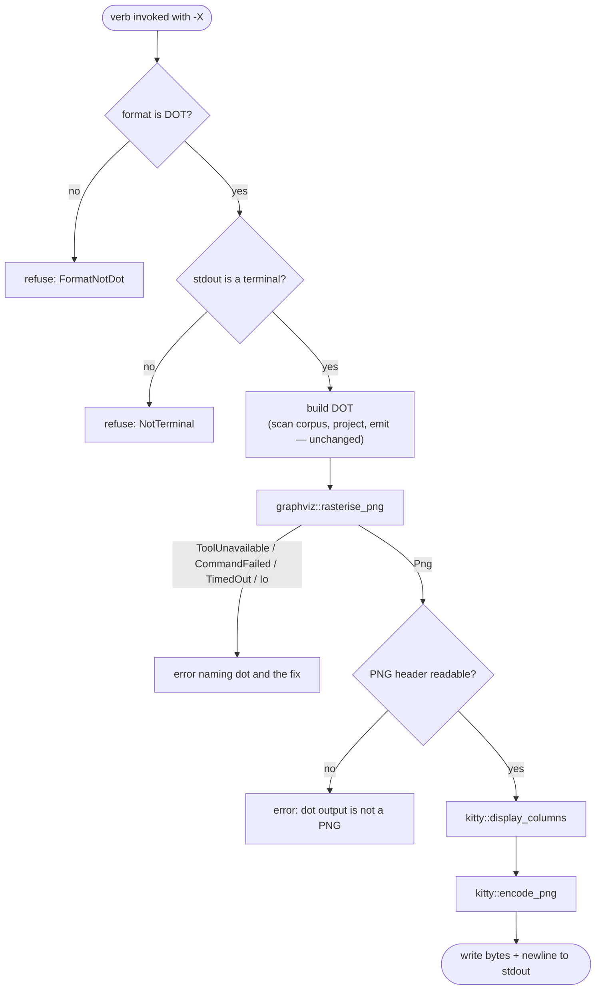

<!-- doctrine:section sec-1 -->
## What changes and where the boundary sits

**Today** a user who wants to *see* a graph runs a three-stage pipe through two
external tools:

```
doctrine graph SL-243 --depth 1 | dot -Tpng | viu -
```

**After this slice** the emitting verb draws the picture itself:

```
doctrine graph SL-243 --depth 1 -X
doctrine concept-map export CM-001 -X
```

`--render` (short `-X`) asks the verb to rasterise its DOT through graphviz and
write the image inline using the kitty graphics protocol (an escape-sequence
image format that kitty and ghostty both implement). Without the flag, both
verbs behave exactly as they do today (`DEC-253`).

The flag is an explicit request, so it is also the capability assertion: there
is no terminal sniffing and no query-response handshake. When the request
cannot be honoured — stdout is not a terminal, the format is not DOT, `dot` is
missing or fails — the verb writes nothing to stdout, exits non-zero, and says
on stderr what went wrong and how to fix it (`DEC-254`).

### The boundary

SPEC-027 requires its DOT emitter, `catalog::dot::render`, to carry no
external-renderer dependency. That clause binds the pure emitter, not the
`graph` verb's command shell. The renderer therefore sits entirely outside the
emitter: the shell asks the emitter for a DOT string exactly as it does today,
then — only under `-X` — hands that string to a separate leaf component that
knows nothing about graphs, catalogs or concept maps. It consumes DOT text and
produces terminal bytes.

The diagram shows ownership: which modules are new, which change, and which
direction every dependency points under ADR-001 (leaf ← engine ← command).

```mermaid
flowchart TB
  subgraph command["command tier"]
    graph["commands::graph<br/>run_graph"]
    cm["concept_map<br/>run_export"]
    ms["map_server::shell<br/>async dot -Tsvg (unchanged flow)"]
  end
  subgraph engine["engine tier"]
    cv["coverage_verify<br/>(refactored onto subprocess)"]
    dot["catalog::dot::render<br/>SPEC-027 emitter (unchanged)"]
  end
  subgraph leaf["leaf tier"]
    ti["terminal_image<br/>guard + compose (new)"]
    gv["graphviz<br/>sync dot -Tpng spawn (new)"]
    sp["subprocess<br/>bounded sync spawn (new, extracted)"]
    kitty["kitty<br/>pure encoder + sizing (new)"]
    tty["tty<br/>+ RenderTarget (extended)"]
  end
  graph --> dot
  graph -- "-X" --> ti
  cm -- "-X" --> ti
  ti --> tty
  ti --> gv
  ti --> kitty
  gv --> sp
  cv --> sp
  ms -. "DOT_PROGRAM, DOT_TIMEOUT" .-> gv
```

The non-obvious edges:

- `catalog::dot::render` has no edge to anything new. The SPEC-027 clause stays
  literally true.
- `map_server` takes only the program name and timeout constants from
  `graphviz`. Its async spawn is not rewritten: there are knowingly two `dot`
  spawns, one async for the HTTP server and one sync for the CLI, each naming
  the other in a comment (`DEC-143`).
- `subprocess` is the bounded synchronous spawn that `coverage_verify` already
  had, moved down a tier so `graphviz` reuses it instead of copying it.
- `terminal_image` is the only module the verbs import. The encoder and the
  spawn stay unaware of each other.

### Out of reach

The web explorer's TypeScript DOT emitters, tmux passthrough, sixel or any
other image protocol, and a force mode that writes escape bytes to a
non-terminal.

<!-- doctrine:section sec-2 -->
## Modules, responsibilities and types

Five leaf units, each with one job. Four are new, one is extended. Every
impurity (the tty probe, the process spawn, the stdout write) sits in a named
thin function; everything that decides or encodes is pure and takes those
results as plain values (`DEC-255`).

| unit | tier | pure? | responsibility |
|---|---|---|---|
| `tty` (extended) | leaf | seam | probe stdout into a `RenderTarget` |
| `subprocess` (new) | leaf | seam | run a child synchronously under a timeout (see *The graphviz spawn*) |
| `graphviz` (new) | leaf | seam | run `dot -Tpng` synchronously; classify the outcome |
| `kitty` (new) | leaf | pure | PNG width, display sizing, escape-sequence encoding |
| `terminal_image` (new) | leaf | pure core + thin shell | guard a render request; compose spawn → size → encode |

### `tty` — the terminal descriptor

`stdout_terminal_width()` returns `None` both for a pipe and for a terminal
whose size could not be read. `-X` must tell those apart, so it gets its own
descriptor rather than reusing that `Option`.

```rust
pub(crate) enum RenderTarget {
  NotTerminal,
  Terminal(TerminalGeometry),
}

pub(crate) struct TerminalGeometry {
  /// Width in cells; `None` when the ioctl fails or reports 0.
  pub(crate) columns: Option<u16>,
  /// Width in pixels; `None` when the terminal does not fill it (reports 0).
  pub(crate) pixel_width: Option<u16>,
}

/// Thin shell: isatty + `crossterm::terminal::window_size()`.
pub(crate) fn stdout_render_target() -> RenderTarget;

/// Pure decision, both impurities injected. `window` is `(columns, pixel_width)`.
fn render_target(is_tty: bool, window: Option<(u16, u16)>) -> RenderTarget;
```

`window_size()` is the same ioctl `size()` already performs, so the probe adds
no system call. The existing width and colour functions are untouched.

### `graphviz` — the spawn

```rust
/// The graphviz layout program. Single source for both `dot` spawns (DEC-143).
pub(crate) const DOT_PROGRAM: &str = "dot";
/// Wall-clock bound on one `dot` run. Also adopted by `map_server::shell`.
pub(crate) const DOT_TIMEOUT: Duration = Duration::from_secs(10);

pub(crate) enum RasterOutcome {
  Png(Vec<u8>),
  /// The program could not be found (`ErrorKind::NotFound` at spawn).
  ToolUnavailable,
  /// The program ran and exited non-zero; `stderr` is graphviz's own.
  CommandFailed { status: Option<i32>, stderr: String },
  /// The run exceeded the timeout and was killed.
  TimedOut,
  /// Any other I/O failure spawning or talking to the process.
  Io(std::io::Error),
}

/// Program and timeout are parameters so tests can substitute them.
pub(crate) fn rasterise_png(dot: &[u8], program: &OsStr, timeout: Duration) -> RasterOutcome;
```

`Io` is a fifth arm that `DEC-255` does not name. `map_server` has the same
catch-all (`MapServerError::Other`). Folding it into `ToolUnavailable` would
misreport a permission error as a missing tool, which STD-003 forbids.

### `kitty` — the pure encoder

```rust
/// Width from the PNG IHDR chunk; `None` if the bytes are not a PNG.
pub(crate) fn png_pixel_width(png: &[u8]) -> Option<u32>;

/// DEC-256: `None` = draw at native size; `Some(c)` = scale to `c` columns.
/// Takes a known width: output that is not a PNG is refused before sizing.
pub(crate) fn display_columns(png_width: u32, geometry: &TerminalGeometry) -> Option<u16>;

/// Transmit-and-display escape sequence(s) for one PNG.
pub(crate) fn encode_png(png: &[u8], columns: Option<u16>) -> Vec<u8>;
```

`kitty` imports `tty::TerminalGeometry` (a leaf-to-leaf edge) and nothing else
in the crate. The protocol literals are named constants (STD-001).

### `terminal_image` — the only surface the verbs see

```rust
/// Why a render request is refused before any work is done (DEC-254).
pub(crate) enum RenderRefusal {
  NotTerminal,
  FormatNotDot { format: String },
}

/// Pure. Format first, then terminal: a wrong format is wrong on any stdout.
pub(crate) fn guard(format: &str, is_dot: bool, target: RenderTarget)
  -> Result<TerminalGeometry, RenderRefusal>;

/// Thin shell: rasterise via `graphviz`, size and encode via `kitty`.
/// A failed raster becomes a descriptive error naming `dot` and the fix.
pub(crate) fn render_dot(dot: &str, geometry: &TerminalGeometry) -> anyhow::Result<Vec<u8>>;
```

`RenderRefusal` implements `Display` with the user-facing messages, so each
verb shell propagates it with `?` and the existing error path supplies the
non-zero exit.

### Why separate units, not one

The encoder is the part with goldens; the spawn is the part with a process; the
guard is the part with policy. A single module would mix a pure,
fixture-tested encoder with a thread-and-timeout spawn, and `map_server` would
have to import the whole renderer to reach one constant. The split costs small
files. It keeps `graphviz` reusable by any future caller that needs a `dot`
spawn without a terminal, and `subprocess` reusable by any bounded spawn.

<!-- doctrine:section sec-3 -->
## Request flow and refusal paths

A render request is checked before any work, then run as one straight pipeline.
Every failure leaves stdout empty and exits non-zero through the verb's
ordinary `anyhow` error path (`DEC-254`).



The guards come first so that a refused request costs no corpus scan. Format
is checked before the terminal because `--format json -X` is wrong wherever
stdout points.

### The verb shell

Both shells follow the same shape. `run_graph`, abbreviated:

```rust
pub(crate) fn run_graph(/* existing args */, format: GraphFormat, render: bool) -> anyhow::Result<()> {
  let geometry = render
    .then(|| terminal_image::guard(&format.to_string(), format == GraphFormat::Dot,
                                   tty::stdout_render_target()))
    .transpose()?;
  let root = crate::root::find(path, &crate::root::default_markers())?;
  let output = build_graph_output(/* unchanged */)?;
  let mut stdout = std::io::stdout().lock();
  match geometry {
    None => writeln!(stdout, "{output}")?,
    Some(geometry) => {
      stdout.write_all(&terminal_image::render_dot(&output, &geometry)?)?;
      writeln!(stdout)?;
    }
  }
  Ok(())
}
```

`build_graph_output` is untouched, so every existing graph test keeps asserting
on the same string. The rendered bytes are assembled in full before the first
byte is written, so a late failure cannot leave half an escape sequence on the
terminal.

### Messages

Each message names what was missing and what would satisfy it (POL-002 facet
(3)). The texts are constants in `terminal_image`.

| cause | stderr (after the `Error:` prefix) |
|---|---|
| format not DOT | `--render needs --format dot, got 'json'; drop -X or the --format` |
| not a terminal | `--render needs stdout to be a terminal; drop -X to emit DOT` |
| `dot` not found | `--render needs graphviz: 'dot' was not found on PATH; install graphviz or drop -X` |
| `dot` exited non-zero | `'dot' failed (exit 1): <graphviz stderr, trimmed>` |
| `dot` timed out | `'dot' did not finish within 10s; drop -X and render the DOT yourself` |
| other I/O | `could not run 'dot': <io error>` |
| not a PNG | `'dot -Tpng' produced output that is not a PNG` |

A non-PNG payload is refused rather than forwarded because the terminal would
reject it silently. That silent failure is exactly the case the guard exists to
surface.

<!-- doctrine:section sec-4 -->
## Encoding and sizing

### The escape sequence

One PNG is sent as a *transmit-and-display* command: base64 payload, split into
chunks, each wrapped in an APC escape (`ESC _ G … ESC \`). The first chunk
carries the full control data; continuation chunks carry only the
more-follows flag.

```text
ESC_G a=T,f=100,t=d,q=2,c=80,m=1 ; <4096 base64 bytes> ESC\
ESC_G m=1,q=2                    ; <4096 base64 bytes> ESC\
ESC_G m=0,q=2                    ; <final ≤4096 bytes>  ESC\
```

| key | value | why |
|---|---|---|
| `a=T` | transmit and display | one command, no separate placement |
| `f=100` | PNG | graphviz emits PNG; no pixel decoding in doctrine |
| `t=d` | direct (in-band) | no temp files; written explicitly because the protocol docs imply but do not state it is the default |
| `q=2` | suppress all responses | the terminal would otherwise type its acknowledgement into the user's shell input |
| `c=N` | display columns | present only when sizing says scale; absent means native size |
| `m=1` / `m=0` | more follows / last | chunking |

Base64 uses the standard alphabet with padding (`base64` 0.22, already a leaf-legal
dependency). The chunk bound is 4096 bytes and every non-final chunk must be a
multiple of 4; 4096 is, so fixed-size slicing of the encoded string satisfies
both. A payload that fits one chunk is sent as a single escape with `m=0`.

The literals — `ESC_G`, `ESC\`, the keys, the chunk size — are named constants
(STD-001). `encode_png` allocates the output once, sized from the encoded
length.

### Sizing

`DEC-256` in one table. `png_width` comes from the PNG header; the other two
columns come from `TerminalGeometry`.

| terminal pixel width | terminal columns | PNG fits in pixel width? | `display_columns` | result |
|---|---|---|---|---|
| known | any | yes | `None` | native size |
| known | known | no | `Some(columns)` | scaled down to fit |
| known | unknown | no | `None` | native, terminal truncates |
| unknown | known | — | `Some(columns)` | scaled to width |
| unknown | unknown | — | `None` | native size |

The rule prefers a scaled image to a clipped one wherever it has the numbers to
scale. It is marked provisional: the first VH run is expected to tune it.

`png_pixel_width` reads the fixed layout every PNG starts with:

```text
offset  0..8    89 50 4E 47 0D 0A 1A 0A   signature
offset  8..12   chunk length
offset 12..16   "IHDR"
offset 16..20   width, big-endian u32
```

It returns `None` unless the signature and the `IHDR` tag both match and at
least 20 bytes are present.

<!-- doctrine:section sec-5 -->
## The graphviz spawn

### One bounded-subprocess helper, not a second copy

`coverage_verify::run_argv` already runs a child process synchronously under a
wall-clock bound: each output pipe drained on its own thread, a `try_wait` poll
against a deadline, kill-and-reap on expiry. `rasterise_png` needs exactly that,
plus writing DOT to the child's stdin. Writing it again would be a parallel
implementation.

So the mechanism moves down into a new leaf, `subprocess`, and both callers use
it. `coverage_verify` keeps its own classification into `RunResult`; `graphviz`
classifies into `RasterOutcome`.

```rust
// src/subprocess.rs — leaf, impure seam, std only.
pub(crate) enum Bounded {
  Completed { status: std::process::ExitStatus, stdout: Vec<u8>, stderr: Vec<u8> },
  TimedOut,
}

/// Spawn `command` with piped stdio, feed `stdin` (if any) on its own thread,
/// drain stdout and stderr on their own threads, and poll for exit until
/// `timeout`. On expiry: kill, wait, join, return `TimedOut`.
/// `Err` is a spawn or wait failure; the caller classifies it (e.g. `NotFound`).
pub(crate) fn run_bounded(command: Command, stdin: Option<Vec<u8>>, timeout: Duration)
  -> std::io::Result<Bounded>;
```

Stdin is fed on a thread, not the calling thread. A child that never reads its
input would otherwise block the write forever, and the deadline would never be
checked. A `BrokenPipe` on that write is ignored: a child that exits early, as
`dot` does on a syntax error, reports through its exit status and stderr.

`coverage_verify` keeps its 50 ms poll interval, which becomes the helper's
constant, and its mapping stays as it is: `Err` or `TimedOut` becomes
`Unobtainable`, and `Completed` becomes `Ran`. Its existing suite is the
behaviour-preservation proof and must pass unchanged.

### `rasterise_png`

```rust
pub(crate) fn rasterise_png(dot: &[u8], program: &OsStr, timeout: Duration) -> RasterOutcome {
  let mut command = Command::new(program);
  command.arg("-Tpng");
  match subprocess::run_bounded(command, Some(dot.to_vec()), timeout) {
    Err(e) if e.kind() == ErrorKind::NotFound => RasterOutcome::ToolUnavailable,
    Err(e) => RasterOutcome::Io(e),
    Ok(Bounded::TimedOut) => RasterOutcome::TimedOut,
    Ok(Bounded::Completed { status, stdout, .. }) if status.success() => RasterOutcome::Png(stdout),
    Ok(Bounded::Completed { status, stderr, .. }) => RasterOutcome::CommandFailed {
      status: status.code(),
      stderr: String::from_utf8_lossy(&stderr).into_owned(),
    },
  }
}
```

The production caller passes `DOT_PROGRAM` and `DOT_TIMEOUT`; tests substitute
both.

### The other `dot` spawn

`map_server::shell::RealDotRenderer` stays async on tokio. It is an HTTP
handler and must not block a runtime thread on a sync poll loop (`DEC-143`).
It changes in three ways only: its `"dot"` literals become
`graphviz::DOT_PROGRAM`, both in `shell.rs` and in the `dot -V` health probe in
`routes.rs`; its local `DOT_TIMEOUT` is deleted in favour of
`graphviz::DOT_TIMEOUT`; and it gains a comment pointing at
`graphviz::rasterise_png` as the sync counterpart. `rasterise_png` carries the
reverse pointer. Test assertions on the literal `"dot"` stay as they are, since
they pin observable output.

<!-- doctrine:section sec-6 -->
## CLI surface

### `doctrine graph`

One new argument on the `Graph` variant in `src/commands/cli.rs`; the dispatch
arm passes it through to `run_graph`.

```rust
/// Draw the graph inline in a kitty-protocol terminal (kitty, ghostty) via graphviz.
/// Needs `--format dot` (the default), a terminal on stdout, and `dot` on PATH.
#[arg(short = 'X', long)]
render: bool,
```

`--format` keeps its `dot` default, so `doctrine graph SL-245 -X` needs nothing
else.

### `doctrine concept-map export`

`--format` is required today. Under `-X` it becomes optional and defaults to DOT
(`DEC-258`):

```rust
Export {
  id: String,
  #[arg(long, value_enum, required_unless_present = "render")]
  format: Option<ExportFormat>,
  /// Draw the map inline in a kitty-protocol terminal (kitty, ghostty) via graphviz.
  #[arg(short = 'X', long)]
  render: bool,
  #[arg(short = 'p', long)]
  path: Option<PathBuf>,
},
```

The dispatch arm resolves the format: `format.unwrap_or(ExportFormat::Dot)`.
Clap's required-unless rule guarantees `format` is present whenever `render` is
false. `run_export` gains the same guard-then-write shape as `run_graph`, with
`ExportFormat` gaining a `Display` impl for the refusal message. An explicit
`--format mermaid -X` reaches `guard` and is refused as `FormatNotDot`.

### Unchanged

- Every invocation without `-X`, byte for byte.
- `doctrine concept-map export CM-001` with no `--format` and no `-X` still
  fails at clap with the missing-argument error.
- The read-only guard classification in `src/commands/guard.rs`: rendering
  writes nothing to disk.
- The global `--color` flag; `-X` is independent of it.

`-X` is unused as a short flag on both verbs and on the root CLI. No help golden
currently covers either verb's options.

<!-- doctrine:section sec-7 -->
## Code impact

| path | change |
|---|---|
| `src/subprocess.rs` | **new** leaf: `Bounded`, `run_bounded` — the bounded sync spawn extracted from `coverage_verify` |
| `src/graphviz.rs` | **new** leaf: `DOT_PROGRAM`, `DOT_TIMEOUT`, `RasterOutcome`, `rasterise_png` |
| `src/kitty.rs` | **new** leaf: protocol constants, `png_pixel_width`, `display_columns`, `encode_png` |
| `src/terminal_image.rs` | **new** leaf: `RenderRefusal`, `guard`, `render_dot`, message constants |
| `src/tty.rs` | add `RenderTarget`, `TerminalGeometry`, `stdout_render_target`, pure `render_target` |
| `src/main.rs` | declare the four new modules |
| `src/coverage_verify.rs` | `run_argv` delegates to `subprocess::run_bounded`; `drain` and `reap` move out; `RunResult` mapping unchanged |
| `src/commands/cli.rs` | `Graph` gains `render`; the dispatch arm passes it |
| `src/commands/graph.rs` | `run_graph` takes `render`; guard-then-write shell |
| `src/concept_map.rs` | `Export`: `format` becomes `Option`, required unless `render`; `ExportFormat: Display`; `run_export` takes `render` |
| `src/map_server/shell.rs` | `"dot"` → `graphviz::DOT_PROGRAM`; local `DOT_TIMEOUT` removed; cross-reference comment |
| `src/map_server/routes.rs` | `dot -V` probe: `"dot"` → `graphviz::DOT_PROGRAM` |
| `.doctrine/adr/001/layering.toml` | register `subprocess`, `graphviz`, `kitty`, `terminal_image` as `leaf` |
| `tests/fixtures/render/tiny.png` | **new** committed PNG fixture for the `kitty` encoder goldens (`include_bytes!`) |
| `tests/e2e_render_guard.rs` | **new** end-to-end guard tests (see Verification) |

No new crate dependency: `base64` 0.22 and `crossterm` 0.29 are already direct
dependencies, and `window_size` is available under the current feature set.

### Dependency edges added

All point downward or sideways within the leaf tier, so the ADR-001 layering
gate (`tests/architecture_layering.rs`) needs only the four table entries.

- `terminal_image` → `tty`, `graphviz`, `kitty`
- `graphviz` → `subprocess`
- `kitty` → `tty` (for `TerminalGeometry`)
- `coverage_verify` (engine) → `subprocess`
- `commands::graph`, `concept_map` (command) → `terminal_image`, `tty`
- `map_server` (command) → `graphviz`

### Governance at reconcile

- A Revision adds one sentence to SPEC-027's fifth responsibility: under
  `--render` the `graph` shell writes a terminal image in place of the DOT
  text. The fourth responsibility is untouched.
- ISS-242 is annotated that `concept-map export --render` joins the concept-map
  surface that still has no governing spec.

<!-- doctrine:section sec-8 -->
## Verification

Whether the picture is right is a human judgement, and that judgement is the
acceptance test. The automated tests exist to build the feature up in verified
steps and to stop the layers underneath the picture regressing silently. None of
them needs graphviz or a terminal (`DEC-257`).

### VH — acceptance

In ghostty, on the landed binary:

1. `doctrine graph <small focus> --depth 1 -X` — a few nodes. The image appears
   below the prompt at native size and is legible, and the prompt returns on
   the line after it.
2. `doctrine graph` with no focus, `-X` — the whole corpus, wider than the
   window. The image is scaled to the window width, not clipped.
3. `doctrine concept-map export <id> -X` — renders with no `--format`.
4. `doctrine graph <focus> -X | cat` — refused with the not-a-terminal message,
   and no escape bytes appear.

The outcome of steps 1 and 2 decides whether `DEC-256`'s sizing rule stands.

### VT — scaffold and regression guard

| area | test | asserts |
|---|---|---|
| `kitty` | single-chunk PNG encodes to one escape | exact bytes over a tiny fixture: `a=T,f=100,t=d,q=2,m=0`, the payload, the terminator |
| `kitty` | multi-chunk payload splits at 4096 | non-final chunks are exactly 4096 bytes with `m=1`; continuations carry only `m`/`q`; the last has `m=0`; concatenated payloads decode to the input |
| `kitty` | `c=` present only when sizing says so | `Some(80)` emits `c=80`; `None` emits no `c` key |
| `kitty` | PNG width is read from IHDR | fixture width; `None` for short input, bad signature, non-IHDR first chunk |
| `kitty` | sizing table | one case per row of the table in *Encoding and sizing* |
| `tty` | render target decision | not a tty → `NotTerminal`; tty with `(0, 0)` → both fields `None`; tty with `(120, 0)` → columns only; tty with `(120, 1920)` → both |
| `terminal_image` | guard order and arms | non-DOT on a non-terminal → `FormatNotDot`; DOT on a non-terminal → `NotTerminal`; DOT on a terminal → the geometry |
| `terminal_image` | refusal messages name the fix | each `Display` names the flag and the remedy |
| `graphviz` | missing program | a nonexistent program path → `ToolUnavailable` |
| `graphviz` | non-zero exit carries stderr | a program that writes stderr and exits 1 → `CommandFailed` with that stderr |
| `graphviz` | timeout kills the child | `sleep` under a 100 ms timeout → `TimedOut`, returning well before the sleep would end |
| `subprocess` | stdin is delivered | `cat` round-trips the fed bytes to stdout |
| `subprocess` | a child that ignores stdin still times out | a large stdin to `sleep` under a short timeout → `TimedOut`, not a hang |
| e2e | `graph -X` off a terminal | exit non-zero, stdout empty, stderr has the not-a-terminal message |
| e2e | `graph --format json -X` | exit non-zero, stdout empty, stderr has the format message |
| e2e | `concept-map export --format mermaid -X` | same, via the concept-map shell |
| e2e | `concept-map export` with neither flag | clap missing-argument error, unchanged |

Under `cargo test` stdout is a pipe, so the e2e rows exercise the real
`stdout_render_target` probe. They never reach the spawn.

### Behaviour preservation

- The `coverage_verify` suite passes unchanged across the `subprocess`
  extraction.
- The existing `graph` and `concept-map export` tests pass unchanged: every
  path without `-X` is byte-identical.
- The `map_server` route and error tests pass unchanged.
- The ADR-001 layering gate passes with the four new leaf entries.

<!-- doctrine:section sec-9 -->
## Risks, assumptions and residuals

### Assumptions carried

- **Ghostty implements transmit-and-display for PNG.** Not probed; opt-in makes
  it the caller's assertion. The first VH step verifies it.
- **`t=d` is accepted when stated explicitly.** It is the implied default; the
  design sends it rather than relying on the omission.
- **`q=2` suppresses every response.** If a terminal replies anyway, the reply
  lands in the shell's input line. VH step 1 would show it.
- **`dot -Tpng` output is not byte-stable across graphviz versions.** It is the
  reason no golden contains real rasteriser output. Cheap to check if a golden is
  ever proposed.

### Risks

- **The sizing rule is untested in a real terminal** (`DEC-256`, provisional).
  One concrete way it could be wrong: on a HiDPI display the terminal reports
  device pixels while graphviz renders at 96 dpi, so a "native size" image
  could look half-size. The fix would be a dpi argument to `dot` or a scale
  factor in `display_columns`, both local to `graphviz` and `kitty`.
- **The `subprocess` extraction touches `coverage_verify`.** Mitigated by moving
  the mechanism rather than rewriting it, and by the unchanged coverage suite.
- **Very large graphs.** The whole-corpus PNG may be several megabytes, sent
  in-band as base64. It is bounded by `DOT_TIMEOUT` on the graphviz side, but not
  on the terminal side. Acceptable for an explicit opt-in; observed at VH step 2.

### Residuals, named rather than omitted

- **Two `dot` spawns** — async in `map_server`, sync in `graphviz` — sharing
  only constants, each naming the other (`DEC-143`).
- **tmux and other multiplexers** swallow or need wrapping for the escape
  sequence. Under tmux, `-X` succeeds and nothing appears.
- **The TypeScript DOT emitters** in `web/map/src/dot.ts` do not use this seam.
- **IMP-385's anchor report** will wire `-X` itself when it lands. The flag
  lives on each verb, not in a shared parser.

