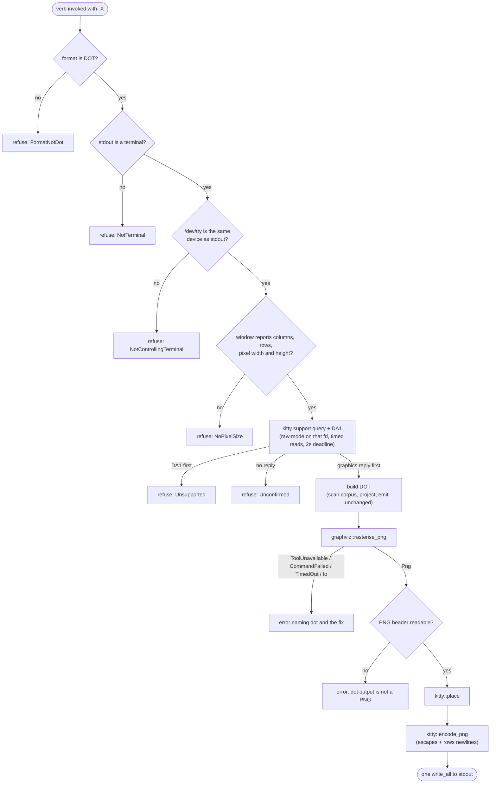

<!-- doctrine:section sec-1 -->
## What changes and where the boundary sits

> **Reconciled 2026-09-17 (SL-245, `RV-369`).** This design was locked before the
> 2026-09-15 scope cut and implemented after it. Two classes of correction apply,
> and the second is deliberately *not* marked up in place.
>
> **1. Corrected below**, each attributed to the `RV-369` finding that drove it:
> sec-2 (`endpoint` compares session ids, not `st_rdev` — `F-1`), sec-3 (two
> missing message rows — `F-3`, `F-6`), sec-4 (the image byte budget and the cost
> side of `q=2` — `F-6`, `F-7`), sec-5 (`Png` carries `dot`'s notes — `F-8`),
> sec-8 (the pty-harness rationale, disproven — `F-2`), sec-9 (the very-large-graph
> risk and the placement rule — `F-6`, `F-7`).
>
> **2. Designed here, never built.** The scope cut removed these before
> implementation. They are left described below as design intent; read them as
> such, not as shipped behaviour.
>
> | described here | what shipped | tracked by |
> |---|---|---|
> | `src/subprocess.rs`, `run_bounded`, the `coverage_verify` extraction (sec-5, sec-6, sec-8, sec-9) | not built; `graphviz` spawns `dot` directly and `coverage_verify` is untouched | `IMP-452` |
> | `graphviz::RENDER_TIMEOUT` and `RasterOutcome::TimedOut` (sec-3, sec-5, sec-8, sec-9) | no deadline at all; `-X` is interactive and Ctrl-C is the user's timeout | `IMP-452` |
> | `concept-map export --render` (sec-6, sec-8) | not wired; `doctrine graph -X` only | `IMP-451` |
> | macOS acceptance (sec-8 VH step 6, sec-9) | not run; `VMIN`/`VTIME` on macOS `/dev/tty` remains unverified | `CHR-072` |

**Today** a user who wants to *see* a graph runs a three-stage pipe through two
external tools:

```
doctrine graph SL-243 --depth 1 | dot -Tpng | viu -
```

**After this slice** the emitting verb draws the picture itself:

```
doctrine graph SL-243 --depth 1 -X
doctrine concept-map export CM-001 -X
```

`--render` (short `-X`) asks the verb to rasterise its DOT through graphviz and
write the image inline using the kitty graphics protocol (an escape-sequence
image format that kitty and ghostty both implement). Without the flag, both
verbs behave exactly as they do today (`DEC-253`).

The flag opts in; it does not assert the terminal can draw. Before any work,
the verb asks the terminal directly, using the kitty protocol's own support
query (`DEC-259`), because a terminal protocol is a host capability that
POL-002 facet (3) requires to fail descriptively when absent. When the request
cannot be honoured, the verb exits non-zero and says on stderr what was missing
and how to fix it (`DEC-254`). The cases are: the format is not DOT, stdout is
not a terminal, the terminal does not speak the protocol (tmux included), the
terminal does not report its pixel size, or `dot` is missing or fails. Every
failure before the image is written leaves stdout empty.

### The boundary

SPEC-027 requires its DOT emitter, `catalog::dot::render`, to carry no
external-renderer dependency. That clause binds the pure emitter, not the
`graph` verb's command shell. The renderer therefore sits entirely outside the
emitter: the shell asks the emitter for a DOT string exactly as it does today,
then — only under `-X` — hands that string to a separate leaf component that
knows nothing about graphs, catalogs or concept maps. It consumes DOT text and
produces terminal bytes.

The diagram shows ownership: which modules are new, which change, and which
direction every dependency points under ADR-001 (leaf ← engine ← command).

```mermaid
flowchart TB
  subgraph command["command tier"]
    graph["commands::graph<br/>run_graph"]
    cm["concept_map<br/>run_export"]
    ms["map_server::shell<br/>async dot -Tsvg (unchanged flow)"]
  end
  subgraph engine["engine tier"]
    cv["coverage_verify<br/>(refactored onto subprocess)"]
    dot["catalog::dot::render<br/>SPEC-027 emitter (unchanged)"]
  end
  subgraph leaf["leaf tier"]
    ti["terminal_image<br/>checks + compose (new)"]
    gv["graphviz<br/>sync dot -Tpng spawn (new)"]
    sp["subprocess<br/>bounded sync spawn (new, extracted)"]
    kitty["kitty<br/>pure encoder + sizing (new)"]
    tty["tty<br/>+ RenderTarget, raw query (extended)"]
  end
  graph --> dot
  graph -- "-X" --> ti
  cm -- "-X" --> ti
  ti --> tty
  ti --> gv
  ti --> kitty
  gv --> sp
  cv --> sp
  ms -. "DOT_PROGRAM" .-> gv
```

The non-obvious edges:

- `catalog::dot::render` has no edge to anything new. The SPEC-027 clause stays
  literally true.
- `map_server` takes only the program name from `graphviz`. Its async render
  spawn and its `dot -V` health probe are not rewritten. There are knowingly
  two render spawns, one async for the HTTP server and one sync for the CLI,
  each naming the other in a comment (`DEC-143`).
- `subprocess` is the bounded synchronous spawn that `coverage_verify` already
  had, moved down a tier so `graphviz` reuses it instead of copying it.
- `terminal_image` is the only module the verbs import. The encoder and the
  spawn stay unaware of each other.

### Out of reach

The web explorer's TypeScript DOT emitters, sixel or any other image protocol,
and a force mode that writes escape bytes to a non-terminal. Multiplexer
passthrough is out of reach too, but no longer silent: the support probe
refuses under tmux.

<!-- doctrine:section sec-2 -->
## Modules, responsibilities and types

There are five leaf units, each with one job: four new and one extended. Every
impurity sits in a named thin function: the tty probes, the process spawn and
the stdout write. Everything that decides, parses or encodes is pure and takes
the probes' results as plain values (`DEC-255`).

| unit | tier | pure? | responsibility |
|---|---|---|---|
| `tty` (extended) | leaf | seam + pure decisions | verify stdout is the controlling terminal; read its geometry; run a raw-mode query/reply exchange on it |
| `subprocess` (new) | leaf | seam | run a child synchronously, bounded for the direct child (see *The graphviz spawn*) |
| `graphviz` (new) | leaf | seam + pure classifier | run `dot -Tpng`; classify the outcome |
| `kitty` (new) | leaf | pure | protocol bytes: support query and reply classifier, PNG size, placement, encoding |
| `terminal_image` (new) | leaf | pure checks + thin shell | sequence the checks; compose spawn → place → encode |

### `tty` — one terminal endpoint

The terminal that doctrine sizes, puts in raw mode, queries, and writes to must
be one terminal. Otherwise a positive probe of one terminal could authorise
output to another. `tty` therefore opens the controlling terminal (`/dev/tty`)
once, checks that it is the same terminal stdout writes to, and does everything
else on that one file descriptor.

**The identity is the POSIX session id, not the device id** (`RV-369` `F-1`,
reconciled 2026-09-17). This design originally compared `st_rdev` between the two
descriptors. That reads as the obvious identity and is not one: `/dev/tty` is a
devnode in its own right, so a descriptor opened from it `fstat`s as the
`/dev/tty` devnode — `(5,0)` — and never as the pts it redirects to, which
carries `(136,N)`. The two values can never be equal, so `Endpoint::Same` was
unreachable and every terminal on earth was refused as the wrong one. A session
id *is* an identity, and a total one: a controlling terminal belongs to exactly
one session and a session has at most one controlling terminal, so two
descriptors reporting the same session are the same terminal. `tcgetsid` answers
`ENOTTY` for a descriptor that is no session's controlling terminal, which is an
answer the decision needs rather than a failure to report (STD-003), and maps to
`None`.

`stdout_terminal_width()` cannot serve here: it returns `None` both for a pipe
and for an unreadable size, and it probes through crossterm, which picks its own
descriptor.

```rust
pub(crate) enum RenderTarget {
  NotTerminal,
  /// stdout is a terminal, but not the controlling one, or there is none.
  NotControllingTerminal,
  Terminal(RenderTerminal),
}

/// The controlling terminal, verified to be stdout's device.
pub(crate) struct RenderTerminal {
  tty: std::fs::File,
  pub(crate) window: WindowGeometry,
}

/// `tcgetwinsize` as reported; 0 means the terminal did not report the field.
pub(crate) struct WindowGeometry {
  pub(crate) columns: u16,
  pub(crate) rows: u16,
  pub(crate) pixel_width: u16,
  pub(crate) pixel_height: u16,
}

/// Thin shell: isatty(stdout); open `/dev/tty` read-write; `tcgetsid` both;
/// `tcgetwinsize` on the tty. Failure to open `/dev/tty` means no controlling terminal.
pub(crate) fn open_render_terminal() -> std::io::Result<RenderTarget>;

/// Pure decision over the injected probe results (POSIX session ids).
fn endpoint(stdout_is_tty: bool, stdout_session: Option<i32>, tty_session: Option<i32>) -> Endpoint;
enum Endpoint { NotTerminal, NotControlling, Same }

impl RenderTerminal {
  /// Raw mode with timed reads on this fd, write `request`, read until
  /// `complete(&bytes_so_far)` or `timeout`, then restore. `Ok(None)` = deadline.
  pub(crate) fn query(
    &self,
    request: &[u8],
    complete: impl Fn(&[u8]) -> bool,
    timeout: Duration,
  ) -> Result<Option<Vec<u8>>, QueryError>;
}

pub(crate) enum QueryError {
  /// Entering raw mode, writing, or reading failed; the terminal was restored.
  Io(std::io::Error),
  /// Restoring the saved terminal settings failed. Takes precedence over
  /// whatever the exchange produced, because the user's shell is affected.
  Restore(std::io::Error),
}

/// Enter, run, always exit. An exit failure beats the body's result; an enter
/// failure skips both. The closures are injected so every path is unit-tested.
fn bracket<S, R>(
  enter: impl FnOnce() -> std::io::Result<S>,
  body: impl FnOnce(&S) -> std::io::Result<R>,
  exit: impl FnOnce(S) -> std::io::Result<()>,
) -> Result<R, QueryError>;
```

`query` is `bracket` with real closures. `enter` does `tcgetattr`, then
`tcsetattr` with the settings made raw and set for timed reads: `VMIN=0`,
`VTIME=1`. A `read` then returns as soon as a byte arrives, or with zero bytes
after 100 ms. `body` writes the request, then reads in a loop, appending, until
`complete` holds or the deadline has passed, so the deadline is honoured to
within one 100 ms read. `exit` does `tcsetattr` with the saved settings. The
tty is opened blocking, because POSIX lets `O_NONBLOCK` override `VTIME`.

Restoration is explicit and its error is checked on every return path. The
guarantee does not rest on a destructor, because a destructor cannot report a
failed restore. A drop guard remains as a best-effort fallback while unwinding
from a panic, and is disarmed once the explicit restore has run.

The timed read bounds each wait, so no thread is needed, nothing outlives the
query, and nothing can swallow keystrokes afterwards. The wait is a termios
setting rather than a readiness call. `poll` does not work on `/dev/tty` on
macOS, one of doctrine's shipped platforms. `select` does work there, but it is
`unsafe` in rustix, and the workspace denies `unsafe` outside two named sites.
Timed reads are POSIX terminal behaviour, the same on Linux and macOS.

All of this uses `rustix`, already a direct dependency (`fs`), with its
`termios` feature added. crossterm already compiles rustix with `termios`, so
this adds no crate. `tty` knows nothing about kitty: the request
bytes and the completion predicate come from the caller.

### `graphviz` — the spawn

```rust
/// The graphviz layout program. Single source for all three `dot` invocations (DEC-143).
pub(crate) const DOT_PROGRAM: &str = "dot";
/// Whole-operation deadline for one CLI render: spawn, feed, wait.
pub(crate) const RENDER_TIMEOUT: Duration = Duration::from_secs(10);

pub(crate) enum RasterOutcome {
  Png(Vec<u8>),
  /// The program could not be found (`ErrorKind::NotFound` at spawn).
  ToolUnavailable,
  /// The program ran and exited non-zero; `stderr` is graphviz's own.
  CommandFailed { status: Option<i32>, stderr: String },
  /// The run exceeded the deadline and was killed.
  TimedOut,
  /// Any other I/O failure spawning or waiting on the process.
  Io(std::io::Error),
}

/// Thin shell: spawn `program -Tpng` under `timeout`, then `classify`.
pub(crate) fn rasterise_png(dot: &[u8], program: &OsStr, timeout: Duration) -> RasterOutcome;

/// Pure: map a bounded run's result onto the outcome taxonomy.
fn classify(run: std::io::Result<subprocess::Bounded>) -> RasterOutcome;
```

`Io` is a fifth arm that `DEC-255` does not name. `map_server` has the same
catch-all (`MapServerError::Other`). Folding it into `ToolUnavailable` would
misreport a permission error as a missing tool, which STD-003 forbids.

### `kitty` — the protocol, pure

```rust
/// The documented support query (a=q, id 31, a 1×1 RGB payload) followed by DA1.
pub(crate) const SUPPORT_QUERY: &[u8];

pub(crate) enum SupportReply { Incomplete, Supported, Unsupported }

/// Complete frames in arrival order: the first of {graphics reply for id 31,
/// DA1 reply} decides. Graphics first → Supported; DA1 first → Unsupported;
/// neither complete yet → Incomplete.
pub(crate) fn classify_support_reply(bytes: &[u8]) -> SupportReply;

pub(crate) struct PngSize { pub(crate) width: u32, pub(crate) height: u32 }

/// From the PNG IHDR chunk; `None` if the bytes are not a PNG.
pub(crate) fn png_size(png: &[u8]) -> Option<PngSize>;

/// Cell size in pixels; `None` if any window field is 0 (DEC-256 refuses).
pub(crate) struct CellGeometry { pub(crate) columns: u16, pub(crate) cell_width: u16, pub(crate) cell_height: u16 }
pub(crate) fn cell_geometry(window: &WindowGeometry) -> Option<CellGeometry>;

/// DEC-256: the cell rectangle the image occupies.
pub(crate) struct Placement { pub(crate) columns: u16, pub(crate) rows: u16 }
pub(crate) fn place(png: PngSize, cell: &CellGeometry) -> Placement;

/// The escape sequence(s) for one PNG at `placement`, followed by
/// `placement.rows` newlines so the cursor lands on the line below the image.
pub(crate) fn encode_png(png: &[u8], placement: Placement) -> Vec<u8>;
```

`kitty` imports `tty::WindowGeometry`, a leaf-to-leaf edge, and nothing else in
the crate. Every protocol literal is a named constant (STD-001).

### `terminal_image` — the only surface the verbs see

```rust
/// Why a render request is refused before anything is written (DEC-254, DEC-259, DEC-256).
pub(crate) enum RenderRefusal {
  FormatNotDot { format: String },
  NotTerminal,
  NotControllingTerminal,
  Unsupported,
  Unconfirmed,
  NoPixelSize,
}

/// Thin shell. Runs the checks cheapest-first and stops at the first refusal:
/// format → stdout is the controlling terminal → pixel size → support probe.
/// Returns the cell geometry.
pub(crate) fn prepare(format: &str, is_dot: bool) -> anyhow::Result<CellGeometry>;

/// Thin shell: rasterise via `graphviz`, then place and encode via `kitty`.
pub(crate) fn render_dot(dot: &str, cell: &CellGeometry) -> anyhow::Result<Vec<u8>>;
```

The checks inside `prepare` are small pure functions over the probe results,
tested without a terminal. `RenderRefusal` implements `Display` with the
user-facing messages, and each verb shell propagates it with `?`.

### Why separate units, not one

The encoder is the part with byte-exact tests; the spawn is the part with a
process; the tty query is the part with raw mode; the guard is the part with
policy. One module would mix all four, and `map_server` would import the whole
renderer to reach one constant. Splitting keeps each concern alone in a small
file. `graphviz` stays reusable by any caller that needs `dot` without a
terminal, and `subprocess` by any bounded spawn.

<!-- doctrine:section sec-3 -->
## Request flow and refusal paths

A render request passes five checks before any work, cheapest first, then runs
as one pipeline. Every refusal and every rasterise or encode failure happens
before the first byte reaches stdout, so all of them leave stdout empty and exit
non-zero through the verb's ordinary `anyhow` error path (`DEC-254`).



The checks come before the corpus scan, so a refused request costs nothing.
Format comes first because `--format json -X` is wrong wherever stdout points.
The probe comes last because it is the only check that talks to the terminal.

### The verb shell

Both shells follow the same shape. `run_graph`, abbreviated:

```rust
pub(crate) fn run_graph(/* existing args */, format: GraphFormat, render: bool) -> anyhow::Result<()> {
  let cell = render
    .then(|| terminal_image::prepare(&format.to_string(), format == GraphFormat::Dot))
    .transpose()?;
  let root = crate::root::find(path, &crate::root::default_markers())?;
  let output = build_graph_output(/* unchanged */)?;
  let mut stdout = std::io::stdout().lock();
  match cell {
    None => writeln!(stdout, "{output}")?,
    Some(cell) => stdout.write_all(&terminal_image::render_dot(&output, &cell)?)?,
  }
  Ok(())
}
```

`build_graph_output` is untouched, so every existing graph test keeps asserting
on the same string. The image, its escapes and its trailing newlines are
assembled into one buffer and written with a single `write_all`. That prevents
a *doctrine* failure from leaving half an escape on the terminal. It cannot
make the terminal write itself atomic: if stdout fails mid-write, part of the
transmission may already be on screen, and the write error is reported as
usual.

### Messages

Each message names what was missing and what would satisfy it (POL-002 facet
(3)). The texts are constants in `terminal_image`.

| cause | stderr (after the `Error:` prefix) |
|---|---|
| format not DOT | `--render needs --format dot, got 'json'; drop -X or the --format` |
| not a terminal | `--render needs stdout to be a terminal; drop -X to emit DOT` |
| not the controlling terminal | `--render needs stdout to be the terminal you are running in; it is another terminal, or there is none; drop -X to emit DOT` |
| the terminal could not be inspected | `--render could not inspect the terminal: <io error>; drop -X to emit DOT` |
| no pixel size | `--render needs the terminal to report its size in pixels, and it did not; drop -X to emit DOT` |
| unsupported | `--render needs a terminal that supports the kitty graphics protocol (kitty, ghostty); this one does not, and under tmux or screen it never will; drop -X to emit DOT` |
| unconfirmed | `--render could not confirm kitty graphics support: the terminal did not answer within 2s; drop -X to emit DOT` |
| tty query I/O | `--render could not query the terminal: <io error>` |
| terminal restore failed | `--render could not restore the terminal's settings: <io error>; run 'reset'` |
| `dot` not found | `--render needs graphviz: 'dot' was not found on PATH; install graphviz or drop -X` |
| `dot` exited non-zero | `'dot' failed (exit 1): <graphviz stderr, trimmed>` |
| `dot` timed out | `'dot' did not finish within 10s; drop -X and render the DOT yourself` |
| other spawn I/O | `could not run 'dot': <io error>` |
| not a PNG | `'dot -Tpng' produced output that is not a PNG` |
| image over the byte budget | `--render needs a smaller graph: 'dot' produced a 62 MiB image and the terminal is sent at most 8 MiB; narrow it with a focus id or --depth, or drop -X to emit DOT` |

A non-PNG payload is refused rather than forwarded because the terminal would
drop it silently, which is the exact failure the checks exist to surface.

The last two rows arrived during implementation and are recorded here at
reconcile (`RV-369` `F-3`, `F-6`). *The terminal could not be inspected* is
deliberately not folded into *tty query I/O*: that row means the terminal was
opened and the exchange failed, this one means the terminal could not be
interrogated at all, and POL-002 facet (3) requires the message to name what was
actually missing. *Image over the byte budget* is the stop `F-6` added; see
sec-4, *The byte budget*.

<!-- doctrine:section sec-4 -->
## The protocol: support query, placement, encoding

### Support query

`DEC-259` uses the probe the kitty protocol documents
(<https://sw.kovidgoyal.net/kitty/graphics-protocol/>, *Querying support*): a
graphics query, immediately followed by a request for the primary device
attributes (DA1).

```text
ESC_G i=31,s=1,v=1,a=q,t=d,f=24 ; AAAA ESC\      graphics query: 1×1 RGB, never displayed
ESC[c                                            DA1 request
```

Every VT-compatible terminal answers DA1 (`ESC[?…c`). A terminal that speaks
the graphics protocol also answers the query (`ESC_G i=31;… ESC\`), and does so
before DA1 because the requests are answered in order. `classify_support_reply`
walks the accumulated bytes frame by frame, in arrival order, and the first
complete frame of interest decides:

| first complete frame of interest | result |
|---|---|
| a graphics reply carrying `i=31`, whatever its status text | `Supported`: any reply proves the protocol is spoken |
| a DA1 reply | `Unsupported`, even if a graphics reply follows it |
| none yet (empty, partial frame, or only unrelated bytes) | `Incomplete`; keep reading |

Graphics replies for other ids and any other bytes are skipped.

`RenderTerminal::query` is called with `complete = |b| classify_support_reply(b) != Incomplete`
and a 2 s deadline. tmux answers DA1 itself and does not pass the query
through, so under tmux the probe returns `Unsupported`.

### Placement

`DEC-256`. The kitty docs say that after a placement the cursor moves right by
the placement's columns and down by its rows. If that leaves the screen, the
cursor position is undefined. Doctrine therefore fixes the rectangle itself,
tells the terminal not to move the cursor (`C=1`), and moves it with newlines.

Inputs: the PNG's `width × height` from its header, and the cell size
`cell_width = pixel_width / columns`, `cell_height = pixel_height / rows` from
the window geometry (integer division; `cell_geometry` returns `None` if any
field or quotient is 0).

```text
max_columns    = columns - 1                          never reach the right edge
native_columns = ceil(width / cell_width)
if native_columns <= max_columns:
  placement = (native_columns, ceil(height / cell_height))
else:
  scaled_height = height * (max_columns * cell_width) / width
  placement     = (max_columns, ceil(scaled_height / cell_height))
rows = max(rows, 1)                                   saturating at u16::MAX
```

All arithmetic is `u64` and the division rounds up. Rounding to whole cells
distorts the aspect ratio by less than one cell on each axis. A tall image is
not bounded vertically: the newlines scroll the screen like any other output,
and the image scrolls with it.

| case | window (cols × rows, px) | PNG | placement |
|---|---|---|---|
| small graph | 200 × 50, 2000 × 1000 (cell 10×20) | 300 × 200 | 30 × 10 (native) |
| exactly fits | 200 × 50, 2000 × 1000 | 1990 × 400 | 199 × 20 (native) |
| wide graph | 200 × 50, 2000 × 1000 | 4000 × 1000 | 199 × 25 (scaled) |
| tall graph | 80 × 24, 800 × 480 (cell 10×20) | 400 × 3000 | 40 × 150 (native, scrolls) |
| one-column terminal | 1 × 24, 10 × 480 | 100 × 100 | 1 × 1 (clamped) |

For `columns == 1`, `max_columns` is floored at 1.

#### The byte budget

Reconciled 2026-09-17 (`RV-369` `F-6`). **A cell bound is not a resource bound.**
The rule above bounds columns, deliberately does not bound height, and bounds
nothing in bytes — and the case that convicted it placed entirely legally. The
whole corpus rasterises to a 62 MiB PNG which lands in an unremarkable 199 × 237
cell rectangle; ghostty declines it, and because `q=2` makes that refusal
unreportable (see *Encoding*) the user is left looking at the 237 newlines the
encoder appends. An image the terminal would reject therefore has to be refused
*before* it is sent, as a stop like every other.

`terminal_image` carries that stop: `MAX_IMAGE_BYTES = 8 MiB`, checked on the
rasterised PNG between the spawn and the encode. The figure is **calibrated to
this corpus, not derived from any published limit** — measured here, `--depth 1`
rasterises to 143 KB and draws, `--depth 2` to 559 KB, `--depth 3` to 9.6 MiB
and 18109 px of illegible scroll, and the whole corpus to 62 MiB and nothing at
all. 8 MiB sits above every graph worth looking at and below every graph that is
a smudge at any placement. A miscalibration is recoverable: being refused is
cheap, and the message names the two flags that narrow the graph.

Scaling instead of refusing was considered and rejected. `dot -Gsize` was
measured at 834 × 1987 px, 1.8 MiB, and still 25 s: it converts a blank screen
into an illegible grey one. The bound is on PNG bytes rather than DOT bytes for
the same reason — a pre-spawn bound would refuse in 2 s instead of 36, but DOT
size is a proxy that could refuse a graph which renders perfectly well.

### Encoding

One PNG is sent as a transmit-and-display command: base64 payload, split into
chunks, each wrapped in an APC escape (`ESC _ G … ESC \`). The first chunk
carries the full control data; continuation chunks carry only `m` and `q`.

```text
ESC_G a=T,f=100,t=d,q=2,C=1,c=199,r=25,m=1 ; <4096 base64 bytes> ESC\
ESC_G m=1,q=2                              ; <4096 base64 bytes> ESC\
ESC_G m=0,q=2                              ; <final ≤4096 bytes>  ESC\
\n × 25
```

| key | value | why |
|---|---|---|
| `a=T` | transmit and display | one command, no separate placement |
| `f=100` | PNG | graphviz emits PNG; doctrine decodes no pixels |
| `t=d` | direct (in-band) | the documented default, written out for clarity |
| `q=2` | quiet | no image id is sent, so no reply is expected; `q=2` also suppresses failure replies that would otherwise be typed into the shell's input — and, in the same breath, makes a terminal-side rejection undetectable (`RV-369` `F-7`) |
| `C=1` | do not move the cursor | doctrine moves it with `r` newlines |
| `c`, `r` | placement columns, rows | always both, from `place` |
| `m=1` / `m=0` | more follows / last | chunking |

**The `q=2` tradeoff, recorded both ways** (`RV-369` `F-7`, reconciled
2026-09-17). The benefit is that no reply text lands in the shell's input line.
The cost is that a terminal which refuses the image — for any reason — refuses
silently, so by construction a dropped image is indistinguishable from a drawn
one. The case that actually bit, an over-budget image, is now refused before it
is sent (*The byte budget*); a rejection for any other reason remains a silent
no-op, and is carried as a residual in sec-9. Dropping `q=2` would trade that
exposure for the failure `q=2` exists to prevent, so it stays.

Base64 uses the standard alphabet with padding (`base64` 0.22, already a
leaf-legal dependency). The chunk bound is 4096 bytes, and every non-final
chunk must be a multiple of 4. 4096 is a multiple of 4, so fixed-size slicing
of the encoded string satisfies both rules. A payload that fits one chunk is
sent as a single escape with `m=0`. `encode_png` allocates its output once,
sized from the encoded length plus the newlines.

`png_size` reads the fixed layout every PNG starts with, and returns `None`
unless the signature and the `IHDR` tag match and at least 24 bytes are
present:

```text
offset  0..8    89 50 4E 47 0D 0A 1A 0A   signature
offset  8..12   chunk length
offset 12..16   "IHDR"
offset 16..20   width, big-endian u32
offset 20..24   height, big-endian u32
```

<!-- doctrine:section sec-5 -->
## The graphviz spawn

### One bounded-subprocess helper, not a second copy

`coverage_verify::run_argv` already runs a child process synchronously under a
wall-clock bound: each output pipe drained on its own thread, a `try_wait` poll
against a deadline, kill-and-reap on expiry. `rasterise_png` needs exactly that,
plus writing DOT to the child's stdin. Writing it again would be a parallel
implementation.

So the mechanism moves down into a new leaf, `subprocess`, and both callers use
it. `coverage_verify` keeps its own classification into `RunResult`; `graphviz`
classifies into `RasterOutcome`.

```rust
// src/subprocess.rs — leaf, impure seam, std only.
pub(crate) enum Bounded {
  Completed { status: std::process::ExitStatus, stdout: Vec<u8>, stderr: Vec<u8> },
  TimedOut,
}

/// Spawn `command` with piped stdio, feed `stdin` (if any) on a detached
/// thread, drain stdout and stderr on their own threads, and poll for exit
/// until `timeout`. On expiry: kill, then poll `try_wait` for up to
/// `REAP_GRACE`. If the child is reaped, join the drains; if not, leave it
/// and its drain threads behind. Either way, return `TimedOut`.
/// `Err` is a spawn or wait failure; the caller classifies it (e.g. `NotFound`).
///
/// The bound covers the direct child. A descendant that inherits and holds the
/// output pipes keeps the drain joins open past the deadline (ISS-455).
pub(crate) fn run_bounded(command: Command, stdin: Option<Vec<u8>>, timeout: Duration)
  -> std::io::Result<Bounded>;
```

The stdin writer runs on its own thread for two reasons:

- A child that never reads its input would otherwise block the write forever,
  and the deadline would never be checked.
- It is not joined. When the child exits or is killed, the pipe's read end
  closes, the write fails with `BrokenPipe`, and the thread ends by itself.
  Nothing waits on it.

A child that exits early, as `dot` does on a syntax error, reports through its
exit status and stderr; the `BrokenPipe` is not an error.

Cleanup after a timeout is bounded too. The incumbent code ignores a failed
`kill` and then calls a blocking `wait`. A child that survives `SIGKILL`, for
example one stuck in uninterruptible I/O, would hold that `wait` indefinitely.
`run_bounded` instead polls `try_wait` for a short named grace period (1 s).
If the child still has not exited, it returns `TimedOut` without reaping it or
joining its drains. The unreaped child is collected when the process exits.
The whole call is therefore bounded by `timeout + REAP_GRACE` for the direct
child on every path.

The descendant limitation is incumbent. `coverage_verify` has it today, and
this extraction preserves rather than introduces it. `dot` does not fork, so
the render path is not exposed. ISS-455 tracks process-group ownership for the
general case.

`coverage_verify` keeps its 50 ms poll interval, which becomes the helper's
named constant. Its timeout path gains the bounded reap; in the ordinary case,
where the killed child exits at once, the result is identical. Its mapping is
unchanged: `Err` or `TimedOut` becomes
`Unobtainable`, and `Completed` becomes `Ran`. It keeps setting `current_dir`
on the `Command` before handing it over. Its existing suite is the
behaviour-preservation proof and must pass unchanged.

### `rasterise_png`

The spawn and the classification are separate functions, so the outcome
mapping is tested with synthetic results rather than with real misbehaving
programs.

```rust
pub(crate) fn rasterise_png(dot: &[u8], program: &OsStr, timeout: Duration) -> RasterOutcome {
  let mut command = Command::new(program);
  command.arg("-Tpng");
  classify(subprocess::run_bounded(command, Some(dot.to_vec()), timeout))
}

fn classify(run: std::io::Result<Bounded>) -> RasterOutcome {
  match run {
    Err(e) if e.kind() == ErrorKind::NotFound => RasterOutcome::ToolUnavailable,
    Err(e) => RasterOutcome::Io(e),
    Ok(Bounded::TimedOut) => RasterOutcome::TimedOut,
    Ok(Bounded::Completed { status, stdout, stderr }) if status.success() =>
      RasterOutcome::Png { png: stdout, notes: String::from_utf8_lossy(&stderr).into_owned() },
    Ok(Bounded::Completed { status, stderr, .. }) => RasterOutcome::CommandFailed {
      status: status.code(),
      stderr: String::from_utf8_lossy(&stderr).into_owned(),
    },
  }
}
```

**`Png` carries `dot`'s stderr alongside the bytes** (`RV-369` `F-8`, reconciled
2026-09-17; the variant was originally `Png(Vec<u8>)`). A zero exit does not mean
an undegraded render: graphviz reports a forced downscale on stderr *while
succeeding* — `graph is too large for cairo-renderer bitmaps. Scaling by 0.668933
to fit` — so discarding stderr on the success path hid from the caller that the
image about to be drawn is not the image that was asked for. STD-003: a degraded
read is disclosed. The caller warns with graphviz's own text unprefixed, because
`dot` already names itself in its stderr.

The production caller passes `DOT_PROGRAM` and `RENDER_TIMEOUT`. Tests
substitute a nonexistent program to prove the real `NotFound` mapping.

### Every `dot` invocation

There are three invocations. They share the program name and nothing else
(`DEC-143`).

| site | invocation | execution | timeout, owned where it is enforced |
|---|---|---|---|
| `graphviz::rasterise_png` (new) | `dot -Tpng` | sync, `subprocess` | `graphviz::RENDER_TIMEOUT`: one deadline for the whole operation |
| `map_server::shell::RealDotRenderer` | `dot -Tsvg` | async, tokio | its existing `DOT_TIMEOUT`: applied separately to the stdin write and to the wait |
| `map_server::routes::dot_version` | `dot -V` | async, tokio | the hard-coded 2 s becomes a named `DOT_VERSION_TIMEOUT` in `routes.rs` |

`map_server` changes in these ways only:

- Every `"dot"` program and tool literal becomes `graphviz::DOT_PROGRAM`: the
  two `Command::new` calls, the `ToolUnavailable`, `CommandFailed` and
  `Timeout` fields, and the test assertions in `error.rs` on those fields.
- The 2 s probe budget gets a name.
- A comment on `RealDotRenderer` points at `graphviz::rasterise_png` as its
  sync counterpart; `rasterise_png` carries the reverse pointer.

The async renderer stays async: it runs in an HTTP handler and must not block a
runtime thread on a sync poll loop. The `"dot"` key in the `/health` JSON body
is a field name in the wire format, not the program name, so it stays a literal.

<!-- doctrine:section sec-6 -->
## CLI surface

### `doctrine graph`

One new argument on the `Graph` variant in `src/commands/cli.rs`; the dispatch
arm passes it through to `run_graph`.

```rust
/// Draw the graph inline in a kitty-protocol terminal (kitty, ghostty) via graphviz.
/// Needs `--format dot` (the default), a terminal on stdout, and `dot` on PATH.
#[arg(short = 'X', long)]
render: bool,
```

`--format` keeps its `dot` default, so `doctrine graph SL-245 -X` needs nothing
else.

### `doctrine concept-map export`

`--format` is required today. Under `-X` it becomes optional and defaults to DOT
(`DEC-258`):

```rust
Export {
  id: String,
  #[arg(long, value_enum, required_unless_present = "render")]
  format: Option<ExportFormat>,
  /// Draw the map inline in a kitty-protocol terminal (kitty, ghostty) via graphviz.
  #[arg(short = 'X', long)]
  render: bool,
  #[arg(short = 'p', long)]
  path: Option<PathBuf>,
},
```

The dispatch arm resolves the format: `format.unwrap_or(ExportFormat::Dot)`.
Clap's required-unless rule guarantees `format` is present whenever `render` is
false. `run_export` gains the same prepare-then-write shape as `run_graph`, with
`ExportFormat` gaining a `Display` impl for the refusal message. An explicit
`--format mermaid -X` reaches `terminal_image::prepare` and is refused as `FormatNotDot`.

### Unchanged

- Every invocation without `-X`, byte for byte.
- `doctrine concept-map export CM-001` with no `--format` and no `-X` still
  fails at clap with the missing-argument error.
- The read-only guard classification in `src/commands/guard.rs`: rendering
  writes nothing to disk.
- The global `--color` flag; `-X` is independent of it.

`-X` is unused as a short flag on both verbs and on the root CLI. No help golden
currently covers either verb's options.

<!-- doctrine:section sec-7 -->
## Code impact

| path | change |
|---|---|
| `src/subprocess.rs` | **new** leaf: `Bounded`, `run_bounded`, the poll-interval and reap-grace constants — the bounded sync spawn extracted from `coverage_verify` |
| `src/graphviz.rs` | **new** leaf: `DOT_PROGRAM`, `RENDER_TIMEOUT`, `RasterOutcome`, `rasterise_png`, pure `classify` |
| `src/kitty.rs` | **new** leaf: protocol constants, `SUPPORT_QUERY`, `classify_support_reply`, `png_size`, `cell_geometry`, `place`, `encode_png` |
| `src/terminal_image.rs` | **new** leaf: `RenderRefusal` and its messages, pure checks, `prepare`, `render_dot` |
| `src/tty.rs` | add `RenderTarget`, `RenderTerminal`, `WindowGeometry`, `open_render_terminal`, pure `endpoint`, `RenderTerminal::query`, `QueryError`, `bracket` (explicit restore + unwind-only drop guard) |
| `src/main.rs` | declare the four new modules |
| `src/coverage_verify.rs` | `run_argv` delegates to `subprocess::run_bounded`; `drain` and `reap` move out (reap becomes bounded); `RunResult` mapping unchanged |
| `Cargo.toml` | `rustix` features gain `termios` (no new crate) |
| `src/commands/cli.rs` | `Graph` gains `render`; the dispatch arm passes it |
| `src/commands/graph.rs` | `run_graph` takes `render`; prepare-then-write shell |
| `src/concept_map.rs` | `Export`: `format` becomes `Option`, required unless `render`; `ExportFormat: Display`; `run_export` takes `render` |
| `src/map_server/shell.rs` | `"dot"` literals → `graphviz::DOT_PROGRAM`; cross-reference comment; `DOT_TIMEOUT` stays local |
| `src/map_server/routes.rs` | `dot -V` probe: `"dot"` → `graphviz::DOT_PROGRAM`; 2 s → named `DOT_VERSION_TIMEOUT` |
| `src/map_server/error.rs` | test assertions on the tool/command field use `graphviz::DOT_PROGRAM` |
| `.doctrine/adr/001/layering.toml` | register `subprocess`, `graphviz`, `kitty`, `terminal_image` as `leaf` |
| `tests/e2e_render_guard.rs` | **new** CLI wiring tests (see Verification) |

No new crate. `base64` 0.22 is already a direct dependency. `rustix` 1.x is a
direct dependency too, and gains one feature of its own. crossterm already
builds rustix with `termios`.

### Dependency edges added

All point downward, or sideways within the leaf tier, so the ADR-001 layering
gate (`tests/architecture_layering.rs`) needs only the four table entries.

- `terminal_image` → `tty`, `graphviz`, `kitty`
- `graphviz` → `subprocess`
- `kitty` → `tty` (for `WindowGeometry`)
- `coverage_verify` (engine) → `subprocess`
- `commands::graph`, `concept_map` (command) → `terminal_image`
- `map_server` (command) → `graphviz`

### Governance at reconcile

A Revision amends SPEC-027 in two places, both describing the new composition,
not relaxing the emitter boundary:

- **Responsibility 5**: under `--render`, the `graph` shell hands the DOT to
  the terminal-image renderer and writes its image in place of the DOT text.
- **REQ-396**, third acceptance criterion ("`run_graph` resolves the project
  root, delegates to `build_graph_output`, and writes the result to stdout —
  nothing else"). It gains the render branch: without `--render`, unchanged;
  with it, `run_graph` also prepares the render request before delegating, and
  writes `terminal_image::render_dot`'s bytes instead. REQ-396's second
  criterion ("the command module neither builds nor post-processes DOT")
  stays true: the shell passes the DOT string through unread.

Responsibility 4 and `catalog::dot::render` are untouched.

ISS-242 is annotated that `concept-map export --render` joins the concept-map
surface that still has no governing spec. ISS-455 carries the pre-existing
descendant-pipe limitation of the bounded spawn.

<!-- doctrine:section sec-8 -->
## Verification

Whether the picture is right is a human judgement, and that judgement is the
acceptance test. The automated tests exist to build the feature up in verified
steps and to stop the layers underneath the picture regressing silently. None of
them needs graphviz or a terminal (`DEC-257`).

### VH — acceptance

In ghostty, on the landed binary:

1. `doctrine graph <small focus> --depth 1 -X` — a few nodes. The image appears
   at native size and is legible. The prompt returns on the line directly
   below it: no overlap, no blank gap. No stray reply text appears in the
   shell input.
2. `doctrine graph -X`, no focus: the whole corpus, wider than the window. The
   image is scaled to one column short of the window width and is not clipped.
   If it is taller than the window, it scrolls cleanly.
3. `doctrine concept-map export <id> -X` renders with no `--format`.
4. `doctrine graph <focus> -X | cat` is refused with the not-a-terminal
   message, and no escape bytes appear.
5. Inside tmux, `doctrine graph <focus> -X` is refused with the unsupported
   message.
6. Optional, when a macOS host is available: step 1 again in kitty or ghostty
   on macOS. The image appears, which shows the timed-read probe works on
   macOS `/dev/tty`.

Steps 1 and 2 decide whether `DEC-256`'s placement rule stands, including on a
HiDPI display.

### VT — scaffold and regression guard

The tests are chosen for confidence per cost. Logic is tested pure, over
synthetic inputs. Only two tests spawn a real child process, and each covers
something no pure test can. There is no binary fixture and no tight timing
assertion.

| area | test | asserts |
|---|---|---|
| `kitty` | single-chunk payload encodes to one escape | exact bytes over a few synthetic bytes at a fixed placement: `a=T,f=100,t=d,q=2,C=1,c=…,r=…,m=0`, the base64, the terminator, then `r` newlines |
| `kitty` | multi-chunk payload splits at 4096 | over `vec![0; 5000]`: non-final chunks exactly 4096 bytes with `m=1`; continuations carry only `m` and `q`; the last has `m=0`; concatenated payloads decode to the input |
| `kitty` | PNG size is read from IHDR | a hand-built 24-byte header yields its width and height; `None` for short input, bad signature, non-IHDR first chunk |
| `kitty` | cell geometry | any zero field or zero quotient → `None`; otherwise the integer cell size |
| `kitty` | placement table | one case per row of the table in *The protocol*, including the clamped one-column case |
| `kitty` | support reply classifier | graphics then DA1 → `Supported`; graphics with an error status → `Supported`; DA1 then graphics → `Unsupported`; DA1 alone → `Unsupported`; graphics for another id then DA1 → `Unsupported`; noise around frames is skipped; empty, partial frame, or a frame split at every byte boundary → `Incomplete` until complete |
| `tty` | endpoint decision | stdout not a tty → `NotTerminal`; no controlling terminal → `NotControlling`; different session ids → `NotControlling`; either descriptor naming no session → `NotControlling`; equal sessions → `Same` (`RV-369` `F-1`: originally specified over `st_rdev` values) |
| `tty` | `bracket` restores on every path | body ok → exit runs, result returned; body error → exit runs, `Io`; exit error after body ok or body error → `Restore` wins; enter error → neither body nor exit runs |
| `terminal_image` | check order and arms | pure checks over synthetic probe results: non-DOT beats everything; not-a-terminal and not-controlling beat pixel size; zero pixel size → `NoPixelSize`; each support result and each `QueryError` maps to its refusal or to the geometry |
| `terminal_image` | refusal messages name the fix | each message contains the flag and its remedy (substring, not exact text) |
| `graphviz` | outcome classification | pure `classify` over synthetic results: `NotFound` → `ToolUnavailable`; other `io::Error` → `Io`; `TimedOut` → `TimedOut`; success → `Png` with stdout; failure → `CommandFailed` with `status == Some(1)` and stderr. Statuses are built under `#[cfg(unix)]` with `ExitStatusExt::from_raw`, which takes a raw wait status: `0` for success, `1 << 8` for exit code 1. |
| `graphviz` | real missing program | `rasterise_png` with a nonexistent path → `ToolUnavailable` (real spawn, deterministic) |
| `subprocess` | a child that ignores its stdin still times out | a 1 MiB stdin to `sleep 30` under a 200 ms timeout → `TimedOut`, returning in under 5 s (real spawn; the only test of the detached stdin writer and the bounded reap) |
| e2e | `graph --format json -X` | exit non-zero, stdout empty, stderr has the format message |
| e2e | `concept-map export <id> --format mermaid -X` | exit non-zero, stdout empty, stderr has the format message |
| e2e | `concept-map export <id> -X`, no `--format`, off a terminal | the not-a-terminal message, not clap's missing-argument error: proves the relaxed `--format` rule and the live `open_render_terminal` stdout check |
| e2e | `-X` on a real controlling terminal, via util-linux `script` | the adapter seam (`RV-369` `F-2`): under a real pty the endpoint check resolves and `-X` reaches the support probe rather than a topology refusal. One spawn, no new dependency, no timing assertion |

The three e2e tests run with a working directory outside any doctrine project.
Reaching the render refusal instead of a project-root error proves `prepare`
runs before the root lookup. Under `cargo test` stdout is a pipe, so none of
them reaches the terminal probe or the spawn.

Deliberately not tested automatically, because VH steps 1, 2 and 5 cover them:
the real termios calls and timed reads inside `RenderTerminal::query`, stdin
delivery to a real `dot`, and the image itself. The restore logic around those
calls is covered through `bracket`. Clap's own required-unless rule is not
re-tested.

**The adapter needs one real-environment test** (`RV-369` `F-2`, reconciled
2026-09-17). This section originally justified the shape with *"A pty harness is
deliberately not built: the decisions it would exercise are pure and already
tested."* Read after the fact, that sentence is the defect's charter. The
decisions were pure and tested; what fed them was neither. A pure core plus
injected inputs leaves exactly one thing uncovered — the **adapter**, the impure
shell that measures the quantity the pure rule compares — and that is precisely
where `F-1` shipped. Every pure test injected the two values `endpoint` compares;
every e2e test ran with stdout on a pipe and stopped at a refusal; so `-X`'s
success path had never executed anywhere when the slice was handed back as
complete, with 17/17 green.

The rule the slice learned is not "build pty harnesses". It is that a pure-core
design must put **one** real-environment test on the seam where the shell's
measurement meets the pure rule, and that no amount of further pure coverage
substitutes for it. One `script` spawn was enough. The lesson generalises past
terminals: the suite verified the rule exhaustively and never once exercised the
premise.

### Behaviour preservation

- The `coverage_verify` suite passes unchanged across the `subprocess`
  extraction.
- The existing `graph` and `concept-map export` tests pass unchanged: every
  path without `-X` is byte-identical.
- The `map_server` route and error tests pass, with only the literal-to-constant
  substitution in their assertions.
- The ADR-001 layering gate passes with the four new leaf entries.

<!-- doctrine:section sec-9 -->
## Risks, assumptions and residuals

### Assumptions carried

- **Ghostty answers the kitty support query and implements transmit-and-display
  for PNG with `C=1`, `c` and `r`.** The probe verifies the first half at run
  time; VH step 1 verifies the rest.
- **Timed reads on `/dev/tty` behave the same on macOS as on Linux.**
  `VMIN=0` with `VTIME>0` is POSIX non-canonical input behaviour, not a
  per-platform readiness call. VH step 6 verifies it when a macOS host is
  available; until then it is unverified on macOS.
- **`q=2` with no image id produces no reply text.** If a terminal replies
  anyway, the reply lands in the shell's input line, and VH step 1 would show
  it.
- **`dot -Tpng` output is not byte-stable across graphviz versions.** That is
  the reason no test contains real rasteriser output. Cheap to check if a golden
  is ever proposed.

### Risks

- **The placement rule is judged on one machine** (`DEC-256`). Reconciled
  2026-09-17: VH-1 passed on the fixed binary in ghostty — the focused graph
  renders at native size, the prompt returns on the line directly below it, and
  no stray reply text appears. The HiDPI question this risk raised was not
  separately exercised, so it stands: on a HiDPI display the window ioctl may
  report device pixels while graphviz renders at 96 dpi, so a "native size"
  image could look half-size. The fix would be a dpi argument to `dot` or a
  scale factor in `place`, both local to `graphviz` and `kitty`.
- **Raw mode must be restored.** Every return path restores explicitly and
  reports a failed restore as its own error, telling the user to run `reset`.
  During a panic, restoration is best-effort through a drop guard. The crate
  denies `panic!` and friends, so that path should be unreachable in practice.
- **Topology refusals.** A stdout redirected to a different terminal, or a
  session with no controlling terminal, is refused rather than guessed at.
  That is correct, but it could surprise someone who knowingly renders to
  another pty.
- **The `subprocess` extraction touches `coverage_verify`.** This is mitigated
  by moving the mechanism rather than rewriting it, and by the unchanged
  coverage suite.
- **Very large graphs.** Reconciled 2026-09-17 (`RV-369` `F-6`). This risk
  named `RENDER_TIMEOUT` as what bounded the graphviz side, and the scope cut
  removed `RENDER_TIMEOUT` with the bounded-spawn helper (`IMP-452`), so that
  side is unbounded: the whole corpus takes ~36 s before anything happens at
  all. What mitigates the terminal side is now the byte budget — an 8 MiB stop
  on the rasterised PNG, refusing with a message that names the two flags which
  narrow the graph (sec-4, *The byte budget*). VH step 2 observed this risk and
  **rejected** the "acceptable for an explicit opt-in" reading written here: a
  62 MiB PNG is not degraded output, it is 237 blank rows. `IMP-452` should be
  read knowing the slow path can now end in a refusal rather than an image,
  which is a worse thing to wait 36 s for than the deferral assumed.

### Residuals, named rather than omitted

- **Two render spawns** of `dot` — async in `map_server`, sync in `graphviz` —
  plus `map_server`'s version probe. All three share only the program name
  (`DEC-143`).
- **Descendant-held pipes** can hold `subprocess::run_bounded`'s drain joins
  past its deadline when the direct child completed on time. This is incumbent
  from `coverage_verify`, not reachable from `dot`, and tracked by ISS-455.
  The direct child alone is bounded on every path.
- **A terminal-side rejection is silent.** `q=2` suppresses the failure reply,
  so an image a terminal refuses for any reason is indistinguishable from one it
  drew (`RV-369` `F-7`, tolerated). The case that bit — an oversized image — is
  refused before it is sent, but the class stays open. The alternative trades
  this exposure for the reply text in the shell's input line that `q=2` exists
  to prevent.
- **Multiplexers** are refused, not supported. Passthrough wrapping for tmux is
  out of scope.
- **The TypeScript DOT emitters** in `web/map/src/dot.ts` do not use this seam.
- **IMP-385's anchor report** will wire `-X` itself when it lands. The flag
  lives on each verb, not in a shared parser.

