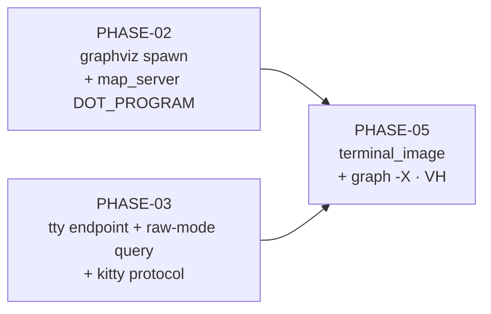

# Implementation Plan SL-245: Inline terminal diagram rendering

Prose companion to `plan.toml`. Narrative only — no queried data lives here
(the storage rule); the phase list, criteria, verification, and links are
authored in the TOML. Use this for the plan's rationale and sequencing.
<!-- Cite entities by padded id (SL-020, REQ-059); phases as PHASE-01,
     criteria as EN-1/EX-1/VT-1/VA-1/VH-1. See glossary.md § reference forms. -->

## Overview

Three phases: two independent leaf tracks, then the join that wires
`doctrine graph -X`.

Phase ids are non-contiguous by design: the first plan had six phases, and the
scope cut of 2026-09-15 (see `slice-245.md` § Scope cut) removed PHASE-01
(`subprocess` extraction → IMP-452), PHASE-04 (folded into PHASE-03) and
PHASE-06 (`concept-map export -X` → IMP-451). Ids are never reused.

## Sequencing & Rationale

**PHASE-02 and PHASE-03 are independent** and may run in parallel. PHASE-02 is
small: a plain std spawn with a stdin writer thread and the `map_server`
single-sourcing of the program name (DEC-143). PHASE-03 holds the riskiest code
in the slice — raw mode with a checked restore — alongside the pure, byte-exact
kitty encoder that consumes its `WindowGeometry`. They share one phase because
together they are the terminal side of the seam and neither is useful alone.

**PHASE-05 joins them** into `terminal_image` and wires `graph -X` end to end,
then the user judges the picture in ghostty. DEC-256's placement rule is
provisional; a HiDPI miss would be fixed inside `kitty` or `graphviz`.

## Where the plan departs from the locked design

The design was left as locked and is marked up at `/reconcile`. Until then,
where they disagree, `slice-245.md` and this plan govern:

- **No `subprocess` module, no CLI render deadline.** `rasterise_png` takes no
  timeout and `RasterOutcome` has no `TimedOut` arm; `coverage_verify` is not
  touched (design sec-5, sec-7 → IMP-452).
- **`graph` only.** Design sec-6's `concept-map export` changes, its e2e rows
  and VH step 3 are deferred (IMP-451).
- **No macOS VH** (design sec-8 step 6 → CHR-072).
- **One added e2e row** (PHASE-05/VT-4): with the concept-map test gone, `graph
  -X` off a terminal now carries the proof that the live stdout check fires.

## Notes

- **Gate per phase:** `doctrine check gate`. Each new leaf registers its
  `layering.toml` row in the phase that creates it.
- **What the automated tests cannot see** (design sec-8): the real termios
  calls, stdin delivery to a real `dot`, and the picture — the VH rows on
  PHASE-05, run by the user at a ghostty terminal on the built binary.
- **Reconcile-time governance** (design sec-7): the SPEC-027 resp. 5 and REQ-396
  Revision; the design markup for the scope cut; DEC-255 (no timed-out outcome)
  and DEC-143 (no CLI timeout) amendments. ISS-242's concept-map annotation
  moves to IMP-451.
