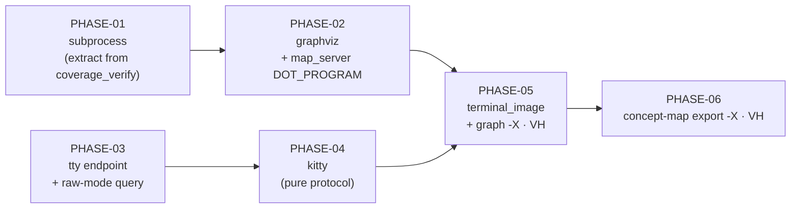

# Implementation Plan SL-245: Inline terminal diagram rendering

Prose companion to `plan.toml`. Narrative only — no queried data lives here
(the storage rule); the phase list, criteria, verification, and links are
authored in the TOML. Use this for the plan's rationale and sequencing.
<!-- Cite entities by padded id (SL-020, REQ-059); phases as PHASE-01,
     criteria as EN-1/EX-1/VT-1/VA-1/VH-1. See glossary.md § reference forms. -->

## Overview

Six phases build the render path bottom-up, one leaf unit at a time, so each
phase lands green with its own tests before anything depends on it. The two
verbs are wired last, `doctrine graph` before `concept-map export` (DEC-258).

## Sequencing & Rationale

**PHASE-01 first, alone.** It is the only phase that changes existing
behaviour-bearing code (`coverage_verify`). Landing the extraction by itself
means its proof is simply "the incumbent suites pass unchanged", with no new
feature code in the same diff to blur that reading. It also adds the bounded
reap and the stdin writer, which nothing exercises yet except its own
`sleep 30` test.

**PHASE-02 depends on PHASE-01** (`rasterise_png` rides `run_bounded`) and
carries the `map_server` literal sweep, because `DOT_PROGRAM` is born in
`graphviz` and the three `dot` invocations should be single-sourced in the same
commit that creates the constant (DEC-143).

**PHASE-03 and PHASE-04 are the terminal track, independent of 01–02.** `tty`
comes before `kitty` only because `kitty::cell_geometry` takes
`tty::WindowGeometry`. PHASE-03 is the riskiest code in the slice (raw mode,
checked restore); keeping it separate from the byte-exact encoder keeps each
review focused. The two tracks may run in parallel.

**PHASE-05 joins both tracks** into `terminal_image` and wires `graph -X`
end to end. It carries the first human acceptance deliberately: DEC-256's
placement rule is provisional, and the one realistic way it is wrong (HiDPI
pixel reporting) would be fixed inside `kitty` or `graphviz`. Judging it before
the second verb is wired keeps any correction to one verb's worth of rework.

**PHASE-06** is the small `concept-map export` wiring — relaxing `--format`
under `-X` — plus its e2e tests and the remaining VH steps, including the
optional macOS check of the timed-read probe.

## Notes

- **Gate per phase:** `doctrine check gate`. Each new leaf registers its
  `layering.toml` row in the phase that creates it, so the ADR-001 layering
  gate is green at every phase boundary rather than only at the end.
- **What the automated tests cannot see** (design sec-8): the real termios
  calls, stdin delivery to a real `dot`, and the picture. Those are the VH rows
  on PHASE-05 and PHASE-06; they need the user at a ghostty terminal on the
  built binary.
- **macOS:** VH-2 on PHASE-06 is optional and may be waived with a reason when
  no macOS host is available; the sec-9 assumption then stands unverified.
- **Reconcile-time governance** (design sec-7) is not a phase: the SPEC-027
  resp. 5 and REQ-396 Revision and the ISS-242 annotation happen at
  `/reconcile`.
