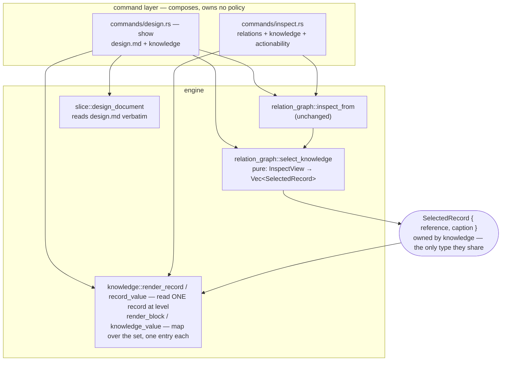
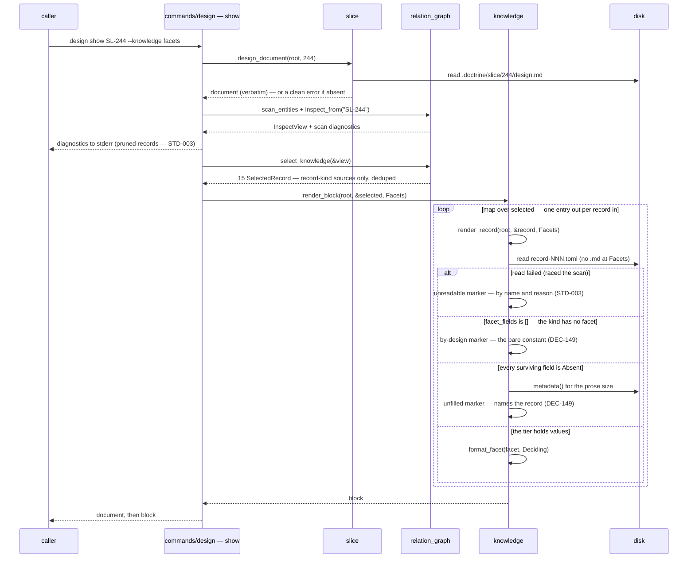

<!-- doctrine:section sec-1 -->
# Design SL-246: Entity reads carry their knowledge records

## 1. Design Problem

### A design document is no longer a whole document

Doctrine's managed design workflow split a slice's design in two. The argument
stays in the slice's `design.md`; the **rulings** moved out into knowledge
records — separate entities, one per settled decision, question, assumption,
constraint, piece of evidence, hypothesis or concept, each with its own files.

The split is deliberate and it is not the problem. A ruling that lives in its
own record can be cited by other designs, superseded on its own terms, and found
by anything that walks relations — none of which a paragraph buried in a 3,000
line document can do. The problem is that the document was left holding the
argument for conclusions it no longer contains, and nothing puts the two back
together for a reader.

`SL-244` is the specimen. Its `design.md` is 3,456 lines and cites twenty
decision records by id, quoting fragments of them inline — `DEC-121` appears
eight times as quoted phrases, because the author kept having to restate a
ruling the document could not show. Fifteen knowledge records point at the
slice. Reading that design as it stands means reading an argument whose
conclusions are somewhere else, and taking the quoted fragments on trust.

**This is the subject of the slice.** Not "render an entity's inbound records" —
that is the mechanism. The thing being fixed is that you cannot read a design.

### What is missing is a read, not a derivation

Two halves of the answer already exist, and the gap is precisely between them.

Relations are stored outbound-only and reciprocity is derived (`ADR-004`).
`doctrine inspect <ID>` is the command that derives it: a kind-agnostic view
that groups an entity's inbound edges under their derived verbs. Run against
`SL-244` it finds all fifteen records correctly — and prints their **ids**.

`doctrine knowledge show <ref>` renders a record's content, and `doctrine
knowledge inspect <ref>` renders it without the prose body. Both need a caller
that already knows which record it wants.

And between them sits the surface that should have joined them, which turns out
not to exist at all: **no verb renders a design document.** `doctrine slice
show` renders the slice's scope and excludes design, plan and notes by its own
stated contract. `doctrine slice design` is a deprecated scaffold. And
`doctrine design show` — the verb whose name promises exactly this everywhere
else in the CLI — renders the design *run*'s turn envelope: machine state, not
a document. Reading `SL-244`'s design today means opening the file.

So the composed read has to bring its own reader.

### Target behaviour

`doctrine design show <SLICE> --knowledge <level>` renders the design document,
followed by the content of the knowledge records that shape it, under an
explicit level:

| level | renders |
|---|---|
| `skip` | the document alone — the default |
| `facets` | per record, the fields that say what rules and what would change whether the ruling still stands |
| `full` | the complete record |

The middle level is the one that earns the feature. On the specimen it costs
about 30% of `full` — 31.8 KB against 107 KB across the fifteen records — which
is a real saving but not an order of magnitude, so it has to be *right* about
which fields it keeps rather than merely smaller.

The same composition is available generically, one level up, on `doctrine
inspect <ID> --knowledge <level>`: any entity that carries knowledge
relationships, rendered with its records instead of their ids. That is where the
renderer lives (`DEC-145`) and where a later transitive closure will extend it.
The design read is its second caller (`DEC-261`), and the reason the slice
exists.

### Where the boundary sits

**In.** One hop. Inbound. Relation-keyed. The design document plus its records,
and the generic entity case that shares the renderer with it.

**Out.** Prose citations are not consulted: `SL-244`'s design cites roughly ten
records it holds no edge to, and closing that gap is a validate-and-warn concern
on the *authoring* path. The recursive knowledge closure — walking
record-to-record edges and halting at non-record nodes — is separate work; this
design leaves a seam for it and stops at one hop. Facet hygiene is not in scope:
where the corpus has left a record's fields unfilled, this design says so plainly
rather than compensating.

**Reclaimed, not worked around.** An earlier draft sited this read at `slice
design show` and carried the information-architecture defect knowingly. `DEC-261`
supersedes that: `design show` renders the document, as `show` does everywhere
else, and the run's turn envelope keeps its three existing renderings under
`--format prompt|json|status`. Only the default moves. That makes the verb this
slice's destination rather than a parking space, and it is why `IMP-393`'s
complaint is partly discharged here (`fulfils`, degree `partial`) instead of
deferred whole.

### What success looks like

Reading `SL-244`'s design at the `facets` level gives you the argument *and* the
twelve rulings that shape it, in one output, without the eleven backlog rows
that merely originated the slice — at a cost a working agent would pay on
purpose. Every existing read is unchanged, byte for byte, unless the reader asks
for more.

<!-- doctrine:section sec-2 -->
## 2. Current State

Three surfaces bear on this design. Two of them do half the job each; the third
is the corpus scan that feeds the first.


*The two halves and the missing edge between them. `inspect` derives which
records point at an entity and prints their ids; `knowledge` can render a
record's content but only when a caller already knows which record it wants.
Absent from the diagram because it is absent from the tree: any reader for
`design.md` itself — see §2.5.*

### 2.1 `doctrine inspect` derives the inbound set correctly

`inspect_from` (`src/relation_graph.rs:636`) builds the relation graph from a
pre-scanned entity slice, gates on the id actually existing, and returns an
`InspectView` (`:572`) of four fields: the queried `id`, `outbound` groups,
`inbound` groups, and `danglers`. Inbound is recomputed from `in_edges` on every
query — no reverse field is stored, per `ADR-004`.

Two properties matter downstream.

**Groups are keyed by `(label, role)`, not by label alone.** A `references` edge
groups under its role, so inbound `implements` and `concerns` stay in distinct
buckets with distinct derived verbs ("implemented by", "concerned by") instead
of collapsing into one. The group key is what the composed read will caption a
record with.

**Each group's sources are sorted by `EntityKey`** — prefix lexicographic, id
numeric — so the render is deterministic and permutation-invariant past id 999.
A composed read inherits that ordering for free.

`render_from` (`:760`) turns the view into bytes: `render_human` for the table
format, `render_json` for `--json`. The human render is built as a `Vec<String>`
of parts each carrying its own newline, joined by `concat`, and each of the three
sections is omitted when empty. `render_inbound` (`:873`) is nineteen lines: for
each group it looks up the derived verb via `relation::inbound_name(label, role)`
and prints `  <verb>: <comma-joined refs>`.

The command shell (`src/commands/inspect.rs:52`) performs one corpus scan and
shares it between the relation render and the priority actionability block it
appends below. The JSON arm builds `inspect_value(view)` and injects
`actionability` as an additive key.

Ordinary `inspect` output is roughly one line per group. That is what makes
`skip` the honest default: the surface is currently cheap enough to run without
thinking about it, and it must stay that way.

### 2.2 `knowledge` already renders a record three ways

`read_record` (`src/knowledge.rs:1637`) reads one record's `record-NNN.toml`,
parses and validates it, attaches its tier-1 relation edges, and then reads the
sibling `.md` **unconditionally** — erroring if the file is absent.
`relation_edges` (`:1654`) is the existing `pub(crate)` accessor over it, added
so callers outside the module can reach a record's edges without reaching into
its internals. It is the shape the composed read's accessor should copy.

Rendering is already tiered, and this is the useful surprise:

- `format_metadata` (`:1795`) — a pure function of the record's own state:
  identity line, slug/kind/status, dates, tags, then `format_facet`,
  `format_evidence`, and the five relation axes.
- `format_show` (`:1835`) — `format_metadata` plus the prose body.
- `format_inspect` (`:1842`) — `format_metadata` alone, no body. This is
  `doctrine knowledge inspect`, and it is very nearly the `full` level already.

`format_facet` (`:1867`) dispatches on the record kind and emits each populated
field in template order through `show_opt_line` (`:1848`) or `show_list_line`
(`:1856`). Two behaviours are load-bearing for this design:

1. **Absent fields are silent.** `show_opt_line` returns an empty string for
   `None`.
2. **An entirely unpopulated facet renders as nothing at all** — not a blank
   block, not a header. `format_facet` emits the `\n[facet]\n` header only when
   the body is non-empty.

`RecordFacet::Concept(_)` returns an empty string by construction: a concept
record has no facet fields, because every concept rides its attributed prose
body. So a concept is permanently in state (2) **by design**, and is not the
same fact as a decision whose author never filled anything in.

The JSON path disagrees with both: `facet_json` (`:1994`) emits every field,
`None` as `null`.

### 2.3 What the corpus scan carries, and what it does not

`ScannedEntity` (`src/catalog/scan.rs:105`) is the reusable half of the old
relation-graph build — the all-kind walk with no reference graph on top,
consumed by both `inspect` and the priority graph. It carries the entity key,
kind descriptor, authored status, title, outbound edges, an optional risk facet,
tags, and an optional prose body gated by `ScanMode`.

It carries **no** `RecordFacet`. Neither does `CatalogEntity`, but that struct is
not on `inspect`'s path at all, so it is not the comparison that matters.

The scan's history is a warning: `[estimate]` and `[value]` facets were parsed
here and were deleted at `SL-222`, leaving a tripwire behind to catch any
residue. Adding a facet parse back to the scan would walk that decision
backwards, and would charge every consumer — `validate`, `survey`, the priority
graph, `backlog show` — for a parse only one of them wants.


### 2.5 No verb renders a design document

`SPEC-013` imposes the uniform `<kind> <verb>` grammar over a shared verb set —
`new`, `list`, `show`, `status` — and across the corpus `show` means *render the
entity's document*. `doctrine adr show ADR-004` prints the ADR's prose.
`doctrine rfc show RFC-031` prints the RFC's. `doctrine knowledge show DEC-145`
prints the record's.

The slice is the exception, and the exception is not an accident of
implementation. A slice owns **four** documents — scope, design, plan, notes —
and `show` picks one of them. Its help text says so outright: *"Show one slice:
its metadata and scope body (not design/plan/notes)."* The other three have no
reader.

The neighbouring verbs that look like they might be one are not:

| verb | what it actually does |
|---|---|
| `slice show <ID>` | metadata + scope body; design/plan/notes excluded by contract |
| `slice design <ID>` | deprecated scaffold — now only delegates to `design materialise`, which **writes** the file |
| `design show <SLICE>` | the design **run**'s turn envelope: stage, traversal, frontier, counts, change rows |
| `design materialise <SLICE>` | renders the run's sections *into* `design.md` — a write, not a read |

So the motivating read has no surface to attach to — but it does have a verb
whose name already means it, currently occupied.

### 2.6 The occupied verb already names its occupant

`doctrine design show` does not merely happen to render the envelope. It renders
it under an explicit selector:

```
--format <FORMAT>  Which rendering of the turn envelope to emit
                   [default: prompt]  [possible values: prompt, json, status]
```

The writer's rendering is **already called `prompt`**, and two of the three
values are already non-default. So reclaiming `show` for the document does not
require naming the envelope something new, inventing a verb, or migrating
callers to a synonym: it moves one default. `DEC-261` takes that, and the
`design` group keeps `prompt`, `json` and `status` unchanged under the names
they already carry.

`IMP-393` reached this conclusion on 2026-08-03 and is the carrier this slice
partially discharges. `IMP-457`, minted during this slice's drafting, restates
the same complaint and is redundant against it — reconciled rather than left
standing as a parallel carrier.

### 2.7 What pins the current behaviour

`SPEC-013` pins rendered output byte-exact per verb through black-box goldens.
The relevant suites are `tests/e2e_inspect_golden.rs`,
`tests/e2e_inspect_transitive_golden.rs` and `tests/e2e_knowledge_cli_golden.rs`.

`tests/e2e_inspect_golden.rs` hand-seeds a synthetic corpus in a temporary
directory rather than reading the repository's own `.doctrine/` tree, precisely
because `inspect` reads only authored TOML: fixed bytes in, byte-exact bytes out.
That existing choice is the one this design extends.

<!-- doctrine:section sec-3 -->
## 3. Forces & Constraints

### 3.1 Governance that binds

**`ADR-004` — relations are stored outbound-only; reciprocity is derived.** The
inbound set is a reverse scan recomputed on every query, never a stored
back-edge. `inspect_from` already works this way and this design inherits it:
nothing here may cache a reciprocal edge, and the selection step reads the
derivation rather than any stored field.

**`ADR-001` — module layering, leaf ← engine ← command, no cycles.** Three
placements are forced rather than chosen:

- `RecordFacet` parsing and the field-order table stay owned by `knowledge`.
  Moving either into the catalog scan would smear a kind's private schema across
  the layer that is supposed to be kind-blind.
- `relation_graph` may call down into `knowledge` (it does not today;
  `knowledge` imports nothing from `relation_graph`, so the edge is acyclic),
  but the reverse would be a cycle.
- Composition of the *design document* with the record block sits at the
  command layer, the only layer permitted to depend on both the slice's document
  reader and the record renderer — the same rule that already forces `inspect`'s
  actionability block to be appended by `commands/inspect.rs` rather than by
  `relation_graph`.

**`SPEC-013` — the CLI surface.** Two clauses bind, and they cut in different
directions:

- It owns the *shape*: the `<kind> <verb>` grammar, the byte-exact per-verb
  goldens, the JSON envelope. Any flag this design adds, and every golden that
  moves with it, is SPEC-013's business.
- It explicitly does **not** own the content: *"The per-kind `show` content —
  which facets render and how a kind reassembles its TOML and prose — belongs to
  each kind's own component."* So the field tiers of `DEC-150` are
  `knowledge`'s to decide, and the spec does not have to be amended to hold them.

The spec states the shape as well as owning it: *"The surface is a two-level
clap subcommand tree."* `doctrine design show <SLICE>` is two levels, so this
design conforms rather than deviating, and no governance has to move for it to
land. That is the decisive property `DEC-261` bought and the earlier siting did
not have.

The point is worth stating because the earlier siting got it wrong in a
particular way. `slice design show` is three levels, and the draft defended it
by pointing at `slice selector` as precedent — which is not an argument a design
is entitled to make. A precedent does not amend a normative clause; only a
`REV` does. The observation underneath was true and is recorded here so it is
not lost: the clause is already descriptively false of its own governed surface,
since `slice selector`, `spec req`, `spec interactions`, `revision change`,
`memory sync` and `knowledge edit <kind>` are all three-level groups under
numbered entity kinds. Reconciling the clause against that population is real
work and belongs to whoever picks it up; `SL-246` no longer needs it.

**`SPEC-019` — the knowledge-record entity surface** specifies four record
kinds. `EVD`, `HYP` and `CPT` are ungoverned (`ISS-316`). `DEC-150` handles that
honestly rather than inventing governance: those three have so few fields that
every one is a deciding field, so the honest subset is all of them, and for
`CPT` it is none.

**`SPEC-018`** fixes the inbound label vocabulary and the role dimension that
`(label, role)` grouping keys on.

**`STD-001` — no magic strings.** The level names, the tier annotation, and the
three empty-state messages each have exactly one definition. Only one of the
three is a bare constant — the by-design marker, which the kind alone decides.
The other two name the record, so they are templates over a constant frame.
All three are composed in the per-record producer (`D6`) — the only layer that
can reach what the two templates have to say (§5.2).

**`STD-003` — no silent skip; a degraded read is disclosed.** This one reaches
further than the inquiry did, and it is the reason for `X4` below. Selection
yields a set of record ids and then reads them. A record that fails to read —
absent file, unparseable TOML — must be **tolerated** (the other records still
render) and **disclosed by name** (the reader is told which record and why). It
may not be dropped from the output, absorbed into an empty string, or counted as
"no content". Note the distinction this design must hold: a record that *cannot
be read* and a record whose author left the facet *empty* are different facts
and get different treatment — the first is STD-003's, the second is
`DEC-149`'s.

**`STD-002`** governs the naming; **`PRD-019`** and **`PRD-010`** are why the
records exist at all.

### 3.2 Constraints on the change

- **`C1` — adding the level changes nothing by itself.** `skip` must reproduce
  today's bytes exactly on every surface this design *adds the level to*:
  `doctrine inspect` in both table and JSON, and `doctrine design show` under
  each of its envelope renderings (`--format prompt|json|status`). `DEC-146`
  buys this by construction rather than by care: the level flag that asks for
  content is the same flag that pays for it, and on the JSON arm the block's
  absence sits in `knowledge_value`'s return type rather than in a level re-test
  each caller has to remember (§5.2).
  The one surface `C1` does **not** cover is `design show`'s bare default, which
  `DEC-261` moves from the turn envelope to the design document deliberately.
  That is a migration, carried by `R6` and whitelisted in §5.6 — not a breach.
  The constraint binds the *flag's* neutrality, not the verb's stability, and
  saying so is what keeps §9.1's red-suite alarm meaningful.
- **`C2` — the behaviour-preservation gate.** `format_facet` and `format_metadata`
  are shared machinery; the existing kind-`show` and `knowledge` suites are the
  proof and must stay green **unchanged**. `SL-246` does not alter `knowledge
  show`'s output — the concealing behaviour there belongs to `IMP-403`. Under
  `D6` that is structural rather than careful: the markers compose in the
  composed read's per-record layer, which `knowledge show` never enters, so
  there is no policy argument it could pass wrongly.
- **`C3` — read-only.** Nothing on this path writes. Worth stating twice over.
  The deprecated `slice design <ID>` leaf currently *writes* — it delegates to
  `design materialise` — and it retires here, taking its write with it. And the
  verb being reclaimed sits in a group whose other members (`start`, `apply`,
  `materialise`) all write, so `design show` must stay the read it already is.
  Note where this is enforced: `write_class` in `src/commands/guard.rs` is this
  codebase's read/write classifier, it feeds the pre-dispatch worker guard, and
  a surface misclassified there is refused outright under `DOCTRINE_WORKER=1`.
  `C3` is a claim about that table, not only about the filesystem, so §5.6 names
  the file.
- **`C4` — one renderer, one field-order table.** The levels cannot be allowed to
  disagree about which fields exist or in what order, so they must be bounds on
  one code path, not two implementations. This is the `Detail::{Normal, Full}`
  precedent in `src/design_run/render/envelope.rs`, whose own comment states the
  principle.
- **`C5` — the corpus scan is not widened.** `ScannedEntity` gains no
  `RecordFacet` (`DEC-146`).
- **`C6` — the seam must extend, not be replaced.** `IMP-398` S5's transitive
  knowledge view writes a second *selection* and reuses the renderer untouched
  (`DEC-147`, objective 3). No depth parameter and no traversal abstraction
  enters this slice.
- **`C7` — `read_record` reads the `.md` unconditionally** and errors when it is
  absent (`src/knowledge.rs:1647`). The `facets` level never renders prose, so it
  either pays for a body it discards or the accessor grows a facet-only path.

### 3.3 Forces in tension

**`F1` — what the corpus scan already costs, versus what `DEC-146` assumed.**
This is a correction the drafting stage found, and it changes an argument
without changing the decision.

`scan_entities` calls `outbound_for` per entity (`src/catalog/scan.rs:192`),
which for a record prefix dispatches to `knowledge::relation_edges` (`:65`) →
`read_record`. So **every corpus scan already reads, parses and validates all
360 knowledge records — around 964 KB of prose bodies — and keeps only their
relation edges.** `doctrine inspect SL-244` pays that before it prints anything,
and completes in about 220 ms end to end.

Two consequences. `DEC-146`'s stated cost — *"2 file reads per selected record…
zero at the `skip` default"* — describes reads that are **not new**; the scan has
already read those same records moments earlier and thrown the content away. And
`DEC-146`'s rejection of the scan-carried arm rested on *"every corpus scan pays
the parse, including `validate`, `survey`, the priority graph and `backlog
show`, none of which want it"* — but they already pay it.

The decision survives, on a repaired argument: what the scan-carried arm would
add is not the parse but **retention** — holding 360 parsed records in memory for
every consumer, to save a dozen re-reads that measurement puts deep in the noise.
Per-id reads at the render layer remain right, and `C7`'s facet-only path becomes
the more interesting half of the question, since it is the seam that would let
`IMP-459` stop the scan reading a megabyte of prose it discards.

**`F2` — honesty versus noise in the empty case.** Four of the specimen's fifteen
records render nothing at the `facets` level, and a marker on each is the honest
answer (`DEC-149`). But `CPT` is permanently in that state *by construction* —
a concept has no facet fields because its prose body is the payload — so one
marker for both cases would libel every concept in the corpus and train readers
to ignore the marker. Two markers, and `STD-003` adds a third distinct state:
the record that could not be read at all.

**`F3` — cost versus completeness.** The `facets` level costs ~30% of `full` on
the specimen, not the order of magnitude first assumed. A level that saves 70%
has to be *right* about what it keeps; `DEC-150`'s criterion — what rules, and
what would change whether the ruling still stands — is doing the work that the
size argument alone cannot.

**`F4` — generality now versus the closure later.** Every line of traversal
abstraction written now for `IMP-398` S5 is speculative; every coupling to
`RelationLabel` written now is a refactor S5 must undo. `DEC-147` resolves this
at one point only: the caption is selection-supplied *text*, because at one hop
it is an inbound label and at depth three it is a path.

**`F5` — a defect cheap to work around and nearly as cheap to fix.** The read
this slice exists to deliver had nowhere correct to sit, because `design show`
meant the run envelope and `slice show` meant the scope. The draft worked
around it and filed the debt. Counted rather than assumed — and counted over a
stated population, so the number can be checked rather than trusted:

| population | count |
|---|---|
| shipped prose | 1 — the `install/routing-process.md` line naming the turn read |
| emitted strings | 4 — three naming `design show --full` (`design_run/refusal.rs:904`, `design_run/render/mod.rs:343`, `design_run/render/envelope.rs:1330`), one bare (`commands/design.rs:1548`) |
| tests | 5 files — enumerated in §5.6, with a disposition each |
| memory corpus | 5 committed items under `.doctrine/memory/items/` |

`handover/SKILL.md` already passes `--format status` explicitly and does not
move; it is the only skill naming the verb, because `/design` drives the run
through `design resume`. `DEC-261` therefore resolves the tension rather than
deferring it. What remains is a real cost, not a residual worry: a live default
changes, including the one the managed design run is itself driven through, and
this slice absorbs a rehome that was scoped as separate work.

**The memory corpus is the half a code sweep cannot see, and it is the worse
half.** A stale doc waits to be read; a stale memory is *injected* into an
agent's context by `memory retrieve` and the surface hook. One of the five is
titled *"Design run state: read via show, not the raw TOML"* — a thesis that
inverts under `DEC-261`. The five edits ride a `/reviewing-memory` pass rather
than this slice's phases (§5.6): re-attesting a memory is its own verb, and the
corpus is not code.

<!-- doctrine:section sec-4 -->
## 4. Guiding Principles

Six principles, each with a concrete consequence in §5. They are the tie-breakers
this design reaches for when two shapes both work.

**P1 — Route to what exists before building.** The inbound derivation, the
`(label, role)` grouping, the deterministic source ordering, the per-kind record
render and its field-order table are all already written and already tested.
Most of this slice is wiring, and the parts that look like new code should be
suspected of being duplication first. The one genuinely new thing is a reader
for a document that has never had one.

**P2 — One code path, bounded; never two that could agree today.** The three
levels are bounds on a single renderer over a single field-order table. Two
implementations that currently produce consistent output are a defect waiting for
the next field to be added to one of them.

**P3 — The reader pays only for what they asked for.** `skip` is the default and
is byte-identical to today's output. Every cost this design adds is behind a flag
whose presence *is* the consent. This is what makes the byte-identical default a
property of the structure rather than a promise someone has to keep.

**P4 — Render for the corpus we intend, and state the gap.** Where a record's
facet is unfilled, say so and move on. Do not fall back to prose, do not
backfill, and do not silently omit. A renderer built around the corpus's current
defects bakes them in and has to be undone when they are fixed; a renderer that
marks them costs nothing once they are, because the marker simply stops firing.

**P5 — Different facts get different words.** Three empty states arrive at the
renderer and they are not the same thing: an author left the facet blank, the
kind has no facet by design, or the record could not be read. Collapsing them
into one message is what turns a marker into noise the reader learns to skip.

**P6 — Seam for the next caller; abstract for none.** The selection/rendering
split exists because a second and third caller are already known — the generic
`inspect` case, the design read, and later the transitive closure. It goes
exactly as far as making the renderer indifferent to how its input was selected,
and no further. No depth parameter, no traversal trait, no label-keyed renderer.

<!-- doctrine:section sec-5 -->
## 5. Proposed Design

### 5.1 System Model

Three pieces, split where `DEC-147` says to split: **selection** decides which
records and what to call them; **rendering** turns records into bytes; the
**command layer** composes a subject with the rendered block. Selection and
rendering never meet except through a value type.



*Ownership, and the one type that crosses. `SelectedRecord` is defined in
`knowledge` so that `relation_graph` depends on `knowledge` and never the
reverse — the edge is acyclic today and this keeps it so.*

Two things the diagram is making a point of.

**Selection is pure.** It takes an `InspectView` that has already been derived
and returns a list. It performs no reads, so a second selection — the design
read's, and later the transitive closure's — is a pure function to write, not a
second traversal to maintain.

**Rendering is a map, and the arrow into it is the reason.** `SelectedRecord`
is the only way in, and every one of them comes out: the set-level producers map
over `render_record` rather than filtering, which is what makes `I5`'s
never-dropped clause a property of the shape instead of a promise (§5.2, §9.5).
The JSON arm is the same map through `record_value`, so the two arms cannot
disagree about record *membership* any more than `facet_fields` lets them
disagree about fields.

**The command layer owns composition and no policy.** It decides *what to put
next to what*; it never decides which fields render or what an empty facet
means. This is forced, not preferred: `catalog::scan::outbound_for` already
calls `slice::relation_edges`, so a handler living in `src/slice.rs` that
reached into `relation_graph` would close a cycle. The composition has to be one
layer up, which is where `commands/inspect.rs` already appends its actionability
block for the identical reason.

### 5.2 Interfaces & Contracts

#### The level

```rust
// src/knowledge.rs — STD-001: the three names have one definition.
/// How much of each inbound knowledge record a composed read carries.
#[derive(Clone, Copy, PartialEq, Eq, Default)]
pub(crate) enum KnowledgeLevel {
    /// No knowledge block. Byte-identical to the pre-SL-246 surface.
    #[default]
    Skip,
    /// Per record: the fields that say what rules, and what would change
    /// whether the ruling still stands (DEC-150). Never reads the `.md`.
    Facets,
    /// The complete record, prose body included.
    Full,
}

impl KnowledgeLevel {
    pub(crate) fn as_str(self) -> &'static str { … }   // "skip" | "facets" | "full"
}
```

`Default` is `Skip`, which is `C1` expressed in the type rather than remembered
at each call site.

#### Selection

```rust
// src/knowledge.rs — the shared value type, defined here so the dependency
// runs relation_graph → knowledge and never back.
/// One record chosen for a composed read, with the text it renders under.
/// `caption` is TEXT, not a `RelationLabel` (DEC-147): at one hop it is the
/// derived inbound verb; at depth N it will be a path, and the renderer must
/// not have to change to learn that.
pub(crate) struct SelectedRecord {
    pub(crate) reference: String,   // canonical ref, e.g. "DEC-145"
    pub(crate) caption: String,     // e.g. "shaped_by", "concerned by"
}

// src/relation_graph.rs
/// Select the knowledge records pointing at the inspected entity — pure over an
/// already-derived view. Filters on the SOURCE prefix via `kinds::is_record`
/// (DEC-148), keeps the view's group order and each group's `EntityKey` sort,
/// and deduplicates by reference with the first caption winning.
pub(crate) fn select_knowledge(view: &InspectView) -> Vec<SelectedRecord>;
```

Dedup belongs here and not in the renderer (`DEC-147`): `EVD-012` already
arrives under two inbound labels at one hop on the specimen, and at N hops a
record arrives at several depths. Keeping it in selection leaves the renderer
ignorant of traversal entirely.

#### Rendering

```rust
// src/knowledge.rs
/// Render ONE selected record at `level`. Reads it by id — the kind-module
/// accessor, sibling of `relation_edges` (DEC-146).
///
/// TOTAL, and never empty: every input yields an entry. A record that cannot be
/// read yields the unreadable marker, by name and reason; a record whose tier
/// holds nothing yields the unfilled or the by-design marker, chosen by the
/// shape `facet_fields` returns. All THREE are composed HERE, because this is
/// the only layer that knows which record this is and may touch the disk (D6).
pub(crate) fn render_record(
    root: &Path,
    selected: &SelectedRecord,
    level: KnowledgeLevel,
) -> String;

/// The JSON sibling — the same record, as the entry shape below. Same totality,
/// same markers, same layer.
pub(crate) fn record_value(
    root: &Path,
    selected: &SelectedRecord,
    level: KnowledgeLevel,
) -> serde_json::Value;

/// The knowledge block: a MAP over `selected` through `render_record`, never a
/// filter. One record in, one entry out.
/// `Skip` returns the empty string without reading anything.
pub(crate) fn render_block(
    root: &Path,
    selected: &[SelectedRecord],
    level: KnowledgeLevel,
) -> String;

/// The `"knowledge"` value on the JSON arm: the same map through `record_value`.
/// `None` at `Skip`, and the caller omits the key — byte-identity at `Skip`
/// (`C1`) means ABSENT, not empty, and no `serde_json::Value` can express
/// absence. `Option` puts that absence in the type rather than in a level
/// re-test each call site has to remember. The text arm needs no equivalent:
/// concatenating the empty string IS absence there, which is why its sibling
/// returns a bare `String` and this one does not return a bare `Value`.
pub(crate) fn knowledge_value(
    root: &Path,
    selected: &[SelectedRecord],
    level: KnowledgeLevel,
) -> Option<serde_json::Value>;
```

**Two producers, and the block is a map over them.** Both arms are specified
here because `D1` puts the level in the *shape* of each entry: a `String` cannot
be the `"knowledge"` key's value without making the JSON arm the blob `D1`
rejects, so the arm needs a producer of its own and it must be named, owned and
total like its sibling. What they share is `SelectedRecord` — the only way in,
on either arm.

The shape is what carries `I5`, and it is worth being exact about which part of
it carries which clause. `I5` forbids three things: a selected record that
cannot be read may not be **dropped**, may not be **rendered as empty**, and may
not **abort the block**. The return type — `String`, not `Result<String>` —
forecloses the third and only the third. A total function is free to lose a
record: `selected.iter().filter_map(|r| read_record(..).ok())` compiles, never
returns `Err`, and silently drops exactly the record `STD-003` exists to
disclose. So the first clause is carried by the *map*, which yields one entry
per element of `selected` and has no arm that yields none, and the second by
`render_record`'s never-empty contract, which has the three markers as its
floors. Totality alone would leave two of the three clauses resting on the
implementer's good intentions.

That is also why totality is the design's expression of `STD-003` rather than a
convenience: a composed read that bailed on one unreadable record would deny the
caller the other fourteen, and one that dropped it silently would launder a
corpus defect into a well-formed answer.

`Facets` reads only `record-NNN.toml`. This is `C7` discharged: `read_record`
reads the `.md` unconditionally and errors when it is absent, so `render_block`
takes a facet-only path at `Facets` rather than paying for a body it discards.
That path is the seam `IMP-459` would later ride to stop the corpus scan reading
a megabyte of prose it throws away.

#### The tiered facet render

`C4` says one field-order table. The draft satisfied that for the *text* render
and left JSON out, which does not hold: `facet_json` is a second, hand-written
per-kind projection, structurally independent of `format_facet`. Annotating
tiers inside `format_facet` would have made the text arm tier-aware and the
JSON arm silently untiered — reproducing, in a new surface, precisely the
divergence `D1` says must not be reproduced.

So the single source moves one level down, to a structured projection both arms
render from — which carries `DEC-150`'s encoding down with it and leaves its
ruling intact. `DEC-150` rules the tiers "encoded as a tier annotation on each
field line inside `format_facet`'s existing per-kind match, not as a separate
field-list constant", and records `show_opt_line` / `show_list_line` growing a
tier argument. Under `facet_fields` the match yields `Vec<FacetField>` instead
of emitting lines, so neither line helper grows anything and the annotation
sits on the field rather than on its rendered line. What `DEC-150` actually
ruled is untouched: one table, one field order, one place, and *not* the
separate constant it rejected on drift grounds — `facet_fields` **is** that
per-kind match, rewritten, not a constant beside it. The record stands and is
not superseded; only its implementation sketch moved, and §7.1 says so.

```rust
/// Which tier a facet field belongs to.
enum Tier { Deciding, Argument }

/// Which tiers a render keeps. `All` is not `Deciding` and `Argument` spelled
/// twice: it is the existing whole-facet render, and `knowledge show` passes it
/// to stay byte-identical (`C2`).
enum TierFilter { All, Only(Tier) }

/// One facet field, in template order, with its tier. The ONE per-kind
/// ordered table (C4): the existing per-kind match is rewritten to yield
/// these instead of emitting strings, so text and JSON cannot disagree about
/// which fields exist, in what order, or which tier they sit in.
struct FacetField {
    key: &'static str,
    tier: Tier,
    value: FacetValue,     // Text(String) | List(Vec<String>) | Absent
}

/// The single field-order table. Total; order is the template's.
fn facet_fields(facet: &RecordFacet) -> Vec<FacetField>;

/// Text render — filters `facet_fields` by tier, then formats. There is NO
/// empty policy here: a facet with nothing to show renders nothing, and the
/// marker that stands in its place is composed one layer up (D6).
fn format_facet(facet: &RecordFacet, tier: TierFilter) -> String;

/// JSON render — filters the SAME `facet_fields` by the SAME tier. Same
/// silence on an empty result, for the same reason.
fn facet_json(facet: &RecordFacet, tier: TierFilter) -> serde_json::Value;
```

**Where the markers sit on the JSON arm.** Every empty state has to be
expressible in JSON, or `I6` and `X5` hold on the text arm only — `D1`'s
asserted agreement failing one layer below where `facet_fields` repaired it. All
three ride **inside** `facet`, as `{"marker": …}` in place of the field object,
at both levels. That keeps `Full`'s entry exactly `show_value`'s twelve keys plus
`caption` — nothing is bolted onto the payload to carry a marker — and it makes
the two levels' entries one shape rather than two. A `CPT` therefore renders the
by-design marker on both arms at every level, which is `X5` as written.

**One layer writes all three, and `facet_fields` decides which.** The per-record
producers hold the reference and the root, so they can name the record and size
its prose; the facet renderers receive the parsed `[facet]` table and can do
neither. Siting any marker below them would be siting a policy where its inputs
are not, so none of them sits there — and the state is read off the table's own
return rather than off a second match on the kind:

| `facet_fields(facet)`, filtered by tier | the state | what is composed |
|---|---|---|
| `[]` — the kind has no fields at all | by design | the by-design marker |
| every surviving field `Absent` | the author left it unfilled | the unfilled marker |
| anything else | it renders | nothing; hand it to the leaf renderer |

`facet_fields` was already the single source of *which fields exist*; it is
therefore also the single source of *which empty state this is*. One table
answers both questions, which is `C4` reaching one question further than it was
written for, and it is why the by-design case needs no kind match of its own.

**This is why there is no empty-policy parameter.** The round-3 draft gave the
leaf renderers a `Silent | Marked` input so the composed read could mark while
`knowledge show` stayed silent. That parameter had no route to `Full`: the entry
there is `show_value`, and the text chain is `format_show` → `format_metadata`,
none of which carries policy — so the marker `X5` requires at *every* level was
reachable at `Facets` and unreachable at `Full`, on both arms. Threading the
pair up through four functions was the alternative and is rejected in `D6`:
marking is the composed read's business, the composed read owns the per-record
layer, and nothing above the leaf renderers needs to know the concept exists.

`knowledge show` therefore stays byte-identical (`C2`) **by construction rather
than by passing `Silent`** — it never enters a layer that can mark. It passes
`All` and nothing else; `facet_fields` reproduces the current order and the
current text formatting sits unchanged on top of it. The composed read passes
`Only(Deciding)` at `Facets` and `All` at `Full`, and composes the markers
itself.

This is a refactor of shared machinery, so `C2` is the gate that proves it: both
`format_facet`'s and `facet_json`'s existing output must not move. Their current
disagreement about absent fields — text silent, JSON emitting `null` — is
preserved deliberately at `All`, because changing it is `IMP-403`'s and
not this slice's. What `facet_fields` buys now is that the *tier filter* reaches
both, which is the property `D1` asserted and had no mechanism for.

The per-kind tiers are `DEC-150`'s: `DEC` context/choice/rationale; `QUE`
question/why_matters/answer; `CON` statement/source/applies_to/waiver_reason;
`ASM` claim/confidence/basis/invalidated_by; `EVD` all three; `HYP` both; `CPT`
none.

#### The three empty states

`DEC-149`'s two markers plus `STD-003`'s third. Each has one definition and they
must not share wording (`P5`):

| state | rendered | decided by |
|---|---|---|
| author left the facet unfilled | `(no facet recorded — 6.7 KB of prose: doctrine knowledge show QUE-206)` | every surviving field `Absent` |
| the kind has no facet by design | `(no facet by design — a concept rides its prose body)` | `facet_fields` returns `[]` |
| the record could not be read | `(unreadable: record not found at …/record-140.toml)` | `read_record` failed |

All three are composed by `render_record` / `record_value` (`D6`). The third
column is what each one is *decided* by, and every decision is a property of
`facet_fields`' return or of the read — not a second per-kind match, and not a
policy argument. Only the middle message is a bare constant; the other two name
the record, so they are templates over a constant frame, and a marker that must
name `QUE-206` and size its prose cannot be produced by a function that receives
only the parsed `[facet]` table. Siting the policy where its inputs are not is
the defect this section exists to make un-writable.

The prose-size hint costs a `metadata()` call, not a read — which is what keeps
it compatible with `Facets` never opening the `.md`, and it is also why the hint
belongs above the facet renderers: `knowledge show` calls those too, and they
stay free of the disk.

**Which of these a reader can actually reach.** The third is rarer than the
draft implied, and saying so is the honest version. `scan_entities` drops an
entity whose `outbound_for` fails, and for a record that call is
`knowledge::relation_edges` → `read_record`, which parses the TOML *and* reads
the `.md` unconditionally. So a record with an absent or malformed `.toml`, or
an absent `.md`, never enters the `InspectView`, is never selected, and cannot
reach `render_block` to be marked. It is disclosed instead by the scan
diagnostic `run_inspect` already writes to **stderr** before its output — the
existing mechanism, which this design does not replace and the new read surface
must perform identically.

The in-block marker therefore covers one reachable case only: a record that
scanned cleanly and then failed between the scan and the render. That is a
genuine race rather than a corpus defect, and it is why `render_block` stays
total (§5.2) — not so that a common failure renders prettily, but so that a rare
one cannot take the other fourteen records down with it. That one case is also
unreachable in a black-box golden, so it is verified by construction rather than
by test — §9.5 states why, and what the alternative would have cost. `STD-003` is satisfied
across both: every degraded read is disclosed, each on the surface that can
actually see it.

#### Command grammar

```
doctrine inspect <ID> [--knowledge <skip|facets|full>] [--transitive]
doctrine design show <SLICE> [--knowledge <skip|facets|full>]
                             [--format <document|prompt|json|status>]
                             [--json] [--full]
```

`--knowledge` defaults to `skip` on both, and both are two levels (`SPEC-013`).

`design show` changes meaning (`DEC-261`): it renders the design **document**,
and the turn envelope is reached by naming a rendering of it. Three flags
interact on the reclaimed verb, and each interaction is ruled here rather than
left to the implementer to discover.

**`--format` gains `document`, and `document` becomes the default.** This closes
the fork `DEC-261` left open — *the enum gains a value for the document, or the
default is re-keyed*. The enum gains the value. The alternative, an option with
no default where absent means document, is a removal dressed as a move: it takes
`--format` from total to partial and leaves the new default invisible in
`--help`. `prompt`, `json` and `status` keep their current renderings and names
and continue to mean the turn envelope; only the default moves, from `prompt` to
`document`. The four value names are one `STD-001` constant set, not literals
duplicated across the clap definition and the goldens.

**`--json` renders the document read as JSON, and belongs to the document like
`--knowledge`.** The two flags sit on different axes — `--format` selects *what*
is rendered, `--json` selects *how* the document read is serialised — and
`inspect`'s precedent does not transfer, because there they are the same axis
and collapse at one line (`src/commands/inspect.rs:59`). Rather than invent a
precedence between axes, the pair that would need one is refused, exactly as
`--knowledge` with `--transitive` is below. The refusal is stated over the
*rendering*, not over how the rendering was spelled: `--json` is legal at
`document`, defaulted or written out, and refused with `--format
prompt|json|status`.

So `design show SL-244 --json` emits `{ "kind": "design", "slice", "document",
"knowledge" }`; `design show SL-244 --format document --json` is that same
invocation spelled out, and is legal; and `design show SL-244 --json --format
json` errors — because `json` is an envelope rendering and `--json` is not an
envelope flag, not because `--format` was typed rather than defaulted.

That distinction is load-bearing twice over. Ruling on *explicitness* would put
`--json` and `--knowledge` — the two flags on the same side of the partition —
on opposite sides of `--format document`, which is a special case wearing a
rule's clothes. It would also make the implementation consult clap's
`ValueSource` to tell a defaulted `document` from a written one, machinery whose
only customer would be the inconsistency itself.

The principled alternative — `--format` naming content only
(`document|prompt|status`), `--json` naming the encoding across all of them, and
`--format json` retiring as a value — is better shaped, and was declined on
cost: it moves an existing surface and its goldens on a verb this slice is
already moving once. Whether the CLI couples the two axes elsewhere, and whether
the split is worth a standard, is `IDE-054`.

**`--knowledge` belongs to the document read, and is refused with an envelope
rendering.** The block answers *what knowledge shapes this design*; the turn
envelope is run state rather than the design document, so composing the two
would double the composition surface and its goldens for a reading nobody has
asked for. `--knowledge` is therefore legal at the `document` rendering, with or
without `--json`, and refused with `--format prompt|json|status`.

That completes a partition rather than a fourth special case: **every flag that
selects a rendering's content or projection belongs to one rendering** —
`--knowledge` and `--json` to the document, `--full` and `--known-revision` to
the envelope — **and is refused outside it.** One rule to remember instead of
five interactions to look up, and it is the conservative direction: allowing a
composition later is additive, withdrawing one would not be.

The qualifier is load-bearing, because `ShowArgs` carries one flag the partition
does not rule. `--path` (`src/commands/design.rs:241`) resolves the project
root: it selects no content and no projection, is legal at every rendering, and
sits on every `Args` struct in this codebase. It is outside the partition **by
kind, not by omission** — which is the distinction a flat "each flag" cannot
make, and the third time this design has miscounted `ShowArgs` by enumerating
from its own prose rather than from the struct (`D7`).

**`--full` belongs to the envelope, and is refused when the rendering is the
document.** It widens the turn-envelope projection — *the caps lift and the
output may scale with the run* — and means nothing over a document read, so at
the new default it would be accepted and silently ignored: the failure this CLI
rejects rather than tolerates. It is legal only with `--format
prompt|json|status`, each of which is an envelope rendering, and refused
otherwise. It also now shares a word with `--knowledge full`, which means
something different on the same verb (`STD-002`); the refusal is what keeps that
collision from being silent as well as confusing.

**`--known-revision` belongs to the envelope, with `--full`.** It selects what
the turn envelope is diffed against — *project changes since this revision*
(`src/commands/design.rs:231-233`) — and means nothing over a static document, so
at the new default it would be accepted and silently ignored, which is the
failure refused twice above. It therefore takes `--full`'s rule unchanged: legal
with `--format prompt|json|status`, refused at `document`.

No new reasoning decides this; the partition already did, and the flag is named
here because a partition that does not name a flag does not cover it. The draft
listed four flags because it enumerated them from its own prose rather than from
`ShowArgs`, where there are five. The omission was not harmless: `--known-revision`
is live in the very suites §5.6 migrates (`tests/e2e_design_projection.rs`,
`tests/e2e_design_state.rs`), so an unruled flag would have met the new default
in code that already exercises it.

**This re-premises a prior slice's exit criterion, rather than quietly voiding
it.** `tests/e2e_subcommand_help.rs`'s
`design_show_is_the_narrow_surface_and_names_its_own_widening` carries `SL-233`
PHASE-04 `EX-5`, and asserts that `show --help` names `--full` as *the*
widening **because** `show`'s default is the narrow end of the envelope
projection. Under `DEC-261` the default is not an envelope projection at all, so
the criterion's premise is gone, not merely its bytes. It is re-expressed, not
deleted: `--format prompt --full` is the widening, and §5.6 names the file.

The deprecated `slice design <ID>` leaf retires as it would have anyway, and
`slice design` is **not** promoted to a group.

**`--knowledge` and `--transitive` are mutually exclusive.** `run_inspect`
returns from the transitive branch before the one-hop composition, so a level
passed alongside `--transitive` would be accepted and silently ignored — the
failure this CLI rejects rather than tolerates elsewhere. A non-`skip` level
with `--transitive` errors, and the error names `IMP-398` S5 as the work that
would make the pair meaningful. Declining to *build* transitive knowledge
(§7.3) is a non-goal; this is the refusal that non-goal implies and the draft
left unstated.

The JSON arm carries the same level, structurally rather than as rendered text:
`inspect --json` gains an additive `"knowledge"` key carrying whatever
`knowledge_value` returns (above), and `design show --json` carries one under
the document (above). "Additive" is exact at `Skip`, where `knowledge_value`
returns `None` and the key is not inserted at all — which is `C1` on this arm,
and why the producer returns `Option` rather than a value the caller would have
to recognise as meaning-absent.

Each entry is a record object plus the caption that reached it, and **what it
contains is the level's business, not the entry's**:

| level | the entry carries |
|---|---|
| `Facets` | `{ reference, caption, facet }`, where `facet` is `facet_json(…, Only(Deciding))` — the deciding fields only, or the marker `record_value` writes in their place when the tier holds nothing |
| `Full` | `show_value(record, with_body = true)` — `id, record_kind, slug, title, status, created, updated, tags, facet, evidence, relationships, body` — plus `caption`, with `record_value` writing the marker over the `facet` slot when the tier holds nothing. `show_value` takes no policy: it projects the record, and marking is the composed read's act on the result |

`Full` carrying the complete payload is what closes `OQ-3`, and the draft could
not have both: it claimed `Full` "renders a complete record" while specifying an
entry of five keys that dropped nine of `show_json`'s. One of those had to give,
and the level's stated meaning is the one worth keeping.

**`Full` names a function, not a field list, and that is the whole point.**
`show_json` (`src/knowledge.rs:1949`) builds that twelve-key map inline and then
serialises it inside a `{"kind","knowledge"}` envelope, returning
`anyhow::Result<String>`. Neither the envelope nor the string is usable as an
entry, so writing the twelve keys out here would make the composed entry a
**second hand-written projection of the same record** — mechanised by nothing,
and free to drift the day a thirteenth key is added to `show_json` and not here.
That is `DEC-150`'s own argument against a field-list constant beside
`format_facet`, one level up, and it would be odd to accept it there and
reproduce it here. So `show_json`'s map construction splits out:

```rust
/// The record as a JSON object — the twelve keys, `body` gated by `with_body`.
/// `show_json` serialises this inside its envelope; the composed `Full` entry
/// adds `caption` to it. One projection, two callers.
fn show_value(record: &KnowledgeRecord, with_body: bool) -> serde_json::Value;
```

This is the same move `facet_fields` makes one level down, for the same reason,
and it is why `C2` still holds: `show_json` keeps its envelope, its `Result`, and
its bytes — only the map it was already building acquires a name.

Table and JSON agreeing is deliberate and is now mechanised rather than
asserted: both filter the same `facet_fields` table by the same tier (§5.2).
The divergence they must not repeat — `format_facet` silent on an absent field,
`facet_json` emitting `null` — is preserved unchanged at `all tiers` because
fixing it is `IMP-403`'s, and is simply invisible at `Deciding`, where an absent
field is not in the tier's output on either arm.

### 5.3 Data, State & Ownership

There is no state. Every surface here is read-only, nothing is cached across
invocations, and nothing is written — worth stating because the `design` group
around this verb writes (`start`, `apply`, `materialise`) and the retiring
`slice design` leaf wrote too, by delegating to `design materialise`. `show`
does not inherit either, and `write_class` in `src/commands/guard.rs` is where
that is asserted to the rest of the system.

Ownership, restated as a rule per module:

| module | owns |
|---|---|
| `knowledge` | `RecordFacet`, `facet_fields` (the one field-order table), the tiers, the three markers (composed only in the per-record producers — `D6`), `SelectedRecord`, `KnowledgeLevel`, both facet renders, `show_value`, and the four composed-read producers — `render_record` / `record_value` per record, `render_block` / `knowledge_value` over a set |
| `relation_graph` | the inbound derivation (unchanged) and `select_knowledge` |
| `slice` | reading `design.md` off disk |
| `commands/*` | composition, flag lowering, and the scan-diagnostic pass; **no policy** |

Within one render pass a record is read at most once — guaranteed by dedup in
selection, not by a cache. There is no cache.

### 5.4 Lifecycle, Operations & Dynamics



The order of the two reads is deliberate. The document is read first so a slice
with no design fails immediately and cheaply, before a corpus scan is paid for.

### 5.5 Invariants, Assumptions & Edge Cases

**Invariants.**

- `I1` — at `Skip`, output is byte-identical to the pre-`SL-246` surface on
  every surface this design *adds the level to*: `inspect` in both formats, and
  `design show --format prompt|json|status`. Structural: `Skip` returns before
  any read, and on the JSON arm `knowledge_value`'s `Option` carries the other
  half — absence is in the return type, so no caller can insert an empty key
  (§5.2). It does **not** cover `design show`'s bare default, which `DEC-261`
  moves deliberately (`C1`, `R6`); the invariant is the flag's neutrality, not
  the verb's stability.
- `I2` — the `Facets` field set is a subset of `Full`'s, in the same order, **in
  both table and JSON**. By construction: one `facet_fields` table with a tier
  filter, rendered twice (`C4`).
- `I3` — each record appears at most once per render, under the caption of the
  first group it was reached through.
- `I4` — output is deterministic and permutation-invariant: group order from
  `RelationLabel`'s `Ord`, sources by `EntityKey` (prefix lexicographic, id
  numeric — correct past id 999).
- `I5` — a **selected** record that cannot be read is named in the output: never
  dropped, never rendered as empty, never aborting the block. A record that
  failed *before* selection was pruned by the scan and is named on stderr
  instead — the two disclosures are disjoint and together cover every degraded
  read (`STD-003`). The stderr half is verified by test; the in-block half is
  verified **by construction** and deliberately not by test (§9.5). The three
  clauses have three different grounds, on both arms: the map shape forbids the
  drop, `render_record` / `record_value`'s never-empty contract forbids the empty
  render, and *their* `String` / `Value` return forbids the abort (§5.2) — the
  per-record producers, not the block: `knowledge_value`'s `Option` expresses the
  absence of the whole block at `Skip`, never the absence of a record within
  one.
- `I6` — the three empty states render three distinct messages.
- `I7` — nothing on this path writes.

**Edge cases.**

- `X1` — **inbound record set is empty.** At `Facets`/`Full`, say so explicitly
  (`(no knowledge records point at SL-999)`) rather than omitting the block. The
  reader asked; silence would be indistinguishable from a bug.
- `X2` — **the slice has no `design.md`.** A clean error naming the repair —
  `SL-999: no design document (doctrine design start SL-999)` — not an empty
  document.
- `X3` — **`design.md` is behind its design run.** Open; see §6 `OQ-1`. Note the
  re-siting sharpens it: the reader is now inside the `design` group, so reaching
  run state is no longer a new dependency, only a choice.
- `X4` — **a record is reachable under two labels and renders nothing.** One
  entry, one marker. `I3` settles it before the renderer sees it.
- `X5` — **a `CPT` in the selection.** Renders the by-design marker, never the
  unfilled one, at every level. At `Full` its prose body is the content, so the
  marker sits above a body rather than instead of one.
- `X6` — **the subject is a record itself.** `Shapes` legally targets record
  kinds, so `inspect DEC-145 --knowledge facets` is well-formed and renders one
  hop. It does not recurse; that is `IMP-398` S5.
- `X7` — **a malformed `[facet]` table.** `read_record` validates, so the record
  fails `outbound_for` during the scan and is pruned before selection: it is
  disclosed on stderr, not by an in-block marker. Neither a panic nor a partial
  facet either way. This is the case the draft mis-routed to `I5`.

**Assumptions.**

- `A1` — the inbound edge set is a sufficient proxy for "the knowledge that
  shapes this entity", accepting the ~10 cited-but-unlinked records on the
  specimen as a known, separately-tracked miss.
- `A2` — reading the design document verbatim, markers included, is preferable
  to parsing it. `design_run::document::parse` can refuse seven ways on a
  hand-edited file, and handing a reader a refusal instead of their document is
  a worse failure than showing them an HTML comment. See §7.

### 5.6 Code Impact

| path | change |
|---|---|
| `src/knowledge.rs` | `KnowledgeLevel`, `SelectedRecord`, the facet-only read path, `facet_fields` + `Tier`/`TierFilter` under `format_facet` **and** `facet_json` — neither gains an empty policy (`D6`) — the three markers, `show_value` split out of `show_json`'s inline map, and the four composed-read producers (`render_record`, `record_value`, `render_block`, `knowledge_value`) |
| `src/relation_graph.rs` | `select_knowledge` — pure, over `InspectView` |
| `src/kinds/mod.rs` | none expected; `is_record` (`:128`) is consumed as-is |
| `src/commands/inspect.rs` | `--knowledge` on `InspectArgs`; the `--transitive` refusal; compose relations + block + actionability |
| `src/commands/design.rs` | `show` renders the document + block; `--format` gains `document` and defaults to it, `prompt`/`json`/`status` unchanged; the three partition refusals — `--json` and `--knowledge` at an envelope rendering, `--full` and `--known-revision` at `document`; `run_deprecated_slice_design` retires |
| `src/slice.rs` | the deprecated `SliceCommand::Design` leaf and `scaffold_design_doc` retire; a `design_document` reader |
| `src/commands/guard.rs` | the `SliceCommand::Design => Write("slice design")` row **deletes** with the variant; `design show` stays `Read` |
| `src/commands/cli.rs` | the residual `SliceCommand::Design` dispatch arm (`:1531`) **deletes** with the variant |
| `install/routing-process.md` | the one prose line naming `design show` as the turn read |
| emitted strings | the four sites naming `design show --full` / `design show` as the envelope re-point at `--format prompt` — enumerated at file:line in § 3.3 `F5` |
| `tests/e2e_inspect_golden.rs` | synthetic-corpus goldens at all three levels (`DEC-151`) |
| `tests/e2e_design_show_golden.rs` | **new** — the composed design read; and `design show`'s moved default |
| `tests/e2e_knowledge_cli_golden.rs` | unchanged — the `C2` proof |
| `tests/e2e_design_materialise.rs` | **retires** — five invocations of the deprecated `slice design` leaf (`:599,605,606,668,702`), testing its warning and its forwarding to `design materialise`. The leaf goes; these go with it |
| `tests/e2e_subcommand_help.rs` | **re-premised** — `design_show_is_the_narrow_surface_and_names_its_own_widening` (`:103`) carries `SL-233` PHASE-04 `EX-5` on the premise that `show`'s default is the envelope's narrow end (`:94`). `DEC-261` voids the premise; the criterion is re-expressed against `--format prompt --full` (§5.2), not dropped |
| `tests/design_fixture/mod.rs`, `tests/e2e_design_state.rs`, `tests/e2e_design_projection.rs` | **migrate** — two bare `design show` helpers (`design_fixture/mod.rs:74`, `e2e_design_state.rs:226`) feeding roughly eleven envelope-content call sites, plus two direct invocations (`e2e_design_state.rs:530,1809`). Each gains an explicit `--format prompt` |
| `.doctrine/memory/items/` (5 items) | **a `/reviewing-memory` follow-up, not a phase** — five committed memories document `design show` as the envelope read, one titled *"Design run state: read via show, not the raw TOML"* whose thesis inverts. Re-attesting a memory is its own verb and the corpus is not code, so it does not belong in this slice's phases — but it is counted (§3.3 `F5`) rather than left to a sweep |

Four notes on this table, each of them a correction the review forced.

**The `cli.rs` and `guard.rs` rows are the deprecation's payoff, and nothing
more.** Both rows exist because `SliceCommand::Design` exists; retiring the
deprecated leaf deletes the variant and takes both with it. The draft claimed
more than that — that the deletion let `SliceCommand::Design` route through
`slice::dispatch` like every other slice verb — which was wrong, because a
handler under `src/commands/` is not reachable from `crate::slice` without
closing the `ADR-001` cycle the residual arm was there to avoid. Under
`DEC-261` no nested slice verb exists, so nothing needs routing and the claim
is simply withdrawn.

**`guard.rs` is in the table because `C3` is a claim about it.** `write_class`
feeds the pre-dispatch worker guard; a read surface carrying a `Write` class is
refused outright under `DOCTRINE_WORKER=1`. The draft asserted read-only-ness
and omitted the file that enforces it — the sort of omission `I7` makes easy,
since nothing in the design's own vocabulary points at a classifier table.

**`install/routing-process.md` and the emitted strings are the migration**, and
they are in the table because pricing them is what made `DEC-261` decidable.

**Some existing suites go red here on purpose, and the table is what tells that
apart from the alarm.** `C2`'s instrument is that the existing suites stay green
**unchanged**, so a red suite normally means `Skip` stopped being
byte-identical. Under `DEC-261` three of them go red for an intended reason —
the retiring leaf's tests, the `EX-5` help assertion, and the bare-`design show`
call sites. Those three rows are the whitelist. **A red suite not named there is
the `C1` alarm**, and must not be updated as a golden. That distinction belongs
in the table rather than in the implementer's judgement at the moment the build
breaks; §9.1 carries the same qualification.

<!-- doctrine:section sec-6 -->
## 6. Open Questions & Unknowns

The inquiry's six questions are closed — `DEC-145` through `DEC-151` — with
`DEC-260` added in drafting and superseded by `DEC-261` at review. Two questions
remain, neither blocking, each with a recommendation rather than a shrug.
`OQ-3` has been closed by the review and moves to §7.

**`OQ-1` — should the design read disclose that `design.md` is behind its run?**

A managed design run holds sections and a materialisation watermark; the
document on disk is a render of them. The two can diverge — a section declared
and not yet materialised, or a hand edit that moved the document out from under
the run. A reader given the stale document is told nothing.

Disclosing it means the reader consults design-run state for a case that is rare
and self-correcting (the next `materialise` clears it). `DEC-260` counted that
as a new dependency; under `DEC-261` it is not one — the reader now lives in
`commands/design.rs` beside the run's own verbs, so the cost is a state read
rather than a crossing. The question is therefore cheaper than it was when it
was raised, and correspondingly easier to answer yes.

*Recommendation: disclose.* One line above the document — `note: design.md is
behind its run (revision N); doctrine design materialise SL-244` — costs a
cheap state read and nothing else, and the whole value of the managed run is
that the document reflects it. Silently serving a stale document is the failure
mode the reader cannot detect, which is the family `STD-003` exists for even
though it does not literally cover this case. Left open because it is the one
place this design would reach into the run, and that is worth a second opinion.

**`OQ-2` — do the other kinds eventually want the level on their own `show`?**

For `ADR`, `SPEC`, `PRD` and `RFC`, `show` already renders the document — so
`adr show ADR-004 --knowledge facets` would be the natural composed read for
them, exactly as `design show` is for a slice's design. `DEC-145` rejected the
per-kind arm on cost, and nothing in that reasoning has changed; but `DEC-261`
strengthens the long-term case, because after it `show --knowledge` *is* the
shape on one kind already, and a second is a repeat rather than a precedent.

*Recommendation: not now, and not never.* `inspect --knowledge` serves those
kinds correctly today. Revisit under `IMP-393`, which owns the reader-facing
render across the board.

**Not open, and recorded so they are not reopened by accident.** The JSON arm's
shape (§5.2), reading the document verbatim rather than parsing it (`A2`), and
the empty-set message (`X1`) were settled in drafting — see §7.2. `OQ-3`, which
asked whether `Full` is distinguishable from `knowledge show`, was closed at
review: it was not the code-reading question this section called it. `Full`
carries the complete `knowledge show` payload plus a caption, on both arms, and
the shared `facet_fields` table is what keeps the two renders from drifting —
see §5.2 and `D5`.

<!-- doctrine:section sec-7 -->
## 7. Decisions, Rationale & Alternatives

### 7.1 Accepted records this design implements

The inquiry's rulings, each carried by a decision record. The records are
normative; these lines are a map, not a restatement.

| record | ruling |
|---|---|
| `DEC-145` | The composed knowledge render rides `doctrine inspect`, not a flag on five `show` verbs and not a new verb. |
| `DEC-146` | Record content is read per-id at the render layer; the corpus scan gains no `RecordFacet`. |
| `DEC-147` | Selection is split from rendering; a record's caption is selection-supplied text, not a `RelationLabel`. |
| `DEC-148` | Selection filters on the source's kind (`kinds::is_record`), not on a relation-label allow-list. |
| `DEC-149` | An unfilled facet is marked, never papered over; the renderer is built for a healthy corpus. Its `consequences` sketch sited the empty-state policy on `format_facet` as two inputs; §5.2 composes all three markers one layer up instead (`D6`). The ruling (three distinct messages, `knowledge show` unchanged) is intact and the record stands unsuperseded; its siting clause is what moved, as `DEC-150`'s encoding clause did. |
| `DEC-150` | The `facets` level carries what rules, not the argument; tiers annotate the existing per-kind field match — which §5.2 carries one level down into `facet_fields`. The ruling (one table, one place, not a separate constant) is intact and the record stands unsuperseded; its encoding clause is what moved. |
| `DEC-151` | Synthetic-corpus goldens pin the mechanics; the `SL-244` specimen claim is verified by agent. |
| `DEC-261` | The design-document read reclaims `doctrine design show`; the turn envelope keeps `--format prompt`. Supersedes `DEC-260`, which sited it at `slice design show`. |

### 7.2 Decisions this drafting stage takes

Four from drafting, none of which was an inquiry node, plus three taken at
review — `D5` in round 2, `D6` and `D7` in round 3. Each is settled here rather
than deferred, and named so §6 is not confused with them.

**`D1` — the JSON arm carries the level structurally, and agrees with the
table.** The level is expressed in the shape of each record entry —
tier-filtered at `Facets` exactly as the table is — rather than as a blob of
rendered text. The entry's shape at each level is `D5`'s and §5.2's and is
deliberately not restated here: what `D1` decides is that the two arms *agree*.
What makes them agree is `D6`'s layering — one `facet_fields`, one `show_value`,
and one per-record producer per arm composing the markers for both.

*Why.* The alternative that recommends itself is to let JSON emit everything and
leave filtering to the caller, which is what `facet_json` does today: it emits
every field with absent ones as `null`, while `format_facet` on the same record
emits nothing at all. That divergence is precisely the defect `DEC-149` had to
work around, and reproducing it in a new surface would be choosing the bug. One
level, two renderings, same content.

**`D2` — the design document renders verbatim, markers and all.**
`design_run::document::parse` is available and would strip the
`<!-- doctrine:section sec-N -->` markers, giving cleaner output.

*Why not.* That parser can refuse seven distinct ways on a hand-edited file.
Handing a reader a parse refusal instead of their document is a worse failure
than showing them an HTML comment that most renderers hide anyway, and it would
make a read path fail on input the authoring path is already responsible for
policing. Verbatim is total; parsed is not.

**`D3` — an empty inbound set is stated, not omitted.** At `Facets` or `Full`,
an entity with no inbound records renders `(no knowledge records point at
SL-999)`.

*Why.* Every other empty section in `render_human` is omitted, so this breaks a
local convention deliberately. The convention is right when the reader did not
ask — an absent `danglers:` section costs nothing. Here the reader passed a flag
whose whole purpose is to show records; silence answers them with something
indistinguishable from a bug. This is `P5` at the level of the block rather than
the record.

**`D4` — the pointer line on each kind's `show` leaves this slice.** `DEC-145`
had already excluded it ("not part of this decision"); the scope had picked it
back up, and drafting put it down again.

*Why.* It is unconditional, so unlike every other output change here it cannot
hide behind a level flag: it changes the default output of six `show`
renderers and moves all of their `SPEC-013` goldens. (`DEC-261` moves *one*
default, on one verb, for a reason that pays for itself — which is the
distinction, not a reversal of this one.) That is the multi-seam cost
`DEC-145` chose `inspect` to avoid, arriving by the back door. Notably *not* the
reason: expense. Checking that assumption is what turned up `IMP-460` — those
`show` paths already load the comparison pipeline twice, and `adr show`
measures slower than `inspect` does with a full corpus scan. The count is
affordable. Returned to `IMP-398` with both findings.

**`D5` — `Full` carries the complete record, and one table feeds both renders.**
Closed at review, where `OQ-3` had left it. `Full`'s entry is the whole
`knowledge show` payload plus the caption that reached it; `Facets` filters the
same `facet_fields` table by tier, on the text arm and the JSON arm alike.

*Why.* `OQ-3` framed this as a code-reading question — does the composed `Full`
happen to match `knowledge show`? It was a fork, because the draft answered it
two ways at once: §6 said `Full` renders a complete record while §5.2 specified
an entry of five keys that dropped nine of `show_json`'s. Something had to give,
and the level's meaning is worth more than the entry's brevity. The second half
matters more. `C4` promised one field-order table, and annotating tiers inside
`format_facet` would have delivered that to the text render only, leaving
`facet_json` — a separate hand-written per-kind projection — untiered. `D1`
declares that table and JSON must not diverge; before this, nothing made it so.

**`D6` — one per-record producer per arm, and the block is a map over it.**
Taken at review, round 3. `render_record` and `record_value` each render a single
`SelectedRecord`, totally and never emptily; `render_block` and `knowledge_value`
are maps over them; `show_value` splits out of `show_json` so `Full`'s entry is a
call rather than a re-typed key list. All three markers are composed at the
per-record layer — the one layer that holds what any of them must name.

*Why.* Three findings, one cause. The draft named exactly one block function
returning `String`, and then asked three things of it that a return type cannot
deliver. It asked the type to carry `I5`, which has three clauses — a total
function may still drop a record, so only the abort clause was actually
foreclosed. It gave the JSON arm an entry *shape* with no producer to build it,
while `D1` forbids that value being rendered text. And it sited the empty-state
policy on `format_facet` / `facet_json`, which receive the parsed `[facet]` table
and therefore cannot see the reference and prose size the unfilled marker's own
specified text requires. Naming the per-record layer answers all three at once,
because all three wanted the same thing: somewhere that holds one record's
identity, is allowed to touch the disk, and is shared by both arms. The facet
renderers stay pure over `&RecordFacet` — `knowledge show` calls them too, and
`metadata()` behind them would put the disk in the pure layer.

*Repaired at round 4.* As first written, `D6` kept the by-design marker on the
facet renderers under an `EmptyPolicy` parameter, on the ground that the kind
alone decides it and the constant needs nothing else. `F-23` showed that ground
was an optimisation rather than a rule, and that it did not survive `Full`: the
entry there is `show_value` and the text chain is `format_show` →
`format_metadata`, none of which carries policy, so the marker `X5` requires at
every level was reachable at `Facets` and unreachable at `Full`, on both arms.
Threading `(TierFilter, EmptyPolicy)` up through four functions was the
alternative, and it is rejected on two counts: it adds machinery to carry a
decision the per-record layer can already make, and it leaves `C2` resting on
every caller remembering to pass `Silent`. Withdrawing `EmptyPolicy` instead
puts all three markers where `D6`'s own principle had already put two of them,
lets `facet_fields`' return shape decide which state a record is in, and makes
`knowledge show`'s byte-identity structural — it cannot reach a layer that
marks. `DEC-149`'s ruling stands; only its siting clause moves, exactly as
`DEC-150`'s encoding clause did under `facet_fields` (§7.1).

**`D7` — the flag partition is stated over renderings, not over spellings.**
Taken at review, round 3. Each flag belongs to one rendering and is refused
outside it: `--knowledge` and `--json` to the document, `--full` and
`--known-revision` to the envelope. `--json` is therefore legal at `document`
whether that rendering was defaulted or written out.

*Why.* The round-2 rule refused `--json` alongside an *explicit* `--format`,
which is a property of the invocation rather than of the rendering. That put the
two document-side flags on opposite sides of `--format document` — `--knowledge`
legal, `--json` an error — so the partition it was said to complete did not hold,
and the implementation would have had to read clap's `ValueSource` to enforce the
one rule that did not follow from it. Restating the refusal over the rendering
costs the worked example nothing (`--json --format json` still errors, now for a
reason the partition supplies) and removes the machinery. The same restatement is
what makes `--known-revision` decidable without a fourth ruling: it is an envelope
projection control, so the partition places it beside `--full`. The draft had
listed four flags because it enumerated them from its own prose rather than from
`ShowArgs`, where there are five.

*Repaired at round 4.* `F-27` found the recount had reached the right struct and
still stopped at the rendering-relevant flags, missing `--path` — which belongs
to no rendering at all. The rule is now scoped to flags that select content or
projection, so `--path` falls outside it by kind rather than by oversight
(§5.2). Three rounds have now landed on the same cause, which is the argument
for stating the rule's scope rather than trusting an enumeration of it.

### 7.3 Alternatives rejected at design, with their grounds

- **Widen `ScannedEntity` with a `RecordFacet`.** Rejected by `DEC-146`, and the
  rejection's *argument* is repaired in §3 `F1`: every consumer already pays the
  parse, so what the arm would add is retention, not parsing. The conclusion
  survives; the reasoning printed on the record does not, and §3 says so rather
  than quietly agreeing with it.
- **Put the level on `--transitive` now.** Rejected by `DEC-147`: it is the
  explicit non-goal, `Shapes` legally targets record kinds so the
  knowledge-to-knowledge halting rule is undecided, and `TransitiveView` would
  need reconciling. That is building `IMP-398` S5, not seaming for it.
- **A `--knowledge-labels` allow-list.** Rejected by `DEC-148`. It can be added
  on top later; it cannot be subtracted.
- **Fall back to prose when the facet is empty.** Rejected by `DEC-149`: the
  level's cost becomes unbounded — `QUE-206` alone is 6.7 KB, most of the
  measured budget for all fifteen records — and it launders the defect, since
  the reader can no longer tell a record carrying a ruling from one that does
  not.
- **A per-kind field-list constant beside `format_facet`.** What `STD-001` would
  suggest, rejected by `DEC-150`: it would sit next to the match that already
  carries the field order, and a field added to one and not the other would
  render in `show` and vanish from the composed read.
- **A live-corpus invariant test.** Rejected by `DEC-151` on inspection rather
  than availability; see §9.5.
- **A `--design` selector on `slice show`.** Rejected by `DEC-260` and the
  rejection stands under `DEC-261`: it contradicts that verb's stated contract
  and becomes a mutually-exclusive flag set the moment a second document wants a
  reader.
- **Siting the read at `slice design show`.** `DEC-260`'s answer, superseded by
  `DEC-261`. It is recorded here rather than erased because the reason it lost
  is instructive: it was three levels against `SPEC-013`'s stated two, and it
  was chosen over an alternative set that was missing its best member —
  `IMP-393` had already named reclaiming `design show`, and `design show`'s own
  `--format [default: prompt]` meant the envelope needed no new name. Cheapness
  was assumed rather than measured on both sides.

<!-- doctrine:section sec-8 -->
## 8. Risks & Mitigations

**`R1` — the facet tier is routinely empty, and the level shows it.** Measured
in the research round: decisions 24% populated, questions 10%, assumptions 37%,
evidence 58%, constraints 60%. Population is all-or-nothing — every decision
carrying one textual field carries all of them — so the question is never
*which* fields but *whether the record has a facet at all*.

*Mitigated* by `DEC-149`: the gap is marked, so the reader learns something true
rather than nothing. *Residual, and it is real:* on the acceptance specimen four
of fifteen records render a marker instead of content. A reader could reasonably
conclude the feature does not work. The marker's wording carries that weight —
it must read as *this record has no ruling recorded*, not as *the renderer found
nothing*. `IMP-403` is the corpus-side fix and is not this slice's.

**`R2` — inbound noise swamps the signal.** `SL-244` carries 28 inbound edges,
11 of them `references(originates_from)` from backlog items.

*Mitigated* by `DEC-148`: filtering on the source's kind excludes all 11,
because a backlog item is not a knowledge record. *Residual:* low. The filter is
a kind-membership test, not a curated list, so it cannot drift out of step with
the relation vocabulary.

**`R3` — the level is not worth its price.** `facets` costs ~30% of `full`, not
the order of magnitude first assumed.

*Mitigated* by `DEC-150`'s criterion — what rules, not the argument — which is
what makes the 70% saving land on the argument fields rather than on anything
load-bearing. *Residual:* a judgement call, and `DEC-151` routes it to a
by-agent verification rather than pretending a test can settle it.

**`R4` — the byte-identical default is a claim, and claims rot.** `C1` is
structural at `Skip`, but only the goldens prove it stayed structural.

*Mitigated:* the `Skip`-level goldens are part of `VT`, and `C2` keeps the
existing `knowledge` and kind-`show` suites green **unchanged** — a change there
is the alarm.

**`R5` — retiring `slice design <ID>` breaks anyone scripting it.**

*Mitigated:* it is already deprecated and already prints a warning naming its
replacement — verified at review, not assumed — and the replacement (`design
start`, `design materialise`) is what the shim has been forwarding to. The
removal completes a deprecation rather than starting one. *Residual:* accepted.

**`R6` — `design show`'s default output changes under existing callers.** This
replaces the risk the draft carried here, which was that a deliberately
temporary verb would ossify. `DEC-261` retires that risk by making the verb the
destination; the risk that arrives in its place is the migration.

`design show` is a `SPEC-013` byte-exact golden surface, and it is the surface
the managed design run is itself driven through — including by the skills that
drive it and by an agent's habit. After this, a bare `design show` returns a
document where it used to return a turn envelope.

*Mitigated:* the envelope is not renamed, moved, or reduced — it keeps all three
renderings under the `--format` values it already has, and `document` is added
beside them rather than displacing any, so every caller's repair is to add
`--format prompt` and none is to learn a new verb. The population is counted
over a stated denominator (§3.3 `F5`): 1 shipped-prose line, 4 emitted strings,
5 test files, 5 memories; `.agents/skills/handover/SKILL.md` already passes
`--format status` and does not move. *Residual, and real:* an agent mid-run on a
stale prompt gets a document and must notice. The goldens turn red on the
change, which is the alarm — but goldens reach neither prose in skills nor the
memory corpus, which is why `install/routing-process.md` and the five memories
are in §5.6's table explicitly rather than left to a sweep.

**`R7` — the two callers diverge.** The whole point of one renderer is that
`inspect` and the design read cannot disagree about what a record looks like.
Nothing structural stops a future caller from formatting its own block.

*Mitigated:* there are exactly two public paths to a rendered record set — 
`render_block` and `knowledge_value` — they are the same map over the same
per-record producers, and `SelectedRecord` is the only way into either.
*Residual:* low, and `IMP-398` S5 is the next caller — it should be reviewed
against this invariant, not merely for correctness.

<!-- doctrine:section sec-9 -->
## 9. Quality Engineering & Validation

### 9.1 The gate

`doctrine check gate` — clippy at zero warnings plus the named-package test run
— before every commit. The behaviour-preservation gate (`C2`) is the sharper
instrument: `tests/e2e_knowledge_cli_golden.rs` and every kind's `show` suite
must stay green **unchanged**. A diff there is not a golden to update; it is the
alarm that `Skip` stopped being byte-identical.

The claim is scoped, and the scope is what keeps it an alarm. §5.6 names the
three suites that go red *intentionally* under `DEC-261` — the retiring `slice
design` leaf's tests, the `EX-5` help assertion, and the bare-`design show` call
sites. Those are the migration. **Any other red suite is the alarm.**

### 9.2 By test (`VT`)

Synthetic-corpus goldens, seeded in a temp dir the way
`tests/e2e_inspect_golden.rs` already does — fixed bytes in, byte-exact bytes
out (`DEC-151`).

The fixture corpus needs one of each interesting shape:

| fixture | proves |
|---|---|
| a filled `DEC` | tier filtering — `context`/`choice`/`rationale` at `Facets`, `alternatives`/`consequences` appearing only at `Full` |
| an unfilled `DEC` | `DEC-149`'s unfilled marker, with the prose-size hint |
| a `CPT` | the by-design marker, distinct wording, at every level |
| a record reachable under two inbound labels | dedup — one entry, first caption wins (`I3`) |
| a backlog item and a review pointing inbound | source-kind selection excludes both (`DEC-148`) |
| a record whose `.toml` is absent or malformed | the **scan** prunes it and names it on stderr; the other records still render (`I5`, `X7`) |
| records at ids 998, 999, 1000, 1001 | numeric ordering survives selection and dedup (`I4`) |
| an entity with no inbound records | the explicit empty-set line (`D3`) |
| a slice with no `design.md` | the clean error naming `design start` (`X2`) |

Named cases, one per claim:

- `skip_is_byte_identical_to_the_prior_surface` — `inspect`, table and JSON.
  The verb whose whole prior surface `Skip` reproduces.
- `design_show_envelope_renderings_are_byte_identical_to_the_prior_default` —
  `C1`'s other half on the reclaimed verb: `--format prompt|json|status` do not
  move, even though the default does.
- `facets_carries_deciding_fields_only`
- `full_carries_every_field_and_the_prose_body`
- `facets_fields_are_a_subsequence_of_full_in_template_order` — `I2`. A
  *subsequence*, not a prefix: under `DEC-150` a `DEC`'s deciding fields are
  template positions 1, 2 and 4 (`alternatives` sits between `choice` and
  `rationale`), and an `ASM`'s are 1, 2, 3 and 7.
- `a_record_reached_twice_renders_once_under_the_first_caption` — `I3`.
- `selection_excludes_non_record_sources` — `DEC-148`.
- `an_unfilled_facet_and_a_concept_render_different_markers` — `I6`, on both
  arms **and at both levels**. All three markers are composed in one layer under
  `D6`, so the arm half is cheap; the level half is what `F-23` cost, and a case
  that checked `Facets` alone would have passed over it.
- `a_concept_carries_the_by_design_marker_at_full_on_both_arms` — `X5`, `D6`.
  The narrow witness for `F-23`: at `Full` the entry is `show_value`'s payload,
  so the marker has to be written over its `facet` slot on the JSON arm and into
  the rendered metadata on the text arm. Before the repair there was no route to
  either.
- `skip_omits_the_knowledge_key_rather_than_emitting_an_empty_one` — `C1` on the
  JSON arm. `knowledge_value` returns `None` at `Skip` and the caller omits the
  key; both `"knowledge": null` and `"knowledge": []` are breaches.
- `a_pruned_record_is_named_on_stderr_and_the_block_renders_the_rest` — `I5`,
  `X7`, `STD-003`. The reachable half: the record never reaches `render_block`.
- `json_and_table_carry_the_same_fields_at_the_same_level_for_every_kind` —
  `D1`, `D5`, `I2`. Content parity per record kind, not record membership.
- `full_json_carries_the_complete_knowledge_show_payload` — `D5`, and `D6`'s
  single projection: the composed entry is `show_value` plus `caption`, so a
  key added to `show_json` appears here without anyone editing this design.
- `design_show_renders_the_document_then_the_block`
- `design_show_on_a_slice_without_a_design_errors_cleanly` — `X2`.
- `design_show_defaults_to_format_document` — `DEC-261`, the fork it left open
  and §5.2 closes, and the `R6` alarm.
- `json_is_legal_at_the_document_rendering_and_refused_at_every_envelope_one`
  — `D7`. Both spellings of the document rendering are legal (`--json` alone,
  and `--json --format document`); `--json --format prompt|json|status` errors.
  The pair of assertions is the point: a case that only checked the refusal
  would pass under the round-2 rule this replaces.
- `knowledge_with_an_envelope_rendering_is_refused` — §5.2's partition.
- `full_is_refused_on_the_document_and_legal_on_every_envelope_rendering` —
  §5.2; the flag that would otherwise be accepted and silently ignored.
- `known_revision_is_refused_on_the_document_the_way_full_is` — `D7`. The
  second envelope flag, and the one the draft's partition omitted.
- `path_is_legal_at_every_rendering` — `D7`'s scope qualifier. `--path` selects
  no content and no projection, so the partition does not reach it; the case is
  what stops a later reading of "each flag belongs to one rendering" from
  refusing a flag every other verb accepts.
- `design_show_help_names_full_as_the_envelope_widening` — `SL-233` PHASE-04
  `EX-5`, re-premised rather than dropped (§5.6).
- `a_non_skip_level_with_transitive_is_refused_naming_imp_398_s5` — §5.2.
- `output_is_permutation_invariant_across_scan_order` — `I4`.
- `selection_orders_ids_numerically_past_999` — `I4`'s other clause. The named
  case above proves independence from input order and nothing about numeric
  ordering, and `select_knowledge` is new flattening-and-dedup logic that can
  regress to canonical-string ordering while staying permutation-invariant.

### 9.3 By agent (`VA`)

The acceptance claim, which is a judgement and is verified as one (`DEC-151`).

An agent runs `doctrine design show SL-244 --knowledge facets` against the
real corpus at audit and attests that the rulings surfaced and the cost was
acceptable. The attestation **must record enough to be re-derived**:

- the record ids surfaced, and under which captions;
- the ids excluded, and why they were excluded;
- the rendered byte count at each of the three levels.

`SL-244`'s authored corpus is committed, so the evidence is reconstructible in
principle — but only if the attestation names what it saw. "Looked fine" is the
accidental default and does not discharge this.

### 9.4 By human (`VH`)

One question, and it is the one the feature lives or dies on: *reading a design
this way, do you reach for it again?* `R3` says a 30% saving has to be right
about what it keeps, and no test can tell you whether it is.

### 9.5 What is deliberately not verified here

**A live-corpus invariant test** asserting that `facets` output is a subsequence
of `full` and that `skip` is byte-identical to today's. Declined by `DEC-151`
on inspection, not on unavailability — the plumbing exists, and
`tests/e2e_relation_migration_storage.rs` reads the committed `.doctrine/`
directly as precedent.

Two reasons it still loses. Half of it degenerates into the arm already
rejected: "`skip` is byte-identical to today's" needs a stored baseline of
today's output, which *is* a live-corpus golden. And "`facets` is a subsequence
of `full`" holds by construction under `C4`'s single field-order table with a
tier filter, so the test re-proves a structural guarantee and catches only a
refactor that abandons the design — which the fixture goldens catch anyway.

The concrete brittleness avoided: a line-wise subsequence assertion over the
whole corpus goes red the day someone writes a multi-line TOML string into a
facet. A corpus edit reddening the build is a worse outcome than the defect the
test was watching for.

**The in-block unreadable marker** is not verified by test. §5.2 narrows it to
one reachable case — a record that scanned clean and then failed before the
render — and §9.2's family is black-box synthetic-corpus goldens (`DEC-151`):
one process, fixed bytes in, byte-exact bytes out. There is no seam between the
scan and the render to intervene at, and no input that fails the render's
facet-only read can survive the scan, because `read_record` has already parsed
and validated the same file. That is §5.2's own argument applied to §5.2's own
test, and it is why the fixture row and the named case are gone from §9.2.

It is verified **by construction** instead — but by the *shape*, not by the
return type alone, and the difference matters enough to state. `I5` forbids
three things and a total function forecloses one of them: `render_block`
returning `String` rather than `Result<String>` says only that the block cannot
abort. It says nothing about whether the record is in the string.
`selected.iter().filter_map(|r| read_record(..).ok())` is total, compiles, and
drops precisely the record `STD-003` exists to disclose.

So all three clauses are grounded separately, and on both arms:

| clause | what forecloses it |
|---|---|
| never **dropped** | the block is a `map` over `selected`, not a `filter_map` — one entry out per record in, with no arm that yields none |
| never **rendered as empty** | `render_record` / `record_value` are contracted never-empty, with the three markers as their floors — and `facet_fields`' return shape, not a policy argument, decides which floor a record lands on (`D6`) |
| never **aborting** | the `String` / `serde_json::Value` return — no `Err` to propagate |

The alternative was an in-process test with an injected read failure — a
deliberate departure from `DEC-151`'s black-box choice, and declined, because the
injection seam would exist only to prove what the shape already fixes. Recorded
here rather than left as a gap, because a claimed `VT` that cannot fail is worse
than an honest absence — and because a by-construction claim that reaches one
clause of three is the same defect wearing better clothes.

**`knowledge show`'s concealing behaviour** is not fixed here. `format_facet`
gains only the tier filter, and at `All` its output does not move — the
concealment is preserved deliberately (`C2`). The fix belongs to `IMP-403`, and
this design's contribution to it is structural rather than a switch to flip:
after `facet_fields`, an absent field is *representable* (`FacetValue::Absent`)
and both arms render from the same table, so disclosing it becomes one change in
one renderer instead of the same change made twice in two independent per-kind
projections that already disagree about it.

