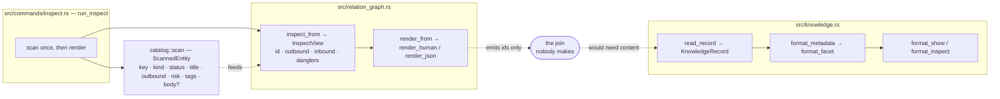

<!-- doctrine:section sec-1 -->
# Design SL-246: Entity reads carry their knowledge records

## 1. Design Problem

### A design document is no longer a whole document

Doctrine's managed design workflow split a slice's design in two. The argument
stays in the slice's `design.md`; the **rulings** moved out into knowledge
records — separate entities, one per settled decision, question, assumption,
constraint, piece of evidence, hypothesis or concept, each with its own files.

The split is deliberate and it is not the problem. A ruling that lives in its
own record can be cited by other designs, superseded on its own terms, and found
by anything that walks relations — none of which a paragraph buried in a 3,000
line document can do. The problem is that the document was left holding the
argument for conclusions it no longer contains, and nothing puts the two back
together for a reader.

`SL-244` is the specimen. Its `design.md` is 3,456 lines and cites twenty
decision records by id, quoting fragments of them inline — `DEC-121` appears
eight times as quoted phrases, because the author kept having to restate a
ruling the document could not show. Fifteen knowledge records point at the
slice. Reading that design as it stands means reading an argument whose
conclusions are somewhere else, and taking the quoted fragments on trust.

**This is the subject of the slice.** Not "render an entity's inbound records" —
that is the mechanism. The thing being fixed is that you cannot read a design.

### What is missing is a read, not a derivation

Two halves of the answer already exist, and the gap is precisely between them.

Relations are stored outbound-only and reciprocity is derived (`ADR-004`).
`doctrine inspect <ID>` is the command that derives it: a kind-agnostic view
that groups an entity's inbound edges under their derived verbs. Run against
`SL-244` it finds all fifteen records correctly — and prints their **ids**.

`doctrine knowledge show <ref>` renders a record's content, and `doctrine
knowledge inspect <ref>` renders it without the prose body. Both need a caller
that already knows which record it wants.

And between them sits the surface that should have joined them, which turns out
not to exist at all: **no verb renders a design document.** `doctrine slice
show` renders the slice's scope and excludes design, plan and notes by its own
stated contract. `doctrine slice design` is a deprecated scaffold. `doctrine
design show` is the design *run*'s turn envelope — machine state, not a
document. Reading `SL-244`'s design today means opening the file.

So the composed read has to bring its own reader.

### Target behaviour

`doctrine slice design show <SLICE> --knowledge <level>` renders the design
document, followed by the content of the knowledge records that shape it, under
an explicit level:

| level | renders |
|---|---|
| `skip` | the document alone — the default |
| `facets` | per record, the fields that say what rules and what would change whether the ruling still stands |
| `full` | the complete record |

The middle level is the one that earns the feature. On the specimen it costs
about 30% of `full` — 31.8 KB against 107 KB across the fifteen records — which
is a real saving but not an order of magnitude, so it has to be *right* about
which fields it keeps rather than merely smaller.

The same composition is available generically, one level up, on `doctrine
inspect <ID> --knowledge <level>`: any entity that carries knowledge
relationships, rendered with its records instead of their ids. That is where the
renderer lives (`DEC-145`) and where a later transitive closure will extend it.
The design read is its second caller (`DEC-260`), and the reason the slice
exists.

### Where the boundary sits

**In.** One hop. Inbound. Relation-keyed. The design document plus its records,
and the generic entity case that shares the renderer with it.

**Out.** Prose citations are not consulted: `SL-244`'s design cites roughly ten
records it holds no edge to, and closing that gap is a validate-and-warn concern
on the *authoring* path. The recursive knowledge closure — walking
record-to-record edges and halting at non-record nodes — is separate work; this
design leaves a seam for it and stops at one hop. Facet hygiene is not in scope:
where the corpus has left a record's fields unfilled, this design says so plainly
rather than compensating. And the information-architecture defect that forced the
verb's siting is carried knowingly, not fixed (`IMP-457`).

### What success looks like

Reading `SL-244`'s design at the `facets` level gives you the argument *and* the
twelve rulings that shape it, in one output, without the eleven backlog rows
that merely originated the slice — at a cost a working agent would pay on
purpose. Every existing read is unchanged, byte for byte, unless the reader asks
for more.

<!-- doctrine:section sec-2 -->
## 2. Current State

Three surfaces bear on this design. Two of them do half the job each; the third
is the corpus scan that feeds the first.

*The two halves and the missing edge between them. `inspect` derives which
records point at an entity and prints their ids; `knowledge` can render a
record's content but only when a caller already knows which record it wants.
Absent from the diagram because it is absent from the tree: any reader for
`design.md` itself — see §2.5.*

### 2.1 `doctrine inspect` derives the inbound set correctly

`inspect_from` (`src/relation_graph.rs:636`) builds the relation graph from a
pre-scanned entity slice, gates on the id actually existing, and returns an
`InspectView` (`:572`) of four fields: the queried `id`, `outbound` groups,
`inbound` groups, and `danglers`. Inbound is recomputed from `in_edges` on every
query — no reverse field is stored, per `ADR-004`.

Two properties matter downstream.

**Groups are keyed by `(label, role)`, not by label alone.** A `references` edge
groups under its role, so inbound `implements` and `concerns` stay in distinct
buckets with distinct derived verbs ("implemented by", "concerned by") instead
of collapsing into one. The group key is what the composed read will caption a
record with.

**Each group's sources are sorted by `EntityKey`** — prefix lexicographic, id
numeric — so the render is deterministic and permutation-invariant past id 999.
A composed read inherits that ordering for free.

`render_from` (`:760`) turns the view into bytes: `render_human` for the table
format, `render_json` for `--json`. The human render is built as a `Vec<String>`
of parts each carrying its own newline, joined by `concat`, and each of the three
sections is omitted when empty. `render_inbound` (`:873`) is nineteen lines: for
each group it looks up the derived verb via `relation::inbound_name(label, role)`
and prints `  <verb>: <comma-joined refs>`.

The command shell (`src/commands/inspect.rs:52`) performs one corpus scan and
shares it between the relation render and the priority actionability block it
appends below. The JSON arm builds `inspect_value(view)` and injects
`actionability` as an additive key.

Ordinary `inspect` output is roughly one line per group. That is what makes
`skip` the honest default: the surface is currently cheap enough to run without
thinking about it, and it must stay that way.

### 2.2 `knowledge` already renders a record three ways

`read_record` (`src/knowledge.rs:1637`) reads one record's `record-NNN.toml`,
parses and validates it, attaches its tier-1 relation edges, and then reads the
sibling `.md` **unconditionally** — erroring if the file is absent.
`relation_edges` (`:1654`) is the existing `pub(crate)` accessor over it, added
so callers outside the module can reach a record's edges without reaching into
its internals. It is the shape the composed read's accessor should copy.

Rendering is already tiered, and this is the useful surprise:

- `format_metadata` (`:1795`) — a pure function of the record's own state:
  identity line, slug/kind/status, dates, tags, then `format_facet`,
  `format_evidence`, and the five relation axes.
- `format_show` (`:1835`) — `format_metadata` plus the prose body.
- `format_inspect` (`:1842`) — `format_metadata` alone, no body. This is
  `doctrine knowledge inspect`, and it is very nearly the `full` level already.

`format_facet` (`:1867`) dispatches on the record kind and emits each populated
field in template order through `show_opt_line` (`:1848`) or `show_list_line`
(`:1856`). Two behaviours are load-bearing for this design:

1. **Absent fields are silent.** `show_opt_line` returns an empty string for
   `None`.
2. **An entirely unpopulated facet renders as nothing at all** — not a blank
   block, not a header. `format_facet` emits the `\n[facet]\n` header only when
   the body is non-empty.

`RecordFacet::Concept(_)` returns an empty string by construction: a concept
record has no facet fields, because every concept rides its attributed prose
body. So a concept is permanently in state (2) **by design**, and is not the
same fact as a decision whose author never filled anything in.

The JSON path disagrees with both: `facet_json` (`:1994`) emits every field,
`None` as `null`.

### 2.3 What the corpus scan carries, and what it does not

`ScannedEntity` (`src/catalog/scan.rs:105`) is the reusable half of the old
relation-graph build — the all-kind walk with no reference graph on top,
consumed by both `inspect` and the priority graph. It carries the entity key,
kind descriptor, authored status, title, outbound edges, an optional risk facet,
tags, and an optional prose body gated by `ScanMode`.

It carries **no** `RecordFacet`. Neither does `CatalogEntity`, but that struct is
not on `inspect`'s path at all, so it is not the comparison that matters.

The scan's history is a warning: `[estimate]` and `[value]` facets were parsed
here and were deleted at `SL-222`, leaving a tripwire behind to catch any
residue. Adding a facet parse back to the scan would walk that decision
backwards, and would charge every consumer — `validate`, `survey`, the priority
graph, `backlog show` — for a parse only one of them wants.

### 2.5 No verb renders a design document

`SPEC-013` imposes the uniform `<kind> <verb>` grammar over a shared verb set —
`new`, `list`, `show`, `status` — and across the corpus `show` means *render the
entity's document*. `doctrine adr show ADR-004` prints the ADR's prose.
`doctrine rfc show RFC-031` prints the RFC's. `doctrine knowledge show DEC-145`
prints the record's.

The slice is the exception, and the exception is not an accident of
implementation. A slice owns **four** documents — scope, design, plan, notes —
and `show` picks one of them. Its help text says so outright: *"Show one slice:
its metadata and scope body (not design/plan/notes)."* The other three have no
reader.

The neighbouring verbs that look like they might be one are not:

| verb | what it actually does |
|---|---|
| `slice show <ID>` | metadata + scope body; design/plan/notes excluded by contract |
| `slice design <ID>` | deprecated scaffold — now only delegates to `design materialise`, which **writes** the file |
| `design show <SLICE>` | the design **run**'s turn envelope: stage, traversal, frontier, counts, change rows |
| `design materialise <SLICE>` | renders the run's sections *into* `design.md` — a write, not a read |

So the motivating read has no surface to attach to and no adjacent verb to
widen. `DEC-260` sites it at `slice design show <SLICE>`, promoting `slice
design` to a group and retiring the deprecated leaf, which is the smallest
change that keeps `show` in the sense `SPEC-013` gives it. `IMP-457` records
that `design show` is occupying the verb this read should eventually own, and
carries the rehome to `design state`.

### 2.6 What pins the current behaviour

`SPEC-013` pins rendered output byte-exact per verb through black-box goldens.
The relevant suites are `tests/e2e_inspect_golden.rs`,
`tests/e2e_inspect_transitive_golden.rs` and `tests/e2e_knowledge_cli_golden.rs`.

`tests/e2e_inspect_golden.rs` hand-seeds a synthetic corpus in a temporary
directory rather than reading the repository's own `.doctrine/` tree, precisely
because `inspect` reads only authored TOML: fixed bytes in, byte-exact bytes out.
That existing choice is the one this design extends.

