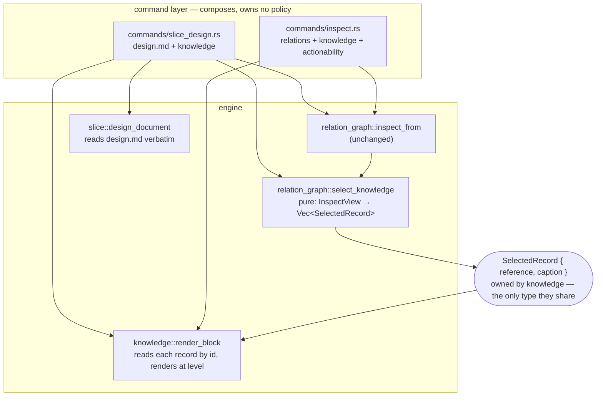
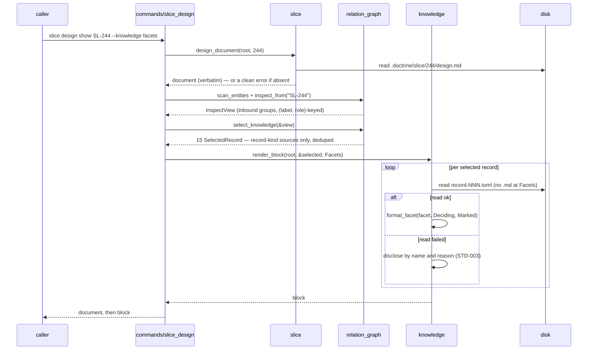

<!-- doctrine:section sec-1 -->
# Design SL-246: Entity reads carry their knowledge records

## 1. Design Problem

### A design document is no longer a whole document

Doctrine's managed design workflow split a slice's design in two. The argument
stays in the slice's `design.md`; the **rulings** moved out into knowledge
records — separate entities, one per settled decision, question, assumption,
constraint, piece of evidence, hypothesis or concept, each with its own files.

The split is deliberate and it is not the problem. A ruling that lives in its
own record can be cited by other designs, superseded on its own terms, and found
by anything that walks relations — none of which a paragraph buried in a 3,000
line document can do. The problem is that the document was left holding the
argument for conclusions it no longer contains, and nothing puts the two back
together for a reader.

`SL-244` is the specimen. Its `design.md` is 3,456 lines and cites twenty
decision records by id, quoting fragments of them inline — `DEC-121` appears
eight times as quoted phrases, because the author kept having to restate a
ruling the document could not show. Fifteen knowledge records point at the
slice. Reading that design as it stands means reading an argument whose
conclusions are somewhere else, and taking the quoted fragments on trust.

**This is the subject of the slice.** Not "render an entity's inbound records" —
that is the mechanism. The thing being fixed is that you cannot read a design.

### What is missing is a read, not a derivation

Two halves of the answer already exist, and the gap is precisely between them.

Relations are stored outbound-only and reciprocity is derived (`ADR-004`).
`doctrine inspect <ID>` is the command that derives it: a kind-agnostic view
that groups an entity's inbound edges under their derived verbs. Run against
`SL-244` it finds all fifteen records correctly — and prints their **ids**.

`doctrine knowledge show <ref>` renders a record's content, and `doctrine
knowledge inspect <ref>` renders it without the prose body. Both need a caller
that already knows which record it wants.

And between them sits the surface that should have joined them, which turns out
not to exist at all: **no verb renders a design document.** `doctrine slice
show` renders the slice's scope and excludes design, plan and notes by its own
stated contract. `doctrine slice design` is a deprecated scaffold. `doctrine
design show` is the design *run*'s turn envelope — machine state, not a
document. Reading `SL-244`'s design today means opening the file.

So the composed read has to bring its own reader.

### Target behaviour

`doctrine slice design show <SLICE> --knowledge <level>` renders the design
document, followed by the content of the knowledge records that shape it, under
an explicit level:

| level | renders |
|---|---|
| `skip` | the document alone — the default |
| `facets` | per record, the fields that say what rules and what would change whether the ruling still stands |
| `full` | the complete record |

The middle level is the one that earns the feature. On the specimen it costs
about 30% of `full` — 31.8 KB against 107 KB across the fifteen records — which
is a real saving but not an order of magnitude, so it has to be *right* about
which fields it keeps rather than merely smaller.

The same composition is available generically, one level up, on `doctrine
inspect <ID> --knowledge <level>`: any entity that carries knowledge
relationships, rendered with its records instead of their ids. That is where the
renderer lives (`DEC-145`) and where a later transitive closure will extend it.
The design read is its second caller (`DEC-260`), and the reason the slice
exists.

### Where the boundary sits

**In.** One hop. Inbound. Relation-keyed. The design document plus its records,
and the generic entity case that shares the renderer with it.

**Out.** Prose citations are not consulted: `SL-244`'s design cites roughly ten
records it holds no edge to, and closing that gap is a validate-and-warn concern
on the *authoring* path. The recursive knowledge closure — walking
record-to-record edges and halting at non-record nodes — is separate work; this
design leaves a seam for it and stops at one hop. Facet hygiene is not in scope:
where the corpus has left a record's fields unfilled, this design says so plainly
rather than compensating. And the information-architecture defect that forced the
verb's siting is carried knowingly, not fixed (`IMP-457`).

### What success looks like

Reading `SL-244`'s design at the `facets` level gives you the argument *and* the
twelve rulings that shape it, in one output, without the eleven backlog rows
that merely originated the slice — at a cost a working agent would pay on
purpose. Every existing read is unchanged, byte for byte, unless the reader asks
for more.

<!-- doctrine:section sec-2 -->
## 2. Current State

Three surfaces bear on this design. Two of them do half the job each; the third
is the corpus scan that feeds the first.


*The two halves and the missing edge between them. `inspect` derives which
records point at an entity and prints their ids; `knowledge` can render a
record's content but only when a caller already knows which record it wants.
Absent from the diagram because it is absent from the tree: any reader for
`design.md` itself — see §2.5.*

### 2.1 `doctrine inspect` derives the inbound set correctly

`inspect_from` (`src/relation_graph.rs:636`) builds the relation graph from a
pre-scanned entity slice, gates on the id actually existing, and returns an
`InspectView` (`:572`) of four fields: the queried `id`, `outbound` groups,
`inbound` groups, and `danglers`. Inbound is recomputed from `in_edges` on every
query — no reverse field is stored, per `ADR-004`.

Two properties matter downstream.

**Groups are keyed by `(label, role)`, not by label alone.** A `references` edge
groups under its role, so inbound `implements` and `concerns` stay in distinct
buckets with distinct derived verbs ("implemented by", "concerned by") instead
of collapsing into one. The group key is what the composed read will caption a
record with.

**Each group's sources are sorted by `EntityKey`** — prefix lexicographic, id
numeric — so the render is deterministic and permutation-invariant past id 999.
A composed read inherits that ordering for free.

`render_from` (`:760`) turns the view into bytes: `render_human` for the table
format, `render_json` for `--json`. The human render is built as a `Vec<String>`
of parts each carrying its own newline, joined by `concat`, and each of the three
sections is omitted when empty. `render_inbound` (`:873`) is nineteen lines: for
each group it looks up the derived verb via `relation::inbound_name(label, role)`
and prints `  <verb>: <comma-joined refs>`.

The command shell (`src/commands/inspect.rs:52`) performs one corpus scan and
shares it between the relation render and the priority actionability block it
appends below. The JSON arm builds `inspect_value(view)` and injects
`actionability` as an additive key.

Ordinary `inspect` output is roughly one line per group. That is what makes
`skip` the honest default: the surface is currently cheap enough to run without
thinking about it, and it must stay that way.

### 2.2 `knowledge` already renders a record three ways

`read_record` (`src/knowledge.rs:1637`) reads one record's `record-NNN.toml`,
parses and validates it, attaches its tier-1 relation edges, and then reads the
sibling `.md` **unconditionally** — erroring if the file is absent.
`relation_edges` (`:1654`) is the existing `pub(crate)` accessor over it, added
so callers outside the module can reach a record's edges without reaching into
its internals. It is the shape the composed read's accessor should copy.

Rendering is already tiered, and this is the useful surprise:

- `format_metadata` (`:1795`) — a pure function of the record's own state:
  identity line, slug/kind/status, dates, tags, then `format_facet`,
  `format_evidence`, and the five relation axes.
- `format_show` (`:1835`) — `format_metadata` plus the prose body.
- `format_inspect` (`:1842`) — `format_metadata` alone, no body. This is
  `doctrine knowledge inspect`, and it is very nearly the `full` level already.

`format_facet` (`:1867`) dispatches on the record kind and emits each populated
field in template order through `show_opt_line` (`:1848`) or `show_list_line`
(`:1856`). Two behaviours are load-bearing for this design:

1. **Absent fields are silent.** `show_opt_line` returns an empty string for
   `None`.
2. **An entirely unpopulated facet renders as nothing at all** — not a blank
   block, not a header. `format_facet` emits the `\n[facet]\n` header only when
   the body is non-empty.

`RecordFacet::Concept(_)` returns an empty string by construction: a concept
record has no facet fields, because every concept rides its attributed prose
body. So a concept is permanently in state (2) **by design**, and is not the
same fact as a decision whose author never filled anything in.

The JSON path disagrees with both: `facet_json` (`:1994`) emits every field,
`None` as `null`.

### 2.3 What the corpus scan carries, and what it does not

`ScannedEntity` (`src/catalog/scan.rs:105`) is the reusable half of the old
relation-graph build — the all-kind walk with no reference graph on top,
consumed by both `inspect` and the priority graph. It carries the entity key,
kind descriptor, authored status, title, outbound edges, an optional risk facet,
tags, and an optional prose body gated by `ScanMode`.

It carries **no** `RecordFacet`. Neither does `CatalogEntity`, but that struct is
not on `inspect`'s path at all, so it is not the comparison that matters.

The scan's history is a warning: `[estimate]` and `[value]` facets were parsed
here and were deleted at `SL-222`, leaving a tripwire behind to catch any
residue. Adding a facet parse back to the scan would walk that decision
backwards, and would charge every consumer — `validate`, `survey`, the priority
graph, `backlog show` — for a parse only one of them wants.


### 2.5 No verb renders a design document

`SPEC-013` imposes the uniform `<kind> <verb>` grammar over a shared verb set —
`new`, `list`, `show`, `status` — and across the corpus `show` means *render the
entity's document*. `doctrine adr show ADR-004` prints the ADR's prose.
`doctrine rfc show RFC-031` prints the RFC's. `doctrine knowledge show DEC-145`
prints the record's.

The slice is the exception, and the exception is not an accident of
implementation. A slice owns **four** documents — scope, design, plan, notes —
and `show` picks one of them. Its help text says so outright: *"Show one slice:
its metadata and scope body (not design/plan/notes)."* The other three have no
reader.

The neighbouring verbs that look like they might be one are not:

| verb | what it actually does |
|---|---|
| `slice show <ID>` | metadata + scope body; design/plan/notes excluded by contract |
| `slice design <ID>` | deprecated scaffold — now only delegates to `design materialise`, which **writes** the file |
| `design show <SLICE>` | the design **run**'s turn envelope: stage, traversal, frontier, counts, change rows |
| `design materialise <SLICE>` | renders the run's sections *into* `design.md` — a write, not a read |

So the motivating read has no surface to attach to and no adjacent verb to
widen. `DEC-260` sites it at `slice design show <SLICE>`, promoting `slice
design` to a group and retiring the deprecated leaf, which is the smallest
change that keeps `show` in the sense `SPEC-013` gives it. `IMP-457` records
that `design show` is occupying the verb this read should eventually own, and
carries the rehome to `design state`.

### 2.6 What pins the current behaviour

`SPEC-013` pins rendered output byte-exact per verb through black-box goldens.
The relevant suites are `tests/e2e_inspect_golden.rs`,
`tests/e2e_inspect_transitive_golden.rs` and `tests/e2e_knowledge_cli_golden.rs`.

`tests/e2e_inspect_golden.rs` hand-seeds a synthetic corpus in a temporary
directory rather than reading the repository's own `.doctrine/` tree, precisely
because `inspect` reads only authored TOML: fixed bytes in, byte-exact bytes out.
That existing choice is the one this design extends.

<!-- doctrine:section sec-3 -->
## 3. Forces & Constraints

### 3.1 Governance that binds

**`ADR-004` — relations are stored outbound-only; reciprocity is derived.** The
inbound set is a reverse scan recomputed on every query, never a stored
back-edge. `inspect_from` already works this way and this design inherits it:
nothing here may cache a reciprocal edge, and the selection step reads the
derivation rather than any stored field.

**`ADR-001` — module layering, leaf ← engine ← command, no cycles.** Three
placements are forced rather than chosen:

- `RecordFacet` parsing and the field-order table stay owned by `knowledge`.
  Moving either into the catalog scan would smear a kind's private schema across
  the layer that is supposed to be kind-blind.
- `relation_graph` may call down into `knowledge` (it does not today;
  `knowledge` imports nothing from `relation_graph`, so the edge is acyclic),
  but the reverse would be a cycle.
- Composition of the *design document* with the record block sits at the
  command layer, the only layer permitted to depend on both the slice's document
  reader and the record renderer — the same rule that already forces `inspect`'s
  actionability block to be appended by `commands/inspect.rs` rather than by
  `relation_graph`.

**`SPEC-013` — the CLI surface.** Two clauses bind, and they cut in different
directions:

- It owns the *shape*: the `<kind> <verb>` grammar, the byte-exact per-verb
  goldens, the JSON envelope. Any flag this design adds, and every golden that
  moves with it, is SPEC-013's business.
- It explicitly does **not** own the content: *"The per-kind `show` content —
  which facets render and how a kind reassembles its TOML and prose — belongs to
  each kind's own component."* So the field tiers of `DEC-150` are
  `knowledge`'s to decide, and the spec does not have to be amended to hold them.

The spec describes a two-level subcommand tree, and `slice design show <SLICE>`
is three levels. That is not a deviation: `doctrine slice selector
add|note|list|rm|doctor` is already a three-level group under `slice`, so the
grammar precedent exists and `DEC-260`'s siting matches it.

**`SPEC-019` — the knowledge-record entity surface** specifies four record
kinds. `EVD`, `HYP` and `CPT` are ungoverned (`ISS-316`). `DEC-150` handles that
honestly rather than inventing governance: those three have so few fields that
every one is a deciding field, so the honest subset is all of them, and for
`CPT` it is none.

**`SPEC-018`** fixes the inbound label vocabulary and the role dimension that
`(label, role)` grouping keys on.

**`STD-001` — no magic strings.** The level names, the tier annotation, and both
empty-state markers are named constants with one definition each.

**`STD-003` — no silent skip; a degraded read is disclosed.** This one reaches
further than the inquiry did, and it is the reason for `X4` below. Selection
yields a set of record ids and then reads them. A record that fails to read —
absent file, unparseable TOML — must be **tolerated** (the other records still
render) and **disclosed by name** (the reader is told which record and why). It
may not be dropped from the output, absorbed into an empty string, or counted as
"no content". Note the distinction this design must hold: a record that *cannot
be read* and a record whose author left the facet *empty* are different facts
and get different treatment — the first is STD-003's, the second is
`DEC-149`'s.

**`STD-002`** governs the naming; **`PRD-019`** and **`PRD-010`** are why the
records exist at all.

### 3.2 Constraints on the change

- **`C1` — the default is byte-identical.** `skip` must reproduce today's bytes
  exactly, on every verb this design touches, in both table and JSON. `DEC-146`
  buys this by construction rather than by care: the level flag that asks for
  content is the same flag that pays for it.
- **`C2` — the behaviour-preservation gate.** `format_facet` and `format_metadata`
  are shared machinery; the existing kind-`show` and `knowledge` suites are the
  proof and must stay green **unchanged**. `SL-246` does not alter `knowledge
  show`'s output — the concealing behaviour there belongs to `IMP-403`.
- **`C3` — read-only.** Nothing on this path writes. That is worth stating
  because the verb being repurposed, `slice design`, currently *writes*: it
  delegates to `design materialise`. Retiring the leaf removes the write; the
  group's `show` must not inherit it.
- **`C4` — one renderer, one field-order table.** The levels cannot be allowed to
  disagree about which fields exist or in what order, so they must be bounds on
  one code path, not two implementations. This is the `Detail::{Normal, Full}`
  precedent in `src/design_run/render/envelope.rs`, whose own comment states the
  principle.
- **`C5` — the corpus scan is not widened.** `ScannedEntity` gains no
  `RecordFacet` (`DEC-146`).
- **`C6` — the seam must extend, not be replaced.** `IMP-398` S5's transitive
  knowledge view writes a second *selection* and reuses the renderer untouched
  (`DEC-147`, objective 3). No depth parameter and no traversal abstraction
  enters this slice.
- **`C7` — `read_record` reads the `.md` unconditionally** and errors when it is
  absent (`src/knowledge.rs:1647`). The `facets` level never renders prose, so it
  either pays for a body it discards or the accessor grows a facet-only path.

### 3.3 Forces in tension

**`F1` — what the corpus scan already costs, versus what `DEC-146` assumed.**
This is a correction the drafting stage found, and it changes an argument
without changing the decision.

`scan_entities` calls `outbound_for` per entity (`src/catalog/scan.rs:192`),
which for a record prefix dispatches to `knowledge::relation_edges` (`:65`) →
`read_record`. So **every corpus scan already reads, parses and validates all
360 knowledge records — around 964 KB of prose bodies — and keeps only their
relation edges.** `doctrine inspect SL-244` pays that before it prints anything,
and completes in about 220 ms end to end.

Two consequences. `DEC-146`'s stated cost — *"2 file reads per selected record…
zero at the `skip` default"* — describes reads that are **not new**; the scan has
already read those same records moments earlier and thrown the content away. And
`DEC-146`'s rejection of the scan-carried arm rested on *"every corpus scan pays
the parse, including `validate`, `survey`, the priority graph and `backlog
show`, none of which want it"* — but they already pay it.

The decision survives, on a repaired argument: what the scan-carried arm would
add is not the parse but **retention** — holding 360 parsed records in memory for
every consumer, to save a dozen re-reads that measurement puts deep in the noise.
Per-id reads at the render layer remain right, and `C7`'s facet-only path becomes
the more interesting half of the question, since it is the seam that would let
`IMP-459` stop the scan reading a megabyte of prose it discards.

**`F2` — honesty versus noise in the empty case.** Four of the specimen's fifteen
records render nothing at the `facets` level, and a marker on each is the honest
answer (`DEC-149`). But `CPT` is permanently in that state *by construction* —
a concept has no facet fields because its prose body is the payload — so one
marker for both cases would libel every concept in the corpus and train readers
to ignore the marker. Two markers, and `STD-003` adds a third distinct state:
the record that could not be read at all.

**`F3` — cost versus completeness.** The `facets` level costs ~30% of `full` on
the specimen, not the order of magnitude first assumed. A level that saves 70%
has to be *right* about what it keeps; `DEC-150`'s criterion — what rules, and
what would change whether the ruling still stands — is doing the work that the
size argument alone cannot.

**`F4` — generality now versus the closure later.** Every line of traversal
abstraction written now for `IMP-398` S5 is speculative; every coupling to
`RelationLabel` written now is a refactor S5 must undo. `DEC-147` resolves this
at one point only: the caption is selection-supplied *text*, because at one hop
it is an inbound label and at depth three it is a path.

**`F5` — building on an information architecture known to be wrong.** The read
this slice exists to deliver has to be sited around `design show` meaning the run
envelope and `slice show` meaning the scope. `DEC-260` takes the cheap local
answer and `IMP-457` carries the rehome. The tension is real and is being
deliberately deferred, not resolved.

<!-- doctrine:section sec-4 -->
## 4. Guiding Principles

Six principles, each with a concrete consequence in §5. They are the tie-breakers
this design reaches for when two shapes both work.

**P1 — Route to what exists before building.** The inbound derivation, the
`(label, role)` grouping, the deterministic source ordering, the per-kind record
render and its field-order table are all already written and already tested.
Most of this slice is wiring, and the parts that look like new code should be
suspected of being duplication first. The one genuinely new thing is a reader
for a document that has never had one.

**P2 — One code path, bounded; never two that could agree today.** The three
levels are bounds on a single renderer over a single field-order table. Two
implementations that currently produce consistent output are a defect waiting for
the next field to be added to one of them.

**P3 — The reader pays only for what they asked for.** `skip` is the default and
is byte-identical to today's output. Every cost this design adds is behind a flag
whose presence *is* the consent. This is what makes the byte-identical default a
property of the structure rather than a promise someone has to keep.

**P4 — Render for the corpus we intend, and state the gap.** Where a record's
facet is unfilled, say so and move on. Do not fall back to prose, do not
backfill, and do not silently omit. A renderer built around the corpus's current
defects bakes them in and has to be undone when they are fixed; a renderer that
marks them costs nothing once they are, because the marker simply stops firing.

**P5 — Different facts get different words.** Three empty states arrive at the
renderer and they are not the same thing: an author left the facet blank, the
kind has no facet by design, or the record could not be read. Collapsing them
into one message is what turns a marker into noise the reader learns to skip.

**P6 — Seam for the next caller; abstract for none.** The selection/rendering
split exists because a second and third caller are already known — the generic
`inspect` case, the design read, and later the transitive closure. It goes
exactly as far as making the renderer indifferent to how its input was selected,
and no further. No depth parameter, no traversal trait, no label-keyed renderer.

<!-- doctrine:section sec-5 -->
## 5. Proposed Design

### 5.1 System Model

Three pieces, split where `DEC-147` says to split: **selection** decides which
records and what to call them; **rendering** turns records into bytes; the
**command layer** composes a subject with the rendered block. Selection and
rendering never meet except through a value type.



*Ownership, and the one type that crosses. `SelectedRecord` is defined in
`knowledge` so that `relation_graph` depends on `knowledge` and never the
reverse — the edge is acyclic today and this keeps it so.*

Two things the diagram is making a point of.

**Selection is pure.** It takes an `InspectView` that has already been derived
and returns a list. It performs no reads, so a second selection — the design
read's, and later the transitive closure's — is a pure function to write, not a
second traversal to maintain.

**The command layer owns composition and no policy.** It decides *what to put
next to what*; it never decides which fields render or what an empty facet
means. This is forced, not preferred: `catalog::scan::outbound_for` already
calls `slice::relation_edges`, so a handler living in `src/slice.rs` that
reached into `relation_graph` would close a cycle. The composition has to be one
layer up, which is where `commands/inspect.rs` already appends its actionability
block for the identical reason.

### 5.2 Interfaces & Contracts

#### The level

```rust
// src/knowledge.rs — STD-001: the three names have one definition.
/// How much of each inbound knowledge record a composed read carries.
#[derive(Clone, Copy, PartialEq, Eq, Default)]
pub(crate) enum KnowledgeLevel {
    /// No knowledge block. Byte-identical to the pre-SL-246 surface.
    #[default]
    Skip,
    /// Per record: the fields that say what rules, and what would change
    /// whether the ruling still stands (DEC-150). Never reads the `.md`.
    Facets,
    /// The complete record, prose body included.
    Full,
}

impl KnowledgeLevel {
    pub(crate) fn as_str(self) -> &'static str { … }   // "skip" | "facets" | "full"
}
```

`Default` is `Skip`, which is `C1` expressed in the type rather than remembered
at each call site.

#### Selection

```rust
// src/knowledge.rs — the shared value type, defined here so the dependency
// runs relation_graph → knowledge and never back.
/// One record chosen for a composed read, with the text it renders under.
/// `caption` is TEXT, not a `RelationLabel` (DEC-147): at one hop it is the
/// derived inbound verb; at depth N it will be a path, and the renderer must
/// not have to change to learn that.
pub(crate) struct SelectedRecord {
    pub(crate) reference: String,   // canonical ref, e.g. "DEC-145"
    pub(crate) caption: String,     // e.g. "shaped_by", "concerned by"
}

// src/relation_graph.rs
/// Select the knowledge records pointing at the inspected entity — pure over an
/// already-derived view. Filters on the SOURCE prefix via `kinds::is_record`
/// (DEC-148), keeps the view's group order and each group's `EntityKey` sort,
/// and deduplicates by reference with the first caption winning.
pub(crate) fn select_knowledge(view: &InspectView) -> Vec<SelectedRecord>;
```

Dedup belongs here and not in the renderer (`DEC-147`): `EVD-012` already
arrives under two inbound labels at one hop on the specimen, and at N hops a
record arrives at several depths. Keeping it in selection leaves the renderer
ignorant of traversal entirely.

#### Rendering

```rust
// src/knowledge.rs
/// Render the knowledge block for a composed read. Reads each selected record
/// by id — the kind-module accessor, sibling of `relation_edges` (DEC-146) —
/// and renders it at `level`.
///
/// TOTAL: never returns `Err`. A record that cannot be read is disclosed in
/// place, by name and reason, and the remaining records still render (STD-003).
/// `Skip` returns the empty string without reading anything.
pub(crate) fn render_block(
    root: &Path,
    selected: &[SelectedRecord],
    level: KnowledgeLevel,
) -> String;
```

The totality is the design's expression of `STD-003`, not a convenience: a
composed read that bailed on one unreadable record would deny the caller the
other fourteen, and one that dropped it silently would launder a corpus defect
into a well-formed answer.

`Facets` reads only `record-NNN.toml`. This is `C7` discharged: `read_record`
reads the `.md` unconditionally and errors when it is absent, so `render_block`
takes a facet-only path at `Facets` rather than paying for a body it discards.
That path is the seam `IMP-459` would later ride to stop the corpus scan reading
a megabyte of prose it throws away.

#### The tiered facet render

`format_facet` gains two policy inputs and stays the single field-order table
(`C4`, `DEC-150`):

```rust
/// Which tier a facet field belongs to. Annotated on each field line inside
/// the existing per-kind match — NOT a separate field-list constant, which
/// could drift from the order table beside it.
enum Tier { Deciding, Argument }

/// How a facet with nothing to show is rendered.
enum EmptyPolicy { Silent, Marked }

fn format_facet(facet: &RecordFacet, tier: TierFilter, empty: EmptyPolicy) -> String;
```

`knowledge show` passes `(all tiers, Silent)` and its goldens stay byte-identical
(`C2`). The composed read passes `(Deciding, Marked)` at `Facets` and
`(all tiers, Marked)` at `Full`.

The per-kind tiers are `DEC-150`'s: `DEC` context/choice/rationale; `QUE`
question/why_matters/answer; `CON` statement/source/applies_to/waiver_reason;
`ASM` claim/confidence/basis/invalidated_by; `EVD` all three; `HYP` both; `CPT`
none.

#### The three empty states

`DEC-149`'s two markers plus `STD-003`'s third. Each is a named constant, and
they must not share wording (`P5`):

| state | rendered |
|---|---|
| author left the facet unfilled | `(no facet recorded — 6.7 KB of prose: doctrine knowledge show QUE-206)` |
| the kind has no facet by design | `(no facet by design — a concept rides its prose body)` |
| the record could not be read | `(unreadable: record not found at …/record-140.toml)` |

The prose-size hint costs a `metadata()` call, not a read — which is what keeps
it compatible with `Facets` never opening the `.md`.

#### Command grammar

```
doctrine inspect <ID> [--knowledge <skip|facets|full>]
doctrine slice design show <SLICE> [--knowledge <skip|facets|full>] [--json]
```

`--knowledge` defaults to `skip` on both. `slice design` is promoted from a leaf
verb to a group (`DEC-260`); its deprecated scaffold leaf retires, and the
three-level grammar matches the existing `slice selector add|note|list|rm|doctor`
precedent.

The JSON arm carries the same level, structurally rather than as rendered text:
`inspect --json` gains an additive `"knowledge"` key, and `slice design show
--json` emits `{ "kind": "slice-design", "slice", "document", "knowledge" }`.
Each entry is `{ reference, caption, facet | null, marker?, body? }`, tier-filtered
at `Facets` exactly as the table is. Table and JSON agreeing is deliberate: the
existing divergence between `format_facet` and `facet_json` — one silent, the
other emitting every field as `null` — is the defect this design must not repeat.

### 5.3 Data, State & Ownership

There is no state. Every surface here is read-only, nothing is cached across
invocations, and nothing is written — which is worth stating because the verb
being repurposed currently *writes* (`C3`): the retired leaf delegated to
`design materialise`. The group's `show` must not inherit that.

Ownership, restated as a rule per module:

| module | owns |
|---|---|
| `knowledge` | `RecordFacet`, the field-order table, the tiers, the three markers, `SelectedRecord`, `KnowledgeLevel`, `render_block` |
| `relation_graph` | the inbound derivation (unchanged) and `select_knowledge` |
| `slice` | reading `design.md` off disk |
| `commands/*` | composition and flag lowering; **no policy** |

Within one render pass a record is read at most once — guaranteed by dedup in
selection, not by a cache. There is no cache.

### 5.4 Lifecycle, Operations & Dynamics



The order of the two reads is deliberate. The document is read first so a slice
with no design fails immediately and cheaply, before a corpus scan is paid for.

### 5.5 Invariants, Assumptions & Edge Cases

**Invariants.**

- `I1` — at `Skip`, output is byte-identical to the pre-SL-246 surface, in both
  formats, on every affected verb. Structural: `Skip` returns before any read.
- `I2` — the `Facets` field set is a subset of `Full`'s, in the same order. By
  construction: one field-order table with a tier filter (`C4`).
- `I3` — each record appears at most once per render, under the caption of the
  first group it was reached through.
- `I4` — output is deterministic and permutation-invariant: group order from
  `RelationLabel`'s `Ord`, sources by `EntityKey` (prefix lexicographic, id
  numeric — correct past id 999).
- `I5` — a selected record that cannot be read is named in the output. It is
  never dropped, never rendered as empty, and never aborts the block.
- `I6` — the three empty states render three distinct messages.
- `I7` — nothing on this path writes.

**Edge cases.**

- `X1` — **inbound record set is empty.** At `Facets`/`Full`, say so explicitly
  (`(no knowledge records point at SL-999)`) rather than omitting the block. The
  reader asked; silence would be indistinguishable from a bug.
- `X2` — **the slice has no `design.md`.** A clean error naming the repair —
  `SL-999: no design document (doctrine design start SL-999)` — not an empty
  document.
- `X3` — **`design.md` is behind its design run.** Open; see §6 `OQ-1`.
- `X4` — **a record is reachable under two labels and renders nothing.** One
  entry, one marker. `I3` settles it before the renderer sees it.
- `X5` — **a `CPT` in the selection.** Renders the by-design marker, never the
  unfilled one, at every level. At `Full` its prose body is the content, so the
  marker sits above a body rather than instead of one.
- `X6` — **the subject is a record itself.** `Shapes` legally targets record
  kinds, so `inspect DEC-145 --knowledge facets` is well-formed and renders one
  hop. It does not recurse; that is `IMP-398` S5.
- `X7` — **a malformed `[facet]` table.** `read_record` already validates; a
  validation failure is `I5`'s disclosure path, not a panic and not a partial
  facet.

**Assumptions.**

- `A1` — the inbound edge set is a sufficient proxy for "the knowledge that
  shapes this entity", accepting the ~10 cited-but-unlinked records on the
  specimen as a known, separately-tracked miss.
- `A2` — reading the design document verbatim, markers included, is preferable
  to parsing it. `design_run::document::parse` can refuse seven ways on a
  hand-edited file, and handing a reader a refusal instead of their document is
  a worse failure than showing them an HTML comment. See §7.

### 5.6 Code Impact

| path | change |
|---|---|
| `src/knowledge.rs` | `KnowledgeLevel`, `SelectedRecord`, `render_block`, the facet-only read path, `Tier`/`EmptyPolicy` on `format_facet`, the three marker constants |
| `src/relation_graph.rs` | `select_knowledge` — pure, over `InspectView` |
| `src/kinds/mod.rs` | none expected; `is_record` (`:128`) is consumed as-is |
| `src/commands/inspect.rs` | `--knowledge` on `InspectArgs`; compose relations + block + actionability |
| `src/commands/slice_design.rs` | **new** — the `slice design show` handler |
| `src/slice.rs` | `SliceCommand::Design` becomes a group with `Show`; the deprecated leaf and `scaffold_design_doc` retire; a `design_document` reader |
| `src/commands/design.rs` | `run_deprecated_slice_design` retires |
| `src/commands/cli.rs` | the residual `SliceCommand::Design` dispatch arm (`:1531`) **deletes** |
| `tests/e2e_inspect_golden.rs` | synthetic-corpus goldens at all three levels (`DEC-151`) |
| `tests/e2e_slice_design_show_golden.rs` | **new** — the composed design read |
| `tests/e2e_knowledge_cli_golden.rs` | unchanged — the `C2` proof |

The `cli.rs` row is a payoff rather than a cost. That residual arm exists only
because the deprecated leaf had to forward through `design materialise`, which
`crate::slice` could not reach without closing a cycle. Retiring the leaf
removes the forward, so `SliceCommand::Design` routes through `slice::dispatch`
like every other slice verb and a documented `ADR-001` workaround goes with it.

