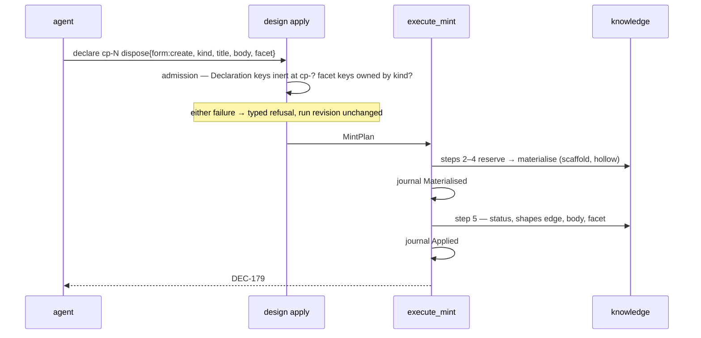

<!-- doctrine:section sec-1 -->
# 1. Design Problem

Between a ruling being known and a record holding it, Doctrine loses content —
twice, silently, and at the moment the content is most available.

The **structured tier has no writer.** `doctrine knowledge` offers `new | list |
show | inspect | status | paths`. Filling a `[facet]` means hand-editing TOML,
and the corpus records the result: decision facets 35/142 populated, question
4/38, and `answer`/`answered_by`/`answered_on` on `QUE` at **0 of 38**.
Population is binary and lock-step — a record carries every textual field or
none — which is the signature of a population that either engaged the tier
deliberately or never touched it at all.

The **design-run wire has no slot.** `CreateRecord` accepts `kind`, `title`,
`slug` and `acceptance`. An agent disposing a checkpoint holds the ruling in
hand as it writes, and has nowhere to put it. On SL-248's run six dispositions
reached for the nearest-looking key and sent their prose as `body`;
`Declaration::body` is *section* prose, read only behind a guard on
`derived.section_digests`, so on a `cp-` subject it was accepted and discarded.
`DEC-155`…`DEC-160` minted hollow and ~15k tokens were re-authored. The operator
caught it, not the tool.

The two are one story — a missing slot and a silent sink — and fixing the sink
alone converts a silent loss into a dead end.

What must be true at the end:

- Every facet field of every facet-bearing kind is writable through a verb, and
  the prose tier with it.
- A `form = "create"` disposition mints a record already holding its facet and
  its prose, in one act.
- A wire key that is inert at its subject's kind is refused at submission,
  across the whole field set rather than at the instances someone noticed.
- The kinds the corpus actually has are the kinds governance describes, and that
  correspondence is checked by something other than a promise.

<!-- doctrine:section sec-2 -->
# 2. Current State

## The read side is complete, and stays put

`src/knowledge.rs` carries the whole structured read model: `RecordFacet` as an
enum-of-structs with one variant per kind, four closed value-enums (`Confidence`,
`Basis`, `ConstraintSource`, `Provenance`), a kind-blind `RawFacet` superset for
the tolerant parse, `validate_facet` dispatching on `record_kind` through the
`"" -> None` seam, and a `#[cfg(test)]` `render_facet` pinning the byte-stable
round-trip. `A1` assumes this is sound and unchanged; nothing below revises it.

The facet field inventory it defines is the fact that shapes the CLI surface:
**31 slots, 30 distinct names, exactly one shared** (`confidence`, on assumption
and evidence) — assumption 8, decision 7, constraint 6, question 5, evidence 3,
hypothesis 2, concept 0.

## The write side is a single module with a single consumer

`src/facet_write.rs` holds `set_facet_mixed` / `apply_set_mixed`, a mixed-type
`[facet]` writer over `toml_edit`, serving `doctrine risk set` at
`src/commands/facet.rs:711`. Its `deletes at SL-222 deletion phase` marker covers
only three float-valued symbols and its reason string's premise is false; that is
`CHR-056`, not this slice. The module is **anchored by no spec** — no `sources`
list names it and the string appears nowhere in the authored corpus. Its only
governance is `SPEC-004`'s edit-preserving clause. (`inq-9`, open.)

Two write postures already exist and are distinguished deliberately in
`src/dep_seq.rs`: `apply_status` refuses a missing key (F-1: scaffold-seeded,
edit in place, never create), `apply_scalar` creates one. `DEC-170` rules facet
fields into the first class.

## The status verb is deliberately uncoupled

`set_record_status` documents itself: *"No resolution coupling: `status` and
`updated`, nothing else."* So a question reaches `answered` with its answer
fields empty, which is exactly the 0-of-38 above. `accepted_status` is the
counter-example worth noticing — it derives a per-kind answer from the kind's own
vocabulary rather than enumerating one, and says so.

## The design-run wire

`CreateRecord` (`src/design_run/submission.rs`) carries `kind`, `title`, `slug`,
`acceptance` — no facet, no prose. `Declaration` carries
`#[serde(deny_unknown_fields)]` (`A2`, confirmed), so an unknown key is already
refused; what is *not* refused is a **known** key inert at the subject's kind,
which is `ISS-318`. Its two observed instances are `body` on a `cp-` subject
(accepted and discarded) and `dispose` on an `inq-` subject (skipped by
`plan_checkpoints`, `src/commands/design.rs:882`).

Record creation runs through DEC-086's step sequence: reserve → materialise →
apply effects. `create_record` is the single fresh-creation path for all seven
kinds and its own doc forbids a second reservation+scaffold path;
`apply_record_effects` is step 5, already idempotent, already applying the
acceptance→status move and the `shapes` edge.

## Governance as it stands

`SPEC-019` is emphatically four-kind, repeating "four" at nine sites, and carries
a now-false self-description (*"forward-intent: no code is shipped yet"*).
`PRD-010` § 4 carries the same enumeration plus an extension rule. The corpus has
seven kinds. `SL-159` (`EVD`+`HYP`) and `SL-197` (`CPT`) each ruled their
contracts in a closed slice's design and neither landed the governance axis it
scoped — the debt this slice pays (`inq-7`, open on whether it discharges them
by name).

<!-- doctrine:section sec-3 -->
# 3. Forces & Constraints

## Binding

- **`SPEC-004`** — mutating verbs write entity TOML **edit-preservingly**. Ride
  `toml_edit`; never reserialise. This is the one clause governing
  `src/facet_write.rs` today.
- **`DEC-170`** — F-1 posture on facet fields: refuse an absent key, never
  create it; spell a cleared value as `""`, never by omission. Facet fields are
  scaffold-seeded, so an absent one is damage. `set_facet_mixed` currently
  *creates* missing keys, so riding it needs either a call-site guard or a
  posture parameter.
- **`DEC-088`** — a decision reaches `accepted` only through a content-bound user
  attestation applied at step 5. No verb this slice adds may offer a second
  route.
- **`DEC-168`** — the facet-and-prose write happens at step 5
  (`apply_record_effects`), not by pre-filling the scaffold. Forced by
  crash-resume: `materialise_record_at` re-scaffolds from a journal carrying only
  id, title and slug.
- **`ADR-013`** — the governance amendment routes through a REV landing at
  reconcile, over **two** entities (`SPEC-019`, `PRD-010` — `DEC-175`).
- **`ADR-004` / `SPEC-018`** — `link`/`unlink` own relations; `edit` does not
  touch them.
- **`ADR-001`** — leaf ← engine ← command, no cycles. The pure write seam is a
  leaf; the CLI verbs and the design-run wire are both consumers of it.
- **`STD-001`** — no magic strings. Every field name, status token and kind
  prefix in this design must have exactly one spelling with one owner.
- **`POL-002`** — platform independence: no host-project convention (cargo
  layout, `just` recipes) leaks into engine rules. `DEC-176`'s canary is a
  project-local test, never a `validate` rule.

## Not binding, and worth stating

- **`SPEC-013`** owns the uniform `<kind> <verb>` grammar but states no
  convention for field-mutation verbs. `memory edit` / `backlog edit` are
  precedent, not governance, so the subverb shape and `settle` are unconstrained
  by it.
- **`PRD-019` / `SPEC-029`** govern the design run's identity, idempotency and
  revision-CAS and say nothing about what a created record is *populated* with.
  Objective 2 is ungoverned space, not prohibited space.

## Mechanical

- **Rust has no reflection over struct fields.** Any correspondence between a
  type's fields and something else is authored, and the design question is only
  how it is kept total (`DEC-169`).
- **`Declaration` carries `deny_unknown_fields`; `ApplyRequest` cannot** (it
  carries a `#[serde(flatten)]` envelope). The facet payload therefore lands
  inside `Declaration`, where the guard already holds.
- **Serde's `skip_serializing_if` is total over `Declaration`**, so a
  fully-populated value serialises to exactly the wire key set — the pin
  `DEC-169` uses instead of a proc macro.
- **A `toml_edit` root insert-if-missing is safe; a subtable-nested one is not**
  (`mem_019ee9fd51d87aa38a2dfb31ad6c4eec`, which scopes its own proof and says
  so). `[facet]` fields are subtable-nested, which is why F-1 stands.

## Pressures in tension

The slice exists to close a live data-loss hole, and the user's standing
tie-breaker is to prefer whichever defensible answer lands that fix sooner. Set
against it: this design touches shared machinery (the entity engine, the design
run wire) where the behaviour-preservation gate applies, and it writes governance
that outlives the fix. `DEC-165`'s phase boundary is how both are honoured — the
wire fix ships first and alone, the facet-bearing surfaces follow.

<!-- doctrine:section sec-4 -->
# 4. Guiding Principles

Five, each earned by a ruling this run took rather than asserted as taste.

**Derive the correspondence; do not declare it.** Three separate tables sit in
this design — wire keys against subject kinds, facet keys against record kinds,
status tokens against their evidence fields. Every one of them is authored,
because Rust gives no reflection; none of them may be *checked* by hand. `serde`
key sets pin the first (`DEC-169`), name correspondence derives the third
(`DEC-178`), and the second is pinned against the typed model. A table that can
silently miss a new field is `ISS-318` recurring inside its own fix.

**Refuse where the operator is; report where the reader is.** The same damage
warrants opposite treatment on the two paths. A write-time refusal fires at the
record it names, with someone holding the thing that caused it (`DEC-170`). A
read-time refusal fires at every later reader of an unrelated record and breaks
the tool you would use to diagnose it (`DEC-177`). Symmetry is not the goal;
locality of the report is.

**One table, many consumers — never one table per consumer.** The per-kind facet
field sets are needed by the six subverbs, by `settle`'s coverage, and by the
doctor tripwire. Three hand-maintained copies is the failure this slice is
already paying for elsewhere.

**Make the wrong call unrepresentable where it costs nothing; refuse it clearly
where it does.** Per-kind subverbs make a wrong-field error unspellable, and
relocate rather than remove the kind-mismatch check — accepted, because the check
is one comparison against a value the id already resolves. Where a refusal is
what is left, it teaches: *"`ASM-003` is an assumption; use `knowledge edit
assumption`."*

**Ship the fix ahead of the governance that describes it.** `DEC-165`: the
rulings gated, objective 4 never did. The phase boundary is load-bearing and the
plan must hold it — the wire fix may not quietly absorb facet work to save a
phase.

<!-- doctrine:section sec-5 -->
# 5.1 System Model

## The shape of the change

One authored table, one pure write seam, four consumers. Nothing here is a new
subsystem; every box below already exists except the table.

```
                    ┌──────────────────────────────────────────┐
                    │ src/knowledge.rs                          │
                    │                                           │
  read (unchanged)  │  RawFacet ──validate_facet──▶ RecordFacet │
                    │      ▲                            ▲       │
                    │      │ serde key-set pin (P1)     │ P2    │
                    │  ┌───┴───────────────────────┐    │       │
                    │  │ facet_fields(kind)        │────┘       │
                    │  │ the authored partition    │            │
                    │  └───┬────────┬─────────┬────┘            │
                    └──────┼────────┼─────────┼─────────────────┘
                           │        │         │
              ┌────────────┘        │         └──────────────┐
              ▼                     ▼                        ▼
   six `edit <kind>` subverbs   `settle <ID> <state>`   doctor tripwire
   + kind-blind `edit <ID>`     (coverage derived)      (inert-key warning)
              │                     │
              └──────────┬──────────┘
                         ▼
              src/facet_write.rs  ── toml_edit, F-1 guarded ──▶  record-NNN.toml
                         ▲
                         │ (same seam, second caller)
              apply_record_effects (DEC-086 step 5)  ◀── CreateRecord{facet, body}
```

## The authored table

The one artefact this design adds:

```rust
/// One facet field: its key, and the shape the writer must emit.
pub(crate) struct FacetField {
    pub(crate) name: &'static str,
    pub(crate) shape: FieldShape,
}

pub(crate) enum FieldShape {
    Text,
    List,
    Closed(&'static [&'static str]),   // the variant tokens, from the enum's own serde form
}

/// Every field one record kind owns, in template order — the single authored
/// derivation of the per-kind field sets (STD-001).
pub(crate) fn facet_fields(kind: RecordKind) -> &'static [FacetField];
```

It lives in `src/knowledge.rs`, adjacent to `validate_facet`, because the table
*is* the data form of what that function's arms already say in code. Splitting
them across modules is how the two drift. (Cohesion pressure noted: that module
also carries the knowledge CLI, since there is no `src/commands/knowledge.rs`.
This design does not relayer it; see § 8.)

Authoring is forced — Rust has no reflection over struct fields, and `DEC-169`
already refused a proc macro written for one table. So the design question is
only how it is kept honest, and there are two independent pins:

- **P1 — union totality.** Derive `RawFacet`'s serde key set (it gains
  `Serialize`; every field is already `#[serde(default)]`) and assert it equals
  the union of `facet_fields` over `RecordKind::ALL`. A facet field added to the
  model and forgotten in the table is a test failure, not a silent absence. This
  is `DEC-169`'s read-through-serde idiom, second application.
- **P2 — per-kind placement.** For each kind, write every field the table gives
  it, read the record back through the untouched `validate_facet`, and assert the
  typed facet holds it. A field filed under the wrong kind is discarded on read —
  so P2 catches exactly what P1 cannot, using the read model as the oracle rather
  than a second list.

P1 and P2 together make the table total *and* correctly partitioned without any
name being typed twice.

## What each consumer takes from it

| consumer | reads | derives |
|---|---|---|
| `knowledge edit <kind>` | `facet_fields(kind)` | its flag set; a test asserts clap's arg names equal the table's |
| `knowledge settle` | `facet_fields(kind)` | settleable states, by `<state>_by`/`<state>_on` name lookup (`DEC-178`) |
| `doctor` tripwire | all kinds | key → honouring kind, for the warning message (`DEC-177`) |
| step-5 write | `facet_fields(kind)` | shape dispatch for the `toml_edit` emit |

This is what discharges the rider `DEC-177` and `DEC-178` both carry: the table
exists as data, so neither falls back.

## The write mechanism

`src/facet_write.rs::set_facet_mixed` is the mechanism, already live under
`doctrine risk set`, already `toml_edit` and therefore already edit-preserving
per `SPEC-004`. It creates missing keys, which `DEC-170` forbids for facet
fields. The seam gains a **posture parameter** rather than a guard at each call
site: one enum threaded to the insert decision, `RiskFacet`'s caller passing the
creating posture it has today and knowledge passing F-1. A call-site guard would
have to be repeated by every future caller and would be the parallel
implementation `AGENTS.md` forbids.

## The phase boundary

`DEC-165` splits the slice and the split is load-bearing, not cosmetic:

- **Phase A — the wire fix, no facet anywhere.** Objective 3's inert-key refusal
  (`Declaration` keys × design-run subject kinds, `DEC-169`'s serde-pinned table)
  plus the prose half of objective 2 (`CreateRecord.body` written at step 5 via
  the existing `entity::write_body`). Neither touches a record kind, a facet, or
  knowledge governance. Together they are exactly what would have prevented the
  SL-248 loss.
- **Phase B onward — the facet surfaces.** The table, the six subverbs, the
  kind-blind `edit`, `settle`, `CreateRecord.facet` at the same step-5 site, and
  the doctor tripwire.

The plan must hold the boundary: Phase A may not absorb facet work to save a
phase.

<!-- doctrine:section sec-6 -->
# 5.2 Interfaces & Contracts

## The CLI surface

Three shapes, splitting by *tier* as `OQ-1` settled — invariant fields
kind-blind, `[facet]` kind-dispatched — plus the coupled transition.

```
doctrine knowledge edit <ID> [--title T] [--tags a,b] [--body B|-] [--body-mode replace|append]
doctrine knowledge edit <kind> <ID> [--<field> V]…          # six kinds; flags = that kind's fields
doctrine knowledge settle <ID> <state> --by WHO [--<text-field> V]
```

Flag names are the field's own name, kebab-cased — `--validation-plan`,
`--waiver-reason`, `--decided-by`. No flag name is authored: the subverb builds
its arg set from `facet_fields(kind)`, and a test asserts clap's arg names equal
the table's, so the two cannot drift. This refines `DEC-178`'s illustrative
`--reason` to `--waiver-reason`; the ruling's substance is untouched.

`--body` / `--body-mode` (`replace` | `append`, `-` reads stdin) are lifted from
`memory edit` unchanged, and ride `entity::write_body`, which that verb already
uses. Nothing new on the prose tier.

## What `settle` derives, and the one thing it does not

`DEC-178` derives *coverage*: a state is settleable when the kind's facet carries
`<state>_by` and `<state>_on`. That is mechanical over `facet_fields` and yields
exactly four transitions.

It does not derive *which field holds the outcome*. `QUE`'s is `answer`, `CON`'s
is `waiver_reason`, and no naming rule connects either to its state token without
contrivance. So one small annotation is authored beside the table:

```rust
/// A resolving transition: its state, and the field whose content the
/// transition exists to capture. The actor/date pair is NOT here — it is
/// derived from the state token (DEC-178).
pub(crate) struct Settlement {
    pub(crate) state: &'static str,
    pub(crate) captures: Option<&'static str>,
}
pub(crate) fn settlements(kind: RecordKind) -> &'static [Settlement];
```

Four rows: `QUE` answered/`answer`, `ASM` validated/none, `ASM`
invalidated/none, `CON` waived/`waiver_reason`. Pinned two ways — every
`captures` name must appear in `facet_fields(kind)`, and the set of `state`
tokens must equal the set the by/on derivation yields. The second pin is the one
that matters: it means the annotation can add detail to the derived set but
cannot quietly extend it.

Stating this plainly rather than claiming full derivation: `DEC-178`'s reach
ruling stands, and the honest scope of "derived" is the coverage, not the whole
row.

## The pure seam

```rust
/// A caller's raw field assignment, before the table has seen it.
pub(crate) struct RawEdit<'a> { pub(crate) field: &'a str, pub(crate) value: RawValue }
pub(crate) enum RawValue { Text(String), List(Vec<String>) }

/// One validated mutation, ready to write.
pub(crate) struct FacetEdit { pub(crate) field: &'static FacetField, pub(crate) value: RawValue }

/// Validate raw assignments against the kind's table: every field is owned by
/// this kind, every `Closed` value parses to a variant, every `List` value is a
/// list. Pure — no clock, no disk, no io.
pub(crate) fn plan_facet_edits(kind: RecordKind, given: Vec<RawEdit>)
    -> Result<Vec<FacetEdit>, FacetEditRefusal>;

/// Apply planned edits to a record's TOML, edit-preservingly (SPEC-004).
pub(crate) fn apply_facet_edits(path: &Path, edits: &[FacetEdit]) -> anyhow::Result<()>;
```

The split is the project's pure/imperative rule: `plan_facet_edits` holds every
decision and is exhaustively testable without a filesystem; `apply_facet_edits`
is the thin shell over `facet_write::set_facet_mixed`. `settle` is
`plan_facet_edits` plus `set_record_status` in one act — it composes the two
seams rather than introducing a third.

A cleared value is `RawValue::Text(String::new())`, written as `""`. `DEC-170`
forbids clearing by omission, and `plan_facet_edits` has no way to express it.

## The write posture

`set_facet_mixed` gains one parameter:

```rust
pub(crate) enum KeyPosture {
    /// Create the key if absent — the posture `doctrine risk set` has today.
    Create,
    /// F-1: refuse if absent; the key is scaffold-seeded, so its absence is
    /// damage (DEC-170).
    RequirePresent,
}
```

`risk set` passes `Create` and behaves exactly as it does now — the
behaviour-preservation gate holds by construction. Knowledge passes
`RequirePresent`.

## The wire

```rust
pub(crate) struct CreateRecord {
    pub(crate) kind: String,
    pub(crate) title: String,
    pub(crate) slug: Option<String>,
    pub(crate) acceptance: Option<AcceptanceDeclaration>,
    /// The record's `.md` prose (phase A).
    #[serde(default, skip_serializing_if = "Option::is_none")]
    pub(crate) body: Option<String>,
    /// The record's `[facet]` fields, by field name (phase B).
    #[serde(default, skip_serializing_if = "BTreeMap::is_empty")]
    pub(crate) facet: BTreeMap<String, RawValue>,
}
```

**On calling it `body`.** The tempting alternative is a distinct name — `prose` —
on the reasoning that `body` is the key that ate SL-248's content. Rejected: the
loss was a **level** error, not a naming collision. `Declaration::body` is the
body of a *section*; `CreateRecord::body` is the body of a *record*; in both
cases it is the `.md` content of the thing the subject names, which is what
`entity::write_body` and `memory edit --body` already call it. A fourth spelling
for one concept costs more than it buys, and objective 3 is what makes the level
error loud — see the refusal below.

`facet` is a `BTreeMap<String, RawValue>` rather than a typed per-kind struct
because `CreateRecord.kind` is a runtime token; the map is validated by
`plan_facet_edits` against `facet_fields(kind)` at admission, which is the same
check the CLI runs, not a second one.

## Refusals

Every refusal below is typed and names its remedy. The first four are new; the
fifth is `ISS-318`'s.

| condition | message shape |
|---|---|
| subverb names a kind the id contradicts | `ASM-003` is an assumption; use `knowledge edit assumption` |
| `knowledge edit concept …` | concept records carry no facet fields; use `knowledge edit CPT-001` (`DEC-173`) |
| state has no settlement | `accepted` is not a settle transition for a decision; use `knowledge status` |
| facet key absent on write | malformed record 042: `[facet]` is missing `choice` — restore the key and retry; the file is left untouched (`DEC-170`) |
| `Declaration` key inert at subject's kind | `body` is inert at `cp-4`; it is honoured for `sec-` subjects. To carry a record's prose, use `dispose.create.body` |

That last message is the whole of the SL-248 recovery: the six dispositions that
sent prose as `body` would each have been refused, at submission, with the key
they were reaching for named in the refusal.

<!-- doctrine:section sec-7 -->
# 5.3 Data, State & Ownership

## The authored tables, and who owns each

Three correspondences exist in this design. Each has exactly one owner, one
spelling, and a pin that fails loudly rather than a convention that erodes.

| table | owner | pinned by |
|---|---|---|
| facet key → owning kind, with shape | `src/knowledge.rs`, beside `validate_facet` | P1 union vs `RawFacet`'s serde key set; P2 per-kind round-trip through `validate_facet` |
| resolving state → captured field | `src/knowledge.rs`, beside the above (four rows) | every `captures` name ∈ `facet_fields(kind)`; state set ≡ the by/on derivation |
| `Declaration` wire key → honouring subject kind | `src/design_run/submission.rs` | key set of a fully-populated `Declaration`'s serde form (`DEC-169`) |

The third is not the first two. It is `Declaration`'s ~16 wire keys against the
design-run *subject* kinds (`inq-`, `sec-`, `att-`, `fnd-`, `cp-`), touches no
record kind, and needs no knowledge governance — which is the fact that lets
Phase A ship without objective 4 (`DEC-165`, `DEC-169`).

## Who may write `[facet]`

Exactly two callers, both through `apply_facet_edits`:

1. the six `knowledge edit <kind>` subverbs and `settle`, at the CLI;
2. `apply_record_effects` at DEC-086 step 5, for a `form = "create"` disposition.

`doctrine risk set` remains a third caller of `facet_write` itself, on the
`[facet]` of a *backlog* entity with the `Create` posture — a different table in
a different kind's file. No other code path writes a knowledge `[facet]`, and
`plan_facet_edits` is the only way to construct a `FacetEdit`, so that is
enforced by the type rather than by convention.

## Who owns status

`set_record_status` owns the token, unchanged and uncoupled. `settle` **calls**
it; it does not write `status` itself, so there remains one writer and one
vocabulary check.

The exception is the one `DEC-088` reserves: a decision reaches `accepted` only
through `apply_record_effects`, bound to a content-derived digest. `settle` has
no route there — not by a guard, but because `accepted` is not in the derived
settleable set at all (`DEC-178`). The reservation is upheld by the shape of the
derivation rather than by a check someone could later relax.

## Where the payload lives during a mint

`CreateRecord`'s `body` and `facet` are **not** journalled, and do not need to
be. Recovery here is submission-keyed retry: the caller re-submits the same
`submission_id`, `plan_checkpoints` rebuilds the `MintPlan` from that request,
and `execute_mint` resumes at the first incomplete step against the id the
journal already names. The payload is present on the retry because the retry
carries it.

This is what makes `DEC-168`'s siting sound rather than merely convenient. The
rejected alternative — pre-filling the scaffold inside `create_record` — would
have needed the payload at step 4, which `materialise_record_at` reaches from the
journal alone (id, title, slug), so it would have forced the payload into the
journal. Step 5 needs no such widening.

The window `DEC-168` names stays open and is not new: between
`IntentState::Materialised` and `IntentState::Applied` the record exists hollow
on disk. Status and the `shapes` edge already land in that window. A facet and
prose write joins them on the same terms, and is idempotent on the same terms —
the same payload written twice produces the same bytes.

## Storage tiers

Nothing here changes the tiering, and it is worth stating which tier each new
thing lands in:

- **Code** — the three tables. Not data files: they are the typed model's own
  partition and travel with it (`POL-002` — no host-project state).
- **Authored** — `record-NNN.toml`'s `[facet]` and `record-NNN.md`. Both are
  committed and diffable; both are written edit-preservingly, so a hand-authored
  record and a verb-written one are byte-indistinguishable.
- **Runtime** — the design run's own state, including the checkpoint
  dispositions. Disposable; the records it mints are not.
- **Derived** — nothing added. The doctor tripwire computes its findings per
  scan and stores none.

## Scaffold seeding is the precondition for all of it

`install/templates/knowledge-*.toml` seed `[facet]` with every field of that kind
present and empty. That fact is what makes F-1 correct (`DEC-170`), what makes an
absent key mean damage rather than absence, and what makes the empty-string
clear spelling a round-trip rather than a mutation. The templates are therefore
load-bearing for the write posture, and the objective 4 REV should say so — a
future template edit that drops a seeded field would silently convert every
record of that kind into one the writer refuses.

<!-- doctrine:section sec-8 -->
# 5.4 Lifecycle, Operations & Dynamics

Five paths. Four are new; the fifth is the one that lost the content.

## A — filling a facet at the CLI

```
doctrine knowledge edit decision DEC-042 --choice "…" --rationale "…"
```

```mermaid
sequenceDiagram
    participant U as caller
    participant C as knowledge CLI
    participant P as plan_facet_edits (pure)
    participant W as apply_facet_edits → facet_write
    U->>C: edit decision DEC-042 --choice …
    C->>C: resolve_ref → (Decision, 42)
    C->>C: subverb kind vs id prefix
    Note over C: mismatch → refuse, naming the right subverb
    C->>P: (kind, raw assignments)
    P->>P: field owned by kind? value shape? closed-enum token?
    Note over P: any failure → typed refusal, nothing written
    P-->>C: Vec<FacetEdit>
    C->>W: (path, edits)
    W->>W: toml_edit; F-1 refuse if a key is absent
    W-->>U: DEC-042: choice, rationale
```

Every decision is in `P`, which has no filesystem. The shell does two things the
pure layer cannot: resolve the id and write the bytes. A failure anywhere before
`W` leaves the file untouched; a failure inside `W` leaves it untouched too,
because `facet_write` builds the whole document before it writes.

## B — settling

```
doctrine knowledge settle QUE-198 answered --by david --answer "…"
```

One act, three writes, in this order:

1. `plan_facet_edits` validates `answer` (the state's `captures` field, required
   — omitting it is a refusal, not an empty write), `answered_by` from `--by`,
   and `answered_on` from `clock::today()`.
2. `apply_facet_edits` writes all three.
3. `set_record_status` moves `status` and `updated`.

**Ordering is deliberate: evidence first, token second.** A crash between them
leaves a record whose facet says who answered it and when, still sitting at
`open` — visibly incomplete, and re-running the same command completes it. The
reverse order would leave `answered` with an empty answer, which is the exact
state the corpus is already full of and which nothing would flag.

`settle` is not atomic across the two files, and does not pretend to be. It is
*ordered* so that the surviving state is the honest one.

## C — minting a filled record



The facet payload is validated at **admission**, before any id is reserved. A
disposition naming a field the kind does not own is refused with the run
unchanged — no hollow record, no reserved id burned. That is the same
`plan_facet_edits` the CLI runs, not a second check.

**On a crash between `Materialised` and `Applied`:** the record exists hollow.
Re-submitting the same `submission_id` resumes at step 5 with the payload the
retry carries, and every effect there is idempotent — `set_authored_status`
writes only on a change, `append_edge` returns `Noop`, and a facet-and-prose
write of the same payload produces the same bytes. Nothing is removed or
rewritten to repair a runtime failure (`DEC-083`).

## D — the refusal that would have caught SL-248

```
declare: [{ subject: "cp-4", body: "## The two candidate sites\n…", dispose: {…} }]
```

Admission consults the `Declaration`-key table: `body` is honoured for `sec-`
subjects and inert for `cp-`. Refused, at submission, with the run's revision
unmoved and the message naming `dispose.create.body` as the key the caller
wanted.

All six of SL-248's dispositions take that path. The loss becomes a refusal the
agent can act on in the same turn, which is the whole of objective 3's value —
the content is still in the agent's context at the moment of the refusal, which
it was not by the time the operator noticed.

## E — the standing scan

`doctrine doctor` walks the corpus and warns for each `[facet]` key populated but
inert at its record's kind, naming the record, the key, and the kind that would
honour it. It reads; it never refuses and never repairs. `knowledge list` keeps
working on a damaged corpus, which is the whole point (`DEC-177`).

## Phase dynamics

`DEC-165`'s boundary in operational terms:

- **Phase A** ships paths **D** and the prose half of **C**. After it, the
  SL-248 class of loss cannot recur — a mis-keyed payload is refused and a
  correctly-keyed one lands.
- **Phase B onward** ships **A**, **B**, **E** and the facet half of **C**.

The ordering is not merely permitted by `DEC-165`; it is the ordering that gets
the observed defect closed first. Nothing in Phase A reads `facet_fields`, so the
table is not on its critical path.

## Failure posture, stated once

No path repairs. Every refusal above leaves the corpus exactly as it found it and
names what to do. The one operation that can leave partial state is **B**, and
it is ordered so the partial state is the one a human would rather find.

