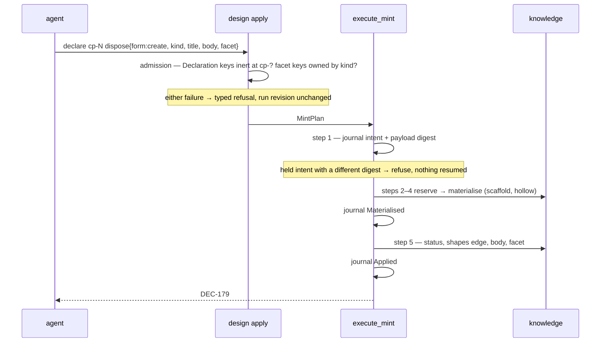

<!-- doctrine:section sec-1 -->
# 1. Design Problem

Between a ruling being known and a record holding it, Doctrine loses content —
twice, silently, and at the moment the content is most available.

The **structured tier has no writer.** `doctrine knowledge` offers `new | list |
show | inspect | status | paths`. Filling a `[facet]` means hand-editing TOML,
and the corpus records the result: decision facets 35/142 populated, question
4/38, and `answer`/`answered_by`/`answered_on` on `QUE` at **0 of 38**.
Population is binary and lock-step — a record carries every textual field or
none — which is the signature of a population that either engaged the tier
deliberately or never touched it at all.

The **design-run wire has no slot.** `CreateRecord` accepts `kind`, `title`,
`slug` and `acceptance`. An agent disposing a checkpoint holds the ruling in
hand as it writes, and has nowhere to put it. On SL-248's run six dispositions
reached for the nearest-looking key and sent their prose as `body`;
`Declaration::body` is *section* prose, read only behind a guard on
`derived.section_digests`, so on a `cp-` subject it was accepted and discarded.
`DEC-155`…`DEC-160` minted hollow and ~15k tokens were re-authored. The operator
caught it, not the tool.

The two are one story — a missing slot and a silent sink — and fixing the sink
alone converts a silent loss into a dead end.

What must be true at the end:

- Every facet field of every facet-bearing kind is writable through a verb, and
  the prose tier with it.
- A `form = "create"` disposition mints a record already holding its facet and
  its prose, in one act.
- A wire key that is inert at its subject's kind is refused at submission,
  across the whole field set rather than at the instances someone noticed.
- The kinds the corpus actually has are the kinds governance describes, and that
  correspondence is checked by something other than a promise.

<!-- doctrine:section sec-2 -->
# 2. Current State

## The read side is complete, and stays put

`src/knowledge.rs` carries the whole structured read model: `RecordFacet` as an
enum-of-structs with one variant per kind, four closed value-enums (`Confidence`,
`Basis`, `ConstraintSource`, `Provenance`), a kind-blind `RawFacet` superset for
the tolerant parse, `validate_facet` dispatching on `record_kind` through the
`"" -> None` seam, and a `#[cfg(test)]` `render_facet` pinning the byte-stable
round-trip. `A1` assumes this is sound and unchanged; nothing below revises it.

The facet field inventory it defines is the fact that shapes the CLI surface:
**31 slots, 30 distinct names, exactly one shared** (`confidence`, on assumption
and evidence) — assumption 8, decision 7, constraint 6, question 5, evidence 3,
hypothesis 2, concept 0.

## The write side is a single module with a single consumer

`src/facet_write.rs` holds `set_facet_mixed` / `apply_set_mixed`, a mixed-type
`[facet]` writer over `toml_edit`, serving `doctrine risk set` at
`src/commands/facet.rs:711`. Its `deletes at SL-222 deletion phase` marker covers
only three float-valued symbols and its reason string's premise is false; that is
`CHR-056`, not this slice. The module is **anchored by no spec** — no `sources`
list names it and the string appears nowhere in the authored corpus. Its only
governance is `SPEC-004`'s edit-preserving clause. (`inq-9`, open.)

Two write postures already exist and are distinguished deliberately in
`src/dep_seq.rs`: `apply_status` refuses a missing key (F-1: scaffold-seeded,
edit in place, never create), `apply_scalar` creates one. `DEC-170` rules facet
fields into the first class.

## The status verb is deliberately uncoupled

`set_record_status` documents itself: *"No resolution coupling: `status` and
`updated`, nothing else."* So a question reaches `answered` with its answer
fields empty, which is exactly the 0-of-38 above. `accepted_status` is the
counter-example worth noticing — it derives a per-kind answer from the kind's own
vocabulary rather than enumerating one, and says so.

## The design-run wire

`CreateRecord` (`src/design_run/submission.rs`) carries `kind`, `title`, `slug`,
`acceptance` — no facet, no prose. `Declaration` carries
`#[serde(deny_unknown_fields)]` (`A2`, confirmed), so an unknown key is already
refused; what is *not* refused is a **known** key inert at the subject's kind,
which is `ISS-318`. Its two observed instances are `body` on a `cp-` subject
(accepted and discarded) and `dispose` on an `inq-` subject (skipped by
`plan_checkpoints`, `src/commands/design.rs:882`).

Record creation runs through DEC-086's step sequence: reserve → materialise →
apply effects. `create_record` is the single fresh-creation path for all seven
kinds and its own doc forbids a second reservation+scaffold path;
`apply_record_effects` is step 5, already idempotent, already applying the
acceptance→status move and the `shapes` edge.

## Governance as it stands

`SPEC-019` is emphatically four-kind, repeating "four" at nine sites, and carries
a now-false self-description (*"forward-intent: no code is shipped yet"*).
`PRD-010` § 4 carries the same enumeration plus an extension rule. The corpus has
seven kinds. `SL-159` (`EVD`+`HYP`) and `SL-197` (`CPT`) each ruled their
contracts in a closed slice's design and neither landed the governance axis it
scoped — the debt this slice pays (`inq-7`, open on whether it discharges them
by name).

<!-- doctrine:section sec-3 -->
# 3. Forces & Constraints

## Binding

- **`SPEC-004`** — mutating verbs write entity TOML **edit-preservingly**. Ride
  `toml_edit`; never reserialise. This is the one clause governing
  `src/facet_write.rs` today.
- **`DEC-170`** — F-1 posture on facet fields: refuse an absent key, never
  create it; spell a cleared value as `""`, never by omission. Facet fields are
  scaffold-seeded, so an absent one is damage. `set_facet_mixed` currently
  *creates* missing keys, so riding it needs either a call-site guard or a
  posture parameter.
- **`DEC-088`** — a decision reaches `accepted` only through a content-bound user
  attestation applied at step 5. No verb this slice adds may offer a second
  route.
- **`DEC-168`** — the facet-and-prose write happens at step 5
  (`apply_record_effects`), not by pre-filling the scaffold. *Its recorded
  rationale is wrong and the ruling stands anyway — see `D8a`.* The ruling says
  crash-resume forces it, because `materialise_record_at` re-scaffolds from a
  journal carrying only id, title and slug. `RV-349` `F-1` established that the
  journal carries only the reserved **id**: on the resume arm, `execute_mint`
  takes `title` and `slug` from the `MintKind` in the plan rebuilt from the retry
  request. Step 4 could therefore reach the payload exactly as step 5 does, so
  nothing forces the siting. What binds here is the conclusion on its real
  grounds: step 5 is the existing, already-idempotent effects step, and putting
  the content write there keeps a record's effects resumed as one unit.
- **`ADR-013`** — the governance amendment routes through a REV landing at
  reconcile, over **two** entities (`SPEC-019`, `PRD-010` — `DEC-175`).
- **`ADR-004` / `SPEC-018`** — `link`/`unlink` own relations; `edit` does not
  touch them.
- **`ADR-001`** — leaf ← engine ← command, no cycles. The pure write seam is a
  leaf; the CLI verbs and the design-run wire are both consumers of it.
- **`STD-001`** — no magic strings. Every field name, status token and kind
  prefix in this design must have exactly one spelling with one owner. It is also
  why `D8`'s retry digest reuses the payload term `acceptance_digest` already
  binds rather than defining a second one.
- **`POL-002`** — platform independence: no host-project convention (cargo
  layout, `just` recipes) leaks into engine rules. `DEC-176`'s canary is a
  project-local test, never a `validate` rule.

## Not binding, and worth stating

- **`SPEC-013`** owns the uniform `<kind> <verb>` grammar but states no
  convention for field-mutation verbs. `memory edit` / `backlog edit` are
  precedent, not governance, so the subverb shape and `settle` are unconstrained
  by it.
- **`PRD-019` / `SPEC-029`** govern the design run's identity, idempotency and
  revision-CAS and say nothing about what a created record is *populated* with.
  Objective 2 is ungoverned space, not prohibited space.

## Mechanical

- **Rust has no reflection over struct fields.** Any correspondence between a
  type's fields and something else is authored, and the design question is only
  how it is kept total (`DEC-169`).
- **`Declaration` carries `deny_unknown_fields`; `ApplyRequest` cannot** (it
  carries a `#[serde(flatten)]` envelope). The facet payload therefore lands
  inside `Declaration`, where the guard already holds.
- **Serde's `skip_serializing_if` is total over `Declaration`**, so a
  fully-populated value serialises to exactly the wire key set — the pin
  `DEC-169` uses instead of a proc macro. The same totality is what makes `D8`'s
  digest cover the payload without an enumeration to maintain.
- **A `toml_edit` root insert-if-missing is safe; a subtable-nested one is not**
  (`mem_019ee9fd51d87aa38a2dfb31ad6c4eec`, which scopes its own proof and says
  so). `[facet]` fields are subtable-nested, which is why F-1 stands.
- **`[facet]`, `status` and `updated` are keys of one file.** `record-NNN.toml`
  carries all three, and both mutating cores (`facet_write::set_facet_mixed`,
  `dep_seq::apply_status`) already take a held `&mut DocumentMut`. There is no
  two-file transaction anywhere in this design, which is what makes `settle` a
  single atomic write (`RV-349` `F-2`, § 5.4 path B).

## Pressures in tension

The slice exists to close a live data-loss hole, and the user's standing
tie-breaker is to prefer whichever defensible answer lands that fix sooner. Set
against it: this design touches shared machinery (the entity engine, the design
run wire) where the behaviour-preservation gate applies, and it writes governance
that outlives the fix. `DEC-165`'s phase boundary is how both are honoured — the
wire fix ships first and alone, the facet-bearing surfaces follow.

<!-- doctrine:section sec-4 -->
# 4. Guiding Principles

Five, each earned by a ruling this run took rather than asserted as taste.

**Derive the correspondence; do not declare it.** Three separate tables sit in
this design — wire keys against subject kinds, facet keys against record kinds,
status tokens against their evidence fields. Every one of them is authored,
because Rust gives no reflection; none of them may be *checked* by hand. `serde`
key sets pin the first (`DEC-169`), name correspondence derives the third
(`DEC-178`), and the second is pinned against the typed model. A table that can
silently miss a new field is `ISS-318` recurring inside its own fix.

**Refuse where the operator is; report where the reader is.** The same damage
warrants opposite treatment on the two paths. A write-time refusal fires at the
record it names, with someone holding the thing that caused it (`DEC-170`). A
read-time refusal fires at every later reader of an unrelated record and breaks
the tool you would use to diagnose it (`DEC-177`). Symmetry is not the goal;
locality of the report is.

**One table, many consumers — never one table per consumer.** The per-kind facet
field sets are needed by the six subverbs, by `settle`'s coverage, and by the
doctor tripwire. Three hand-maintained copies is the failure this slice is
already paying for elsewhere.

**Make the wrong call unrepresentable where it costs nothing; refuse it clearly
where it does.** Per-kind subverbs make a wrong-field error unspellable, and
relocate rather than remove the kind-mismatch check — accepted, because the check
is one comparison against a value the id already resolves. Where a refusal is
what is left, it teaches: *"`ASM-003` is an assumption; use `knowledge edit
assumption`."*

**Ship the fix ahead of the governance that describes it.** `DEC-165`: the
rulings gated, objective 4 never did. The phase boundary is load-bearing and the
plan must hold it — the wire fix may not quietly absorb facet work to save a
phase.

<!-- doctrine:section sec-5 -->
# 5.1 System Model

## The shape of the change

One authored table, one pure write seam, four consumers. Nothing here is a new
subsystem; every box below already exists except the table.

```
                    ┌──────────────────────────────────────────┐
                    │ src/knowledge.rs                          │
                    │                                           │
  read (unchanged)  │  RawFacet ──validate_facet──▶ RecordFacet │
                    │      ▲                            ▲       │
                    │      │ serde key-set pin (P1)     │ P2    │
                    │  ┌───┴───────────────────────┐    │       │
                    │  │ facet_fields(kind)        │────┘       │
                    │  │ the authored partition    │            │
                    │  └───┬────────┬─────────┬────┘            │
                    └──────┼────────┼─────────┼─────────────────┘
                           │        │         │
              ┌────────────┘        │         └──────────────┐
              ▼                     ▼                        ▼
   six `edit <kind>` subverbs   `settle <ID> <state>`   doctor tripwire
   + kind-blind `edit <ID>`     (coverage derived)      (inert-key warning)
              │                     │
              └──────────┬──────────┘
                         ▼
              src/facet_write.rs  ── toml_edit, F-1 guarded ──▶  record-NNN.toml
                         ▲
                         │ (same seam, second caller)
              apply_record_effects (DEC-086 step 5)  ◀── CreateRecord{facet, body}
```

## The authored table

The one artefact this design adds:

```rust
/// One facet field: its key, and the shape the writer must emit.
pub(crate) struct FacetField {
    pub(crate) name: &'static str,
    pub(crate) shape: FieldShape,
}

pub(crate) enum FieldShape {
    Text,
    List,
    Closed(&'static [&'static str]),   // the variant tokens, from the enum's own serde form
}

/// Every field one record kind owns, in template order — the single authored
/// derivation of the per-kind field sets (STD-001).
pub(crate) fn facet_fields(kind: RecordKind) -> &'static [FacetField];
```

It lives in `src/knowledge.rs`, adjacent to `validate_facet`, because the table
*is* the data form of what that function's arms already say in code. Splitting
them across modules is how the two drift. (Cohesion pressure noted: that module
also carries the knowledge CLI, since there is no `src/commands/knowledge.rs`.
This design does not relayer it; see § 8.)

Authoring is forced — Rust has no reflection over struct fields, and `DEC-169`
already refused a proc macro written for one table. So the design question is
only how it is kept honest, and there are two independent pins:

- **P1 — union totality.** Derive `RawFacet`'s serde key set (it gains
  `Serialize`; every field is already `#[serde(default)]`) and assert it equals
  the union of `facet_fields` over `RecordKind::ALL`. A facet field added to the
  model and forgotten in the table is a test failure, not a silent absence. This
  is `DEC-169`'s read-through-serde idiom, second application.
- **P2 — per-kind placement, as an *equality*.** For each kind, write **every
  field in the union** — not merely the ones the table gives that kind — read the
  record back through the untouched `validate_facet`, and assert that the set of
  fields the typed facet retained equals `facet_fields(kind)` exactly. *Retained*
  means present in that kind's variant struct; every other field is discarded on
  read.
- **P3 — each row is a set.** Assert every row's names are unique — one
  comparison of the row's length against its deduplicated length. Both other pins
  compare *sets*, so two identical `(kind, field)` entries collapse into one and
  neither notices, while every consumer that iterates the row sees the field
  twice: a duplicated flag name (clap refuses at construction, but at runtime,
  not in a test), a doubled write, a doubled `settle` coverage row. `RV-349`
  `F-3` round two.

The equality is the load-bearing word, and `RV-349`'s `F-3` — that the pins as
first drafted could not see ownership *multiplicity* — is why. An inclusion pin
("every table field survives") is blind to a field the table hands a kind that
does not own it, and P1 compares a union, which discards multiplicity by
construction. Under the equality that case fails: a `choice` wrongly listed on
`question` is dropped by `validate_facet`, so the retained set is smaller than
the table's row and the two differ.

This also retires the design's own weakest joint. The first draft argued that no
facet field validates for a kind that does not own it *because* `validate_facet`'s
arms read disjoint field sets — an argument about the current code rather than a
property anything enforced. The equality needs no such argument: the read model
is the oracle, and the test compares against what it actually retained.

`confidence`, legitimately owned by both assumption and evidence, is not a
special case. It is retained for both kinds and both rows list it, so both
equalities hold. That is the case P3 must not break: multiplicity *across* rows
is legitimate and P3 says nothing about it; multiplicity *within* one row is
always damage.

P1, P2 and P3 together make the table total, exactly partitioned, and free of
duplicate ownership, without any name being typed twice. Three pins, each one
comparison — which is still cheaper than the per-kind serde oracle the first
review round proposed, and that route would have needed P3 anyway.

## What each consumer takes from it

| consumer | reads | derives |
|---|---|---|
| `knowledge edit <kind>` | `facet_fields(kind)` | its flag set; a test asserts clap's arg names equal the table's |
| `knowledge settle` | `facet_fields(kind)` | settleable states, by `<state>_by`/`<state>_on` name lookup (`DEC-178`) |
| `doctor` tripwire | all kinds | key → honouring kind, for the warning message (`DEC-177`) |
| step-5 write | `facet_fields(kind)` | shape dispatch for the `toml_edit` emit |

This is what discharges the rider `DEC-177` and `DEC-178` both carry: the table
exists as data, so neither falls back.

## The write mechanism

`src/facet_write.rs::set_facet_mixed` is the mechanism, already live under
`doctrine risk set`, already `toml_edit` and therefore already edit-preserving
per `SPEC-004`. It creates missing keys, which `DEC-170` forbids for facet
fields. The seam gains a **posture parameter** rather than a guard at each call
site: one enum threaded to the insert decision, `RiskFacet`'s caller passing the
creating posture it has today and knowledge passing F-1. A call-site guard would
have to be repeated by every future caller and would be the parallel
implementation `AGENTS.md` forbids.

Note the shape both write cores already have: `set_facet_mixed` and
`dep_seq::apply_status` each take a held `&mut toml_edit::DocumentMut`, and their
path-level wrappers are what open and write. That is what makes § 5.4's `settle`
one atomic write rather than two, and it costs no new machinery.

## The phase boundary

`DEC-165` splits the slice and the split is load-bearing, not cosmetic:

- **Phase A — the wire fix, no facet anywhere.** Objective 3's inert-key refusal
  (`Declaration` keys × design-run subject kinds, `DEC-169`'s serde-pinned table)
  plus the prose half of objective 2 (`CreateRecord.body` written at step 5 via
  the existing `entity::write_body`), and with it the retry-payload binding § 5.3
  now requires — the first payload-bearing write is what makes that binding
  necessary. Neither touches a record kind, a facet, or knowledge governance.
  Together they are exactly what would have prevented the SL-248 loss.
- **Phase B onward — the facet surfaces.** The table, the six subverbs, the
  kind-blind `edit`, `settle`, `CreateRecord.facet` at the same step-5 site, and
  the doctor tripwire.

The plan must hold the boundary: Phase A may not absorb facet work to save a
phase.

<!-- doctrine:section sec-6 -->
# 5.2 Interfaces & Contracts

## The CLI surface

Three shapes, splitting by *tier* as `OQ-1` settled — invariant fields
kind-blind, `[facet]` kind-dispatched — plus the coupled transition.

```
doctrine knowledge edit <ID> [--title T] [--tags a,b] [--body B|-] [--body-mode replace|append]
doctrine knowledge edit <kind> <ID> [--<field> V]…          # six kinds; flags = that kind's fields
doctrine knowledge settle <ID> <state> --by WHO [--<text-field> V]
```

Flag names are the field's own name, kebab-cased — `--validation-plan`,
`--waiver-reason`, `--decided-by`. The args stay clap-derive-declared, as the
rest of this CLI is, and `facet_fields(kind)` is their **oracle**: a test asserts
each subverb's arg names equal its kind's table row, so the two cannot drift. See
§ 5.5 for why the table does not build the args directly. This refines `DEC-178`'s illustrative
`--reason` to `--waiver-reason`; the ruling's substance is untouched.

`--body` / `--body-mode` (`replace` | `append`, `-` reads stdin) are lifted from
`memory edit` unchanged, and ride `entity::write_body`, which that verb already
uses. Nothing new on the prose tier.

## What `settle` derives, and the one thing it does not

`DEC-178` derives *coverage*: a state is settleable when the kind's facet carries
`<state>_by` and `<state>_on`. That is mechanical over `facet_fields` and yields
exactly four transitions.

It does not derive *which field holds the outcome*. `QUE`'s is `answer`, `CON`'s
is `waiver_reason`, and no naming rule connects either to its state token without
contrivance. So one small annotation is authored beside the table:

```rust
/// A resolving transition: its state, and the field whose content the
/// transition exists to capture. The actor/date pair is NOT here — it is
/// derived from the state token (DEC-178).
pub(crate) struct Settlement {
    pub(crate) state: &'static str,
    pub(crate) captures: Option<&'static str>,
}
pub(crate) fn settlements(kind: RecordKind) -> &'static [Settlement];
```

Four rows: `QUE` answered/`answer`, `ASM` validated/none, `ASM`
invalidated/none, `CON` waived/`waiver_reason`. Pinned two ways — every
`captures` name must appear in `facet_fields(kind)`, and the set of `state`
tokens must equal the set the by/on derivation yields. The second pin is the one
that matters: it means the annotation can add detail to the derived set but
cannot quietly extend it.

Stating this plainly rather than claiming full derivation: `DEC-178`'s reach
ruling stands, and the honest scope of "derived" is the coverage, not the whole
row.

## The pure seam

```rust
/// A caller's raw field assignment, before the table has seen it.
pub(crate) struct RawEdit<'a> { pub(crate) field: &'a str, pub(crate) value: RawValue }
pub(crate) enum RawValue { Text(String), List(Vec<String>) }

/// One validated mutation, ready to write.
pub(crate) struct FacetEdit { pub(crate) field: &'static FacetField, pub(crate) value: RawValue }

/// Validate raw assignments against the kind's table: every field is owned by
/// this kind, every `Closed` value parses to a variant, every `List` value is a
/// list. Pure — no clock, no disk, no io.
pub(crate) fn plan_facet_edits(kind: RecordKind, given: Vec<RawEdit>)
    -> Result<Vec<FacetEdit>, FacetEditRefusal>;

/// Apply planned edits to a record's TOML, edit-preservingly (SPEC-004).
pub(crate) fn apply_facet_edits(path: &Path, edits: &[FacetEdit]) -> anyhow::Result<()>;
```

The split is the project's pure/imperative rule: `plan_facet_edits` holds every
decision and is exhaustively testable without a filesystem; `apply_facet_edits`
is the thin shell over `facet_write::set_facet_mixed`.

A cleared value is `RawValue::Text(String::new())`, written as `""`. `DEC-170`
forbids clearing by omission, and `plan_facet_edits` has no way to express it.

## `settle` writes once

`settle` composes the same two seams over **one held document**, not two
path-level writers in sequence. `RV-349`'s `F-2` is why the first draft was
wrong to reach for sequencing: `[facet]` and `status`/`updated` are keys in the
*same* `record-NNN.toml` — `set_record_status` resolves that exact path through
`record_toml_path` — so there is no two-file transaction to order, and ordering
one was buying a guarantee that a single write gives outright.

Nothing new is needed to write once. Both cores are already document-level and
their path wrappers are the only IO:

| core | wrapper today |
|---|---|
| `facet_write::set_facet_mixed(&mut DocumentMut, table, fields)` | `doctrine risk set`'s caller |
| `dep_seq::apply_status(&mut DocumentMut, managed, hint)` | `dep_seq::set_authored_status(path, …)` |

So the shell reads the record once, applies both, and writes once:

```rust
/// Apply planned facet edits and a status transition to one record in a single
/// edit-preserving write. Composes the two existing document-level cores over
/// one held document; introduces no third writer.
pub(crate) fn apply_settlement(
    path: &Path,
    edits: &[FacetEdit],
    managed: &[(&str, &str)],
) -> anyhow::Result<()>;
```

Validation still precedes every write, and now covers the status token too:
`settle` refuses a foreign-kind or non-settleable state *before* the document is
touched, so `I7` holds for the whole verb rather than for its facet half. `I4`'s
one-writer-per-concern is preserved by composition — `apply_status` remains the
sole author of `status`/`updated`, reached through a different wrapper rather
than through a second implementation.

## The write posture

`set_facet_mixed` gains one parameter:

```rust
pub(crate) enum KeyPosture {
    /// Create the key if absent — the posture `doctrine risk set` has today.
    Create,
    /// F-1: refuse if absent; the key is scaffold-seeded, so its absence is
    /// damage (DEC-170).
    RequirePresent,
}
```

`risk set` passes `Create` and behaves exactly as it does now — the
behaviour-preservation gate holds by construction. Knowledge passes
`RequirePresent`.

## The wire

```rust
pub(crate) struct CreateRecord {
    pub(crate) kind: String,
    pub(crate) title: String,
    pub(crate) slug: Option<String>,
    pub(crate) acceptance: Option<AcceptanceDeclaration>,
    /// The record's `.md` prose (phase A).
    #[serde(default, skip_serializing_if = "Option::is_none")]
    pub(crate) body: Option<String>,
    /// The record's `[facet]` fields, by field name (phase B).
    #[serde(default, skip_serializing_if = "BTreeMap::is_empty")]
    pub(crate) facet: BTreeMap<String, RawValue>,
}
```

**On calling it `body`.** The tempting alternative is a distinct name — `prose` —
on the reasoning that `body` is the key that ate SL-248's content. Rejected: the
loss was a **level** error, not a naming collision. `Declaration::body` is the
body of a *section*; `CreateRecord::body` is the body of a *record*; in both
cases it is the `.md` content of the thing the subject names, which is what
`entity::write_body` and `memory edit --body` already call it. A fourth spelling
for one concept costs more than it buys, and objective 3 is what makes the level
error loud — see the refusal below.

`facet` is a `BTreeMap<String, RawValue>` rather than a typed per-kind struct
because `CreateRecord.kind` is a runtime token; the map is validated by
`plan_facet_edits` against `facet_fields(kind)` at admission, which is the same
check the CLI runs, not a second one.

## Refusals

Every refusal below is typed and names its remedy. The first four are new; the
fifth is `ISS-318`'s; the sixth is the retry guard § 5.3 requires.

| condition | message shape |
|---|---|
| subverb names a kind the id contradicts | `ASM-003` is an assumption; use `knowledge edit assumption` |
| `knowledge edit concept …` | concept records carry no facet fields; use `knowledge edit CPT-001` (`DEC-173`) |
| state has no settlement | `accepted` is not a settle transition for a decision; use `knowledge status` |
| facet key absent on write | malformed record 042: `[facet]` is missing `choice` — restore the key and retry; the file is left untouched (`DEC-170`) |
| `Declaration` key inert at subject's kind | `body` is inert at `cp-4`; it is honoured for `sec-` subjects. To carry a record's prose, use `dispose.create.body` |
| retry under a journalled submission carries a different payload | submission `sub-…` is mid-mint at `DEC-181` and its payload has changed; re-send the payload it was journalled with, or use a new submission id |

The fifth message is the whole of the SL-248 recovery: the six dispositions that
sent prose as `body` would each have been refused, at submission, with the key
they were reaching for named in the refusal.

<!-- doctrine:section sec-7 -->
# 5.3 Data, State & Ownership

## The authored tables, and who owns each

Three correspondences exist in this design. Each has exactly one owner, one
spelling, and a pin that fails loudly rather than a convention that erodes.

| table | owner | pinned by |
|---|---|---|
| facet key → owning kind, with shape | `src/knowledge.rs`, beside `validate_facet` | P1 union vs `RawFacet`'s serde key set; P2 per-kind round-trip through `validate_facet`, as an equality |
| resolving state → captured field | `src/knowledge.rs`, beside the above (four rows) | every `captures` name ∈ `facet_fields(kind)`; state set ≡ the by/on derivation |
| `Declaration` wire key → honouring subject kind | `src/design_run/submission.rs` | key set of a fully-populated `Declaration`'s serde form (`I9`), *plus* the behavioural matrix `I10` — the key set alone proves inventory, not mapping |

The third is not the first two. It is `Declaration`'s ~16 wire keys against the
design-run *subject* kinds (`inq-`, `sec-`, `att-`, `fnd-`, `cp-`), touches no
record kind, and needs no knowledge governance — which is the fact that lets
Phase A ship without objective 4 (`DEC-165`, `DEC-169`).

## Who may write `[facet]`

Exactly two callers, both through the planned-edit seam — `apply_facet_edits`,
or `apply_settlement`, which composes it over a held document rather than
duplicating it:

1. the six `knowledge edit <kind>` subverbs and `settle`, at the CLI;
2. `apply_record_effects` at DEC-086 step 5, for a `form = "create"` disposition.

`doctrine risk set` remains a third caller of `facet_write` itself, on the
`[facet]` of a *backlog* entity with the `Create` posture — a different table in
a different kind's file. No other code path writes a knowledge `[facet]`, and
`plan_facet_edits` is the only way to construct a `FacetEdit`, so that is
enforced by the type rather than by convention.

## Who owns status

The status *vocabulary check* and the status *write* are two things, and only
the second was ever coupled to a path.

`dep_seq::apply_status` owns the write, unchanged: it is the sole author of
`status`/`updated`, and both `set_record_status` (its existing path wrapper) and
`apply_settlement` (§ 5.2) reach the same core. There is one writer, reached two
ways, not two writers.

The vocabulary check — *is this token a status of this kind?* — currently lives
inside `set_record_status` above the call. `settle` needs it too and must not
copy it, so it is lifted into a named predicate beside `statuses(kind)` and both
callers use it. This is the only refactor the settle path forces, and it is
extraction, not a parallel implementation.

The exception is the one `DEC-088` reserves: a decision reaches `accepted` only
through `apply_record_effects`, bound to a content-derived digest. `settle` has
no route there — not by a guard, but because `accepted` is not in the derived
settleable set at all (`DEC-178`). The reservation is upheld by the shape of the
derivation rather than by a check someone could later relax.

## Where the payload lives during a mint, and what binds it

`CreateRecord`'s `body` and `facet` are **not** journalled. That was the first
draft's position and it survives, but its stated justification did not, and
`RV-349`'s `F-1` is why.

**The argument that failed.** The draft said recovery is submission-keyed retry —
the caller re-submits the same `submission_id`, `plan_checkpoints` rebuilds the
`MintPlan` from that request, `execute_mint` resumes against the id the journal
names, and the payload is present because the retry carries it. Every clause is
true. The unstated premise is that a retry under a given `submission_id` carries
the *same* payload, and nothing enforces it in the window that matters:

- `run::admit` refuses a replayed `submission_id` whose payload digest differs —
  but only when a **receipt** exists, and receipts land with the snapshot.
- `execute_mint` journals its `RecoveryIntent` (`src/design_run/attestation.rs`)
  *before* the authored effect, and that journal holds `submission`, `subject`,
  `reserved_record`, `state` and `acceptance` — no payload and no digest of one.
- So a crash after the intent is journalled and before the snapshot persists
  leaves an intent with no receipt. The run's revision never moved, so a retry
  carrying a **different** payload passes the CAS, is admitted as `Fresh`, and
  `execute_mint` finds the held intent and resumes.
- Step 5 then applies `intent.acceptance()` — the acceptance journalled with the
  *first* payload, bound by `acceptance_digest` to that payload's content — while
  the record's content comes from the second. The freshly-built plan's acceptance
  is discarded.

The window is not new: `title` and `slug` can already diverge from what was
accepted this way. What this slice changes is the blast radius. Once the payload
carries the record's prose and its whole facet, "accepted under a digest of
different content" stops being a cosmetic divergence and becomes exactly the
class of silent content error the slice exists to close. Shipping the widening
without the guard would be indefensible.

**The guard.** `RecoveryIntent` gains one field — a digest of the mint's payload,
recorded at step 1 with the intent, `#[serde(default)]` so a pre-existing journal
reads as absent. On resume, `execute_mint` compares the rebuilt plan's digest
against the journalled one and, on a mismatch, refuses before any resumed effect,
naming the submission and the record it is mid-mint on (§ 5.2's sixth refusal).
An absent digest — an intent written by an older binary — resumes as it does
today; the guard is additive and never turns a recoverable state into a stuck
one. Nothing is rolled back to repair a runtime failure, which is `DEC-083`'s
rule: the retry is refused, the corpus is untouched, and the caller either
re-sends what it journalled or opens a new submission.

**What is digested is not a new question.** `RV-349` `F-1` round two is right
that a guard whose material is undefined proves nothing, and the answer is that
the material already exists and must not be re-invented. `plan_checkpoints`
computes `sha256(serde_json::to_string(declaration))` as the `payload` term
`acceptance_digest` binds. That term is the whole `Declaration` — and therefore,
after this slice, `dispose.create.kind`, `title`, `slug`, `body` and `facet`,
total by construction rather than by an enumeration someone must keep current.
The intent journals **that same digest**, computed unconditionally rather than
only when an acceptance rides. Three properties follow and each is the reason to
reuse it rather than define a second one:

- it is exactly the material the acceptance is bound to, so "the payload changed"
  and "the acceptance no longer describes this content" are one comparison, not
  two that can disagree;
- `facet` is a `BTreeMap` and `Declaration`'s serde form is field-ordered, so a
  semantically identical retry digests identically — a legitimate re-send is not
  refused for key order;
- a new key on `Declaration` joins the digest automatically, which is the same
  totality argument `DEC-169` makes about the wire-key table.

`acceptance_digest` folds in the run revision, which is unchanged on the retry
that matters (the snapshot never persisted, so the revision never moved). The
intent's digest is over the payload term alone.

This makes the *non-journalling* sound rather than merely convenient. The payload
still need not be stored, because what recovery needs is not the payload but the
guarantee that the payload has not changed — and a digest is the cheap form of
that guarantee.

**A correction `DEC-168`'s rationale needs.** The draft — and the ruling as
recorded — argued that step 5 is *forced*, because the rejected alternative of
pre-filling the scaffold inside `create_record` would need the payload at step 4,
and `materialise_record_at` reaches only the journal there. That is false about
the code, and `RV-349` `F-1` round two caught it. On the resume path
`execute_mint` takes only the reserved id from the journal; `title` and `slug`
come from the `MintKind` in the plan **rebuilt from the retry request**
(`src/commands/design.rs`, the `state() < Materialised` arm). The journal carries
neither. So step 4 could reach the payload exactly as step 5 does, and nothing
forces the siting.

`DEC-168`'s conclusion survives on grounds that are real rather than mechanical:
step 5 is `apply_record_effects`, which already exists, is already idempotent,
and is already where status and the `shapes` edge land — so the facet and prose
write joins effects that are resumed as a unit, rather than splitting the record's
content across two steps with different resume semantics. That is a design
preference with a stated reason, not a constraint. The ruling should be corrected
to say so; the correction is carried to reconcile with the objective 4 REV, since
this slice has no verb for amending a knowledge record — which is, precisely, the
hole it exists to close.

The guard lands in **Phase A**, with the first payload-bearing write. Phase A is
what introduces content that can diverge, so it is what owes the binding.

The window `DEC-168` names stays open and is not new: between
`IntentState::Materialised` and `IntentState::Applied` the record exists hollow
on disk. Status and the `shapes` edge already land in that window. A facet and
prose write joins them on the same terms, and is idempotent on the same terms —
the same payload written twice produces the same bytes.

## Storage tiers

Nothing here changes the tiering, and it is worth stating which tier each new
thing lands in:

- **Code** — the three tables. Not data files: they are the typed model's own
  partition and travel with it (`POL-002` — no host-project state).
- **Authored** — `record-NNN.toml`'s `[facet]` and `record-NNN.md`. Both are
  committed and diffable; both are written edit-preservingly, so a hand-authored
  record and a verb-written one are byte-indistinguishable.
- **Runtime** — the design run's own state, including the checkpoint
  dispositions and the recovery journal that now carries the payload digest.
  Disposable; the records it mints are not.
- **Derived** — nothing added. The doctor tripwire computes its findings per
  scan and stores none.

## Scaffold seeding is the precondition for all of it

`install/templates/knowledge-*.toml` seed `[facet]` with every field of that kind
present and empty. That fact is what makes F-1 correct (`DEC-170`), what makes an
absent key mean damage rather than absence, and what makes the empty-string
clear spelling a round-trip rather than a mutation. The templates are therefore
load-bearing for the write posture, and the objective 4 REV should say so — a
future template edit that drops a seeded field would silently convert every
record of that kind into one the writer refuses.

<!-- doctrine:section sec-8 -->
# 5.4 Lifecycle, Operations & Dynamics

Five paths. Four are new; the fifth is the one that lost the content.

## A — filling a facet at the CLI

```
doctrine knowledge edit decision DEC-042 --choice "…" --rationale "…"
```

```mermaid
sequenceDiagram
    participant U as caller
    participant C as knowledge CLI
    participant P as plan_facet_edits (pure)
    participant W as apply_facet_edits → facet_write
    U->>C: edit decision DEC-042 --choice …
    C->>C: resolve_ref → (Decision, 42)
    C->>C: subverb kind vs id prefix
    Note over C: mismatch → refuse, naming the right subverb
    C->>P: (kind, raw assignments)
    P->>P: field owned by kind? value shape? closed-enum token?
    Note over P: any failure → typed refusal, nothing written
    P-->>C: Vec<FacetEdit>
    C->>W: (path, edits)
    W->>W: toml_edit; F-1 refuse if a key is absent
    W-->>U: DEC-042: choice, rationale
```

Every decision is in `P`, which has no filesystem. The shell does two things the
pure layer cannot: resolve the id and write the bytes. A failure anywhere before
`W` leaves the file untouched; a failure inside `W` leaves it untouched too,
because `facet_write` builds the whole document before it writes.

## B — settling, in one write

```
doctrine knowledge settle QUE-198 answered --by david --answer "…"
```

One act, one document, one write:

1. **Validate everything first.** `answered` is a status of this kind and is in
   the derived settleable set; `answer` — the state's `captures` field — is
   present (omitting it is a refusal, not an empty write); `plan_facet_edits`
   validates `answer`, `answered_by` from `--by`, and `answered_on` from
   `clock::today()`.
2. **Apply to one held document.** Read `record-NNN.toml` once;
   `set_facet_mixed` writes the three facet fields, `apply_status` writes
   `status` and `updated`.
3. **Write once**, atomically, through the existing `fsutil::write_atomic`.

**The first draft had this wrong and `RV-349`'s `F-2` is the correction.** It
described `settle` as non-atomic "across the two files" and defended an ordering
— facet evidence first, status token second — as the arrangement whose surviving
state after a crash is the honest one. There are not two files. `[facet]`,
`status` and `updated` are all keys of the same `record-NNN.toml`, which is the
path `set_record_status` resolves through `record_toml_path`. The ordering
argument was answering a question the storage layout does not ask.

Nor is one write expensive here. Both mutating cores already operate on a held
`&mut DocumentMut` and only their wrappers do IO, so composing them costs a
function, not a design (§ 5.2). What the single write buys is stronger than what
the ordering bought: there is no interleaving to reason about, no partially
settled record to define, and `I7` — a refusal leaves the corpus byte-identical —
holds for the whole verb rather than for its facet half. The failure mode the
draft was most worried about is not mitigated but **removed**: a refusal inside
the status leg can no longer land after the facet leg, because validation
precedes the single write.

## C — minting a filled record



The facet payload is validated at **admission**, before any id is reserved. A
disposition naming a field the kind does not own is refused with the run
unchanged — no hollow record, no reserved id burned. That is the same
`plan_facet_edits` the CLI runs, not a second check.

**On a crash between `Materialised` and `Applied`:** the record exists hollow.
Re-submitting the same `submission_id` with the same payload resumes at step 5,
and every effect there is idempotent — `set_authored_status` writes only on a
change, `append_edge` returns `Noop`, and a facet-and-prose write of the same
payload produces the same bytes. Re-submitting the same `submission_id` with a
*different* payload is refused at step 1 by the digest the intent now carries
(§ 5.3), because the acceptance journalled with that intent is bound to the
payload it was given and cannot be honestly applied to another. Nothing is
removed or rewritten to repair a runtime failure (`DEC-083`).

## D — the refusal that would have caught SL-248

```
declare: [{ subject: "cp-4", body: "## The two candidate sites\n…", dispose: {…} }]
```

Admission consults the `Declaration`-key table: `body` is honoured for `sec-`
subjects and inert for `cp-`. Refused, at submission, with the run's revision
unmoved and the message naming `dispose.create.body` as the key the caller
wanted.

All six of SL-248's dispositions take that path. The loss becomes a refusal the
agent can act on in the same turn, which is the whole of objective 3's value —
the content is still in the agent's context at the moment of the refusal, which
it was not by the time the operator noticed.

## E — the standing scan

`doctrine doctor` walks the corpus and warns for each `[facet]` key populated but
inert at its record's kind, naming the record, the key, and the kind that would
honour it. It reads; it never refuses and never repairs. `knowledge list` keeps
working on a damaged corpus, which is the whole point (`DEC-177`).

## Phase dynamics

`DEC-165`'s boundary in operational terms:

- **Phase A** ships path **D**, the prose half of **C**, and the retry-payload
  binding that half requires. After it, the SL-248 class of loss cannot recur — a
  mis-keyed payload is refused, a correctly-keyed one lands, and a changed retry
  cannot inherit an acceptance it did not earn.
- **Phase B onward** ships **A**, **B**, **E** and the facet half of **C**.

The ordering is not merely permitted by `DEC-165`; it is the ordering that gets
the observed defect closed first. Nothing in Phase A reads `facet_fields`, so the
table is not on its critical path.

## Failure posture, stated once

No path repairs, and after `F-2` no path leaves partial state. Every refusal
above leaves the corpus exactly as it found it and names what to do; every write
is a single atomic write of one document. The mint is the one multi-step
operation, and its steps are journalled rather than ordered-and-hoped: each is
idempotent, resumed against the id the journal names, and now guarded by the
payload digest that makes a resumed step 5 provably about the same content the
acceptance was given for.

<!-- doctrine:section sec-9 -->
# 5.5 Invariants, Assumptions & Edge Cases

## Invariants

Each is a property a test asserts, not a habit. `I1`–`I9` are the drafting set;
`I10`–`I12` were added by `RV-349` and are named, not renumbered.

- **I1 — byte-stable round-trip of the read model.** A record parses to the same
  typed `RecordFacet` and re-renders to the same bytes. The existing
  `render_record_toml` round-trip suite is the oracle and stays green unchanged.
  Its scope is exactly that and no more: the emit is `#[cfg(test)]`, has no
  production caller, and omits `[[relation]]`/`[relationships]` — so it proves the
  model, not the writer. Edit preservation is `I11`.
- **I2 — the table is total.** `⋃ facet_fields(k) over RecordKind::ALL` equals
  `RawFacet`'s serde key set. A model field with no table row fails the build's
  tests.
- **I3 — the table is exactly partitioned.** For each kind, write *every* field
  in the union, read through `validate_facet`, and the set retained equals
  `facet_fields(kind)` — an equality, not an inclusion. A field on the wrong row
  is retained by nobody and so fails its own row's equality; a field on an extra
  row fails there. `I3` catches what `I2` cannot, and the equality is what makes
  it catch cross-kind misplacement (`RV-349` `F-3`).
- **I3b — no row repeats a name.** Every `facet_fields(kind)` row's length equals
  its deduplicated length. `I2` and `I3` both compare sets, which collapse a
  duplicate silently while every consumer that *iterates* the row sees the field
  twice (`RV-349` `F-3` round two). Multiplicity across rows stays legitimate —
  `confidence` is on two — and `I3b` says nothing about it.
- **I4 — one writer per concern.** `status`/`updated` only through
  `dep_seq::apply_status` (reached by `set_record_status` or by
  `apply_settlement`, never re-implemented); `[facet]` only through
  `apply_facet_edits` or the `apply_settlement` that composes it; the `.md` only
  through `entity::write_body`. `plan_facet_edits` is the sole constructor of a
  `FacetEdit`, so `I4`'s facet half is a type property.
- **I5 — `accepted` is unreachable from `settle`.** Not by a guard: the token is
  absent from the derived settleable set (`DEC-088`, `DEC-178`).
- **I6 — no facet key is ever created.** F-1 posture; an absent key is a refusal
  naming the record (`DEC-170`).
- **I7 — a refusal leaves the corpus byte-identical.** Every validation precedes
  every write, on the CLI, on `settle` (including its status-vocabulary check),
  and on the admission path.
- **I8 — `doctrine risk set` is unchanged.** It passes `KeyPosture::Create` and
  exercises the same code it does today; its suite stays green unchanged (the
  behaviour-preservation gate).
- **I9 — the wire-key table is total.** A fully-populated `Declaration`'s serde
  key set equals the table's (`DEC-169`). This is an *inventory* claim and
  nothing more — see `I10`.
- **I10 — no wire key is accepted and ignored.** For every (`Declaration` key ×
  design-run subject kind) pair, a submission carrying that key on that subject
  is either observably effectful or refused. Never silently accepted. `I9`
  compares two key sets and would stay green if the table mapped `body` to `cp-`
  or `dispose` to `sec-`, because the sets are identical either way; `I10`'s
  oracle is behaviour, not the table under test (`RV-349` `F-4`). This is also
  what makes § 9's "refused across the whole field set" criterion true, rather
  than the single `body`-on-`cp-` replay standing in for it.
- **I11 — the writer is edit-preserving.** A record carrying comments, unknown
  sibling keys, `[[relation]]` and `[relationships]` tables, written through
  `apply_facet_edits`, differs only in the intended `[facet]` values; everything
  else is byte-identical, and a second application of the same edits changes
  nothing. This is `SPEC-004`'s actual requirement, and no existing suite covers
  it (`RV-349` `F-6`).
- **I12 — a resumed mint is about the payload it was journalled with.** A retry
  under a `submission_id` whose intent is journalled, carrying a payload whose
  digest differs, is refused before any resumed effect — so an acceptance can
  never be applied to content it was not bound to (`RV-349` `F-1`, `DEC-088`).
  The digest material is named, not left to the plan: it is
  `sha256(serde_json::to_string(declaration))`, the same `payload` term
  `acceptance_digest` already binds, so the guard is total over the `Declaration`
  by construction and a semantically identical retry digests identically
  (§ 5.3).

## Assumptions

- **A1 (carried)** — the read model is sound and stays put. If the write path
  forces a change to `RecordFacet` or `validate_facet`, that is a `/consult`
  trigger, not a quiet edit.
- **A2 (confirmed)** — `Declaration` carries `deny_unknown_fields` and
  `CreateRecord` sits inside it, so the payload extension needs no serde fight.
- **A3 (verified in review, no longer an assumption)** — *every* kind's scaffold
  template seeds *every* field of that kind, present and empty. All seven
  `install/templates/knowledge-*.toml` were read during `RV-349`: assumption 8,
  decision 7, constraint 6, question 5, evidence 3, hypothesis 2, and concept an
  empty `[facet]` table, present and annotated *"seeded for scaffold-order
  invariant"*. That is the 31-slot inventory § 2 derives from the typed model,
  matched exactly, including the degenerate concept case that makes the F-1
  posture well-defined for a kind with no fields. The verification is a fact
  about today's templates, so it is kept as a **standing** pin rather than a
  discharged one: `R5`'s test (templates vs `facet_fields`) still ships, because
  what was assumed was never one reading but the invariant across future edits.
- **A4** — `RawFacet` can gain `Serialize` as a derive-only change. It is a
  private struct with no manual `Deserialize`, so nothing observable moves. `A4`
  does **not** widen under `I3`'s equality: the per-kind oracle is
  `validate_facet`'s retention, so the six variant structs need no serde derives
  and the closed value-enums need none either.

## Why the table does not build the CLI args

`facet_fields` is a runtime value; clap's derive is compile-time. Generating the
six subverbs' args from the table would mean the builder API for these six
commands alone, in a CLI that is derive-declared throughout — a second idiom, for
the benefit of not typing thirty flag names once.

So the args are derive-declared and the table is their **oracle**: one test per
kind asserting `Command::get_arguments()`'s names equal `facet_fields(kind)`
kebab-cased. Drift fails the test; the surface stays in one idiom. This is the
`accepted cost` shape the `OQ-1` settlement already used — relocate the check
rather than remove it, when relocation is one comparison.

## Edge cases

- **Concept.** No facet subverb (`DEC-173`); `knowledge edit concept CPT-001` is
  refused, naming the kind-blind verb. `knowledge edit CPT-001` reaches
  everything a concept has, since its content is its prose (`DEC-172`).
- **The one shared field name.** `confidence` belongs to both assumption and
  evidence, with the same closed enum. Per-kind subverbs make that unambiguous
  at the call site with no special case; the table lists it twice, and `I3`'s
  per-kind equalities both hold because `validate_facet` retains it for both
  kinds. It is the case that makes multiplicity real rather than hypothetical,
  which is why `I2`'s set comparison alone was never enough.
- **Clearing.** `--choice ""` writes `""`; a list flag given no values writes
  `[]`. Clearing by omitting the key is unspellable (`DEC-170`).
- **Re-settling.** `settle` refuses when the record already holds the target
  state: a transition from a state to itself is not a transition. Amending an
  answer already given is `knowledge edit question --answer`, which is the verb
  for changing a field. This keeps `answered_on` meaning *when it was answered*
  rather than *when the command last ran*.
- **Withdrawn records.** `settle` refuses on a withdrawn status, reusing the
  existing predicate rather than a second list.
- **A foreign-kind or non-settleable state** is refused before the document is
  opened, not after the facet leg has landed. The check that made this ordering
  matter in the first draft is now one of the validations `I7` covers.
- **A hand-deleted facet key** surfaces at the next write as an F-1 refusal
  naming the record. It is *not* visible to `doctor`: the tripwire this slice
  adds warns on keys that are present and inert, not on keys that are missing.
  The mirror check is cheap and tempting, and is deliberately out of scope —
  adding a facet field to an existing kind would make every prior record of that
  kind trip it, so the missing-key direction needs a migration story this slice
  does not owe. Recorded as a follow-up.
- **A record predating a new facet field** is the same case seen from the other
  end, and is the reason the mirror check is not free. Whoever adds a facet field
  to a kind must also seed it into existing records, or every write to them
  refuses. The objective 4 REV should carry that as a stated consequence of the
  F-1 posture.
- **A journalled intent with no payload digest** — an intent written by a binary
  predating `I12` — resumes as it does today. The field is `#[serde(default)]`
  and absence means "unguarded", never "mismatched": the guard is additive and
  must not convert a recoverable state into a stuck one.
- **Large prose.** `--body -` reads stdin, as `memory edit` does. No size rule is
  invented here.

<!-- doctrine:section sec-10 -->
# 6. Open Questions & Unknowns

Three inquiry nodes stayed open through the blocking set, deliberately. One is
now answered; two resolve later, and *later* is the right place for them.

## Answered in drafting

- **`inq-12` — extract the shared edit transaction, or add a fourth bespoke
  verb?** Neither: `DEC-179`. The transaction is already extracted — `memory`,
  `backlog` and `spec` all ride `dep_seq` and `entity::write_body` — and what
  remains bespoke is each verb's flag set, which has no field in common with the
  others. SL-249 adds a caller and one parameter, not a duplicate. No refactor
  phase enters the plan.

## Answered in review

- **`A3` — do all seven scaffold templates seed every field of their kind?**
  Yes, verified by reading all seven during `RV-349` rather than assumed:
  assumption 8, decision 7, constraint 6, question 5, evidence 3, hypothesis 2,
  and concept an empty `[facet]` table, present and annotated *"seeded for
  scaffold-order invariant"*. That is § 2's 31-slot inventory matched exactly,
  and it makes the F-1 posture well-defined for every kind including the
  degenerate one. It moves from § 6 to § 5.5 as a fact; `R5` keeps its test,
  because what was ever at stake was the invariant across future template edits
  rather than one reading of them.

## Open, and resolving at REV authorship

Both belong to reconcile, when the REV is actually written. Recording the
recommendation now so the authorship is not re-derived:

- **`inq-7` — does this REV explicitly discharge `SL-159`'s undelivered
  governance axis, and where is the lineage recorded?** Recommendation: yes, by
  name. `DEC-174` already elevates `SL-159`'s `EVD`/`HYP` rulings with citation
  and `DEC-172` does the same for `SL-197`'s `CPT`, so the REV is already paying
  the debt in substance; saying so explicitly is what lets `ISS-316` narrow
  honestly rather than absorb a second slice's obligation in silence. The
  countervailing consideration is that a REV claiming to discharge another
  slice's axis is asserting something about work it did not do — which is why
  this wants the REV's author to look at it, not a design-time ruling.
- **`inq-9` — should the REV give `src/facet_write.rs` a spec source anchor, and
  to which spec?** Recommendation: `SPEC-004`, as shared substrate. The module is
  the entity engine's edit-preserving `[facet]` write mechanism, kind-agnostic,
  now serving backlog risk facets and knowledge facets both; `SPEC-019` is a
  consumer, and anchoring a shared writer to one consumer is how the next
  consumer ends up outside governance. This slice makes the anchor more
  necessary, not less — it adds `KeyPosture`, a behavioural axis with no
  governing sentence anywhere.

## Unknowns

- **Can `ADR-013`'s apply path auto-apply a prose-heavy amendment?** Carried
  unverified from the scope card. It affects how the REV lands at reconcile, not
  what it says. Worth probing before reconcile rather than at it. It now carries
  a second passenger: `D8a`'s correction to `DEC-168`'s rationale rides the same
  REV, for want of a verb to amend a knowledge record — which this slice is
  building.

## Deliberately not asked here

- **The missing-key mirror of the doctor tripwire.** Cheap to build and out of
  scope: adding a facet field to an existing kind would make every prior record
  trip it, so it needs a migration story this slice does not owe (§ 5.5).
- **`src/knowledge.rs` carries both the typed model and the CLI**, since there is
  no `src/commands/knowledge.rs`. This design adds to both halves and makes the
  module larger. Splitting it is a real improvement and a different slice; doing
  it here would put a layering refactor in front of the data-loss fix.

<!-- doctrine:section sec-11 -->
# 7. Decisions, Rationale & Alternatives

Twelve rulings were taken on the design run `dr-019fd6b6` and each carries its
own context, alternatives and rationale as a durable record. They are cited here,
not restated — the reasoning lives in the record, and a summary that drifts from
it is worse than a pointer.

| record | ruling | where it binds |
|---|---|---|
| `DEC-165` | the governance amendment does not gate the wire fix | § 5.1 phase boundary, § 5.4 |
| `DEC-168` | filled records are written at DEC-086 step 5 | § 5.3, § 5.4 path C |
| `DEC-169` | wire-key tables are pinned by a serde key-set test | § 5.3, I9 |
| `DEC-170` | facet writes refuse absent keys; empty is `""` | § 5.2 `KeyPosture`, I6 |
| `DEC-172` | concept records carry no facet by design | § 5.5 edge cases |
| `DEC-173` | concept gets no facet subverb | § 5.2 refusals |
| `DEC-174` | `EVD`/`HYP` contracts are elevated from `SL-159` unchanged | objective 4 |
| `DEC-175` | `PRD-010`'s kind-set clause is a stale enumeration | objective 4, § 2 |
| `DEC-176` | kind coverage in governance is pinned by a canary | § 9, and `D9` |
| `DEC-177` | read stays tolerant; inert keys are caught by `doctor` | § 5.4 path E |
| `DEC-178` | one settle verb, reach derived from facet names | § 5.2, I5 |
| `DEC-179` | the edit verbs already share their machinery | § 6, and the plan's phase set |

## Decided in drafting

These are design-local: they follow from the rulings above rather than standing
beside them, and they are recorded here because implementation depends on them.

- **D1 — one authored table, two pins.** `facet_fields(kind)` is authored because
  Rust has no reflection and `DEC-169` already refused a proc macro for one
  table. P1 (union ≡ `RawFacet`'s serde key set) and P2 (per-kind retention
  through `validate_facet`, as an **equality**) are independent and between them
  total: P1 catches a field missing from the table, P2 catches one on the wrong
  row *or* on an extra row. *Alternative:* per-consumer tables. Rejected — three
  copies of the fact this slice exists to make writable. *Amended twice by
  `RV-349` `F-3`* — P2 was drafted as an inclusion, which could not see a field
  placed on a kind that does not own it; the equality closes that. Round two then
  showed both pins compare *sets*, so a name repeated within one row collapses
  and neither notices, which P3 (row length equals deduplicated length) closes.
  Three one-comparison pins, and still no new serde derives.
- **D2 — `KeyPosture` on the writer, not a guard at each call site.** A call-site
  guard has to be repeated by every future caller and is the parallel
  implementation `AGENTS.md` forbids. The parameter also keeps `doctrine risk
  set` on its existing posture by construction.
- **D3 — the table is the CLI args' oracle, not their source.** `facet_fields`
  is runtime, clap's derive is compile-time; generating six commands through the
  builder API would introduce a second idiom for the sake of not typing thirty
  names once. A per-kind test comparing `Command::get_arguments()` to the table
  closes the drift instead (§ 5.5).
- **D4 — the wire's prose key is `body`.** *Alternative:* `prose`, on the ground
  that `body` is the key that ate SL-248's content. Rejected: that was a level
  error, not a naming collision, and `entity::write_body` / `memory edit --body`
  already own the spelling. Objective 3 is what makes the level error loud.
- **D5 — the create payload is validated at admission**, by the same
  `plan_facet_edits` the CLI runs, before any id is reserved. A bad payload
  therefore costs no hollow record and no burned id.
- **D6 — `settle` is one document, one write.** *Superseded in review.* The
  drafted D6 ordered two path-level writes — facet evidence, then the status
  token — and argued the ordering from which partial state a crash would leave.
  `RV-349` `F-2` established the premise was false: `[facet]`, `status` and
  `updated` are keys of the same `record-NNN.toml`, and both mutating cores
  already take a held `&mut DocumentMut`. So `settle` validates everything,
  applies both to one document, and writes once. The partial state the ordering
  was arranging is not mitigated but removed, and `I7` gains the whole verb
  rather than its facet half. The old reasoning is kept visible here because a
  reader who has seen the drafted §5.4 should be able to find out what happened
  to it.
- **D7 — `settle` refuses a state-to-itself transition.** Keeps `answered_on`
  meaning *when it was answered*. Amending an answer is `knowledge edit
  question --answer`, which is the verb for changing a field.

## Decided in review

Three more, each forced by a finding on `RV-349` rather than chosen freely.

- **D8 — the recovery intent binds its payload by digest, and the digest is the
  one that already exists.** `RecoveryIntent` gains a `#[serde(default)]` payload
  digest, written at step 1; a resumed mint whose rebuilt plan digests
  differently is refused before any effect (§ 5.3, `I12`). The material is
  `sha256(serde_json::to_string(declaration))` — the `payload` term
  `plan_checkpoints` already computes for `acceptance_digest` — computed
  unconditionally rather than only when an acceptance rides. Naming it matters:
  `RV-349` `F-1` round two was right that an undefined digest domain makes `I12`
  circular, and defining a *second* domain beside the acceptance's would let the
  two disagree about what "the same payload" means. *Alternatives:* (a) journal
  the payload itself — rejected, a digest answers the only question recovery
  asks; (b) rebuild the acceptance from the retry rather than the intent —
  rejected, `DEC-088` binds an acceptance to the content the *user* saw, so
  honouring a fresh one silently re-accepts on the user's behalf; (c) accept the
  window as pre-existing and document it — rejected, because this slice is what
  makes the divergent content the record's whole substance. Lands in Phase A,
  with the first payload-bearing write.
- **D8a — `DEC-168`'s rationale is corrected; its conclusion is not.** The ruling
  records step 5 as *forced*, on the ground that pre-filling the scaffold would
  need the payload at step 4 where only the journal is reachable. `RV-349` `F-1`
  round two showed that is false about the code: the resume arm takes only the
  reserved id from the journal and `title`/`slug` from the plan rebuilt from the
  retry, so step 4 reaches the payload exactly as step 5 does. Step 5 remains
  right, on stated grounds rather than mechanical ones — `apply_record_effects`
  already exists, is already idempotent, and already carries status and the
  `shapes` edge, so the content write joins effects resumed as a unit instead of
  splitting the record across two steps with different resume semantics. The
  correction to the record itself rides the objective 4 REV at reconcile: this
  slice has no verb for amending a knowledge record, which is the hole it exists
  to close.
- **D9 — the coverage canary reads both tiers and asserts an absence.**
  `DEC-176`'s ruling stands; its observable is strengthened. `RV-349` `F-5`
  showed the canary as written — every `kinds::RECORD` prefix appears in
  `SPEC-019`'s prose — passes on a spec that adds one sentence naming the three
  new kinds while leaving the four-kind statements standing. So the canary reads
  the authored `.toml` **and** `.md` of both `SPEC-019` and `PRD-010`, asserts
  each kind in its paired form (`assumption (ASM)`, per `DEC-176`'s own
  substring-collision note), and asserts **the word `four` does not occur in
  either entity's two tiers at all**.

  That blanket form replaces the narrower one this design first proposed —
  pinning a single stale enumeration phrase — and `RV-349` `F-3`'s round-two
  contest is why. The objection to a blanket ban was that a spec may legitimately
  say "four" about something unrelated; the corpus refutes it. Counting the
  actual sites: `SPEC-019` carries the count in twenty-odd places across both
  tiers — two structured `responsibilities` entries (*"Bind four `record_kind`s"*,
  *"all four prefixes"*), plus *"four-kind discrimination"*, *"four subtypes"*,
  *"all four kinds"*, *"the four record kinds"*, and consequence counts
  (*"four `priority::partition` entries"*, *"four VT-1 drift canaries"*) that are
  themselves derived from the kind count and equally stale at seven. `PRD-010`
  adds *"the four initial record kinds"*, *"exactly the four initial kinds"* and
  *"each of the four kinds"*. Every occurrence is kind-derived; not one is
  independent. Pinning one phrase would have closed one of two dozen
  contradictions and reported green on the rest — the `R4` recurrence again, one
  level subtler. A future author with a legitimate "four" meets a red test whose
  message says why the word is banned in these two documents, which is the right
  conversation to force in a spec whose entire failure mode is a stale count.

  The agent-verified prose criteria for the per-kind contracts and lifecycle
  verbs stay: a canary proves the enumeration moved, not that the contracts are
  right. Scope is the two entities' authored tiers — `spec-019.toml`/`.md` and
  `spec-010.toml`/`.md` — not the directories, which carry stray working files
  (`handover.md`) that are not part of either entity. Still a project-local test,
  never a `validate` rule (`POL-002`).
- **D10 — edit preservation gets its own fixture test.** `RV-349` `F-6` showed
  `I1`'s named oracle cannot serve: `render_record_toml` is `#[cfg(test)]`, has
  no production caller, and omits relation tables, so a green round-trip suite
  says nothing about whether `apply_facet_edits` drops a comment or an unknown
  sibling key. `I11` is the missing invariant and its test is a fixture record
  carrying comments, unknown keys, `[[relation]]` and `[relationships]`, asserted
  byte-identical outside the intended `[facet]` values and idempotent on a second
  application. This is what discharges `SPEC-004` for the new writer; `I1` keeps
  its narrower job.

<!-- doctrine:section sec-12 -->
# 8. Risks & Mitigations

## Carried from the scope card

- **`R1` — the amendment is authorship, not annotation**, now across two entities
  (`SPEC-019`, `PRD-010` — `DEC-175`) plus a third amendment row for SPEC-019's
  false self-description. *Mitigation:* `DEC-176`'s canary, as strengthened by
  `D9`, makes coverage an observable rather than a claim, and `DEC-172`/`DEC-174`
  reduce the authorship to elevation-with-citation rather than fresh judgement.
  What is left is prose, and prose is what `R4` warns about.
- **`R2a` — `SL-246` ordering.** `SL-249`'s REV lands first; `SL-246` then
  derives its per-kind field lists from governance. *Mitigation:* nothing here
  changes it, but note that `SL-246` can now derive from `facet_fields` in code
  ahead of the REV if it needs to — the table is the same fact, earlier.
- **`R3` residual — surface coherence.** Six subverbs, a kind-blind `edit`, and
  `settle`. *Mitigation:* `D3`'s oracle test keeps the flag names honest, and the
  refusal catalogue (§ 5.2) is the surface's teaching layer.
- **`R4` — objective 4's completion is easy to assert.** *Mitigation:* `DEC-176`,
  as strengthened by `D9`. This is the risk the slice has already recurred on
  once (`SL-159`), so the canary is not belt-and-braces; it is the control — and
  `RV-349` `F-5` showed the first draft's canary would have passed a spec that
  still called the kind set four, which is the recurrence wearing a green test —
  and its round-two contest showed the first *fix* would have closed one of about
  two dozen such statements and reported green on the rest, which is the same
  recurrence one level subtler. The mitigation is only as strong as the count of
  sites it actually covers, which is why `D9` now bans the word outright in those
  two entities rather than pinning a phrase.

## New, from drafting

- **`R5` — a template omits a seeded facet field (`A3`). Discharged for today,
  retained as a standing pin.** All seven `knowledge-*.toml` templates were read
  during `RV-349` and each seeds exactly its kind's field set, concept included
  (an empty `[facet]` table, present and annotated). So the *current* exposure is
  nil, and `A3` is no longer an assumption (§ 5.5). The risk itself does not
  retire with it: what was ever at stake is the invariant across future template
  edits, and F-1's posture means a dropped seed converts every existing record of
  that kind into one the writer refuses, invisibly until the first write.
  *Mitigation unchanged and still shipping:* a test asserting every template
  seeds exactly `facet_fields(kind)` — a third application of the table as
  oracle, cheap because the table exists. Its position moves from "Phase B's
  first act, to find out" to "Phase B's first act, to keep true".
- **`R6` — the phase boundary erodes under convenience.** Phase A is small and
  the facet work is adjacent; the temptation to "just add the table while we're
  here" is exactly how `DEC-165`'s ordering is lost, and with it the property
  that the data-loss fix ships first. *Mitigation:* the plan states the boundary
  as an exit criterion, not a preference — Phase A's exit asserts that no symbol
  from the facet table is referenced by anything it ships. Note that review added
  work to Phase A (`D8`'s retry binding) without moving the boundary: the guard
  touches the mint's journal, not a record kind.
- **`R7` — adding a facet field later is a corpus migration, not an edit.**
  F-1's posture means a new field must be seeded into every existing record of
  that kind or every write to them refuses. *Mitigation:* state it as a
  consequence in the objective 4 REV, where whoever adds a kind or a field will
  be reading. This risk is created by `DEC-170` and is worth the trade; it is
  not worth leaving undocumented.
- **`R8` — `src/knowledge.rs` grows on both axes.** The module holds the typed
  model, the read seam, the CLI, and now the tables and three more verbs.
  *Mitigation:* none taken here, deliberately (§ 6). Splitting it in front of the
  data-loss fix inverts the slice's priority. Recorded so the next reader knows
  it was seen rather than missed.

## New, from review

- **`R9` — the retry guard is additive, so pre-existing journals stay
  unguarded.** `D8`'s digest is `#[serde(default)]`; an intent written before it
  reads as absent and resumes unguarded, which is deliberate — the alternative
  turns every in-flight mint at upgrade time into a stuck one. The exposure is
  bounded to intents already journalled when the binary changes, and the runtime
  state is disposable. *Mitigation:* none beyond stating it; a migration for a
  gitignored journal would cost more than the window it closes.
- **`R10` — `I10`'s matrix is the kind of test that gets trimmed.** ~80 cells,
  each asserting one of two outcomes, is exactly the shape someone later reduces
  to "the interesting ones" — at which point the across-the-whole-field-set
  criterion quietly becomes the single replay again, which is the state `RV-349`
  `F-4` found. *Mitigation:* the matrix is generated by iterating both
  vocabularies rather than written out cell by cell, so trimming it requires
  deleting a loop rather than deleting rows nobody misses.

## Assumptions restated as risk

`A1` — if the write path forces a change to `RecordFacet` or `validate_facet`,
the behaviour-preservation gate is at stake and the correct move is `/consult`,
not a quiet edit. Nothing in this design foresees one: the write path reads the
model's shape through a table and never mutates the model.

<!-- doctrine:section sec-13 -->
# 9. Quality Engineering & Validation

## The gate that constrains everything else

This slice touches shared machinery — the entity engine's write leaves and the
design-run wire — so the behaviour-preservation gate applies: the existing suites
are the proof and must stay green **unchanged**. Two of them matter most and
neither may be edited to accommodate this work:

- the knowledge round-trip suite (`render_record_toml` byte-stability, `I1`);
- `doctrine risk set`'s suite, which is what `KeyPosture::Create` exists to keep
  true (`I8`).

An edit to either is a signal that the design is wrong, not that the test is.

What that gate does **not** buy is stated once, because the first draft assumed
it did: the round-trip suite exercises a `#[cfg(test)]` emit with no production
caller and no relation tables, so it proves the read model survives this work and
proves nothing about the new writer. Edit preservation is a separate test with a
separate fixture (`I11`, `D10`).

## Test surface by invariant

| invariant | test shape |
|---|---|
| `I1` model round-trip | existing suite, unchanged |
| `I2` table totality | `RawFacet` serde key set vs `⋃ facet_fields` |
| `I3` partition | per kind: write **every union field**, read through `validate_facet`, assert retained set **equals** `facet_fields(kind)` |
| `I3b` no repeated name | per kind: row length equals deduplicated row length |
| `I4` one writer | type-level for facets (`plan_facet_edits` is the sole constructor); test for status and body |
| `I5` `accepted` unreachable | assert the derived settleable set excludes every `DEC` state |
| `I6` F-1 | write to a record with a hand-deleted key → refusal naming the record, file byte-identical |
| `I7` refusal is inert | every refusal case asserts the file's bytes before and after — including `settle`'s status-vocabulary and settleability refusals |
| `I8` `risk set` | existing suite, unchanged |
| `I9` wire-key totality | fully-populated `Declaration` serde key set vs the table |
| `I10` no silent wire key | matrix over (key × subject kind): each cell is observably effectful **or** refused; a cell that is neither fails |
| `I11` edit preservation | fixture record with comments, unknown sibling keys, `[[relation]]`, `[relationships]` → `apply_facet_edits` → only the intended `[facet]` values differ; second application is a no-op |
| `I12` retry binding | journal an intent, retry the same `submission_id` with a changed payload → refused before any effect, record and run unchanged; byte-identical payload → resumes and completes; semantically identical payload rebuilt from scratch → also resumes, pinning that the digest is over `Declaration`'s serde form and not over incidental ordering |

Plus the oracle tests the tables earn: clap args vs `facet_fields` (`D3`),
templates vs `facet_fields` (`R5`), and `settlements`' state set vs the by/on
derivation (§ 5.2).

`I10` is the one worth sizing before the plan: ~16 `Declaration` keys × 5
design-run subject kinds is ~80 cells, table-driven, each asserting one of two
outcomes. Its oracle is behaviour, deliberately — deriving expectations from the
same table the code consults would prove only that the table equals itself
(`RV-349` `F-4`).

## The criteria that close the slice

Restated from the scope card with what drafting and review changed:

- Every facet field of the **six** facet-bearing kinds round-trips through its
  kind's subverb; `knowledge edit concept` is refused, naming the kind-blind
  verb. *Test-verified.*
- A subverb naming a kind the id contradicts is refused with the correct subverb
  named. *Test-verified.*
- A `Declaration` key inert at its subject's kind is refused across the whole
  field set — the whole set meaning every (key × subject kind) cell, not the one
  observed instance — and specifically, a `body` on a `cp-` subject is refused
  naming `dispose.create.body`. *Test-verified by `I10` plus the SL-248 replay.*
- A `form = "create"` disposition mints a record whose facet **and** prose are
  populated in one act with no follow-up write. *Test-verified; the criterion
  that closes the data loss.*
- A retry of a journalled mint carrying a changed payload is refused before any
  resumed effect, so no record is accepted under an attestation bound to
  different content. *Test-verified (`I12`).*
- `settle` populates the captured field, the actor and the date and moves the
  status in **one** write; omitting the captured field is a refusal; a
  foreign-kind or non-settleable state is refused before the file is opened; the
  settleable set is derived, not listed. *Test-verified.*
- A write through `apply_facet_edits` preserves comments, unknown sibling keys
  and relation tables, and is idempotent. *Test-verified (`I11`) — this is the
  `SPEC-004` criterion, and `I1` does not stand in for it.*
- A populated `[facet]` key inert at its record's kind is reported by `doctor`,
  and `knowledge list` still succeeds on that corpus. *Test-verified.*
- Every kind in `kinds::RECORD` is named, in its paired form, in both authored
  tiers of `SPEC-019` and `PRD-010`, **and** the word `four` occurs in neither
  entity's two tiers. *Test-verified by `DEC-176`'s canary as strengthened by
  `D9` — a project-local test, never a `validate` rule (`POL-002`). The negative
  half is a blanket ban rather than a phrase pin because all ~24 occurrences
  across the two entities are kind-derived and none is independent (`D9`).*
- The per-kind contracts and lifecycle vocabularies for `EVD`, `HYP` and `CPT`
  are present and coherent in `SPEC-019`. *Agent-verified — a canary proves the
  enumeration moved, not that the contracts are right.*
- `IMP-403` leads 1 and 2 are demonstrably closed; leads 3–5 carry their own
  follow-up items.

## What evidence changes

The `answer`/`answered_by`/`answered_on` population on `QUE` is the slice's
headline measurement at 0 of 38. It is **not** a closure criterion: this slice
closes the hole, it does not backfill the corpus, and a criterion that moved with
authoring behaviour would measure the wrong thing. The honest post-slice
measurement is that a record minted through a create disposition after Phase B
carries its facet — which the mint test asserts directly.

<!-- doctrine:section sec-14 -->
# 10. Review Notes

## The pass that has run

`RV-349` — one external adversarial pass over this document, two rounds. Round
one at revision 48, briefed on eight lines of attack, five of them lifted from
this section's drafted form: six findings, all upheld on evidence. Round two
verified three and contested three; every contest was upheld too.

| finding | severity | round 1 | round 2 |
|---|---|---|---|
| `F-1` | blocker | § 5.3's recovery argument rewritten; `D8`, `I12`, a Phase A payload-digest guard | contested and upheld: the digest domain was undefined, and the *new* text repeated a false claim about the journal. `D8` names its material; `D8a` corrects `DEC-168`'s rationale |
| `F-2` | major | § 5.4 path B and § 5.2 rewritten to one document, one write; `D6` superseded | verified |
| `F-3` | major | `P2` becomes an equality; `D1` amended; `I3` restated | contested and upheld: set comparison collapses a name repeated within a row. `P3` / `I3b` |
| `F-4` | major | `I10` added — the wire table's *mapping*, not just its inventory | verified |
| `F-5` | major | `D9` — the canary reads both tiers and asserts an absence | contested and upheld: pinning one phrase closed one of ~24 kind-derived "four"s. `D9`'s absence assertion is now a blanket ban in those two entities |
| `F-6` | major | `D10`, `I11` — edit preservation gets its own fixture; `I1`'s scope narrowed | verified |

Round two is the round worth reading twice, because all three contests were
against *fixes*, not against the original design — and each found the fix
conceding too much or too little. `F-1`'s fix restated, in new prose, the same
false claim about `materialise_record_at` that the finding was already
correcting. `F-3`'s fix reached for the cheaper pin and stopped one case short.
`F-5`'s fix narrowed a blanket check to a phrase on a stated principle, and the
corpus refuted the principle: there are no legitimate "four"s in these two
documents. Two of the three were errors of confidence in a correction, which is
a failure mode worth naming rather than filing.

The review also retired an assumption rather than a defect: `A3` — all seven
templates seed every field of their kind — was verified by reading them, so
§ 5.5 records a fact where it recorded a hedge, and `R5` becomes a standing pin
rather than a thing to find out.

Cleared without a finding, on the reviewer's own record: `DEC-177`'s tripwire
remains justified for hand-edits and out-of-band writers; the Phase A/B boundary
is otherwise coherent; `D4`'s `body` reuse is carried by objective 3's refusal;
`ADR-013` REV routing and `ADR-004` relation deferral are correctly applied; and
four specific code claims this design makes — `Declaration`'s
`deny_unknown_fields`, `set_facet_mixed`'s missing-key creation,
`skip_serializing_if` totality, `append_edge → Noop` — match the source.

## Where a further pass should press

In the order I would press, with the two rounds' answers already in.

1. **`I10`'s cell semantics.** "Observably effectful or refused" is easy to say
   and needs a definition per key before the test is written: some keys are
   effectful only in combination, and a cell asserting the wrong side of the
   disjunction is a test that passes while the mapping is wrong — which is what
   `F-4` found in the first place, one level up. This is the largest thing still
   undefined.
2. **Whether `settle` still earns a separate verb.** `DEC-178`'s case for it was
   partly that the transition is a coupled multi-write. After `F-2` it is one
   write of one document, which is what `knowledge edit question` will also be.
   The remaining case — that a disposition is part of resolving and not a field
   one may forget — is `DEC-062`'s and stands on its own, but it is now the
   *whole* case rather than the larger half of one.
3. **`D8a`'s correction has no home yet.** `DEC-168`'s recorded rationale is
   known-false and the fix is routed to the objective 4 REV at reconcile, which
   is a governance vehicle carrying a knowledge-record correction because no
   other vehicle exists until this slice ships. Someone should check that the REV
   is a legitimate place for it rather than the only place — and if it is not,
   the correction needs its own follow-up rather than a convenient ride.
4. **Every other claim this design makes about the code.** Two of six findings
   were false premises about the source, and one of three contests was a false
   premise *inside a correction*. The base rate is the argument: this design's
   remaining unverified code claims — `entity::write_body`'s behaviour on an
   absent file, `resolve_ref`'s refusal surface, `catalog::scan`'s shape as the
   tripwire's precedent — have not been checked by anyone in either round.
5. **`inq-7` and `inq-9` left open into reconcile.** Both are recorded with a
   recommendation (§ 6). If a reviewer thinks either should have been ruled here,
   the counter-argument is that both are about what the REV *says*, and the REV
   does not exist yet.
6. **`R8`.** `src/knowledge.rs` gains tables and three verbs and is already
   carrying the CLI. The design says explicitly that splitting it is out of
   scope. That is a judgement about sequencing, not about whether the module is
   too big — a reviewer who disagrees is disagreeing about priority, which is the
   user's call and is already recorded.
7. **Anything Phase A touches that reads `facet_fields`.** `R6` says the boundary
   erodes under convenience, and review added work to Phase A twice. The cheapest
   review is still a grep.

