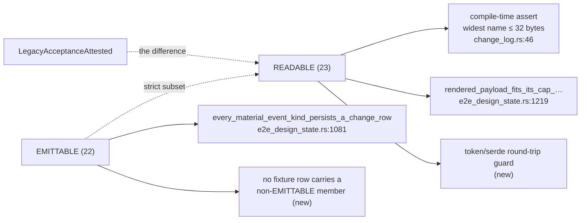
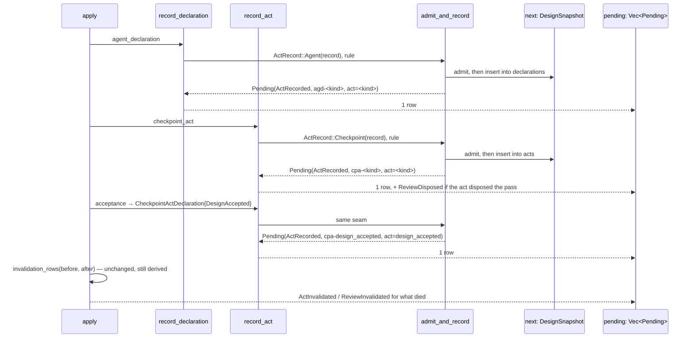

<!-- doctrine:section sec-1 -->
# 1. Current behaviour and target behaviour

A design run keeps a **change log**: an ordered list of rows, each naming one
material thing a submission did. It is the only sanctioned way to find out what
an `apply` changed — the run's own snapshot is runtime state, and the guardrails
tell agents not to read it. The shell renders every row the run hands back, so
whatever the log reports is what a caller sees.

This slice is about a gap between those two sentences. Some of what a submission
does never reaches the log, so the log's silence means two different things and
the caller cannot tell which.

## Current

Three code paths record an **act** — a durable statement by a person or an agent
that the run then holds as current. They disagree about whether recording is
worth reporting, and nothing states why.

| path | what it records | row emitted today |
|---|---|---|
| `record_declaration` (`run.rs:539`) | an agent declaration — e.g. `blocking-set-declared` | **none** |
| `record_act` (`run.rs:577`), no disposition | a user act at a checkpoint — e.g. `governance-confirmed` | **none** |
| `record_act`, carrying a review disposition | the same, plus how it disposed the current review pass | `ReviewDisposed` |
| run-level `acceptance` (`run.rs:407`) | a `DesignAccepted` checkpoint act, built through the same constructor | `AcceptanceAttested`, run-wide, no terms |

`record_declaration` validates the basis, resolves the fingerprint, admits the
record against its gate rule, hands it to the declaration group and returns
`Ok(())`. Nothing is pushed onto `pending`, so nothing reaches `Applied::rows`,
so the shell's render — the loop that extends its output with every row in
`Applied::rows`, at `commands/design.rs:1649` on `edge` and `:1771` in `SL-251`'s
landed capsule — has nothing to render. `record_act` is the same story with one
exception carved out of it: it returns `Option<Pending>`, and the `Some` arm is
reached only when the act carries a disposition.

So the same operation — *the run now holds this act* — is reported, unreported,
or reported under a name that describes something else, depending on which of
three constructors reached it. The split is not documented anywhere, and the
acceptance arm's row is the odd one out twice over: it is the only one that
fires, and it is run-wide and term-free while every sibling event is
subject-bearing.

There is a fourth path, and it is the one that shows the shape of the defect
most clearly. `invalidation_rows` (`run.rs:1842`) emits `ActInvalidated` when an
act **leaves the live set** — when the `(ActKind, DesignId)` pair it contributed
to `live_acts` (`run.rs:1777`) is absent after the apply. It is **derived** —
computed from a before/after difference rather than pushed by whoever did the
recording — and its doc gives the reason: a new way of moving a fingerprint
cannot forget to report what it killed.

Read that boundary precisely, because the design later depends on it. The pair
leaves the set when the act's covered material moves, which is what the doc means
by ceasing to bind. It does **not** leave the set when an act is displaced by
another of the same kind: `act_id` derives the id from the act (`run.rs:671`), so
a same-kind replacement contributes an identical pair and the difference is empty
in both directions. The doc comment on `live_acts` describes replacement as "a
death worth a row"; that is not what the code does, and the discrepancy is
`ISS-367`, raised from this design run and deliberately left to it (`sec-3`).

The consequence for this slice is narrower than *the log reports deaths but not
births*, and it is worth stating at the true width: the change log reports **some**
acts ceasing to bind, and **no** acts being made. A first act of any kind leaves
no trace at all.

### Why this is a correctness problem and not untidiness

`ISS-355` is the report: a successful `agent_declaration` apply exits 0 and
prints `revision N stage <stage>` and nothing else. `ISS-346` and `ISS-333`
describe a different defect — an unknown payload key is discarded, the revision
still bumps, a receipt is still written, and the command still exits 0.

Those two produce **byte-identical output**. The one observable that could
separate *your submission landed* from *your submission was silently dropped* is
absent exactly where it is needed, and the sanctioned route to check by hand
does not exist. This is not hypothetical: drafting this slice required seven
acts, and confirming each one landed cost a second command every time. The
sharpest instance came at the drafting-to-reviewing crossing, where one
submission carried both a `drafting-ready` declaration and a stage move: the
stage move rendered a row, the act recorded beside it in the same submission
rendered nothing.

## Target

Recording an act becomes a member of the material-change vocabulary. Every path
in the table above reports through one event, `ActRecorded`, whose subject is
the record's own id and whose payload is the single term `act=<kind>` — the
exact mirror of `ActInvalidated`, which already reports the death of a recorded
act by subject with the act kind as its one term.

| path | row after this change |
|---|---|
| `record_declaration` | `ActRecorded` |
| `record_act`, no disposition | `ActRecorded` |
| `record_act`, with a disposition | `ActRecorded`, **and** `ReviewDisposed` for the disposition (`DEC-241`) |
| run-level `acceptance` | `ActRecorded`; `AcceptanceAttested` retires to readable-only |

Every recording is now reported. Emission is explicit at the point of record
rather than derived, because a recording is an *occurrence* and no before/after
difference can see one — re-recording the same value leaves the difference empty
in both directions.

What this does **not** deliver is a symmetric account of an act's life. Births
become complete; deaths do not, because `ActInvalidated` still reports only the
deaths visible in the live-set difference and `ISS-367` is the gap. After this
slice the log says *every act that was made* and *the acts that died of coverage
movement*. Claiming more than that would promise the reader a symmetry the
change does not build.

## The one existing observable this changes

Every row above except one is a row that does not exist today. The exception is
the review-disposing arm, which goes from one row to two: it keeps
`ReviewDisposed` and gains `ActRecorded` beside it.

That is deliberate, and `DEC-241` carries the argument. In short: the two rows
are different claims — *the run now holds this act*, which is true of every act
however it arrived, and *this is how it disposed the current review pass*, which
only the disposing arm has to say. Suppressing the first on that one arm would
put an exception back into the seam `DEC-238` unified, keyed on a field of the
record being stored. Folding the act kind into `ReviewDisposed` instead was
refused on `R5` grounds: that event already carries up to two terms, and a third
would sit level with `WIDEST_PAYLOAD_EVENT`'s exemplar, which neither
compile-time assert would catch.

The cost is a test update wherever an exact row set is asserted for that path.

## What does not change

- **`ActInvalidated` stays derived.** Its set-difference construction is a
  feature, not an oversight: it is what stops a future fingerprint-mover
  forgetting to report what it killed. Nothing here converts it to an explicit
  push, and nothing here widens what it can see (`ISS-367`).
- **The shell.** The render described above already extends its output with every
  row in `Applied::rows`. It needs no change, and it is also one of `SL-251`'s
  design-targets, so it is fenced out of this slice's selectors.
- **The absorption mechanism.** A row saying an act was recorded is not a claim
  that every key in the submission was understood. Unknown-key refusal is
  `ISS-333` / `ISS-346` / `ISS-327` / `ISS-328`, gated on `QUE-219`, and
  `REQ-478` states the bound explicitly so the new row cannot be mistaken for
  coverage it does not provide.
- **Refused writes.** An `apply` abandoned in the pre-write window records
  nothing, and the assertion that pins this — `assert_eq!(after.change_log.rows.len(), 0)`,
  at `commands/design.rs:2457` on `edge` and `:2878` in the landed capsule —
  stays true unchanged. This was checked because `R4` flagged the risk of a
  capsule test pinning current behaviour; that assertion is about an abandoned
  write, not about a successful one, so the risk does not land there.

<!-- doctrine:section sec-2 -->
# 2. The change-event vocabulary

The change log's vocabulary is a closed Rust enum, `ChangeEvent`
(`src/design_run/change_log.rs:56`). Closed is load-bearing: the containment
check that proves a rendered row fits its budget enumerates the vocabulary, so
a member nobody sized cannot slip past a hand-picked example, and a compile-time
assert derives the event-name bound from the roster rather than trusting a
constant.

This section adds one member and splits one roster. Both are settled decisions —
`DEC-237` (*`ActRecorded` mirrors `ActInvalidated`*) and `DEC-239` (*readable and
emittable vocabularies are different sets*) — and what follows is the shape they
take in the type, not a re-argument.

## The new member

```rust
/// The run now holds this act.
///
/// The mirror of [`ChangeEvent::ActInvalidated`]: same subject convention, same
/// single `act` term. Emitted explicitly at the point of record rather than
/// derived, because a recording is an occurrence and no before/after difference
/// over `live_acts` can see one (`DEC-238`).
ActRecorded,
```

- **Token**: `act_recorded`, 12 bytes against `DESIGN_EVENT_NAME_BYTES` = 32.
  The current widest is `section_fingerprint_changed` at 27, so the compile-time
  assert is untouched.
- **Subject**: the record's own `DesignId` — `cpa-<act>` or `agd-<act>`,
  whichever group holds it. Not run-wide: the record has a run-local id, which is
  precisely `ChangeRow`'s stated test for carrying a subject.
- **Payload**: exactly one term, `act=<kind>`, built with
  `PayloadTerm::token(PayloadKey::Act, …)`. `PayloadKey::Act` already exists
  (`change_log.rs:293`) and already means *which recorded act this row is about* —
  no key is minted.

```rust
ChangeEvent::ActRecorded => &[(PayloadKey::Act, ValueKind::Token)],
```

One term, not more, and `DEC-237` gives both halves of the reason: the subject id
and the act kind together answer `ISS-355`'s question completely (*did what I
sent land?*), and a fourth term anywhere in this vocabulary would silently
falsify `WIDEST_PAYLOAD_EVENT` (`render/mod.rs:198`), which hardcodes
`StageMoved` as the three-term exemplar and which neither compile-time assert
would catch moving.

### Why the row is redundant-looking but is not

The subject already encodes the kind — `act_id` derives the id from the act
(`run.rs:671`), so `agd-graph_reviewed` and `act=graph_reviewed` say the same
thing twice. That is deliberate and it is inherited, not invented here:
`ActInvalidated` carries the same pair for the same reason. A row is
**self-contained** by contract (`change_log.rs`, module doc) — it renders without
consulting history — and a reader who has to know the id-minting rule in order to
read the kind off a subject is consulting history that happens to live in their
head. The two events are read side by side; making one legible by a rule the
other states as a term would be the worse asymmetry.

## The two rosters

`ChangeEvent::ALL` is replaced by two constants. The distinction is between what
a persisted snapshot may **contain** and what this binary may newly **write**.

```rust
/// Every event a persisted snapshot may contain and the renderer must handle.
pub(crate) const READABLE: [ChangeEvent; 23] = [ … ];

/// Every event this binary may newly write. A strict subset of `READABLE`.
pub(crate) const EMITTABLE: [ChangeEvent; 22] = [ … ];
```

The premise is already written down in this module — `change_log.rs:69-70`, in
the doc for the existing `evidence_invalidated` alias, says *"the vocabulary a
run writes is not the vocabulary it must read."* One `ALL` forced the two to be
equal, which is why `ISS-315` became a live breakage rather than a routine
retirement, and why *retain the variant but stop writing it* was not an available
move.

Each consumer takes the roster that matches the question it asks:



*The diagram's one non-obvious edge is the dotted one: `EMITTABLE ⊆ READABLE` is
an invariant a test asserts, not a relationship the type enforces.*

- **`READABLE`** governs rendering and bounds. A historical row must stay
  renderable within the same budget, so the widest-name assert and the payload-cap
  table both quantify over it.
- **`EMITTABLE`** governs writer coverage — in one direction only, and the
  asymmetry is worth naming because a reader will otherwise assume both.
  `every_material_event_kind_persists_a_change_row` proves every member **is**
  driven. Nothing in the type proves the converse, that nothing outside the
  roster is written: `Pending::about` and `Pending::run_wide` (`run.rs:257`,
  `:266`) take any `ChangeEvent`, so a writer emitting a retired member would
  compile and would leave every roster test green.

  That converse is bought with evidence rather than with types (`RV-360` `F-2`).
  A second check asserts that **no row the `every_event_fixture` ladder produces
  carries a member absent from `EMITTABLE`** — exhaustive over what the writer
  actually does on the path that drives every emittable member, rather than over
  a hand-maintained array. It is weaker than a type-level guarantee and stronger
  than the roster alone, and `sec-4` records which `REQ-478` criterion each half
  discharges.

## Retiring `AcceptanceAttested`

`AcceptanceAttested` becomes readable-only:

```rust
/// Read-only history. Superseded by [`ChangeEvent::ActRecorded`] once acceptance
/// flows through the shared record seam; retained because the change log is
/// append-only history and `ChangeEvent` deserialises strictly.
#[serde(rename = "acceptance_attested")]
LegacyAcceptanceAttested,   // payload_terms() => &[]
```

Three things are unchanged on purpose: the serde name, the rendered token, and
the stored payload shape (run-wide, term-free). Only the **Rust** name moves, and
that is the point — the type warns every future construction site that the
variant is history. `DEC-239` refused both alternatives on the record: a bare
serde alias renames the variant but not the row, so old run-wide term-free rows
would render as `act_recorded` with an empty payload and contradict the
self-contained contract; whole-row normalisation at deserialise would let the
reader manufacture a subject and an `act` term the writer never stored, and the
next snapshot write would persist the manufactured history as though it had
always had that shape.

### The retirement introduces a second source for one token

Today every member's wire token has exactly one literal. `as_str` spells it, and
serde derives its own from the variant name through
`#[serde(rename_all = "snake_case")]` — one written token per member, one
generated from the Rust identifier that already had to agree with it.

Renaming the Rust variant breaks that. `LegacyAcceptanceAttested` would derive
`legacy_acceptance_attested`, so the wire name has to be pinned with an explicit
`#[serde(rename = "acceptance_attested")]` — and `acceptance_attested` is now
written twice, once in the attribute and once in `as_str`. STD-001 governs this
slice and asks for a recurring token to be named once, so the duplication is
declared rather than left implicit (`RV-360` `F-4`).

It cannot be single-sourced: a serde attribute takes a string literal, not a
`const`, so there is no spelling of this that references one name from both
sites. What is available is a drift guard, and it is the more valuable half for
a compatibility-critical token — either spelling compiles alone, so the failure
mode is silent divergence, not a build error. `sec-4` adds a check asserting that
every `READABLE` member round-trips between its `as_str` token and its serde
representation. Notably, no such guard exists for this enum today; this slice adds
the first one rather than extending a pattern.

**Migration surface, measured:** 7 `acceptance_attested` rows across 6 live
snapshots (slices 243, 244, 248, 249, 251, 254). The `evidence_invalidated`
legacy that `ISS-315` broke on is 8 rows — the same order, and it is the worked
precedent for how this repo carries a retired token.

**Not adopted:** full type enforcement — an `EmittableEvent` wrapper or a second
enum making legacy emission unrepresentable. `Pending` still accepts any
`ChangeEvent`. `DEC-239` weighed this and judged a near-duplicate enum to cost
more synchronisation machinery than this vocabulary warrants; that judgement
stands, and the residual it leaves is the one named above and covered by
evidence rather than dissolved.

## What is not unified

`ActRecorded` does **not** absorb `ReviewAttested`. These are two lifecycle
families, and the split is by replacement key rather than by taste:

| family | replacement key | recorded | invalidated |
|---|---|---|---|
| act records (`CheckpointAct`, `AgentDeclaration`) | **act kind** — one live answer per kind | `ActRecorded` | `ActInvalidated` |
| section attestations | **attestation id** — reviewer lanes coexist | `ReviewAttested` | `ReviewInvalidated` |

`CheckpointActGroup::record` (`snapshot.rs:361`) retains-then-pushes keyed on
`ActKind`; `AgentDeclarationGroup::record` (`:387`) on the act discriminant;
attestations key on id, and that module's own doc calls the difference "the whole
design". The inverse events already encode the split — `ActInvalidated` carries
`act`, `ReviewInvalidated` carries `section` + `attestation` — so unifying the
forward events would leave the vocabulary disagreeing with itself about how many
families there are.

<!-- doctrine:section sec-3 -->
# 3. The emit seam

Three constructors record an act and they give three answers about whether that
is worth reporting. The repair is not to teach each of them to emit a row — that
is three places a fourth constructor could fail to join. It is to make storing an
act and reporting it one operation with one production route, so the split cannot
re-form by a caller choosing differently. This is `DEC-238`.

## Why the row cannot be derived

`ActInvalidated` is not emitted by whoever changed the content. It is computed by
`invalidation_rows` (`run.rs:1842`) from a before/after difference over
`live_acts` (`run.rs:1777`), and the doc gives the reason: a new way of moving a
fingerprint cannot forget to report what it killed. That set already chains
**both** record kinds, so a reverse difference looks like a zero-signature-change
fix.

It cannot work. For a slot already holding `v`, *no operation* and *record the
same value* both read `before = v, after = v`, so no function of the pair
separates them. `DEC-238` carries the full argument, including why adding the
fingerprint to the tuple only detects unequal replacement and why an occurrence
identity in the tuple would turn the operation into state. The general statement
is the one to carry forward: **a derived row can only report changes in the key
of the set it differences.**

There is a live consequence of that in the current code, and it is captured
rather than repaired here. Because `act_id` derives the id from the act kind
(`run.rs:671`), a same-kind replacement leaves `(ActKind, DesignId)` identical,
so `ActInvalidated` never fires for it — even though `CheckpointActGroup::record`
retains-then-pushes and the act it displaced is genuinely dead. That is
**`ISS-367`**, authored from this run, `concerns DEC-238`, sequenced `after
SL-256`. This slice does not widen to it: `ActRecorded` reports the recording,
which is `ISS-355`'s complaint, and under-reported invalidation is a separate
defect on the other end of the lifecycle. `sec-1` states the boundary in the same
terms, so the design does not promise a symmetry `ISS-367` withholds.

## Where the row is built

**Not on `RecordedAct`** (`attestation.rs:796`). That sum's third arm, `Section`,
carries no record at all — its doc says so, and "the absence is the finding" — and
every accessor on it resolves from the shape without reading a field. Giving it
`id() -> Option<&DesignId>` would put a question one arm cannot answer into an
abstraction whose whole value is that its accessors are total.

So: a second, narrower sum over the two kinds that have an address.

```rust
/// One act record that can be stored and named in a change row.
enum ActRecord {
    Checkpoint(CheckpointAct),
    Agent(AgentDeclaration),
}

impl ActRecord {
    /// The borrowed view admission and the gate interrogate.
    fn admission_view(&self) -> RecordedAct<'_>;
    fn id(&self) -> &DesignId;
    fn kind(&self) -> ActKind;
    /// Into whichever group holds this shape.
    fn insert(self, next: &mut DesignSnapshot);
}
```

This is not parallel modelling, and the test for that is whether the two sums
answer the same question. They do not. `RecordedAct` asks *can admission and the
gate interrogate this act?* — borrowed, three arms, total accessors. `ActRecord`
asks *can this concrete record be stored and named in a row?* — owned, two arms,
addressable. The `Section` arm is exactly the case that separates them.

**It is sited in `run.rs`, and `attestation.rs` was never available.** Cohesion
points here on its own: `ActRecord` exists for the writer, and the writer's other
pieces — `Pending`, `act_id`, `record_declaration`, `record_act` — are all in
`run.rs`, while `attestation.rs` holds the record types and the reader's view of
them. But the boundary is harder than a preference. `src/design_run/attestation.rs`
is named in this slice's Non-Goals as one of `SL-251`'s design-targets,
deliberately out of bounds; it is not merely absent from the selector list. Had
cohesion pointed the other way, this would have been a scope question rather than
a siting question. It does not, so the two agree.

## The seam

```rust
fn admit_and_record(
    next: &mut DesignSnapshot,
    record: ActRecord,
    rule: Option<ActRule>,
    derived: &DerivedInput,
) -> Result<Pending, Refusal>
```

It admits through `admission_view()`, inserts into the right group, and returns
the row — mandatory, not `Option<Pending>`. What that buys, at the strength the
code supports:

- The three production recording paths collapse to one. The asymmetry this slice
  exists to delete cannot re-form by a caller choosing differently, because there
  is one place left that chooses.
- A record kind added **through the seam** cannot omit its row. The return type
  is `Pending`, so there is no arm in which emission is optional.

What it does **not** buy is unbypassability, and an earlier draft of this section
claimed otherwise (`RV-360` `F-1`). `CheckpointActGroup::record` (`snapshot.rs:361`)
and `AgentDeclarationGroup::record` (`:387`) are `pub(crate)`, so the storage
sinks stay reachable from anywhere in the `design_run` tree. Wrapping them in
`ActRecord::insert` stops *using* the direct route; it does not close it. A future
production caller could still store an act without producing a row.

Closing it properly would mean restricting those methods' visibility, which
breaks the eight existing direct callers in `fixture.rs` and `tests.rs` — the
first outside this slice's selectors, the second one of `SL-251`'s design-targets.
So the invariant is weakened rather than enforced, `DEC-238` carries an appended
correction saying so, and what remains is a convention held by there being one
obvious route rather than a guarantee held by the type system.

`admit_against` (`run.rs:652`) is **deleted**, not left beside it. It has exactly
two callers (`:565`, `:619`) and both become `admit_and_record`, so keeping it
would leave two ways to admit a record with only one of them emitting — which is
the defect this section is closing, one layer down.

## The two record paths

```rust
fn record_declaration(
    next: &mut DesignSnapshot,
    declared: &AgentActDeclaration,
    derived: &DerivedInput,
) -> Result<Pending, Refusal>

fn record_act(
    next: &mut DesignSnapshot,
    declared: &CheckpointActDeclaration,
    derived: &DerivedInput,
    payload_digest: &str,
) -> Result<Vec<Pending>, Refusal>
```

Two changes worth naming.

**`record_declaration` takes the declaration, not the whole `ApplyRequest`, and
returns `Pending` rather than `()`.** Its caller hoists
`request.agent_declaration.as_ref()`, which it is the only reader of. The current
early `return Ok(())` for an absent declaration is `ISS-355` in miniature —
*nothing was supplied* and *something happened* sharing one return value — and
removing it is what makes the mandatory row expressible in the type.

**`record_act` returns `Vec<Pending>`, one or two rows.** One on every path;
two on the arm that carries a review disposition, where `ActRecorded` and
`ReviewDisposed` sit side by side (`DEC-241`). The order within the vector is
`ActRecorded` first, then `ReviewDisposed`: the recording is what makes the
disposition addressable, and goldens assert an ordered row sequence, so the
order is part of the contract rather than an artefact of construction. The
optional disposition row is constructed **before** `admit_and_record` is called,
so a row-construction failure precedes mutation.

## The call sites

Three, all in `apply` (`run.rs:380-410`).

```rust
// before
record_declaration(&mut next, request, derived)?;
if let Some(declared) = request.checkpoint_act.as_ref() {
    pending.extend(record_act(&mut next, declared, derived, payload_digest)?);
}
if let Some(declared) = request.acceptance.as_ref() {
    record_act(&mut next, &CheckpointActDeclaration { … }, derived, payload_digest)?;
    pending.push(Pending::run_wide(ChangeEvent::AcceptanceAttested, Vec::new()));
}

// after
if let Some(declared) = request.agent_declaration.as_ref() {
    pending.push(record_declaration(&mut next, declared, derived)?);
}
if let Some(declared) = request.checkpoint_act.as_ref() {
    pending.extend(record_act(&mut next, declared, derived, payload_digest)?);
}
if let Some(declared) = request.acceptance.as_ref() {
    pending.extend(record_act(&mut next, &CheckpointActDeclaration { … }, derived, payload_digest)?);
}
```

The acceptance arm is where three things land at once. Its discarded return value
becomes an `extend` — the comment justifying the discard ("carries no
disposition, so it owes no `review_disposed` row") described a return type that
no longer means that. The explicit `AcceptanceAttested` push is deleted, and the
`DesignAccepted` act now reports through the same `ActRecorded` row as every
other act, subject `cpa-design_accepted`. That is what makes `AcceptanceAttested`
redundant and therefore retirable (`sec-2`, `DEC-239`), and it is also the arm
whose row goes from run-wide and term-free to subject-bearing — a change in
rendered output that `sec-1` counts and the verification section pins.

**The build order does not move.** The declaration still runs before the act, so
an act confirming a declaration is given the fingerprint of the record the engine
just wrote, and `DEC-121`'s *the agent declares and the user confirms* still
arrives in one submission.



*The diagram shows the production funnel: every arrow that reaches `next` on a
recording path passes through `admit_and_record`, and the only row-producing path
that does not is the derived one at the bottom. It is a picture of what the code
does, not of what the module prevents — the sinks `S` writes to remain callable
directly, as above.*

## Invariants this must not disturb

- **Admission still precedes storage.** `admit_and_record` admits before it
  inserts; a refused record leaves the snapshot untouched and returns `Refusal`,
  exactly as the two `admit_against` call sites do today.
- **A refused or abandoned write emits nothing.** Unchanged, and pinned by an
  assertion that stays true unchanged — see `sec-1`.
- **`ActInvalidated` stays derived**, computed after all three record paths have
  run, so an act displaced during this apply is still differenced against the
  snapshot the apply started from.
- **`Pending` keeps its private fields and its two constructors.** Nothing here
  needs a third; `ActRecorded` is a subject-bearing row and takes
  `Pending::about`.

<!-- doctrine:section sec-4 -->
# 4. Verification and code impact

## Code impact

| path | intended change |
|---|---|
| `src/design_run/change_log.rs` | `ActRecorded` and `LegacyAcceptanceAttested` variants; `ALL` → `READABLE` + `EMITTABLE`; `as_str` and `payload_terms` arms for both; the compile-time widest-name assert re-quantified over `READABLE` |
| `src/design_run/run.rs` | `ActRecord` sum; `admit_and_record`; `admit_against` deleted; `record_declaration` and `record_act` signatures; the three call sites in `apply`; the `AcceptanceAttested` push deleted |
| `src/design_run/bounds.rs` | one doc reference to `ChangeEvent::ALL` (`:49`) follows the rename to `READABLE` |
| `src/design_run/snapshot.rs` | test module only — a legacy-fragment pin for the retired token |
| `src/design_run/render/mod.rs`, `render/change_row.rs` | expected untouched; the renderer reads `payload_terms`, and a one-token row needs no new handling. In the fence because a rename they do not survive would surface here |
| `tests/e2e_design_state.rs` | the two roster enumerations re-pointed; one fixture comment corrected; seven new checks |

**The `render` selector narrows.** This slice currently fences
`src/design_run/render/**`, which covers `render/envelope.rs` — a file the
Non-Goals separately declare out of bounds as one of `SL-251`'s design-targets,
and one that slice has now changed. The glob and the Non-Goal contradict each
other, and the glob is what `doctrine slice conformance` reads. It is replaced by
the two files named above, both untouched by `SL-251`'s landed capsule.

**Two files inside the blast radius but outside the fence, both checked.**
`src/design_run/tests.rs` and `src/design_run/fixture.rs` call the storage sinks
directly (`sec-3`), so a reader will ask whether they move. They do not: neither
references `ChangeEvent::ALL`, `admit_against`, or any event this slice renames.
`tests.rs` is one of `SL-251`'s design-targets, so if that answer ever changes it
is a scope question, not an edit.

## What is verified, and how

Everything below is `VT`. The behaviour is a rendered row on a command's output
and a persisted row in the change log — both machine-observable, neither needing
an agent's judgement.

### New — the defect, pinned

Written in the idiom of `a_waived_disposition_row_names_its_arm_and_carries_its_reason`
(`tests/e2e_design_state.rs:1110`): find the row by event, then assert its subject
and its ordered terms. Asserting all three matters, because each alone is a fact
the snapshot already held.

1. **`an_agent_declaration_alone_renders_a_change_row`** — `ISS-355`'s exact
   report. An apply carrying only `agent_declaration` yields a row with event
   `ActRecorded`, subject `agd-<kind>`, terms `[<kind>]`. This is the red.
2. **`a_checkpoint_act_without_a_disposition_renders_a_change_row`** — the
   sibling `record_act` path, subject `cpa-<kind>`. Named separately because
   `ISS-355` reported one of two and the second was found in scoping.
3. **`a_disposing_act_renders_both_its_recording_and_its_disposition`** —
   `DEC-241`. Two rows for one act, `ActRecorded` before `ReviewDisposed`,
   asserted as an ordered pair rather than as set membership, because the order
   is the contract.
4. **`an_acceptance_reports_through_the_shared_act_row`** — the run-level
   `acceptance` field yields `ActRecorded` with subject `cpa-design_accepted` and
   term `act=design_accepted`, and **no** `acceptance_attested` row. This is the
   one test that would catch the retirement being half-done.

### New — the roster invariants

5. **`the_retired_event_is_readable_but_not_emittable`** —
   `LegacyAcceptanceAttested` is absent from `EMITTABLE` and present in
   `READABLE`, and `EMITTABLE` is a subset of `READABLE`. The invariant `sec-2`'s
   diagram draws as a dotted edge; nothing in the type enforces it.
6. **`no_row_the_ladder_produces_carries_a_non_emittable_event`** — every row in
   `every_event_fixture`'s change log has an event in `EMITTABLE`. This is the
   converse of check 5 and the answer to `RV-360` `F-2`: the
   roster array cannot prove that nothing outside it is written, because
   `Pending`'s constructors take any `ChangeEvent`, so the evidence has to come
   from what the writer actually emitted on a path that drives every emittable
   member. It fails if a retired member is still being pushed anywhere the ladder
   reaches.
7. **`every_readable_event_token_round_trips_through_serde`** — for each
   `READABLE` member, its `as_str` token and its serde representation agree.
   `sec-2` explains why this is needed now and was not before: the retirement
   forces `acceptance_attested` to be written twice, in the `serde(rename)`
   attribute and in `as_str`, and a serde attribute cannot reference a `const`.
   Either spelling compiles alone, so without this the failure mode is silent
   divergence on a compatibility-critical token (`RV-360` `F-4`). No such guard
   exists for this enum today.

### New — the retired token still parses

**`a_snapshot_written_before_the_acceptance_attested_retirement_still_parses`**,
in `snapshot.rs`'s test module, mirroring
`a_snapshot_written_before_the_act_invalidated_rename_still_parses` (`:745`) —
the same defect class, the same whole-file tier, and the precedent this repo
already set for carrying a retired token. A snapshot fragment carrying a run-wide,
term-free `acceptance_attested` row parses, and the row keeps that shape rather
than acquiring a manufactured subject.

Pinned at the whole-file tier for the reason that doc already gives:
`ChangeEvent` deserialises strictly, so one unrecognised `event` fails the entire
snapshot rather than one row. That is `ISS-315`'s defect class, and 7 rows across
6 live runs are the population at stake.

### Amended — the two roster enumerations and one comment

- **`every_material_event_kind_persists_a_change_row`** (`:1081`) iterates
  `EMITTABLE`. It is the check that makes an unwired member fail loudly rather
  than be quietly absent, so it must not enumerate a member no writer may
  produce.
- **`rendered_payload_fits_its_cap_for_every_event_kind`** (`:1219`) iterates
  `READABLE`, so the retired member's saturated payload stays inside the budget.
  This is the real guard on `R5` (`WIDEST_PAYLOAD_EVENT` is a hardcoded exemplar
  that neither compile-time assert would catch moving), and `ActRecorded`'s single
  term keeps well clear of it.
- **The `every_event_fixture` ladder needs no new input, but its narration is
  wrong after this change.** The fixture's payloads already record acts, so
  `ActRecorded` is driven for free. The comment at `:937-943` names the review
  vocabulary as `finding_raised, finding_disposed, acceptance_attested`, and
  retiring the third makes that false — while `ActRecorded` arrives from several
  earlier and later act submissions rather than from the block the comment
  describes. The behavioural fixture is sufficient; the load-bearing narrative is
  not, and correcting it is part of this slice's test-file change (`RV-360`
  `F-6`).

### Not a test

The event-name bound is proved, not asserted at runtime:

```rust
const _: () = assert!(widest(&ChangeEvent::READABLE) <= DESIGN_EVENT_NAME_BYTES);
```

`act_recorded` is 12 bytes against a 32-byte bound whose current widest is 27, so
this cannot fail — but it is the discharge of `REQ-437` (SPEC-029 `NF-002`) and
the rename must carry it across rather than drop it.

## Why nothing else in the suite moves

`DEC-241` says any test asserting an exact row set for the disposing path moves.
The suite was checked rather than assumed, and the argument has two parts,
because the first one alone is not true (`RV-360` `F-7`).

**Most change-log assertions select by event before asserting**, so a row of a
different event is invisible to them — including the disposing arm's own
assertions (`tests/e2e_design_review.rs:1415`, and the `disposition_rows` helper
at `:1429`), which filter on `ChangeEvent::ReviewDisposed`.

**Three do not, and they are named rather than covered by the generalisation.**
`change_log_floor_is_recorded_not_inferred` (`:708-725`) and
`retention_evicts_oldest_revisions_and_advances_the_floor` (`:1150-1165`) scan
every row's revision; `within_revision_index_is_candidate_order_not_submission_order`
(`:786-815`) maps every row without filtering. Each is stable for a reason that
has to be stated per fixture rather than inferred from event invisibility: none
of their fixtures records an act, so no new row enters their scan. That is a
fixture-level fact, and it is the one an implementor must re-check if any of
those fixtures is later given an act to record.

Two further checks, both clean:

- **No test indexes rows positionally.** There is no `rows[0]` or `since(0)[n]`
  anywhere in the design e2e suite.
- **Every stdout assertion is `contains`, not equality** — checked across
  `e2e_design_checkpoint`, `_review`, `_runbook`, `_delegation`, `_materialise`
  and `_projection`. An added rendered line is additive, not breaking.
- **The one exact row-count assertion is about an abandoned write** and stays
  true unchanged (`sec-1`).

So the fence holds and no test file outside it needs an edit. The residual is
stated rather than assumed away: if the suite disagrees at execution, the remedy
is a selector widening recorded at plan time and a conformance re-run, not a
quiet edit outside the fence.

## Conformance and coordination

- `doctrine slice conformance` reports no edit outside the fenced surface — in
  particular none inside `SL-251`'s design-targets, of which
  `src/commands/design.rs` is one. This design needs no change there: the shell
  already extends its output with every row in `Applied::rows`, which is why the
  repair is entirely engine-side.
- **`SL-251` has landed** (15 commits, `refs/capsule/d/heads/work`). Its diff was
  checked against this slice's selectors rather than argued from the file list
  `R4` anticipated: it touches ten files under `src/`, **none** of which is one of
  this slice's specific selectors, and no file under `tests/` at all. The only
  intersection was the `render/**` glob, narrowed above.
- **The `SL-251` coordination note has a third site, in shipped source.** The
  scope tracks that slice's `design.md` ¶ at 422–428 and its ledger row at 2289.
  The capsule landed a third at `payload_contract.rs:501`, on
  `UnknownKeys::SilentlyDropped`: *"the key is accepted and discarded in silence,
  and a correct submission prints no change row either, so the caller has no
  observable that separates landed from discarded."* All three take the same
  one-clause touch at `SL-251`'s reconcile, and the nuance is the same in each:
  the conclusion survives, because a misspelt key rides *inside* an otherwise-valid
  struct and an `ActRecorded` row says nothing about a key dropped within it. Only
  the unqualified premise goes false, and only for act-recording submissions.
- **`SL-238` is disjoint** and was checked, not assumed: its fourteen selectors
  are backlog, priority and command-tier paths with no member in common with this
  slice's six. `ISS-355` appears in its design once, as prose illustrating a
  footer line format, and its fixtures pin classes rather than corpus counts — so
  closing `ISS-355` costs it nothing. `STD-003` was minted from that slice, which
  strengthens `DEC-240` rather than threatening it: the standard's own subject is
  a degraded *read*, and this defect is emission on a successful write.
- `ISS-355` closed. `ISS-367` (`live_acts` blind to same-kind replacement) stays
  open and sequenced `after SL-256` — it is the other end of the act lifecycle and
  is deliberately not repaired here.

### `REQ-478`

Authored `pending` under SPEC-029 by `DEC-240` (*Report every recorded mutation on
the change log*). Its three acceptance criteria are discharged by checks above —
the mapping is not one-to-one, so it is stated:

| criterion | discharged by |
|---|---|
| an apply that records an act emits a row naming its subject and kind | checks 1–4 |
| every emittable member is driven by the ladder | `every_material_event_kind_persists_a_change_row` over `EMITTABLE` |
| retired vocabulary is readable-only and carries no emission obligation | check 5 (roster membership), check 6 (nothing outside `EMITTABLE` is actually emitted), and the legacy-fragment round-trip (it still parses) |

The third row is three checks rather than one because the criterion has two
halves — *readable* and *carries no emission obligation* — and the roster array
alone evidences neither (`sec-2`, `RV-360` `F-2`).

**The coverage cell must bind a runnable check, not just a mode.** An earlier
draft gave the recipe as `--mode VT` alone. That does not record a `VT` check at
all: `CoverageRecordArgs::has_check` (`src/coverage_store.rs:289-300`) returns
false when no alias, command, extra-arg or matcher is supplied, so `record` takes
the attestation branch (`:132-139`), stores the default `Verified` status with
today's date, and the verifier then treats a check-less entry as backfill and
leaves it alone (`src/coverage_verify.rs:125-135`). The result reads as verified
`VT` with no test bound to it — the same empty claim this slice exists to close
(`RV-360` `F-3`). The recipe is therefore:

```
doctrine coverage record --slice 256 --requirement REQ-478 --change 256 --mode VT \
  --command cargo --command test --command --test --command e2e_design_state \
  --matcher-source stdout \
  --matcher-pattern 'an_agent_declaration_alone_renders_a_change_row \.\.\. ok' \
  --regex
```

The matcher is a **positive control**, and that is why it names one test rather
than matching `test result: ok`: a pass-count pattern also matches a run in which
the new checks were never compiled, whereas this one fails unless `ISS-355`'s own
case ran and passed. The remaining checks ride the same target, whose non-zero
exit fails the command outright.

Recorded once those checks exist, not now — a coverage cell pointing at a test
that has not been written is the same empty claim again. `REQ-478` moves
`pending` → `active` at close, on that evidence.

