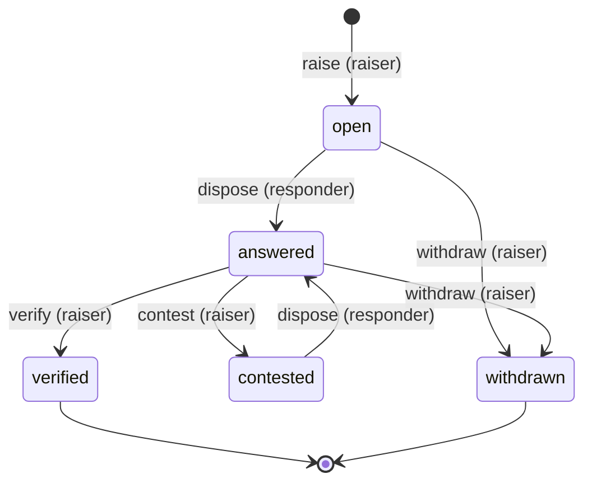
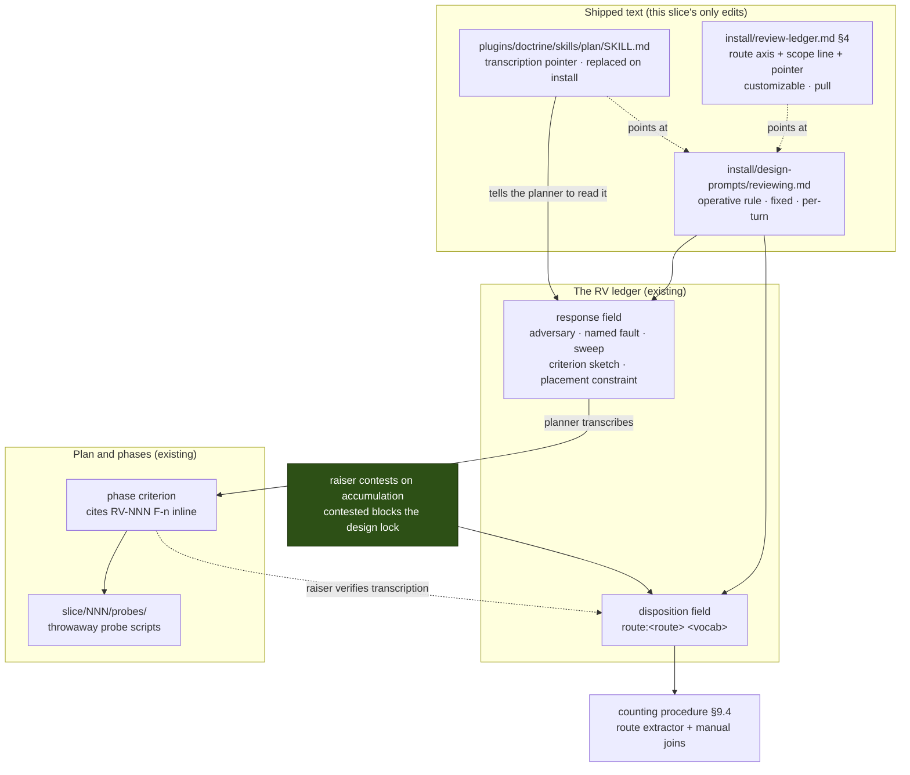

<!-- doctrine:section sec-1 -->
# Design SL-260: Design-review finding routing convention and trial

## 1. Design Problem

### What changes

Today, when a design review raises a serious finding, the author answers it in
prose. Under this design, the author additionally names **one instrument** that
could settle it — `review`, `demonstrate`, `probe`, `control`, or `owner-fix` —
and for three of those five, **stops writing prose entirely**. The obligation
becomes a criterion on a phase of the implementation plan, and the argument is
settled by running something rather than by writing more.

That is the whole behavioural change. It is delivered as text in three files
that already ship, recorded inside a field that already exists, and counted by a
procedure built from verbs that already exist. There is no new entity kind, no
schema change, **no new normative owner** — the rule is written once and the
other two surfaces point at it — and **no change under `src/`**.

### Why it matters

`RFC-026`'s evidence entry `E11` classified 137 blocker and major findings
across eleven design-review ledgers. Two results drive this design:

- **Six severe findings in ten are mechanism predictions** — the design asserted
  code-level detail that turned out wrong or unestablished. They split in two:
  *structural* ones, which a thin implementation exposes immediately, and
  *discriminating-input* ones, which compile and pass ordinary tests and surface
  only under a hostile or edge-case input. Converged reviews were mostly the
  first kind; non-convergent ones mostly the second.
- **Thirty-one findings were raised against repair text** in the non-convergent
  group, against one in the comparison group. The prose written to answer a
  finding became the surface for the next finding.

`RFC-026` `P10` reads this as one prose loop being asked to settle four
different kinds of question while being good at one. Routing splits the
question kinds apart and sends each to an instrument that can actually close it.
The second result is the direct target: **no repair text, no findings against
repair text.**

### Where the boundary sits

This slice **stands the convention up and fixes the trial's rules**. It does not
run the trial — that happens across the next three code-changing slices and is
reported by a backlog chore gated `after` this one. Fixing the rules includes
fixing the **collection and classification procedure** (§9.4): a method chosen
after the outcomes are visible is not a measurement.

Three boundaries are worth stating because a reader will otherwise assume
otherwise:

- **No code.** Not "minimal code" — none. A `src/` change would newly bind
  `STD-001`, `STD-003` and `POL-002`, and would falsify the no-tooling claim the
  slice rests on. That is a tripwire, not a preference. (`STD-002` binds this
  design already, with or without a `src/` change — see §3.1.)
- **No enforcement.** The convention is honour-system with one exception.
  Exactly one clause has mechanical force; the slice close adds a *forcing
  moment* — it will not let a blocker be closed over without someone performing
  the verify act — but it reads nothing about that act's content. Everything
  else is detected, if at all, by the trial's counting pass. This is recorded in
  full at `CON-006` rather than left to be discovered.
- **No causal claim.** The trial is a combined intervention — routing overlaps
  with `RFC-026` `P2`'s delegation rule — over three ledgers, with no pass mark.
  It answers *can this operate*, not *does this work*.

### What a reader must hold to follow the rest

One fact reframes most of the design and is easy to get wrong. **Two gates read
a review ledger under different rules.** The design run's `reviewing → locked`
gate blocks only on blockers that are `open` or `contested`. The slice's close
gate refuses `audit → reconcile` while a blocker is short of `verified`. They
differ by exactly the `answered` state, deliberately. A routed finding is
`answered` the moment it is disposed — so it never held the design lock, and the
gate this design must reason about is the slice close, not the design lock.

<!-- doctrine:section sec-2 -->
## 2. Current State

### 2.1 The finding turn machine

`ADR-007` makes adversarial review a first-class kind. A finding moves through a
small state machine with role-gated verbs (`src/review.rs:780-807`):



Three properties of this machine are load-bearing below. **`verified` is
terminal**: no verb transitions a finding out of it (`src/review.rs:703-728`), so
a verified disposition is the immutable audit-time record of what was decided
then. **There is no amend verb**: once disposed, a finding is `answered`, and
`dispose` refuses to rewrite it — the only way back is the raiser's `contest`,
which returns it to `answered` for re-disposition. And **`verify` reads nothing
but the ledger**: its whole signature is the review reference, `--finding`, an
ephemeral `--note` and `--as`, and its gate checks status and role, never
content (`src/review.rs:2834`). No raiser act can be made conditional on state
outside the ledger without a `src/` change.

### 2.2 The two gates, and the one state between them

This is the fact section 1 flagged, stated precisely.

| gate | predicate | blocks on | where it fires |
|---|---|---|---|
| design lock | `undisposed_blockers` (`src/review.rs:1705`) | blockers in `open` or `contested` | the design run's `reviewing → locked` |
| slice close | `doc_unresolved_blockers` (`src/review.rs:1669`) | blockers short of `verified` | `audit → reconcile`, `reconcile → done` |

The predicates differ by exactly the `answered` state, and the split is
deliberate — the code says so. The slice close asks *is this review finished*,
and a disposed-but-unverified blocker is not. The design lock asks *has this
pass been disposed of*, and an answered blocker has been.

Note what the close gate does and does not buy. It forces the raiser to *act* on
every blocker before the slice can close. It cannot condition that act on
anything — see §2.1 — so it is a forcing moment on attention, not a check on
substance. §5.5 depends on this distinction and §7.2 records where an earlier
draft of this design got it wrong.

`DEC-138` (*review disposition binds the responder's turn, not the raiser's
assent*) requires this asymmetry be stated wherever it is relied on, because it
otherwise reads as a bug. This design relies on it throughout.

### 2.3 What the design lock actually needs

Not the verify. The `reviewing → locked` gate needs the raiser's **concluded**
marker plus the `review-disposed` act. `doctrine review conclude`'s own help
states the position: *"Open findings are fine: disposing them is the responder's
work afterwards."* Conclusion is about the reviewer having stopped looking;
`done` is about the findings. They are deliberately different facts.

### 2.4 The disposition field

`doctrine review dispose --disposition` is **free text**. `install/review-ledger.md`
§4 publishes a five-value vocabulary — `aligned`, `fix-now`, `design-wrong`,
`follow-up`, `tolerated` — introduced as *"(use consistently)"*, and `RFC-026`'s
entry `E1` found **61 distinct values** actually in use. Nothing validates the
field, which is what makes a prefix convention possible without a schema change,
and also what makes it unenforceable.

`--response` is likewise a single free-text CLI argument. There is no `@file`
form and no stdin form, so its content reaches the ledger through whatever shell
invoked the command — the hazard §5.4 carries, and the reason the remedy has to
be a content rule rather than a transport change.

### 2.5 The three shipped surfaces

| file | tier | may a client diverge? | fires when |
|---|---|---|---|
| `install/design-prompts/reviewing.md` | per-turn process fragment | no — `customization = "fixed"` | a design run enters or continues `reviewing` |
| `install/review-ledger.md` §4 | `ADR-005` PULL-tier reference | yes — `customization = "customizable"` | anyone looks up how to dispose |
| `plugins/doctrine/skills/plan/SKILL.md` | agent skill | no — overwritten every install | `/plan` runs, i.e. at transcription |

The fragment is emitted **every reviewing turn**; its *body* is elided when the
caller declares a current `name@digest` receipt (`src/commands/design.rs:2605-2631`).
So an agent either holds the current bytes or is re-sent them, and any edit
invalidates every held receipt — a stronger guarantee than "re-sent each time".

The skill tree is derived, not authored-then-preserved: skills are embedded from
`plugins/` (`src/install.rs:20`) and `copy_skill` writes each file
unconditionally (`fs::write`, `src/install.rs:2036-2038`), so `doctrine install`
replaces them. There is no user copy that can silently diverge, which is why a
plan-side pointer has delivery strength comparable to the `fixed` fragment
rather than to the customizable reference.

`install/review-ledger.md` states in its own header that it owns the **invariant
protocol shared by every review skill** (`/audit`, `/code-review`,
`/inquisition`). That scope is why §2.5's asymmetry matters and why §5 scopes
what goes there.

`install/design-prompts/reviewing.toml:8-14` already states in-repo that the
attack surfaces belong in the sibling prose fragment and not in a `[[step]]`.
`DEC-101` (step ids are API) is the authority; this design cites both rather
than re-arguing the point.

### 2.6 What does not exist

- **No cross-ledger counting command.** Nothing aggregates findings across
  reviews by severity and disposition, and nothing at all joins a finding to the
  evidence its instrument later produced — the join §9.4 has to specify by hand.
- **No durable sink for probe evidence.** `IMP-324` records this. Under
  `.doctrine/slice/NNN/`, only `research/`, `phases`, `handover.md` and
  `inquisition.md` are gitignored (`.gitignore:47-51`), so a sibling directory
  commits by default — the gap was a name, not a mechanism.
- **No governance owner for promoting a finding into a criterion.** `SPEC-031`
  owns criterion identity and evolution and is silent on promotion. The form has
  prose precedent: `.doctrine/slice/026/plan.toml:46` carries `EX-3 … (RV-093 F-1)`.
- **No standing instruction to the planner to read a review ledger at all.**
  `/plan` does not mention the design's RV. This is the gap §5.2's third insert
  closes; until it is closed, an obligation held only on the ledger is addressed
  to nobody.

<!-- doctrine:section sec-3 -->
## 3. Forces & Constraints

### 3.1 Governance that binds

**`DEC-103` — instruction is delivered at the point of effect.** The decisive
authority, and it cuts both ways.

- *Corollary 2* — *"An obligation firing at several moments is hung at EVERY one
  of them, not demoted to prose"* — together with *corollary 1*, *"DRY is the
  wrong model for agent instruction"*, **requires** the convention be delivered
  at each moment it fires rather than once with a cross-reference. The most
  predictable objection to this design ("why is this written three times?") is
  answered by governance, not by argument. What corollary 2 requires is that the
  obligation be *hung* at every moment — not that the same normative sentences
  be retyped at each. §5.2 hangs it three times and states it once.
- *The residue rule* — *"Where an obligation genuinely has no locatable moment,
  it stays prose AND is recorded as unenforced-by-construction"* — **requires**
  the honour-system clauses be labelled as such. `CON-006` is that record.

**`STD-002` — short titles, ids not slugs.** Binds directly, and with no
`src/`-change precondition: its Scope reaches *"all authored doctrine entities …
[and] every reference to an entity (prose, commit scopes, comments, code)"*. So
it governs this `design.md`, the slice scope, the knowledge records this run
minted, and the convention prose itself. Two obligations follow and are
discharged throughout: cite durable ids (`RFC-026`, `CON-006`, `RV-NNN F-n`),
never slugs or mobile `FR-`/`NF-` labels; and keep entity titles to a one-line
handle. The route tokens are not entity references, so `STD-002` has nothing to
say about the instrument vocabulary itself — but that is a statement about
*which clause* applies, not about whether the standard is in scope. An earlier
draft of §3.2 claimed the latter; `RV-371` `F-1` caught it.

**`DEC-138` — review disposition binds the responder's turn.** Its consequences
section makes stating the two-gate asymmetry an obligation on this design, not
an option.

**`ADR-007` D-C5 / D-C9b.** The responder owns `disposition` and `response`; the
raiser owns `verify` / `contest` / `withdraw`; `blocker` is the only severity
that gates. This design changes *what standard the raiser applies at `verify`*,
not who holds the act.

**`DEC-126` + `DEC-125` — the design gate is an attestation ledger, not a
checker.** An outstanding-findings summary warns rather than blocks, which is
why the design lock can close over a routed obligation.

**`ADR-005` — shipped knowledge is tiered by access pattern.** The three targets
sit in different tiers, which is what makes the delivery argument in §3.3 sound
rather than rhetorical.

**`DEC-101` — step ids are API.** Owned once in `exploring.toml` and governing
`reviewing.toml` unchanged. Adding a `[[step]]` would mint a new API id; editing
the prose fragment carries no such contract. This is the authority behind the
`reviewing.toml` non-goal.

**`POL-001`** reaches the shipped convention prose. **`SPEC-031`** binds the
*form* a routed obligation must take once it is a criterion, and says nothing
about promotion. **`ADR-017`** makes the chore's `after` edge ordinary
work-to-work machinery.

**`RFC-026` is provenance, not authority.** Per `ADR-014` an RFC *"asserts no
canon"*. This design **adopts** `P10`; it is not bound by it, and it departs
from `P10` where the mechanism requires (see §7).

### 3.2 Checked and not applicable

Each dismissed with a reason, because an unexplained absence is indistinguishable
from an oversight.

- **`STD-001`** (no magic strings) scopes to *"all source under `src/` (and
  tests)"*. The `route:` token lives in an authored free-text field and in
  shipped prose; nothing in `src/` parses or names it.
- **`STD-003`** (no silent skip) governs shipped readers of authored corpus data.
  This design adds no shipped reader.
- **`POL-002`** governs shipped mechanism. A slice-local `jq` command is not
  shipped behaviour. It *does* bear on §5's form rule: see §3.3.
- **`ADR-003`** is satisfied by `SL-260` existing as a slice.
- **`ADR-013`** — a Revision **cannot** target these files. `doctrine revision
  change add` is the only writer of a `revises` edge and takes a live entity FK;
  embedded assets carry no entity id, so no `[[change]]` row can name
  `review-ledger.md`, `reviewing.md` or a skill. Not merely unnecessary —
  structurally impossible.

The first three share one tripwire: **they scope to `src/` or to shipped
mechanism, so the design acquires all three the moment it touches `src/` and
stays outside them while it does not.** That tripwire is about *those three*.
It says nothing about the standards that bind regardless — `STD-002` above is
the one that does, and it is in §3.1 where it belongs.

### 3.3 Forces in tension

**Delivery strength versus trial confound.** `P10`'s first trial question is
whether agents can route without repeated human steering, and its *would-kill*
list includes *"the routes need the owner to interpret"*. A convention behind an
elective fetch makes a miss unreadable — did routing fail, or was the rule never
read? Three ledgers cannot absorb a delivery confound on top of `E11`'s own.
Delivery is therefore held at maximum strength at every moment the obligation
fires, and the delivery-channel question is **deferred, not answered**.

**Surface count versus the moments that actually fire.** Adding a surface costs
text and invites drift between copies; declining one leaves an obligation
addressed to nobody. The resolution is not a count but a shape: **one normative
owner, delivered at every firing moment by pointers that assert nothing.** The
fragment holds the rule; the ledger doc and the plan skill say *there is a rule,
here is where it lives, here is the part you need now*. This satisfies `DEC-103`
corollary 2 and `RFC-026` `P2`'s single-record rule simultaneously, which an
earlier draft did not — see §7.2.

**Enforcement versus the no-tooling constraint.** Every clause that could be
mechanically checked would require parsing a free-text field in `src/`. The
constraint wins, and the cost is paid openly at `CON-006` rather than hidden.

**Completeness versus interpretability.** More per-route obligations means more
text, which runs at the same *would-kill*. This design resolves it by
distinguishing *what each route owes* — concrete, and therefore less to
interpret — from *general guidance*, which it does not add. The same test
governs the tie-break rule in §5.1: a deterministic order costs one sentence and
removes an interpretation, where a judgement heuristic would add one.

**Correct advice versus platform independence.** The `--response` quoting hazard
(§5.4) has a known remedy that is a bash recipe. Shipping one in a reference doc
would lean doctrine's guidance on the host's shell, which sits badly against
`POL-002`'s first prohibition even where it does not strictly bite. The design
takes a shell-agnostic content rule instead — and, because `--response` has no
file or stdin form (§2.4), there is no transport change available to take
instead.

**Two surfaces, two populations.** `review-ledger.md` owns the protocol for
*every* review skill. An unqualified route axis there would bind audit and
code-review ledgers, widening the intervention past the trial's population. The
scope line in §5.2 is the resolution.

<!-- doctrine:section sec-4 -->
## 4. Guiding Principles

Five, in the order they decide things when they conflict.

1. **Deliver at the moment of effect, not at the moment of authority — and
   deliver a pointer, not a copy.** Where an obligation fires in three places,
   hang it in three places; where it has normative content, give that content
   one owner and have the other two point at it. `DEC-103` corollary 2 makes the
   first half governance rather than taste; `RFC-026` `P2` makes the second half
   the thing this trial is partly testing, so violating it in the convention's
   own text would be self-refuting.

2. **State absences; never imply enforcement.** Almost none of this convention
   is checked. A design that reads as though it were checked is worse than one
   that admits it is not, because the reader stops looking. Every unenforced
   clause is enumerated with the code site proving it — and a *forcing moment*
   is named as such rather than promoted to a check.

3. **Ride existing seams; add no mechanism.** The route lives inside an existing
   field, the obligation becomes an existing kind of criterion, the reopening
   path is an existing verb, the counting is existing verbs composed. Where the
   design wants a mechanism it cannot have, it says so and stops.

4. **Name the narrowest true thing.** `probes/` rather than `evidence/`;
   *design-review ledgers* rather than *reviews*; *transcription* rather than
   *repair*; *forcing moment* rather than *tooth*. The corpus's characteristic
   failure is apparatus that grows because its name admitted more than it should
   have.

5. **Do not confound the thing under test.** The trial is three ledgers with no
   pass mark. Every choice that could vary delivery, population, or the meaning
   of a recorded value is pinned, and where it cannot be pinned it is measured
   and declared. The collection procedure is fixed before the outcomes exist,
   for the same reason.

<!-- doctrine:section sec-5 -->
## 5. Proposed Design

### 5.1 System Model

The convention is text in three files plus a token in one field. Nothing else is
built. The model below shows what carries the obligation from the moment a
finding is disposed to the moment it is settled, and which of those hops has a
mechanism behind it.



Read the arrows as *carries*, not *enforces*. Exactly one node is shaded, and it
is the only edge in the picture with mechanical force; §5.5 gives the full
account. The obligation travels with the finding — the planner reads the
responder's own `--response` off the ledger rather than consulting a separate
register — and the plan-side pointer is what makes that instruction reach a
planner at all. The pointer asserts nothing the fragment does not already own,
so the rule still has exactly one home.

**The five routes** (`RFC-026` `P10`, adopted):

| route | the question behind the finding | what settles it |
|---|---|---|
| `review` | should we accept this commitment and its consequences? | design judgement and adversarial review |
| `demonstrate` | can these parts connect as proposed? | a thin implementation exercising the disputed connection — *"it compiles"* is not the bar |
| `probe` | does the mechanism withstand the adversary? | a stated adversary, then a hostile probe |
| `control` | would the planned check notice failure? | a negative control: name the concrete incorrect candidate the check must reject, and observe it rejected |
| `owner-fix` | do two accounts of one fact disagree? | remove the duplicate, verify the surviving owner, sweep the affected class |

`demonstrate`, `probe` and `control` are the **instrument routes**: they are not
repaired in prose. `review` and `owner-fix` are settled the way they always were.

**Exactly one token, when more than one route fits.** The five questions are
distinct but the findings are not: `E11` says its own axes mix, and a single
finding can readily ask both *does this withstand the adversary* and *should we
accept this exposure*. The responder must still emit one token, so the design
supplies a decision procedure rather than leaving it to judgement:

1. Route on the claim whose failure would make the rest of the finding moot.
2. If two still fit, prefer the instrument route over `review` — execution
   narrows an argument that prose would only restate (`P10`).
3. If two instrument routes still fit, take the first of `owner-fix`, `control`,
   `probe`, `demonstrate`. `owner-fix` leads because a fact with two
   contradictory owners cannot be probed until one of them is gone.
4. Where the finding carries a genuinely separable second arm, name it in
   `--response`. Findings are immutable and only the raiser may raise, so the
   second arm becomes a **sibling finding**, not a second route.

Step 3 is a fixed order rather than a heuristic on purpose: it costs one
sentence and removes an interpretation, and *the routes need the owner to
interpret* is one of `P10`'s own would-kill conditions. Step 4 is also the only
structural answer this design offers to `R5` — see §8.

### 5.2 Interfaces & Contracts

Four edits across three files. The fragment carries the rule; the other two
point at it (§4 principle 1).

#### The operative rule — `install/design-prompts/reviewing.md`

Appended after the existing **What the machine will reject** list, whose last
entry it qualifies (see the second edit below), and which already carries
*"Carry every finding to a disposition. An undispositioned finding blocks the
lock and does not expire on its own."*

```markdown
## Routing a severe finding (provisional — RFC-026 P10 trial)

Applies to `blocker` and `major` findings on a design-review ledger. `minor` and
`nit` dispositions are unchanged.

Every severe finding carries one route, written as the first token of the
disposition:

    --disposition "route:<route> <vocab>"     e.g.  route:probe fix-now

The closed set is exactly five:

| route | the question behind the finding | what settles it |
|---|---|---|
| `review` | should we accept this commitment and its consequences? | design judgement and adversarial review |
| `demonstrate` | can these parts connect as proposed? | a thin implementation exercising the disputed connection — "it compiles" is not the bar |
| `probe` | does the mechanism withstand the adversary? | a stated adversary, then a hostile probe |
| `control` | would the planned check notice failure? | a negative control: name the concrete incorrect candidate the check must reject, and observe it rejected |
| `owner-fix` | do two accounts of one fact disagree? | remove the duplicate, verify the surviving owner, sweep the affected class |

The route and the vocab are different axes: the vocab records what you did, the
route records what instrument can settle the finding. There is no default.

**When more than one route fits.** Route on the claim whose failure would make
the rest of the finding moot. If two still fit, prefer the instrument route over
`review`. If two instrument routes still fit, take the first of `owner-fix`,
`control`, `probe`, `demonstrate`. Where the finding carries a genuinely
separable second arm, name it in `--response` so the raiser can raise it as a
sibling — a finding is immutable and cannot be split in place. If you cannot
tell which question the finding is asking at all, that is the ambiguity the
anti-escape guardrails already send to `/consult`, not a reason to write
`review`.

`demonstrate`, `probe` and `control` findings are NOT repaired in prose. In
`--response` you write, as plain prose — no backticks and no dollar signs:

- `probe` — the adversary, as *must hold against X, need not hold against Y*.
- `control` — the concrete incorrect candidate the check must reject. A control
  establishes discrimination against a named fault, not completeness.
- `owner-fix` — which duplicate goes, which owner survives, and the class you
  will sweep. The sweep is the clause people drop.
- all three instrument routes — what the criterion must assert, and what the
  obligation needs of its host phase. You cannot name the phase: phases are
  devised at planning, after this review. Name the constraint, not the phase.

The form rule is not style. `--response` is one shell argument with no file or
stdin form, so a backtick span or a dollar sign is expanded away before doctrine
sees it and the receipt still reads clean. Read your response back with
`review show <RV> --json` before moving on. There is no amend verb: if what you
read back is wrong, the only repair is to ask the raiser to `contest` so you can
re-dispose.

**When a finding may stay open past the gate.** It may not, if the next step
adds external reliance, durable state, authority or exposure, dependency spread,
or governing meaning on top of the thing in doubt. Otherwise the bounded next
step may proceed with the finding named. Measure the cost to regain an accepted
state, not the cost to regenerate a diff.

**Accumulation.** Do not route a second finding against a mechanism that already
carries one — that changes the argument and reopens the design decision. Another
test is not a disposition. Raisers: where several routed findings attack one
mechanism, contest rather than verify.

**Raisers, on a routed finding.** `verify` asserts that the obligation was
correctly transcribed onto a phase criterion — not that the defect is repaired.
That is a narrower claim than `verify` usually carries, and the `route:` token is
what tells a later reader which claim it was. It happens after `slice phases`,
not during this review: conclude the pass with routed findings `answered`.

Nothing validates any of this. The slice close gate will not let a blocker be
closed over unverified, which forces the verify act to happen — but no gate
reads what you wrote, and none checks that a criterion exists. `CON-006`
enumerates every unenforced clause with the code site proving it.
```

#### The stand-alone carve-out — `install/design-prompts/reviewing.md:63-64`

The same file's closing rule currently reads *"The current design must stand
alone. A history ledger may explain how it changed, but it may not carry context
required to understand or implement it."* Routing deliberately leaves the
criterion sketch and placement constraint on the ledger, which is exactly what
that sentence forbids. The rule is amended where it lives rather than quietly
contradicted:

```markdown
- The current design must stand alone. A history ledger may explain how it
  changed, but it may not carry context required to understand or implement it.
  *One provisional exception, under the RFC-026 P10 trial:* a routed finding's
  criterion sketch and placement constraint stay on the RV ledger and are not
  repaired into the design, and `/plan` is instructed to read them there.
  Nothing else may lean on the ledger this way.
```

#### The route axis — `install/review-ledger.md` §4

Placed **after** the existing *"Then close each finding terminal"* block and its
caveats, not before it: the general rule is met first, then its one exception.

```markdown
**Route axis** (provisional — applies to design-review ledgers under the
RFC-026 P10 trial; not to `/audit` or `/code-review` passes):

Severe findings on a design-review ledger additionally carry a route as the
first token of the disposition — `route:<route> <vocab>`. The vocab above
records what the responder did; the route records what instrument can settle the
finding.

Such a finding's terminal close is **deferred**: it is verified after
`slice phases`, against the criterion its obligation became — not in the pass
that raised it. The immediate terminal close above is the rule for every other
finding.

The operative rule — the closed route set, what each route owes, and the form
`--response` must take — is delivered on every reviewing turn by
`design-prompts/reviewing.md`, which owns it. This entry exists so the axis is
discoverable beside the vocab, not to restate it. Nothing validates it; see
`CON-006`.
```

The scope parenthesis is load-bearing, not hedging: this doc owns the protocol
for **every** review skill, so an unqualified axis here would bind audit and
code-review ledgers and make the trial's denominator wrong. The deferral
sentence is equally load-bearing — without it the reader meets the route axis
and then obeys the untouched instruction directly above it, verifying before a
phase exists and terminally clearing the blocker.

#### The transcription pointer — `plugins/doctrine/skills/plan/SKILL.md`

The obligation fires a third time, at planning, and until this edit nothing told
a planner to open a review ledger at all (§2.6).

```markdown
**Routed findings from the design review (provisional — RFC-026 P10 trial).**
Before authoring phases, open the slice's design-review RV and read every
finding whose disposition begins `route:demonstrate`, `route:probe` or
`route:control`. Each is an obligation deliberately not repaired in prose. Its
response carries a criterion sketch and a placement constraint: transcribe the
sketch into an entry or exit criterion citing `RV-NNN F-n` inline in the
criterion text, on the earliest phase that satisfies the constraint. An
untranscribed routed blocker cannot honestly be verified, and an unverified
blocker refuses the slice close.
```

This is a pointer, not a second owner: it restates no route definition, no form
rule and no severity boundary. It carries only the part the planner needs at the
moment they need it, which is what `DEC-103` asks for and what `P2` permits.

#### The route extractor — one input to the counting method, not the method

No script. A documented command over existing JSON output, run during the
pre-design research round against three live ledgers:

```sh
for rv in 365 368 370; do doctrine review show RV-$rv --json; done \
  | jq -r '.review as $r | $r.finding[]
      | select(.severity=="blocker" or .severity=="major")
      | [$r.id, .id, .severity,
         ((.disposition//"«none»")|split(" ")[0]),
         ((.disposition//"")|test("^route:"))] | @tsv'
```

One row per severe finding, with the route prefix as a tested boolean. The
`// ""` guard is load-bearing: an undisposed finding has a null disposition and
`split` fails without it.

This extracts the route and nothing else. `P10` requires several further facts
per finding and per ledger that nothing in the corpus emits, and their joins are
manual. The complete procedure is §9.4, and it belongs to this slice rather than
to the trial chore because a collection method chosen once the outcomes are
visible is not a measurement.

### 5.3 Data, State & Ownership

| datum | lives in | written by | mutable after? |
|---|---|---|---|
| the route token | `finding.disposition`, first token | responder, at `dispose` | no — `dispose` refuses an `answered` finding |
| adversary / named fault / sweep | `finding.response` | responder, at `dispose` | no |
| criterion sketch, placement constraint | `finding.response` | responder, at `dispose` | no |
| a separable second arm | `finding.response`, then a sibling finding | responder names it; raiser raises it | the sibling is a new finding |
| the phase criterion | `plan.toml`, `entrance_criteria` / `exit_criteria` | planner, at `slice plan` | append-only; ids immutable |
| probe artefacts | `.doctrine/slice/NNN/probes/` | implementor, during the phase | ordinary files, committed |
| post-`verified` amendment | the `RV` `.md` prose body | whoever changes their mind | ordinary prose |

Two ownership facts follow from `ADR-007` and are not negotiable here: the
responder owns `disposition` and `response`; the raiser owns `verify`,
`contest` and `withdraw`. This design changes the **standard** the raiser
applies, never the holder of the act.

`probes/` is created on demand and never eagerly. It commits by default —
`.gitignore:47-51` ignores only `research/`, `phases`, `handover.md` and
`inquisition.md` under a slice. One trap carried into the convention text: a
file named `handover.md` inside `probes/` would still be ignored, because
`.gitignore:29` matches that name at any depth.

### 5.4 Lifecycle, Operations & Dynamics

The routed finding's path, and where each gate sits.

```mermaid
sequenceDiagram
    participant R as Raiser
    participant L as RV ledger
    participant D as Responder
    participant P as Planner
    participant X as Phase execution

    R->>L: raise F-n (blocker)
    D->>L: dispose "route:probe fix-now"<br/>response: adversary + sketch + constraint
    Note over L: F-n is `answered`
    D->>L: review show --json (read back)
    R->>L: conclude (open findings are fine)
    Note over R,L: design lock clears — `answered` is not `open`/`contested`
    Note over P: /plan instructs the planner to read routed findings
    P->>L: read sketch + constraint off F-n
    P->>P: author criterion citing "RV-NNN F-n"<br/>on earliest phase satisfying the constraint
    X->>X: run the probe; artefacts to slice/NNN/probes/
    R->>L: verify F-n — transcription, not repair
    Note over L: F-n is `verified` — terminal, immutable
    Note over R,X: slice close gate would have refused<br/>audit→reconcile without this act
```

**The reopening path.** Where several routed findings attack one mechanism, the
raiser contests instead of verifying. `contest` moves the finding to
`contested`, and `contested` blocks the design lock. The design decision is then
genuinely reopened, by existing machinery, with real force. This is the one
clause in the convention with mechanical force.

**Past `verified`, there is no reopening.** No verb transitions a finding out of
`verified`, so the disposition stands as the audit-time record of what was
decided then. A later change of mind is a prose amendment on the `RV` `.md`
stating what changed, why, and where the fix landed.

**The quoting hazard, and why the rule is about content.** `--response` is free
text passed through a shell as a single argument — there is no file or stdin
form (§2.4) — and in a double-quoted argument both a backtick span and a `$`
expansion are evaluated before doctrine sees them: `dispose` succeeds, the
receipt reads clean, and the affected spans are stored changed or empty. With no
amend verb, the damage is permanent until the raiser contests. The hazard
pre-dates this slice; the slice makes it expensive by putting the trial's
measured artefact in that field. The rule is therefore *write it as plain prose
with no backticks and no dollar signs, and read it back* — which removes the
failure at source and, unlike a shell-quoting recipe, does not lean doctrine's
shipped guidance on the host's shell. `RV-371` `F-9` is the worked example: a
finding on this very design lost two literals to the shell and had to be
withdrawn and re-raised as `F-10`.

**The recovery path, when read-back shows damage.** The responder cannot amend.
They ask the raiser to `contest`, which returns the finding to `answered` for
re-disposition. This costs a round, which is the whole reason the read-back step
sits at the only moment the damage is still cheap.

**Delivery.** The convention reaches an agent only after `cargo build` (which
re-embeds `install/` and `plugins/` — cargo does register the folders as build
dependencies) and `doctrine install`. The skill tree is rewritten
unconditionally on install (`src/install.rs:2036-2038`), so the plan-side
pointer cannot silently diverge; but a stale embed is silent, so §9 verifies
through rendered output and never through the source file.

### 5.5 Invariants, Assumptions & Edge Cases

**Invariants this design must not break.**

- `ADR-007` act ownership is unchanged. Only the raiser's *standard* moves.
- No file under `src/` is touched. This is the tripwire: a `src/` change newly
  binds `STD-001`, `STD-003` and `POL-002` and falsifies the no-tooling claim.
- `verified` remains terminal. Nothing in the convention asks for a transition
  out of it.
- The rule has one normative owner. The other two surfaces point; they do not
  restate the route set, the form rule or the severity boundary.
- The trial population is the design ledgers of the eligible slices. The §4
  scope line is what holds this.

**What actually has force.** One clause, and one forcing moment that is not a
check:

1. **Mechanical** — the raiser's `contest` on accumulation. `contested` blocks
   the design lock, at the moment it matters. This is the only edge in §5.1 with
   teeth.
2. **A forcing moment, not a check** — the slice close. `doc_unresolved_blockers`
   refuses `audit → reconcile` while a blocker is short of `verified`, so a
   routed blocker cannot be closed over in silence: someone must perform the
   verify act. But `verify` takes only the review reference, `--finding`, an
   ephemeral `--note` and `--as`, and its gate checks status and role and never
   content (`src/review.rs:2834`). **Nothing reads `plan.toml`, and nothing
   establishes that a criterion exists.** A raiser who verifies a routed finding
   with no criterion transcribed produces a clean, terminal, immutable record of
   a transcription that never happened, and no gate in the corpus can tell. The
   close gate buys attention at a late moment; it does not buy transcription.

Everything else is honour-system. `CON-006` enumerates the clauses with the code
site proving each.

**Edge cases.**

- *No phase can host the obligation before a protected boundary is crossed.* The
  routing was wrong: the raiser contests and the finding returns for
  re-disposition. The settle-first test is what makes this detectable at
  disposition rather than at plan time.
- *A finding fits two routes.* §5.1's four-step procedure resolves it
  deterministically, and a separable second arm becomes a sibling finding.
- *A slice is parked or abandoned mid-trial.* It stays in the count
  (eligibility rules, scope §5). A routed obligation on an abandoned slice is a
  legitimate datum, not an exclusion.
- *A ledger has zero severe findings.* Also a legitimate datum. Selecting on
  finding count would reintroduce exactly the bias `E11`'s hand-picked group
  carries.
- *The adversary clause was eaten by the shell.* Counted identically to one
  never written (`DEC-270`). The trial measures whether the convention produced
  a usable clause, not why it did not. The residual risk is confounding, and the
  guard is on the analysis: check for response truncation before reading a high
  miss rate as a routing failure.
- *A client install has customised `review-ledger.md`.* They lose a pointer and
  a discoverability entry, and keep the operative rule in full — both the
  fragment and the plan skill are replaced on install. This is why no normative
  content lives in the customizable surface.

<!-- doctrine:section sec-6 -->
## 6. Open Questions & Unknowns

Every question that shaped this design is disposed; these are what remains
genuinely open, and none of them blocks implementation.

- **`Q1` — does the convention survive weaker delivery?** Deliberately
  unanswered. The trial holds delivery at maximum strength so it does not
  confound routing, which means it says nothing about whether the convention
  works as a standard's body or a project-local entry. Promoting it later
  **changes the intervention** and must not be done silently on the strength of
  this trial.
- **`Q2` — should the route axis extend beyond design-review ledgers?** Scoped
  to design reviews here so the trial has a defined population. Whether `/audit`
  and `/code-review` passes should carry routes is an open decision to be taken
  at trial conclusion, not an automatic consequence of a good result.
- **`Q4` — should the route set become a code-backed closed vocabulary?**
  Available if the trial validates the convention, and foreclosed now by the
  no-tooling tripwire. Taking it newly binds three standards.
- **`Q5` — is the 61-value disposition vocabulary worth reconciling?** Real, and
  out of scope. The route sits alongside that mess rather than resolving it.

**`Q3` is closed.** It asked whether the promotion obligation needs a
`/plan`-side delivery moment. An earlier draft declined on surface cost and
relied on the obligation travelling with the finding. `RV-371` `F-4` showed the
cost of declining: `reviewing.md:63-64` forbids a history ledger carrying
context required to implement the design, so a ledger-only obligation
contradicted the file the convention was being appended to, and no shipped text
told a planner to open a ledger in any case. `DEC-271` is amended accordingly
(owner ruling, `RV-371`): the obligation is hung at the plan moment too, as a
pointer that owns no normative content. `Q1`'s deferral is untouched — the
question of a *weaker* channel remains open; this closes only the question of a
*missing* one. Numbering is preserved rather than compacted, so `Q4` and `Q5`
keep the ids earlier records cite.

**Unknowns the trial exists to reduce**, restated from `P10` so the design does
not overclaim: whether agents can choose and execute the right route without
repeated human steering; whether the instrument actually exposes the named defect
and supports checking its repair (`E11` records only a rater's judgement that it
*would*); and whether repeated argument falls enough to justify a larger
comparison. Nothing here measures tokens, wall-clock, or human minutes, so the
economic claim stays untested.

<!-- doctrine:section sec-7 -->
## 7. Decisions, Rationale & Alternatives

Thirteen records carry the decisions, each linked `shapes: SL-260`. This section
states what they settle and, where this design departs from `P10`, why.

### 7.1 The settled set

| record | what it settles |
|---|---|
| `DEC-263` | routed `verify` asserts transcription, not repair — named as a redefinition, deferred past the design lock |
| `DEC-264` | the accumulation rule hangs on responder **and** raiser; post-`verified` goes to a prose amendment |
| `DEC-265` | every severe finding carries an explicit route; no default |
| `DEC-266` | the route set stays prose-only, and the choice is stated |
| `DEC-267` | `P10`'s three dropped clauses restored — severity boundary, `control` names its fault, `owner-fix` sweeps its class |
| `DEC-268` | operative rule in the `fixed` fragment; scoped, non-asserting route axis in the `customizable` reference |
| `DEC-269` | per-route clauses are plain prose — no backticks, no dollar signs — read back before moving on |
| `DEC-270` | an eaten adversary clause and an absent one count identically |
| `DEC-271` | responder states a criterion sketch and a placement constraint; the obligation is hung at the plan moment; close-gate force is a forcing moment, not a check |
| `DEC-272` | the planner places on the earliest phase satisfying that constraint |
| `DEC-273` | probe evidence commits to `.doctrine/slice/NNN/probes/` |
| `DEC-275` | compound findings take a deterministic route precedence; a separable second arm becomes a sibling finding |
| `DEC-276` | the trial's collection and classification procedure is fixed in this slice, before any outcome exists |
| `CON-006` | the residue register — the unenforced clauses, each with its code site |

Three of these moved under `RV-371`. `DEC-271` was amended on the owner's ruling
to hang the obligation at the plan moment (§7.2). `DEC-275` and `DEC-276` are
new. `DEC-268` and `DEC-269` were not changed: the review found the *drafted
convention text* had drifted from what they already say, and the text was
brought back into line — the drift, not the decision, was the defect.

### 7.2 Where this design departs from `P10`

`RFC-026` is provenance, not authority (`ADR-014`), so departures need a reason
rather than a waiver.

**`P10` says the design gate may close with routed findings open; this design
says it already does.** A routed finding is `answered` on disposition, and the
design lock blocks only on `open` or `contested`. `P10`'s dispensation was
unnecessary. The ruling that *is* needed is the raiser's, at slice close.

**`P10` says the obligation becomes a criterion on *the first phase*; this
design says the earliest phase that satisfies the responder's stated placement
constraint.** Taken literally, `P10` would put criteria for a mechanism built in
phase three onto phase one, where they cannot be exercised — producing a
criterion that is vacuous or false. How late placement may go is bounded by
`P10`'s own settle-first test, so the departure narrows nothing.

**`P10` leaves the obligation on the ledger; this design also hangs it at the
plan moment.** `P10` says routed findings *"become entry or exit criteria"* and
does not say who is told to make that happen. An earlier draft of this design
followed it, on the reasoning that the planner must open the ledger to
transcribe at all. `RV-371` `F-4` defeated that: `reviewing.md:63-64` forbids a
history ledger carrying context required to implement the design, so the
ledger-only posture contradicted the very file the convention appends to — and
nothing shipped told a planner to open a ledger in the first place (§2.6). The
resolution amends that rule where it lives and adds a plan-side pointer that
owns no normative content. `DEC-103` corollary 2 was always the argument for
this; the earlier draft weighed it against surface cost and got the balance
wrong.

**`P10` leaves *who states the probe adversary* open; this design answers it and
adds two symmetric obligations `P10` states in prose but does not assign** — the
`control`'s named fault and the `owner-fix`'s sweep. Assigning them to the
responder at disposition is the only moment at which the answer is known.

**`P10` assumes each finding has one question; this design supplies a tie-break
for when it does not.** `E11` itself records that its axes mix. `DEC-275` adds a
deterministic precedence and a sibling-split rule, because an ambiguous pair on
a mandatory single-token field is an operational defect, not a taxonomy nit.

### 7.3 Alternatives rejected, and why they will be re-proposed

Named here because each is a reasonable reading that a reviewer is likely to
raise, and answering them in the ledger costs a round.

- **A new standard or project-local governance entry for the convention.** An
  earlier draft of the scope proposed one. Rejected: a standard alongside the
  shipped files is the two-surface posture `E11` measured at 24.5%
  artefact-prose findings, and it puts the rule behind an elective fetch, which
  confounds the trial.
- **A `[[step]]` in `reviewing.toml`.** Rejected under `DEC-101`: step ids are
  API, so a new step is a versioned surface change for something the per-turn
  prose fragment already delivers. `reviewing.toml:8-14` says so in-repo.
- **Carving out the stand-alone rule and stopping there** — the minimal answer
  to `RV-371` `F-4`. Rejected on the owner's ruling: it resolves the textual
  contradiction while leaving the design dependent on a delivery moment it
  declined to create, so `R6` would keep its full weight and the carve-out would
  be licensing a gap rather than closing one.
- **Restating the route set in `review-ledger.md` so the axis reads
  self-contained.** This is what the first draft did, and `RV-371` `F-7` is why
  it is rejected: a sixth route added to the fragment and missed in the copy
  leaves two authoritative shipped answers, which is exactly the failure `P2`
  exists to prevent and which the trial is partly testing.
- **A Revision against the affected files.** Structurally impossible, not merely
  unnecessary — `revision change add` takes a live entity FK and an embedded
  asset has no entity id.
- **A counting script.** Unnecessary for the route extractor, which was run
  against three live ledgers during research. Adding one would put the slice
  under `src/` and newly bind three standards. The remaining joins (§9.4) are
  manual by the same constraint, and that cost is stated rather than hidden.
- **Code-backing the route set** (`parse` + `ALL` + lockstep tests, as every
  other closed vocabulary here has). Same tripwire. Available post-trial.
- **Fixing the `--response` quoting hazard in tooling**, or adding a file/stdin
  form to `--response`. Same tripwire. The content rule dodges it instead.
- **A distinct raiser act instead of redefining `verify`.** There is no other
  terminal verb; minting one is a `src/` change.

<!-- doctrine:section sec-8 -->
## 8. Risks & Mitigations

**`R1` — the convention is read and still not followed.** A real trial result,
not a defect — but readable *only* because delivery is held at maximum strength.
If the text lands anywhere weaker mid-trial the result becomes uninterpretable.
*Mitigation:* the delivery-channel question is deferred in writing (`Q1`), and
promotion is named as an intervention change rather than a refinement.

**`R2` — three ledgers is a thin sample carrying a combined intervention.**
Routing overlaps with `P2`'s delegation rule and no causal separation is claimed.
*Mitigation:* no pass mark exists, and the trial's questions are phrased as *can
it operate*, not *does it work*. The design does not license a stronger reading.

**`R3` — the routes need the owner to interpret.** One of `P10`'s own would-kill
conditions. *Mitigation:* the per-route obligations in §5.2 state concretely what
each route owes, which is less to interpret than general guidance; §5.1's
precedence order makes the compound case deterministic rather than a judgement;
and the no-default rule means a genuinely unclassifiable finding goes to
`/consult` rather than being silently absorbed into `review`. Observable at
ledger grain during the trial.

**`R4` — the adversary clause is silently eaten by the shell.** `--response` is
one shell argument with no file or stdin form, both backtick spans and `$`
expansions are evaluated before doctrine sees them, the ledger is turn-based
with no amend verb, and the counting pass cannot distinguish an eaten clause
from an absent one. Under routing this corrupts the very `P10` *Open* item §5.2
exists to settle. **This risk has already fired once, on this design's own
review:** `RV-371` `F-9` lost two literals to the shell and had to be withdrawn
and re-raised as `F-10`. *Mitigation:* the content rule removes the hazard at
source (plain prose, no backticks, no dollar signs), the read-back step catches
it at the only moment it is still cheap, the recovery path (raiser contests,
responder re-disposes) is written down, and the analysis carries a confound
guard — check for response truncation before reading a high miss rate as a
routing failure.

**`R5` — a repair discharges one arm and leaves its twin.** Observed four times
in one design review (`RV-370`/`SL-246`): the finding frames the scope, the
repair inherits it, and the result reads as complete. A `demonstrate` can do
exactly this. *Mitigation:* partial, and now slightly less partial. The
`owner-fix` sweep clause addresses the duplicate-accounts case directly, and
`DEC-275`'s step 4 obliges the responder to *name* a separable second arm in
`--response` so the raiser can raise it as a sibling. That converts a silent
omission into a visible one for the compound case. It does nothing for the case
where neither party notices the twin, which is the case that actually bit
`RV-370`. Named rather than claimed solved.

**`R6` — transcription is dropped between plan and execute.** *Mitigation:*
materially stronger than in the previous draft, and still not a guarantee. The
responder's criterion sketch and placement constraint turn plan-time
transcription into a copy rather than an act of recall, and the plan-side
pointer (§5.2) means the instruction now reaches the planner at the moment they
transcribe. What remains unguarded is the raiser: `verify` reads nothing outside
the ledger, so a routed finding verified with no criterion behind it is
indistinguishable from one properly transcribed. The close gate forces the act,
not its honesty. If the trial observes this, code-backing the verify standard is
the named next move and `Q4`'s tripwire is what it costs.

**`R7` — a stale embed ships nothing.** `install/` and `plugins/` assets are
embedded at build time; a skipped rebuild leaves the convention silently not in
effect, and no structural validation catches it. *Mitigation:* §9 verifies
through rendered output, never through the source file. Cargo does register the
asset folders as build dependencies, so the rebuild is not itself manual.

**`R8` — the route axis widens past the trial population.** `review-ledger.md`
owns the protocol for every review skill; an unqualified axis there would bind
audit and code-review ledgers and make the denominator wrong. *Mitigation:* the
§4 scope parenthesis, and `Q2` records that extending it is a decision rather
than a consequence.

**`R9` — three surfaces drift apart.** The cost of hanging the obligation at
every firing moment is three places to edit when the convention changes.
*Mitigation:* structural rather than procedural — only one surface carries
normative content, so a sixth route or a changed token shape is a one-file edit
and the other two remain correct without being touched. §9.1 item 3 is the
check that this holds at close. The residual is that a pointer can go stale in
its *framing* (naming a file that moved); that is cheap to detect and cheap to
fix.

<!-- doctrine:section sec-9 -->
## 9. Quality Engineering & Validation

Done is judged on the convention being **in effect and mechanically checkable**,
not on trial outcomes, which postdate this slice.

### 9.1 What must be true at close

1. The convention text is present in all three files, marked provisional, citing
   `RFC-026`.
2. **A rebuilt-and-installed tree delivers it** — verified through rendered
   output, not through the source file. A stale embed is silent, so asserting on
   `install/design-prompts/reviewing.md` proves nothing about what an agent
   receives.
3. **Every normative clause is stated in exactly one place.** The eligibility
   rules; the closed route set; the recording shape; the severity boundary and
   the no-default rule; the compound-finding precedence; the raiser-side ruling
   and its deferral; the settle-first test; both halves of the accumulation rule
   and the post-`verified` residue; the per-route obligations; the plain-prose
   form rule and the recovery path; the placement rule; and the collection
   procedure. There is no exception to this item. The obligation is *hung* three
   times, per `DEC-103` corollary 2; its content is *owned* once, per `P2`. The
   ledger entry and the plan pointer must each be checkable as non-asserting —
   remove the fragment and neither one still tells you how to route.
4. `CON-006` exists and is cited from all three surfaces, so the fact of
   non-enforcement is delivered at the point of effect and the enumeration is
   reachable. Nothing in the convention implies enforcement it does not have —
   in particular, the slice close is described as a forcing moment and never as
   a check on transcription.
5. The trial-report chore exists, is gated `after` this slice, and **cites**
   `DEC-276` rather than restating it — item 3 binds the collection procedure
   too. What the chore carries in its own right is the one obligation that fires
   on a schedule only it can see: a checklist line to capture `review status`
   verbatim at each eligible pass's conclusion, pointing at `DEC-276` for why.
6. `P10`'s *Open* clause in `RFC-026` records where its two items were settled.
7. **No file under `src/` is touched.** The tripwire, checkable by diff.

### 9.2 How each is verified

| # | mode | evidence |
|---|---|---|
| 1 | `VA` | read all three files; each carries the provisional marker and the `RFC-026` citation |
| 2 | `VA` | `cargo build` then `doctrine install`, then read the convention back out of a rendered reviewing turn and out of the installed plan skill — not out of `install/` or `plugins/` |
| 3 | `VA` | grep each rule's distinctive phrase across `install/` and `plugins/`; exactly one hit each. Positive control: grep a phrase known to be in the fragment and confirm the sweep finds it, so a clean result is not an empty-search artefact |
| 4 | `VT`-adjacent | `doctrine knowledge inspect CON-006` resolves; all three surfaces contain the citation |
| 5 | `VA` | the chore exists with an `after` edge to `SL-260`; its body cites `DEC-276` and carries the capture checklist line, and does not restate the procedure |
| 6 | `VA` | `RFC-026` `P10`'s *Open* clause names `DEC-269`/`DEC-271` and the eligibility rules |
| 7 | `VT` | `git diff --stat <base>..HEAD -- src/` is empty |

### 9.3 What is deliberately not verified here

The trial's own results. The trial runs three code-changing slices from now and
is owned by the backlog chore, which also carries the `R4` confound guard.
Nothing in this slice's closure depends on a routing outcome — that separation
is what lets the slice close before the evidence exists. What this slice *does*
own is the method, for the reason in §9.4.

### 9.4 The collection and classification procedure

`P10` fixes the trial's eligibility rules beforehand. The same reasoning binds
the method: a collection and classification procedure chosen once the outcomes
are visible can be tuned, consciously or not, to the result it finds. So the
procedure is settled here, before the first eligible slice opens (`DEC-276`).

The §5.2 command is the **route extractor** and covers exactly one of the
required facts. The rest are listed below with their source and how the join is
made. Nothing in the corpus emits them together, and the joins are manual — that
cost is a consequence of the no-tooling tripwire and is stated, not hidden.

**Per severe finding** (`P10`: the route; whether the instrument produced the
evidence it promised; whether the repair was later contested or drew a related
finding):

| fact | source | join |
|---|---|---|
| route | `review show RV-NNN --json` → `finding[].disposition`, first token | the extractor in §5.2 |
| instrument produced its promised evidence | the criterion in `plan.toml` citing `RV-NNN F-n`; the phase's completion; the artefacts under `slice/NNN/probes/` | grep `plan.toml` for `RV-NNN F-n`, then read the phase's verification record. A routed finding with no matching criterion is recorded as *not transcribed* — which is itself a result, and the one `R6` predicts |
| repair later contested | see the capture rule below | — |
| repair drew a related finding | rater judgement over the same ledger's later findings | classification step |

**Per ledger**, as counts and not shares (`P10`: artefact-prose findings,
findings against repair text, repeat contests, rounds, design line growth during
review, later audit findings, whether the slice completed):

| fact | source | join |
|---|---|---|
| artefact-prose findings | rater classification of `finding[].detail` | `E11`'s categories, reused unchanged |
| findings against repair text | rater classification, against the design's revision history | compare the finding's target passage with the passages changed by an earlier disposition in the same ledger |
| repeat contests, rounds | **the runtime baton — not durable.** See the capture rule | — |
| design line growth during review | `git diff --stat` on `design.md` between the review's first finding and the design lock | durable in git |
| later audit findings | the slice's audit `RV`, findings citing the design | `review show` on the audit ledger |
| slice completed | `doctrine slice status SL-NNN` | — |

**The capture rule, and why it exists.** `rounds` and `contests` are held in the
review's runtime baton, which is gitignored, regenerable, and documented in the
code as *"non-derivable observability bookkeeping (lost on baton loss)"*
(`src/review.rs:2185-2208`). They do not survive a fresh clone or a cleared
`.doctrine/state/`, and the trial spans three slices. **Therefore: at the moment
each eligible design pass concludes, the trial owner records `doctrine review
status RV-NNN` verbatim into the trial chore's notes.** A count reconstructed
later from git history of the ledger `.toml` is a fallback, not the measure — it
collapses any turns that landed in one commit. If the capture is missed for a
ledger, that ledger's round and contest counts are reported as **unavailable**,
never estimated. This is the one trial rule that must be executed *during* the
trial rather than at its end, which is why it is written down before the trial
starts rather than discovered during analysis.

**Second rater.** `P10` requires a second rater to re-classify. The two
classification rows above — artefact-prose findings, findings against repair
text — plus the per-finding *related finding* judgement are the re-classified
set. The second rater works from the same ledger JSON and design history and
does not see the first rater's labels. Disagreements are reported as
disagreements; they are not reconciled into a single number, because with three
ledgers the disagreement rate is more informative than the point estimate.

**Baseline and its limits.** `E11` is the baseline, and `P10` is explicit that
slice scope differs so the counts are **not comparable defect rates**. The
report states counts, the denominator each sits over, and nothing else. There is
no pass mark, so there is nothing to test against and no threshold to report.

