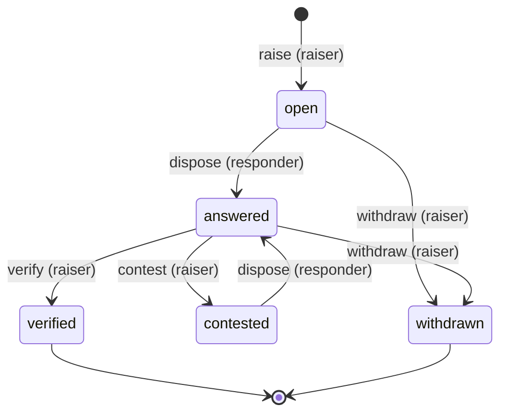
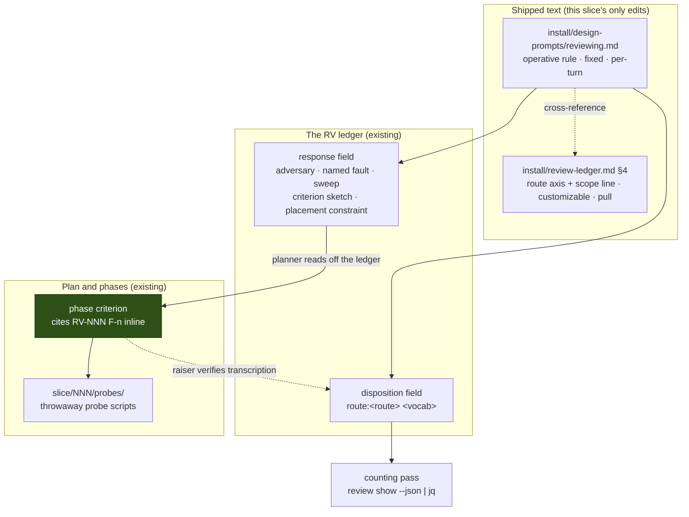

<!-- doctrine:section sec-1 -->
# Design SL-260: Design-review finding routing convention and trial

## 1. Design Problem

### What changes

Today, when a design review raises a serious finding, the author answers it in
prose. Under this design, the author additionally names **one instrument** that
could settle it — `review`, `demonstrate`, `probe`, `control`, or `owner-fix` —
and for three of those five, **stops writing prose entirely**. The obligation
becomes a criterion on a phase of the implementation plan, and the argument is
settled by running something rather than by writing more.

That is the whole behavioural change. It is delivered as text in two files that
already ship, recorded inside a field that already exists, and counted by a
command built from verbs that already exist. There is no new entity kind, no
schema change, no new normative surface, and **no change under `src/`**.

### Why it matters

`RFC-026`'s evidence entry `E11` classified 137 blocker and major findings
across eleven design-review ledgers. Two results drive this design:

- **Six severe findings in ten are mechanism predictions** — the design asserted
  code-level detail that turned out wrong or unestablished. They split in two:
  *structural* ones, which a thin implementation exposes immediately, and
  *discriminating-input* ones, which compile and pass ordinary tests and surface
  only under a hostile or edge-case input. Converged reviews were mostly the
  first kind; non-convergent ones mostly the second.
- **Thirty-one findings were raised against repair text** in the non-convergent
  group, against one in the comparison group. The prose written to answer a
  finding became the surface for the next finding.

`RFC-026` `P10` reads this as one prose loop being asked to settle four
different kinds of question while being good at one. Routing splits the
question kinds apart and sends each to an instrument that can actually close it.
The second result is the direct target: **no repair text, no findings against
repair text.**

### Where the boundary sits

This slice **stands the convention up and fixes the trial's rules**. It does not
run the trial — that happens across the next three code-changing slices and is
reported by a backlog chore gated `after` this one.

Three boundaries are worth stating because a reader will otherwise assume
otherwise:

- **No code.** Not "minimal code" — none. A `src/` change would newly bind
  `STD-001`, `STD-003` and `POL-002`, and would falsify the no-tooling claim the
  slice rests on. That is a tripwire, not a preference.
- **No enforcement.** The convention is almost entirely honour-system. Exactly
  one clause fires preventively; one more is caught after the fact at slice
  close; everything else is detected, if at all, by the trial's counting pass.
  This is recorded in full at `CON-006` rather than left to be discovered.
- **No causal claim.** The trial is a combined intervention — routing overlaps
  with `RFC-026` `P2`'s delegation rule — over three ledgers, with no pass mark.
  It answers *can this operate*, not *does this work*.

### What a reader must hold to follow the rest

One fact reframes most of the design and is easy to get wrong. **Two gates read
a review ledger under different rules.** The design run's `reviewing → locked`
gate blocks only on blockers that are `open` or `contested`. The slice's close
gate refuses `audit → reconcile` while a blocker is short of `verified`. They
differ by exactly the `answered` state, deliberately. A routed finding is
`answered` the moment it is disposed — so it never held the design lock, and the
gate this design must reason about is the slice close, not the design lock.

<!-- doctrine:section sec-2 -->
## 2. Current State

### 2.1 The finding turn machine

`ADR-007` makes adversarial review a first-class kind. A finding moves through a
small state machine with role-gated verbs (`src/review.rs:780-807`):



Two properties of this machine are load-bearing below. **`verified` is
terminal**: no verb transitions a finding out of it (`src/review.rs:703-728`), so
a verified disposition is the immutable audit-time record of what was decided
then. And **there is no amend verb**: once disposed, a finding is `answered`, and
`dispose` refuses to rewrite it. The only way back is the raiser's `contest`.

### 2.2 The two gates, and the one state between them

This is the fact section 1 flagged, stated precisely.

| gate | predicate | blocks on | where it fires |
|---|---|---|---|
| design lock | `undisposed_blockers` (`src/review.rs:1705`) | blockers in `open` or `contested` | the design run's `reviewing → locked` |
| slice close | `doc_unresolved_blockers` (`src/review.rs:1669`) | blockers short of `verified` | `audit → reconcile`, `reconcile → done` |

The predicates differ by exactly the `answered` state, and the split is
deliberate — the code says so. The slice close asks *is this review finished*,
and a disposed-but-unverified blocker is not. The design lock asks *has this
pass been disposed of*, and an answered blocker has been.

`DEC-138` (*review disposition binds the responder's turn, not the raiser's
assent*) requires this asymmetry be stated wherever it is relied on, because it
otherwise reads as a bug. This design relies on it throughout.

### 2.3 What the design lock actually needs

Not the verify. The `reviewing → locked` gate needs the raiser's **concluded**
marker plus the `review-disposed` act. `doctrine review conclude`'s own help
states the position: *"Open findings are fine: disposing them is the responder's
work afterwards."* Conclusion is about the reviewer having stopped looking;
`done` is about the findings. They are deliberately different facts.

### 2.4 The disposition field

`doctrine review dispose --disposition` is **free text**. `install/review-ledger.md`
§4 publishes a five-value vocabulary — `aligned`, `fix-now`, `design-wrong`,
`follow-up`, `tolerated` — introduced as *"(use consistently)"*, and `RFC-026`'s
entry `E1` found **61 distinct values** actually in use. Nothing validates the
field, which is what makes a prefix convention possible without a schema change,
and also what makes it unenforceable.

### 2.5 The two shipped surfaces

| file | tier | `customization` | fires when |
|---|---|---|---|
| `install/design-prompts/reviewing.md` | per-turn process fragment | `fixed` | a design run enters or continues `reviewing` |
| `install/review-ledger.md` §4 | `ADR-005` PULL-tier reference | `customizable` | anyone looks up how to dispose |

The fragment is emitted **every reviewing turn**; its *body* is elided when the
caller declares a current `name@digest` receipt (`src/commands/design.rs:2605-2631`).
So an agent either holds the current bytes or is re-sent them, and any edit
invalidates every held receipt — a stronger guarantee than "re-sent each time".

`install/review-ledger.md` states in its own header that it owns the **invariant
protocol shared by every review skill** (`/audit`, `/code-review`,
`/inquisition`). That scope is why §2.5's asymmetry matters and why §5 scopes
what goes there.

`install/design-prompts/reviewing.toml:8-14` already states in-repo that the
attack surfaces belong in the sibling prose fragment and not in a `[[step]]`.
`DEC-101` (step ids are API) is the authority; this design cites both rather
than re-arguing the point.

### 2.6 What does not exist

- **No cross-ledger counting command.** Nothing aggregates findings across
  reviews by severity and disposition.
- **No durable sink for probe evidence.** `IMP-324` records this. Under
  `.doctrine/slice/NNN/`, only `research/`, `phases`, `handover.md` and
  `inquisition.md` are gitignored (`.gitignore:47-51`), so a sibling directory
  commits by default — the gap was a name, not a mechanism.
- **No governance owner for promoting a finding into a criterion.** `SPEC-031`
  owns criterion identity and evolution and is silent on promotion. The form has
  prose precedent: `.doctrine/slice/026/plan.toml:46` carries `EX-3 … (RV-093 F-1)`.

<!-- doctrine:section sec-3 -->
## 3. Forces & Constraints

### 3.1 Governance that binds

**`DEC-103` — instruction is delivered at the point of effect.** The decisive
authority, and it cuts both ways.

- *Corollary 2* — *"An obligation firing at several moments is hung at EVERY one
  of them, not demoted to prose"* — together with *corollary 1*, *"DRY is the
  wrong model for agent instruction"*, **requires** the convention be written on
  both surfaces rather than once with a cross-reference. The most predictable
  objection to this design ("why is this written twice?") is answered by
  governance, not by argument.
- *The residue rule* — *"Where an obligation genuinely has no locatable moment,
  it stays prose AND is recorded as unenforced-by-construction"* — **requires**
  the honour-system clauses be labelled as such. `CON-006` is that record.

**`DEC-138` — review disposition binds the responder's turn.** Its consequences
section makes stating the two-gate asymmetry an obligation on this design, not
an option.

**`ADR-007` D-C5 / D-C9b.** The responder owns `disposition` and `response`; the
raiser owns `verify` / `contest` / `withdraw`; `blocker` is the only severity
that gates. This design changes *what standard the raiser applies at `verify`*,
not who holds the act.

**`DEC-126` + `DEC-125` — the design gate is an attestation ledger, not a
checker.** An outstanding-findings summary warns rather than blocks, which is
why the design lock can close over a routed obligation.

**`ADR-005` — shipped knowledge is tiered by access pattern.** The two targets
sit in different tiers, which is what makes the delivery argument in §3.3 sound
rather than rhetorical.

**`DEC-101` — step ids are API.** Owned once in `exploring.toml` and governing
`reviewing.toml` unchanged. Adding a `[[step]]` would mint a new API id; editing
the prose fragment carries no such contract. This is the authority behind the
`reviewing.toml` non-goal.

**`POL-001`** reaches the shipped convention prose. **`SPEC-031`** binds the
*form* a routed obligation must take once it is a criterion, and says nothing
about promotion. **`ADR-017`** makes the chore's `after` edge ordinary
work-to-work machinery.

**`RFC-026` is provenance, not authority.** Per `ADR-014` an RFC *"asserts no
canon"*. This design **adopts** `P10`; it is not bound by it, and it departs
from `P10` where the mechanism requires (see §7).

### 3.2 Checked and not applicable

Each dismissed with a reason, because an unexplained absence is indistinguishable
from an oversight.

- **`STD-001`** (no magic strings) scopes to *"all source under `src/` (and
  tests)"*. The `route:` token lives in an authored free-text field and in
  shipped prose; nothing in `src/` parses or names it.
- **`STD-002`** governs entity titles and durable-id citation, not an instrument
  vocabulary.
- **`STD-003`** (no silent skip) governs shipped readers of authored corpus data.
  This design adds no shipped reader.
- **`POL-002`** governs shipped mechanism. A slice-local `jq` command is not
  shipped behaviour. It *does* bear on §5's form rule: see §3.3.
- **`ADR-003`** is satisfied by `SL-260` existing as a slice.
- **`ADR-013`** — a Revision **cannot** target these files. `doctrine revision
  change add` is the only writer of a `revises` edge and takes a live entity FK;
  embedded assets carry no entity id, so no `[[change]]` row can name
  `review-ledger.md` or `reviewing.md`. Not merely unnecessary — structurally
  impossible.

The first four share one tripwire: **they all scope to `src/` or to shipped
mechanism, so the design lands outside every standard that would otherwise bind
it — and acquires three of them the moment it touches `src/`.**

### 3.3 Forces in tension

**Delivery strength versus trial confound.** `P10`'s first trial question is
whether agents can route without repeated human steering, and its *would-kill*
list includes *"the routes need the owner to interpret"*. A convention behind an
elective fetch makes a miss unreadable — did routing fail, or was the rule never
read? Three ledgers cannot absorb a delivery confound on top of `E11`'s own.
Delivery is therefore held at maximum strength, and the delivery-channel
question is **deferred, not answered**.

**Enforcement versus the no-tooling constraint.** Every clause that could be
mechanically checked would require parsing a free-text field in `src/`. The
constraint wins, and the cost is paid openly at `CON-006` rather than hidden.

**Completeness versus interpretability.** More per-route obligations means more
text, which runs at the same *would-kill*. This design resolves it by
distinguishing *what each route owes* — concrete, and therefore less to
interpret — from *general guidance*, which it does not add.

**Correct advice versus platform independence.** The `--response` quoting hazard
(§5.4) has a known remedy that is a bash recipe. Shipping one in a reference doc
would lean doctrine's guidance on the host's shell, which sits badly against
`POL-002`'s first prohibition even where it does not strictly bite. The design
takes a shell-agnostic content rule instead.

**Two surfaces, two populations.** `review-ledger.md` owns the protocol for
*every* review skill. An unqualified route axis there would bind audit and
code-review ledgers, widening the intervention past the trial's population. The
scope line in §5.2 is the resolution.

<!-- doctrine:section sec-4 -->
## 4. Guiding Principles

Five, in the order they decide things when they conflict.

1. **Deliver at the moment of effect, not at the moment of authority.** Where an
   obligation fires in two places, write it in two places. `DEC-103` makes this
   governance rather than taste, and it is the reason this design does not
   minimise its own prose.

2. **State absences; never imply enforcement.** Almost none of this convention
   is checked. A design that reads as though it were checked is worse than one
   that admits it is not, because the reader stops looking. Every unenforced
   clause is enumerated with the code site proving it.

3. **Ride existing seams; add no mechanism.** The route lives inside an existing
   field, the obligation becomes an existing kind of criterion, the reopening
   path is an existing verb, the counting is existing verbs composed. Where the
   design wants a mechanism it cannot have, it says so and stops.

4. **Name the narrowest true thing.** `probes/` rather than `evidence/`;
   *design-review ledgers* rather than *reviews*; *transcription* rather than
   *repair*. The corpus's characteristic failure is apparatus that grows because
   its name admitted more than it should have.

5. **Do not confound the thing under test.** The trial is three ledgers with no
   pass mark. Every choice that could vary delivery, population, or the meaning
   of a recorded value is pinned, and where it cannot be pinned it is measured
   and declared.

<!-- doctrine:section sec-5 -->
## 5. Proposed Design

### 5.1 System Model

The convention is text in two files plus a token in one field. Nothing else is
built. The model below shows what carries the obligation from the moment a
finding is disposed to the moment it is settled, and which of those hops has a
mechanism behind it.



Read the arrows as *carries*, not *enforces*. Only two edges have any mechanism
behind them, and §5.5 names them. The obligation travels with the finding: the
planner does not consult a separate register, they read the responder's own
`--response` off the ledger they must already open in order to transcribe at all.
That is why no third normative surface is needed, and it is the load-bearing
structural choice in this design.

**The five routes** (`RFC-026` `P10`, adopted):

| route | the question behind the finding | what settles it |
|---|---|---|
| `review` | should we accept this commitment and its consequences? | design judgement and adversarial review |
| `demonstrate` | can these parts connect as proposed? | a thin implementation exercising the disputed connection — *"it compiles"* is not the bar |
| `probe` | does the mechanism withstand the adversary? | a stated adversary, then a hostile probe |
| `control` | would the planned check notice failure? | a negative control: name the concrete incorrect candidate the check must reject, and observe it rejected |
| `owner-fix` | do two accounts of one fact disagree? | remove the duplicate, verify the surviving owner, sweep the affected class |

`demonstrate`, `probe` and `control` are the **instrument routes**: they are not
repaired in prose. `review` and `owner-fix` are settled the way they always were.

### 5.2 Interfaces & Contracts

Two text surfaces, deliberately carrying different words (`DEC-268`).

#### The operative rule — `install/design-prompts/reviewing.md`

Appended to the existing *After the pass* material, which already carries
*"Carry every finding to a disposition. An undispositioned finding blocks the
lock and does not expire on its own."* The convention extends that sentence's
subject rather than opening a new topic.

```markdown
## Routing a severe finding (provisional — RFC-026 P10 trial)

Applies to `blocker` and `major` findings only. `minor` and `nit` dispositions
are unchanged.

Every severe finding carries one route, written as the first token of the
disposition:

    --disposition "route:<route> <vocab>"     e.g.  route:probe fix-now

The route and the vocab are different axes: the vocab records what you did, the
route records what instrument can settle the finding. There is no default — if
you cannot tell which question the finding is asking, that is the ambiguity the
anti-escape guardrails already send to `/consult`, not a reason to write
`review`.

`demonstrate`, `probe` and `control` findings are NOT repaired in prose. In
`--response` you write, as plain prose with no code spans:

- `probe` — the adversary, as *must hold against X, need not hold against Y*.
- `control` — the concrete incorrect candidate the check must reject. A control
  establishes discrimination against a named fault, not completeness.
- `owner-fix` — which duplicate goes, which owner survives, and the class you
  will sweep. The sweep is the clause people drop.
- all three instrument routes — what the criterion must assert, and what the
  obligation needs of its host phase. You cannot name the phase: phases are
  devised at planning, after this review. Name the constraint, not the phase.

Read your response back with `review show <RV> --json` before moving on. A
disposed finding cannot be amended.

**When a finding may stay open past the gate.** It may not, if the next step
adds external reliance, durable state, authority or exposure, dependency spread,
or governing meaning on top of the thing in doubt. Otherwise the bounded next
step may proceed with the finding named. Measure the cost to regain an accepted
state, not the cost to regenerate a diff.

**Accumulation.** Do not route a second finding against a mechanism that already
carries one — that changes the argument and reopens the design decision. Another
test is not a disposition. Raisers: where several routed findings attack one
mechanism, contest rather than verify.

**Raisers, on a routed finding.** `verify` asserts that the obligation was
correctly transcribed onto a phase criterion — not that the defect is repaired.
That is a narrower claim than `verify` usually carries, and the `route:` token is
what tells a later reader which claim it was. It happens after `slice phases`,
not during this review: conclude the pass with routed findings `answered`.

This convention is enforced only by the trial's counting pass. See `CON-006`.
```

#### The route axis — `install/review-ledger.md` §4

Placed directly after the existing **Disposition vocab** list, before *"Then
close each finding terminal"*.

```markdown
**Route axis** (provisional — applies to design-review ledgers under the
RFC-026 P10 trial; not to `/audit` or `/code-review` passes):

Severe findings on a design-review ledger additionally carry a route as the
first token of the disposition — `route:<route> <vocab>`. The vocab records what
the responder did; the route records what instrument can settle the finding.
The closed set is `review`, `demonstrate`, `probe`, `control`, `owner-fix`. The
operative rule, including what each route owes in `--response`, is delivered on
every reviewing turn by `design-prompts/reviewing.md` — this entry exists so the
axis is discoverable beside the vocab, not to restate it.

Enforced only by the trial's counting pass. See `CON-006`.
```

The scope parenthesis is load-bearing, not hedging: this doc owns the protocol
for **every** review skill, so an unqualified axis here would bind audit and
code-review ledgers and make the trial's denominator wrong.

#### The counting method

No script. A documented command over existing JSON output, run during the
pre-design research round against three live ledgers:

```sh
for rv in 365 368 370; do doctrine review show RV-$rv --json; done \
  | jq -r '.review as $r | $r.finding[]
      | select(.severity=="blocker" or .severity=="major")
      | [$r.id, .id, .severity,
         ((.disposition//"«none»")|split(" ")[0]),
         ((.disposition//"")|test("^route:"))] | @tsv'
```

One row per severe finding, with the route prefix as a tested boolean. The
`// ""` guard is load-bearing: an undisposed finding has a null disposition and
`split` fails without it.

### 5.3 Data, State & Ownership

| datum | lives in | written by | mutable after? |
|---|---|---|---|
| the route token | `finding.disposition`, first token | responder, at `dispose` | no — `dispose` refuses an `answered` finding |
| adversary / named fault / sweep | `finding.response` | responder, at `dispose` | no |
| criterion sketch, placement constraint | `finding.response` | responder, at `dispose` | no |
| the phase criterion | `plan.toml`, `entrance_criteria` / `exit_criteria` | planner, at `slice plan` | append-only; ids immutable |
| probe artefacts | `.doctrine/slice/NNN/probes/` | implementor, during the phase | ordinary files, committed |
| post-`verified` amendment | the `RV` `.md` prose body | whoever changes their mind | ordinary prose |

Two ownership facts follow from `ADR-007` and are not negotiable here: the
responder owns `disposition` and `response`; the raiser owns `verify`,
`contest` and `withdraw`. This design changes the **standard** the raiser
applies, never the holder of the act.

`probes/` is created on demand and never eagerly. It commits by default —
`.gitignore:47-51` ignores only `research/`, `phases`, `handover.md` and
`inquisition.md` under a slice. One trap carried into the convention text: a
file named `handover.md` inside `probes/` would still be ignored, because
`.gitignore:29` matches that name at any depth.

### 5.4 Lifecycle, Operations & Dynamics

The routed finding's path, and where each gate sits.

```mermaid
sequenceDiagram
    participant R as Raiser
    participant L as RV ledger
    participant D as Responder
    participant P as Planner
    participant X as Phase execution

    R->>L: raise F-n (blocker)
    D->>L: dispose "route:probe fix-now"<br/>response: adversary + sketch + constraint
    Note over L: F-n is `answered`
    D->>L: review show --json (read back)
    R->>L: conclude (open findings are fine)
    Note over R,L: design lock clears — `answered` is not `open`/`contested`
    P->>L: read sketch + constraint off F-n
    P->>P: author criterion citing "RV-NNN F-n"<br/>on earliest phase satisfying the constraint
    X->>X: run the probe; artefacts to slice/NNN/probes/
    R->>L: verify F-n — transcription, not repair
    Note over L: F-n is `verified` — terminal, immutable
    Note over R,X: slice close gate would have refused<br/>audit→reconcile without this
```

**The reopening path.** Where several routed findings attack one mechanism, the
raiser contests instead of verifying. `contest` moves the finding to
`contested`, and `contested` blocks the design lock. The design decision is then
genuinely reopened, by existing machinery, with real force. This is the one
preventive clause in the convention.

**Past `verified`, there is no reopening.** No verb transitions a finding out of
`verified`, so the disposition stands as the audit-time record of what was
decided then. A later change of mind is a prose amendment on the `RV` `.md`
stating what changed, why, and where the fix landed.

**The quoting hazard, and why the rule is about content.** `--response` is free
text passed through a shell, and in a double-quoted argument every backtick span
is command substitution: `dispose` succeeds, the receipt reads clean, and the
quoted spans are stored empty. With no amend verb, the damage is permanent until
the raiser contests. The hazard pre-dates this slice; the slice makes it
expensive by putting the trial's measured artefact in that field. The rule is
therefore *write it as plain prose with no code spans, and read it back* — which
removes the failure at source and, unlike a shell-quoting recipe, does not lean
doctrine's shipped guidance on the host's shell.

**Delivery.** The convention reaches an agent only after `cargo build` (which
re-embeds `install/` — cargo does register the folder as a build dependency) and
`doctrine install`. A stale embed is silent, so §9 verifies through rendered
output and never through the source file.

### 5.5 Invariants, Assumptions & Edge Cases

**Invariants this design must not break.**

- `ADR-007` act ownership is unchanged. Only the raiser's *standard* moves.
- No file under `src/` is touched. This is the tripwire: a `src/` change newly
  binds `STD-001`, `STD-003` and `POL-002` and falsifies the no-tooling claim.
- `verified` remains terminal. Nothing in the convention asks for a transition
  out of it.
- The trial population is the design ledgers of the eligible slices. The §4
  scope line is what holds this.

**What actually has teeth.** Exactly two edges, and they are asymmetric:

1. **Preventive** — the raiser's `contest` on accumulation. `contested` blocks
   the design lock, at the moment it matters.
2. **Audit-grade only** — transcription. A routed finding cannot reach `verified`
   without a criterion, and an unverified blocker refuses `audit → reconcile`.
   But that fires many agent sessions after the phase it should have guarded has
   already run. It detects a dropped obligation; it does not stop the defect
   going unguarded through execution.

Everything else is honour-system. `CON-006` enumerates all ten clauses with the
code site proving each.

**Edge cases.**

- *No phase can host the obligation before a protected boundary is crossed.* The
  routing was wrong: the raiser contests and the finding returns for
  re-disposition. The settle-first test is what makes this detectable at
  disposition rather than at plan time.
- *A slice is parked or abandoned mid-trial.* It stays in the count
  (eligibility rules, scope §5). A routed obligation on an abandoned slice is a
  legitimate datum, not an exclusion.
- *A ledger has zero severe findings.* Also a legitimate datum. Selecting on
  finding count would reintroduce exactly the bias `E11`'s hand-picked group
  carries.
- *The adversary clause was eaten by the shell.* Counted identically to one
  never written (`DEC-270`). The trial measures whether the convention produced
  a usable clause, not why it did not. The residual risk is confounding, and the
  guard is on the analysis: check for response truncation before reading a high
  miss rate as a routing failure.
- *A client install has customised `review-ledger.md`.* They keep the fragment's
  operative rule and lose the §4 axis. This is why the rule lives in the `fixed`
  surface.

<!-- doctrine:section sec-6 -->
## 6. Open Questions & Unknowns

Every question that shaped this design is disposed; these are what remains
genuinely open, and none of them blocks implementation.

- **`Q1` — does the convention survive weaker delivery?** Deliberately
  unanswered. The trial holds delivery at maximum strength so it does not
  confound routing, which means it says nothing about whether the convention
  works as a standard's body or a project-local entry. Promoting it later
  **changes the intervention** and must not be done silently on the strength of
  this trial.
- **`Q2` — should the route axis extend beyond design-review ledgers?** Scoped
  to design reviews here so the trial has a defined population. Whether `/audit`
  and `/code-review` passes should carry routes is an open decision to be taken
  at trial conclusion, not an automatic consequence of a good result.
- **`Q3` — does the promotion obligation need a `/plan`-side delivery moment?**
  `DEC-103`'s purest reading says yes; this design declines on surface cost and
  relies on the obligation travelling with the finding. If the trial observes
  routed obligations dropped between plan and execute, that is the named next
  move — and the close gate will not have prevented it, only recorded it.
- **`Q4` — should the route set become a code-backed closed vocabulary?**
  Available if the trial validates the convention, and foreclosed now by the
  no-tooling tripwire. Taking it newly binds three standards.
- **`Q5` — is the 61-value disposition vocabulary worth reconciling?** Real, and
  out of scope. The route sits alongside that mess rather than resolving it.

**Unknowns the trial exists to reduce**, restated from `P10` so the design does
not overclaim: whether agents can choose and execute the right route without
repeated human steering; whether the instrument actually exposes the named defect
and supports checking its repair (`E11` records only a rater's judgement that it
*would*); and whether repeated argument falls enough to justify a larger
comparison. Nothing here measures tokens, wall-clock, or human minutes, so the
economic claim stays untested.

<!-- doctrine:section sec-7 -->
## 7. Decisions, Rationale & Alternatives

Eleven records carry the decisions, each minted as the disposition of the
question it answers and each linked `shapes: SL-260`. This section states what
they settle and, where this design departs from `P10`, why.

### 7.1 The settled set

| record | what it settles |
|---|---|
| `DEC-263` | routed `verify` asserts transcription, not repair — named as a redefinition, deferred past the design lock |
| `DEC-264` | the accumulation rule hangs on responder **and** raiser; post-`verified` goes to a prose amendment |
| `DEC-265` | every severe finding carries an explicit route; no default |
| `DEC-266` | the route set stays prose-only, and the choice is stated |
| `DEC-267` | `P10`'s three dropped clauses restored — severity boundary, `control` names its fault, `owner-fix` sweeps its class |
| `DEC-268` | operative rule in the `fixed` fragment; scoped route axis in the `customizable` reference |
| `DEC-269` | per-route clauses are plain prose with no code spans, read back before moving on |
| `DEC-270` | an eaten adversary clause and an absent one count identically |
| `DEC-271` | responder states a criterion sketch and a placement constraint; close-gate teeth are audit-grade |
| `DEC-272` | the planner places on the earliest phase satisfying that constraint |
| `DEC-273` | probe evidence commits to `.doctrine/slice/NNN/probes/` |
| `CON-006` | the residue register — ten unenforced clauses, each with its code site |

### 7.2 Where this design departs from `P10`

`RFC-026` is provenance, not authority (`ADR-014`), so departures need a reason
rather than a waiver.

**`P10` says the design gate may close with routed findings open; this design
says it already does.** A routed finding is `answered` on disposition, and the
design lock blocks only on `open` or `contested`. `P10`'s dispensation was
unnecessary. The ruling that *is* needed is the raiser's, at slice close.

**`P10` says the obligation becomes a criterion on *the first phase*; this
design says the earliest phase that satisfies the responder's stated placement
constraint.** Taken literally, `P10` would put criteria for a mechanism built in
phase three onto phase one, where they cannot be exercised — producing a
criterion that is vacuous or false. How late placement may go is bounded by
`P10`'s own settle-first test, so the departure narrows nothing.

**`P10` leaves *who states the probe adversary* open; this design answers it and
adds two symmetric obligations `P10` states in prose but does not assign** — the
`control`'s named fault and the `owner-fix`'s sweep. Assigning them to the
responder at disposition is the only moment at which the answer is known.

### 7.3 Alternatives rejected, and why they will be re-proposed

Named here because each is a reasonable reading that a reviewer is likely to
raise, and answering them in the ledger costs a round.

- **A new standard or project-local governance entry for the convention.** An
  earlier draft of the scope proposed one. Rejected: a standard alongside the
  shipped files is the two-surface posture `E11` measured at 24.5%
  artefact-prose findings, and it puts the rule behind an elective fetch, which
  confounds the trial.
- **A `[[step]]` in `reviewing.toml`.** Rejected under `DEC-101`: step ids are
  API, so a new step is a versioned surface change for something the per-turn
  prose fragment already delivers. `reviewing.toml:8-14` says so in-repo.
- **A Revision against the two files.** Structurally impossible, not merely
  unnecessary — `revision change add` takes a live entity FK and an embedded
  asset has no entity id.
- **A counting script.** Unnecessary: the documented command was run against
  three live ledgers during research. Adding one would put the slice under
  `src/` and newly bind three standards.
- **Code-backing the route set** (`parse` + `ALL` + lockstep tests, as every
  other closed vocabulary here has). Same tripwire. Available post-trial.
- **Fixing the `--response` quoting hazard in tooling.** Same tripwire. The
  content rule dodges it instead.
- **A distinct raiser act instead of redefining `verify`.** There is no other
  terminal verb; minting one is a `src/` change.

<!-- doctrine:section sec-8 -->
## 8. Risks & Mitigations

**`R1` — the convention is read and still not followed.** A real trial result,
not a defect — but readable *only* because delivery is held at maximum strength.
If the text lands anywhere weaker mid-trial the result becomes uninterpretable.
*Mitigation:* the delivery-channel question is deferred in writing (`Q1`), and
promotion is named as an intervention change rather than a refinement.

**`R2` — three ledgers is a thin sample carrying a combined intervention.**
Routing overlaps with `P2`'s delegation rule and no causal separation is claimed.
*Mitigation:* no pass mark exists, and the trial's questions are phrased as *can
it operate*, not *does it work*. The design does not license a stronger reading.

**`R3` — the routes need the owner to interpret.** One of `P10`'s own would-kill
conditions. *Mitigation:* the per-route obligations in §5.2 state concretely what
each route owes, which is less to interpret than general guidance; and the
no-default rule means an unclassifiable finding goes to `/consult` rather than
being silently absorbed into `review`. Observable at ledger grain during the
trial.

**`R4` — the adversary clause is silently eaten by the shell.** `--response` is
the one field where a double-quoted argument loses backtick spans, the ledger is
turn-based with no amend verb, and the counting pass cannot distinguish an eaten
clause from an absent one. Under routing this corrupts the very `P10` *Open*
item §5.2 exists to settle. *Mitigation:* the content rule removes the hazard at
source (plain prose, no code spans), the read-back step catches it at the only
moment it is still repairable, and the analysis carries a confound guard — check
for response truncation before reading a high miss rate as a routing failure.

**`R5` — a repair discharges one arm and leaves its twin.** Observed four times
in one design review (`RV-370`/`SL-246`): the finding frames the scope, the
repair inherits it, and the result reads as complete. A `demonstrate` can do
exactly this. *Mitigation:* partial. The `owner-fix` sweep clause addresses the
duplicate-accounts case directly; the other routes do not, and routing does not
by itself close this failure mode. Named rather than claimed solved.

**`R6` — transcription is dropped between plan and execute.** The close gate
detects it but fires many sessions too late to protect the execution it was meant
to guard. *Mitigation:* the responder's criterion sketch and placement constraint
turn plan-time transcription into a copy rather than an act of recall. If the
trial observes drops anyway, `Q3`'s `/plan`-side delivery moment is the named
next move.

**`R7` — a stale embed ships nothing.** `install/` assets are embedded at build
time; a skipped rebuild leaves the convention silently not in effect, and no
structural validation catches it. *Mitigation:* §9 verifies through rendered
output, never through the source file. Cargo does register the asset folder as a
build dependency, so the rebuild is not itself manual.

**`R8` — the route axis widens past the trial population.** `review-ledger.md`
owns the protocol for every review skill; an unqualified axis there would bind
audit and code-review ledgers and make the denominator wrong. *Mitigation:* the
§4 scope parenthesis, and `Q2` records that extending it is a decision rather
than a consequence.

<!-- doctrine:section sec-9 -->
## 9. Quality Engineering & Validation

Done is judged on the convention being **in effect and mechanically checkable**,
not on trial outcomes, which postdate this slice.

### 9.1 What must be true at close

1. The convention text is present in both files, marked provisional, citing
   `RFC-026`.
2. **A rebuilt-and-installed tree delivers it** — verified through rendered
   output, not through the source file. A stale embed is silent, so asserting on
   `install/design-prompts/reviewing.md` proves nothing about what an agent
   receives.
3. Each of the following is stated in exactly one place: the eligibility rules;
   the recording shape; the severity boundary and the no-default rule; the
   raiser-side ruling and its deferral; the settle-first test; both halves of the
   accumulation rule and the post-`verified` residue; the per-route obligations;
   the plain-prose form rule; the placement rule; and the counting method.
   *Exception, by `DEC-103` corollary 2:* the convention is deliberately
   delivered on both surfaces — that is the rule, not a duplicate. The two
   surfaces carry different text, and §4 carries the design-review scope line.
4. `CON-006` exists and is cited from both surfaces, so the fact of
   non-enforcement is delivered at the point of effect and the enumeration is
   reachable. Nothing in the convention implies enforcement it does not have.
5. The trial-report chore exists and is gated `after` this slice.
6. `P10`'s *Open* clause in `RFC-026` records where its two items were settled.
7. **No file under `src/` is touched.** The tripwire, checkable by diff.

### 9.2 How each is verified

| # | mode | evidence |
|---|---|---|
| 1 | `VA` | read both files; both carry the provisional marker and the `RFC-026` citation |
| 2 | `VA` | `cargo build` then `doctrine install`, then read the convention back out of a rendered reviewing turn — not out of `install/` |
| 3 | `VA` | grep each rule's distinctive phrase across `install/`; one hit each, except the convention's two deliberate homes |
| 4 | `VT`-adjacent | `doctrine knowledge inspect CON-006` resolves; both surfaces contain the citation |
| 5 | `VA` | the chore exists with an `after` edge to `SL-260` |
| 6 | `VA` | `RFC-026` `P10`'s *Open* clause names `DEC-269`/`DEC-271` and the eligibility rules |
| 7 | `VT` | `git diff --stat <base>..HEAD -- src/` is empty |

### 9.3 What is deliberately not verified here

The trial's own results. The counting pass runs three code-changing slices from
now and is owned by the backlog chore, which also carries the `R4` confound
guard. Nothing in this slice's closure depends on a routing outcome — that
separation is what lets the slice close before the evidence exists.

### 9.4 The counting method as an artefact

The command in §5.2 is the deliverable, not a script. It was executed against
`RV-365`, `RV-368` and `RV-370` during the pre-design research round and
returned one row per severe finding across all three, with the route prefix as a
tested boolean. That execution is the evidence that scope's *"a script, if one is
needed"* hedge resolves to **not needed** — and therefore the evidence that the
tripwire in §5.5 holds end to end.

