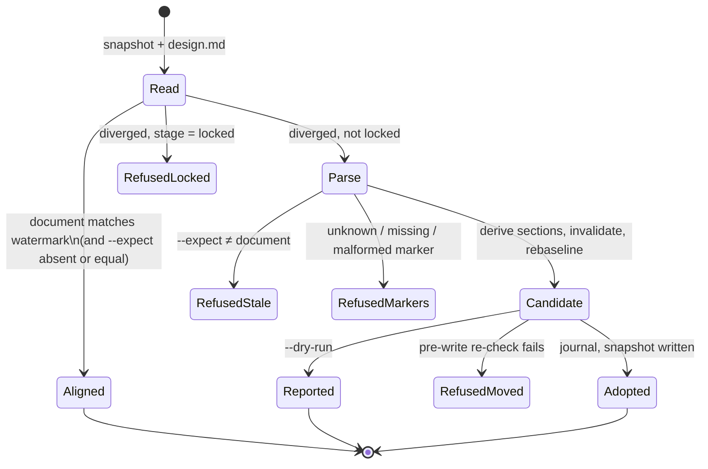
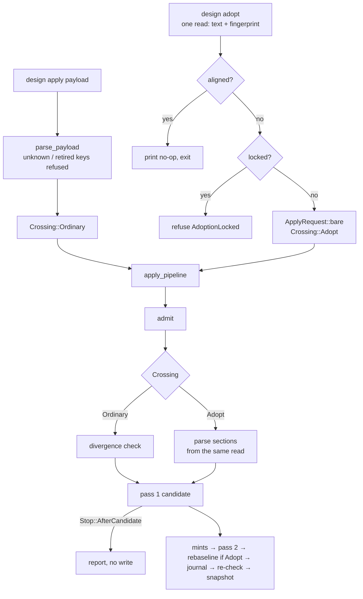

<!-- doctrine:section sec-1 -->
## What changes and why

A design run guards `design.md` with an **authored watermark**: the
fingerprint of the document as Doctrine last left it. When someone edits the
file by hand, every mutating verb refuses until the edit is *adopted*: the run
takes the document's section bodies as its own, invalidates evidence bound to
sections that changed (`DEC-066`), and re-baselines the watermark.

Today adoption is the `adopt_authored` key on a `design apply` payload. The
caller must supply the sha256 of the whole file and the sha256 of every
section body, byte-exact, with no verb that emits either list. The section
digests carry no information the engine lacks: given a matching whole-file
fingerprint, each one is a function of the same bytes, and the engine already
derives them (`authored_sections`, `commands/design.rs:428`). The core uses the
caller's copy only to refuse a disagreement (`run.rs:877-895`); completeness is
enforced separately by the document parser (`DEC-072`).

After this slice, adoption is a verb, and the engine derives what the caller
used to declare:

```
doctrine design adopt SL-N [--expect <fingerprint>] [--dry-run] [--diff]
```

| | before | after |
|---|---|---|
| crossing | `adopt_authored` payload key | `design adopt` verb |
| section map | caller computes and declares | engine derives from the document |
| document fingerprint | required, caller-declared | optional `--expect`; entry read otherwise |
| pipeline inputs | caller supplies run id, revision, submission id | verb supplies them |
| what adoption did | not reported | per-section report; optional diff |
| locked run | adopts, silently killing acceptance | refused, naming the regression |
| stale `adopt_authored` | n/a | refused as retired, naming the verb |

The system boundary does not move. The engine-side protections of the old
rule 2 are all kept: fingerprint compare-and-swap, complete marker validation,
`DEC-066` invalidation with no inherited clearance, re-baseline only after the
candidate validates, and the pre-write re-check against the fingerprint the
adoption was admitted on. The governing records are `DEC-279` (the verb;
supersedes `DEC-100`'s carried-forward rule 2) and `DEC-278` (retired wire
keys).

<!-- doctrine:section sec-2 -->
## The adopt verb

### Surface

```
doctrine design adopt <SLICE> [-p <PATH>] [--expect <FINGERPRINT>] [--dry-run] [--diff]
```

`AdoptArgs` mirrors `MaterialiseArgs` (`slice`, `path`) plus three flags:

| flag | meaning |
|---|---|
| `--expect <fp>` | the whole-document sha256 the caller reviewed; refuse unless `design.md` reads exactly this |
| `--dry-run` | compute and print the report; write nothing |
| `--diff` | add a unified diff per changed section to the report |

Without `--expect`, the basis is the fingerprint read at entry: bare `adopt`
adopts what is on disk at that moment. The pre-write re-check still compares
against that admitted fingerprint, so an edit landing mid-adoption refuses.
The reviewed path is `adopt --dry-run --diff`, then `adopt --expect <fp>` with
the fingerprint the dry run printed.

### Outcomes



- **Aligned.** `design.md` matches the watermark (and `--expect`, if given,
  equals it). Prints `design.md matches the watermark <fp> — nothing to adopt`
  and exits 0. No admission, no revision, no journal entry. A retry after a
  successful adopt lands here.
- **Refused, locked.** A diverged document on a locked run is never adopted
  (`DEC-279`). The remedy names both lawful paths: regress to `reviewing` for a
  run still governing execution, or edit directly without adopting at
  reconcile. The order is aligned test, then locked test, then parsing: an
  aligned locked run gets the no-op answer (there is nothing to adopt), and a
  locked run whose document is also malformed gets the locked answer rather
  than a marker error, because the marker error's remedy is not available to it.
- **Refused, stale.** `--expect` names a fingerprint the document does not
  have, or `design.md` is absent.
- **Refused, markers.** The existing `document::parse` refusals, each naming
  the offending id (`UnknownMarker`, `MissingMarker`, and the grammar rows).
  Adoption cannot add or remove a section.
- **Refused, moved.** The existing pre-write re-check, unchanged.
- **Adopted / reported.** The report below.

### Report

One header line, then the change rows the core already emits, then the lines
the shell derives by set difference against the prior snapshot:

```
adopted design.md 3f9c…e1 at revision 22            # or: dry run — would adopt 3f9c…e1; nothing written
22 0 section_fingerprint_changed sec-3 old=… new=…
22 1 act_invalidated sec-3 act=section-reviewed
22 2 review_invalidated att-4 section=sec-3 attestation=att-4
unchanged sec-1 sec-2 sec-4
reordered sec-4 before sec-3                        # only when document order moved
```

The fingerprint is printed in full in the header, because it is the value
`--expect` takes. `--diff` appends, for each changed section only:

```
--- sec-3 (run)
+++ sec-3 (design.md)
@@ -4,3 +4,4 @@
 …three lines of context…
```

The two sides are the held section body and the document's section body.

**Bytes outside section bodies.** The parser accepts a whitespace-only head
before the first marker (a formatter's leading blank line,
`document.rs:295-300`) and holds no copy of it; `materialise` renders sections
only. So after adoption, `materialise` reproduces `design.md` byte-identically
*except* that a whitespace-only head is dropped. When the adopted document has
a non-empty head, the report says so:

```
head: 2 whitespace-only lines before sec-1 are not held; materialise drops them
```

A head-only edit is a divergence with no changed section: the report shows the
head line, every section as unchanged, and the adoption re-baselines. With that
one exception, the per-section diff is exactly what materialising the run would
change relative to its prior snapshot. Rendered with the `similar` crate (`DEC-279`); unchanged
sections print nothing.

### Refusal wording

| refusal | new text (shape) |
|---|---|
| divergence at entry (`refuse_authored_divergence`) | `design.md has been edited outside this run — watermark <a>, document <b>. Review with doctrine design adopt SL-N --dry-run --diff, then adopt it.` |
| materialise read-back mismatch | remedy names `doctrine design adopt SL-N` in place of `adopt_authored` |
| `AdoptionStale` | `--expect <a> but design.md reads <b>` (or `design.md is absent`); remedy names the dry run |
| `AdoptionLocked` (new) | `run is locked; adopt refuses. To correct a run still governing execution, regress to reviewing first; at reconcile, edit design.md directly and do not adopt.` |
| `AdoptionMarkersInvalid` | deleted: missing and unknown markers are `document::parse`'s refusals, and a mismatch is impossible when the engine derives the map |

<!-- doctrine:section sec-3 -->
## The pipeline seam

### Current shape

`run_apply` (`commands/design.rs:1795`) does two jobs in one function:

1. **Wire parse.** JSON parse, `contract_check::refuse_unknown_keys`,
   deserialise into `ApplyRequest`.
2. **The pipeline.** `admit` → divergence check (skipped when
   `request.adopt_authored` is set) → build `DerivedInput` (authored sections
   read only on the adoption path) → pass 1 candidate → mints → pass 2 →
   re-baseline (adoption only) → journal → pre-write re-check → snapshot.

`readopting` is derived from the wire request, so adoption cannot leave the
wire without the pipeline losing its switch.

### Target shape

Split at the parse boundary. The pipeline takes a typed request and a
**crossing mode**:

```rust
// design_run::run — pure layer
pub(crate) enum Crossing {
    /// Every wire submission. Refuses on a diverged watermark.
    Ordinary,
    /// The adopt verb. `expect` is `--expect`, if given.
    Adopt { expect: Option<Fingerprint> },
}

pub(crate) fn apply(
    prior: &DesignSnapshot,
    request: &ApplyRequest,
    crossing: &Crossing,
    derived: &DerivedInput,
    payload_digest: &str,
    resolved: &Resolution,
) -> Result<Applied, Refusal>;
```

```rust
// commands::design — shell
fn run_apply(root, slice, payload, pre_write, fault) -> Result<()> {
    let request = parse_payload(payload)?;              // step 1, unchanged
    apply_pipeline(root, slice, &request, digest, &Crossing::Ordinary,
                   Stop::Write, pre_write, fault)
}

fn run_adopt(args: AdoptArgs) -> Result<()> {
    // read snapshot + fingerprint; aligned → print no-op, return
    let request = ApplyRequest::bare(SubmissionEnvelope {
        run_uid: prior.run.uid.clone(),
        known_revision: prior.run.revision,
        submission_id: format!("adopt-{}", uuid::Uuid::now_v7()),
    });
    apply_pipeline(root, slice, &request, digest,
                   &Crossing::Adopt { expect: args.expect },
                   if args.dry_run { Stop::AfterCandidate } else { Stop::Write },
                   …)
}
```

`ApplyRequest::bare` is an instruction-free request (every act field empty).
The payload digest for the verb's receipt is the digest of the request's own
serialisation, so receipts keep one shape. `Stop` names where the pipeline
returns: `AfterCandidate` renders the report from pass 1 and writes nothing;
`Write` runs to the snapshot.



The pipeline's ordering guarantees stay in one place: journal before snapshot
(`DEC-083`/`DEC-086`), validate before re-baseline, and the re-check against
the admitted fingerprint (`PreWriteBasis::AdmittedAt`). The `readopting` flag
becomes `matches!(crossing, Crossing::Adopt { .. })`.

### One read of the document

Today the adoption path reads `design.md` twice: once to fingerprint it
(`read_authored_fingerprint`, `commands/design.rs:1843`) and again to parse
sections (`read_design_doc`, `:1856`). An edit between the reads (A → B) lets
the run seat B's sections under A's fingerprint; if the file returns to A
before the pre-write re-check, the write succeeds with B's bodies and an A
watermark, and every later entry check sees a false alignment.

The verb reads the bytes **once**, as `start --from-design` already does
(`:1591-1595`):

```rust
let document = read_design_doc(root, slice)?;           // Option<String>
let observed = document.as_deref().map(authored_fingerprint);
```

`observed` and the sections parsed from `document` travel together through the
aligned test, the locked test, `--expect`, parsing, the report,
`rebaseline_watermark`, and `PreWriteBasis::AdmittedAt`. `apply_pipeline`
takes the read as an argument on the `Adopt` path rather than reading again.
The pre-write re-check's fresh read is the one intentional second observation.

### Order in `run_adopt`

1. Read the snapshot, then the document once.
2. Aligned (and `--expect` absent or equal) → print the no-op, return.
3. `refuse_adoption_at(prior.run.stage)?` → `AdoptionLocked` on `locked`.
4. `apply_pipeline(…, Crossing::Adopt { expect }, read, stop)`: parse, admit,
   pass 1, and so on.

`refuse_adoption_at` is one pure predicate in `design_run::run`, called by the
shell at step 3 and by the pure core's adoption function as its backstop, so
the two sites cannot disagree.

### Pure core

`run::apply` replaces `if let Some(adopt) = request.adopt_authored` with a
match on `crossing`. The adoption function keeps its body minus the caller-map
comparison:

```rust
fn adopt_authored(
    next: &mut DesignSnapshot,
    expect: Option<&Fingerprint>,
    derived: &DerivedInput,
) -> Result<Vec<Pending>, Refusal> {
    refuse_adoption_at(next.run.stage)?;              // backstop; the shell checked first
    let observed = derived.authored_fingerprint.as_ref()
        .ok_or(Refusal::AdoptionStale { expected: expect.cloned(), observed: None })?;
    if let Some(expected) = expect && expected != observed {
        return Err(Refusal::AdoptionStale { expected: Some(expected.clone()),
                                            observed: Some(observed.clone()) });
    }
    // unchanged from here: seat sections in document order, re-claim seq,
    // emit SectionFingerprintChanged for each moved digest
}
```

The backstop reads `next.run.stage`, which equals the prior stage at this
point (adoption runs before any stage declaration, and the verb sends none).
The `DelegateCannotAdvance` guard loses its `adopt_authored` writer act; the
verb never carries a delegation, so no replacement row is owed.

### Aligned test

The no-op test runs in the shell before admission, using the existing
`observe_watermark(run, observed)`: `Aligned` (and `--expect` absent or equal
to the observed fingerprint) short-circuits. `Cold` (no watermark yet) with a
document present proceeds to adopt, as it does today. Keeping the test ahead of
`admit` is what makes the no-op write nothing, not even a receipt.

<!-- doctrine:section sec-4 -->
## Retiring adopt_authored

### Why a roster, and which half of DEC-243 applies

`DEC-243` makes retiring a wire key two acts: remove it from the admitted set,
and add it to a readable roster so stored data carrying the once-known key
stays readable. `adopt_authored` is **wire-only**. Receipts store a payload
digest (`snapshot.rs:76-82`), the journal stores recovery intents, and no
change event carries the key. The readable half has nothing to read.

What the retirement does need is a write-path refusal that names the
replacement. Tolerating a stale key would turn the submission into a silent
no-op, and the plain unknown-key refusal lists admitted keys, which never
mention the verb. `DEC-278` adds this refuse-with-remedy disposition beside
`DEC-243`'s read tolerance.

### Shape

```rust
// design_run::payload_contract
/// A key a type once admitted and no longer does (DEC-243, DEC-278).
pub(crate) struct RetiredKey {
    /// The type that admitted it.
    pub(crate) owner: &'static TypeContract,
    pub(crate) key: &'static str,
    /// What to do instead, rendered verbatim in the refusal.
    pub(crate) remedy: &'static str,
}

pub(crate) static RETIRED_KEYS: &[RetiredKey] = &[RetiredKey {
    owner: &PAYLOAD,
    key: "adopt_authored",
    remedy: "run `doctrine design adopt <slice>` (review first with --dry-run --diff)",
}];
```

A separate table rather than a field on `TypeForm::Struct`: one row touches one
place, and no existing struct contract literal changes.

`contract_check::walk_keys` consults the roster before raising
`UnknownPayloadKey`:

```rust
if !keys.iter().any(|row| row.key == name) {
    if let Some(retired) = retired_key(owner, name) {
        return Err(Refusal::RetiredPayloadKey {
            at: child(at, name),
            type_name: owner.name.to_owned(),
            key: name.to_owned(),
            remedy: retired.remedy.to_owned(),
        });
    }
    return Err(Refusal::UnknownPayloadKey { … });   // unchanged
}
```

`retired_key` matches the owner by **node identity**, `std::ptr::eq(owner,
contract)`, not by name. Every `TypeContract` is a `static`, so its address is
its identity; matching on `name` would need a uniqueness guarantee the contract
closure cannot supply (`closure_types` deduplicates by name before anything
could compare). To make that possible, `walk_keys` takes the owning
`&'static TypeContract` instead of its `type_name`; its three call sites
(`contract_check.rs:67, 166, 171`) already hold the contract. The refusal still
prints `contract.name`. The walk stays a
leaf function of the value (`DEC-244`); nothing is injected.

Refusal text:

```
`adopt_authored` at `adopt_authored` was retired from ApplyRequest — run
`doctrine design adopt <slice>` (review first with --dry-run --diff)
  doctrine design contract --format prompt
```

### Contract rendering

Each renderer (`render_prompt`, `render_document`, `render_json`) lists a
type's retired keys under it, after its live rows, as `retired <key> → <remedy>`.
The committed `install/design-payload-contract.md` is regenerated.

### Invariants, pinned

- A retired key is never also a live key of its owner. A pin test walks
  `RETIRED_KEYS` against each owner's `keys`.
- Every `owner` is reachable from `PAYLOAD` in the contract closure.
- A remedy is non-empty.

### What else leaves

`AdoptAuthored`, the `adopt_authored` field on `ApplyRequest`, its
`fully_populated` fixture row, the `ADOPT_AUTHORED` contract and its `PAYLOAD`
row, and the `WRITER_ACT_ADOPT_AUTHORED` entry (`WRITER_ACTS` goes from 9 to 8
entries). Nothing becomes unreachable-but-present: the caller-map comparison in
`run.rs` goes with them.

<!-- doctrine:section sec-5 -->
## Governance and guidance

### Records

- **`DEC-279`** (accepted in inquiry): the verb, its inputs, bare-adopt basis,
  report, seam, and locked refusal. It supersedes the caller-facing half of
  `DEC-100`'s carried-forward rule 2. `DEC-100`'s rule 3b (the materialise
  read-back and its tolerated window) stands.
- **`DEC-278`** (accepted in inquiry): the retired wire-key roster.

### SPEC-029 revision

One revision (`REV`) on `SPEC-029`, the design-run engine spec:

- the command family gains `adopt`;
- `REQ-434` (watermark guard) keeps its four criteria and gains one: *"The
  crossing is `design adopt`: the engine derives the section map from the
  document; the caller may confirm the document fingerprint with `--expect`;
  without it the entry read is the basis. On a locked run, a document aligned
  with the watermark is a no-op and a diverged one is refused before it is
  parsed."*
- any responsibility text that names `adopt_authored` is re-expressed for the
  verb.

### Guidance

| surface | change |
|---|---|
| `install/hymns/stage/design.md:43` | "`adopt_authored` is the only lawful crossing" → "`doctrine design adopt` is the only lawful crossing; review first with `--dry-run --diff`" |
| `install/design-prompts/drafting.md:85` | same substitution |
| `install/design-payload-contract.md` | regenerated: `AdoptAuthored` gone, retired row shown |
| memory `mem.pattern.design-run.correcting-a-locked-run` | step 3 becomes `doctrine design adopt SL-N`; the digest-computation sections and the two misleading refusals are deleted (the problems they explain no longer exist); retitle to drop `adopt_authored` |
| memory `mem.pattern.design-run.adoption-is-the-parser-readout` | the probe becomes `adopt --dry-run` (and `--diff`), which reads the parser's section decomposition directly; no hand-computed digests |

The reconcile memory (`mem_01a00f17…`, *reconcile edits design.md out of
band*) gains one line: `adopt` now refuses a diverged document on a locked run, so the direct-edit
path is the only one, and a later `materialise` refuses rather than overwrite.

The hymn and `drafting.md` are prose fragments, not runbook steps, so no
recorded discharge goes stale.

<!-- doctrine:section sec-6 -->
## Code impact

| path | change |
|---|---|
| `Cargo.toml` | add `similar` |
| `src/commands/design.rs` | `DesignCommand::Adopt(AdoptArgs)`; `run_adopt`; split `run_apply` into `parse_payload` + `apply_pipeline(…, &Crossing, Stop, …)`; `readopting` from `Crossing`; one document read carried through the `Adopt` path; aligned short-circuit, then `refuse_adoption_at`; head disclosure; report rendering (header, rows, unchanged, reordered, `--diff`); divergence and materialise read-back refusal text; `authored_sections` doc comment drops the caller-map reference |
| `src/design_run/run.rs` | `Crossing` enum; `refuse_adoption_at(stage)`; `apply` takes `&Crossing`; `adopt_authored(next, expect, derived)` without the map comparison, with the locked backstop |
| `src/design_run/submission.rs` | delete `AdoptAuthored`, `ApplyRequest.adopt_authored`, `WRITER_ACT_ADOPT_AUTHORED` and its `WRITER_ACTS` row; add `ApplyRequest::bare(envelope)` |
| `src/design_run/refusal.rs` | `AdoptionStale { expected: Option<_>, observed }` re-worded for `--expect`; add `AdoptionLocked`, `RetiredPayloadKey`; delete `AdoptionMarkersInvalid` |
| `src/design_run/payload_contract.rs` | delete `ADOPT_AUTHORED` and its `PAYLOAD` row; add `RetiredKey`, `RETIRED_KEYS`; the three renderers list retired rows |
| `src/design_run/contract_check.rs` | `walk_keys` takes the owning `&'static TypeContract`; roster consult by node identity before `UnknownPayloadKey` |
| `src/design_run/tests.rs` | pins follow the deletions; roster pins |
| `install/design-payload-contract.md` | regenerated (`cargo test --bin doctrine regen_payload_contract -- --ignored`) |
| `install/hymns/stage/design.md`, `install/design-prompts/drafting.md` | wording |
| `tests/e2e_design_state.rs`, `tests/e2e_design_materialise.rs`, `tests/e2e_design_delegation.rs` | adoption through the verb; parser-readout probes through `--dry-run`; writer-act table loses its row |
| `.doctrine/memory/items/` (`mem_019fdf95…`, `mem_019facc2…`, `mem_01a00f17…`) | edited via `doctrine memory edit`, as in *Governance and guidance* |

Layering holds (`ADR-001`): `Crossing` and the adoption rule are pure
(`design_run::run`); reading files, generating the submission id, diffing and
printing are shell (`commands::design`). `similar` is used only in the shell.

<!-- doctrine:section sec-7 -->
## Verification

Existing watermark and invalidation suites stay green with only the crossing's
spelling changed (behaviour-preservation gate). New and moved cases:

**Pure core (`src/design_run/tests.rs`)**

- `adopt_derives_sections_without_a_caller_map`: a changed body seats and
  emits `SectionFingerprintChanged`; an unchanged one emits nothing.
- `adopt_refuses_on_a_locked_run`: `AdoptionLocked`, prior untouched
  (the pure backstop, via `refuse_adoption_at`).
- `adopt_with_mismatched_expect_is_stale`, `adopt_with_absent_document_is_stale`.
- `adopt_without_expect_takes_the_observed_fingerprint`.
- `adopt_invalidates_evidence_on_changed_sections_only`: the existing
  `DEC-066` cases, re-expressed through `Crossing::Adopt`.
- `ordinary_crossing_never_reads_authored_sections`.
- `retired_key_is_refused_with_its_remedy`, and the roster pins
  (retired ∉ live, owner reachable, remedy non-empty).
- `retired_key_matches_its_owner_only`: the same key name under a different
  type is refused as unknown, not retired (identity, not name).
- `unknown_key_refusal_is_unchanged_for_never_known_keys`.

**End to end (`tests/e2e_design_*.rs`)**

- hand-edit → `design apply` refuses naming `design adopt` → `design adopt`
  succeeds in one call; report names the changed section and each invalidated
  act/review; a following `materialise` is byte-identical.
- `adopt --dry-run` prints the same report and leaves the snapshot, journal and
  watermark byte-identical.
- `adopt --dry-run --diff` shows a hunk for each changed section and nothing
  for unchanged ones.
- `adopt --expect <wrong>` refuses; `--expect <printed>` succeeds.
- `adopt` on an aligned document prints the no-op line and writes nothing
  (snapshot revision unchanged, no receipt).
- `adopt` on a locked run refuses with the regression remedy, including when
  the document also carries an unknown marker (locked answer, not marker
  error); an aligned locked run is the no-op.
- one read: the verb's fingerprint and sections come from a single
  `read_design_doc`. Tested through the existing debug injection seam
  (`injected_authored_edit`) extended to fire between the entry read and the
  pipeline: the adoption either refuses at the pre-write re-check or adopts
  B's bytes under B's fingerprint, never B's sections under A's.
- head-only edit (whitespace added before `sec-1`): report shows the head line
  and no changed section; the adoption re-baselines; a following `materialise`
  drops the head.
- a payload carrying `adopt_authored` refuses as retired, naming the verb.
- the parser-readout probes in `e2e_design_materialise.rs` move to
  `adopt --dry-run`.
- the writer-act table in `e2e_design_delegation.rs` has no `adopt_authored`
  row.

**Agent-verified (VA)**

- The hymn, `drafting.md`, the regenerated contract and both memories name the
  verb and no longer teach digest computation.

<!-- doctrine:section sec-8 -->
## Risks and residuals

- **Bare adopt adopts unseen bytes.** Accepted in `DEC-279`: the report prints
  the adopted fingerprint and the reviewed path is `--dry-run --diff` then
  `--expect`. An agent that adopts someone else's edit without reviewing it is
  the residual.
- **The materialise lost-update window** (`DEC-100`) is unchanged: an edit
  landing between the final pre-write check and the rename is destroyed
  unreported. Out of scope.
- **Ordinary mutations on a locked run** remain accepted (`ISS-477`). Only
  `adopt` gains a locked refusal here.
- **Diff size.** `--diff` on a large rewrite can be long. It is opt-in and
  changed-sections-only, with three lines of context; no truncation is added.
- **Receipt growth.** Each non-aligned adopt stores one receipt under a fresh
  submission id. Aligned retries store nothing, so a retry loop does not grow
  the receipt set.
- **Stale guidance outside this repo.** Client projects' installed hymns and
  memories teach `adopt_authored` until they reinstall; the retired-key refusal
  is what tells them.
- **Deferred:** a guard refusing design-run regression after audit (`IDE-056`);
  field semantics in the generated contract generally (scope non-goal);
  `IMP-370` (single-sourcing `section_digests`), left open.

