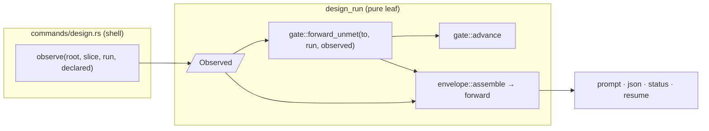

<!-- doctrine:section sec-1 -->
## What changes and why

A design run's **turn envelope** (`TurnEnvelope`, `DEC-064`) is the one read
model every design read projects: `design show --format prompt`, its JSON form,
the human status block, and `design resume`. Today it reports *state* — stage,
inquiry map, sections, acts — but not *what to do next*. Its one field for that,
`next_obligation`, has no writer and always reads *none recorded*. An agent
learns what the next stage advance requires by attempting it and being refused.

This slice replaces that field with a derived **`forward`** field: the run's
single outbound forward edge and everything it still needs, in the order the
gate checks it.

- **An edited document first.** If `design.md` was edited outside the run,
  every submission is refused before the gate is asked; `forward` says so and
  names the remedy.
- **Then the runbook.** The outstanding steps of the runbook guarding the edge (the
  stage's ordered checklist, `install/design-prompts/<stage>.toml`), the step at
  the cursor carrying its text.
- **Then conditions.** Each gate condition of the target stage that is not yet
  satisfied, with every cause and its discharging act — projected from the same `Unmet`
  value a refusal carries, long cause lists capped with a count.
- **Or ready.** Nothing outstanding: the row reads `ready` and carries the exact
  payload that crosses the edge.
- **Or nothing.** A `locked` run has no forward edge; `forward` is absent.

`forward` is computed on every read from the snapshot plus facts the shell
observes, and never stored (`DEC-290`). To make that truthful, the facts the
gate reads — the authored-document fingerprint, the governance-edge fingerprint,
the observed review ledger and the runbook — are assembled by one shell builder
shared by `apply` and every read (`DEC-292`). `advance` and the envelope then ask
one pure function which conditions are unmet, so a refusal and a forward row
cannot disagree.



*Purpose: one fact set and one evaluation feed both the gate and every read.*
`observe` is the only place facts are gathered; `forward_unmet` is the only
place conditions are evaluated. Apply passes the payload's review disposition
to `observe`; a read passes none and the stored act is used.

**Boundaries.** Nothing here changes what the gate enforces, the refusal text,
or the stage-entry contract receipt (`DEC-124`, narrowed by `DEC-291` only in
that the envelope now carries condition *status*, never contract prose). The
stored `next_obligation` is deleted and the envelope version moves to 2
(`DEC-291`'s compatibility rule). `resume`'s separate runbook section, which
sat outside the envelope, is absorbed into `forward` (`DEC-293`).

<!-- doctrine:section sec-2 -->
## The forward field

### Type

New in `src/design_run/render/envelope.rs`, replacing `next_obligation`:

```rust
/// The run's single outbound forward edge and what it still needs (DEC-290).
/// Derived on every projection, never stored. `None` only at `Locked`.
pub(crate) forward: Option<Forward>,

#[derive(Debug, Clone, PartialEq, Eq, Serialize)]
pub(crate) struct Forward {
    pub(crate) from: Stage,
    pub(crate) to: Stage,
    /// `design.md` edited outside the run: every ordinary submission is refused
    /// before the gate is asked (DEC-092 rule 1). `Some` blocks the edge.
    pub(crate) diverged: Option<Divergence>,
    /// The runbook guarding this edge; `None` where the edge carries none.
    pub(crate) runbook: Option<RunbookAhead>,
    /// Every unmet condition of `cumulative_conditions(to)`, in table order.
    pub(crate) unmet: Vec<UnmetRow>,
    /// Live discharges of steps that carry a `verify`, which `advance`
    /// re-runs and this read did not (DEC-294, STD-003).
    pub(crate) unchecked: Vec<String>,
    /// A complete `apply` payload that crosses the edge. `Some` exactly when
    /// nothing above blocks it.
    pub(crate) ready: Option<ApplyRequest>,
}

#[derive(Debug, Clone, PartialEq, Eq, Serialize)]
pub(crate) struct UnmetRow {
    pub(crate) condition: Condition,
    /// Every cause, each with its member list capped (sec-5).
    pub(crate) causes: Vec<CappedCause>,
    /// `Contract::remedy()` — the discharging act, carried so JSON has it.
    pub(crate) remedy: String,
}

// in gate.rs, beside Cause — Cause::capped produces it (sec-5)
#[derive(Debug, Clone, PartialEq, Eq, Serialize)]
pub(crate) struct CappedCause {
    pub(crate) cause: Cause,
    /// Members dropped from the cause's list by the cap; 0 when none.
    pub(crate) omitted: usize,
}

#[derive(Debug, Clone, PartialEq, Eq, Serialize)]
pub(crate) struct RunbookAhead {
    /// `RunbookKey::name()` — the stage whose edge it guards.
    pub(crate) name: &'static str,
    /// The step a discharge must name next, with its text (EX-14: only this
    /// step carries prose). `None` once every step is discharged.
    pub(crate) cursor: Option<CursorStep>,
    /// Required steps with no live discharge, in runbook order.
    pub(crate) outstanding: Vec<String>,
    /// Steps whose discharge no longer binds the step's definition.
    pub(crate) stale: Vec<String>,
}

#[derive(Debug, Clone, PartialEq, Eq, Serialize)]
pub(crate) struct CursorStep {
    pub(crate) id: String,
    pub(crate) position: usize, // 1-based
    pub(crate) of: usize,
    pub(crate) text: String,
}
```

`Divergence` is the `Diverged { expected, observed }` arm of `AuthoredState`,
which moves from `commands/design.rs:663` into the design-run core (sec-3). `RunbookAhead` is `RunbookStanding` (`runbook.rs:846`)
projected for a read, plus the cursor step's text. It drops `regressed`, which
a read cannot compute; `unchecked` says so instead of an always-empty list that
would read as *nothing regressed*.

### Derivation

`envelope::assemble` builds it from the snapshot and `GateFacts` (sec-3), under the envelope's `Detail`:

1. `Advance::from_stage(stage)` — `None` at `Locked` → `forward: None`.
2. `diverged` — `observe_watermark(run, facts.authored_fingerprint)`; the
   `Diverged` arm, else `None`.
3. `runbook` — `facts.runbook` (the edge's `RunbookFacts`) →
   `book.standing(&run.runbook.discharges, &digests, &[])` → `RunbookAhead`,
   the cursor step's text looked up by id in `book.steps`.
4. `unmet` — `gate::forward_unmet(to, run, facts)`, each `Unmet` projected to
   an `UnmetRow`: causes through `Cause::capped(ENVELOPE_CAUSE_MEMBERS)` at
   `Detail::Normal` (uncapped at `Full`), remedy from
   `condition.contract().remedy()`.
5. `unchecked` — steps with a non-empty `verify` whose `live_discharge` is
   `Some`.
6. `ready` — when `diverged` is `None`, the runbook is cleared and `unmet` is
   empty: an `ApplyRequest` carrying only its `SubmissionEnvelope` and
   `stage`:
   - `run_uid` — the run's uid;
   - `known_revision` — the run's current revision;
   - `submission_id` — minted by Doctrine: the first of
     `advance-<to>-r<revision>`, `…-2`, `…-3`, … with no retained receipt
     (`run.receipts.find`), so no earlier submission can have claimed it;
   - `stage` — `StageDeclaration { to, reason: None }`.

   The minted id matches no retained receipt at render time, so admission
   meets it as fresh and the printed payload can be applied exactly as shown;
   re-applying it resumes idempotently. An id whose receipt was evicted is safe
   to reuse: admission no longer finds it, and the minted revision is never
   below the receipt floor. A submission landing between the read and the
   apply moves the revision, and the payload is refused as stale — correct. `ApplyRequest::declare` gains
   `skip_serializing_if = "Vec::is_empty"` so the serialised payload shows only
   what it sets. `ApplyRequest` has no `Default`; the builder names every
   field, which keeps a future payload key a compile error here rather than a
   silent omission.

Every string is sourced from code or the runbook asset: stage tokens from
`Stage`, condition tokens from `Condition::as_str`, causes from `Cause`'s
`Display`, remedies from `Contract::remedy()`, the divergence text from the
refusal it mirrors, step ids and text from the embedded runbook, the payload
from serialising `ApplyRequest`. No new prose or vocabulary.

### Rendering

One function, `forward_lines(&Forward) -> Vec<String>`, serves the prompt and
resume projections; a `FORWARD_LABEL = "forward"` constant heads it (STD-001,
as `REVIEW_PASS_LABEL`). Rows follow the order a submission meets them: the
divergence refusal, the runbook, then the conditions. The first row is the next
act.

```
forward inquiring→drafting blocked
  runbook inquiring 1/2 inquire.knowledge — Record, via /knowledge, what this inquiry settled …
  runbook outstanding inquire.scope
  unmet blocking-inquiries-dispositioned: blocking inquiries await disposition: inq-1, inq-2, inq-3, inq-4, inq-5 (+7 more) → dispose every blocking inquiry on the map
  unmet user-accepts-sufficiency: no live `sufficiency-accepted` from user → the user performs `sufficiency-accepted` (you record it on their assent)
```

```
forward exploring→inquiring ready
  apply {"run_uid":"dr-…","known_revision":6,"submission_id":"advance-inquiring-r6","stage":{"to":"inquiring"}}
  unchecked explore.research — advance re-runs its check; this read did not
```

```
forward exploring→inquiring blocked
  diverged design.md has been edited outside this run — … review with `doctrine design adopt SL-262 --dry-run --diff`, then adopt it.
```

```
forward none
```

- `runbook stale <id> — its definition changed after it was discharged;
  discharge it again` — one row per stale step. The wording moves from
  `Runbook::section` (`runbook.rs:533`), which this slice retires; it is not
  copied.
- An `unmet` row is `UnmetRow`'s `Display`: `Unmet`'s existing format
  (`gate.rs:1307`) with each capped cause suffixed `(+N more)` where
  `omitted > 0`. The two share one formatter, so the refusal and the row
  cannot drift. The one multi-line remedy (`review-disposition-attested`)
  keeps its indented continuation lines.
- The `diverged` row's text comes from the function `refuse_authored_divergence`
  already uses, moved beside `observe_watermark`: one source for the refusal
  and the row.
- At `Locked`, prompt and resume both print `forward none` — one line,
  explicit, where `resume` today prints `next_obligation none recorded`.

| projection | carries |
|---|---|
| JSON | `"forward": {…}` or `null`, serde of `Forward`; `unmet[].remedy` and `ready` complete |
| `show --format prompt` | `forward_lines`, after the review lamps, where `next_obligation` rendered |
| status | one line: `  forward      inquiring→drafting blocked — 2 steps, 2 conditions` / `blocked — design.md diverged` / `ready` / `none` |
| `resume` | `forward_lines`, replacing the `next_obligation` line; `runbook_section` is removed |

<!-- doctrine:section sec-3 -->
## One fact set for the gate

### Current shape

`gate::satisfied(condition, run, derived: &DerivedInput)` reads four of
`DerivedInput`'s eight fields — the facts the shell observes and the pure layer
cannot:

| field | read by | shell source |
|---|---|---|
| `authored_fingerprint` | materialisation (`gate.rs:1382`) | `read_authored` — `design.md` + hash |
| `observed_facts` | observed-fact bindings (`gate.rs:1442`) | `observed_facts(root, slice)` — slice relations + hash |
| `observed_review` | review disposition (`gate.rs:1609`) | `observed_review(prior, request, root)` — the named `RV` |
| `runbook` | runbook standing (`run.rs:1810`) | `runbook_facts(stage)` — embedded asset + digests |

Only `apply` builds `DerivedInput` (`design.rs:2091`), inline. No read path
builds any of it, so a read cannot evaluate a condition.

### Target shape

Split the four gate-read facts into their own struct, in `design_run/run.rs`
beside `DerivedInput` (the gate already imports `run::DerivedInput`, so no new
module edge):

```rust
/// The facts the shell observes this invocation and the gate reads (DEC-292).
/// Built by one shell function for apply and for every read.
#[derive(Debug, Clone, Default, PartialEq, Eq)]
pub(crate) struct GateFacts {
    pub(crate) authored_fingerprint: Option<Fingerprint>,
    pub(crate) observed_facts: ObservedFacts,
    pub(crate) observed_review: Option<ObservedReview>,
    pub(crate) runbook: Option<RunbookFacts>,
}

pub(crate) struct DerivedInput {
    pub(crate) gate: GateFacts,
    // apply-only, unchanged:
    pub(crate) section_digests: BTreeMap<DesignId, Fingerprint>,
    pub(crate) authored_sections: BTreeMap<DesignId, AuthoredSection>,
    pub(crate) verifications: Vec<StepVerification>,
    pub(crate) declaration_fingerprint: Option<Fingerprint>,
}
```

*Naming:* `DEC-292` called this `Observed`; it is `GateFacts` here because
`gate::ObservedFacts` (the governance-edge fingerprint map) already exists and
`Observed { observed_facts: ObservedFacts }` would read as a stutter. The name
says who consumes it.

**The gate** narrows to what it reads:

```rust
fn satisfied(condition: Condition, run: &DesignSnapshot, facts: &GateFacts)
    -> Result<(), Vec<Cause>>;

/// Every unmet condition of `to`'s cumulative set, every cause (DEC-067).
/// The one evaluation `advance` and the envelope share.
pub(crate) fn forward_unmet(to: Stage, run: &DesignSnapshot, facts: &GateFacts)
    -> Vec<Unmet>;

pub(crate) fn advance(from, to, run, facts: &GateFacts, runbook: Option<&RunbookStanding>)
    -> Result<Stage, Refusal>;   // body: legality, runbook, then forward_unmet
```

`forward_unmet` is the existing `filter_map` at `gate.rs:1678-1684`, moved, not
rewritten; `advance` calls it and wraps a non-empty result in `GateNotCleared`.

**The shell builder** (`commands/design.rs`):

```rust
/// Every fact the gate reads, observed this invocation (DEC-292).
fn gate_facts(
    root: &Path,
    slice: u32,
    run: &DesignSnapshot,
    authored_fingerprint: Option<Fingerprint>,
    declared: Option<&ReviewDisposition>,
) -> Result<GateFacts>
```

- `authored_fingerprint` is passed in, not read, because `apply` already holds
  the document bytes (`read.fingerprint`) and must not read `design.md` twice;
  reads pass `read_authored_fingerprint(root, slice)?`.
- `declared` is the payload's review disposition on `apply` and `None` on a read.
  The existing `observed_review` loses its `&ApplyRequest` parameter for this
  `Option<&ReviewDisposition>`: the payload wins where present, the stored act
  otherwise — its rule today, now callable without a request.
- `runbook_facts(run.run.stage)` and `observed_facts(root, slice)` are called as
  they are.

`apply` becomes `DerivedInput { gate: gate_facts(…)?, …apply-only fields }`.
`envelope_turn` and `run_resume` call `gate_facts(…, None)` and pass it to
`envelope::project`, which gains a `&GateFacts` parameter beside `outstanding`.

**Not shared: the `RV` read.** `DEC-292` expected `observed_review` to share its
ledger read with `outstanding_by_severity`. It does not: that lamp *fails loud* on
an unreadable ledger (owner's 2026-08-05 ruling) while the gate reads the same
failure as *refusal*, and one read serving both would couple the envelope's lamp
into the gate's input. The cost is one small file read, only once a conducted
review is disposed.

### The watermark check moves into the core

`observe_watermark` and `AuthoredState` (`commands/design.rs:657-673`) are pure —
a snapshot and an `Option<&Fingerprint>` in, a classification out — but live in
the shell, so no read model can ask whether `design.md` has diverged. They move
to `design_run/document.rs` (beside the renderer the watermark guards), with the
refusal's text as a pure function over the `Diverged` arm and the slice's
canonical id (`SL-262`), passed in by the shell as a `&str` — the core cannot
name `crate::listing` (ADR-001), and the runbook's `Bindings { slice, .. }` is
the precedent for a shell-rendered slice ref crossing into it. `envelope::project`
gains that `slice_ref: &str` beside `&GateFacts`. `refuse_authored_divergence` keeps its call sites and wraps that
function; `envelope::assemble` calls `observe_watermark` over
`facts.authored_fingerprint` for `Forward::diverged`, and renders the same text.
One classification, one sentence, two consumers.

### Truthfulness

The forward rows meet a submission in the order `apply` does: the
authored-divergence refusal first, then the runbook, then the conditions. A fact
the shell cannot observe is absent from `GateFacts`, and the gate reads
absence as changed (`gate.rs:1436-1446`). On a read that renders as an `unmet`
row with its `ObservedStale` cause — the answer `advance` would give on the same
facts. A read never shows fewer unmet conditions than `advance` would refuse on,
except the runbook checks it cannot run, which `unchecked` names.

### Invariants

- `forward_unmet(to, run, facts)` is empty ⇔ `advance` passes its condition leg
  on the same inputs. The e2e suite pins this by comparing a refusal's `unmet`
  with the preceding read's `forward.unmet`.
- `GateFacts` has one builder; `DerivedInput` is never assembled without it.
- The design-run leaf stays free of disk, clock and git (ADR-001): every field
  is computed in the shell.

<!-- doctrine:section sec-4 -->
## Retiring next_obligation

**Snapshot.** Delete `RunHeader::next_obligation` (`snapshot.rs:69-71`) and its
`None` initialiser (`snapshot.rs:667`). Old snapshots still read: `RunHeader`
carries no `deny_unknown_fields`, so serde ignores a `next_obligation` key on
read, and the field was `skip_serializing_if = "Option::is_none"` — and always
`None` — so no snapshot written since `SL-233` carries it anyway. No snapshot
schema version bump. A unit test deserialises a snapshot fixture carrying
`"next_obligation": null` and one carrying a string, and asserts both load
(design-run snapshots are long-lived; a serde break is not licensed by "runtime
state is disposable").

**Envelope.** Delete `TurnEnvelope::next_obligation` and its three render sites
(`envelope.rs:1232`, `:1347`, `:1408`); `forward` takes their places.

**Version.** `TURN_ENVELOPE_VERSION` 1 → 2 (`envelope.rs:62`), under `DEC-291`'s
rule: removing a key bumps; adding one does not. `forward` alone would be
additive; the removal is what bumps. The constant's doc comment states the rule
and cites `DEC-291`, and the two "Additive at `TURN_ENVELOPE_VERSION = 1`"
comments (`envelope.rs:362`, `:411`) are left true as history.

**Tests that name the key.** `tests/e2e_design_show_golden.rs:104,133` (version
and `"next_obligation": null` in the byte-exact golden — regenerated, now
carrying `forward`), `tests/e2e_design_projection.rs:657` (key list),
`tests/e2e_claude_install.rs:582` (`assert_envelope_present` checks each
`resume` output still carries the envelope by line prefix — `next_obligation`
becomes `forward`, which `resume` prints on every stage including `forward
none` at `locked`).

<!-- doctrine:section sec-5 -->
## Bounds

`forward` is in the **no-drop set** (`DEC-293`): outside `evict_one`'s ladder,
like `contract_pointer` and the totals. That is sound only if `forward`'s
rendered size is bounded by the binary, not by the run. Row *count* is; row
*size* is not on its own, because several `Cause` variants carry lists that grow
with the run — every open blocking inquiry, every unreviewed section, every moved
section, every undisposed blocker (`gate.rs:1129-1206`). So cause members are
capped at `Detail::Normal`.

### The cause cap

```rust
impl Cause {
    /// This cause with its member list cut to `max`, and how many were cut.
    /// Every list-carrying variant is handled here, beside the variants, so a
    /// new list variant cannot escape the cap.
    pub(crate) fn capped(&self, max: usize) -> CappedCause;
}
```

It applies to `InquiriesOpen.nodes`, `SectionsUnreviewed.subjects`,
`CoverageStale.moved`, `BlockersUndisposed.findings` and `ActMissing.lanes`
(already ≤ 2); scalar variants pass through with `omitted: 0`. The rendered
cause gains `(+N more)` where `omitted > 0`, so no member is dropped silently
(`STD-003`). `--full` (`Detail::Full`) renders uncapped, as it does for every
other bounded list. Refusals stay uncapped: they have no byte budget and are
the place to see the whole set.

### What bounds forward

| part | bound | source |
|---|---|---|
| `unmet` rows | ≤ `Condition::ALL.len()` (9) | the closed condition vocabulary |
| causes per row | ≤ the row's act requirements + observed-fact bindings | the contract table (`gate.rs`) |
| members per cause | ≤ `ENVELOPE_CAUSE_MEMBERS` | this slice |
| `diverged` | one row, two fingerprints | fixed |
| `runbook.outstanding`, `runbook.stale` | ≤ the edge's step count | the embedded runbook asset |
| `runbook.cursor.text` | one step's text | the embedded runbook asset (`EX-14`) |
| `unchecked` | ≤ steps carrying `verify` | the embedded runbook asset |
| `ready` | four scalar keys | fixed |

Two named constants in `render/mod.rs`, with the other `ENVELOPE_*` bounds and
the same provenance-comment rule:

```rust
/// Unmet rows on the forward edge. Derivation: one per condition in the closed
/// vocabulary — `cumulative_conditions` at `reviewing→locked` is all of them.
const ENVELOPE_FORWARD_UNMET: usize = Condition::ALL.len();

/// Members rendered per cause list on the forward edge. Derivation: the
/// `ENVELOPE_BLOCKERS` precedent (5) — enough to name the first work items,
/// and at DESIGN_ID_BYTES + lane (≤ 48 B) per member a capped cause stays
/// under ~250 B, so nine rows cannot approach the ceiling.
const ENVELOPE_CAUSE_MEMBERS: usize = 5;
```

The runbook parts are bounded by assets the binary embeds, not by a constant:
runbooks are parsed at runtime, and a constant restating today's step counts
would be a second copy of the asset.

### The bounding fixture

`REQ-437` asks for a run large enough to exceed every limit. The fixture adds:

- **a growing run** — 300 blocking inquiries open, 300 sections unreviewed and
  moved under a stale act, 50 undisposed blockers: the normal envelope still
  renders under `ENVELOPE_NORMAL_BUDGET_BYTES`, every cause row shows
  `(+N more)`, and `--full` shows every member;
- **a maximal forward per embedded runbook** — every condition of
  `reviewing→locked` unmet with every cause at its cap, every step outstanding,
  the longest step text at the cursor, and every evictable list at its limit:
  renders under the ceiling.

If a future runbook (a project override, `IMP-372`) made the no-drop set alone
exceed the ceiling, `project` already refuses with `EnvelopeIrreducible` rather
than emitting a malformed envelope. `IMP-372` must then add an admission bound on
override step count and text; that is recorded against `IMP-372`, not built here.

<!-- doctrine:section sec-6 -->
## Governance and guidance

### Records

| record | role |
|---|---|
| `DEC-290` | `forward` replaces `next_obligation`; shape and derivation |
| `DEC-291` | narrows `DEC-124`'s envelope clause to "no contract prose"; envelope compatibility rule; version 2 |
| `DEC-292` | `GateFacts`, one builder for apply and read |
| `DEC-293` | `forward` is no-drop, on every projection, replacing `resume`'s runbook section |
| `DEC-294` | the forward line names the checks a read skipped |

Backlog at close: `IMP-390` closes (its remaining faces — the writerless field
and the forward look — are this slice). `IMP-367` gets a note that
`next_obligation`'s disposition was owned and settled here. `IMP-372` gets a note
that a project runbook override must bring an admission bound on step count and
text (the `bounds` section).

### Spec revisions (at reconcile, via REV)

- `PRD-019` `REQ-414` — the framework "holds the run's stage, pending
  obligation, …": the pending obligation is no longer held; it is derived. Drop
  it from the held list; "resolves the next obligation from that state" already
  describes `forward`.
- `SPEC-029` `REQ-437` — add the forward edge to the named limits, and the
  maximal-forward case to the bounding run.
- `SPEC-029` responsibilities — the envelope's forward look is a projection of
  the gate-contract table, beside the refusal and the stage-entry receipt.

`REQ-433` and `REQ-416` need no text change: this slice brings `resume`'s
runbook row inside the envelope (satisfying `REQ-433` where it was not), and
`resume` carries `forward` (`REQ-416`).

### Guidance

Two edits, each pointing at the envelope row, not at source:

- `install/hymns/stage/design.md`, *Say what is missing* — add after the first
  bullet:
  > The envelope's `forward` rows are what the next advance still needs —
  > runbook steps first, then unmet conditions; act on the first. `ready` names
  > the payload that crosses. Read it before attempting a stage move rather than
  > learning the edge by refusal.
- `plugins/doctrine/skills/design/SKILL.md`, Activation step 2 — "It carries the
  stage, the next obligation, and the outstanding runbook steps" becomes "It
  carries the stage and `forward`: what the next advance still needs, in order."

No change to `install/design-prompts/**`: its fragments describe work and
refusals, never envelope rows.

<!-- doctrine:section sec-7 -->
## Code impact

| path | change |
|---|---|
| `src/design_run/run.rs` | add `GateFacts`; `DerivedInput` embeds it as `gate`; `advance` call site (`:1810-1822`) reads `derived.gate.runbook` |
| `src/design_run/gate.rs` | `satisfied` and `advance` take `&GateFacts`; extract `forward_unmet` from `advance` (`:1678-1684`); `CappedCause`, `Cause::capped`; one formatter shared by `Unmet` and `UnmetRow` |
| `src/design_run/document.rs` | receives `AuthoredState`, `observe_watermark` and the divergence sentence from `commands/design.rs:657-695` |
| `src/design_run/submission.rs` | `ApplyRequest::declare` gains `skip_serializing_if = "Vec::is_empty"` |
| `src/design_run/render/envelope.rs` | `Forward`, `UnmetRow`, `RunbookAhead`, `CursorStep`; `forward` replaces `next_obligation`; `project`/`project_within`/`assemble` take `&GateFacts` and `slice_ref`; `forward_lines`; prompt, status, resume render sites; `TURN_ENVELOPE_VERSION = 2` |
| `src/design_run/render/mod.rs` | `ENVELOPE_FORWARD_UNMET`, `ENVELOPE_CAUSE_MEMBERS` |
| `src/design_run/runbook.rs` | retire `Runbook::section`; the stale-step wording moves to `forward_lines`; expose what `forward` needs (step lookup by id, `verify` presence) |
| `src/design_run/snapshot.rs` | delete `RunHeader::next_obligation` |
| `src/design_run/tests.rs` | call sites that build `DerivedInput` move their gate fields under `gate` |
| `src/commands/design.rs` | `gate_facts` builder; `observed_review` takes `Option<&ReviewDisposition>`; apply composes `DerivedInput` from it; `envelope_turn` and `run_resume` build `GateFacts`; retire `runbook_section`; `refuse_authored_divergence` wraps the moved watermark check |
| `install/hymns/stage/design.md` | one bullet |
| `plugins/doctrine/skills/design/SKILL.md` | activation step 2 wording |
| `tests/e2e_design_show_golden.rs` | regenerated golden, version 2, `forward` |
| `tests/e2e_design_projection.rs` | key list; forward rows; bounding run |
| `tests/e2e_claude_install.rs` | envelope-presence prefix `forward` |
| `tests/e2e_design_*.rs` | new forward cases (the `verification` section) |

The design-target selectors for these paths are recorded on the slice.

**Behaviour preserved.** Everything `apply` refuses today it refuses the same way
and with the same text: `forward_unmet` is `advance`'s loop, moved, and the
divergence refusal's sentence moves with its classifier, unchanged. Refusals
are never capped. The existing
gate and apply suites stay green unchanged except where they construct
`DerivedInput` by field.

<!-- doctrine:section sec-8 -->
## Verification

### Key tests

Pure (`design_run` unit):

- **forward is None at locked** — a locked snapshot projects `forward: None`.
- **forward_unmet agrees with advance** — for each `Advance`, on a snapshot
  with a known unmet set, `forward_unmet(to, …)` equals the `unmet` inside
  `advance`'s `GateNotCleared`; empty ⇔ `advance` passes its condition leg.
- **ready only when nothing is outstanding** — no divergence, cleared runbook
  and empty `unmet` yield a `ready` payload carrying the run's uid, current
  revision, `advance-<to>-r<revision>` and `stage.to`; any one blocking yields
  `None`.
- **cause lists are capped, never silently** — `Cause::capped(5)` over each
  list-carrying variant with 12 members keeps 5 and reports `omitted: 7`; the
  rendered row ends `(+7 more)`; a scalar variant passes through with
  `omitted: 0`; `Detail::Full` is uncapped.
- **UnmetRow and Unmet render alike** — for an uncapped row the two
  `Display`s are byte-identical; JSON of an `UnmetRow` carries `remedy`
  equal to `Contract::remedy()`.
- **minted id avoids retained receipts** — with a receipt already holding
  `advance-inquiring-r<N>` at revision N, the ready payload mints
  `advance-inquiring-r<N>-2`; admission meets it as fresh.
- **divergence blocks ready** — a snapshot with a watermark and a different
  observed fingerprint yields `diverged: Some` and `ready: None`; the row's
  text equals `refuse_authored_divergence`'s refusal for the same inputs.
- **cursor carries text, others do not** — two outstanding steps render one
  `runbook <name> 1/n <id> — <text>` row and one `runbook outstanding <id>` row.
- **stale step renders its marker** — a discharge under an edited definition
  renders `runbook stale <id> — …`.
- **unchecked names verified steps** — a live discharge of a step with `verify`
  appears in `unchecked`; a step without `verify` never does.
- **old snapshots load** — fixtures carrying `"next_obligation": null` and a
  string deserialise.
- **maximal forward fits** — for every embedded runbook, the bounding envelope
  with every condition unmet renders under `ENVELOPE_NORMAL_BUDGET_BYTES`.

End-to-end (`tests/e2e_design_*.rs`, real binary):

- **a fresh run names its first step** — `design start` then
  `show --format prompt` prints `forward exploring→inquiring blocked` and the
  `explore.scope` step with its text.
- **a discharged runbook names the conditions** — with the runbook cleared,
  the forward rows are the unmet conditions with their remedies, and a
  subsequent stage attempt refuses with the same condition set.
- **ready is applied as printed** — satisfy every condition; the `apply` row's
  JSON, passed verbatim to `design apply --input`, advances the stage;
  passing the same JSON again resumes idempotently on its submission id rather
  than moving twice.
- **a squatted id does not break ready** — seed an earlier accepted submission
  under the id the ready row would mint; the printed payload still advances.
- **an edited document blocks ready** — on an edge whose conditions are met,
  edit `design.md` outside the run: the forward rows read `blocked` with a
  `diverged` row first and no `apply` row, and a stage submission is refused
  with the same sentence.
- **a large run still renders** — the growing-run bounding fixture (sec-5)
  renders under the ceiling through the real binary, with `(+N more)` markers;
  `--full` lists every member.
- **exploring discloses its skipped check** — after `explore.research` is
  discharged `verified`, the forward rows include
  `unchecked explore.research`.
- **resume carries forward, not a runbook section** — `resume` prints
  `forward …` and no line beginning `runbook exploring obligation` outside it.
- **JSON carries forward** — `show --format json` has `forward` with
  `unmet[].remedy` and a complete `ready` payload, `version` 2, and no
  `next_obligation`.
- **an unobservable fact renders unmet** — with the slice's relation record
  unreadable, `governing-context-recorded` renders unmet with its
  `ObservedStale` cause (fail closed, same as `advance`).

### Scope closure mapping

| scope objective | evidence |
|---|---|
| 1 derive the forward edge | fresh-run, conditions, ready-as-printed, divergence, locked tests |
| 2 delete `next_obligation`, version 2 | JSON test, golden, old-snapshot test |
| 3 one fact builder | forward/advance agreement; unobservable-fact test |
| 4 placement | resume and JSON tests; cause cap; growing-run and maximal-forward bounds |
| 5 disclosure | unchecked tests |
| 6 guidance | the two edits, reviewed at audit (`VA`) |

<!-- doctrine:section sec-9 -->
## Risks and residuals

- **Read cost.** Every envelope read now reads `design.md`, the slice's relation
  record, and (once a conducted review is disposed) its `RV`, and evaluates up
  to nine conditions. All small and bounded; not measured. If a read-latency
  regression appears, the first lever is skipping `authored_fingerprint` on edges whose
  cumulative set excludes `materialisation-current`, the one condition that
  reads it.
- **Golden churn.** The byte-exact show golden and several e2e expectations
  move at once. Mitigation: the envelope change lands in one phase with the
  golden regenerated from the binary and diffed by eye, not hand-edited.
- **Runbook override bound (residual).** Embedded runbooks are bounded by the
  bounding fixture; a future project override (`IMP-372`) is not, until it adds
  an admission bound. `EnvelopeIrreducible` refuses rather than corrupts in the
  meantime. Recorded against `IMP-372`.
- **Regression blindness (residual, disclosed).** A read still cannot see a
  regressed runbook step; `unchecked` names the steps that could be. Running
  verifiers on reads was rejected (`DEC-294`).
- **Stale-run migration.** In-flight runs (this one included) carry no
  `next_obligation` key already; nothing to migrate.

