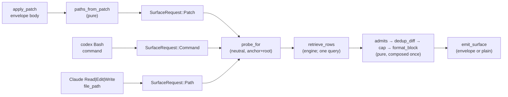

<!-- doctrine:section sec-1 -->
# Design SL-263: Ambient memory surfacing for pi and codex

## 1. What changes, in one page

`doctrine memory surface` is the ambient memory hook `SL-205` shipped for Claude
Code. It reads a `PreToolUse` envelope on stdin, keys it on the file a tool is
about to touch or the command it is about to run, and — when it has something
worth saying — emits one advisory block. Nothing else happens: it never blocks a
call, never rewrites input, and exits 0 on every path.

`SL-263` ports that hook to codex and pi. The port is asymmetric, because the two
harnesses expose different seams:

- **codex** has a full hooks engine whose wire contract is deliberately
  Claude-compatible, so a new `PreToolUse` spec is mostly configuration. Its one
  genuinely new vocabulary is `apply_patch`, the single tool through which codex
  performs file edits (the patch body arrives in `tool_input.command`).
- **pi** has no hook-config file at all. Its extension API exposes `tool_result`
  — *after* a tool runs — whose result may replace the content the model sees.
  There is no pre-execution context channel.

The design is therefore about one thing: keeping the harness-specific decode out
of the neutral core. `SL-205`'s core is a retrieve query, a severity/staleness
admission gate, session dedup, a cap and a recorder. `SL-263` adds **one arity
change** to that core — a path probe that may carry a set rather than a single
path — and no logic change: no query, no admission rule, no ranking and no
tuning knob moves. What else it adds is a **neutral surface request** — a
doctrine-owned `(class, value)` pair — and one small per-harness codec that
normalises each harness's wire *into* that request. The core is then composed
once, with no new logic, and never learns a harness tool name.

Four user-visible changes follow:

1. `memory surface` gains `--input <claude|codex|neutral>` (default `claude`)
   and `--format <claude|plain>` (default `claude`).
2. codex gets two `PreToolUse` matcher groups — `Bash` and `apply_patch` — wired
   through a new `codex_hook_specs` registry.
3. pi gets a generated `.pi/extensions/doctrine/surface.ts` extension.
4. The Claude hook command becomes explicit (`memory surface --input claude`) in
   both the settings writer and the published plugin file.

<!-- doctrine:section sec-2 -->
## 2. Current State

### The command

`MemoryCommand::Surface` is a field-less unit variant (`src/memory.rs:299-302`),
so `doctrine memory surface` has no arguments at all today and its only
interface is stdin. Its doc comment defines the contract: read
`{session_id?, agent_id?, cwd?, tool_name?, tool_input?}`, key on the path or
command, emit `additionalContext` or nothing, exit 0 always, main-thread only.

The adapter is layered for testability:

| item | role |
|---|---|
| `SurfaceInput` / `SurfaceToolInput` (`:10500-10519`) | the Claude wire; every field `#[serde(default)]`, so a partial or malformed payload folds to `Default` and emits nothing |
| `probe_for` (`:10533-10561`) | discriminates `tool_name` + `tool_input` into `(Surface, ScopeProbe)`; relativises an absolute `file_path` against the root (`ISS-232`) |
| `admits` / `dedup_diff` / `cap` / `format_block` (`:10403-10463`) | the pure pipeline: severity gate (command surface only), session dedup by uid, per-surface cap, block render |
| `emit_surface` (`:10685-10706`) | writes the `hookSpecificOutput.additionalContext` line; a write error folds to "not delivered" |
| `run_surface_to` (`:10720-10778`) | the testable core: parse → subagent gate → root discovery → probe → retrieve → admit → dedup → cap → format → emit → record. `Ok(())` on every path |
| `run_surface` (`:10787`) | the impure boundary: reads stdin and `CLAUDE_PROJECT_DIR`, passes both down |

Runtime state lives under the discovered root: a per-session seen-set
(`mem-surface-seen-<session_id>.txt`) and a one-line-per-delivery JSONL tuning
log (`mem-surface.log`). Both are written only when a non-empty block was
actually delivered.

### The installer

`HookSpec` (`src/boot.rs:1086`) carries the exec path, a fixed argument suffix
that doubles as the ownership key, an ownership predicate, the hooks event and
an ordered matcher set. The merge core (`plan_hook` and friends) is generic over
it. Claude's specs are enumerated by `claude_hook_specs` (`:1184`), the single
enumeration of what doctrine activates and the thing a later manifest-vs-registry
check keys off.

The **Codex arm does not ride a registry**: `install_refresh` (`:1520`) makes one
inline `install_codex_hook(root, &HookSpec::boot_emit(exec, SESSION_MATCHERS_CODEX), dry_run)`
call for the `SessionStart` hook.

pi's extension install is a per-module triad — `generate_*` / `plan_*` (a
four-way `ExtAction`, ownership check on `PI_EXT_HEADER`) / `install_*` — and it
exists twice: `generate_pi_extension` (`:2250`, a `format!` literal that also
imports `./mcp.ts`) and the MCP bridge
(`MCP_EXT_TEMPLATE = include_str!("../templates/mcp.ts")`, `:2328`).
`RefreshReport` (`:1628`) reports one outcome per install leg, and the Codex arm
already hosts both pi installers.

### The published Claude channel

`plugins/doctrine/hooks/hooks.json` carries two `PreToolUse` matcher groups
(`Read|Edit|Write` and `Bash`), each invoking
`${DOCTRINE_BIN:-doctrine} memory surface`. `SL-250` retired the plugin channel
as doctrine's own activation path, but the tree remains the published plugin's
payload, so this file and the merge-core writer are two places the same command
string lives.

<!-- doctrine:section sec-3 -->
## 3. Forces & Constraints

### Governance

- **`IDE-034` (candidate `POL-003`)** is the rule that governs adapter
  placement: *harness-specific behaviour ships as an opt-in supplement whose
  correctness rests only on doctrine-owned contracts — never baked into the
  neutral core, never load-bearing on a host harness's incidental seams.* This
  slice is its fourth instance, which by `IDE-034`'s own threshold makes the
  principle policy-shaped; `POL-003` is authored in this slice's governance leg.
- **`ADR-011`** governs by its surviving theme only — *mechanism moved into the
  binary is identical under every harness by construction*. Its second theme
  (per-harness capability altitude) is self-declared falsified by `SL-254` and is
  not relied on.
- **`ADR-001`** fixes layering as `leaf ← engine ← command`. `memory` and `boot`
  are command tier, and no new module is introduced: the neutral request, the
  codecs and the patch reader live in `src/memory.rs`. The engine gains exactly
  one thing: a `ScopeProbe` whose path arm carries a path *set* instead of a
  single path, so a multi-file patch is one query rather than N. No query, no
  admission rule, no ranking and no tuning knob changes.
- **`POL-002`** keeps doctrine independent of a host *project*'s conventions. It
  does not reach the host *harness* axis, and stretching it there would let a
  real gap pass as already-governed.
- **`STD-001`** requires single-source named constants: the wire names, the
  surface class names, the codex matchers, the codex tool names, and the context
  limit and timeout each wire carries.
- **`STD-003`** requires that a skipped or failed install leg is *named*, not
  absorbed. Every new codex and pi leg feeds `RefreshReport` and is reported —
  within what doctrine can observe (§5.6, R-7).
- **`REQ-018` / `REQ-151` / `REQ-152`** (render as data, non-bypassable trust
  holdback) are unchanged and must not regress: the surface emits pointers, never
  memory bodies, and the holdback stays in the engine.
- **`PRD-004` §2 / §8** out-scope *proactive, unsolicited injection ahead of
  demand* and leave the contract for pre-emptive surfacing blocked. The
  governance leg reconciles this at reconcile; the design does not treat it as
  satisfied meanwhile.
- **`PRD-007` §2** out-scopes *per-turn injection of governance content during a
  session, and any mechanism that re-pays orientation cost mid-session*. It does
  **not** reach this feature, and saying why is the resolution of the conflict
  the draft first carried: the surface injects *memories* — a footgun, a
  scope-relevant pointer — and never governance text, orientation content, or a
  re-run of the boot snapshot. No `PRD-007` revision is owed.

### The two harness contracts

Verified against codex 0.155.1's published hook contract and binary, and against
the pi extension API.

- **codex** — `PreToolUse` matches on `tool_name`; the canonical hook tool names
  are `Bash` and `apply_patch`. codex's internal names (`shell`, `unified_exec`)
  are canonicalised to `Bash` at the hook layer; the matcher aliases `Edit` and
  `Write` are accepted, but the input still reports `tool_name: "apply_patch"`.
  `tool_input` is a JSON value whose `command` field carries both the shell
  command and the patch body. **`additionalContextLimit` and `timeout` are
  handler fields**, beside `command` inside `hooks: […]`, not matcher-group
  fields. Codex's tool coverage has no read tool: file reads go through the shell
  and match `Bash`, so `apply_patch` is the **only** path trigger. Non-managed
  hooks must be reviewed and trusted before they run, and trust is keyed to a
  hash of the handler definition — the binary exposes a per-hook `trusted_hash`
  but not what it digests — so a rewritten handler, which a baked absolute exec
  path makes on every upgrade, re-arms the trust review. `PreToolUse` carries **no**
  `agent_id` (only `SubagentStart`/`SubagentStop` do), and subagent hooks report
  the **parent** session id.
- **pi** — the extension API exposes `tool_result` (post-execution) and no
  pre-execution context channel. Handlers are awaited and compose.
  `ToolResultEvent` carries `toolName`, `input`, `content` and `isError`, but
  **no agent or session identity**; `ctx.sessionManager.getSessionId()` supplies
  a session id and `ctx.cwd` the working directory. Built-in tool inputs are
  `read`/`write`/`edit` with `path`, and `bash` with `command` — all normally
  relative to pi's cwd.

### Forces pulling against each other

The pull toward the smallest diff is real: codex's command surface is genuinely
configuration, and a single `apply_patch` arm on `probe_for` would be a handful
of lines. It is rejected because it would put a harness tool name in the shared
decoder — precisely the coupling `IDE-034` forbids, and the difference between a
port and a fork.

The pull toward one output form is also real: codex makes the envelope a de-facto
cross-harness contract, so a pi adapter that parsed it would work today. It is
rejected because that would make pi's correctness rest on the envelope's key
shape — an incidental seam — rather than on a doctrine-owned output form.

The pull toward leaving the engine alone is real, and was the draft's first
position. It loses to a measured cost: looping the engine per path pays one whole
corpus load and one git capture per file in a patch, on the edit hot path, and
the engine's multi-path query already exists. Widening the probe is the smaller
change in the end — one variant against a merge, a dedup and a second ranking
rule re-implemented above it.

<!-- doctrine:section sec-4 -->
## 4. Guiding Principles

1. **The neutral core never learns a harness name.** Harness vocabulary lives in
   codecs; the pipeline sees only a `(Surface, ScopeProbe)`.
2. **One composition.** The pipeline is admit → dedup → cap → format, composed
   once per fire regardless of how many probes that fire carries.
3. **Fail-open at runtime, loud at install.** The runtime path can never block,
   never exits non-zero and never panics; the installer names every skip.
4. **Explicit interfaces.** Wire and format are named on the command line; a
   default exists only where an un-upgraded install needs one, and that
   equivalence is a tested contract.
5. **Add a spec, not a branch.** The codex arm grows a registry rather than a
   second inline call, so the set of what doctrine wires stays enumerable.

<!-- doctrine:section sec-5 -->
## 5. Proposed Design

### 5.1 The neutral surface request

The one type the three wires converge on:

```rust
/// A harness-neutral description of what a tool call is about to touch. Each
/// harness's codec produces one of these; nothing downstream learns which
/// harness produced it.
pub(crate) enum SurfaceRequest {
    /// A file path as the harness reported it — absolute, or relative to the
    /// harness's working directory.
    Path(String),
    /// A shell command about to run.
    Command(String),
    /// An `apply_patch` envelope body (codex's `tool_input.command`).
    Patch(String),
}
```

One function turns a request into the probe the engine consumes:

```rust
/// The working directory a wire reported, in the two forms resolution needs:
/// the raw value (its prefix may be symlinked) and the canonical anchor root
/// discovery computed.
struct SurfaceAnchor {
    raw: Option<PathBuf>,
    canonical: PathBuf,
}

/// Resolve a neutral request into the engine probe it denotes. A relative value
/// joins `anchor.canonical`; an absolute value under `anchor.raw` is rebased
/// onto `anchor.canonical`; both are normalised lexically (`.` / `..`, never
/// canonicalised — the file may not exist yet) before the strip against `root`.
/// A request that resolves to nothing — an empty value, or a path outside
/// `root` — yields `None` (fail-open).
fn probe_for(request: SurfaceRequest, anchor: &SurfaceAnchor, root: &Path)
    -> Option<(Surface, ScopeProbe)>
```

- `Path(raw)` → `(Surface::Path, ScopeProbe::Paths(vec![resolved]))`, or `None`.
- `Command(cmd)` → `(Surface::Command, ScopeProbe::Command(cmd))`.
- `Patch(text)` → `(Surface::Path, ScopeProbe::Paths(paths))`, one entry per
  resolved header path, or `None` when the patch names no resolvable path.

The anchor is a **two-form** value on purpose. `discover_surface_root`
canonicalises the stdin `cwd` before walking up, so `root` and the anchor are
canonical, while the value a harness reports may not be (a symlinked checkout,
macOS `/tmp` → `/private/tmp`, a bind-mounted jail path). Carrying only the raw
value makes `strip_prefix(root)` miss on every symlinked path; carrying only the
canonical anchor fixes relative values but leaves an **absolute** value — which
Claude always sends, and pi and codex may — failing the strip through a
symlinked prefix. So both are carried:

- a **relative** value joins the canonical anchor, then is normalised lexically;
- an **absolute** value that lies under the raw reported cwd is **rebased** — its
  raw prefix swapped for the canonical anchor — then normalised. Both values are
  already in hand, so this stays pure and never touches the filesystem;
- an absolute value under neither prefix is taken as already canonical.

The result is stripped against `root`; an out-of-root path fails open. This
resolves the **reported prefix**, not an arbitrary symlink on the path: an
absolute path routed through a symlink that is neither the reported cwd nor the
root still fails open rather than matching wrongly — a residual limitation of a
pure resolver, stated rather than hidden. When the wire carries no `cwd`,
relative values join the env anchor root discovery fell back to.

`ScopeProbe`'s path arm becomes a **set**. `QueryContext.paths` is already a
`Vec` and `match_scope` admits a memory on any of them with one ranking, so the
engine already knows how to answer a multi-path question; widening the probe is
what lets it be asked once (§5.4). A single-path request is the one-element case
and behaves exactly as before.

`Surface::Path` stays ungated and `Surface::Command` stays severity-gated.
`Patch` is a *request* kind, not a surface kind, and always resolves to `Path`.

### 5.2 The input wires

`--input <claude|codex|neutral>`, default `claude`. The value selects a codec; it
is not consulted anywhere below the decode step except to record itself on the
tuning log (§5.4).

| wire | consumer | codec | mapping |
|---|---|---|---|
| `claude` | Claude Code `PreToolUse` | `claude_request` | `Read`/`Edit`/`Write` + `file_path` → `Path`; `Bash` + `command` → `Command` |
| `codex` | codex `PreToolUse` | `codex_request` | `Bash` + `command` → `Command`; `apply_patch` + `command` → `Patch` |
| `neutral` | the generated pi extension | `neutral_request` | the doctrine-owned envelope below |

Claude's and codex's wires are the same JSON shape — both carry `session_id`,
`cwd`, `tool_name` and a `tool_input` object — so both decode `SurfaceInput`
(`:10500`) and differ only in their tool-name vocabulary. codex sends fields the
struct does not name (`turn_id`, `tool_use_id`, `model`, `hook_event_name`,
`permission_mode`, `transcript_path`); the struct relies on serde's default
unknown-field tolerance (there is no `deny_unknown_fields`), so a new codex field
cannot make the decode fail closed.

`tool_input` is read as an open map, because its shape varies by tool, and its
`command` is read **tolerantly**: codex's shell tool takes its argument list as
either a string or a vector, so a vector is joined with single spaces before
decoding. A `command` that decodes as neither yields no request rather than
failing the whole payload. This is the one place where a wrong guess about the
wire would otherwise turn every codex fire silently into nothing.

The neutral wire is a distinct, doctrine-owned shape:

```json
{
  "session_id": "…",            // optional; absent ⇒ session dedup disabled
  "cwd": "/abs/path",           // optional; root discovery falls back to the env anchor
  "probe": { "class": "path", "value": "/abs/path/to/file" }
}
```

`class` is `path` or `command` — doctrine's own vocabulary, never a harness tool
name. There is deliberately no `patch` class: the neutral wire's only producer is
the pi adapter, which speaks in paths and commands, and a class with no producer
is a contract nobody exercises. `value` is absolute or relative to the `cwd` the
envelope also carries; the pi adapter passes pi's `path`/`command` through as it
receives them and lets `probe_for` resolve them. A missing `probe`, an unknown
`class` or an empty `value` yields no request and the fire emits nothing.

Every wire name, class name, tool name, matcher, limit and timeout is a named
constant (`STD-001`): `WIRE_CLAUDE` / `WIRE_CODEX` / `WIRE_NEUTRAL`,
`CLASS_PATH` / `CLASS_COMMAND`,
`TOOL_READ` / `TOOL_EDIT` / `TOOL_WRITE` / `TOOL_BASH` / `TOOL_APPLY_PATCH`.

`--input claude` is the parse-time default, so a bare `memory surface` decodes as
Claude. That equivalence is a tested contract, not an accident (§5.9).

### 5.3 The patch reader

```rust
/// Extract the paths an `apply_patch` envelope body names, in header order,
/// deduped, exactly as the body writes them.
pub(crate) fn paths_from_patch(patch: &str) -> Vec<PathBuf>
```

This parses **codex's `apply_patch` envelope grammar**, and the design says so
plainly rather than dressing it as a neutral diff format. It is not unified diff:
unified diff uses `--- a/` and `+++ b/`, while these are codex's own headers,
pinned to the grammar codex 0.155.1 embeds:

- `*** Update File: <path>`
- `*** Add File: <path>`
- `*** Delete File: <path>`
- `*** Move to: <path>` — a rename's destination, emitted after an
  `*** Update File:` header; the destination is a path the edit will touch, so it
  is probed too.

Everything else — hunk markers, content lines, `*** Begin Patch` / `*** End
Patch` — is ignored. A malformed or unknown body yields an empty vector, never an
error.

The function returns paths *as written*, which may be cwd-relative or absolute.
Resolving them is `probe_for`'s job, because only it knows the cwd and the root.
It stays a pure function beside the other pure helpers, and it is the one place
in the design that knows a harness grammar — correctly isolated, because only
`codex_request` produces `Patch`.



The diagram's point is the left column: three harness-shaped inputs, one neutral
request, one pipeline. Nothing to the right of `probe_for` can tell which harness
fired it.

### 5.4 One pipeline, one composition

`run_surface_to` keeps its shape and gains two parameters — the wire and the
format. The decode step becomes:

1. Decode the envelope and resolve the request via the selected codec.
2. `probe_for(request, anchor, root)` → the fire's `(Surface, ScopeProbe)`.
3. **One** `retrieve_rows(Some(root), probe, FETCH_LIMIT)` call, whatever the
   request's arity. A multi-file patch rides `ScopeProbe::Paths`, so the engine
   does one corpus load, one git capture and one ranking across every path.
4. `admits` → `dedup_diff` (session seen-set) → `cap_for(surface)` →
   `format_block`, exactly once.
5. `emit_surface(writer, block, format)`; record seen-set and log only on a
   delivered non-empty block, exactly as today — where *delivered* still means
   doctrine wrote non-empty output. Under the new harness-side timeouts (§5.7,
   R-9) an abort landing between that write and the harness's read discards
   output doctrine has already recorded: the memory is marked seen, never reaches
   the model, and session dedup suppresses it thereafter. That is an accepted,
   bounded weakening of `INV-6` — the failure is a suppressed repeat of an
   already-admitted memory, never a wrong or empty block — and the timeout value
   is chosen against R-1's measured cold-start cost.

This is the design's second correction of its own first draft. Looping
`retrieve_rows` per path would have re-implemented the engine's multi-path merge
above it: N corpus loads and N git captures per codex edit, and the cap of three
awarded to whichever file the patch named first rather than to the best-ranked
memories. Widening the probe keeps the pipeline honestly singular and deletes the
merge, the cross-probe dedup and the second ranking rule.

The tuning log gains the wire it came from (`"wire": "claude"|"codex"|"neutral"`),
so that once three harnesses write one `mem-surface.log`, tuning data stays
attributable — R-1's spawn cost, the `SURFACE_CONTEXT_LIMIT_CODEX` revisit and
the `isError` question all need exactly that split. With one probe per fire the
log keeps one `fetched`, one `admitted` and one `key`; a path-set probe's key is
its resolved paths joined with `" | "`, truncated as today by `KEY_LOG_MAX`, so
the line stays one record. The only change to a single-probe fire's line is the
added `wire` field.

The subagent gate, root discovery, the always-`Ok(())` contract and the
delivery-gated record write are unchanged. The gate is keyed on `agent_id`, which
only the Claude wire carries, so it is inert on the codex and neutral wires (see
§5.7).

### 5.5 Output forms

`emit_surface` gains the format:

- `claude` (default) — exactly today's line:
  `{"hookSpecificOutput":{"hookEventName":"PreToolUse","additionalContext":"…"}}`.
- `plain` — the bare block text followed by a newline, or nothing at all.

Both report "delivered" only when a non-empty block was written, so the
seen-set/log behaviour is identical across forms. `plain` exists so the pi
adapter never parses a harness envelope: it appends the returned text, which is
doctrine's own output.

### 5.6 codex wiring

```rust
const MEMORY_SURFACE_ARGS_CODEX: &str = "memory surface --input codex";
const MATCHER_CODEX_BASH: &str = "Bash";
const MATCHER_CODEX_APPLY_PATCH: &str = "apply_patch";
const SURFACE_CONTEXT_LIMIT_CODEX: u32 = 1_200;
const SURFACE_TIMEOUT_SEC_CODEX: u32 = 5;

/// The codex hook registry — the single enumeration of what doctrine wires for
/// codex, mirroring `claude_hook_specs`.
fn codex_hook_specs(exec: &Path) -> Vec<HookSpec> {
    vec![
        HookSpec::boot_emit(exec, SESSION_MATCHERS_CODEX),
        HookSpec::memory_surface_codex(exec),
    ]
}
```

`HookSpec::memory_surface_codex` carries the `PreToolUse` event, the two matchers
above in emission order, the codex ownership predicate, and a **handler**
configuration: `additional_context_limit: Some(SURFACE_CONTEXT_LIMIT_CODEX)` and
`timeout: Some(SURFACE_TIMEOUT_SEC_CODEX)`. `HookSpec` gains those two optional
fields; the Claude specs leave them `None` and their rendered entries are
unchanged.

**Both fields belong on the handler, not the matcher group.** codex's schema puts
`additionalContextLimit` and `timeout` beside `command` inside `hooks: […]`; a
group-level key is at best inert and at worst rejected at parse time. Writing it
in the wrong place would leave R-4's mitigation doing nothing while a test that
only checked the key's presence passed.

That makes canonicality a field-level question. `entry_is_canonical`
(`src/boot.rs:1221`) today compares only the entry's `matcher` and its handler's
`command`, so an owned entry whose limit is absent or stale — a pre-limit entry, a
hand-deleted limit, or the old value after the constant moves — is judged
canonical and never healed. The comparison extends to the handler fields doctrine
owns, and a golden pins the exact handler shape.

`SURFACE_CONTEXT_LIMIT_CODEX` is an order of magnitude above the largest block
this feature can produce — a header plus at most three one-line path entries, or
a header plus two command entries — and far below codex's default. The field's
**unit is not established** by the published contract (tokens or characters are
both plausible); the headroom holds under either reading and the unit is
confirmed at implementation (§6). `SURFACE_TIMEOUT_SEC_CODEX` is small
deliberately: a hook that outlives it is a hook whose nudge has already missed
its moment, and codex's default is a timeout nobody here chose.

**The trust disclosure is what doctrine can actually guarantee.** The installer
cannot read codex's trust state, so it cannot know whether a group is live. What
it can do, and must, is disclose the manual `/hooks` step on every `Wired` and
`Refreshed` outcome and name **all three** codex hooks rather than "the doctrine
hook" singular. Beyond that, an untrusted group is skipped by codex without
doctrine seeing it: a documented runtime delta (R-7), not a promise this design
can keep.

### 5.7 The pi extension

`templates/surface.ts`, generated through `generate_surface_extension`, planned
and installed by the triad mirroring `install_mcp_extension`: the
`PI_EXT_HEADER` ownership stamp, the four-way `ExtAction`, foreign-skip,
regenerate-on-change, and `include_str!` with a `SURFACE_BIN_PATH_MARKER`
substitution exactly as `mcp.ts` bakes its binary path. `generate_pi_extension`
(`index.ts`) gains a fail-soft dynamic import of `./surface.ts` beside `./mcp.ts`.

The module's whole job is the mapping and the invocation:

```ts
pi.on("tool_result", async (event, ctx) => {
  // map pi tool → neutral class/value; unmapped tool → return undefined
  // build { session_id, cwd: ctx.cwd, probe }
  // one async child (not a synchronous spawn — see below), bounded, with the
  // envelope WRITTEN to its stdin:
  //   const child = execFile(
  //     bin, ["memory", "surface", "--input", "neutral", "--format", "plain"],
  //     { timeout: SURFACE_TIMEOUT_MS, signal: ctx.signal },
  //     (err, stdout) => resolve(err ? "" : stdout));
  //   child.stdin.on("error", () => {});  // EPIPE if the child exits early
  //   child.stdin.end(json);  // the async form has no `input` option; an
  //                           // unwritten stdin blocks doctrine to the timeout
  // non-empty stdout → return { content: [...event.content, { type: "text", text: block }] }
  // any failure or timeout → undefined
});
```

Six properties are contractual:

- **Fail-open.** Any rejection — spawn failure, non-zero exit, timeout,
  unparseable output — resolves to `undefined`, leaving the tool result exactly
  as the tool produced it. The extension can never block a tool, change its
  result, or fail a turn.
- **The envelope is written to stdin, on a stream that cannot throw.** The
  asynchronous `execFile`/`spawn` API has no `input` option — only the `*Sync`
  variants do — and an `input` key is silently ignored, so the child reads
  nothing and blocks until the timeout. The adapter writes the envelope itself
  with `child.stdin.end(json)`, and attaches a no-op `'error'` listener first: a
  child that exits before it drains stdin (a clap rejection, the timeout kill, a
  startup panic, a `BIN_PATH` that resolves to something else) makes the write
  fail with EPIPE, which Node raises as an unhandled `'error'` event and would
  otherwise crash the pi process — the outcome this section forbids.
- **Bounded.** The spawn carries an explicit short timeout (`SURFACE_TIMEOUT_MS`)
  and `ctx.signal`. Without one, a doctrine process that hangs — in
  `crate::git::capture`, on a slow filesystem, on a lock — holds an awaited
  `tool_result` handler, and so the turn, indefinitely. The sibling generated code
  already bounds its subprocess (`generate_pi_extension` uses `timeout: 5_000`).
- **Never block the event loop.** The spawn is asynchronous. pi may run several
  tool calls from one assistant message in parallel, and a synchronous spawn
  would stall the whole process for the duration of each one.
- **Session dedup.** `session_id` comes from `ctx.sessionManager.getSessionId()`,
  so pi's dedup behaves as Claude's does.
- **No subagent suppression — on either port.** pi exposes no agent or
  session-kind signal in `tool_result`; codex's `PreToolUse` carries no
  `agent_id` either. `SL-205`'s `INV-3` therefore cannot be reproduced on either
  new surface, and neither adapter consults `PI_SUBAGENT_CHILD`, which belongs to
  the pi-subagents package rather than to pi: depending on it would make the
  adapter correct only under one spawner. Surfacing inside a subagent session is
  an accepted, documented delta on both ports.

Two behavioural differences are worth naming because they are not merely an
absence:

- **codex reports the parent session id for subagent hooks**, so its seen-set is
  shared across the parent/subagent boundary: a memory surfaced in a codex
  subagent is not re-surfaced on the main thread afterwards, and vice versa.
  Claude keeps the two lanes separate.
- **codex's path surface is narrower and later than Claude's.** Claude's `Read`
  is where the nudge is most useful — it lands before the model composes the
  edit. codex has no read tool: reads are shell commands matching `Bash`, and a
  path-scoped memory cannot match a command. Its only path trigger is
  `apply_patch`, whose `PreToolUse` fires after the patch is written, so codex's
  path nudge is retrospective in the way pi's is, and its reads surface nothing.
  Accepting that is deliberate: extracting path operands from read-shaped shell
  commands would be a heuristic over a command string we do not control, and it
  is recorded as a follow-up rather than smuggled in.

pi's injection is post-execution where Claude's and codex's are pre-. For the
common `read` → `edit` workflow the nudge still lands before the model composes
the edit, because it follows the `read`; for a bare `edit`/`write` it is
retrospective. This is a capability delta, not a defect, and it is recorded as
one.

### 5.8 Installer wiring and reporting

- `RefreshReport` gains `surface_extension: ExtOutcome`; the Claude arm carries
  `NotApplicable`, the Codex arm the third pi install outcome.
- The Codex arm loops `codex_hook_specs(exec)`, so `RefreshReport.hooks` carries
  two entries for codex, and calls the surface installer beside the other two.
- The report leg names each outcome, and the codex manual-steps notice names all
  three codex hooks. A foreign skip or a dry run is visible (`STD-003`).

### 5.9 The Claude canonical form and the upgrade path

The Claude spec's canonical args become `memory surface --input claude`; the
codex spec's are `memory surface --input codex`.

Existing installs carry the bare `memory surface`. Two mechanisms make the
upgrade safe:

1. **The bare form is a parse alias.** `--input` defaults to `claude`, so an
   un-upgraded hook keeps working between the release and the next install.
2. **The bare form stays owned.** The Claude ownership predicate matches the
   canonical args **or** the legacy bare args — the same multi-form self-heal
   `is_doctrine_emit_command` already uses for `prompt resolve --role
   orchestrator` versus `boot --emit`. Without it the merge core would treat the
   stale entry as foreign and *add* a second one, double-firing every tool call.
   With it, the entry is recognised, refreshed in place, and the settings file
   ends with exactly one Claude surface hook.

The predicate split matters: the Claude predicate owns canonical-claude and
legacy-bare; the codex predicate owns canonical-codex only. The two are disjoint
by their `--input` value, so neither can claim the other's entry even when both
live in one file.

`plugins/doctrine/hooks/hooks.json` is updated to the explicit form in the same
change, so the published plugin and the merge-core writer agree.

### 5.10 Code impact

| path | intended change |
|---|---|
| `src/memory.rs` | `SurfaceRequest`; `SurfaceAnchor` (raw + canonical cwd); `claude_request` / `codex_request` / `neutral_request`; `probe_for(SurfaceRequest, anchor, root)`; `paths_from_patch`; `--input` / `--format` plumbed through `MemoryCommand::Surface` → `run_surface` → `run_surface_to` → `emit_surface`; the tolerant `command` reader; the `wire` field on the tuning log. Tests extend `mod ambient_surface_tests` |
| `src/retrieve.rs` | `ScopeProbe`'s path arm carries a path set, mapped to the `QueryContext.paths` the engine already ranks across. No query, admission rule, ranking or tuning change |
| `src/boot.rs` | `codex_hook_specs` and its matcher constants; `HookSpec::memory_surface_codex` plus the optional handler `additional_context_limit` / `timeout`; the canonical Claude args and the two-form Claude ownership predicate; `entry_is_canonical` extended to handler fields; `generate_` / `plan_` / `install_surface_extension`; `generate_pi_extension`'s import of `./surface.ts`; `RefreshReport.surface_extension` and the report leg; the Codex arm's registry loop and third installer call. Inline tests |
| `templates/surface.ts` | **new** — the generated pi adapter, `include_str!`, `SURFACE_BIN_PATH_MARKER` |
| `plugins/doctrine/hooks/hooks.json` | both `PreToolUse` commands move to `memory surface --input claude` |

No change to `src/commands/guard.rs` (the `MemoryCommand` match stays exhaustive)
or `flake.nix` (`templates/` is already in `srcWithDist`). The storage rule and
the pure/imperative split are respected: the codecs, `probe_for` and
`paths_from_patch` are pure; stdin, exec and disk stay in the thin shells
(`run_surface`, the generated TypeScript).

<!-- doctrine:section sec-6 -->
## 6. Open Questions & Unknowns

- **`A-1` — the codex wire is documented, not observed.** The published contract
  and the binary agree on `tool_name`, `tool_input.command` and the handler
  fields, but no real payload has been captured in this repo, and every VT would
  otherwise run on a synthetic body the design authored itself. Three questions
  determine whether the codex command surface works at all: whether `command`
  arrives as a string or an argv vector (the tolerant reader covers both, but the
  VTs must cover both too); whether a string command is the model's own command
  or a wrapper (`bash -lc …`), which token-prefix matching would defeat; and
  whether an `apply_patch` invoked *through* the shell reports `tool_name:
  "Bash"`, in which case the patch reaches the command surface and the path
  surface never fires on that form. The retirement is a phase-1 gate: run a
  throwaway codex hook that tees stdin, capture one payload for each of shell,
  apply_patch-as-tool and apply_patch-via-shell, check them in as fixtures, and
  drive the codec VTs from those. The capture is an orchestrator/human (`VH`)
  step, not confined-worker work — it needs a live, authenticated codex session
  with trusted hooks — and a plan-phase-1 exit criterion before the codec
  phase.
- **`SURFACE_CONTEXT_LIMIT_CODEX`.** `1_200` is a reasoned constant, not a
  measured one, and the field's unit (tokens or characters) is unverified. It
  wants revisiting if real blocks ever approach it.
- **`SURFACE_TIMEOUT_MS` / `SURFACE_TIMEOUT_SEC_CODEX`.** Chosen small; the right
  value is a function of cold-start cost, which R-1 wants measured.
- **`isError` on pi.** The adapter surfaces on a `tool_result` regardless of
  `isError`, because the probe describes the tool's *intent* rather than its
  outcome. Whether an errored tool should suppress the nudge is left open.
- **Subagent parity.** Accepted as a delta on both ports (§5.7). Widening it
  needs a harness-native signal neither exposes.
- **The MCP route for pi.** `templates/mcp.ts` already holds a long-lived
  `doctrine serve --mcp` child for the whole pi session, so surfacing could ride
  it and remove R-1's per-call spawn entirely. It is not chosen (§7) but it is
  R-1's named fallback if the spawn cost measures badly.
- **codex read-path surfacing.** A path-operand heuristic over read-shaped shell
  commands would restore what Claude's `Read` leg gives. Recorded as a follow-up,
  not smuggled in (§5.7).

<!-- doctrine:section sec-7 -->
## 7. Decisions, Rationale & Alternatives

Each decision below is settled and carries a durable record; this section states
the design's reading of it. The records are authoritative.

| decision | choice | key alternative rejected | record |
|---|---|---|---|
| Porting architecture | a neutral surface request with one codec per harness; the pipeline composed once | adding `apply_patch` (and pi names) as arms on the shared decoder | `DEC-280` |
| Envelope, selector, canonical forms | `SurfaceRequest { Path, Command, Patch }`; `--input claude\|codex\|neutral`; explicit canonical hook commands with the bare form a tested alias | neutral argv; pi emitting the Claude wire; a required selector | `DEC-281` |
| Output form | `--format claude\|plain` | pi parsing the shared envelope | `DEC-282` |
| Patch reader | a pure `paths_from_patch` over codex's `apply_patch` envelope grammar | an `apply_patch` arm in the shared decoder | `DEC-285` |
| codex wiring | a `codex_hook_specs` registry with an explicit handler limit and timeout | a second inline `install_codex_hook` call; inheriting codex's defaults | `DEC-283` |
| pi adapter | generated `surface.ts`, neutral wire, plain output, bounded and fail-open, subagent delta accepted | a `PI_SUBAGENT_CHILD` check; deferring the adapter | `DEC-286` |
| Governance sequencing | `POL-003`, a `PRD-004` REV and a `SPEC-011` REV drafted after lock, applied at reconcile | authoring governance ahead of the design; deferring it entirely | `DEC-284` |
| Engine probe arity | widen `ScopeProbe`'s path arm to a set, so a multi-file patch is one query | looping `retrieve_rows` per path above the engine's own multi-path merge | `DEC-287` |
| Path resolution | resolve every wire's paths against its reported cwd before stripping the root | trusting a relative path to be root-relative | `DEC-288` |
| pi transport | a per-call `memory surface` spawn on the neutral wire | routing surfacing through the already-live `doctrine serve --mcp` child | `DEC-289` |

The through-line is `IDE-034`: every harness-shaped thing is an opt-in supplement
whose correctness rests on a doctrine-owned contract. The three places where that
costs something — a third wire instead of reusing Claude's, a documented subagent
delta instead of a partial marker check, and a per-call spawn instead of the MCP
child — are exactly the places where the cheaper option would have made a harness
seam load-bearing.

Two rows correct the draft's own first position. Widening the engine probe
reopens the scope's "engine untouched" commitment — the user confirmed the reopen
on 2026-09-24 before the design moved (`DEC-287`) — because looping the engine per
path would have re-derived its multi-path merge above it. And the per-call spawn
is preferred over the MCP route because it is one uniform binary interface across
all three harnesses and does not depend on the MCP bridge being installed,
healthy or un-skipped — while the MCP route stays available as R-1's fallback if
the spawn cost measures badly.

<!-- doctrine:section sec-8 -->
## 8. Risks & Mitigations

| id | risk | mitigation |
|---|---|---|
| R-1 | pi pays one process spawn per main-thread `read`/`edit`/`write`/`bash` | measured via the tuning log's new `wire` field; the silent-when-no-hit property keeps the common case cheap and the spawn is bounded by `SURFACE_TIMEOUT_MS`. If it measures badly, the fallback is the already-live MCP child |
| R-2 | codex requires `/hooks` trust for the new groups, and untrusted groups are skipped silently | the manual-steps notice names all three codex hooks on every `Wired`/`Refreshed` outcome; the runtime skip itself is a delta doctrine cannot observe |
| R-3 | pi's injection is post-execution; codex has no read surface at all, and its only path trigger fires after the patch is written | stated as capability deltas: on pi the read → edit nudge still precedes the composed edit, and only a bare `edit`/`write` is retrospective; on codex every path nudge is retrospective and reads surface nothing. The follow-up is the shell path-operand heuristic in §6 |
| R-4 | codex's `additionalContextLimit` default is not ours to choose | set explicitly on the **handler** via `SURFACE_CONTEXT_LIMIT_CODEX`, with canonicality extended so the value actually reaches existing installs |
| R-5 | a stale bare Claude entry could double-fire after the canonical-form change | the ownership predicate matches both forms, so the entry is refreshed rather than duplicated; a golden covers it |
| R-6 | codex subagent hooks share the parent session id, so dedup crosses the parent/subagent boundary | documented as a behaviour, not a defect: it changes *when* a memory repeats, never whether it is admitted |
| R-7 | codex handlers are `Baked` on an absolute exec path, so every doctrine upgrade rewrites the command and re-arms the trust review; the groups go inert until re-trusted | disclosed on every install; reading codex's trust state is a named follow-up. On NixOS, where every upgrade moves the store path, this is every upgrade rather than an edge case |
| R-8 | a wrong guess about codex's wire (string vs argv `command`, a wrapped command, `apply_patch` through the shell) fails silently | the tolerant `command` reader, and the phase-1 payload-capture gate with checked-in fixtures — the only thing that actually retires the risk |
| R-9 | a hung doctrine process holds an awaited pi `tool_result`, and so the turn | explicit short timeout plus `ctx.signal`, folding to `undefined` |
| `A-1` | the codex wire is documented rather than observed | see R-8 and §6 |

<!-- doctrine:section sec-9 -->
## 9. Quality Engineering & Validation

### Captured wire fixtures (phase-1 gate, orchestrator/human)

Before the codec is written, a throwaway codex hook tees `PreToolUse` stdin for
three cases — a shell command, an `apply_patch` tool call, and an `apply_patch`
invoked through the shell — and the payloads are checked in. These are the
fixtures the codec VTs run on; synthetic bodies the design authored itself would
prove only that the codec matches the design's assumption. The capture needs a
live, authenticated codex session with trusted hooks, so it is an orchestrator or
human (`VH`) step before the codec phase — not confined-worker work — and a
phase-1 exit criterion in the plan.

### Pure helpers (unit)

- `paths_from_patch`: update / add / delete / move-to headers; multiple files;
  duplicate headers; no headers; malformed body.
- `claude_request` / `codex_request` / `neutral_request`: each vocabulary,
  including unregistered tools, missing keys and empty values → no request; and
  the tolerant `command` reader against a string and an argv vector.
- `probe_for`: absolute paths, cwd-relative paths, `..` normalisation, an
  out-of-root absolute path, a multi-file patch fanning out into one probe, a
  symlinked cwd anchor whose **relative and absolute** values both strip against
  the canonical root, an absolute value under an unrelated symlink (fails open),
  and an absent `cwd` resolving against the env anchor (or yielding no probe).
- `admits` / `dedup_diff` / `cap` / `format_block`: unchanged suites stay green —
  the behaviour-preservation gate.
- `retrieve.rs`: the multi-path probe admits a memory anchored on any one of its
  paths, and ranking is unchanged against the single-path case.

### The command (integration, via `run_surface_to`)

- `--input claude` with the existing `SL-205` Claude-wire fixture emits the
  envelope — that wire is already shipped and exercised, so the phase-1 capture
  covers only the never-observed codex wire.
- `--input codex` with each captured codex fixture behaves as the codec says —
  including whichever of the two `apply_patch` forms reports `Bash`.
- `--input neutral` with the doctrine envelope behaves as the codecs do.
- A bare invocation (no `--input`) decodes as `claude`.
- Run from a **subdirectory** cwd under the root: a cwd-relative `path` and a
  cwd-relative patch header both resolve to the same probe as the absolute form.
- `--format plain` emits the bare block; `--format claude` the envelope; empty
  stays empty; every path exits 0; a failing writer is swallowed; a Claude-wire
  `agent_id` surfaces nothing.
- The tuning-log line carries the `wire`.

### Installer (inline `boot.rs` tests)

- `codex_hook_specs` round-trips both groups through the merge core: wired,
  idempotent, foreign-preserving, malformed-fallback and stale-exec-refresh — the
  shapes the existing codex `SessionStart` tests establish — plus a golden pinning
  the exact handler shape with `additionalContextLimit` and `timeout` **on the
  handler**.
- An owned entry missing a limit, or carrying a stale one, is not judged
  canonical, so a changed constant reaches existing installs.
- A legacy bare `memory surface` entry in a Claude settings file is refreshed to
  `memory surface --input claude` and not duplicated.
- The generated `surface.ts` is ownership-marked, regenerates on change and is
  foreign-skipped; a missing directory generates.
- The generated handler is driven **behaviourally**, not by a source-contains
  check a broken sketch would pass: run the emitted `surface.ts` handler under
  node against a fixture root and assert the envelope reaches doctrine's stdin
  and a non-empty block comes back — the minimal smoke that spawns `memory
  surface --input neutral --format plain`, writes a fixture envelope to its
  stdin, and reads a block. The timeout and signal arguments are asserted as
  part of that run, not by grep.
- A second behavioural case points the handler at a stub binary that exits
  without reading stdin and asserts the host process survives and returns
  `undefined` — the EPIPE path, which a missing stdin `'error'` listener turns
  into a thrown unhandled event.

### Behaviour preservation

The existing memory, retrieve and boot suites stay green unchanged — except the
`ScopeProbe` tests, which are extended for the widened variant and keep their
existing single-path assertions.

### Governance

`POL-003` authored and `doctrine check` clean; the `PRD-004` and `SPEC-011` REVs
applied at reconcile; `doctrine link SL-263 governed_by POL-003` once `POL-003`
exists.

