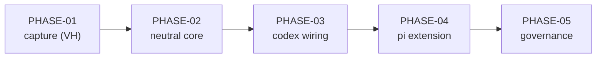

# Implementation Plan SL-263: Ambient memory surfacing for pi and codex

Prose companion to `plan.toml`. Narrative only — no queried data lives here
(the storage rule); the phase list, criteria, verification, and links are
authored in the TOML. Use this for the plan's rationale and sequencing.
<!-- Cite entities by padded id (SL-020, REQ-059); phases as PHASE-01,
     criteria as EN-1/EX-1/VT-1/VA-1/VH-1. See glossary.md § reference forms. -->

## Overview

The design (`design.md`, locked at rev 41) ports `memory surface` from Claude to
codex and pi behind a doctrine-owned neutral request, so the pipeline
(`admits`/`dedup_diff`/`cap`/`format_block`) is composed once and the neutral
core never learns a harness tool name. Five phases deliver it:

1. **PHASE-01 — Captured codex wire fixtures.** The one thing that cannot be
   reasoned out: three real codex `PreToolUse` payloads, captured live, checked
   in. It retires `A-1`/`R-8`, and it is deliberately first because the codec VTs
   are worthless against payloads we authored ourselves.
2. **PHASE-02 — Neutral surface command and engine arity.** `ScopeProbe`'s path
   arm widens to a set; `memory surface` gains the three codecs, the anchor
   resolver, the `apply_patch` reader, `--input`/`--format`, and the `wire`
   tuning field. This is the slice's centre of gravity.
3. **PHASE-03 — codex PreToolUse wiring.** The `codex_hook_specs` registry with
   handler-level `additionalContextLimit`/`timeout`, the extended canonicality
   check, and the Claude canonical-form upgrade.
4. **PHASE-04 — Generated pi surface extension.** `templates/surface.ts` and its
   install triad, bounded and fail-open.
5. **PHASE-05 — Governance leg.** POL-003 from IDE-034, plus the PRD-004 and
   SPEC-011 revisions, drafted against the locked design and applied at
   reconcile.

## Sequencing & Rationale

- **Capture before the codec.** `PHASE-01` exists because the design's `A-1` is a
  documented-not-observed wire. Its three fixture payloads are what make
  `PHASE-02`'s codec tests evidence rather than tautology. A confined dispatch
  worker cannot run it (no authenticated codex session), so it is an
  orchestrator/human (`VH`) step — the plan marks it so rather than letting a
  worker silently fabricate payloads. If no codex session is available the phase
  blocks and `PHASE-02` waits; the plan does not substitute synthetic fixtures,
  because that is exactly the tautology `A-1` names.
- **The core is one phase, not three.** The engine arity, the pure helpers and
  the command plumbing are coupled: widening `ScopeProbe`'s arm forces
  `probe_for`'s construction to change in the same edit, and a phase that added
  `SurfaceRequest`/`probe_for` without a caller would end red under
  `dead_code`/clippy. So `PHASE-02` lands the arity change, the resolution, the
  decode, the flags and the tests as one green unit — the repo's pure/imperative
  split still bounds it internally.
- **codex then pi, sequentially.** Both phases edit `RefreshReport` and the Codex
  arm's installer block, so they are not parallel-eligible; `PHASE-04`'s `EN-1`
  names the real dependency (`PHASE-03` complete). They stay separate phases for
  review size, not for concurrency.
- **Governance last, and only drafted.** DEC-284 fixes the order: the design
  locks first, then the rule is drafted against it, then applied at reconcile.
  `PHASE-05` therefore ends with `proposed`, unapproved revisions and a
  `governed_by POL-003` edge — approval and application are the user's act at
  reconcile, not a worker's.
- **Behaviour preservation is a phase exit, not an afterthought.** The existing
  memory/retrieve/boot suites are the proof that the widened probe and the new
  decode change no logic; `PHASE-02/EX-8` and `VA-1` name that explicitly.

## Notes

- **Node on the gate host.** `PHASE-04`'s two behavioural VTs (`VT-2`/`VT-3`)
  run the emitted handler under node, because a source-contains check passes on
  the broken sketches F-16/F-22 found. Node is present in this repo's dev env;
  `VA-1` records the host requirement so the tests run rather than skip.
- **The pi behavioural harness.** The generated `surface.ts` is a pi extension,
  not a standalone script; the inline boot.rs test stubs the `pi` global so the
  module can be imported and a `tool_result` driven. `VT-3`'s stub binary exits
  without reading stdin to exercise the EPIPE path. Both behavioural tests live
  inline in `src/boot.rs` beside the other installer tests, so the VT mandate
  resolves against an existing file.
- **What this plan does not cover.** Not Cursor (`IMP-245`), not subagent
  surfacing on either port (an accepted design delta), not promoting pi to a
  first-class boot `Harness` variant (an `OQ-4` follow-up). The governance leg's
  *application* lands at reconcile, not here.
- **Design-named symbols were re-grepped against the tree** at planning time
  (`probe_for`, `SurfaceInput`, `HookSpec`, `claude_hook_specs`,
  `entry_is_canonical`, `generate_pi_extension`, `MCP_EXT_TEMPLATE`,
  `RefreshReport`, `install_codex_hook`, `ScopeProbe`, `SESSION_MATCHERS_CODEX`);
  all resolve. `templates/surface.ts` does not yet exist, as the design intends.
