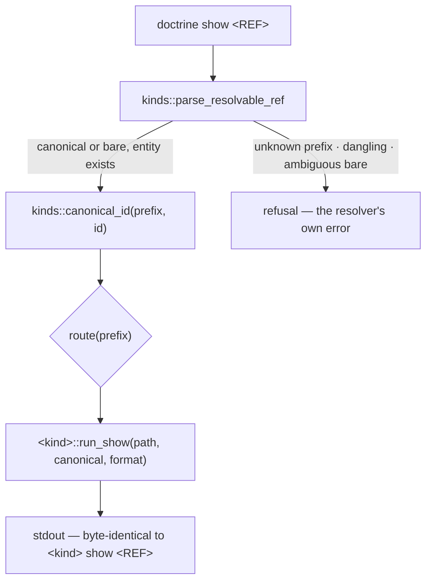
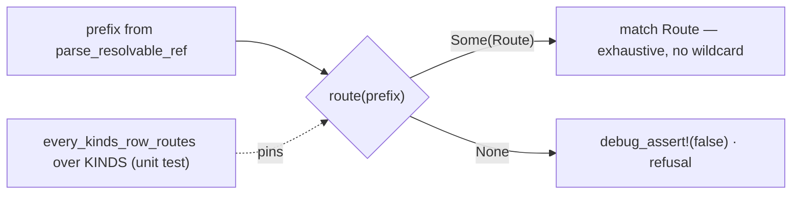

<!-- doctrine:section sec-1 -->
## What changes and why

Reading one entity costs a kind lookup the caller already has. Twelve
entity-kind commands own a `show` — `slice`, `spec`, `adr`, `policy`,
`standard`, `rfc`, `backlog`, `knowledge`, `review`, `rec`, `revision`,
`concept-map` — and they differ only in which module owns the renderer. (Three
non-entity commands — `memory`, `coverage`, `design` — also expose a `show`, and
are outside the numbered address space this slice routes: `DEC-296`.) The
canonical id already carries the kind: `SPEC-013` fixes the prefix as identity
for numbered kinds (`REQ-201`), so `DEC-031` names exactly one kind and
`doctrine knowledge show DEC-031` spells a fact the ref already stated.

The friction is on record. RFC-011's case-notes (`a2077b93d`) record a failed
call: `doctrine backlog show RFC-016` was rejected (`unknown backlog prefix
RFC`) because the cross-kind `search` listing renders `RFC-016` in the same
column as `IMP`/`ISS` rows and does not hint which `show` verb each id needs.

This slice adds one top-level, kind-blind verb:

```text
doctrine show RFC-031   ≡   doctrine rfc show RFC-031
```

The router resolves the ref to its kind and delegates to that kind's existing
`show`. Nothing about how a kind renders changes; the new verb is a surface over
the twelve that already exist.

**Boundary.** The change is confined to the command layer — a `Command::Show`
variant, a router under `src/commands/`, one exhaustive-match arm in `guard.rs`,
one `FAMILIES` entry, and a `SPEC-013` amendment. No kind's `show` implementation
is touched, no `--format` semantics change, no MCP tool is added.

**Why it is worth doing.** One predictable read verb for any id in hand, and the
RFC-011 failure dissolves at its source rather than being patched in `search`
output. The cost is a resolution and a call: no new renderer, no normalised
envelope, no per-kind content change.

The five decisions this rests on are `DEC-295`–`DEC-299` (from `inq-1`–`inq-5`).

<!-- doctrine:section sec-2 -->
## The router: resolve, canonicalise, delegate

### The contract

```text
kinds::parse_resolvable_ref(root, ref) -> (&'static KindRef, u32)
kinds::canonical_id(prefix, id)       -> String
<kind>::run_show(path, &canonical, format) -> Result<()>
```

Canonicalisation before delegation is required, though not for the reason a
blanket claim would give. Four of the twelve kinds' parsers reject a bare id
outright — `backlog`, `knowledge`, `spec` and `review`. The rest accept one
through `listing::parse_ref`'s fallback to the raw string, which then digit-parses
it (`slice adr policy rfc revision rec concept-map`). The router canonicalises for
every kind regardless, which is what makes `show 31` and `show SL-031` converge on
one call and keeps the four strict callees working.

`kinds::parse_resolvable_ref` (`src/kinds/resolve.rs`) is the resolution
authority: it accepts both `PREFIX-NNN` and bare `NNN`, verifies the entity
directory exists (a dangling ref is refused), and for a bare id scans every
`KINDS` row, refusing an ambiguous match by naming the candidate refs. The router
inherits that error contract unchanged (`DEC-297`).

The router accepts the 24 numbered prefixes in `kinds::KINDS` and nothing else
(`DEC-296`). `mem_…`/`mem.<key>`, SPEC-028 observation uids and design-run refs
are separate address spaces with their own verbs; including them would be a
second route with a different argument shape, not a table row.



*Purpose: the router resolves and delegates; it never renders.*

### Delegation shapes

The dispatch mirrors `catalog::scan::outbound_for`'s groupings, and covers all
24 `KINDS` rows.

| group | prefixes | call |
|---|---|---|
| singleton kinds | `SL` `RV` `REC` `REV` `CM` | `slice::run_show`; `review::run_show` then `print_review`; `rec::run_show`; `revision::run_show`; `concept_map::run_show(path, ref, format, false, false)` |
| governance spine | `ADR` `POL` `STD` **`RFC`** | `adr::run_show` / `policy::run_show` / `standard::run_show` / `rfc::run_show` — each a one-line wrapper over `governance::run_show(&Kind, …)` |
| spec pair | `PRD` `SPEC` | `spec::run_show(path, ref, format)` — the subtype is resolved inside by `resolve_spec_ref`, so the router passes none |
| requirement | `REQ` | `spec::run_req_show(path, ref, format)` |
| knowledge records | `ASM` `DEC` `QUE` `CON` `EVD` `HYP` `CPT` | `knowledge::run_show` via `knowledge::RecordKind::from_prefix` |
| backlog items | `ISS` `IMP` `CHR` `RSK` `IDE` | `backlog::run_show` via `backlog::kind_from_prefix` |

The router calls the **per-kind wrappers** (`adr::run_show`, `policy::run_show`,
`standard::run_show`, `rfc::run_show`) rather than `governance::run_show`
directly. `src/commands/` already imports those four modules (through `cli.rs`),
so the new file adds no top-level layering edge; reaching into `governance`
would add one (`RV-384` `F-8`).

Two deviations from the uniform `(path, ref, format)` shape are handled
explicitly rather than absorbed:

- `review::run_show` returns a `ReviewOutput` value; the kind's own dispatch
  prints it via `print_review`. The router calls the same two functions in the
  same order, so the bytes match.
- `concept_map::run_show` takes `edges: bool, nodes: bool` beyond the shared
  shape. The router passes both `false`, which is exactly the bare
  `doctrine concept-map show <REF>` it mirrors.

### The format shorthand

`CommonShowArgs` (`src/main.rs`) carries `--format` and the `--json` shorthand.
The shorthand is resolved inline at four call sites — `backlog.rs:290` (Show) and
`:298` (Inspect), `knowledge.rs:3879` (Show) and `:3887` (Inspect) — each
`if json { Format::Json } else { format }`. The router needs the same
resolution, and a fifth copy is precisely the drift this slice should not add.
One accessor — `CommonShowArgs::format()` — becomes the single home for the
shorthand; the router and all four existing sites use it. The kind `run_show`
implementations and their goldens are untouched.

<!-- doctrine:section sec-3 -->
## Totality: the route lookup and its guard

A `match prefix` over `&str` cannot be compiler-exhaustive. A wildcard is
unavoidable, and a wildcard is where a kind added later lands silently. The
design splits the guarantee into three parts, each enforced where it can be:

1. **Resolution is a pure, testable lookup.** `route(prefix) -> Option<Route>`
   names every `KINDS` row explicitly and falls through to `None` otherwise,
   mirroring `outbound_for`'s own fallthrough arm — including its
   `debug_assert!(false, "outbound_for: unrouted KINDS prefix `{other}`")`
   precedent — so a debug build that meets an unrouted prefix fails loudly
   instead of returning a quiet `None`.
2. **Handling is compiler-exhaustive.** `Route` is a closed enum —
   `Slice`, `Adr`, `Policy`, `Standard`, `Rfc`, `Spec`, `Req`,
   `Knowledge(RecordKind)`, `Backlog(ItemKind)`, `Review`, `Rec`, `Revision`,
   `ConceptMap` (13 variants over the 24 prefixes) — and dispatch is a
   `match route` with no wildcard, so a new variant cannot be left unhandled.
3. **Coverage is pinned by a unit test over the resolver's own table.**
   `every_kinds_row_routes` is a `#[cfg(test)]` unit test in
   `src/commands/show.rs` (it reaches `pub(crate)` `route()` and `KINDS`, which
   an integration test cannot — `RV-384` `F-5`). It iterates the **`KINDS`**
   table's prefixes — the table `parse_resolvable_ref` and `kind_by_prefix`
   resolve against — asserts every prefix yields `Some(_)`, and carries a
   negative control asserting a synthetic unrouted prefix returns `None`.

The iterated set is `KINDS`, not the sibling `ALL_KINDS` prefix literal
(`RV-384` `F-1`). A prefix reaches `route()` only through `kind_by_prefix`, which
scans `KINDS`; `ALL_KINDS` is a separate `&[&str]` with no structural tie to it,
so a test over `ALL_KINDS` would not notice a `KINDS` row that
`parse_resolvable_ref` resolves and `route()` does not.



*Purpose: resolution is observable and handling is compile-checked, so neither
half can drift alone.*

<!-- doctrine:section sec-4 -->
## The surface: clap, families, guard

- **`Command::Show`** flattens `CommonShowArgs` (`id`, `format`, `json`, `path`)
  — the struct whose own doc reads *"the prefix selects the kind"*. A leaf
  variant modelled on `Command::Search(SearchArgs)`.
- **`FAMILIES`** gains `show` in `explore`, the family that already holds the two
  other kind-blind top-level reads, `search` and `inspect`. `--help` and
  `--boot-map` render from `FAMILIES`, so the verb is discoverable without a
  second enumeration.
- **The census assertion** `families_partition_the_visible_command_tree`
  (`src/commands/cli.rs`) pins the visible top-level command count and that every
  visible command sits in exactly one family. Both are updated deliberately —
  56 → 57 — not relaxed (`R2`).
- **`guard.rs`** gains `Command::Show { .. }` in the combined leaf `Read` arm.
  That match is exhaustive with no wildcard, so the verb is a compile error until
  classified (`REQ-192 §3`); `show` is a read.
- **The `--json` shorthand** resolves through the new `CommonShowArgs::format()`
  accessor; the router does not restate the `json`-over-`format` rule.

The boot-map/help goldens pin member presence and the leaf-no-subline rule, not a
full member list; `show` is a leaf in an existing family and needs no golden
rewrite. The boot snapshot is regenerated (`doctrine boot`).

<!-- doctrine:section sec-5 -->
## The governance change is its own phase

`SPEC-013` owns the two-level `<kind> <verb>` grammar (`REQ-197`) and the
kind-blind **list** spine (`REQ-198`). `REQ-197` mandates that every numbered
entity kind present through the per-kind grammar, while *allowing* non-entity
capability containers to reuse it; it says nothing about a kind-blind top-level
verb. `REQ-198` is the list spine. A kind-blind **show** is therefore neither,
and takes a new requirement sibling to `REQ-198`. The governance dependency
routes through a Revision (`ADR-013`), and the precedent is `REV-038`, which
amended `SPEC-013`'s own member requirements.

This is a phase of its own, not a footnote to the code phase (`DEC-299`). Its
acts are discrete and separately verifiable:

1. **Author the `REV`.** A revision is born a skeleton (`doctrine revision new
   "<title>"`); `revision change add` appends **one** `[[change]]` row per
   invocation, so the introduce row is its own command:
   `doctrine revision change add REV-NNN --action introduce --new-label FR-006
   --member-of SPEC-013 --new-statement "…"` — the frozen label is `FR-006`, the
   next free functional label (`FR-001`–`FR-005` are taken). The `SPEC-013`
   § *Uniform command grammar* prose naming the router is **not** a typed row: a
   `modify` row takes a live peer FK, and prose rides the `revision-NNN.md`
   companion, which `ADR-013` surfaces for manual handling.
2. **Manual apply.** After `revision approve` and `revision apply` (which surface
   the introduce row for manual handling rather than landing it), `doctrine spec
   req add SPEC-013 --kind functional --label FR-006 --title …` mints the
   requirement. It lands **`pending`** (`src/requirement.rs`), and a pending
   requirement with no cells reads **`Coherent`** — not `Indeterminate`. The
   closure lever is the reconcile flip: an `active` requirement with no verified
   evidence is residual drift `REQ-113` refuses, so the evidence must exist
   before the flip.
3. **Record coverage, then verify it.** `doctrine coverage record --slice 265
   --requirement <new REQ> --change SL-265 --mode VT --command cargo --command
   test --command=--test --command e2e_show_equivalence --matcher-source stdout
   --matcher-pattern "<test name> \.\.\. ok" --regex` binds a runnable check.
   Without the check binding the cell is a bare attestation that merely *says*
   `VT`; with it, the cell is a recipe that leans `Planned` until re-derived. So
   the phase then runs `doctrine coverage verify 265`, and **the exit criterion
   is the cell reading `Verified`, not merely recorded** (`RV-384` `F-13`,
   `F-7`).

The phase is sequenced **after** the code phase, because the evidence it records
is the code phase's test. At reconcile the requirement flips `pending → active`
with its `Verified` cell already in hand.

The slice's authored deliverable (the `REV` entity and
`.doctrine/spec/tech/013/**`) has no `src/` selector and reports as `undeclared`
in slice conformance — expected, disposed `aligned`.

<!-- doctrine:section sec-6 -->
## Code impact

| path | intended change |
|---|---|
| `src/commands/cli.rs` | `Command::Show` variant + dispatch arm; `show` added to the `explore` family; census 56 → 57 |
| `src/commands/show.rs` (new) | the router: `Route`, `route()`, `run_show()`, and the `every_kinds_row_routes` unit test — command tier, no layering row |
| `src/commands/guard.rs` | `Command::Show { .. } => Read` in the combined leaf arm |
| `src/main.rs` | `CommonShowArgs::format()` accessor; the router's parse/`write_class` test |
| `src/backlog.rs`, `src/knowledge.rs` | call the accessor at all four `--json` sites instead of the inline shorthand (behaviour-preserving; `run_show` bodies untouched) |
| `tests/e2e_show_equivalence.rs` (new) | byte-equivalence per numbered prefix, both formats |
| `tests/e2e_show_refusals.rs` (new) | unknown prefix / dangling ref / ambiguous bare id |
| `.doctrine/spec/tech/013/**`, a new `REQ` | the grammar amendment (governance phase) |
| `.doctrine/revision/NNN/**` | the `REV` staging the introduce row and the prose companion (governance phase) |

The totality assertion is a **unit** test inside `src/commands/show.rs`, not an
integration test: `route()` and `KINDS` are `pub(crate)`, and `src/lib.rs`
exports no `kinds` items (`RV-384` `F-5`).

**Not touched:** any kind's `run_show` implementation; the `show` flag
declarations of the seven kinds that hand-declare them (`CommonShowArgs`
unification is a Follow-Up); the MCP tool list; `search` output.

Module home is `src/commands/show.rs` (command tier). `src/commands/mod.rs`
declares it with one `pub(crate) mod` line; `layering.toml` needs no new row. The
router imports `adr`/`policy`/`standard`/`rfc` and the other kind modules, all of
which `src/commands/cli.rs` already imports, so the home adds no top-level
layering edge (`RV-384` `F-8`).

<!-- doctrine:section sec-7 -->
## Verification

- **VT — byte-equivalence.** For one fixture entity of every numbered prefix,
  `doctrine show <REF>` emits stdout byte-identical to that kind's own `show`
  invocation, in both `--format table` and `--format json`. This is the slice's
  central property; the fidelity contract is only as good as the bytes. The
  reference command is the kind's own verb, and there is no `doctrine req show`:
  `REQ` compares against `doctrine spec req show`; `PRD`/`SPEC` against
  `doctrine spec show`; the seven record prefixes against `doctrine knowledge
  show`; the five backlog prefixes against `doctrine backlog show`; the rest
  against `doctrine <kind> show`.
- **VT — totality (unit).** `every_kinds_row_routes` asserts every `KINDS` row
  yields a routed arm, plus a negative control asserting a synthetic unrouted
  prefix returns `None`.
- **VT — refusals.** An unknown prefix, a dangling ref and an ambiguous bare id
  each fail with `kinds::parse_resolvable_ref`'s error, unchanged.
- **VT — the new requirement.** The governance phase records a check-bound
  coverage cell and re-derives it with `coverage verify 265`; the exit is the
  cell reading `Verified`.
- **VA — behaviours preserved.** Every existing `<kind> show` golden passes
  unchanged; no kind `run_show` was modified. The `write_class` parse test
  asserts `show` classifies `Read`.
- **VA — surface visible.** `doctrine show` appears in `explore` in `--help` and
  `--boot-map`; the census assertion is updated, not deleted.
- **VA — governance landed.** `SPEC-013` carries the new `REQ` with its frozen
  label, the `REV` carries the introduce row and the prose companion, and the
  coverage cell reads `Verified`.

The equivalence test needs one entity per prefix; the corpus supplies one (the
review checked every prefix has a fixture). The plan names them and the test
enumerates them by group.

<!-- doctrine:section sec-8 -->
## Risks and residuals

- **`R1` — layering.** The home is `src/commands/show.rs` because a new
  top-level module (`src/show.rs`) would need a `layering.toml` tier row and trip
  the gate's `Unclassified` finding, not because a new file under `commands/`
  grows the tangle. The command tangle is ratcheted per top-level module; the
  router's home adds no such edge, provided it calls the per-kind wrappers rather
  than `governance::run_show` directly (`RV-384` `F-8`).
- **`R2` — census churn.** The census assertion is updated 56 → 57 deliberately.
- **`R3` — `REQ`.** The one numbered prefix whose `show` is not `spec::run_show`;
  it takes its own arm onto `spec::run_req_show`.
- **`R4` — goldens.** Boot-map/help goldens pin member presence and the
  leaf-no-subline rule, not a full list; the boot snapshot is regenerated.
- **`A1` — every numbered prefix has a working `show` today.** The review probed
  every prefix; the totality unit test surfaces a counterexample if that stops
  holding.
- **Residual — `SPEC-013`'s existing members.** Its eight active requirements all
  read `Indeterminate` today (`coverage show SPEC-013`). Whether `REQ-113`'s
  closure gate scopes that drift to the whole member set or only the touched
  member is a plan/audit question; if it is the whole set, the slice must cover
  or REC-excuse them at close.
- **Residual — `CommonShowArgs` unification.** Seven kinds still hand-declare the
  `--format`/`--json`/`--path` triple. Collapsing them onto the flatten is a
  companion change (`REQ-199`'s precedent), deliberately not absorbed here.
- **Residual — `search` verb hint.** A column naming the `show` verb an id needs
  would prevent the RFC-011 failure at its source as well as dissolving it.
- **Residual — MCP parity.** No `doctrine_show` tool; the MCP surface is a
  hand-authored list and widening it is a separate decision.

