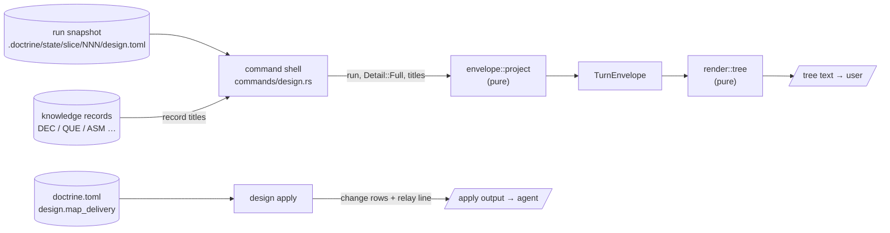
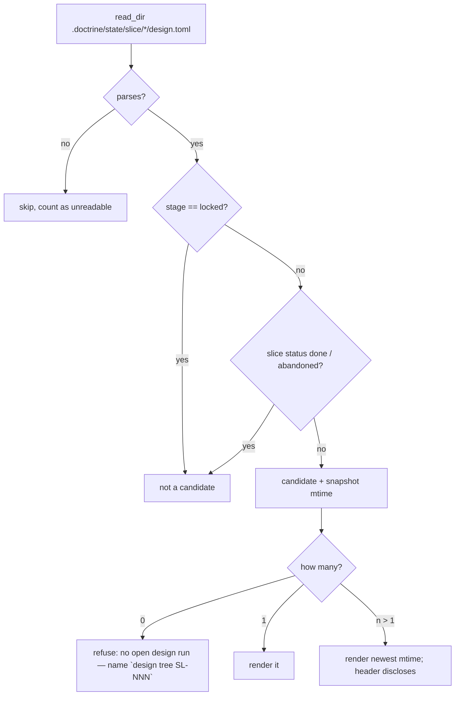

<!-- doctrine:section sec-1 -->
## What changes and why

A design run keeps an **inquiry map**: the tree of design questions the run is
working through, each open, resolved, deferred or pruned. PRD-019 commits to the
user being able to see that map — the active path, what is open, what is
blocked — without asking the agent to summarise. Today nothing delivers it
(ISS-299). The per-turn envelope shows a bounded frontier to the agent; the user
sees the map only if the agent spontaneously draws one from memory.

This slice adds three things:

1. **A tree view of the whole map** — `doctrine design tree [SL-NNN]`, and the
   same rendering as `doctrine design show SL-NNN --format tree`. One line per
   question: its state, who raised it, whether it blocks, and either the
   question or what answered it.
2. **A project choice of who shows it** — `[design] map_delivery` in
   `doctrine.toml`. `relay` (the default): after any `design apply` that changed
   the map, the apply output tells the agent to paste the tree to the user
   verbatim. `sidecar`: the user keeps `design tree` open in a spare pane, and
   the agent stays quiet.
3. **Prompt text that points at it** — the inquiry fragment names `design tree`
   as the user's view of the map, and the initial-concerns condition asks for its
   output instead of a hand-built listing.

**Boundary.** Nothing here changes what the run stores or what the agent's
ordinary per-turn prompt carries. The tree is a new *rendering* of the existing
read model (the turn envelope), projected at full detail. The relay line is a
new line on an existing write's output. The only new state is one config key.



Purpose: where each input enters and which layer is pure. The shell reads
everything impure (snapshot, record titles, config, terminal width) and hands
plain values to the pure projection and renderer (ADR-001; the house
pure/imperative split). The two output paths are independent: the tree is a
read, the relay line rides a write.

<!-- doctrine:section sec-2 -->
## The envelope carries the whole map at full detail

**Current.** `envelope::project(run, known_revision, detail, …)` builds a
`TurnEnvelope` fresh on every read from the run snapshot, then discards it after
rendering. It copies out bounded lists — frontier (≤ 7), active path (≤ 6),
blockers (≤ 5), change rows (≤ 10). `Detail::Full` lifts those caps, but even
at `Full` no list holds every node: the frontier is only open, unblocked,
non-cursor candidates. SPEC-029 REQ-433 makes this envelope the single read
model — every rendering is a projection of it and carries no field it does not —
so a tree cannot read the snapshot directly.

**Target** (DEC-303). At `Detail::Full` the envelope gains the whole map; at
`Detail::Normal` it is empty and is not rendered. The ordinary agent prompt
projects at `Normal`, so SL-233's "no full map every turn" holds by
construction.

```rust
// render/envelope.rs — the model section
pub(crate) struct MapNode {
  pub(crate) id: String,
  pub(crate) parent: Option<String>,
  pub(crate) question: String,
  pub(crate) lifecycle: &'static str,     // InquiryLifecycle::as_str
  pub(crate) provenance: &'static str,    // Provenance::label
  pub(crate) blocking: bool,              // effective judgement (SL-264 or legacy set)
  pub(crate) blocked_by: Vec<String>,     // derived: open/deferred `needs` targets
  pub(crate) answer: Option<MapAnswer>,   // resolved nodes only
}

pub(crate) enum MapAnswer {
  Record { form: &'static str, record: String, title: Option<String> },
  Note { form: &'static str, note: String },
}

pub(crate) struct TurnEnvelope {
  // … existing fields …
  /// Every inquiry node in creation order (`seq`). Filled at `Detail::Full`
  /// only; empty at `Normal`.
  #[serde(skip_serializing_if = "Vec::is_empty")]
  pub(crate) map: Vec<MapNode>,
}
```

- **Order.** Creation order (`seq`), the order the frontier already uses as its
  last tie-break. The renderer builds the tree from `parent`; siblings keep this
  order.
- **Blocked** is derived with the same predicate the frontier and blockers
  already use (open or deferred `needs` targets) — one derivation, not a second
  one (PRD-019 REQ-417).
- **Titles are an input.** The projection is pure and cannot read the corpus.
  `project` gains a `titles: &BTreeMap<String, String>` parameter (record id →
  title), filled by the shell only at `Full`, following the DEC-292 precedent of
  shell-observed `facts` and `slice_ref`. A cited record the shell could not
  read has no entry; the node carries `title: None` and the tree says
  `(title unavailable)` rather than silently omitting it (STD-003).
- **Cost.** `prompt --full` and `json --full` gain the map too: one line (or
  object) per node. PRD-019 REQ-424 allows the full view to scale; the budget
  check already skips `Full`.
- **Unchanged.** `status`, `resume`, the ordinary `prompt`, the eviction ladder
  and every `ENVELOPE_*` cap.

<!-- doctrine:section sec-3 -->
## The tree rendering

A new pure module, `render/tree.rs`, beside `envelope.rs`: a full `TurnEnvelope`
plus a `TreeStyle { width: usize, colour: bool }` in, `Vec<String>` out. It
reads only the envelope (SPEC-029 REQ-433) and owns no policy beyond layout.

**Shape** (DEC-306, DEC-308), shown on this run's own map:

```
SL-266 · drafting · rev 28 · 10 questions: 10 resolved, 0 open
├── ● a * inq-model        DEC-303 Full envelope carries the whole inquiry map
├── ● u * inq-surface      DEC-304 Tree read surface: --format tree plus
│   │                      design tree
│   └── ● u * inq-default-run  DEC-305 design tree resolves the latest open run
├── ● u * inq-render       DEC-306 Inquiry tree line anatomy
│   ├── ● a   inq-width        DEC-307 Inquiry tree wraps, never truncates
│   ├── ● a   inq-marks        DEC-308 Inquiry tree marks provenance, blocking,
│   │                          cursor and pin
│   └── ● a   inq-reasons      non-durable: Deferred to a backlog item: …
└── ● u * inq-delivery     DEC-309 doctrine.toml [design] map_delivery, default
    │                      relay
    ├── ● u * inq-config       DEC-309 doctrine.toml [design] map_delivery, …
    └── ● a * inq-relay        DEC-310 Relay instruction rides design apply output
● resolved ○ open ◌ blocked ◐ deferred ⊘ pruned · * blocking · u user a agent s shaping i imported
doctrine design tree SL-266
```

(`…` above abbreviates this example only; the renderer never truncates.)

**Line anatomy.** Tree guides, then:

| part | values |
|---|---|
| lifecycle mark | `●` resolved · `○` open · `◌` blocked (derived; replaces `○`) · `◐` deferred · `⊘` pruned |
| provenance letter | `u` user-directed · `a` agent-proposed · `s` shaping-question · `i` imported-prose |
| blocking | `*` when the effective judgement is blocking, else a space |
| label | node id |
| right-hand text | resolved + record → `REC-NNN <title>` (or `(title unavailable)`); resolved + note → `<form>: <note>`; blocked → `needs <ids>`; otherwise the question |
| suffix | `← cursor`, `← pinned`, or `← cursor, pinned` |

**Header.** Slice, stage, revision, then counts: `N questions: a resolved, b open`
plus `, c blocked`, `, d deferred`, `, e pruned` when non-zero. Counts only —
no word that certifies completeness (PRD-019 REQ-425). Under `design tree` with
no slice given, the header adds the resolution disclosure (sec-4).

**Footer.** The legend line, then the command that reproduces the view
(`doctrine design tree SL-NNN`) — so a verbatim relay teaches the user the
command with no agent effort (DEC-309).

**Wrapping** (DEC-307). Everything left of the right-hand text is the *prefix*;
its display width is measured with `unicode-width`. Right-hand text is filled
with `textwrap` to `width − prefix_width`; continuation lines repeat the
prefix's tree guides with the node's own columns blanked, so `│` rails continue.
If `width − prefix_width` falls below `TREE_MIN_TEXT_COLS` (24), the text moves to
the next line, indented under the label, and fills to `width − label_indent`. No
truncation anywhere.

**Colour** (only when `TreeStyle::colour`): marks by state (resolved green, open
cyan, blocked/deferred yellow, pruned red), provenance letter and resolved text
dimmed, cursor suffix bold. Without colour the output is plain text whose
meaning is complete — no state is carried by colour alone.

**Constants** (STD-001), private to `render/tree.rs`: each mark, each provenance
letter, `TREE_BLOCKING_MARK`, the suffix words, `TREE_MIN_TEXT_COLS = 24`, and
`TREE_PIPED_WIDTH = 100` (used by the shell when stdout is not a terminal).
The legend line is built from the same constants, so it cannot drift from the
marks.

<!-- doctrine:section sec-4 -->
## Command surface and run resolution

**`--format tree`** (DEC-304). `ShowFormat` gains `Tree`, documented as "the
whole inquiry map, for a human". The `run_show` match is wildcard-free by house
rule, so the new variant fails to compile until wired:

```rust
ShowFormat::Tree => emit(&tree::render(&tree_turn(&root, slice, &args)?, tree_style(args.color))),
```

`tree_turn` is `envelope_turn` with detail forced to `Full` and titles read.
Flag partition: `Tree` sits on the envelope side with `prompt`/`json`/`status`,
so `refuse_off_partition` already refuses `--json` and a non-default
`--knowledge`; `--full` is accepted and redundant; `--known-revision` is
accepted and has no visible effect on the tree.

**`design tree [SLICE]`**. A new `DesignCommand::Tree(TreeArgs)` with
`slice: Option<String>`, `-p/--path`, and the global `--color`. With a slice it
is exactly `show SLICE --format tree`. Its doc comment says the one difference:
only this verb makes the slice optional. `design show` keeps a required slice —
it is what agents call.

**Run resolution with no slice** (DEC-305), in the shell:



Purpose: the only branching logic the verb owns. Terminal status is
`lifecycle::is_transition_terminal` (`done` | `abandoned`); stage is
`snapshot::parse(...).run.stage`.

- **Disclosure** (STD-003). With more than one candidate the header line gains
  `(latest of N open runs)`; with one, `(the only open run)`. Unreadable
  snapshots are counted in that clause (`; 1 unreadable snapshot skipped`)
  rather than dropped silently.
- **Split.** Candidate *selection* is a pure function over
  `(slice, stage, slice_status, mtime)` tuples, unit-tested; the shell only
  gathers the tuples.

<!-- doctrine:section sec-5 -->
## Delivery: config, relay line, prompt text

**Config** (DEC-309). `DoctrineToml` gains `design: DesignConfig`
(`#[serde(default)]`), the per-area pattern `[dispatch]` and `[verification]`
already follow:

```rust
// design_run/config.rs (or beside DoctrineToml's other area configs)
#[derive(Debug, Default, Clone, Copy, PartialEq, Eq, Deserialize)]
#[serde(rename_all = "kebab-case")]
pub(crate) enum MapDelivery { #[default] Relay, Sidecar }

#[derive(Debug, Default, Deserialize)]
#[serde(deny_unknown_fields)]
pub(crate) struct DesignConfig {
  #[serde(default)]
  pub(crate) map_delivery: MapDelivery,
}
```

```toml
[design]
map_delivery = "sidecar"   # default "relay"
```

An unknown value fails `load_doctrine_toml` with serde's error, which names the
two variants — no fallback (STD-003).

**Relay line** (DEC-310). `ChangeEvent` gains `const fn is_map_event(self)`,
the one owner of "this row changed the map": `NodeCreated`, `NodeLifecycle`,
`NodeReparented`, `NodeBlockingChanged`, `NeedsAdded`, `NeedsRemoved`,
`CheckpointDisposed`. `applied_lines` — which already appends
`LOCK_ACCEPTANCE_DISCLOSURE` on a lock — takes the `MapDelivery` and, when it is
`Relay` and any applied row `is_map_event`, appends:

```
map changed — before ending this turn, show the user the output of `doctrine design tree SL-266` verbatim
```

- **When not.** `Sidecar`; an apply with no map rows; a `resumed submission`
  replay (nothing applied, and the original apply already said it).
- **Question rewording** emits no change row today, so it does not trigger a
  relay. Accepted: rewording is not a structural change, and the next
  structural change relays the current text anyway.
- `run_apply` reads the config once (`load_doctrine_toml(root)?.design`) and
  passes the value in; `applied_lines` stays free of I/O.

**Prompt text.**

- `install/design-prompts/inquiry.md`, *Craft*: one sentence, mode-neutral so
  the fragment digest does not depend on config — "The user's view of the map is
  `doctrine design tree`; when the run asks you to show it, paste that output,
  never a listing of your own."
- `install/design-prompts/conditions/initial-concerns-recorded.md`, *What is
  enough*: "Show the map as an indented tree … The map has no other viewer, so
  this listing is the user's view of it." becomes "Show the output of
  `doctrine design tree SL-NNN`: it marks the blocking questions and states any
  `needs` edges." The rest of the paragraph (the question, the single
  submission) is SL-264's text and stays as SL-264 lands it.

Editing either asset changes its digest, which re-stales discharges bound to the
old bytes — intended, and the reason these edits are made once, here.

<!-- doctrine:section sec-6 -->
## Code impact

| path | what changes |
|---|---|
| `src/design_run/render/envelope.rs` | `MapNode`, `MapAnswer`; `TurnEnvelope.map`; `assemble` fills it at `Detail::Full` from the snapshot, reusing the frontier's blocked predicate and `seq` order; `project`/`project_within` take `titles` |
| `src/design_run/render/tree.rs` | **new** — pure `render(envelope, TreeStyle) -> Vec<String>`; marks, legend, header/footer, wrapping; private `TREE_*` constants |
| `src/design_run/render/mod.rs` | `pub(crate) mod tree;` |
| `src/design_run/change_log.rs` | `ChangeEvent::is_map_event` |
| `src/design_run/config.rs` *(or the existing area-config home)* | `MapDelivery`, `DesignConfig` |
| `src/dtoml.rs` | `DoctrineToml.design` |
| `src/commands/design.rs` | `ShowFormat::Tree`; `DesignCommand::Tree(TreeArgs)`; `tree_turn` (Full + titles); `record_titles(root, &run)` via `knowledge::resolve_ref` + the record's TOML; run-resolution gather + pure select; `applied_lines` takes `MapDelivery`; `run_apply` reads config |
| `install/design-prompts/inquiry.md` | one mode-neutral sentence (sec-5) |
| `install/design-prompts/conditions/initial-concerns-recorded.md` | tree output replaces the hand-built listing (sec-5) |
| `install/design-payload-contract.md`, `src/design_run/payload_contract.rs` | only if the regenerated contract text changes; the apply payload itself does not |
| CLI help goldens / docs listing `design` verbs | the new verb and format value |

The design-target selectors this section commits to:
`src/design_run/render/**`, `src/design_run/change_log.rs`,
`src/design_run/config.rs`, `src/dtoml.rs`, `src/commands/design.rs`,
`install/design-prompts/inquiry.md`,
`install/design-prompts/conditions/initial-concerns-recorded.md`.

<!-- doctrine:section sec-7 -->
## Verification

Every row is a `VT` (by test) unless marked.

- **VT-1 — the map is Full-only.** `project` at `Normal` yields an empty `map`
  and `prompt`/`status` output is byte-identical to before; at `Full` `map` holds
  every node in `seq` order, with `blocked_by` equal to the frontier's derivation
  on the same fixture.
- **VT-2 — answers.** A created and an adopted disposition carry the record id
  and the supplied title; a missing title renders `(title unavailable)`; the two
  note forms carry their note.
- **VT-3 — tree anatomy.** A fixture map with one node in each lifecycle, a
  derived-blocked node, all four provenances, blocking and non-blocking, cursor,
  pin and cursor+pin renders to a golden: marks, letters, `*`, guides, suffixes,
  header counts, legend and footer.
- **VT-4 — header never certifies.** A fully resolved map's header contains
  counts and no completeness wording (asserted against a denylist such as
  `complete`, `done`).
- **VT-5 — wrapping.** A long title at width 80 wraps under its column with
  rails continued; at a width leaving < 24 columns the text drops to the next
  line; no line exceeds the width (measured with `unicode-width`); no `…`
  appears.
- **VT-6 — colour.** `colour: false` output contains no escape sequences;
  `colour: true` output with escapes stripped equals the plain output.
- **VT-7 — run selection.** The pure selector excludes locked stages and
  `done`/`abandoned` slices, picks the newest mtime among several, reports the
  candidate count, and returns none for an empty set.
- **VT-8 — CLI.** `design tree SL-N` equals `design show SL-N --format tree`;
  `design tree` with no slice renders the newest open run with the disclosure;
  with none open it refuses naming `design tree SL-NNN`; `--format tree --json`
  is refused.
- **VT-9 — relay line.** With default config, an apply creating a node ends with
  the relay line naming the slice; an apply discharging a step does not; a
  resumed replay does not; with `map_delivery = "sidecar"` no apply emits it; an
  unknown value fails config load naming both variants.
- **VT-10 — map-event ownership.** `is_map_event` is exhaustive over
  `ChangeEvent` (a match with no wildcard), so a new event must be classified.
- **VA-1 — prompt text.** `inquiry.md` and `initial-concerns-recorded.md` carry
  the sec-5 wording and no longer claim the map has no other viewer.

<!-- doctrine:section sec-8 -->
## Risks, residuals and deferred work

- **Sequencing on SL-264.** SL-264 (per-node `blocking`) edits
  `InquiryNode`, `initial-concerns-recorded.md` and the change log. It lands
  first; this design assumes its `blocking` field and its effective-judgement
  read, and edits only the listing sentence of the condition text.
- **Digest churn.** Editing two prompt assets re-stales discharges bound to
  their old digests in any live run. Intended and one-off.
- **`prompt --full` grows** by a line per node. Within PRD-019 REQ-424's
  full-view allowance; the ordinary prompt is unchanged.
- **mtime is a heuristic.** Any write to a run's snapshot (an apply in another
  session) moves the default to that run. Disclosure
  in the header is the mitigation; the slice argument is the override.
- **Question rewording does not relay** (no change row exists for it).
- **Deferred.** `design watch` live repaint — IMP-472. Reasons on
  pruned/deferred nodes — IMP-473. Changed-since-revision marks on the tree —
  a later increment (DEC-308). ISS-298 (`--full` and the change-log floor
  message) — separate.

