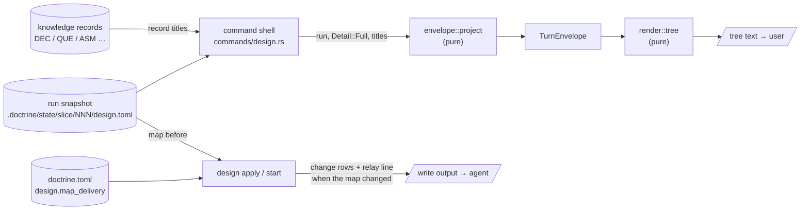
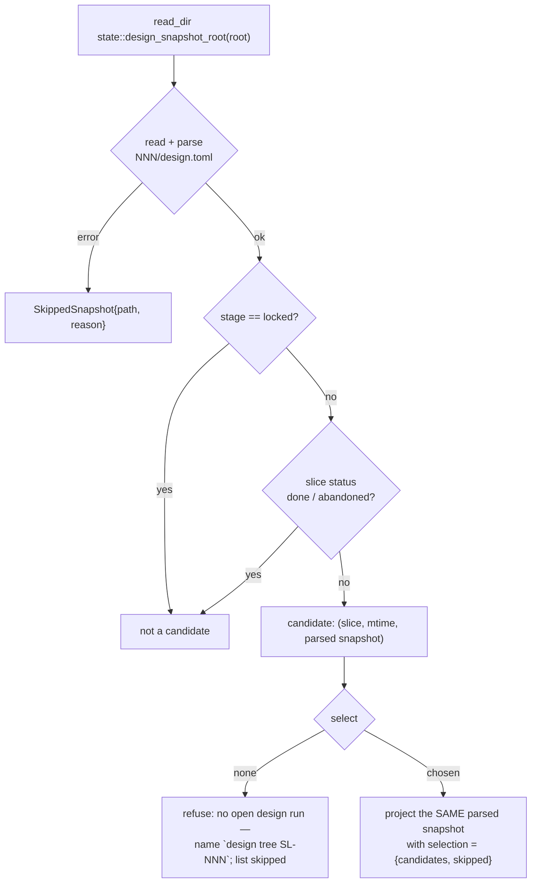

<!-- doctrine:section sec-1 -->
## What changes and why

A design run keeps an **inquiry map**: the tree of design questions the run is
working through, each open, resolved, deferred or pruned. PRD-019 commits to the
user being able to see that map — the active path, what is open, what is
blocked — without asking the agent to summarise. Today nothing delivers it
(ISS-299). The per-turn envelope shows a bounded frontier to the agent; the user
sees the map only if the agent spontaneously draws one from memory.

This slice adds three things:

1. **A tree view of the whole map** — `doctrine design tree [SL-NNN]`, and the
   same rendering as `doctrine design show SL-NNN --format tree`. One line per
   question: its state, who raised it, whether it blocks, and either the
   question or what answered it.
2. **A project choice of who shows it** — `[design] map_delivery` in
   `doctrine.toml`. `relay` (the default): after any write that changed the map
   (`design apply`, `design start --from-design`), its output tells the agent
   to paste the tree to the user verbatim. `sidecar`: the user keeps
   `design tree` open in a spare pane, and the agent stays quiet.
3. **Prompt text that points at it** — the inquiry fragment names `design tree`
   as the user's view of the map, and the initial-concerns condition asks for its
   output instead of a hand-built listing.

**Boundary.** Nothing here changes what the run stores or what the agent's
ordinary per-turn prompt carries. The tree is a new *rendering* of the existing
read model (the turn envelope), projected at full detail. The relay line is a
new line on an existing write's output. The only new state is one config key.



Purpose: where each input enters and which layer is pure. The shell reads
everything impure (snapshot, record titles, config, terminal width) and hands
plain values to the pure projection and renderer (ADR-001; the house
pure/imperative split). The two output paths are independent: the tree is a
read; the relay line rides a write, which compares the map before and after
itself (sec-5).

<!-- doctrine:section sec-2 -->
## The envelope carries the whole map at full detail

**Current.** `envelope::project(run, known_revision, detail, …)` builds a
`TurnEnvelope` fresh on every read from the run snapshot, then discards it after
rendering. It copies out bounded lists — frontier (≤ 7), active path (≤ 6),
blockers (≤ 5), change rows (≤ 10). `Detail::Full` lifts those caps, but even
at `Full` no list holds every node: the frontier is only open, unblocked,
non-cursor candidates. SPEC-029 REQ-433 makes this envelope the single read
model — every rendering is a projection of it and carries no field it does not —
so a tree cannot read the snapshot, the corpus or the command line directly.

**Target** (DEC-303). At `Detail::Full` the envelope gains the whole map; at
`Detail::Normal` it is empty and is not rendered. The ordinary agent prompt
projects at `Normal`, so SL-233's "no full map every turn" holds by
construction.

```rust
// render/envelope.rs — the model section
pub(crate) struct MapNode {
  pub(crate) id: String,
  pub(crate) parent: Option<String>,
  pub(crate) question: String,
  pub(crate) lifecycle: &'static str,     // InquiryLifecycle::as_str
  pub(crate) provenance: &'static str,    // Provenance::label
  pub(crate) blocking: bool,              // effective judgement (SL-264)
  pub(crate) blocked_by: Vec<String>,     // InquiryMap::unsettled_needs
  pub(crate) answer: Option<MapAnswer>,   // resolved nodes only
}

pub(crate) enum MapAnswer {
  Record { form: &'static str, record: String, title: TitleLookup },
  Note { form: &'static str, note: String },
}

/// What the shell found when it read a cited record's title.
pub(crate) enum TitleLookup {
  Found(String),
  NotFound,                 // no record at the resolved path
  Unreadable(String),       // read or parse error, verbatim
}

/// How `design tree` chose this run when no slice was given (sec-4).
pub(crate) struct RunSelection {
  pub(crate) candidates: usize,
  pub(crate) skipped: Vec<SkippedSnapshot>,
}
pub(crate) struct SkippedSnapshot { pub(crate) path: String, pub(crate) reason: String }

pub(crate) struct TurnEnvelope {
  // … existing fields …
  /// Every inquiry node in creation order (`seq`). `Detail::Full` only.
  #[serde(skip_serializing_if = "Vec::is_empty")]
  pub(crate) map: Vec<MapNode>,
  /// Present only when the shell resolved the run itself.
  #[serde(skip_serializing_if = "Option::is_none")]
  pub(crate) selection: Option<RunSelection>,
}
```

- **Order.** Creation order (`seq`), the order the frontier already uses as its
  last tie-break. The renderer builds the tree from `parent`; siblings keep this
  order.
- **Blocked** has one derivation. `InquiryMap` gains a pure
  `unsettled_needs(&self, id) -> Vec<&DesignId>` (the `needs` targets that are
  open or deferred); `is_blocked` becomes `!unsettled_needs(id).is_empty()`, and
  `blocked_by` is its output (PRD-019 REQ-417).
- **Shell inputs.** The projection is pure. `project` gains a
  `titles: &BTreeMap<String, TitleLookup>` (filled at `Full` only) and a
  `selection: Option<RunSelection>`, following the DEC-292 precedent of
  shell-observed `facts` and `slice_ref`. A title the shell could not read is
  carried with its cause, never collapsed to a blank (STD-003).
- **Renderings.** `json --full` carries `map` by serialisation. `prompt` builds
  its lines field by field (`envelope.rs:1448`), so it gains an explicit block,
  emitted only when `map` is non-empty — one line per node:

  ```
  map
    inq-relay parent=inq-delivery resolved agent-proposed blocking record=DEC-310 — In relay mode, where does the obligation live and what counts as a turn that changed the map?
    inq-x parent=- open user-directed needs-open=inq-y — Which cache key does the resolver use?
  ```

  `status` does not render `map`. The tree rendering is sec-3.
- **Cost.** `prompt --full` grows by one line per node. PRD-019 REQ-424 allows
  the full view to scale; the budget check already skips `Full`.
- **Unchanged.** `status`, `resume`, the ordinary `prompt`, the eviction ladder
  and every `ENVELOPE_*` cap.

<!-- doctrine:section sec-3 -->
## The tree rendering

A new pure module, `render/tree.rs`, beside `envelope.rs`: a full `TurnEnvelope`
plus a `TreeStyle` in, `Vec<String>` out. It reads only the envelope (SPEC-029
REQ-433) and owns no policy beyond layout.

```rust
pub(crate) struct TreeStyle {
  /// Terminal width, or `None` when stdout is not a terminal; the renderer
  /// applies its own `TREE_PIPED_WIDTH` fallback.
  pub(crate) width: Option<u16>,
  pub(crate) colour: bool,
}
```

**Shape** (DEC-306, DEC-308), shown on this run's own map:

```
SL-266 · drafting · rev 28 · 10 questions: 10 resolved, 0 open
├── ● a * inq-model        DEC-303 Full envelope carries the whole inquiry map
├── ● u * inq-surface      DEC-304 Tree read surface: --format tree plus
│   │                      design tree
│   └── ● u * inq-default-run  DEC-305 design tree resolves the latest open run
├── ● u * inq-render       DEC-306 Inquiry tree line anatomy
│   ├── ● a   inq-width        DEC-307 Inquiry tree wraps, never truncates
│   ├── ● a   inq-marks        DEC-308 Inquiry tree marks provenance, blocking,
│   │                          cursor and pin
│   └── ● a   inq-reasons      non-durable: Deferred to a backlog item: …
└── ● u * inq-delivery     DEC-309 doctrine.toml [design] map_delivery, default
    │                      relay
    ├── ● u * inq-config       DEC-309 doctrine.toml [design] map_delivery, …
    └── ● a * inq-relay        DEC-310 Relay instruction rides design apply output
● resolved ○ open ◌ blocked ◐ deferred ⊘ pruned · * blocking · u user a agent
s shaping i imported
doctrine design tree SL-266
```

(`…` above abbreviates this example only; the renderer never truncates.)

**Line anatomy.** Tree guides, then:

| part | values |
|---|---|
| lifecycle mark | `●` resolved · `○` open · `◌` blocked (derived; replaces `○`) · `◐` deferred · `⊘` pruned |
| provenance letter | `u` user-directed · `a` agent-proposed · `s` shaping-question · `i` imported-prose |
| blocking | `*` when the effective judgement is blocking, else a space |
| label | node id |
| right-hand text | resolved + record → `REC-NNN <title>`, or `REC-NNN (record not found)`, or `REC-NNN (unreadable: <reason>)`; resolved + note → `<form>: <note>`; blocked → `needs <ids>: <question>` (blockers first, so they survive wrapping); otherwise the question |
| suffix | `← cursor`, `← pinned`, `← cursor, pinned`; when `run.cursor_stale`, `← cursor (moved up: declared cursor is settled)` |

**Header.** Slice, stage, revision, then counts: `N questions: a resolved, b open`
plus `, c blocked`, `, d deferred`, `, e pruned` when non-zero. Counts only —
no word that certifies completeness (PRD-019 REQ-425). When
`envelope.selection` is present, a second header line discloses it:
`chosen: newest of N runs open when scanned` (or `the only run open when
scanned`), then one line per
skipped snapshot, `skipped <path>: <reason>` (STD-003).

**Footer.** The legend, then the command that reproduces the view
(`doctrine design tree SL-NNN`) — so a verbatim relay teaches the user the
command with no agent effort (DEC-309).

**Placement.** Roots are nodes with no parent. The walk records visited ids; a
node whose parent is absent, or that a parent cycle keeps unreachable, is
rendered after the tree under `unplaced (parent missing or cyclic):`, flat,
with its parent id. The number of rendered nodes always equals the header's
count. (Admission refuses cycles and unknown parents; only a hand-edited
runtime snapshot can reach this.)

**Wrapping and overflow** (DEC-307). Width is `style.width`, else
`TREE_PIPED_WIDTH` (100), measured with `unicode-width`. Every line is one of
two kinds:

- a **node line**: a *prefix* (guides, marks, id), then right-hand text —
  placed or `unplaced`;
- a **free line**: the header and its `chosen:` / `skipped` lines, the
  `unplaced` heading, the legend, the footer.

1. Node text fills to `width − prefix` with `textwrap`; continuation lines
   repeat the ancestors' rails and blank the node's own columns.
2. If `width − prefix < TREE_MIN_TEXT_COLS` (24), node text starts on the next
   line at a fixed indent of `TREE_DROP_INDENT` (8 columns, rails not drawn)
   and fills to `width − 8`.
3. Free lines fill to `width`; the legend breaks only between entries.
4. Words are never split (`break_words: false`) and the prefix is never
   broken. A prefix, or one word (a long id, a path, the footer command),
   wider than the space it has overflows; nothing is dropped.

So the guarantee is: no text is truncated, and a line exceeds `width` only when
it holds a single unbreakable item — a prefix or a word — wider than the space
available.

**Colour** (only when `style.colour`): marks by state (resolved green, open
cyan, blocked/deferred yellow, pruned red), provenance letter and resolved text
dimmed, cursor suffix bold. Plain output carries the full meaning — no state is
colour-only.

**Constants** (STD-001), private to `render/tree.rs`: each mark, provenance
letter and suffix; `TREE_BLOCKING_MARK`; `TREE_MIN_TEXT_COLS`;
`TREE_DROP_INDENT`; `TREE_PIPED_WIDTH`. The legend is built from the same
constants.

<!-- doctrine:section sec-4 -->
## Command surface and run resolution

**`--format tree`** (DEC-304). `ShowFormat` gains `Tree`, documented as "the
whole inquiry map, for a human". The `run_show` match is wildcard-free by house
rule, so the new variant fails to compile until wired. Flag partition: `Tree`
sits on the envelope side with `prompt`/`json`/`status`, so
`refuse_off_partition` already refuses `--json` and a non-default
`--knowledge`; `--full` is accepted and redundant; `--known-revision` is
accepted and has no visible effect on the tree.

**`design tree [SLICE]`**. A new `DesignCommand::Tree(TreeArgs)` with
`slice: Option<String>` and `-p/--path`. With a slice it is exactly
`show SLICE --format tree`. Its doc comment states the one difference: only this
verb makes the slice optional. `design show` keeps a required slice — it is
what agents call.

**Colour.** `--color` is global and resolved once in `main.rs:271`, but
`cli.rs:1952` calls `design::dispatch(command)` without it. `design::dispatch`
gains the resolved `color: bool`, as `observation::dispatch` already takes it,
and both tree paths pass it into `TreeStyle`. Width comes from
`tty::stdout_terminal_width()`.

**Run resolution with no slice** (DEC-305), in the shell:



Purpose: the only branching logic the verb owns, and where the shell reads.

- **One read.** The parsed snapshot that won selection is the one projected —
  no second read — so the rendered run is the one whose stage was checked.
  Slice status is read once, during the scan, so the `chosen:` line claims
  only what was true then — *open when scanned*. A slice closed after that
  read is rendered as it was; the next invocation re-scans.
- **Selection** is a pure function over `(slice, stage, slice_status, mtime)`:
  newest `mtime` wins; equal `mtime` → higher slice number. Unit-tested.
- **Skipped snapshots** carry path and the verbatim read or parse error into
  `RunSelection.skipped`, rendered by sec-3, and are listed in the no-candidate
  refusal too (STD-003).
- **The scan root** is a new `state::design_snapshot_root(root)`, which
  `design_snapshot_path` then joins onto, so `STATE_SLICE_DIR` stays
  single-sourced (STD-001).
- Terminal status is `lifecycle::is_transition_terminal`.

<!-- doctrine:section sec-5 -->
## Delivery: config, relay line, prompt text

**Config** (DEC-309). `DoctrineToml` gains `design: DesignConfig`
(`#[serde(default)]`), the per-area pattern `[dispatch]` and `[verification]`
already follow:

```rust
/// `[design]` as the shared parse reads it: raw text, never validated there.
#[derive(Debug, Default, Deserialize)]
pub(crate) struct DesignConfig {
  #[serde(default)]
  pub(crate) map_delivery: Option<String>,
}

#[derive(Debug, Default, Clone, Copy, PartialEq, Eq)]
pub(crate) enum MapDelivery { #[default] Relay, Sidecar }

impl DesignConfig {
  /// The one resolver, called only by the design writes. Absent → `Relay`;
  /// anything but `MAP_DELIVERY_RELAY` / `MAP_DELIVERY_SIDECAR` → an error
  /// naming both.
  pub(crate) fn map_delivery(&self) -> anyhow::Result<MapDelivery>;
}
```

```toml
[design]
map_delivery = "sidecar"   # default "relay"
```

Validation is lazy, following the `[estimation]` precedent in `dtoml::parse`
(`dtoml.rs:52-59`): `load_doctrine_toml` is shared by review, slice, spec,
install and dispatch commands, so it only reads the text, and a bad display
preference never fails an unrelated command. `design apply` and
`design start` resolve the value before writing; an unknown value refuses
them, naming both values — no fallback (STD-003). The two spellings are
constants beside the enum (STD-001).

**When the map changed.** The trigger compares state, not rows: a write changed
the map when `prior.map.inquiry != next.map.inquiry` (`InquiryMap` derives
`PartialEq`). This catches every mutation — creation, lifecycle, reparenting,
`needs` edges, SL-264's blocking flip, checkpoint resolution, and question
rewording, which emits no change row (`run.rs:1451-1458`). Traversal (cursor,
pin, posture) lives outside `InquiryMap` and does not count. One pure function,
`design_run::map_changed(prior, next) -> bool`, owns the rule.

**Relay line** (DEC-310). When `map_delivery` is `Relay` and `map_changed`
holds, the command's last line of output is:

```
map changed — before ending this turn, show the user the output of `doctrine design tree SL-266` verbatim
```

Emitted by every write that can change the map, as the last line the command
prints — appended after any other output the command adds:

| path | output function |
|---|---|
| `design apply` | `applied_lines` (beside `LOCK_ACCEPTANCE_DISCLOSURE`) |
| `design start --from-design` | the start report (prior map is empty) |

`design adopt` is not a map write: it re-seats sections from the document
(`run.rs` `adopt`) and never touches `InquiryMap`, so `map_changed` cannot hold
for it and it carries no relay line. `materialise` likewise writes only the
document and its watermark.

Not emitted: `Sidecar`; no map change; a `resumed submission` replay. The shell reads the config once per command
(`load_doctrine_toml(root)?.design.map_delivery()?`) and passes the value to these pure line
builders.

**Prompt text** — both edits mode-neutral, so neither asset's digest depends on
config and neither orders a paste in sidecar mode:

- `install/design-prompts/inquiry.md`, *Craft*: "The user's view of the map is
  `doctrine design tree`. When a write tells you to show it, paste that output;
  never substitute a listing of your own."
- `install/design-prompts/conditions/initial-concerns-recorded.md`, *What is
  enough*: "Show the map as an indented tree … The map has no other viewer, so
  this listing is the user's view of it." becomes "The user reviews the map as
  `doctrine design tree SL-NNN` renders it — it marks the blocking questions and
  states any `needs` edges. Do not draw your own listing." In relay mode the
  apply that created the nodes has already put the tree in front of them; in
  sidecar mode they are watching it. The rest of the paragraph is SL-264's
  text and stays as SL-264 lands it.

Editing either asset changes its digest and re-stales discharges bound to the
old bytes — intended, and the reason these edits are made once, here.

<!-- doctrine:section sec-6 -->
## Code impact

| path | what changes |
|---|---|
| `src/design_run/render/envelope.rs` | `MapNode`, `MapAnswer`, `TitleLookup`, `RunSelection`, `SkippedSnapshot`; `TurnEnvelope.map` / `.selection`; `assemble` fills `map` at `Full` in `seq` order; `project`/`project_within` take `titles` and `selection`; `prompt()` gains the Full-only `map` block |
| `src/design_run/render/tree.rs` | **new** — pure `render(&TurnEnvelope, TreeStyle) -> Vec<String>`; marks, legend, header/selection/footer, placement with unplaced section, wrapping and overflow; private `TREE_*` constants |
| `src/design_run/render/mod.rs` | `pub(crate) mod tree;` |
| `src/design_run/inquiry.rs` | `InquiryMap::unsettled_needs`; `is_blocked` delegates to it |
| `src/design_run/mod.rs` (or `run.rs`) | pure `map_changed(prior, next)` |
| `src/design_run/config.rs` *(or the existing area-config home)* | `DesignConfig` (raw text), `MapDelivery`, the `map_delivery()` resolver and its two spelling constants |
| `src/dtoml.rs` | `DoctrineToml.design` |
| `src/state.rs` | `design_snapshot_root`; `design_snapshot_path` joins onto it |
| `src/commands/cli.rs` | pass the resolved colour to `design::dispatch` |
| `src/commands/design.rs` | `dispatch(command, color)`; `ShowFormat::Tree`; `DesignCommand::Tree(TreeArgs)`; tree projection at `Full` with titles; `record_titles(root, &run) -> BTreeMap<String, TitleLookup>` via `knowledge::resolve_ref` + the record's TOML; run scan + pure `select_run`; relay line, last, in `applied_lines` and the start report; config read in `run_apply` and `run_start` |
| `install/design-prompts/inquiry.md` | one mode-neutral sentence (sec-5) |
| `install/design-prompts/conditions/initial-concerns-recorded.md` | tree output replaces the hand-built listing (sec-5) |
| CLI help goldens / docs listing `design` verbs | the new verb and format value |

The design-target selectors this section commits to:
`src/design_run/render/**`, `src/design_run/inquiry.rs`,
`src/design_run/mod.rs`, `src/design_run/run.rs`, `src/design_run/config.rs`,
`src/dtoml.rs`, `src/state.rs`, `src/commands/cli.rs`,
`src/commands/design.rs`, `install/design-prompts/inquiry.md`,
`install/design-prompts/conditions/initial-concerns-recorded.md`.

<!-- doctrine:section sec-7 -->
## Verification

Every row is a `VT` (by test) unless marked.

- **VT-1 — the map is Full-only.** At `Normal`, `map` is empty and `prompt` and
  `status` output is byte-identical to before. At `Full`, `map` holds every node
  in `seq` order, and `prompt --full` renders one `map` line per node.
- **VT-2 — one blocked derivation.** On a fixture with open, deferred, resolved
  and pruned `needs` targets, `unsettled_needs(id)` returns exactly the open and
  deferred ones, `is_blocked(id)` equals its non-emptiness for every node, and
  `MapNode.blocked_by` equals it.
- **VT-3 — answers and titles.** Created and adopted dispositions carry the
  record id; `Found`, `NotFound` and `Unreadable(reason)` each render their own
  text, including for a non-DEC record (an adopted QUE); both note forms carry
  their note.
- **VT-4 — tree anatomy.** A fixture with one node per lifecycle, a
  derived-blocked node, all four provenances, blocking and non-blocking, cursor,
  pin, cursor+pin and a stale cursor renders to a golden: marks, letters, `*`,
  guides, suffixes, header counts, legend and footer; the derived-blocked
  node shows both its blocking ids and its question.
- **VT-5 — header never certifies.** A fully resolved map's header holds counts
  and none of a completeness denylist (`complete`, `done`).
- **VT-6 — placement.** A snapshot with an absent parent and one with a parent
  cycle both render every node (the stray ones under `unplaced`), terminate, and
  rendered-node count equals the header count.
- **VT-7 — wrapping and overflow.** At width 80 a long title wraps under its
  column with rails continued; below 24 free columns text drops to the 8-column
  indent; at depth 12 on width 40 the prefix overflows but no text is lost; a
  wide-Unicode (CJK) label measures correctly; the legend wraps between entries;
  at width 16 the header, `chosen:` and `skipped` lines wrap between words.
  Every line longer than the width holds a single prefix or word wider than its
  space; no `…` appears.
- **VT-8 — colour.** `colour: false` output has no escape sequences;
  `colour: true` output with escapes stripped equals the plain output.
- **VT-9 — run selection (pure).** Excludes locked stages and `done`/`abandoned`
  slices; picks newest mtime; breaks an mtime tie by higher slice number;
  reports candidate count; empty set → none.
- **VT-10 — CLI.** `design tree SL-N` equals `design show SL-N --format tree`;
  `design tree` alone renders the newest open run with the `chosen: … open
  when scanned` line; a
  malformed snapshot present in the state tier is listed as `skipped <path>:
  <reason>`; none open → refusal naming `design tree SL-NNN`;
  `--format tree --json` is refused; `--color always` emits escapes and
  `--color never` does not, on both entry paths.
- **VT-11 — map_changed.** A table over mutation kinds — create, lifecycle,
  reparent, needs add, needs remove, blocking flip, reword, checkpoint resolve —
  each yields `true`; a step discharge, a traversal-only change, an
  acceptance-only act and an identical redeclaration each yield `false`.
- **VT-12 — relay line.** Default config: an apply creating a node ends with the
  relay line naming the slice, as its last line; a step-discharge apply does
  not; a resumed replay does not; a written adopt does not;
  `start --from-design` with imported nodes does, as its last line. With
  `map_delivery = "sidecar"` none do. An unknown value refuses `design apply`
  and `design start` before writing, naming both values, while an unrelated
  reader of the same `doctrine.toml` (the `[conduct]` load) still succeeds.
- **VA-1 — prompt text.** `inquiry.md` and `initial-concerns-recorded.md` carry
  the sec-5 wording; neither claims the map has no other viewer, and neither
  instructs a paste unconditionally.

<!-- doctrine:section sec-8 -->
## Risks, residuals and deferred work

- **Sequencing on SL-264.** SL-264 (per-node `blocking`) edits `InquiryNode`,
  `initial-concerns-recorded.md` and the change log. It lands first; this
  design assumes its `blocking` field and effective-judgement read, and edits
  only the listing sentence of the condition text.
- **Digest churn.** Editing two prompt assets re-stales discharges bound to
  their old digests in any live run. Intended and one-off.
- **`prompt --full` grows** by a line per node. Within PRD-019 REQ-424's
  full-view allowance; the ordinary prompt is unchanged.
- **mtime is a heuristic.** Any write to another run's snapshot moves the
  default to that run. The `chosen:` disclosure is the mitigation; the slice
  argument is the override.
- **Eager config parse elsewhere.** `[dispatch]`'s closed
  `preferred_subprocess_harness` enum still fails every `doctrine.toml` reader
  on a bad value. `[design]` follows the lazy `[estimation]` pattern instead;
  aligning `[dispatch]` is outside this slice.
- **Deferred.** `design watch` live repaint — IMP-472. Reasons on
  pruned/deferred nodes — IMP-473. Changed-since-revision marks on the tree —
  a later increment (DEC-308). ISS-298 (`--full` and the change-log floor
  message) — separate.

