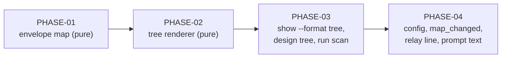

# Implementation Plan SL-266: Inquiry map tree view

Prose companion to `plan.toml`. Narrative only — no queried data lives here
(the storage rule); the phase list, criteria, verification, and links are
authored in the TOML. Use this for the plan's rationale and sequencing.
<!-- Cite entities by padded id (SL-020, REQ-059); phases as PHASE-01,
     criteria as EN-1/EX-1/VT-1/VA-1/VH-1. See glossary.md § reference forms. -->

## Overview

Four phases follow the design's dependency order: model, renderer, command
surface, delivery. Each ends green and leaves the tool usable — PHASE-01 and
PHASE-02 add pure code with no user-visible change; PHASE-03 ships the read
surface (`design tree`); PHASE-04 turns delivery on.

## Sequencing & Rationale

- **PHASE-01 first** because SPEC-029 REQ-433 makes the envelope the single
  read model: the renderer may read only what the envelope carries, so the
  fields must exist before anything renders them. It also settles the one
  blocked derivation (`unsettled_needs`) that both the envelope and the tree
  rely on. The `project` signature change has three call sites; they pass
  empty inputs until PHASE-03, and the existing goldens prove `Normal` output
  does not move.
- **PHASE-02 is pure and self-contained**: envelope in, lines out. It is the
  largest phase (anatomy, placement, wrapping, colour), and keeping it free of
  shell code lets every design VT for the view (VT-3 text, VT-4 to VT-8) be a
  unit test over hand-built envelopes.
- **PHASE-03 wires the shell**: titles, colour, the snapshot scan and the pure
  selector. Ending here gives a usable `design tree` even if delivery slipped.
- **PHASE-04 last** because the relay line names `doctrine design tree`,
  which must exist first, and because editing the two prompt assets re-stales
  discharges bound to their digests in live runs — best done once, at the end.

Serial, not parallel: PHASE-02 and PHASE-04 are file-disjoint and could run
side by side, but PHASE-04's end-to-end relay tests call `design tree`, so the
saving would be small and the merge risk real.

## Notes

- SL-264 landed its per-node `blocking` in code before this plan; PHASE-01
  reads its effective judgement and does not re-derive it.
- Design VTs map onto phase criteria as follows: VT-1..VT-3 → PHASE-01;
  VT-3 (text), VT-4..VT-8 → PHASE-02; VT-9, VT-10 → PHASE-03; VT-11, VT-12,
  VA-1 → PHASE-04.

