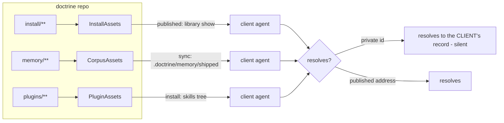
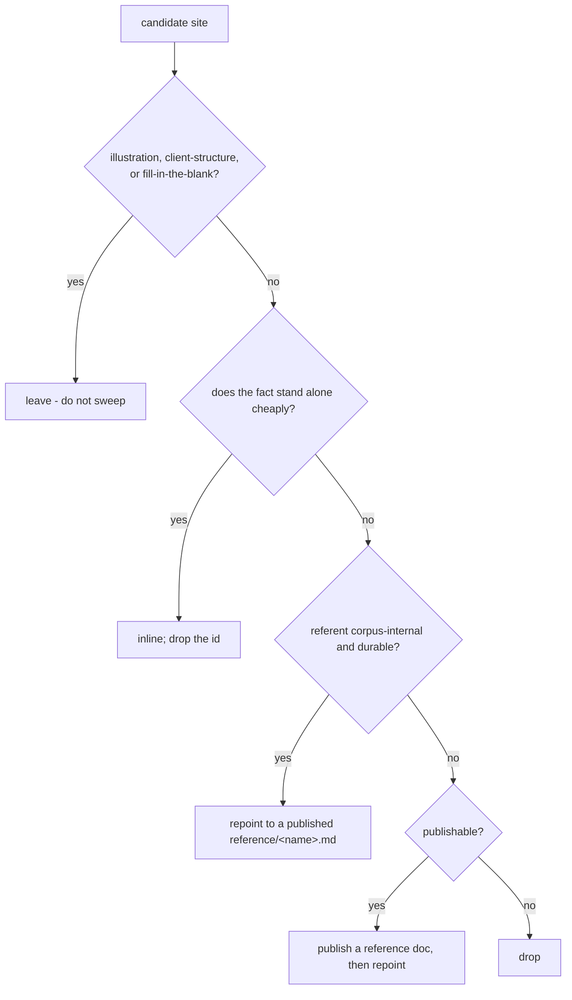

<!-- doctrine:section sec-1 -->
## What changes and why

Doctrine ships a corpus of prose and skills into every client repo: `install/`
(published reference docs, templates, design prompts, integration assets),
`memory/` (shipped orientation memories, materialised into
`.doctrine/memory/shipped/`), and `plugins/` (the skills). An agent working in a
client repo has none of doctrine's own corpus, so anything the shipped text
asserts about *this* repo is, for that reader, either unresolvable or — worse —
silently resolvable to the client's own record.

An audit (`ISS-309`, `CHR-080`, `IMP-484`) found the corpus fails that reader in
three separable ways:

1. **Citations a client cannot resolve.** 239 sites across the three sub-corpora
   cite doctrine's per-repo-sequential entity ids (`ADR-005`, `SL-233`) and
   repo-private paths (`src/relation.rs`, `install/<file>.md`). They do not
   dangle: a client repo mints its own `ADR-007`, so the citation resolves to the
   client's unrelated record, with no signal.
2. **Claims the CLI no longer supports.** The shipped knowledge signpost
   describes six kinds where the CLI mints seven, names wrong default statuses,
   omits `settle`, and its own syntax example would be refused; `glossary.md` has
   no `concept` row.
3. **Surfaces with no shipped orientation.** The corpus instructs actions it
   never documents — the sharpest being friction observation, which the shipped
   boot snapshot tells every agent to record while no shipped doc explains the
   ledger.

**Why one change and not three.** All three rest on one question — what may a
shipped claim be grounded on, and at which tier — so one answer settles them
(`DEC-311`). This slice fixes the corpus, delivers that rule as governance
(`DEC-312`), and leaves the machinery that would keep it fixed — a drift gate —
to a separate slice (`QUE-227`, `ISS-309` part 2).

**Boundary.** The change is to shipped prose and skills; it makes no semantic
change to `src/**`. The drift gate, the boot-index defect (`ISS-215`), distilling
project-local memories (`CHR-036`), and local-memory health are out of scope.

**Outcome.** A client agent reading any published reference doc, shipped memory,
or skill finds every citation either resolving to a published address or standing
without one, every CLI claim true of the binary, and every CLI surface it is told
to use documented at a reachable tier.
<!-- doctrine:section sec-2 -->
## Current state

Three sub-corpora, three delivery channels (`ADR-019`), each reaching a client
by a separate seam:

| sub-corpus | embed root | channel |
|---|---|---|
| `install/` | `InstallAssets` (`src/asset_source.rs`) | **published** — only `.gitignore`, `doctrine.toml`, `project-orientation.md` are projected; the rest is reached on demand via `publication/manifest.toml` and `doctrine library show reference/<name>.md` |
| `memory/` | `CorpusAssets` (`src/corpus.rs`) | **embedded + materialised** — `doctrine memory sync` writes `.doctrine/memory/shipped/` |
| `plugins/` | `PluginAssets` (`src/install.rs`) | **installed** — `install_skills_direct` materialises the skill tree |

The defect is structural, not textual: entity ids are per-repo sequential, so
`ADR-007` written in doctrine means a *different* record in every client.
`DEC-127` already generalised the rule for `install/` ("no shipped asset may cite
a repo-private artefact"); two tier-5 memories each cover one sub-corpus
(`mem.pattern.doctrine.shipped-skill-platform-independence`, `plugins/**`;
`mem.pattern.doctrine.shipped-master-body-scrub`, memory bodies). Neither reaches
`install/` reference docs or shipped memory prose.

Nothing checks it. `doctor`'s citation check scans `.doctrine/**/*.md` only;
`validate` reads entity ids and the relation graph; `publication validate` proves
a declared address has a backing; `prompt check` reads the hymn and agent-def
corpora. No scanner reads the three sub-corpora's prose, so `doctor` and `check`
stay green whether or not the corpus is fixed.

The ledger is enumerated site-by-site in `ISS-309`; the accuracy and sufficiency
axes in `CHR-080` and `IMP-484`. The defect recurred *during* the audit — a
concurrent edit added an `IMP-483` citation to `install/design-prompts/delegation.md`;
it was since landed fixed (`SL-264` `166f69a9f`), but the recurrence is the
strongest evidence that a written rule alone does not hold.
<!-- doctrine:section sec-3 -->
## Forces and constraints

**Binding:**

- `POL-002` — the shipped product must not load-bear on host-project conventions
  or state. Its prohibitions are mechanism-worded; a shipped *citation* is
  outside its text, so it is currently applied by interpretation. This slice's
  rule closes that gap at the governance level (`DEC-312`).
- `DEC-127` — accepted, user-decided: no shipped asset may cite a repo-private
  artefact. Already reaches `install/`; `ISS-309` is its sweep.
- `ADR-005` — shipped knowledge tiered by access pattern (PUSH / PULL-reference /
  skills); the operative test is **reachability, not presence**; a shipped doc
  must not duplicate `doctrine --help`; a skill may cite a rule by name but not
  restate mechanics.
- `ADR-019` — embedding, publication and projection are independent; a published
  asset's address is declared in `publication/manifest.toml`; projection is
  minimal.
- `ADR-023` — the grounding rule is instruction-bearing governance; it must be
  delivered through framework surfaces, not left in slice prose, and ADRs are the
  durable governance kind.
- `PRD-017` / `SPEC-026` — the stable logical address per published asset is the
  resolvable vocabulary a replacement citation may use.
- `PRD-003` / `PRD-006` / `SPEC-009` — the skills and install/projection
  mechanisms. `SPEC-009` is forward-intent; the slice rides the current reach
  model.

**Checked, not applicable:** `STD-001`, `STD-003` (scoped to `src/**`);
`STD-002` (entity naming — a citation can be conformant and still
client-unresolvable); `PRD-004`/`SPEC-007`; `PRD-002`/`SPEC-006`.

**Constraints the design must respect:**

- **No `src/**` change**, so the sweep cannot ride a new lint; the drift gate is
  the follow-up slice.
- **Do not mint a third POL-002 rule** (`QUE-227`); the duplicate rule is the gate
  slice's problem.
- **Do not sweep the illustrations** — reference-form tables, client-structure
  refs, fill-in-the-blank scaffolding
  (`mem.pattern.install.shipped-corpus-citation-illustrations`).
- **`tests/e2e_claude_install.rs`**
  (`design_prompts_have_no_consumer_outside_the_design_run`) scans `install/` and
  `plugins/` for the literal `design-prompts`; a shipped pointer naming the store
  trips it (`mem.fact.design-run.design-prompts-name-is-allowlisted`).
- **Three embeds, three rebuild paths**; `memory/` masters have no write verb
  (hand-edit + `cargo build` + `sync` + `install`); `plugins/` needs the
  embedding crate to recompile.
<!-- doctrine:section sec-4 -->
## Guiding principles

- **The reader is the test.** Evidence of conformance is a client agent with no
  doctrine corpus reading the post-sweep text and finding the replacement
  resolves.
- **The replacement resolving is the evidence; the id's absence is not.** A
  zero-hit grep proves the deletion ran and nothing more.
- **Do not sweep illustrations.** The distinction throughout is *citing the
  client's structure* versus *citing this repo's contents*.
- **Minimal publication.** A new published doc is added only where a claim
  genuinely needs a durable, reachable home; otherwise the fact is inlined.
- **One rule, one home.** The rule is recorded once, as an ADR; the corpus carries
  pointers, not restatements.
- **Ride the existing tier.** Delivered through boot/reference/skills per `ADR-005`
  and `ADR-023`; no new machinery.
<!-- doctrine:section sec-5 -->
## The grounding rule and its delivery

**The rule (`DEC-311`).** A shipped asset (`install/`, `memory/`, `plugins/`) may
ground a claim on either:

1. **prose that stands without a reference** — inline the fact; or
2. **a published logical address** — `reference/<name>.md`, resolvable in every
   client via `doctrine library show` (`ADR-019`, `PRD-017`).

A **repo-private entity id or file path is never permissible, at any tier.** A
widened vocabulary is rejected: any durable referent a client needs is either
inlined or published, so a third form adds syntax without adding reach.

**Disposition classes:**

| class | action |
|---|---|
| one-clause rationale | **inline** the fact; drop the id |
| corpus-internal, durable referent | **repoint** to a published `reference/<name>.md` (existing, or newly published) |
| client-structure reference / illustration | **leave** — it is the client's own structure, not a citation |
| reasoning with no shipped home | **publish** — mint a reference doc, then repoint |

**Decision procedure**, applied per site:

**The governance home (`DEC-312`).** A new ADR descending from `ADR-005` and
`ADR-019`, recording the rule and its rationale: *"Shipped-corpus grounding:
inline prose or a published address, never a repo-private id."* Authored in this
slice.

**Shipped delivery (`ADR-023`, `ADR-005`).** A new published reference doc,
`install/shipped-corpus-authoring.md` → `reference/shipped-corpus-authoring.md`,
states the rule and the disposition procedure. It is declared in
`publication/manifest.toml` and pointed at from the boot-tier reference-docs
register (`install/routing-process.md`) so it is reachable — a shipped doc nobody
points at is read by no one.

**Hard cases (`DEC-313`).**

- `install/design-prompts/inquiring.toml` cites `sketches/thin-adapter.md`
  (private, no client spelling) for two load-bearing runbook steps. The
  design-run obligation rationale is published as
  `install/design-run-obligations.md` → `reference/design-run-obligations.md`, and
  the runbook points at that published address.
- `install/doctrine.toml.example`'s per-knob ids: each id's "why" is inlined as a
  comment on the knob it explains.

**Why a new design-run doc, not an existing one (no parallel implementation).**
`reference/design-run-stages.md` is *generated* and golden-pinned to the gate
tables, so it cannot carry hand-authored rationale; the design-prompt fragments
are runtime runbooks, not reference prose. The thin-adapter reasoning is durable
design explanation, so `ADR-005`'s PULL tier wants a reference doc, and a new
`install/design-run-obligations.md` is the only home that forks neither a
generated asset nor a runbook.

**POL-002's textual gap is left unrevised, deliberately.** `POL-002`'s
prohibitions are mechanism-worded and do not literally reach a shipped *citation*;
the research notes it as a revision candidate. This slice does not revise it: the
new ADR (`DEC-312`) supplies the content-facet rule as a descendant, and editing
`POL-002` to restate that rule would duplicate the ADR and widen a policy whose
scope is intentionally mechanism-level. If the drift gate (`ISS-309` part 2)
finds the descendant rule insufficient, a `POL-002` revision is the escalation —
recorded here so the non-action is a judgement, not an omission.
<!-- doctrine:section sec-6 -->
## The sweep: three axes, three channels

**Axis A — citation conformance (`ISS-309`).** Walk the ledger site-by-site;
apply the disposition procedure; record each outcome. Excluded: the do-not-sweep
classes. The deliverable is not a diff but the reader's resolution.

**Axis B — accuracy (`CHR-080`).** Pair every behavioural claim with the artifact
that decides it — `doctrine <verb> --help` for shapes, live `list` output plus
`install/templates/*.toml` for vocabularies and defaults — and correct
mismatches. Two mechanical legs run first: dangling `[[mem.*]]` wikilinks; any id
whose prefix the CLI does not mint.

**Axis C — sufficiency (`IMP-484`).** Disposition every gap: the corpus-health
group (`doctor`, `validate`, `check`, `publication`), `observation`, the reports
group, `config`, the facets group, and `supersede`/`serve --mcp`/`worktree`. Each
gains shipped orientation at its `ADR-005` tier or an explicit justified
exclusion. Developer-only surfaces (`reseat`, `export`, `prompt`, `reservation`,
`verify`, `catalog`) are recorded out of scope. A signpost per verb is refused.

**Placement procedure for a dispositioned gap (`ADR-005` tier).** A gap gains
exactly one home, chosen by the tier that serves the reader:

| gap | destination |
|---|---|
| corpus-health group (`doctor`, `validate`, `check`, `publication`) | a section of a PULL reference doc, pointed-at from boot or a skill |
| `observation` | a shipped memory signpost (orientation) plus a reference section; the boot already instructs the action |
| reports group (`status`, `next`, `blockers`, `survey`, `explain`, `findings`) | a reference-doc section |
| `config`, the facets group | a reference-doc section |
| `supersede`, `serve --mcp`, `worktree` | extend the existing domain reference doc that owns the surface, else a section |
| developer-only (`reseat`, `export`, `prompt`, `reservation`, `verify`, `catalog`) | recorded out of scope, with the reason |

No new signpost per verb: a signpost is minted only where memory orientation is
the right tier, never as a table of contents for the CLI.

**Three channels, three reach tests.** `install/` is verified by reading the
*published* copy via `doctrine library show`; `memory/` by reading the
*materialised* `.doctrine/memory/shipped/` copy; `plugins/` by reading the
*installed* skill copy. The source tree is not the artifact the reader sees.

**Ordering.** Per changed file where possible, so each commit is coherent and no
file is touched twice; mechanical legs before the prose pass.
<!-- doctrine:section sec-7 -->
## Surface impact

| path | change |
|---|---|
| `install/*.md` (15 root docs) | citation sweep; `routing-process.md` gains the pointer to the new authoring doc |
| `install/templates/**` | sweep the carried-in ids (`ADR-004 §5` in `knowledge-*.toml`; `slice.toml`, `review.toml`, `rec.*`, `revision.*`) — leave the reference-form headers and commented payload examples |
| `install/design-prompts/**` | sweep; `inquiring.toml` points at the published rationale doc; per-knob whys inline |
| `install/doctrine.toml`, `install/doctrine.toml.example`, `install/manifest.toml`, `install/git-hooks/pre-commit`, `install/agents/**` | sweep |
| `install/shipped-corpus-authoring.md` | **new** — the rule + disposition procedure (published) |
| `install/design-run-obligations.md` | **new** — the relocated obligation rationale (published) |
| `publication/manifest.toml` | two new `[[entry]]` rows |
| `memory/**` | sweep 11 of 35 masters; hand-edit + re-embed |
| `plugins/doctrine/skills/**` | sweep 74 sites across 14 skill files |
| `.doctrine/adr/<NNN>/` | **new ADR** (`DEC-312`) |
| goldens / docs listing install assets or manifest entries | update if any pin the asset set or entry count |

**Design-target selectors** this design commits to: `install/**`, `memory/**`,
`plugins/**`, `.doctrine/adr/**`, `publication/manifest.toml`.
<!-- doctrine:section sec-8 -->
## Verification

- **Citation conformance.** Per-channel client-read test. Evidence is the
  replacement resolving: for each swept site, the disposition plus, for a
  repoint, the published address that resolves via
  `doctrine library show reference/<name>.md`.
- **Accuracy.** For each corrected claim, the deciding invocation
  (`doctrine <verb> --help` / live `list`). `glossary.md` gains the `concept`/`CPT`
  row; the knowledge signpost's kinds, defaults, verbs and example agree with the
  CLI.
- **Sufficiency.** Each `IMP-484` gap is either shipped-orientated (naming the doc
  or pointer) or recorded out of scope with its reason.
- **Gates.** `doctrine doctor` and `doctrine check gate` stay green;
  `publication validate` admits the two new entries and resolves their backings;
  the corpus stays clean; `tests/e2e_claude_install.rs` stays green (the
  `design-prompts` allowlist respected, or the pointer named without the store
  path).
- **Mechanical check with a positive control.** Grep the post-sweep corpus for
  repo-private ids to *locate* remnants; a zero-hit result is accompanied by a
  known-positive control so the search itself is trusted.
- **Goldens.** Any golden pinning `install/` asset bytes or the manifest entry
  count is updated deliberately, never incidentally.

**The evidence artefact and the bound.** The sweep's evidence is a disposition
ledger recorded in the slice notes (`notes.md`), one row per candidate site:
`file:line | class | disposition (inline | drop | repoint | publish | leave) |
resolution`. For a repoint the resolution is the published address, proven to
resolve with `doctrine library show reference/<name>.md`; for an inline it is the
post-edit line that now stands alone. The read is bounded: grep locates
candidates, each is classified, and then one whole-file read per *changed* corpus
file, per channel — the published `install/` copy, the materialised `memory/`
copy, the installed `plugins/` copy. The three per-axis evidence sets (citation
dispositions, corrected claims, dispositioned gaps) are the closure artefact.
<!-- doctrine:section sec-9 -->
## Risks and residuals

| id | risk | mitigation |
|---|---|---|
| R1 | Sweeping an illustration corrupts the id-vocabulary docs and every projected template | The do-not-sweep classes are pre-classified; each excluded site is named in the ledger. |
| R2 | Verifying by absence | Evidence is the replacement resolving; grep is a locator with a positive control. |
| R3 | With the gate deferred, the corpus re-drifts | Residual, accepted: the new ADR + the published authoring doc raise the floor; the gate is `ISS-309` part 2 (`QUE-227`). |
| R4 | A pointer naming the `design-prompts` store trips the e2e allowlist | Name the fragment without its store path, or add it to `store_allowlist` with a comment. |
| R5 | Re-embed/sync steps skipped, change invisible | `memory/`: hand-edit + `cargo build` + `sync` + `install`; `plugins/`: recompile the embedding crate. |
| R6 | Shared worktree, other agents active | Path-limit add and commit; leave `src/design_run/**` and other slices' files. |
| R7 | Scope creep into the drift gate | The gate is a non-goal; the slice delivers the rule and the sweep only. |

**Residuals:** `QUE-227` (gate seam + duplicate rule) stays open; `ISS-215` (boot
index) and `CHR-036` are untouched.
