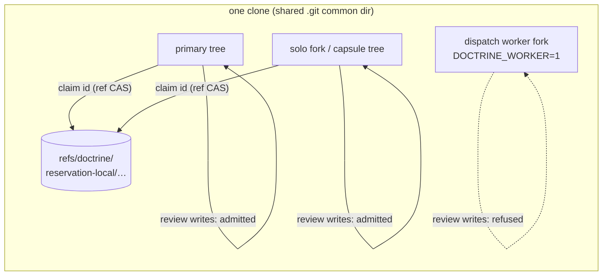
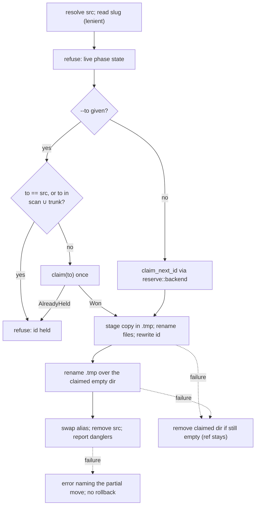

<!-- doctrine:section sec-1 -->
## What changes

Two defects stop an audit from running where the code is.

1. **Ids collide across trees of one clone.** Under `reach = "local"`, a fresh-id
   claim is a `mkdir` in the invoking tree. A sibling worktree of the same clone
   cannot see that directory, so both trees can mint `SL-270` (ISS-279).
2. **Review writes refuse most linked worktrees.** `resolve_review_root`
   (`src/review/turn.rs:169`) refuses any linked tree whose branch is not
   `dispatch/<NNN>`. A solo fork (IMP-240) and an adopted capsule worktree
   (ISS-494) are refused, so their audit ledgers can only open after the code
   lands on the parent tree.

This slice fixes both, in that order, because admitting more trees to review
writes (the second fix) widens the collision window the first fix closes:

- **Clone-wide reservation (sec-2).** `local` reach claims an id with a
  compare-and-swap (CAS) create of a git ref in the clone's shared ref store,
  which every worktree of the clone sees. The candidate scan also reads sibling
  worktrees' entity dirs and both reservation ref namespaces (DEC-337).
  `reseat` claims its destination through the same backend (sec-3).
- **Worker-only review refusal (sec-4).** Review writes are refused only when
  this process is a dispatch worker (`DOCTRINE_WORKER`). Every other tree —
  primary, coordination, solo fork, adopted capsule — is admitted (DEC-338).

What does not change: `shared` reach (the remote ref CAS), the trunk-id union
(ADR-006 D3), the review ledger format, and the review turn protocol. Separate
clones under `local` reach can still collide; that is what `shared` is for.



The diagram shows the boundary after this slice: every tree of a clone
arbitrates ids through one ref store, and the only tree refused review writes is
the one whose process carries the worker marker. A worker never mints ids at all
— the CLI `worker_guard` refuses authored writes there, and its fork's common
git dir is read-only under confinement.

<!-- doctrine:section sec-2 -->
## Clone-wide reservation

### Current behaviour

`reserve::backend(root, prefix, prompt)` (`src/reserve.rs:235`) is the one seam
all 11 fresh-id call sites use. It returns a `Claim` backend plus a `ScanSource`,
the closure that turns the tree's own entity-dir ids into the full candidate set
before `entity::next_id` adds the trunk ids and picks max + 1.

| reach | claim | scan source |
|---|---|---|
| `local`, or `auto` degraded | `LocalFs`: `mkdir` in this tree | this tree's dirs only |
| `shared`, or `auto` reachable | `GitRef`: zero-oid create CAS pushed to the remote, then `mkdir` | this tree's dirs + fetched `refs/doctrine/reservation/<PREFIX>/` |

### Target behaviour

A new backend, `CloneRef`, replaces `LocalFs` in every local arm when the root is
inside a git repository. It is `GitRef` without the remote: build a
holder-stamped empty commit (`git::commit_empty_tree_as`), then create
`refs/doctrine/reservation-local/<PREFIX>/<NNN>` with `git::update_ref_cas(root,
refname, oid, ZERO_OID)`. Refs live in the common git dir, so the CAS arbitrates
across every worktree of the clone. A root outside any git repository keeps
`LocalFs`.

```mermaid
sequenceDiagram
  participant Site as fresh-id call site
  participant Loop as entity::claim_fresh_id
  participant Scan as ScanSource
  participant CR as CloneRef
  participant Git as common .git refs
  Site->>Loop: backend + scan
  loop until Won (max retries)
    Loop->>Scan: own dir ids
    Scan->>Git: for-each-ref reservation-local/P/, reservation/P/
    Scan-->>Loop: own ∪ sibling-tree dirs ∪ both ref sets
    Loop->>Loop: id = next_id(candidates, trunk)
    Loop->>CR: claim(id)
    CR->>Git: update-ref CAS (zero oid)
    alt ref created
      CR->>CR: mkdir tree/NNN
      CR-->>Loop: Won, AlreadyHeld (dir exists), or error
    else update-ref failed, ref still absent
      CR-->>Loop: error (git stderr)
    else ref exists
      CR-->>Loop: AlreadyHeld → retry
    end
  end
```

The sequence shows one allocation under `local` reach. The ref CAS is the
arbiter; the `mkdir` after it keeps the claim loop's cleanup-on-failure contract
(a `Won` claim owns its dir).

**After the CAS.** Both git backends run the post-CAS `mkdir` through one
private helper, so its outcomes and error text cannot drift (STD-001). Once the
CAS has won, the ref is held whatever the `mkdir` does next, and the id is skipped
from then on.

| `mkdir` result | `CloneRef` | `GitRef` |
|---|---|---|
| created | `Won` | `Won` |
| already exists | `AlreadyHeld`: a writer that makes no ref (a pre-slice binary, or by hand) holds the dir; retry | hard error: another clone's remote claim now collides with the local occupant; names `doctrine reseat <REF>` for the occupant |
| any other error | hard error carrying the I/O cause; says the id is burnt and a re-run allocates the next one. No `reseat` hint: there is no entity to reseat | same |

Today `GitRef` discards the I/O error and always suggests `reseat`
(`src/reserve.rs:160-171`); the helper fixes that for both.

**A failed CAS is not always a rival.** `git::update_ref_cas` reports every
non-zero `update-ref` exit as `Moved` (`src/git.rs:1104-1116`), so a lock,
permission or ref-store error would read as contention and retry to exhaustion.
It changes to return `Moved` only when the ref no longer equals `expected_old`; a
failure that leaves the ref at `expected_old` (for a create, still absent) is an
error carrying git's stderr and the ref name.

**One composed scan.** Every git-backed scan source (`CloneRef` and `GitRef`)
returns the union of:

| input | read when | why |
|---|---|---|
| this tree's entity dirs | every retry (passed in) | unchanged |
| sibling live worktrees' `<kind dir>/NNN` dirs | once, at construction | ids minted before this slice, or by hand, in a tree whose dirs are not committed (ISS-279's coordination-tree case) |
| `refs/doctrine/reservation-local/<PREFIX>/` | every retry | clone-wide claims |
| `refs/doctrine/reservation/<PREFIX>/` | every retry (`GitRef` re-fetches first) | remote claims; keeps a clone that switches reach collision-free |

Live worktrees come from `git::list_worktrees` minus `prunable` entries and paths
that no longer exist — the liveness rule `git::live_worktree_for_ref` already
applies. Each sibling's kind dir is `<sibling path>/<rel>/<kind dir>`, where `<rel>` is
this tree's doctrine root relative to its own worktree top level (empty in the
usual case; non-empty when the doctrine project sits in a repo subdirectory).
The invoking tree itself is skipped: its dirs arrive through the passed-in ids.
A sibling with a doctrine root at `<rel>` but no kind dir contributes nothing,
as an empty kind does. A sibling with no doctrine root at `<rel>` (its branch
predates the project or moved it), or whose kind dir cannot be read, is not
scanned, and a warning names it on stderr (STD-003); the allocation goes on.

Both ref reads are prefix-scoped (ISS-221) through one reader
parameterised by the namespace constant; `remote_reservation_ids` becomes
`reservation_ids(root, namespace, prefix)`. Trunk ids stay where they are, in
`next_id`.

Sibling dirs are read once because they only matter for claims that predate the
ref (post-slice claims show up as refs, which are re-read every retry).

### Signature

The sibling-dir scan needs the kind's directory, which `backend` does not take
today. `backend` takes the `Kind` instead of its prefix:

```rust
pub(crate) fn backend(root: &Path, kind: &Kind, prompt: PromptFn)
    -> anyhow::Result<(Box<dyn Claim>, ScanSource)>;
```

All 11 call sites already hold a `Kind` constant and pass `KIND.prefix`, so each
edit is one token. `reserve` gains a downward edge to the leaf `kinds` module
(`.doctrine/adr/001/layering.toml:73` is updated to say so).

### Fallback hygiene (ISS-483)

`backend` reads `DOCTRINE_RESERVATION_FALLBACK` once and passes the result down as
a `bool`; `resolve_backend` and `resolve_auto` never read the environment. The
reach-selection tests call `resolve_backend` with an explicit value, so an ambient
variable cannot change their outcome. The call sites are untouched by this part.

The TTY fallback prompt changes from "Allocate this id locally (reduced reach)?"
to name what local now means and how to make the choice persistent:

```text
reservation remote origin is unreachable. Allocate this id in this clone only? [y/N]
(to skip this prompt: [reservation] allow-local-fallback = true, or DOCTRINE_RESERVATION_FALLBACK=1)
```

### Naming

| name | meaning |
|---|---|
| `CloneRef` | the local-reach backend: a ref CAS in the clone's common git dir |
| `RESERVATION_LOCAL_REF_PREFIX` | `"refs/doctrine/reservation-local"`, beside `RESERVATION_REF_PREFIX` |
| `Arbiter` | test-only answer to "what linearizes this claim": `Dir`, `CloneRef`, `RemoteRef` |

`Claim::is_remote() -> bool` (test-only) becomes `Claim::arbiter() -> Arbiter`.
A boolean cannot tell `CloneRef` from `LocalFs`, so the reach-selection tests
would keep passing while proving less.

### Existing claims

A clone upgrading to this slice holds `mkdir`-only claims and no local refs. The
sibling-dir scan covers them in live trees; trunk ids cover committed ones. The
residual extends DEC-337's; git merge is the backstop, and `reseat` the repair:

- an id minted before this slice, committed only on a branch with no live
  worktree (DEC-337);
- an id minted before this slice in a live sibling whose doctrine root is not at
  `<rel>` (the warned case above);
- a ref-less claim made in another tree *during* an allocation, by a pre-slice
  binary or by hand. Sibling dirs are read once, and even a re-read could not make
  a ref-less `mkdir` atomic with the CAS. **Rollout rule:** upgrade every tree of
  a clone together, and do not hand-make numbered dirs.

<!-- doctrine:section sec-3 -->
## `reseat` claims its destination

`doctrine reseat <REF> [--to NNN]` renumbers an entity: it copies the entity into
a staging dir, renames its files and rewrites its `id`, then renames the staging
dir onto the destination as the single commit point (`src/integrity.rs:264-410`).
Two defects remain.

- **Slug read is strict (ISS-277).** The alias name comes from
  `meta::read_meta(...).slug`, and `Meta` requires `status`. A review has no
  `status` field, so `reseat RV-NNN` fails before it starts.
- **The destination is picked, not claimed.** The default is
  `next_id(own dirs, trunk)` and the only guard is `!dst_dir.exists()` in this
  tree. A sibling worktree's id, or a held reservation ref, is invisible.

### Lenient slug reader

`meta` gains `read_slug(tree_root, stem, id, prefix) -> Result<String>` beside
`read_id`. Both read through one private generic helper that locates, reads and
parses `<stem>-<NNN>.toml` into a caller-chosen projection (`IdOnly`, and a new
`SlugOnly { slug }`), so the path and error wording exist once. `read_meta` keeps
requiring `status`: a status-bearing kind with a corrupt toml still hard-fails
(`read_meta_still_hard_fails_on_a_missing_status` stays green unchanged).

### Claiming the destination

`entity::claim_fresh_id` splits into two steps. The loop that picks, claims and
retries becomes `entity::claim_next_id(claim, tree_root, trunk_ids, scan) ->
(id, dir)`; `claim_fresh_id` calls it, then runs the existing midpoint, build and
cleanup. The 11 fresh-id sites see no change (behaviour-preservation gate: the
existing entity and reserve suites stay green unchanged). `reseat` calls the loop
directly.



The flowchart shows the new order. Refusals that do not depend on the
destination run first, so a refused reseat never leaves a claim behind.

Non-obvious edges:

- **`--to` checks the scan, then claims.** The ref CAS alone cannot see an id
  that exists only as a sibling tree's pre-slice dir, so an explicit target is
  refused if it appears in the candidate set before any claim is attempted.
- **Commit onto the claimed dir.** A `Won` claim leaves an empty dir at the
  destination. The staging dir is renamed over it; POSIX `rename(2)` replaces an
  empty directory atomically, so the single-commit-point property (IMP-010)
  holds. Removing the claimed dir first would reopen the window under `LocalFs`,
  where the dir is the claim.
- **Failure before the commit rename** (staging, or the rename itself) removes
  the claimed dir with `remove_dir`, which only removes an empty dir. If something
  has populated it, it is left in place and the error names it; the failed-build
  `remove_dir_all` precedent is not copied. A populated destination also makes the
  rename fail (`ENOTEMPTY`) rather than replace it. The ref, if any, stays and its
  id is skipped from then on — the same cost as a failed `GitRef` allocation.
- **Failure after the commit rename** (alias swap, source removal) is a
  committed move. Nothing is rolled back and the destination is never removed;
  the error names what is seated and what remains to clean up.

### Layering and signature

`run_reseat(path, reference, to)` gains `prompt: PromptFn`, supplied by the
command tier (`src/commands/cli.rs:1807`) as the 11 sites already do. This adds a
declared `integrity → reserve` edge, both engine tier and acyclic (`reserve` does
not reach `integrity`); `.doctrine/adr/001/layering.toml:89` is updated.

### Dangler report (ISS-292 faults 1, 3, 4)

After the move, `reseat` prints the inbound citations of the old ref and exits
non-zero. `scan_danglers` (`src/integrity.rs:415`) is meant to be the rewrite
worklist, but four of its faults make it unusable as one:

| fault | now | target |
|---|---|---|
| structured tier invisible | globs `.doctrine/**/*.md` only, so relation edges, memory `[[source]]` refs and `plan.toml` criteria are missed | reads `*.md` and `*.toml` under `.doctrine/` |
| alias symlinks double-count | the glob follows `NNN-slug` aliases into `NNN/`, reporting each file twice | the walk does not follow symlinks |
| disposability defeated by a symlink | `slice/NNN/phases/…` (a symlink into `.doctrine/state/`) reads as authored | the walk does not follow symlinks |
| unreadable files skipped silently | `read_to_string` failure is `continue` (`src/integrity.rs:426`) | each walk or read failure is listed with its path and cause, and `reseat` exits non-zero (STD-003) |

**The walk.** `glob` is replaced by `walkdir` (already a dependency) over
`.doctrine/` with `follow_links(false)`; symlink entries are skipped. Every
symlink under `.doctrine/` is an alias for a real sibling (`NNN-slug`, memory
slug aliases) or the `phases` link into runtime state, so nothing authored is
lost. Not following links also keeps the walk inside `.doctrine/` and out of
link loops, which canonicalising files after a glob would not.

The whole-token matcher (`line_cites`) is unchanged; a TOML value such as
`ref = "RV-323"` matches as a token. `is_disposable_prose` is unchanged and runs
on the walked (lexical) path; `doctor_checks` shares it.

The report states its bound, so it is not read as exhaustive:

```text
inbound citations to RV-320 in .doctrine/ (*.md, *.toml; symlinks not followed) — rewrite by hand; source outside .doctrine/ is not scanned:
```

Unreadable files follow under their own heading, each with its cause.

Still out of scope, in ISS-292: scanning outside `.doctrine/` (fault 2), slash-
compressed id lists such as `DEC-099/101` (fault 5), and rewriting structured
edges automatically.

### Review runtime state

A review's runtime dir (`.doctrine/state/review/<NNN>/`, the turn baton) is a
pure cache keyed by id. `reseat` does not move it: the reseated RV starts cold and
rebuilds its baton on next use. A stale baton at the old id is harmless unless
that id is allocated again — possible only for an RV minted before this slice,
which holds no reservation ref — and then the first turn heals it and asks for a
re-run (the entry hash check, ADR-007 D-C2). Removing it would need per-kind
runtime knowledge in `reseat` that nothing else requires.

<!-- doctrine:section sec-4 -->
## Review admission

### Current behaviour

Every review verb that writes — `new`, the turn verbs (`raise`, `dispose`,
`contest`, `verify`, `withdraw`, `amend`, `reopen`, `conclude`), and `prime`,
`status`, `unlock` — resolves its root through `resolve_review_root`
(`src/review/turn.rs:169`). It refuses when `classify_worktree_role` says `fork`:
any linked worktree whose branch is not `dispatch/<NNN>`. The reason given is
that the turn baton lives in the parent tree's gitignored state. That stopped
being true when the baton became a pure cache (ADR-007 D-C2; SL-268 moved turns
into the ledger), and the baton's `state_dir` is derived from the root, so each
tree has its own.

### Target behaviour

One pure predicate, fed by the shell:

```rust
/// Review writes are refused only in a dispatch worker (DEC-338).
fn admit_review(worker: bool) -> anyhow::Result<()>;

pub(super) fn resolve_review_root(path: Option<PathBuf>) -> anyhow::Result<PathBuf> {
    let root = crate::root::find(path, &crate::root::default_markers())?;
    admit_review(crate::worktree::env_worker_set())?;
    Ok(root)
}
```

`env_worker_set` is the signal the CLI `worker_guard` already uses, so the CLI and
the review layer cannot disagree about who is a worker. The refusal cites
`WORKER_ENV_CAUSE` and says workers read reviews with `show`/`list`:

```text
review writes are refused in a dispatch worker (`DOCTRINE_WORKER` is set, so this
process is a worker: if that is wrong, unset it). Workers read reviews with
`review show` / `review list`; the orchestrator writes the ledger.
```

| tree | before | after |
|---|---|---|
| primary | admitted | admitted |
| dispatch coordination tree | admitted | admitted |
| solo fork (`/worktree`) | refused | **admitted** |
| adopted capsule worktree | refused | **admitted** |
| any tree, process has `DOCTRINE_WORKER=1` | refused if linked, else admitted | **refused** |

The last row is a tightening: a worker process whose root happens to resolve to a
non-linked tree was admitted before.

**Why a review-level check when `worker_guard` exists.** MCP review tools call
`review::run_*` directly and never pass through the CLI guard; this check is what
refuses them in a worker. The one RV mint that skips `resolve_review_root` — the
design run's `mint_review` (`src/commands/design.rs:1487`) — has no MCP surface,
so the CLI guard covers it (ASM-012). No code change there.

**Branch shape leaves the review path.** `classify_worktree_role` keeps its other
callers (`dispatch whereami`, worktree inventory). No host branch format is
recognised by review admission (POL-002).

### The rule admission relies on

Admitting any non-worker tree means two trees could write one RV. The rule is
**one writer per RV at a time, in any admitted tree**; git merge of the ledger is
a best-effort backstop, not a guarantee. The turn protocol's lock and hash checks
protect writers within one tree only. Enforcing the rule across trees is IDE-021
(leases), out of scope. The rule is stated in guidance (sec-5).

**Landing an audited slice.** Audit and close in the linked tree, then land. The
RV and the phase state travel with the branch or are not needed after close; the
baton is rebuilt from the ledger wherever it is next read.

<!-- doctrine:section sec-5 -->
## Guidance and governance

### Guidance text

Every surface that states the fork ban or the per-tree reservation is rewritten
to the new rules in the same change. Skill sources live in
`plugins/doctrine/skills/**`; installed copies (`.claude/skills/**`,
`.pi/skills/**`) are refreshed by `doctrine install`, never hand-edited.

| surface | now says | becomes |
|---|---|---|
| `install/review-ledger.md` "Parent-tree caveat" (§6) | turn verbs, `status`, `prime`, `unlock` refuse a fork; `new` strands a ledger there | **"Where reviews run"**: any tree except a dispatch worker; one writer per RV at a time, git merge a best-effort backstop |
| `plugins/doctrine/skills/audit/SKILL.md` (intro, step 2) | cites the parent-tree caveat; "use a worktree instead, if necessary" | an audit runs where the code is — primary, coordination, solo fork or adopted capsule; audit and close there, then land (IMP-190) |
| `plugins/doctrine/skills/inquisition/SKILL.md` (ledger step) | "open and drive the ledger from the primary tree" | any non-worker tree; same one-writer rule |
| `plugins/doctrine/skills/code-review/SKILL.md` (intro) | cites the parent-tree caveat | cites "where reviews run" |
| `src/mcp_server/tools.rs:78` (`review_new` description) | "refuses a worktree fork … open it from the primary or coordination tree" | "refuses in a dispatch worker" |
| `src/review/prime.rs:148` comment | "already refuse fork roots" | worker-only refusal |
| `scripts/oubliette.sh` `back` advice | "the review verbs refuse this worktree … the RV ledger can only open on edge" | audit here, close here, then land (project-local consumer; validates the change) |
| `install/doctrine.toml.example` `[reservation]` | "`local` — single-tree: local mkdir is the claim" | "`local` — this clone: a ref in the clone's git dir is the claim; remote is never touched" |

The oubliette advice about copying phase state to edge before auditing goes too:
the audit no longer moves.

### Backlog

- **ISS-279** (per-tree local claims collide): fulfilled. Its body's
  `DOCTRINE_TRUNK_REF` allocation workaround is annotated as retired — the
  workaround lives only there, not in shipped guidance.
- **ISS-277** (reseat strict slug), **ISS-483** (non-hermetic reserve tests),
  **ISS-494** and IMP-240 defect 2 (review refuses capsule / solo trees),
  **IMP-190** (where an audit can run): fulfilled.
- **ISS-496** (dangler scan ignores `.toml` edges): fulfilled; it is ISS-292's fault 1.
- **ISS-292** (dangler report unusable as a worklist): partly fulfilled — faults 1, 3, 4. Faults 2 and 5 and automatic structured-edge rewrite stay open there.

### Memories

| memory | disposition |
|---|---|
| `mem.pattern.review.rv-verbs-refuse-on-worktree-fork` | wrong after this slice — superseded by a memory stating the worker-only rule |
| `mem.pattern.worktree.primary-tree-resolver-and-contextual-review-fork-ban` | its review fork-ban half is wrong — superseded likewise; its pre-existing dead path (`src/review.rs`) is corrected separately, not folded in |
| `mem.pattern.doctrine.jail-reservation-fallback` | narrowed: "local" means this clone; the env opt-in still applies to `auto` with an unreachable remote |

### Governance (a Revision, REV)

One REV, authored and applied at `/reconcile` (ADR-013), covers:

| clause | change |
|---|---|
| ADR-007 D-C1 (SL-040 clarification) | review verbs refuse only in a worker process, not a fork-resolved root |
| ADR-007 D-C7 | "one working tree; never a live shared ledger across worktrees" → one writer per RV at a time, in any admitted tree; git merge a best-effort backstop |
| ADR-007 D-C10 | the parenthetical "review verbs refuse a worker fork (D-C1)" → "refuse in a worker process" |
| PRD-005 (reach definition; same-clone limitation) | `local` reach = this clone; trees of one clone no longer collide; separate clones still can |
| SPEC-008 (reach config, fork safety, local backend) | local = clone-common ref CAS + per-tree `mkdir`; the scan union of sec-2; trunk union is one scan input, not the whole fix; `mkdir` is no longer the local backend |
| SPEC-008 `reseat` | lenient slug read; destination claimed through the reservation backend; `--to` onto a held id refuses |

D-C10 is beyond the scope's named clauses (D-C1/D-C7); it is included because it
restates the fork refusal and would otherwise be left false.

<!-- doctrine:section sec-6 -->
## Code impact

| path | change |
|---|---|
| `src/reserve.rs` | `CloneRef` backend; `RESERVATION_LOCAL_REF_PREFIX`; shared post-CAS `mkdir` helper (outcome table in sec-2; keeps the I/O cause, `reseat` hint only for an occupied dir); one composed scan source for both git backends; `reservation_ids(root, namespace, prefix)`; sibling-worktree dir read, warning on a sibling with no root at `<rel>` or an unreadable kind dir; `backend(root, &Kind, prompt)`; env opt-in read once in `backend`, passed as `bool` to `resolve_backend`/`resolve_auto`; reworded TTY prompt; non-git root keeps `LocalFs` |
| `src/entity.rs` | `claim_fresh_id` split: `claim_next_id` (pick, claim, retry) + the existing midpoint/build/cleanup; test-only `Claim::arbiter() -> Arbiter` replaces `is_remote()` |
| 11 fresh-id sites (`backlog`, `concept_map`, `knowledge`, `slice`, `spec`, `review/verbs`, `requirement`, `governance`, `revision`, `rec` ×2) | pass the `Kind`, not its prefix |
| `src/git.rs` | `update_ref_cas` returns `Moved` only when the ref has left `expected_old`; any other `update-ref` failure is an error with git's stderr |
| `src/meta.rs` | `SlugOnly`, `read_slug`; `read_id` and `read_slug` share one private reader |
| `src/integrity.rs` | `run_reseat`: lenient slug read; `prompt` param; destination via `claim_next_id` or scan-checked single claim; commit rename over the claimed empty dir; refusals reordered before the claim; pre-commit cleanup by `remove_dir` only, post-commit failures reported as a partial move; `scan_danglers` walks `.doctrine/` with `walkdir` (no link following) over `*.md` + `*.toml`, lists unreadable files, and prints its bound |
| `src/commands/cli.rs` | pass `install::prompt_confirm` to `run_reseat` |
| `src/review/turn.rs` | `admit_review(worker)`; `resolve_review_root` drops the branch-shape test |
| `src/review/prime.rs`, `src/mcp_server/tools.rs` | comment / tool description text |
| `src/kinds/mod.rs` | review `KindRef.state_dir` → `None`: the baton is a pure cache, not phase state for `reseat` to guard (sec-3 "Review runtime state") |
| `src/test_support.rs`, `tests/common/mod.rs` | `LinkedTrees` fixture — one clone, two linked worktrees, no remote (sec-7) |
| `.doctrine/adr/001/layering.toml` | `reserve → kinds`, `integrity → reserve` declared |
| `install/review-ledger.md`, `install/doctrine.toml.example`, `plugins/doctrine/skills/{audit,code-review,inquisition}/SKILL.md`, `scripts/oubliette.sh` | guidance text (sec-5) |

No change: `src/commands/design.rs` (ASM-012), `src/worktree/shared.rs`
(`classify_worktree_role` keeps its other callers).

<!-- doctrine:section sec-7 -->
## Verification

A new fixture composes what no existing one covers: **one clone with two linked
worktrees**, each able to hold entity dirs, and no remote. The multi-clone
`Substrate` (`src/reserve.rs:583`) and the review-level `repo_with_linked_tree`
(`src/review/tests.rs:1508`) each cover half.

### Reservation (`src/reserve.rs`, `src/entity.rs`)

| test | asserts |
|---|---|
| two linked trees allocating one kind get distinct ids | the ref CAS arbitrates across worktrees of one clone |
| scan sees a sibling tree's uncommitted entity dir | pre-slice mints in live trees are not reused |
| scan sees both `reservation-local/` and `reservation/` refs, scoped to the kind's prefix | mixed-reach clones stay collision-free; ISS-221 does not regress |
| `CloneRef` post-CAS `mkdir` | dir already exists → retries the next id; other I/O error → hard error carrying the cause, no `reseat` hint |
| `GitRef` post-CAS `mkdir` | dir already exists → hard error naming `reseat`; other I/O error → cause kept, no `reseat` hint |
| `update_ref_cas` against an unwritable ref store | error with git's stderr, not `Moved`; a real rival still yields `Moved` |
| sibling with no doctrine root at `<rel>` | warned on stderr, allocation proceeds |
| non-git root under `local` | `arbiter() == Dir` (plain `mkdir`) |
| reach selection (`vt2`, `vt3`, `vt6` rewritten) | asserts `arbiter()`, calls `resolve_backend` with an explicit opt-in, and passes with `DOCTRINE_RESERVATION_FALLBACK=1` set in the environment (ISS-483) |
| existing entity and reserve suites | green unchanged across the `claim_next_id` split |

### `reseat` (`tests/e2e_integrity.rs`, `src/meta.rs`)

| test | asserts |
|---|---|
| reseat renumbers a review (`RV-NNN`) | the lenient slug read (ISS-277) |
| `read_slug` on a status-less toml | returns the slug; `read_meta` still hard-fails there |
| `--to` onto an id held as a sibling tree's dir, or as a local ref | refused, source untouched |
| default reseat in a clone with a sibling tree | destination skips the sibling's ids |
| refusal on live phase state | leaves no claim behind |
| staging fails with the claimed dir populated by another writer | the dir and its contents are left; the error names it |
| alias swap fails after the commit rename | destination stays seated; error names the partial move |
| dangler scan over a `.toml` citation (`[[source]] ref`) | reported |
| dangler scan through a `NNN-slug` alias | each file reported once |
| dangler scan through the `phases` symlink | runtime phase sheet not reported |
| dangler scan with an unreadable authored file | the file is listed with its cause; `reseat` exits non-zero |
| dangler scan with a symlink to a dir outside `.doctrine/`, and a symlink loop | neither is entered |
| existing `scan_danglers_skips_disposable_prose` | green unchanged |

### Review admission (`src/review/tests.rs`)

| test | asserts |
|---|---|
| `admit_review(false)` / `admit_review(true)` | admits / refuses with the worker cause |
| `vt10` inverted | a solo linked tree is admitted and its baton lands in its own state dir |
| `vt10b` | coordination tree still admitted |
| `review_new_on_a_fork_refuses_before_allocating` re-pointed | a worker process refuses `new` before any id is allocated |
| solo-tree lifecycle | an RV opened in a solo linked tree runs raise → dispose → verify → conclude to `done` |

Worker-process cases drive the predicate with the bool, not by setting
`DOCTRINE_WORKER` in the test process.

### Agent- and human-verified

- VA: `review-ledger.md`, the audit and inquisition skills, and the oubliette
  advice state the worker-only rule and "one writer per RV at a time".
- VA: the REV is recorded at `/reconcile` covering the sec-5 clauses.
- `doctrine check gate` green, including the architecture layering test with the
  two new declared edges.

<!-- doctrine:section sec-8 -->
## Risks and residuals

- **Two writers on one RV.** Admission no longer keeps a ledger in one tree.
  Two trees writing the same RV concurrently can each pass their own turn checks;
  the merge then conflicts or, worse, merges cleanly into an incoherent ledger.
  Mitigation is the stated rule and the fact that audits are single-driver in
  practice. Enforcement is IDE-021 (leases).
- **Claims the scan cannot see.** A pre-slice id on a branch with no live
  worktree (DEC-337's residual), a pre-slice id in a live sibling whose doctrine
  root is not at `<rel>` (warned), and a ref-less claim made concurrently by a
  pre-slice binary or by hand (sec-2, "Existing claims"). Git merge surfaces the
  collision; `reseat` fixes it. The rollout rule — upgrade a clone's trees
  together — keeps the last case to hand-made dirs.
- **Orphan local refs.** A claim whose build fails leaves its ref; the id is
  skipped from then on. This is a gap in numbering, never a collision.
  `doctrine reservation list` shows only the shared namespace today; surfacing
  local refs there is not in scope.
- **Ref accumulation.** Local refs are never deleted. One ref per minted id is
  the same growth `shared` reach already accepts.
- **`rename` over an empty dir is POSIX behaviour.** `reseat`'s commit point
  relies on it; a platform without it would fail the rename loudly, not corrupt
  state.
- **Dangler report still bounded.** Citations outside `.doctrine/` and in
  slash-compressed id lists are still missed (ISS-292 faults 2, 5); the report
  now says so in its header.

