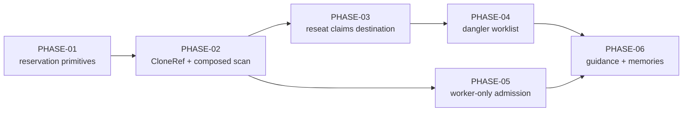

# Implementation Plan SL-269: Review-capable worktree locus

Prose companion to `plan.toml`. Narrative only — no queried data lives here
(the storage rule); the phase list, criteria, verification, and links are
authored in the TOML. Use this for the plan's rationale and sequencing.
<!-- Cite entities by padded id (SL-020, REQ-059); phases as PHASE-01,
     criteria as EN-1/EX-1/VT-1/VA-1/VH-1. See glossary.md § reference forms. -->

## Overview

Six phases, in the design's order: make id reservation clone-wide first, then
fix `reseat` and its dangler report, then widen review admission, then rewrite
guidance to match shipped behaviour. The governance Revision (REV) covering
ADR-007, PRD-005 and SPEC-008 (design sec-5) is authored at `/reconcile`, not in a
phase.

## Sequencing & Rationale

- **PHASE-01 before PHASE-02.** The primitives change behaviour for callers that
  exist today (`update_ref_cas` has seven dispatch callers; `GitRef` owns the
  post-CAS `mkdir`). Landing them alone keeps the behaviour-preservation gate
  readable: any red suite in PHASE-01 is a primitive regression, not a `CloneRef`
  bug. It also leaves `CloneRef` in PHASE-02 as pure composition.
- **PHASE-02 carries the signature change** (`backend` takes `&Kind`) because
  the sibling scan is its only consumer. The 11 call-site edits are one token
  each.
- **PHASE-03 after PHASE-02.** `reseat` claims through the backend and its
  tests need the two-linked-tree fixture PHASE-02 builds. Put that fixture
  where `src/integrity.rs` tests can reach it (a `#[cfg(test)]` helper outside
  `reserve`'s private test module); `/phase-plan` for PHASE-02 settles the site.
- **PHASE-04 after PHASE-03** only because both edit `run_reseat`; the dangler
  walk is otherwise independent. Serial avoids a conflict for little lost
  parallelism.
- **PHASE-05 after PHASE-02**, per design sec-1: admitting more trees to review
  writes widens the collision window that clone-wide reservation closes. It
  touches no file PHASE-03/04 touch, so it may run in parallel with them.
- **PHASE-06 last**, so guidance describes shipped behaviour.

## Notes

- VT keywords name the test functions the design's verification tables imply.
  A phase may rename one at `/phase-plan` time by amending the row's keywords,
  never its id.
- `update_ref_cas`'s new error case is narrow: only a failure that leaves the ref
  at `expected_old`. Dispatch callers that handled `Moved { actual: None }` for
  a create never saw a real rival in that shape, so the change removes a
  misreport rather than a handled path — PHASE-01 EX-6 proves it on the dispatch
  suites.
- Lock contention stays contention. A rival mid-create holds the ref's lock;
  git retries a held lock for 100 ms (`core.filesRefLockTimeout`,
  `reftable.lockTimeout`) before failing, and a creating rival holds it for far
  less. So when `update-ref` fails and the ref is still absent, the lock was
  held persistently: an error, not a race. PHASE-02 VT-1 (two trees racing)
  exercises the race side.
- Unwritable-ref-store test (PHASE-01 VT-1): a `chmod` read-only `refs/` dir is
  bypassed when tests run as root; use a persistently held `<ref>.lock` file
  instead, which git refuses regardless of uid once its lock timeout expires.
