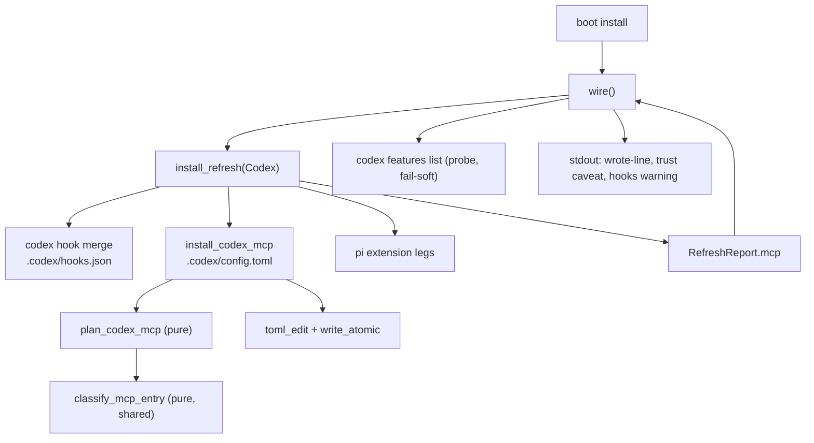

<!-- doctrine:section sec-1 -->
## 1. Design Problem

`boot install` registers the doctrine MCP server with **Claude** and with nobody
else. It merges `mcpServers.doctrine` into the project-root `.mcp.json`, and the
`Harness::Codex` arm of the same refresh carries `mcp: RefreshOutcome::None`. A
codex-driven session therefore reaches none of doctrine's MCP tools, and the only
way to close the gap today is for a human to run `codex mcp add doctrine --
doctrine serve --mcp` by hand — which has no scope flag and writes the **user**
layer (`~/.codex/config.toml`), not the project.

Codex reads its MCP servers from a TOML table, `mcp_servers.<id>`, in a
project-scoped `.codex/config.toml`. This design gives `boot install` a second MCP
leg that writes exactly that table, to the same standard the Claude leg already
meets: edit-preserving, idempotent, no-clobber, fail-soft, and disclosed.

The boundary is deliberately narrow. This leg **registers a server**. It does not
write codex's feature flags, does not touch the user layer, and does not add an
MCP tool. Three behaviours specific to codex shape it, all established by
evidence gathered before design:

1. codex does not interpolate `${VAR:-default}` in `command` — it execs the
   string literally, so the Claude leg's portable command cannot be copied.
2. codex hands an MCP child a *filtered* environment, so `DOCTRINE_BIN` survives
   only if the entry whitelists it.
3. codex silently ignores an untrusted project's config layer, so install cannot
   imply that what it wrote is live.

The result is a leg whose command form is portable and machine-path-free, whose
ownership predicate is explicit about which shapes are doctrine's, and whose
output tells the truth about what the harness will and will not do with it.

<!-- doctrine:section sec-2 -->
## 2. Current State

Line references are to `src/boot.rs` at `e569620cd`.

`install_refresh(harness, root, exec, dry_run)` runs one arm per harness. The
**Claude arm** calls `install_mcp` (`:2087`), which reads `.mcp.json`, plans
through `plan_mcp` (`:2034`) and writes through `fsutil::write_atomic` only on
change. `plan_mcp` fuses four steps over a `serde_json::Value`: parse, mutate at
the narrow path `mcpServers.doctrine`, classify, render. Its ownership predicate
`is_doctrine_mcp_entry` (`:2010`) owns two shapes — the current
`PORTABLE_EXEC` command (`${DOCTRINE_BIN:-doctrine}`, `:613`) and a legacy
absolute path whose file name is `doctrine` — and its no-op branch compares the
stored command against `PORTABLE_EXEC` (`:2056`). A foreign or customised
`doctrine` key, a non-object `mcpServers`, or malformed JSON yields the
`PrintedFallback` sentinel, rewritten by `install_mcp` into a manual snippet.

The **Codex arm** (`:1677-1705`) merges `.codex/hooks.json` through
`codex_hook_specs` (`:1308`), passing `CommandForm::Baked` as a literal justified
by this repo's own `.gitignore` (`:2331-2338`), runs the three pi-extension legs,
and sets `mcp: RefreshOutcome::None` (`:1702`). No function resolves a file's
tracking status; the form is a per-call argument.

`RefreshReport` (`:1774`) carries one `mcp: RefreshOutcome` field (`:1787`).
`wire()` (`:2851-2878`) matches it and prints a message naming `MCP_REL`, which is
a constant (`:594`), not a value carried by the outcome. `None` prints nothing.

`boot.rs` contains **no** `toml_edit` usage: every write in the module is
`serde_json` plus `fsutil::write_atomic`. The house edit-preserving TOML seam is
`dep_seq::set_authored_status` (`src/dep_seq.rs:433`, parsing to
`toml_edit::DocumentMut` at `:299`), used by `backlog.rs` and `knowledge.rs`.

`.codex/config.toml` is **not** written by doctrine today.
`write_codex_activation` (`:2684-2712`) only *tells the human* to set
`[features] hooks = true` in it (`:2696`) and to trust the hooks via `/hooks`.
The Claude leg's four pinned assertions on `out.mcp` live at `:5121`, `:5129`,
`:5157` and — the codex-arm line that must flip — `:5170`. `tests/` has no codex
install e2e and `tests/e2e_claude_install.rs` makes no MCP assertion at all.

<!-- doctrine:section sec-3 -->
## 3. Forces & Constraints

| authority | constraint it places on this design |
|---|---|
| ADR-001 (layering) | `boot` is command tier. A shared classification core carries no format and no caller's concept; each arm owns its parse and render. |
| ADR-013 | A change to SPEC-011's requirement text lands through a Revision. This slice does not *wait* on that change — the Revision retro-describes behaviour that ships here — so it carries no `needs` anchor; the reason is recorded in §9 rather than left implicit. |
| POL-002 facets 1–2 | No host absolute path may land in an artefact a client tracks. Install's `[gitignore].entries` add nothing for `.codex`, so a client's `.codex/config.toml` is tracked. |
| POL-002 facet 3 | A host-tool dependency must be **declared**, never silent. The portable form runs through a POSIX `sh`. |
| POL-003 facets 1–2 | Codex vocabulary (`mcp_servers`, `env_vars`, `command`, `args`) stays at the codex edge. The table's *shape* is a versioned seam: the design records the write as a documented version delta with a follow-up (facet 2's sanctioned outcome) rather than treating it as a stable contract. |
| POL-003 facet 3 | The supplement is opt-in and **disclosed**: report what was written, name any step that remains, and never claim an entry is active while codex still requires project trust or while the write's shape may have moved. |
| STD-001 | Every recurring literal gets one named constant, and where `const` cannot compose, a test pins the copies together. |
| SPEC-011 REQ-186 | The merge posture to match: an ownership predicate over the entry, refreshing a stale owned copy, preserving every foreign hook and key. (Its text is the Claude settings file; it governs here by the posture, with the Claude `.mcp.json` leg as in-repo precedent.) |
| SPEC-011 responsibilities (prose) | The pure-plan/imperative-apply split `boot install` rides — a responsibility, not a requirement member. |
| SPEC-011 REQ-479 | **Precedent, not authority**: the codex hook-registry leg shows a codex-specific surface getting its own member. Citing it as the *rule* would misread it. |
| SPEC-011 REQ-480 | The per-leg reporting pattern: each generated file is reported as its own outcome rather than folded into another leg's line. |
| PRD-006 / SPEC-009 | The manifest decides trackedness; install never overwrites a file it cannot interpret. PRD-006's never-overwrite is refined, not carved out, by the ownership-aware merge. |
| STD-003 | Not textually binding here (its scope fence excludes client-owned harness config); its disclosure *principle* is honoured through POL-003 facet 3. |

**Motivating evidence** (not authority): IMP-249 — in the jail and in dispatch,
PATH `doctrine` is a read-only, possibly stale binary, and `DOCTRINE_BIN` is how
agents point at the right one. And the pre-design probe of codex 0.155.1, which
established the three behavioural facts the design turns on (see IMP-111).

**Analogy, not authority**: ADR-019 decides how doctrine projects the assets it
ships, minimally; it says nothing about mutating a file doctrine does not own.
The merge posture is governed by PRD-006 refined by SPEC-011's ownership-aware
merge, with the Claude `.mcp.json` leg (`src/boot.rs:2034`) as the working
precedent.

Gap the design inherits rather than closes: **no requirement covers MCP
registration for either harness.** The Claude arm shipped under a chore. A
SPEC-011 Revision is owed at close (see §6, §9).

<!-- doctrine:section sec-4 -->
## 4. Guiding Principles

1. **Portable, not baked.** The entry names no machine path. The override that a
   host needs rides `DOCTRINE_BIN`, and where a shell is required to read it, the
   dependency is declared rather than assumed.
2. **The comparator tracks what is written.** A no-op branch compares the stored
   entry against the constants the installer emits, never against a
   hand-spelled variant — the failure mode this codebase has already paid for.
3. **Judgement shared, formats bespoke.** The classification of an existing entry
   (absent / ours-current / ours-stale / foreign / malformed) is one pure function
   both arms call. Parsing, mutating and rendering stay per-arm.
4. **Never clobber, never pretend.** A file doctrine cannot interpret is left
   alone and a snippet is printed; a degraded read names its reason; a skip is
   reported as a skip, distinct from nothing-to-do.
5. **Impurity at the edge.** The planner is pure over text; the file read, the
   atomic write and the harness probe are shell seams, injectable so tests need
   neither a real codex nor a real file.

<!-- doctrine:section sec-5 -->
## 5. Proposed Design

### 5.1 System Model

The leg hangs off the existing per-harness refresh, beside the codex hook merge,
and reports through the existing report seam. `wire()` is the caller: it runs the
refresh and receives the resulting report.



The classification function is the only shared element with the Claude leg; it
takes booleans, returns a class, and knows nothing about JSON or TOML.

### 5.2 Interfaces & Contracts

New constants beside `MCP_REL` (STD-001). The emitted table key references the
existing `MCP_SERVER_KEY`; the wrapper is composed with `concat!` over named
fragments where possible, and a test pins the copies together where `const`
cannot compose them:

```rust
const CODEX_CONFIG_REL: &str = ".codex/config.toml";
const CODEX_MCP_TABLE: &str = "mcp_servers";
const CODEX_MCP_SHELL: &str = "sh";
const CODEX_MCP_SHELL_FLAG: &str = "-c";
const CODEX_MCP_SERVE_ARGS: &str = "serve --mcp";
const CODEX_MCP_WRAPPER: &str = concat!("exec \"", PORTABLE_EXEC, "\" ", CODEX_MCP_SERVE_ARGS);
const CODEX_MCP_ENV: &str = "DOCTRINE_BIN";
const CODEX_HOOKS_FEATURE: &str = "hooks";
```

Shared classification — **total over parsed input**, with no `Malformed` arm:

```rust
pub(crate) enum McpEntryClass { Absent, OwnedCurrent, OwnedStale, Foreign }

/// Absent: the key is missing (then `owned`/`current` are false).
/// OwnedCurrent: owned && current. OwnedStale: owned && !current.
/// Foreign: present && !owned. Malformed is NOT here — it is a parse outcome,
/// decided by each planner before classification (the `plan_mcp` sentinel shape).
fn classify_mcp_entry(present: bool, owned: bool, current: bool) -> McpEntryClass;
```

Codex planner and shell. Malformed is planned, not classified:

```rust
/// Malformed covers: unparseable TOML, `mcp_servers` not a table, the
/// `doctrine` entry not a table. In that case `new_toml` is None and the file is
/// never opened for writing.
struct CodexMcpPlan { class: Result<McpEntryClass, Malformed>, new_toml: Option<String> }

fn plan_codex_mcp(existing_toml: Option<&str>) -> CodexMcpPlan;
fn install_codex_mcp(root: &Path, dry_run: bool) -> anyhow::Result<RefreshOutcome>;
```

Ownership is stated as a formula, not prose. With `line = args[1]` when
`command == CODEX_MCP_SHELL && args[0] == CODEX_MCP_SHELL_FLAG`:

```text
owned   = command == "sh" && args[0] == "-c" && is_doctrine_wrapper_line(line)
current = owned && env_vars contains CODEX_MCP_ENV && line == CODEX_MCP_WRAPPER

is_doctrine_wrapper_line(l) = l starts with "exec " && the quoted program is
  PORTABLE_EXEC or a path whose file_name is "doctrine" && l ends with
  " serve --mcp"
```

`owned && !current` is `OwnedStale` — which is exactly the wrapper whose
`env_vars` is missing or short, or whose wording is from an earlier doctrine. The
predicate owns **only** the wrapper shape: a plain `command = "doctrine"`, a
`/bin/sh` executable, and a baked abspath are deliberately **foreign** (a
hand-written entry may be deliberate; doctrine has never emitted these forms from
this leg), so they are left untouched with a printed snippet.

The probe, split pure/imperative, with a capture-capable seam that the existing
installer runner cannot provide (it inherits stdio):

```rust
enum HooksState { Enabled, Disabled, Unknown(String) }

/// Pure. The row whose first token is `hooks` contributes its final token:
/// "true" -> Some(true), "false" -> Some(false); no row or any other shape -> None.
fn parse_codex_features(stdout: &str) -> Option<bool>;

/// The seam `wire()` takes as a parameter. Lives beside the existing installer
/// runner; the shell supplies the default implementation and tests inject a fake.
trait CommandRunner { fn run_capture(&self, program: &str, args: &[&str]) -> anyhow::Result<String>; }

fn codex_hooks_state(run: &dyn CommandRunner) -> HooksState;
```

`install_refresh`'s Codex arm replaces `mcp: RefreshOutcome::None` with
`mcp: install_codex_mcp(root, dry_run)?`.

**Reporting.** `wire()` selects the reported file from the harness it holds
(`Harness::Codex => CODEX_CONFIG_REL`, otherwise `MCP_REL`) and carries the full
rendered invocation in `Wired`/`Refreshed`, so neither arm re-appends arguments.
The codex messages state what was **written**, not that the harness has activated
it:

```text
registered MCP server in .mcp.json: <invocation>          (Claude, unchanged)
wrote MCP server registration in .codex/config.toml: <wrapper line>
```

### 5.3 Data, State & Ownership

The emitted table, exactly:

```toml
[mcp_servers.doctrine]
command = "sh"
args = ["-c", "exec \"${DOCTRINE_BIN:-doctrine}\" serve --mcp"]
env_vars = ["DOCTRINE_BIN"]
```

- **Placement.** The mutation is a `toml_edit` narrow-path insert at
  `["mcp_servers"]["doctrine"]`, creating `mcp_servers` when absent. When the
  parent table is absent the new table is appended at the document's end;
  otherwise it lands adjacent to `mcp_servers`, not at the end of the file.
- **Preservation.** Unrelated keys, tables and comments are preserved: the edit
  is narrow-path, not a typed round-trip. `[features]`, `[projects]`, user
  comments and sibling servers survive; the claim is scoped to preservation, not
  to byte-for-byte identity of the whole file.
- **Ownership.** The installer owns the key `doctrine` under `mcp_servers` in the
  single wrapper shape §5.2 defines. Everything else is user-owned: other keys,
  other tables, and any `doctrine` entry that is not our wrapper (including the
  naive plain-command form) are never modified.
- **No `Baked` variant.** The entry is portable unconditionally, mirroring
  `plan_mcp`, which is likewise form-blind. This departs deliberately from the
  codex *hook* leg's hardcoded `Baked`: there is no tracking-status resolver to
  reuse, and the portable shape is safe under both trackedness outcomes.
- **State.** The only state is the file. No new runtime state, no cache, no
  watermark; the planner is a function of the file's bytes.

### 5.4 Lifecycle, Operations & Dynamics

```mermaid
sequenceDiagram
  participant W as wire()
  participant I as install_refresh (Codex arm)
  participant P as plan_codex_mcp (pure)
  participant F as .codex/config.toml
  participant C as codex CLI (injected runner)
  W->>I: refresh(harness, root, exec, dry_run)
  I->>F: read (absent -> None)
  I->>P: plan_codex_mcp(existing)
  P->>P: parse -> classify -> render
  alt class is OwnedCurrent
    Note over I: RefreshOutcome::None, no write
  else class is Absent or OwnedStale
    I->>F: write_atomic (skipped when dry_run)
  else Err(Malformed)
    Note over I: PrintedFallback + TOML snippet, file untouched
  end
  I-->>W: RefreshReport { mcp }
  alt outcome is Wired or Refreshed, and not dry_run
    W->>C: codex features list (fail-soft)
    C-->>W: stdout | error | absent
    W->>W: print wrote-line + trust caveat; warn unless Enabled
  end
```

Ordering and disclosure rules:

- The MCP leg is **independent** of the hook merge: it writes a different file,
  so no ordering guard is needed between them. The disclosure of a soft failure
  is carried by `PrintedFallback` (the file was not written) as distinct from
  `None` (already current); the outcome type is unchanged and the design adds no
  variant for "did not attempt" — the existing pair already carries that
  distinction.
- A malformed file yields `PrintedFallback` with a TOML snippet and no write.
  Install continues and the run ends green: the leg's failure mode is disclosure,
  not error (SPEC-011 REQ-186).
- **Exact disclosure predicate.** The probe and both riders fire iff
  `matches!(mcp, Wired | Refreshed)` and `!dry_run`. The probe warns only when the
  state is not `Enabled`: `Disabled` warns naming `[features] hooks = true`;
  `Unknown(reason)` warns with the reason. Under `dry_run` no probe runs and the
  line follows the existing planned-write convention; the trust caveat is not
  printed for a write that did not happen.
- The trust caveat states that codex loads project-scoped config only for
  trusted projects and that an untrusted project's layer is skipped silently, so
  a `Wired` report is a statement about the file, never about activation.
- A second install over an unchanged file produces `RefreshOutcome::None` and no
  write, and prints nothing.

### 5.5 Invariants, Assumptions & Edge Cases

**Invariants**

1. The written entry contains no host absolute path (POL-002 facets 1–2).
2. The no-op comparator compares against the same constants the renderer uses.
3. An entry doctrine does not own as its wrapper — including a hand-written plain
   command — is never modified.
4. A file that does not parse, or whose `mcp_servers` shape is not a table, is
   never rewritten.
5. The leg's outcome is reported, and a soft failure is disclosed as such.
6. No install path writes the user layer (`~/.codex/config.toml`).
7. No output line claims activation; the report states what was written.

**Assumptions** (probe-verified on codex 0.155.1 unless noted)

- The project layer may override `mcp_servers`, and `.codex/config.toml` is that
  layer. Re-verification against the live reference is a follow-up (POL-003
  facet 2 records the seam as a version delta).
- `sh` resolves through the PATH codex gives the server (its whitelisted
  environment), **decided** rather than assumed away: the only shadowing vector
  is a PATH entry containing the project directory, which the install caveat
  names as a residual.
- codex executes `command` literally and forwards only whitelisted env. The
  installer can only assert the emitted string; the runtime fallback behaviour of
  `${DOCTRINE_BIN:-doctrine}` is codex's, and is not testable from doctrine.

**Edge cases** the suite must pin

| case | expected |
|---|---|
| file absent | file created (parent dir ensured), entry written, `Wired` |
| file present, no `mcp_servers` | table added, siblings and comments intact |
| entry present and current | `None`, no write, no output |
| entry present, right command but `env_vars` missing/short | `Refreshed` |
| entry is a wrapper from an earlier doctrine wording | `Refreshed` |
| entry is a plain `command = "doctrine"` | `PrintedFallback`, file untouched |
| entry uses `/bin/sh` or a baked abspath | `PrintedFallback`, file untouched |
| entry with a different command, args, or extra keys | `PrintedFallback`, file untouched |
| `mcp_servers` present but not a table | `PrintedFallback`, file untouched |
| TOML does not parse | `PrintedFallback`, file untouched |
| file carries `[features] hooks = true` and comments | both preserved |
| `codex` absent, `features list` fails, or the row is unrecognised | `Unknown(reason)` warning; install still succeeds |
| `DOCTRINE_BIN` unset at run time | emitted string unchanged; runtime fallback is codex's behaviour |

<!-- doctrine:section sec-6 -->
## 6. Open Questions & Unknowns

None blocking. The five design questions IMP-111 carried are settled (§7). What
remains is placement, observation, and two recorded follow-ups:

- **Where the shell declaration lands.** POL-002 facet 3 requires the `sh`
  dependency be named in README/install documentation. The site is a plan-level
  choice (which document, which wording), not a design question.
- **The Revision's shape.** One Specification Revision introducing **two**
  members — one retro-covering the shipped Claude `.mcp.json` arm, one for the
  codex `mcp_servers` leg — with their durable `REQ` ids minted by the Revision.
  The design deliberately names no doc-local membership label as if it were an
  id.
- **ADR-013 position.** The slice does not wait on that change: the Revision
  retro-describes behaviour that ships here, so the slice carries no `needs REV`
  anchor. Recorded rather than left implicit.
- **Post-write verification.** Whether a later phase adds a harness-side check
  that the written table is the one codex reads (a `codex mcp get doctrine`
  probe) is a follow-up, not part of this leg: the shape is a versioned seam
  (POL-003 facet 2), and the report is worded to claim only what doctrine wrote.
- **`codex features list` scope.** Whether the output is cwd-sensitive is
  unverified; the probe treats unrecognised output as `Unknown`, so the answer
  cannot change the design.
- **A third harness.** Cursor (IMP-245) inherits the same question; the shared
  classification is the seam that makes its planner cheap.

<!-- doctrine:section sec-7 -->
## 7. Decisions, Rationale & Alternatives

Each decision is an accepted record; this section carries the current meaning and
the alternatives considered, not the chronology.

| decision | chosen | record |
|---|---|---|
| Command form | Portable `${DOCTRINE_BIN:-doctrine}` executed through `sh -c`, with `env_vars = ["DOCTRINE_BIN"]`; the POSIX-shell dependency is declared (POL-002 facet 3). | DEC-323 |
| Ownership & emitted-form set | Own the wrapper shape only (`command = "sh"` + our line); `env_vars` membership is part of current; a stale wrapper refreshes. A plain `doctrine` literal, `/bin/sh` and baked abspaths are FOREIGN and left untouched. Comparator tests the emitted constants. | DEC-332 (supersedes the second half of DEC-324) |
| Sharing boundary | Separate pure planner and shell per arm; one shared `McpEntryClass` enum and decision table. | DEC-328 |
| Report seam | One `mcp` field; `wire()` names the file from the harness; `PrintedFallback` keeps carrying its own file. | DEC-325 |
| Disclosure & file ownership | Register MCP only — never `[features] hooks = true`; probe the harness (`codex features list`) and warn on `false` or unknown; disclose the trust-gated skip. | DEC-329 |

The ownership set was narrowed during the adversarial pass (RV-399 F-7): the plain literal is foreign-by-design, not a migration input.

Rejected alternatives, kept because they will be proposed again: baking an
absolute path (POL-002, and untracked-vs-tracked is unresolvable without a
resolver that does not exist); the literal `doctrine` command alone (loses the
override that the jail and dispatch depend on, IMP-249); reading
`[features] hooks` out of the project file (wrong by construction — the effective
value may come from the user layer); and threading the MCP leg through the
owner-locked hook merge core rather than sitting beside it.


<!-- doctrine:section sec-8 -->
## 8. Risks & Mitigations

| risk | why it bites | mitigation |
|---|---|---|
| Comparator/migration thrash | A no-op branch testing a form the renderer does not emit rewrites the file on every install — the SL-195 `F-1` failure. | The comparator reads the emitted constants; the owned set is exactly one shape; the emitted-form matrix is a named unit-test set (§9). |
| Parallel planner divergence | Two hand-maintained copies of "what is stale vs foreign" drift silently. | One shared classification function, total over parsed input; a table-driven test over its inputs, including the absent/owned-inconsistency refusal. |
| Clobbering a user-owned file | `.codex/config.toml` holds `[features]`, comments and user keys. | Narrow-path `toml_edit` mutation; non-wrapper `doctrine` entries are *foreign* by construction; an e2e preservation assertion. |
| False activation claim | A written table that codex ignores (renamed key, untrusted project) would still read as success. | The report states what was written; the trust caveat names the untrusted-project skip; the write seam is recorded as a version delta with a post-write verification follow-up (POL-003 facets 2–3). |
| Resting on an incidental seam | `.codex/config.toml`'s shape and `features list`'s output are both version-varying. | Unrecognised probe output degrades to a named `Unknown`; nothing is gated on the probe; the planner fails soft; the write seam is a recorded delta. |
| Dead override | Without `env_vars` the wrapper silently falls back to PATH `doctrine` — the stale read-only binary in the jail. | `env_vars` membership is part of the `current` test, so a wrapper without it refreshes. |
| Undeclared host dependency | The `sh` wrapper acquires a POSIX shell on the default path. | Declared per POL-002 facet 3 (§6). |
| Test fixtures that cannot fail | An absence assertion over an unwritten file, or an ownership fixture seeded by a real installer, passes for the wrong reason. | Positive controls in the same test; ownership fixtures seeded literally with a `doctrine`-named program; the e2e injects the probe runner. |

<!-- doctrine:section sec-9 -->
## 9. Quality Engineering & Validation

**Unit — planner**, mirroring the `plan_mcp_*` cases one-to-one plus the
emitted-form matrix: absent → `Wired` (file created, parent dir ensured); current
→ `None`; wrapper with missing/short `env_vars` → `Refreshed`; wrapper from an
earlier wording → `Refreshed`; plain `doctrine` command → malformed-style
`PrintedFallback` with the file untouched; `/bin/sh` → `PrintedFallback`; baked
abspath → `PrintedFallback`; different args or extra keys → `PrintedFallback`;
`mcp_servers` non-table → `PrintedFallback`; unparseable TOML → `PrintedFallback`;
sibling servers and `[features]` preserved.

**Unit — shared classification.** Table-driven over every reachable
`(present, owned, current)` combination, asserting that `Absent` with `owned` is
refused as an input inconsistency and that each class maps to exactly one
outcome. No `Malformed` case: that state is asserted at the planner, where it
originates.

**Unit — constants agreement.** The composed wrapper equals
`exec "${DOCTRINE_BIN:-doctrine}" serve --mcp` built from `PORTABLE_EXEC` and
`CODEX_MCP_SERVE_ARGS`, and the emitted table key equals `MCP_SERVER_KEY`, so the
copies STD-001 cannot collapse by `const` composition cannot drift undetected.

**Unit — probe.** `parse_codex_features` against the verified shape
(`hooks  stable  true` / `false`), an absent row, unexpected columns and garbage.
`codex_hooks_state` through an injected runner with **four** cases: success
carrying `hooks ... true` → `Enabled`; success carrying `hooks ... false` →
`Disabled`; success with empty stdout → `Unknown`; runner error → `Unknown` with
a non-empty reason. No test requires a real codex on `PATH`.

**Integration — codex install.** Two cases, both with the probe runner injected:
(i) a project whose `.codex/config.toml` carries `[features] hooks = true` and a
comment — assert the emitted entry equals §5.3, that the pre-existing keys and
comment survive, and that a second run reports nothing to do;
(ii) a project with no `.codex/config.toml` — assert the file and its parent
directory are created. A third case runs with an empty `PATH` to pin the
`Unknown(reason)` line end-to-end. Ownership fixtures are seeded literally, and
every absence assertion carries a positive control in the same test.

**Verification alignment.**

- Existing Claude assertions (`boot.rs:5121`, `:5129`, `:5157`) are unchanged by
  design; the only flip is the codex-arm expectation at `:5170`.
- A no-host-abspath assertion extends the existing portable-command discipline to
  the codex file.
- `doctrine check gate` at close (a fresh binary against the real corpus).
- The Specification Revision (two members, §6) is raised at reconcile and its
  `REQ` ids cited from the plan; while it is absent, coverage reports the surface
  undelivered — expected, not a defect, and not a reason to halt the slice
  (ADR-013's `needs` anchor is for work that must *wait*, and this slice does
  not).

**Impact.**

| path | change |
|---|---|
| `src/boot.rs` | constants; `McpEntryClass` + `classify_mcp_entry`; `plan_codex_mcp` / `is_doctrine_codex_mcp_entry` / `install_codex_mcp`; `parse_codex_features` / `codex_hooks_state`; the Codex arm's `mcp` outcome; `wire()`'s per-harness file name, wrote-line wording and dry-run gating; three stale doc comments (`RefreshOutcome:940`, `RefreshReport.mcp:1787`, the `wire` MCP block `:2851`) |
| `src/install.rs` | the capture-capable `CommandRunner` seam beside the existing installer runner, and the default implementation `wire()` receives |
| `src/boot.rs` (tests) | the mirrored planner suite, the classification table test, the constants-agreement test, the four probe cases, and the flip of `:5170` |
| `tests/e2e_codex_install.rs` (new) | three cases: preservation + idempotence, create-from-absent, empty-`PATH` `Unknown(reason)` |
| `README.md`, `install/` docs | the POL-002 facet 3 declaration of the `sh` dependency |
| `.doctrine/spec/tech/011/**` | touched only at reconcile, by the two-member Revision — never by a phase |

