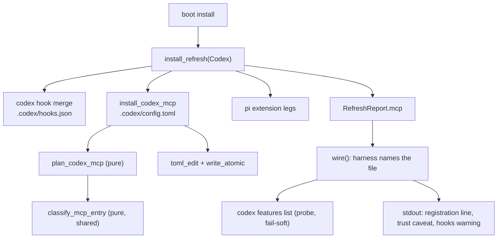
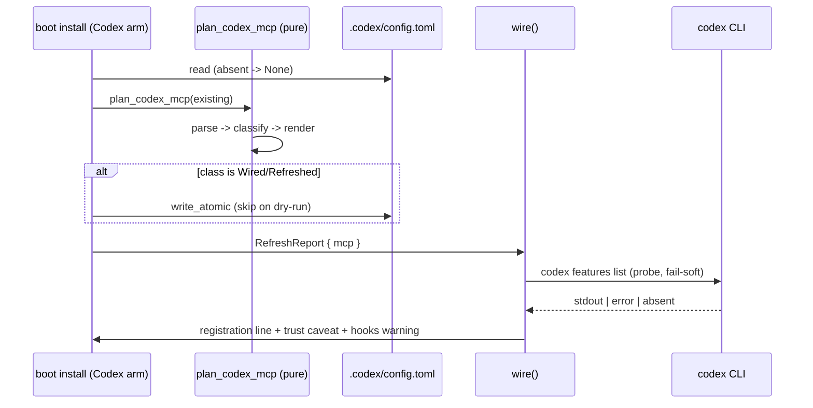

<!-- doctrine:section sec-1 -->
## 1. Design Problem

`boot install` registers the doctrine MCP server with **Claude** and with nobody
else. It merges `mcpServers.doctrine` into the project-root `.mcp.json`, and the
`Harness::Codex` arm of the same refresh carries `mcp: RefreshOutcome::None`. A
codex-driven session therefore reaches none of doctrine's MCP tools, and the only
way to close the gap today is for a human to run `codex mcp add doctrine --
doctrine serve --mcp` by hand — which has no scope flag and writes the **user**
layer (`~/.codex/config.toml`), not the project.

Codex reads its MCP servers from a TOML table, `mcp_servers.<id>`, in a
project-scoped `.codex/config.toml`. This design gives `boot install` a second MCP
leg that writes exactly that table, to the same standard the Claude leg already
meets: edit-preserving, idempotent, no-clobber, fail-soft, and disclosed.

The boundary is deliberately narrow. This leg **registers a server**. It does not
write codex's feature flags, does not touch the user layer, and does not add an
MCP tool. Three behaviours specific to codex shape it, all established by
evidence gathered before design:

1. codex does not interpolate `${VAR:-default}` in `command` — it execs the
   string literally, so the Claude leg's portable command cannot be copied.
2. codex hands an MCP child a *filtered* environment, so `DOCTRINE_BIN` survives
   only if the entry whitelists it.
3. codex silently ignores an untrusted project's config layer, so install cannot
   imply that what it wrote is live.

The result is a leg whose command form is portable and machine-path-free, whose
ownership predicate is explicit about which shapes are doctrine's, and whose
output tells the truth about what the harness will and will not do with it.

<!-- doctrine:section sec-2 -->
## 2. Current State

Line references are to `src/boot.rs` at `e569620cd`.

`install_refresh(harness, root, exec, dry_run)` runs one arm per harness. The
**Claude arm** calls `install_mcp` (`:2087`), which reads `.mcp.json`, plans
through `plan_mcp` (`:2034`) and writes through `fsutil::write_atomic` only on
change. `plan_mcp` fuses four steps over a `serde_json::Value`: parse, mutate at
the narrow path `mcpServers.doctrine`, classify, render. Its ownership predicate
`is_doctrine_mcp_entry` (`:2010`) owns two shapes — the current
`PORTABLE_EXEC` command (`${DOCTRINE_BIN:-doctrine}`, `:613`) and a legacy
absolute path whose file name is `doctrine` — and its no-op branch compares the
stored command against `PORTABLE_EXEC` (`:2056`). A foreign or customised
`doctrine` key, a non-object `mcpServers`, or malformed JSON yields the
`PrintedFallback` sentinel, rewritten by `install_mcp` into a manual snippet.

The **Codex arm** (`:1677-1705`) merges `.codex/hooks.json` through
`codex_hook_specs` (`:1308`), passing `CommandForm::Baked` as a literal justified
by this repo's own `.gitignore` (`:2331-2338`), runs the three pi-extension legs,
and sets `mcp: RefreshOutcome::None` (`:1702`). No function resolves a file's
tracking status; the form is a per-call argument.

`RefreshReport` (`:1774`) carries one `mcp: RefreshOutcome` field (`:1787`).
`wire()` (`:2851-2878`) matches it and prints a message naming `MCP_REL`, which is
a constant (`:594`), not a value carried by the outcome. `None` prints nothing.

`boot.rs` contains **no** `toml_edit` usage: every write in the module is
`serde_json` plus `fsutil::write_atomic`. The house edit-preserving TOML seam is
`dep_seq::set_authored_status` (`src/dep_seq.rs:433`, parsing to
`toml_edit::DocumentMut` at `:299`), used by `backlog.rs` and `knowledge.rs`.

`.codex/config.toml` is **not** written by doctrine today.
`write_codex_activation` (`:2684-2712`) only *tells the human* to set
`[features] hooks = true` in it (`:2696`) and to trust the hooks via `/hooks`.
The Claude leg's four pinned assertions on `out.mcp` live at `:5121`, `:5129`,
`:5157` and — the codex-arm line that must flip — `:5170`. `tests/` has no codex
install e2e and `tests/e2e_claude_install.rs` makes no MCP assertion at all.

<!-- doctrine:section sec-3 -->
## 3. Forces & Constraints

| authority | constraint it places on this design |
|---|---|
| ADR-001 (layering) | `boot` is command tier. A shared classification core carries no format and no caller's concept; each arm owns its parse and render. |
| ADR-013 | A change to SPEC-011's requirement text lands through a Revision at close, not by a phase. |
| ADR-019 | Editing a client-owned file is admissible as an integration with minimal footprint — it constrains the justification, not the mechanism. |
| POL-002 facets 1–2 | No host absolute path may land in an artefact a client tracks. Install's `[gitignore].entries` add nothing for `.codex`, so a client's `.codex/config.toml` is tracked. |
| POL-002 facet 3 | A host-tool dependency must be **declared**, never silent. The portable form runs through a POSIX `sh`. |
| POL-003 facets 1–2 | Codex vocabulary (`mcp_servers`, `env_vars`, `command`, `args`) stays at the codex edge, and correctness may not rest on an incidental harness seam — `.codex/config.toml`'s shape and `codex features list`'s output are both version-varying. |
| POL-003 facet 3 | The supplement is opt-in and **disclosed**: report what was wired, name any step that remains, and do not claim an entry is active while codex still requires project trust. |
| STD-001 | Every recurring literal gets one named constant; the emitted-form set is where duplication would drift. |
| STD-003 | Not textually binding here (its scope fence excludes client-owned harness config); its disclosure *principle* is honoured through POL-003 facet 3. |
| SPEC-011 REQ-185 / REQ-186 | The leg rides the pure-plan/imperative-apply split and the ownership-predicate merge posture: preserve foreign keys, refresh a stale owned copy, fail soft with a printed snippet. |
| SPEC-011 REQ-477 | Reporting obligations — the leg reports its own outcome. |
| SPEC-011 REQ-479 | A codex leg gets its own requirement member; it is not folded into a Claude-arm requirement. |
| SPEC-009 / PRD-006 | The manifest decides trackedness; install never overwrites a file it cannot interpret (PRD-006's never-overwrite is refined, not carved out, by the ownership-aware merge). |
| IMP-249 / dispatch posture | In the jail and in dispatch, PATH `doctrine` is a read-only, possibly stale binary; `DOCTRINE_BIN` is how agents point at the right one. The codex entry must keep that override working. |

Gap the design inherits rather than closes: **no requirement covers MCP
registration for either harness.** The Claude arm shipped under a chore. A
SPEC-011 revision is owed at close (see §6).

<!-- doctrine:section sec-4 -->
## 4. Guiding Principles

1. **Portable, not baked.** The entry names no machine path. The override that a
   host needs rides `DOCTRINE_BIN`, and where a shell is required to read it, the
   dependency is declared rather than assumed.
2. **The comparator tracks what is written.** A no-op branch compares the stored
   entry against the constants the installer emits, never against a
   hand-spelled variant — the failure mode this codebase has already paid for.
3. **Judgement shared, formats bespoke.** The classification of an existing entry
   (absent / ours-current / ours-stale / foreign / malformed) is one pure function
   both arms call. Parsing, mutating and rendering stay per-arm.
4. **Never clobber, never pretend.** A file doctrine cannot interpret is left
   alone and a snippet is printed; a degraded read names its reason; a skip is
   reported as a skip, distinct from nothing-to-do.
5. **Impurity at the edge.** The planner is pure over text; the file read, the
   atomic write and the harness probe are shell seams, injectable so tests need
   neither a real codex nor a real file.

<!-- doctrine:section sec-5 -->
## 5. Proposed Design

### 5.1 System Model

The leg hangs off the existing per-harness refresh, beside the codex hook merge,
and reports through the existing report seam.



The classification function is the only shared element with the Claude leg; it
takes booleans, returns a class, and knows nothing about JSON or TOML.

### 5.2 Interfaces & Contracts

New constants beside `MCP_REL` / `MCP_SERVER_KEY` (STD-001), each used by exactly
one meaning:

```rust
const CODEX_CONFIG_REL: &str = ".codex/config.toml";
const CODEX_MCP_TABLE: &str = "mcp_servers";
const CODEX_MCP_SHELL: &str = "sh";
const CODEX_MCP_SHELL_ARGS: [&str; 2] = ["-c", CODEX_MCP_WRAPPER];
const CODEX_MCP_WRAPPER: &str = "exec \"${DOCTRINE_BIN:-doctrine}\" serve --mcp";
const CODEX_MCP_ENV: &str = "DOCTRINE_BIN";
const CODEX_HOOKS_FEATURE: &str = "hooks";
```

Shared classification (pure, format-blind):

```rust
pub(crate) enum McpEntryClass { Absent, OwnedCurrent, OwnedStale, Foreign, Malformed }

/// present: the server key exists; owned: a predicate claims it; current: it
/// equals the emitted constants. Absent + owned is impossible; the table maps the
/// remaining combinations onto one class.
fn classify_mcp_entry(present: bool, owned: bool, current: bool) -> McpEntryClass;
```

Codex planner and shell (pure planner; thin imperative shell):

```rust
struct CodexMcpPlan { class: McpEntryClass, new_toml: Option<String> }

/// Pure over text: parse, classify, render. Malformed TOML, a non-table
/// `mcp_servers`, or a non-table `doctrine` entry all yield Malformed with no
/// rendered output.
fn plan_codex_mcp(existing_toml: Option<&str>) -> CodexMcpPlan;

/// Read -> plan -> write_atomic on change (unless dry_run). Rides beside
/// install_codex_hook in the Codex arm, exactly as install_mcp rides beside the
/// Claude hook write.
fn install_codex_mcp(root: &Path, dry_run: bool) -> anyhow::Result<RefreshOutcome>;

/// Ownership: the wrapper trio (command == "sh", args == CODEX_MCP_SHELL_ARGS,
/// env_vars containing CODEX_MCP_ENV) is current; a plain `doctrine` command with
/// args ["serve", "--mcp"] is ours but stale; anything else is foreign.
fn is_doctrine_codex_mcp_entry(entry: &toml_edit::Item) -> (bool, bool); // (owned, current)
```

Harness probe (the one new subprocess), split pure/imperative:

```rust
enum HooksState { Enabled, Disabled, Unknown(String) }

/// Pure: read `codex features list` output. The row whose first token is `hooks`
/// contributes its final token: "true" -> Some(true), "false" -> Some(false),
/// anything else / no row -> None.
fn parse_codex_features(stdout: &str) -> Option<bool>;

/// Imperative: run the probe through an injected runner so tests never need a
/// real codex; any failure (absent binary, non-zero exit) becomes
/// Unknown(reason).
fn codex_hooks_state(run: &impl CommandRunner) -> HooksState;
```

`install_refresh`'s Codex arm replaces `mcp: RefreshOutcome::None` with
`mcp: install_codex_mcp(root, dry_run)?`. `wire()` selects the reported file from
the harness it already holds (`Harness::Codex => CODEX_CONFIG_REL`, otherwise
`MCP_REL`), and for the codex arm prints the trust caveat and, when the harness
ran and something was wired, the hooks warning.

### 5.3 Data, State & Ownership

The emitted table, exactly (one blank-line-separated block, appended after
existing tables):

```toml
[mcp_servers.doctrine]
command = "sh"
args = ["-c", "exec \"${DOCTRINE_BIN:-doctrine}\" serve --mcp"]
env_vars = ["DOCTRINE_BIN"]
```

- **Ownership.** The installer owns the key `doctrine` under `mcp_servers`, in
  the two shapes §5.2 names. Every other key in the file — `[features]`,
  comments, unrelated tables — is user-owned and survives byte-for-byte, because
  the mutation is a `toml_edit` narrow-path edit, not a round-trip.
- **No `Baked` variant.** The entry is portable unconditionally, mirroring
  `plan_mcp`, which is likewise form-blind. This is a deliberate departure from
  the codex *hook* leg's hardcoded `Baked`: there is no tracking-status resolver
  to reuse, and a committed-shaped artefact is the safe answer under both
  trackedness outcomes.
- **State.** The only state is the file. No new runtime state, no new cache, no
  watermark; the planner is a function of the file's bytes.

### 5.4 Lifecycle, Operations & Dynamics



Ordering notes:

- The MCP leg is **independent** of the hook merge: it writes a different file,
  so no ordering guard is needed between them. The leg still distinguishes
  *did-not-attempt* from *nothing-to-do* in its outcome, so a soft failure cannot
  read as success.
- A malformed file yields `PrintedFallback` with a TOML snippet; the file is not
  opened for writing. Install continues and the run ends green — the leg's
  failure mode is disclosure, not error (SPEC-011 REQ-186).
- The probe runs only for the codex arm and only when the leg produced something
  to report; it never gates the write, never fails the run, and its three
  outcomes are handled asymmetrically — `Enabled` is silent, `Disabled` warns
  naming `[features] hooks = true`, `Unknown(reason)` warns naming the reason.
- A second install over an unchanged file produces `RefreshOutcome::None` and no
  write.

### 5.5 Invariants, Assumptions & Edge Cases

**Invariants**

1. The written entry contains no host absolute path (POL-002 facets 1–2).
2. The no-op comparator compares against the same constants the renderer uses.
3. A foreign or customised `doctrine` entry is never modified.
4. A file that does not parse is never rewritten.
5. The leg's outcome is reported; a skip is disclosed, never silent.
6. No install path writes the user layer (`~/.codex/config.toml`).

**Assumptions** (probe-verified on codex 0.155.1 unless noted)

- The project layer may override `mcp_servers`, and `.codex/config.toml` is that
  layer.
- `command = "sh"` resolves from PATH rather than a project-local `sh`.
- codex executes `command` literally and forwards only whitelisted env.

**Edge cases** the suite must pin

| case | expected |
|---|---|
| file absent | file created (parent dir ensured), entry written, `Wired` |
| file present, no `mcp_servers` | table added, siblings and comments intact |
| entry present and current | `None`, no write |
| entry present, current command but `env_vars` missing/short | `Refreshed` (the override is dead without it) |
| entry a plain `doctrine` command | `Refreshed` to the wrapper form |
| entry with a different command, args, or extra keys | `PrintedFallback`, file untouched |
| `mcp_servers` present but not a table | `PrintedFallback`, file untouched |
| TOML does not parse | `PrintedFallback`, file untouched |
| file carries `[features] hooks = true` and comments | preserved byte-for-byte |
| `codex` absent, or `features list` fails | `Unknown(reason)` warning; install still succeeds |
| `hooks` row absent or columns unexpected | `Unknown(reason)` warning; install still succeeds |
| `DOCTRINE_BIN` unset at run time | entry still correct; the wrapper falls back to PATH `doctrine` |

<!-- doctrine:section sec-6 -->
## 6. Open Questions & Unknowns

None blocking. The five design questions IMP-111 carried are settled (§7). What
remains is placement and observation, not design:

- **Where the shell declaration lands.** POL-002 facet 3 requires the `sh`
  dependency be named in README/install documentation. The site is a plan-level
  choice (which document, which wording), not a design question.
- **Whether `codex features list` is cwd-sensitive.** The probe runs in the
  harness's working directory. Verified shape, unverified scope: it is treated as
  a best-effort read whose unrecognised output degrades to `Unknown`, so the
  answer cannot change the design.
- **A third harness.** Cursor (IMP-245) inherits the same question; the shared
  classification is the seam that makes its planner cheap.
- **Requirements coverage.** No SPEC-011 member covers MCP registration for
  either harness; a Revision lands at close (ADR-013).

<!-- doctrine:section sec-7 -->
## 7. Decisions, Rationale & Alternatives

Each decision is an accepted record; this section carries the current meaning and
the alternatives considered, not the chronology.

| decision | chosen | record |
|---|---|---|
| Command form | Portable `${DOCTRINE_BIN:-doctrine}` executed through `sh -c`, with `env_vars = ["DOCTRINE_BIN"]`; the POSIX-shell dependency is declared (POL-002 facet 3). | DEC-323 |
| Ownership & emitted-form set | Own the wrapper trio (current) and the plain `doctrine` literal (stale, migrated to the wrapper); the `env_vars` clause is part of current; comparator tests the emitted constants. | DEC-324 |
| Sharing boundary | Separate pure planner and shell per arm; one shared `McpEntryClass` enum and decision table. | DEC-328 |
| Report seam | One `mcp` field; `wire()` names the file from the harness; `PrintedFallback` keeps carrying its own file. | DEC-325 |
| Disclosure & file ownership | Register MCP only — never `[features] hooks = true`; probe the harness (`codex features list`) and warn on `false` or unknown; disclose the trust-gated skip. | DEC-329 |

Rejected alternatives, kept because they will be proposed again: baking an
absolute path (POL-002, and untracked-vs-tracked is unresolvable without a
resolver that does not exist); the literal `doctrine` command alone (loses the
override that the jail and dispatch depend on, IMP-249); reading
`[features] hooks` out of the project file (wrong by construction — the effective
value may come from the user layer); and threading the MCP leg through the
owner-locked hook merge core rather than sitting beside it.

<!-- doctrine:section sec-8 -->
## 8. Risks & Mitigations

| risk | why it bites | mitigation |
|---|---|---|
| Comparator/migration thrash | A no-op branch testing a form the renderer does not emit rewrites the file on every install — the SL-195 `F-1` failure. | Comparator reads the emitted constants; the emitted-form matrix is a named unit-test set (§9). |
| Parallel planner divergence | Two hand-maintained copies of "what is stale vs foreign" drift silently. | One shared classification function; a table-driven purity test over its inputs. |
| Clobbering a user-owned file | `.codex/config.toml` holds `[features]`, comments and user keys. | `toml_edit` narrow-path mutation; a byte-preservation assertion in the e2e. |
| Silent trust-gated skip | codex ignores an untrusted project's layer with no prompt and no error, so a written entry can look live while doing nothing. | Disclosure in the install output (POL-003 facet 3). |
| Resting on an incidental seam | Both the TOML shape and `features list` output are version-varying. | Unrecognised content degrades to a named `Unknown`; nothing is gated on the probe; the planner fails soft. |
| Dead override | Without `env_vars` the wrapper silently falls back to PATH `doctrine` — the stale read-only binary in the jail. | `env_vars` membership is part of the current-shape test, so a wrapper without it is refreshed. |
| Undeclared host dependency | The `sh` wrapper acquires a POSIX shell on the default path. | Declared per POL-002 facet 3 (§6). |
| Test fixtures that cannot fail | An absence assertion over an unwritten file, or an ownership fixture seeded by a real installer, passes for the wrong reason. | Positive controls in the same test; ownership fixtures seeded literally with a `doctrine`-named program. |

<!-- doctrine:section sec-9 -->
## 9. Quality Engineering & Validation

**Unit — planner, mirroring the eight `plan_mcp_*` cases one-to-one** (plus the
emitted-form matrix): absent → `Wired`; current → `None`; current-command-but-
missing-`env_vars` → `Refreshed`; plain-literal legacy → `Refreshed`; foreign
command/args/extra keys → `PrintedFallback`; `mcp_servers` non-table →
`PrintedFallback`; unparseable TOML → `PrintedFallback`; sibling servers and
`[features]` preserved.

**Unit — shared classification.** A table-driven test over
`(present, owned, current)` covering all reachable combinations, asserting that
`Absent` and `owned` cannot coexist and that each class maps to exactly one
outcome.

**Unit — probe.** `parse_codex_features` against the verified codex 0.155.1 shape
(`hooks  stable  true` / `false`), an absent row, an unexpected column count, and
garbage; `codex_hooks_state` through an injected runner returning success,
failure, and absence, asserting each becomes `Unknown(reason)` with a
non-empty reason. No test requires a real codex on `PATH`.

**Integration — codex install.** A new e2e (there is none today; the Claude e2e
makes no MCP assertion). Seed a project with a `.codex` marker and a
`config.toml` carrying `[features] hooks = true` and a comment; run the codex
install; assert the emitted entry equals the §5.3 block, that the pre-existing
keys and comment survive byte-for-byte, and that a second run reports nothing to
do. Ownership fixtures are seeded literally, and every absence assertion carries
a positive control in the same test.

**Verification alignment.**

- Existing Claude assertions (`:5121`, `:5129`, `:5157`) are unchanged by design;
  the only flip is the codex-arm expectation at `:5170`.
- A no-host-abspath assertion extends the existing portable-command discipline to
  the codex file.
- `doctrine check gate` at close (a fresh binary against the real corpus).
- A SPEC-011 Revision (`FR-012`) is raised at reconcile; until it lands, coverage
  reports the surface undelivered — expected, not a defect.

**Code impact.** The leg is small; the surface it touches is enumerated here
because the plan's selectors are drawn from it.

| path | change |
|---|---|
| `src/boot.rs` | new constants and the `McpEntryClass` classification function; `plan_codex_mcp` / `is_doctrine_codex_mcp_entry` / `install_codex_mcp`; the harness probe (`parse_codex_features`, `codex_hooks_state`, the injectable runner); the Codex arm's `mcp` outcome; `wire()`'s per-harness file name, trust caveat and hooks warning |
| `src/boot.rs` (tests) | the mirrored planner suite, the classification table test, the probe tests, and the flip of the codex-arm expectation at `:5170` |
| `tests/e2e_codex_install.rs` (new) | codex install e2e: entry shape, byte-preservation of `[features]` and comments, idempotent second run |
| `README.md`, `install/` docs | the POL-002 facet 3 declaration of the `sh` dependency |
| `.doctrine/spec/tech/011/**` | touched only at reconcile, by the `FR-012` Revision — never by a phase |

