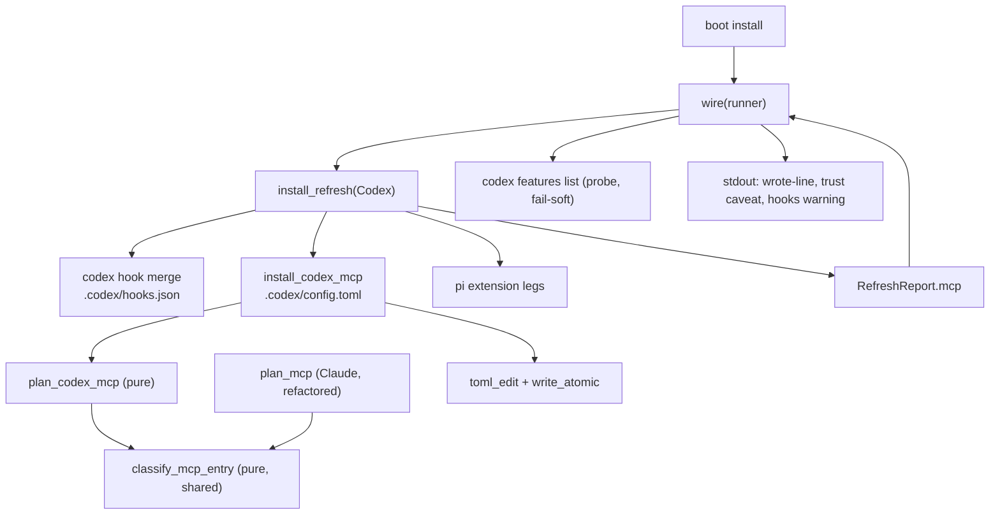

<!-- doctrine:section sec-1 -->
## 1. Design Problem

`boot install` registers the doctrine MCP server with **Claude** and with nobody
else. It merges `mcpServers.doctrine` into the project-root `.mcp.json`, and the
`Harness::Codex` arm of the same refresh carries `mcp: RefreshOutcome::None`. A
codex-driven session therefore reaches none of doctrine's MCP tools, and the only
way to close the gap today is for a human to run `codex mcp add doctrine --
doctrine serve --mcp` by hand — which has no scope flag and writes the **user**
layer (`~/.codex/config.toml`), not the project.

Codex reads its MCP servers from a TOML table, `mcp_servers.<id>`, in a
project-scoped `.codex/config.toml`. This design gives `boot install` a second MCP
leg that writes exactly that table, to the same standard the Claude leg already
meets: edit-preserving, idempotent, no-clobber, fail-soft, and disclosed.

The boundary is deliberately narrow. This leg **registers a server**. It does not
write codex's feature flags, does not touch the user layer, and does not add an
MCP tool. Three behaviours specific to codex shape it, all established by
evidence gathered before design:

1. codex does not interpolate `${VAR:-default}` in `command` — it execs the
   string literally, so the Claude leg's portable command cannot be copied.
2. codex hands an MCP child a *filtered* environment, so `DOCTRINE_BIN` survives
   only if the entry whitelists it.
3. codex silently ignores an untrusted project's config layer, so install cannot
   imply that what it wrote is live.

The result is a leg whose command form is portable and machine-path-free, whose
ownership predicate is explicit about which shapes are doctrine's, and whose
output tells the truth about what the harness will and will not do with it.

<!-- doctrine:section sec-2 -->
## 2. Current State

Line references are to `src/boot.rs` at `e569620cd`.

`install_refresh(harness, root, exec, dry_run)` runs one arm per harness. The
**Claude arm** calls `install_mcp` (`:2087`), which reads `.mcp.json`, plans
through `plan_mcp` (`:2034`) and writes through `fsutil::write_atomic` only on
change. `plan_mcp` fuses four steps over a `serde_json::Value`: parse, mutate at
the narrow path `mcpServers.doctrine`, classify, render. Its ownership predicate
`is_doctrine_mcp_entry` (`:2010`) owns two shapes — the current
`PORTABLE_EXEC` command (`${DOCTRINE_BIN:-doctrine}`, `:613`) and a legacy
absolute path whose file name is `doctrine` — and its no-op branch compares the
stored command against `PORTABLE_EXEC` (`:2056`). A foreign or customised
`doctrine` key, a non-object `mcpServers`, or malformed JSON yields the
`PrintedFallback` sentinel, rewritten by `install_mcp` into a manual snippet.

The **Codex arm** (`:1677-1705`) merges `.codex/hooks.json` through
`codex_hook_specs` (`:1308`), passing `CommandForm::Baked` as a literal justified
by this repo's own `.gitignore` (`:2331-2338`), runs the three pi-extension legs,
and sets `mcp: RefreshOutcome::None` (`:1702`). No function resolves a file's
tracking status; the form is a per-call argument.

`RefreshReport` (`:1774`) carries one `mcp: RefreshOutcome` field (`:1787`).
`wire()` (`:2851-2878`) matches it and prints a message naming `MCP_REL`, which is
a constant (`:594`), not a value carried by the outcome. `None` prints nothing.

`boot.rs` contains **no** `toml_edit` usage: every write in the module is
`serde_json` plus `fsutil::write_atomic`. The house edit-preserving TOML seam is
`dep_seq::set_authored_status` (`src/dep_seq.rs:433`, parsing to
`toml_edit::DocumentMut` at `:299`), used by `backlog.rs` and `knowledge.rs`.

`.codex/config.toml` is **not** written by doctrine today.
`write_codex_activation` (`:2684-2712`) only *tells the human* to set
`[features] hooks = true` in it (`:2696`) and to trust the hooks via `/hooks`.
The Claude leg's four pinned assertions on `out.mcp` live at `:5121`, `:5129`,
`:5157` and — the codex-arm line that must flip — `:5170`. `tests/` has no codex
install e2e and `tests/e2e_claude_install.rs` makes no MCP assertion at all.

<!-- doctrine:section sec-3 -->
## 3. Forces & Constraints

| authority | constraint it places on this design |
|---|---|
| ADR-001 (layering) | `boot` is command tier. A shared classification core carries no format and no caller's concept; each arm owns its parse and render. |
| ADR-013 | A change to SPEC-011's requirement text lands through a Revision. This slice does not *wait* on that change — the Revision retro-describes behaviour that ships here — so it carries no `needs` anchor; the reason is recorded in §9 rather than left implicit. |
| POL-002 facets 1–2 | No host absolute path may land in an artefact a client tracks. Install's `[gitignore].entries` add nothing for `.codex`, so a client's `.codex/config.toml` is tracked. |
| POL-002 facet 3 | A host-tool dependency must be **declared**, never silent. The portable form runs through a POSIX `sh`. |
| POL-003 facets 1–2 | Codex vocabulary (`mcp_servers`, `env_vars`, `command`, `args`) stays at the codex edge. The table's *shape* is a versioned seam: the design records the write as a documented version delta with a follow-up (facet 2's sanctioned outcome) rather than treating it as a stable contract. |
| POL-003 facet 3 | The supplement is opt-in and **disclosed**: report what was written, name any step that remains, and never claim an entry is active while codex still requires project trust or while the write's shape may have moved. |
| STD-001 | Every recurring literal gets one named constant, and where `const` cannot compose, a test pins the copies together. |
| SPEC-011 REQ-186 | The merge posture to match: an ownership predicate over the entry, refreshing a stale owned copy, preserving every foreign hook and key. (Its text is the Claude settings file; it governs here by the posture, with the Claude `.mcp.json` leg as in-repo precedent.) |
| SPEC-011 responsibilities (prose) | The pure-plan/imperative-apply split `boot install` rides — a responsibility, not a requirement member. |
| SPEC-011 REQ-479 | **Precedent, not authority**: the codex hook-registry leg shows a codex-specific surface getting its own member. Citing it as the *rule* would misread it. |
| SPEC-011 REQ-480 | The per-leg reporting pattern: each generated file is reported as its own outcome rather than folded into another leg's line. |
| PRD-006 / SPEC-009 | The manifest decides trackedness; install never overwrites a file it cannot interpret. PRD-006's never-overwrite is refined, not carved out, by the ownership-aware merge. |
| STD-003 | Not textually binding here (its scope fence excludes client-owned harness config); its disclosure *principle* is honoured through POL-003 facet 3. |

**Motivating evidence** (not authority): IMP-249 — in the jail and in dispatch,
PATH `doctrine` is a read-only, possibly stale binary, and `DOCTRINE_BIN` is how
agents point at the right one. And the pre-design probe of codex 0.155.1, which
established the three behavioural facts the design turns on (see IMP-111).

**Analogy, not authority**: ADR-019 decides how doctrine projects the assets it
ships, minimally; it says nothing about mutating a file doctrine does not own.
The merge posture is governed by PRD-006 refined by SPEC-011's ownership-aware
merge, with the Claude `.mcp.json` leg (`src/boot.rs:2034`) as the working
precedent.

Gap the design inherits rather than closes: **no requirement covers MCP
registration for either harness.** The Claude arm shipped under a chore. A
SPEC-011 Revision is owed at close (see §6, §9).

<!-- doctrine:section sec-4 -->
## 4. Guiding Principles

1. **Portable, not baked.** The entry names no machine path. The override a host
   needs rides `DOCTRINE_BIN`, and where a shell is required to read it, the
   dependency is declared rather than assumed.
2. **The comparator tracks what is written.** A no-op branch compares the stored
   entry against the constants the installer emits, never against a
   hand-spelled variant — the failure mode this codebase has already paid for.
3. **Judgement shared, formats bespoke.** The classification of an existing entry
   (absent / ours-current / ours-stale / foreign) is one pure function, and
   **both arms call it**: `plan_codex_mcp` from the start, and `plan_mcp`
   refactored onto it, with the existing `plan_mcp_*` suite unchanged as the
   behaviour-preservation proof. Parsing, mutating and rendering stay per-arm.
4. **Strict ownership.** An entry is ours only in the exact emitted shape. A
   doctored variant — an extra key, an extra argument, a different program — is
   foreign and left alone; doctrine heals its own output, never a user's edit.
5. **Never clobber, never pretend.** A file doctrine cannot interpret is left
   alone and a snippet is printed; a degraded read names its reason; a soft
   failure is disclosed; no line claims activation.
6. **Impurity at the edge.** The planner is pure over text; the file read, the
   atomic write and the harness probe are shell seams, injectable so tests need
   neither a real codex nor a real config file.

<!-- doctrine:section sec-5 -->
## 5. Proposed Design

### 5.1 System Model

The leg hangs off the existing per-harness refresh, beside the codex hook merge,
and reports through the existing report seam. `wire()` is the caller: it runs the
refresh and receives the resulting report.



The classification function is the one shared element between the arms: it takes
booleans, returns a class, and knows nothing about JSON or TOML.

### 5.2 Interfaces & Contracts

New constants beside `MCP_REL` (STD-001). `const` cannot compose strings, so the
constants each hold their own literal and **the test pins them together**:

```rust
const CODEX_CONFIG_REL: &str = ".codex/config.toml";
const CODEX_MCP_TABLE: &str = "mcp_servers";
const CODEX_MCP_SERVER_KEY: &str = "doctrine";   // pinned == MCP_SERVER_KEY
const CODEX_MCP_SHELL: &str = "sh";
const CODEX_MCP_SHELL_FLAG: &str = "-c";
const CODEX_MCP_SERVE_ARGS: &str = "serve --mcp";
const CODEX_MCP_WRAPPER: &str = "exec \"${DOCTRINE_BIN:-doctrine}\" serve --mcp";
const CODEX_MCP_ENV: &str = "DOCTRINE_BIN";
const CODEX_HOOKS_FEATURE: &str = "hooks";
```

Shared classification — **total over parsed input**, with no `Malformed` arm and
no refusal channel:

```rust
pub(crate) enum McpEntryClass { Absent, OwnedCurrent, OwnedStale, Foreign }

/// `owned` is derived by the caller FROM presence, so `Absent` with `owned` is
/// unreachable by construction; the function maps the reachable combinations and
/// has no error path of its own. Malformed is NOT here — it is a parse outcome,
/// decided by each planner before classification (the `plan_mcp` sentinel shape).
fn classify_mcp_entry(present: bool, owned: bool, current: bool) -> McpEntryClass;
```

Codex planner and shell. Malformed is planned, not classified:

```rust
/// Malformed covers: unparseable TOML, `mcp_servers` not a table, the `doctrine`
/// entry not a table. In that case `new_toml` is None and the file is never
/// opened for writing. No path indexes `args` without a length check first.
struct CodexMcpPlan { class: Result<McpEntryClass, Malformed>, new_toml: Option<String> }

fn plan_codex_mcp(existing_toml: Option<&str>) -> CodexMcpPlan;
fn install_codex_mcp(root: &Path, dry_run: bool) -> anyhow::Result<RefreshOutcome>;

/// The manual snippet for the fallback path — the `[mcp_servers.doctrine]`
/// table in TOML, never the JSON block `mcp_fallback_snippet` emits.
fn codex_mcp_fallback_snippet() -> String;
```

Ownership is strict and stated as a formula. With `t` the entry table:

```text
owned = t has keys ⊆ {command, args, env_vars}
     && t.command == "sh"
     && t.args.len() == 2 && t.args[0] == "-c"
     && is_doctrine_wrapper_line(normalise(t.args[1]))
current = owned
     && t.env_vars is an array containing CODEX_MCP_ENV
     && normalise(t.args[1]) == CODEX_MCP_WRAPPER

normalise(l) = l.trim() with internal whitespace runs collapsed to one space
is_doctrine_wrapper_line(l) = l == format!("exec \"{}\" {}", program, CODEX_MCP_SERVE_ARGS)
    where `program` is extracted from the single quoted span and must BE
    PORTABLE_EXEC (the abspath arm is deliberately absent — this leg has only
    ever emitted the portable form)
```

The length check precedes every index: `args = []` and `args = ["-c"]` are
`Foreign`, never a panic. Extra keys or a third argument make the entry foreign —
doctrine heals its own output, never a user's edit. `owned && !current` is
`OwnedStale`: a wrapper missing the whitelist, or carrying an earlier wording,
refreshes.

The probe, split pure/imperative, over a capture-capable seam that the existing
installer runner cannot provide (it uses `.status()` and inherits stdio):

```rust
struct Capture { success: bool, stdout: String, stderr: String }

/// The seam `wire()` takes as a parameter. `install::CaptureRunner` is the
/// default implementation (Command::output()); tests inject a fake.
trait CommandRunner { fn run_capture(&self, program: &str, args: &[&str]) -> anyhow::Result<Capture>; }

enum HooksState { Enabled, Disabled, Unknown(String) }

/// Pure. The row whose first token is `hooks` contributes its final token:
/// "true" -> Some(true), "false" -> Some(false); no row or any other shape -> None.
/// `stdout` is read regardless of `success`: a failed command that still printed
/// a parseable row is a usable answer, and `stderr` is available for the reason.
fn parse_codex_features(stdout: &str) -> Option<bool>;
fn codex_hooks_state(run: &dyn CommandRunner) -> HooksState;
```

`install_refresh`'s Codex arm replaces `mcp: RefreshOutcome::None` with
`mcp: install_codex_mcp(root, dry_run)?`. `wire()` gains the runner parameter and
selects the reported file from the harness it holds (`Harness::Codex =>
CODEX_CONFIG_REL`, otherwise `MCP_REL`), carrying the full rendered invocation so
neither arm re-appends arguments. The codex messages state what was **written**,
not that the harness has activated it:

```text
registered MCP server in .mcp.json: <invocation>                    (Claude)
wrote MCP server registration in .codex/config.toml: <wrapper line>
would write MCP server registration in .codex/config.toml: <wrapper line>   (dry_run)
an existing doctrine entry in .codex/config.toml was left untouched —
register manually if it is not yours
```

### 5.3 Data, State & Ownership

The emitted table, exactly:

```toml
[mcp_servers.doctrine]
command = "sh"
args = ["-c", "exec \"${DOCTRINE_BIN:-doctrine}\" serve --mcp"]
env_vars = ["DOCTRINE_BIN"]
```

- **Placement.** The mutation is a `toml_edit` narrow-path insert at
  `["mcp_servers"]["doctrine"]`, creating `mcp_servers` when absent. When the
  parent table is absent the new table is appended at the document's end;
  otherwise it lands adjacent to `mcp_servers`, not at the end of the file.
- **Preservation.** Unrelated keys, tables and comments are preserved: the edit
  is narrow-path, not a typed round-trip. The claim is scoped to preservation,
  not to byte-for-byte identity of the whole file.
- **Ownership.** Strict (§5.2): the exact emitted shape only. Other keys, other
  tables, and any `doctrine` entry that is not our wrapper — including the naive
  plain-command form, `/bin/sh`, a baked abspath, or our shape plus an extra key —
  are user-owned and never modified.
- **No `Baked` variant.** The entry is portable unconditionally, mirroring
  `plan_mcp`, which is likewise form-blind. This departs deliberately from the
  codex *hook* leg's hardcoded `Baked`: there is no tracking-status resolver to
  reuse, and the portable shape is safe under both trackedness outcomes.
- **State.** The only state is the file. No new runtime state, no cache, no
  watermark; the planner is a function of the file's bytes.

### 5.4 Lifecycle, Operations & Dynamics

```mermaid
sequenceDiagram
  participant W as wire(runner)
  participant I as install_refresh (Codex arm)
  participant P as plan_codex_mcp (pure)
  participant F as .codex/config.toml
  participant C as CommandRunner (install::CaptureRunner)
  W->>I: refresh(harness, root, exec, dry_run)
  I->>F: read (absent -> None)
  I->>P: plan_codex_mcp(existing)
  P->>P: parse -> classify -> render
  alt class is OwnedCurrent
    Note over I: RefreshOutcome::None, no write, no output
  else class is Absent or OwnedStale
    I->>F: write_atomic (skipped when dry_run)
  else Err(Malformed) or Foreign
    Note over I: PrintedFallback + TOML snippet, file untouched
  end
  I-->>W: RefreshReport { mcp }
  alt h is Codex AND outcome is Wired or Refreshed AND not dry_run
    W->>C: codex features list (fail-soft)
    C-->>W: Capture { success, stdout, stderr }
    W->>W: print wrote-line + trust caveat; warn unless Enabled
  end
```

Ordering and disclosure rules:

- The MCP leg is **independent** of the hook merge: it writes a different file,
  so no ordering guard is needed between them. The disclosure of a soft failure
  is carried by `PrintedFallback` (nothing was written) as distinct from `None`
  (already current). The outcome type is unchanged; the design adds no
  "did not attempt" variant, because the existing pair already carries the
  distinction.
- A malformed file yields `PrintedFallback` with a TOML snippet and no write.
  Install continues and the run ends green: the leg's failure mode is disclosure,
  not error (SPEC-011 REQ-186). A foreign entry yields the same path with the
  "left untouched" wording, and a repeat install produces the same stable line
  rather than a fresh instruction.
- **Exact disclosure predicate.** The probe and both riders fire iff
  `h == Harness::Codex && matches!(report.mcp, Wired | Refreshed) && !dry_run`.
  The probe warns only when the state is not `Enabled`: `Disabled` warns naming
  `[features] hooks = true`; `Unknown(reason)` warns with the reason. No probe
  runs for a Claude install, and none under `dry_run`.
- The trust caveat states that codex loads project-scoped config only for trusted
  projects and that an untrusted project's layer is skipped silently, so a
  `Wired` report is a statement about the file, never about activation.
- Under `dry_run` both this line and the pre-existing hook activation notice say
  **would write**; no output under `dry_run` contains "wrote".
- A second install over an unchanged file produces `RefreshOutcome::None`, no
  write, and no output.

### 5.5 Invariants, Assumptions & Edge Cases

**Invariants**

1. The written entry contains no host absolute path (POL-002 facets 1–2).
2. The no-op comparator compares against the same constants the renderer uses.
3. An entry that is not exactly our emitted shape is never modified.
4. A file that does not parse, or whose `mcp_servers` shape is not a table, is
   never rewritten.
5. No planner path indexes `args` without checking its length, and no input
   aborts the install.
6. The leg's outcome is reported, and a soft failure is disclosed as such.
7. No install path writes the user layer (`~/.codex/config.toml`).
8. No output line claims activation, and none says "wrote" under `dry_run`.

**Assumptions** (probe-verified on codex 0.155.1 unless noted)

- The project layer may override `mcp_servers`, and `.codex/config.toml` is that
  layer. Re-verification against the live reference is a follow-up (POL-003
  facet 2 records the seam as a version delta).
- `sh` resolves through the PATH codex gives the server (its whitelisted
  environment) — **decided**, not assumed away: the only shadowing vector is a
  PATH entry containing the project directory, which the install caveat names as
  a residual.
- codex executes `command` literally and forwards only whitelisted env. The
  installer asserts only the emitted string; the runtime behaviour of
  `${DOCTRINE_BIN:-doctrine}` is codex's, and is not testable from doctrine.

**Edge cases** the suite must pin

| case | expected |
|---|---|
| file absent | file created (parent dir ensured), entry written, `Wired` |
| file present, no `mcp_servers` | table added, siblings and comments intact |
| entry present and current | `None`, no write, no output |
| wrapper, right command, `env_vars` missing/short | `Refreshed` |
| wrapper from an earlier doctrine wording or whitespace | `Refreshed` |
| `command = "sh"`, `args = []` or `["-c"]` | `Foreign`, no panic, file untouched |
| plain `command = "doctrine"` | `Foreign`, "left untouched" line, file untouched |
| `/bin/sh`, or a wrapped baked abspath | `Foreign`, file untouched |
| our shape plus an extra key or a third argument | `Foreign`, file untouched |
| `mcp_servers` present but not a table | `PrintedFallback`, file untouched |
| TOML does not parse | `PrintedFallback`, file untouched |
| file carries `[features] hooks = true` and comments | both preserved |
| `codex` absent, `features list` fails, or the row is unrecognised | `Unknown(reason)` warning; install still succeeds |
| `DOCTRINE_BIN` unset at run time | emitted string unchanged; runtime fallback is codex's behaviour |

<!-- doctrine:section sec-6 -->
## 6. Open Questions & Unknowns

None blocking. The five design questions IMP-111 carried are settled (§7). What
remains is placement, observation, and recorded follow-ups:

- **Where the shell declaration lands.** POL-002 facet 3 requires the `sh`
  dependency be named in README/install documentation. The site is a plan-level
  choice (which document, which wording), not a design question.
- **The Revision's shape and timing.** One Specification Revision introducing
  **two** members — one retro-covering the shipped Claude `.mcp.json` arm, one for
  the codex `mcp_servers` leg — with their durable `REQ` ids minted by the
  Revision. Phases do **not** wait on it; close requires it landed or a recorded
  waiver (the ADR-013 obligation is discharged at the boundary that owns it).
  The plan cites the ids only once minted, so it schedules the Revision before
  the phase that must cite it.
- **Post-write verification.** Whether a later phase adds a harness-side check
  that the written table is the one codex reads (`codex mcp get doctrine`) is a
  follow-up, not part of this leg: the shape is a versioned seam (POL-003
  facet 2), and the report claims only what doctrine wrote.
- **`codex features list` scope.** Whether the output is cwd-sensitive is
  unverified; the probe treats unrecognised output as `Unknown`, so the answer
  cannot change the design.
- **A third harness.** Cursor (IMP-245) inherits the same question; the shared
  classification is the seam that makes its planner cheap.

<!-- doctrine:section sec-7 -->
## 7. Decisions, Rationale & Alternatives

Each decision is an accepted record; this section carries the current meaning and
the alternatives considered, not the chronology.

| decision | chosen | record |
|---|---|---|
| Command form | Portable `${DOCTRINE_BIN:-doctrine}` executed through `sh -c`, with `env_vars = ["DOCTRINE_BIN"]`; the POSIX-shell dependency is declared (POL-002 facet 3). | DEC-323 |
| Ownership & emitted-form set | Own the wrapper shape only (`command = "sh"` + our line); `env_vars` membership is part of current; a stale wrapper refreshes. A plain `doctrine` literal, `/bin/sh` and baked abspaths are FOREIGN and left untouched. Comparator tests the emitted constants. | DEC-332 (supersedes the second half of DEC-324) |
| Sharing boundary | Separate pure planner and shell per arm; one shared `McpEntryClass` enum and decision table. | DEC-328 |
| Report seam | One `mcp` field; `wire()` names the file from the harness; `PrintedFallback` keeps carrying its own file. | DEC-325 |
| Disclosure & file ownership | Register MCP only — never `[features] hooks = true`; probe the harness (`codex features list`) and warn on `false` or unknown; disclose the trust-gated skip. | DEC-329 |

The ownership set was narrowed during the adversarial pass (RV-399 F-7): the plain literal is foreign-by-design, not a migration input.

Rejected alternatives, kept because they will be proposed again: baking an
absolute path (POL-002, and untracked-vs-tracked is unresolvable without a
resolver that does not exist); the literal `doctrine` command alone (loses the
override that the jail and dispatch depend on, IMP-249); reading
`[features] hooks` out of the project file (wrong by construction — the effective
value may come from the user layer); and threading the MCP leg through the
owner-locked hook merge core rather than sitting beside it.


<!-- doctrine:section sec-8 -->
## 8. Risks & Mitigations

| risk | why it bites | mitigation |
|---|---|---|
| Comparator/migration thrash | A no-op branch testing a form the renderer does not emit rewrites the file on every install — the SL-195 `F-1` failure. | The comparator reads the emitted constants; ownership is one strict shape; the emitted-form matrix and the constants-agreement test make drift fail loudly. |
| Parallel planner divergence | Two hand-maintained copies of "what is stale vs foreign" drift silently. | One shared classifier both arms call, with the existing `plan_mcp_*` suite as the unchanged behaviour-preservation proof. |
| Panic instead of fail-soft | Indexing `args` on a hand-written short entry aborts `install_refresh` — the opposite of the never-clobber posture. | Every index is length-guarded; short arities are `Foreign`; unit cases pin `args = []` and `["-c"]`. |
| Clobbering a user-owned file | `.codex/config.toml` holds `[features]`, comments and user keys. | Narrow-path `toml_edit` mutation; only the exact emitted shape is owned; an e2e preservation assertion. |
| False or stale claim in output | A written table that codex ignores, a dry-run that says "wrote", or a repeat "register manually" line all misdescribe the state. | The report states what was written; `dry_run` renders "would write"; a foreign entry's repeat output is stable; the trust caveat names the untrusted-project skip. |
| Resting on an incidental seam | `.codex/config.toml`'s shape and `features list`'s output are both version-varying. | Unrecognised probe output degrades to a named `Unknown`; nothing is gated on the probe; the write seam is a recorded version delta with a post-write verification follow-up. |
| Dead override | Without `env_vars` the wrapper silently falls back to the stale PATH binary (IMP-249). | `env_vars` membership is part of `current`, so a wrapper without it refreshes. |
| Undeclared host dependency | The `sh` wrapper acquires a POSIX shell on the default path. | Declared per POL-002 facet 3 (§6). |
| Requirements gap treated as closed | The Revision is raised at reconcile; a reconcile that skips it would close the slice with the surface permanently undelivered. | Close requires the two-member Revision landed or a recorded waiver; phases are allowed to proceed first (SL-250 / RV-350 precedent). |
| Test fixtures that cannot fail | An absence assertion over an unwritten file, a tautological agreement test, or an ownership fixture seeded by a real installer passes for the wrong reason. | Positive controls in the same test; the agreement test compares against a `format!` expectation built from the inputs; ownership fixtures seeded literally; the probe injected. |

<!-- doctrine:section sec-9 -->
## 9. Quality Engineering & Validation

**Unit — codex planner**, mirroring the `plan_mcp_*` cases plus the emitted-form
matrix: absent → `Wired` (file created, parent dir ensured); current → `None`;
wrapper with missing/short `env_vars` → `Refreshed`; wrapper with earlier wording
or stray whitespace → `Refreshed`; `command = "sh"` with `args = []` or `["-c"]`
→ `Foreign` (no panic); plain `doctrine` command → `Foreign`; `/bin/sh` → `Foreign`;
wrapped baked abspath → `Foreign`; our shape plus an extra key or a third argument
→ `Foreign`; `mcp_servers` non-table → `Malformed`; unparseable TOML → `Malformed`;
sibling servers and `[features]` preserved. The fallback unit case asserts the
snippet is the TOML table (§5.2's `codex_mcp_fallback_snippet`), not the Claude
JSON block.

**Unit — shared classification**, table-driven over the reachable
`(present, owned, current)` combinations, asserting each maps to exactly one
class. `Absent + owned` is asserted unreachable by construction (the caller
derives `owned` from presence), so the function needs no refusal channel.
`Malformed` is asserted at the planner, where it originates.

**Unit — Claude behaviour preservation.** The refactored `plan_mcp` keeps the
existing `plan_mcp_*` suite green **unchanged** (boot.rs:5292-5416); that suite,
not a new one, is the proof that moving the decision table into
`classify_mcp_entry` changed no behaviour.

**Unit — constants agreement.** `CODEX_MCP_WRAPPER` equals
`format!("exec \"{}\" {}", PORTABLE_EXEC, CODEX_MCP_SERVE_ARGS)`; the args suffix
is built from `CODEX_MCP_SERVE_ARGS`; `CODEX_MCP_ENV` occurs inside
`PORTABLE_EXEC`; and `CODEX_MCP_SERVER_KEY == MCP_SERVER_KEY`, pinned with the
reason (one server, two harnesses) rather than shared by construction.

**Unit — probe.** `parse_codex_features` against the verified shape
(`hooks  stable  true` / `false`), an absent row, unexpected columns and garbage.
`codex_hooks_state` through an injected runner over **five** cases: success
carrying `hooks ... true` → `Enabled`; success carrying `hooks ... false` →
`Disabled`; success with empty stdout → `Unknown`; **non-zero exit carrying a
parseable row** → the parsed answer; runner error with useful `stderr` →
`Unknown` naming that reason. No test requires a real codex on `PATH`.

**Integration — codex install.** Three cases. (i) A project whose
`.codex/config.toml` carries `[features] hooks = true` and a comment: assert the
emitted entry equals §5.3, the pre-existing keys and comment survive, and a
second run reports nothing to do; (ii) a project with no `.codex/config.toml`:
assert the file and parent directory are created; (iii) `PATH` emptied: this case
uses the **real** `CaptureRunner` (no injection), so the empty `PATH` is what
makes the probe fail, and it asserts the warning carries a non-empty reason.
Cases (i) and (ii) inject the runner. Additional assertions: a foreign entry's
second-run output is stable (not a fresh instruction), and no `dry_run` output
contains the word "wrote" — for the MCP line **and** the pre-existing hook
activation notice. Ownership fixtures are seeded literally, and every absence
assertion carries a positive control in the same test.

**Verification alignment.**

- Existing Claude assertions (`boot.rs:5121`, `:5129`, `:5157`) keep their
  meaning; the codex-arm expectation at `:5170` flips, and a new assertion pins
  that a Claude-only run emits neither the codex caveat nor the hooks warning.
- A no-host-abspath assertion extends the existing portable-command discipline to
  the codex file.
- `doctrine check gate` at close (a fresh binary against the real corpus).
- The two-member Specification Revision is raised at reconcile; **close requires
  it landed or a recorded waiver**, while phases proceed without waiting on it
  (SL-250 / RV-350 precedent). The plan schedules the Revision before the phase
  that cites its `REQ` ids, so nothing cites an id that does not yet exist.

**Impact.**

| path | change |
|---|---|
| `src/boot.rs` | the codex constants; `McpEntryClass` + `classify_mcp_entry`; the `plan_mcp` refactor onto it (behaviour-preservation: existing suite unchanged); `plan_codex_mcp` / `is_doctrine_wrapper_line` / `install_codex_mcp` / `codex_mcp_fallback_snippet`; `parse_codex_features` / `codex_hooks_state`; the Codex arm's `mcp` outcome; `wire()`'s runner parameter, per-harness file name, wrote/would-write wording, foreign wording and dry-run gating; the hook activation notice's dry-run wording; three stale doc comments (`RefreshOutcome:940`, `RefreshReport.mcp:1787`, the `wire` MCP block `:2851`) |
| `src/install.rs` | `CaptureRunner` (`Command::output()`) and the default-injection point; `wire`'s two production call sites (`install::run:414`, `run_install:2645`) |
| `src/boot.rs` (tests) | the codex planner matrix, the classification table test, the constants-agreement test, the five probe cases, the wire-level Claude-only assertion, the dry-run wording assertion, the four existing `wire` call sites (`:6647`, `:6663`, `:6683`, `:6702`) and the `:5170` flip |
| `tests/e2e_codex_install.rs` (new) | preservation + idempotence, create-from-absent, empty-`PATH` `Unknown(reason)` with the real runner |
| `README.md`, `install/` docs | the POL-002 facet 3 declaration of the `sh` dependency |
| `.doctrine/spec/tech/011/**` | touched only at reconcile, by the two-member Revision — never by a phase |

