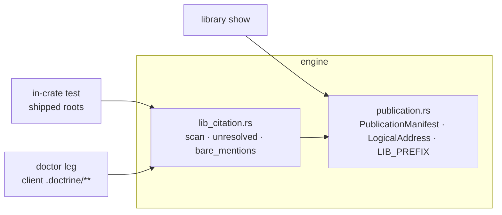
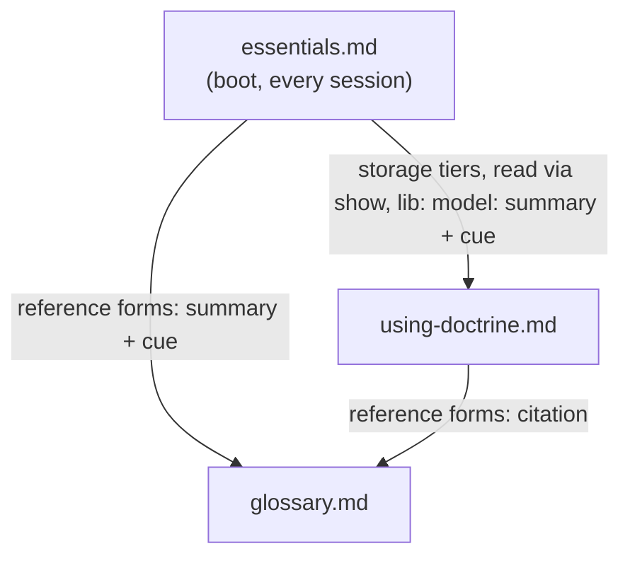

<!-- doctrine:section sec-1 -->
## 1. Design problem

The published reference library (`install/*.md`, read in a client as
`reference/<name>.md` through `doctrine library show`) is now the declared owner of
doctrine's rules and concepts (ADR-005 as revised by REV-067). The corpus has not
caught up in three ways:

- **Citations are unrecognisable.** Skills, templates and published docs cite
  library docs as bare `<name>.md`, the same shape as a slice's own `design.md`
  or a client's `.doctrine/governance.md`. Neither a reader nor a tool can tell a
  library citation from a filename, and nothing checks that one resolves.
- **Ownership is blurred.** `routing-process.md` rides boot whole and also
  carries copies of rules owned by `glossary.md` and `using-doctrine.md`; the
  three duplicate each other; `boot-footer.md` describes a mechanism that no
  longer exists; `shipped-corpus-authoring.md`, the client copy of ADR-024,
  teaches the old citation form.
- **Skills restate what others own** — flag shapes owned by `--help`, concepts
  owned by a library doc.

This design gives library citations one recognisable, checkable form —
`lib:<address>` — makes each rule have one owning doc, and moves the shipped
non-memory corpus onto both.

**Boundary.** In: the library docs, the boot text built from them, skills,
templates, hymns, the `library show` command, a citation resolution check.
Out: shipped memories (RFC-033 S2), human documentation (S3), SL-242's
projection residue, project override of library rules (QUE-228), and
deterministic inlining of citations (IDE-060).

## 2. Current state

- **Resolution.** `src/publication.rs` owns the publication register: a
  `PublicationManifest` admitted from `publication/manifest.toml`, a validated
  `LogicalAddress` (safe relative path), and `Resolver<A: SourceAdapter>` whose
  `resolve(&LogicalAddress)` returns bytes or `UnknownAddress` /
  `BackingSourceMissing`. `doctrine library show <address>` (`src/commands/library.rs`
  `show_with`) parses the argument as a `LogicalAddress` and emits the bytes; a
  `lib:`-prefixed argument is rejected as unknown.
- **Boot.** `src/boot.rs` embeds `routing-process.md` whole as the "Routing &
  Process" section (`SourceKind::Static`). Its reference-docs paragraph
  (`install/routing-process.md:80-88`) tells agents docs are "cited bare as
  `<name>.md`".
- **Checks.** `doctor`'s `prose_cite` scans `.doctrine/**/*.md` for entity ids
  and deliberately skips inline code spans, where `lib:` citations will live.
  No check knows about library citations. Zero `lib:` occurrences exist in
  `plugins/`, `install/`, `src/` or `memory/`.
- **Corpus.** ~120 bare library citations across 26 skills and 20 install
  assets, plus citations in the `doctrine library show reference/…` form
  (research.md, thread 2). Bare basenames collide: `design.md`, `notes.md`,
  `plan.md`, `memory.md` are template addresses and slice artefacts;
  `governance.md` is a library doc and a client file; `AGENTS.md` is an
  integration asset and a repo file.
<!-- doctrine:section sec-2 -->
## 3. The `lib:` citation form

The foundation every later section depends on.

### 3.1 Grammar

A library citation is the marker `lib:` immediately followed by a publication
logical address:

```text
lib:reference/glossary.md
lib:templates/design.md
```

- The marker is one named constant, `LIB_PREFIX = "lib:"`, in
  `src/publication.rs` (STD-001). Stripping it yields exactly the argument
  `LogicalAddress::parse` accepts (ADR-024 form 2).
- **Recognition** (scanner, section 4): the marker preceded by start-of-text or a
  non-alphanumeric character, followed by a maximal run of characters that are
  not whitespace, a backtick, a quote, `<`, `>`, `(`, `)`, `[` or `]`. Trailing
  sentence punctuation and Markdown emphasis (`.` `,` `;` `:` `!` `?` `*` `_`
  `~`, repeatedly) are then trimmed from the end of the run only, so a citation
  ending a sentence, set in bold, or wrapped in a Markdown link target still
  parses. The run is taken whole —
  anything after the address (`#section`, `?x`) stays in it and fails
  resolution, so the check validates exactly what `library show` would be
  given. A placeholder such as `lib:<address>` yields an empty run and is not a
  citation.
- Citations are written in inline code in Markdown (`` `lib:reference/glossary.md` ``);
  the scanner reads code spans and fenced blocks alike — the marker, not the
  formatting, is what identifies a citation.
- No anchors: a section is named in prose after the citation
  (`lib:reference/glossary.md` § reference forms).

### 3.2 Resolution

`doctrine library show` accepts the prefix verbatim: `show_with` strips
`LIB_PREFIX` when present, then parses and resolves as today. A citation
copied from prose resolves with no editing, and the four existing error
classes are unchanged.

```text
$ doctrine library show lib:reference/glossary.md   # same bytes as
$ doctrine library show reference/glossary.md
```

### 3.3 Where it is taught (the bootstrap)

A library doc cannot be the only teacher of how to read the library, so
teaching is split by access tier (DEC-342):

| tier | surface | carries |
|---|---|---|
| push (every session) | the boot onboarding summary (section 5) | the rule: a `lib:<address>` citation is read with `doctrine library show` — nothing is on disk — and a retrieval a skill or reference doc specifies is mandatory, not optional reading (DEC-345) |
| pull | `lib:reference/using-doctrine.md`, new § publication | the model: published vs projected (ADR-019), what the library holds, same-named client files |
| pull (authors) | `lib:reference/shipped-corpus-authoring.md` | writing citations in shipped text; cites `using-doctrine.md` rather than restating it |

The push rule is two or three lines; everything else is reachable through it.
<!-- doctrine:section sec-3 -->
## 4. The resolution check

One pure core, two callers (DEC-339). The core knows nothing about files; each
caller owns its file set and how it reports.



The core depends only on an admitted manifest, not on the resolver's adapter:
whether a declared address has bytes behind it is already pinned by
`publication.rs`'s `every_shipped_entry_resolves_and_is_mit`. Which manifest
is the caller's choice — the build-repo test admits it from disk, the doctor leg
from the embed. ADR-001 layering
holds — `lib_citation` is engine, its callers are a test and a command-layer
check.

### 4.1 Core — `src/lib_citation.rs`

```rust
/// One `lib:` citation found in text; `address` excludes the marker.
pub(crate) struct LibCitation<'t> { pub address: &'t str, pub line: usize }

/// A bare mention of a library doc outside any `lib:` citation.
pub(crate) struct BareMention<'t> { pub name: &'t str, pub line: usize }

/// Every citation in `text`, per the section 3.1 grammar (code spans and
/// fences included).
pub(crate) fn scan(text: &str) -> Vec<LibCitation<'_>>;

/// Citations whose address is malformed or not declared in `manifest`.
pub(crate) fn unresolved<'t>(cites: &[LibCitation<'t>], manifest: &PublicationManifest)
  -> Vec<(LibCitation<'t>, Unresolved)>;          // Unresolved::{Malformed, Undeclared}

/// The library-doc basenames the bare report looks for.
pub(crate) fn bare_targets(manifest: &PublicationManifest) -> BTreeSet<&str>;

/// Occurrences of `targets` in `text` not inside a `lib:` citation.
pub(crate) fn bare_mentions<'t>(text: &'t str, targets: &BTreeSet<&str>) -> Vec<BareMention<'t>>;
```

- `PublicationManifest` gains `declares_address(&LogicalAddress) -> bool`,
  beside the existing `declares_backing`.
- **`bare_targets`** = basenames of the manifest's `reference/*.md` entries,
  minus a named exemption set `BARE_EXEMPT = ["governance.md"]` — it is also the
  client's own `.doctrine/governance.md` (DEC-343). Templates and `AGENTS.md`
  are never targets: their basenames mean slice artefacts and repo files far
  more often than library assets (DEC-341). Derived from the manifest, so the
  rename (section 5) and the `boot-footer.md` retirement need no edit here.
- **`bare_mentions`** matches a target preceded by start-of-text or a
  character outside `[A-Za-z0-9_-]` — so the path forms `install/glossary.md`,
  `.doctrine/glossary.md` and `doctrine library show reference/glossary.md` are
  all reported (each is a pre-`lib:` form), while `my-glossary.md` is not.

### 4.2 Caller 1 — the build-repo test (the sweep's finish line)

An in-crate `#[cfg(test)]` module in `lib_citation.rs` — in-crate because the
core is `pub(crate)`; an integration test under `tests/` cannot reach it. It
walks the shipped roots, a named constant
`SHIPPED_TEXT_ROOTS = ["plugins/doctrine/skills", "install"]` under
`CARGO_MANIFEST_DIR` — **every file**, not only `*.md`: shipped TOML comments,
`doctrine.toml.example` and hook scripts carry citations too
(`install/templates/plan.toml:25`, `install/doctrine.toml:25`). A file that is
not UTF-8 fails the test by name rather than being skipped (STD-003).

It admits the manifest **from disk**
(`asset_source::publication_manifest_bytes_from_disk`), not the compiled
embed: `debug-embed` means an incremental build can serve a stale manifest
(`src/asset_source.rs:69-74`), and a removed or renamed address must fail the
test immediately.

| test | from | asserts |
|---|---|---|
| `every_shipped_lib_citation_resolves` | phase 1 | no `unresolved` result across the roots |
| `no_bare_library_mention_in_shipped_text` | phase 1 as `#[ignore]`, un-ignored in phase 4 | no `bare_mentions` result across the roots |

The ignored test is runnable on demand (`cargo test -- --ignored`) and prints
every mention by file and line — the working list during the sweep. Removing
the `#[ignore]` is the act that makes the bare report enforcing.

Rust string literals (`src/**`) are not in the test roots — scanning source
would trip on code and fixtures; the sweep inventory covers them (section 6).

### 4.3 Caller 2 — the doctor leg

`doctor_checks::lib_citation_findings(root)`, wired in `src/commands/doctor.rs`
beside `prose_cite_findings`. It walks `.doctrine/**/*.md` (the same anchor as
`prose_cite`, skipping `.doctrine/state/`), runs `scan` + `unresolved`, and
emits one finding per unresolved citation under a new
`Category::LibCitation` at `Severity::Warning`, doctor's convention for prose
checks. The message names the file, line, address and reason, and the fix
(`doctrine library tree` lists what exists).

- **No bare report in clients.** A client's prose may legitimately say
  `glossary.md`; only a citation that claims to be a library citation is held
  to resolving.
- **Degraded reads are disclosed** (STD-003), never silence: a manifest that
  does not admit → one finding saying the check could not run; a glob that
  cannot be built → one finding naming the pattern; a matched file that cannot
  be read → one finding naming the file and the reason, and the walk continues
  over its readable siblings. The leg does not copy `prose_cite`'s walk, which
  skips all three silently (`src/doctor_checks.rs:284-321`).

### 4.4 Test cases (core)

- `scan` finds a citation in a code span, in a fence, at end of sentence
  (trailing `.` trimmed), in a Markdown link target, and none in
  `lib:<address>` or `xlib:foo.md`.
- `scan` trims trailing punctuation and emphasis: `lib:reference/glossary.md!`,
  `…glossary.md?` and `**lib:reference/glossary.md**` yield
  `reference/glossary.md`.
- `scan` keeps an inner suffix: `lib:reference/glossary.md#x` and
  `lib:reference/glossary.md?x` keep it, and `unresolved` reports them as
  undeclared.
- `unresolved` classifies a traversal address as malformed and an undeclared
  one as undeclared; a declared address passes.
- `bare_mentions` reports `glossary.md`, `install/glossary.md` and
  `reference/glossary.md` outside a citation; ignores the same name inside
  `lib:reference/glossary.md`, and ignores `my-glossary.md` and `governance.md`.
- Doctor leg: an unreadable matched file yields a finding naming it while a
  readable sibling's unresolved citation is still reported; a manifest that
  does not admit yields the could-not-run finding.
<!-- doctrine:section sec-4 -->
## 5. Library consolidation

Each rule or concept gets exactly one owning doc; every other surface cites it.
The load-bearing change is the boot digest's identity.

### 5.1 The boot onboarding summary

`routing-process.md` is already the boot's static digest: `src/boot.rs` embeds
it whole as the "Routing & Process" section, and it carries the routing table,
postures, core process, guardrails, reference forms and the reference-docs
register. Its second life as a published doc is incidental — every asset is
published. The defect is framing and name, not duplication (DEC-344).

**Rename** `install/routing-process.md` → `install/essentials.md`, published
as `reference/essentials.md`, boot section heading "Essentials". (Not
`onboarding.md`: boot already has an `## Onboarding` section fed by
`project-orientation.md`.) Its first line states its role: the compact
summary every session carries; each block it does not own ends with a cue to
its owner.



Arrows point from a summary or citation to the owner; nothing points back.

| block in `essentials.md` | status | owner |
|---|---|---|
| route-before-you-act, routing table, postures, mid-flight rules | owned | here |
| core process | owned | here |
| guardrails | owned; its storage-tier clause is a summary | here / `using-doctrine.md` |
| reference forms, criteria modes | summary + cue | `glossary.md` |
| the library: `lib:` rule, mandatory retrieval, register of docs | rule and register owned | here; model in `using-doctrine.md` |

**Compactness.** ADR-005's push test decides each line: does an agent need it
before it would invoke any skill? A line that fails moves to its owner.
Budget: the renamed file is no longer than today's 88 lines, the new `lib:`
and mandatory-retrieval lines included.

### 5.2 Owner map and cuts

| concept | owner | duplicates cut to a `lib:` citation |
|---|---|---|
| reference forms, criteria modes, first-use qualification (C5, moved in) | `glossary.md` | `using-doctrine.md` § edit-preserving rules; four templates' header comments |
| storage tiers, read via `show` | `using-doctrine.md` | — (`essentials.md` keeps its summary) |
| publication model, `lib:` form (new §) | `using-doctrine.md` | — (new) |
| reference-docs register | `essentials.md` | `using-doctrine.md` § pointers |
| authority ranking | `authority.md` + `authority-model.md` (gloss) | — (already subordinated) |
| review ledger, harvest, dispatch mechanics | their docs | skill copies — restate audit (section 6) |

### 5.3 Retirements and fixes

- **`boot-footer.md`** — manifest entry and asset removed (DEC-343). Nothing
  reads it; SL-242 untracks the projected copy.
- **`shipped-corpus-authoring.md`** — teaches `lib:` for shipped citations and
  cites `using-doctrine.md` § publication for the model (DEC-343).
- **`governance.md`** — untouched (QUE-228).

### 5.4 Governance change

The rename and the digest's stated role change governing text, so they go
through one Revision (ADR-013) before the rename lands:

- **ADR-005** — the one-workflow-doc invariant names `essentials.md` and
  describes it as the boot onboarding summary; the push-tier description and
  affected-surface line follow; the anticipated rename is recorded as done.
- **ADR-024** — line 135's pointer to `install/routing-process.md`.
- **SPEC-011** — line 76's reference to the embedded digest.

**Rename repair beyond governance.** The rename and the `boot-footer.md`
retirement would leave other references naming dead paths. Repairing breakage
this slice causes is in scope; the memory rewrite RFC-033 S2 owns is not.

- the shipped memory `mem_019ec92b0ffc79d294a49559db9aa12a` — its one mention;
- local memories whose `scope` paths or globs name `install/routing-process.md`
  (four today: `mem_019ea47314bd…`, `mem_019ea4f1d1ab…`, `mem_019ed3fa2e0c…`,
  `mem_019ed43e279d…`) — updated through `doctrine memory edit`, so
  path-scoped retrieval still surfaces them;
- prose mentions in local memories — reviewed, and corrected where they
  instruct rather than record history.

Phase 2 ends with a sweep for both old names over `.doctrine/` (excluding
slice history and review ledgers), `memory/`, `install/`, `plugins/` and `src/`;
every hit is repaired or recorded as history.

### 5.5 Mechanics

`publication/manifest.toml` entry (address and backing), the
`SourceKind::Static` name and heading in `src/boot.rs` (and its test at
`boot.rs:3620`), then `doctrine boot` to regenerate. Edits under `install/`
are invisible to boot and `library show` until rebuilt.
<!-- doctrine:section sec-5 -->
## 6. The sweep and restate audit

One inventory drives both the citation sweep (DEC-341) and the restate-line
audit (DEC-345). Enumeration, judgement and editing are separate acts by
separate hands, so nothing is rewritten on an unreviewed call and nothing is
missed for want of a list.

```mermaid
sequenceDiagram
  participant W as DeepSeek worker
  participant O as Orchestrator
  participant T as Check (section 4)
  W->>O: phase 3 — inventory.toml, every occurrence + recommendation
  O->>O: adjudicate each row (verdict), log ownerless rows to IMP-500, commit
  O->>W: phase 4 — apply accepted / amended rows only
  W->>O: working-tree diff
  O->>T: un-ignore bare test; run both tests
  O->>O: verify diff row by row against the inventory
  Note over W,O: audit — second DeepSeek pass, same brief, fresh inventory
```

### 6.1 The inventory — `.doctrine/slice/273/inventory.toml`

Tracked (authored tier), so the audit can re-derive every disposition.
Structured rows in TOML per the storage rule; the brief and any narrative sit in
`notes.md`.

```toml
[[row]]
id        = "C-014"                 # C- citation, R- restate; append-only, never renumbered
file      = "plugins/doctrine/skills/audit/SKILL.md"
line      = 42                      # informational — lines drift; apply by excerpt
excerpt   = "see `review-ledger.md` for the turn protocol"
class     = "library-doc"
recommend = "convert"
target    = "`lib:reference/review-ledger.md`"
reason    = "names the published review-ledger protocol"
verdict   = ""                      # orchestrator: accept | amend | reject
resolved  = ""                      # orchestrator: final target / wording when amended
```

| section | `class` | `recommend` |
|---|---|---|
| citation (C-) | `library-doc`, `library-path` (the `library show reference/…` / `install/…` / `.doctrine/…` forms), `template`, `slice-artefact`, `client-file`, `repo-file`, `other` | `convert` \| `leave` |
| restate (R-) | `flag-shape`, `owned-concept`, `ownerless-concept` | `cut-to-help` \| `cut-to-lib` \| `log` |

**Roots.** `plugins/doctrine/skills/**`, `install/**` (reference docs,
templates, hymns, integration assets), and prose-bearing string literals in
`src/**` (boot and CLI-emitted guidance) — wider than the test's roots
(section 4.2), which are the part a machine can hold afterwards.

**What is an occurrence.** Every `*.md` token and every library path form, in
any context, whatever its class — the worker enumerates, it does not filter.
For restate: flag syntax, option or enum tables, and prose restating a
concept a library doc (section 5.2) or `--help` owns.

### 6.2 Adjudication

The orchestrator sets `verdict` on every row, amending `resolved` where the
recommendation is wrong. Rules it applies:

- `convert` only where the text means the library asset. `template` and
  `slice-artefact` rows are `leave` unless the sentence is plainly about the
  published template.
- `governance.md`, `AGENTS.md` → `leave` unless plainly the library copy.
- `ownerless-concept` → `log`: the file and line are appended to IMP-500's body;
  the text stays.
- Addresses use the post-rename names (`reference/essentials.md`).

No row is applied with an empty verdict. The adjudicated inventory is committed
before phase 4 starts.

### 6.3 Implementation and verification

The phase 4 worker applies exactly the `accept` and `amend` rows, locating each
by file and excerpt, and nothing else. The orchestrator then:

1. removes the `#[ignore]` on `no_bare_library_mention_in_shipped_text`;
   both section 4.2 tests pass;
2. checks **every row against its own verdict**, by occurrence, not by hunk:
   an `accept` / `amend` row's excerpt now reads as adjudicated; a `leave` or
   `reject` row's excerpt is unchanged;
3. checks every changed occurrence in the diff maps to exactly one applied
   row — a change sitting in a hunk that also holds an authorised row is not
   thereby authorised;
4. confirms every `log` row is in IMP-500.

Steps 2–3 are mechanical over `inventory.toml` and `git diff`; a throwaway
script run by the orchestrator is enough, and its output is recorded in
`notes.md`.

If the diff is too large to verify in one pass, phase 4 splits into two
dispatches along the C-/R- boundary; the design is unchanged.

### 6.4 Audit re-pass

During `/audit`, a fresh DeepSeek worker runs the phase 3 brief against the
landed tree and writes `inventory-audit.toml`. Findings on the audit ledger:
any occurrence not in the target form that was not a `leave` in the first
inventory; and any occurrence **in** `lib:` form at the location of a first
inventory `leave` or `reject` row — a conversion nobody authorised.
<!-- doctrine:section sec-6 -->
## 7. Invariants, edge cases and risks

### 7.1 Invariants

- **I1 — every shipped `lib:` citation resolves** to a declared publication
  address. Enforced from phase 1 by `every_shipped_lib_citation_resolves`.
- **I2 — no bare library-doc mention in shipped text** (every file under the
  shipped roots) outside a `lib:` citation, `governance.md` exempt. Enforced
  from phase 4.
- **I3 — one owner per rule or concept**; summaries in `essentials.md` end with
  a cue to their owner; no owner points back to a summary.
- **I4 — `essentials.md` stays within today's 88 lines.**
- **I5 — no sweep edit without an adjudicated inventory row**, checked per
  occurrence, `leave` rows included.
- **I6 — the marker is one constant** (`LIB_PREFIX`); the exemption set and
  test roots are named constants (STD-001).

### 7.2 Edge cases

- **Library doc discussing citations.** `shipped-corpus-authoring.md` and
  `using-doctrine.md` must show the form. Examples use the placeholder
  `lib:<address>` (not a citation) or a real, resolving address — never a
  plausible fake.
- **A bare mention that must stay** (a doc naming a file as a filename). If one
  survives adjudication as `leave` for a target basename, I2 fails; the fix is
  rewording, not an allowlist. If rewording is wrong, that is a `/consult`,
  not a silent exemption.
- **Self-reference.** A library doc naming itself is a bare mention like any
  other.
- **Client-side citations to templates.** The doctor leg resolves
  `lib:templates/…` like any address; only the bare report excludes templates.
- **Retired address still cited in a client's prose.** Doctor reports it as
  undeclared — the intended signal after the rename and the `boot-footer.md`
  retirement.
- **Suffix after an address** (`#section`, `?x`) stays in the citation and fails
  resolution — the check never passes a citation `library show` would refuse.
- **Nested worktree copies** under `.dispatch/`, `.worktrees/` are outside
  `.doctrine/**`; `.doctrine/state/` is skipped.

### 7.3 Risks

| risk | mitigation |
|---|---|
| R1 sweep false positives — collisions rewritten to `lib:` | no edit without an adjudicated row (I5); I1 fails any mint that does not resolve |
| R2 targets move under the sweep | consolidation and rename land in phase 2, before the inventory |
| R3 looser worker misses or over-rewrites | exhaustive enumeration, adjudication, two-way diff check, audit re-pass |
| R4 cited guidance skipped — a retrieval is a tool call agents sometimes skip | boot mandate; per-message essentials stay resident; structural fix is IDE-060 |
| R5 stale embed — `install/` edits invisible until rebuild | the build-repo test reads the manifest from disk; other verification after `cargo build`; `doctrine boot` after the rename |
| R6 ownerless concepts stay restated | logged in IMP-500 with locations; accepted until owners exist |
<!-- doctrine:section sec-7 -->
## 8. Verification and code impact

### 8.1 Verification

| claim | mode | evidence |
|---|---|---|
| `scan` / `unresolved` / `bare_mentions` behave per section 4.4 | VT | unit tests in `lib_citation.rs` |
| every shipped `lib:` citation resolves against the on-disk manifest (I1) | VT | `every_shipped_lib_citation_resolves` |
| no bare library mention in shipped text (I2) | VT | `no_bare_library_mention_in_shipped_text`, un-ignored |
| `library show lib:<address>` equals `library show <address>` | VT | `library.rs` round-trip test |
| doctor reports an unresolved client citation and discloses manifest, glob and per-file read failures | VT | `doctor_checks` tests |
| boot carries the `lib:` rule and mandatory-retrieval line under "Essentials" | VT | `boot.rs` assertion |
| one owner per concept (I3); `essentials.md` ≤ 88 lines (I4) | VA | owner map in section 5.2 checked against the landed docs; `wc -l` |
| every inventory row adjudicated and applied as adjudicated, `leave` rows unchanged (I5) | VA | per-occurrence check, section 6.3, output in `notes.md` |
| no live reference to the old names | VA | phase 2 sweep, section 5.4 |
| audit re-pass finds nothing unrecorded | VA | `inventory-audit.toml` vs `inventory.toml` |
| governing text names `essentials.md` | VA | the Revision applied to ADR-005, ADR-024, SPEC-011 |
| `doctrine check gate` green | VT | close |

### 8.2 Code impact

| path | change |
|---|---|
| `src/lib_citation.rs` | new: scanner, resolution and bare-mention core; shipped-corpus tests |
| `src/publication.rs` | `LIB_PREFIX`; `PublicationManifest::declares_address` |
| `src/commands/library.rs` | `show_with` strips `LIB_PREFIX`; test |
| `src/doctor_checks.rs`, `src/commands/doctor.rs`, `src/finding.rs` | `lib_citation_findings`; wiring; `Category::LibCitation` |
| `src/boot.rs` | static source renamed to `essentials.md`, heading "Essentials"; test |
| `src/main.rs` | module declaration |
| `publication/manifest.toml` | rename entry; remove `boot-footer.md` |
| `install/routing-process.md` → `install/essentials.md` | rename, compactness pass, `lib:` rule, mandatory retrieval |
| `install/glossary.md`, `install/using-doctrine.md`, `install/shipped-corpus-authoring.md` | owner map cuts; C5; publication section; `lib:` teaching |
| `install/boot-footer.md` | deleted |
| `install/templates/**`, `install/hymns/**`, `plugins/doctrine/skills/**` | citations and restate cuts, per the inventory |
| prose literals in `src/**` | citations, per the inventory |
| `memory/mem_019ec92b0ffc79d294a49559db9aa12a` | one mention of the renamed doc |
| local memories naming `install/routing-process.md` | scope paths/globs via `doctrine memory edit`; instructing prose |
| ADR-005, ADR-024, SPEC-011 | via Revision |
| `.doctrine/slice/273/inventory.toml`, `inventory-audit.toml` | new, tracked |
| IMP-500 | ownerless-table locations |

### 8.3 Decisions

Shaped by DEC-339 (check shape), DEC-340 (SL-242 overlap), DEC-341 (sweep
process), DEC-342 (`lib:` teaching split, `library show` prefix), DEC-343 (stale
docs), DEC-344 (boot summary and rename), DEC-345 (restate depth, mandatory
retrieval), DEC-346 (phasing). Read any with `doctrine show DEC-NNN`.
