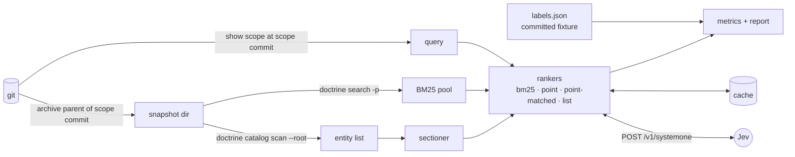

<!-- doctrine:section sec-1 -->
## What changes

A new, unpublished workspace crate, `crates/doctrine-jev`, measures whether
TypeSafe's Jev improves which corpus entities a `/research` round would read.
Nothing shipped changes: not the `doctrine` binary, not its library, not the
skills (SL-277 Non-Goals).

Two drivers share one code path:

- **`rank SL-NNN --arm <arm>`** — a ranked packet for one slice, each item with
  provenance: entity, snapshot commit, arm and the ranker's score. Point
  rankers also name the section that scored; bm25 and list name none.
- **`eval`** — replay the eval set and report recall per arm.

Two support commands: **`labels`** writes the committed label fixture once;
**`probe`** makes about ten live calls to check connectivity and answer shape.
Every command is a dry run unless given `--live --cap-usd N`.

An arm is a candidate pool paired with a ranker (DEC-358, DEC-360):

| arm | pool | ranker |
|---|---|---|
| A | BM25 top 50 from `doctrine search` | BM25 order (baseline) |
| B-point | same pool | pointwise: one Noul per section |
| B-point-matched | same pool | pointwise: one Noul per entity over its B-list option text (control) |
| B-list | same pool | listwise: one Choice over the pool's entities |
| C-point | whole snapshot, entity bodies (DEC-357) | pointwise |
| C-point→list | whole snapshot | pointwise, then listwise over its top 100 |

Every arm reads the corpus as of the slice's snapshot, the parent of the commit
that first added its scope file (DEC-354). The query is that scope body as first
committed (DEC-355).

Decisions: DEC-352 pointwise packing, DEC-353 labels, DEC-354 snapshot, DEC-355
query and Noul rubric, DEC-356 crate, DEC-357 memories excluded, DEC-358 pool ×
ranker, DEC-359 listwise sizing and headline metric, DEC-360 comparison
controls (pool size, id hiding, matched-text arm, batching gate, order
reversal).

<!-- doctrine:section sec-2 -->
## Pipeline



Per slice:

1. Resolve the scope commit (`git log --diff-filter=A` on `slice-NNN.toml`) and
   its parent, the snapshot commit.
2. Export the snapshot: `git archive <snapshot> .doctrine | tar -x` into
   `.doctrine/state/jev/snapshots/<commit>/`, once per commit. Probed
   2026-09-29: a bare `.doctrine` export is a valid `-p` root for
   `doctrine search` and `--root` for `doctrine catalog scan`.
3. Read the query: `git show <scope-commit>:.doctrine/slice/NNN/slice-NNN.md`.
4. Enumerate entities with `catalog scan`. Its paths are numeric directories, so
   the slug-symlink aliases are never walked
   (`mem.pattern.entity.corpus-walk-skip-slug-symlink`). Memory entities are
   dropped (DEC-357).
5. Build the pool: `search -p <snap> -k all -f json --limit 50` for A and the B
   arms (`POOL_SIZE = 50`, recorded in every run, DEC-360), all non-memory
   entities for C arms.
6. Rank, score against the slice's labels, and aggregate.

Corpus facts come only through the `git` and `doctrine` CLIs (DEC-356). The
`doctrine` binary is resolved as `$DOCTRINE_BIN`, else `doctrine` on `PATH`, and
its version is recorded in each run log.

<!-- doctrine:section sec-3 -->
## Rankers and the Jev client

### Client

`POST https://api.typesafe.ai/v1/systemone`, bearer token from `JEV_API_KEY`
(`raw/jev-api.md`). The key is read once into a type whose `Debug` and
`Display` print `<redacted>`, and it is never written anywhere. The model is
pinned (`JEV_MODEL = "jev-1.13.0"`, a named constant per STD-001). A response
whose `model` differs from the pin aborts the run, because the cache would mix
models.

Outcomes are typed per request and per question, and none becomes a score:

| condition | outcome | handling |
|---|---|---|
| 200, answer present and well formed | `Answered` | used and cached |
| 200, answer missing, wrong type, non-finite or out of range | `Unanswered` | that candidate is unscored; counted in the report |
| 401 | `Unauthorized` | run aborts |
| 422 naming the context limit | `TooLong` | a point request is split in two; a single-question request has that section halved; a list call's option caps are halved; resent and counted, at most twice per question, then `Unanswered` |
| other 422 | `Rejected(body)` | run aborts; our request is wrong |
| 429, 529, transport error | `Retryable` | exponential backoff, honouring `retry-after`; bounded attempts; each attempt reserves against the spend cap |
| other status | `Failed(status)` | run aborts |

A Choice answer is well formed only if its probabilities cover exactly the
requested option keys, each finite and in [0, 1], summing to 1 ± 0.01, and its
`choice` is one of those keys. Anything less is `Unanswered` for the whole
question. The probe records the body of a context-limit 422, which fixes how
`TooLong` is recognised.

Noul has no abstention answer (`raw/jev-api.md`), so "semantic abstention" in the
scope means `Unanswered`. An unscored candidate sorts after every scored one
and is reported. It is never treated as zero. In `eval`, the missing
questions are retried once; an arm is complete for a slice only if every
candidate is then answered (see Report).

HTTP is `reqwest` in blocking mode with rustls and no default features, so
`just nix-build`, which builds `--workspace`, stays hermetic (DEC-356).
Transport sits behind a small trait, so every test runs against a fake.

### Rankers

- **bm25** — `doctrine search` order, unchanged.
- **point** (DEC-352, DEC-355) — the state is the query. Each candidate section
  is one Noul question: `instructions` is an object holding the section text and
  the question, and `criteria` carries the true/false wording. A pure packer
  fills requests in a fixed order until either budget, taken at 80%
  (`PACK_HEADROOM`), would be exceeded: 64k per request, or 32k for the state
  plus the longest question (`raw/jev-models.md:15`). Question keys (`s0`,
  `s1`, …) are local indices; the API does not send keys to the model
  (`raw/jev-api.md`). An entity scores its best section's probability.
- **point-matched** (DEC-360) — the point ranker's rubric, with one Noul per
  pool entity whose text is exactly that entity's B-list option. It separates
  the ranker primitive from the text each ranker sees.
- **list** (DEC-358, DEC-359, DEC-360) — one Choice question whose `criteria`
  map opaque keys (`o1`, `o2`, …) to option text; keys map back to entity ids
  locally, so no option is labelled with its id. There is no "none of these" option. Each
  question is sent twice, in forward and reversed option order; the order is
  each option's mean probability, descending, ties keeping the input order.
  Probabilities are used as an order only, never compared across questions.
  - B-list: options are the BM25 pool's 50 entity bodies.
  - C-point→list: options are point's top 100 entities, each rendered as title
    plus best section.
  - Each option is capped at (80% of 32k − query − instruction overhead) ÷
    option count tokens, computed per call: about 430–480 tokens for B-list over the measured
    queries.
    Every truncation is counted.

A query too long to leave room for any question under the estimate is refused
at planning, before any send, and the slice is reported as skipped.

Token counts before sending are estimates: bytes ÷ 3. The tokenizer is
unpublished, so no estimate is a proven upper bound. The 80% headroom and
`TooLong` handling absorb the error. The probe compares the estimate with
reported `usage`, including dense ASCII (hashes, base64), and the ratio is
adjusted before any full run.

### Rubric text

The Noul question and criteria, and the Choice instructions, live in one module
as named constants, with a `RUBRIC_VERSION` that feeds the cache key. Both are
built from one `RELEVANCE_CRITERION` constant, so point, point-matched and list
ask the same relevance question and differ only in answer shape. Without that,
B-list − B-point-matched would not isolate the ranker primitive.
Wording is tuned only on the held-out tuning slices (DEC-353).

<!-- doctrine:section sec-4 -->
## Sections and labels

### Sectioner (pure)

- Split each entity body at ATX headings outside fenced code.
- Prefix each section with `<title> › <heading path>` so it reads on its own.
  The prefix carries no id, so an id cited in the query is no exact-match cue
  (DEC-360).
- Fold any section under 64 estimated tokens into its predecessor.
- Split any section over 4k estimated tokens at paragraph boundaries; a single
  paragraph over the cap is cut and counted.
- TOML is never sent. `SECTIONER_VERSION` feeds the cache key.

### Labels (DEC-353)

`labels` runs once, writes `crates/doctrine-jev/fixtures/labels.json`, and the
fixture is committed. Per slice it records:

- slice id, scope commit, snapshot commit;
- labels, each an entity id with its sources (`research`, `design`);
- dropped citations: counts of those absent at the snapshot, of those present
  but unreadable, and of memory keys;
- role: `tune` or `eval`.

The fixture header records the extraction commit and date, because it is a
census of gitignored files and dates the moment it is taken
(`mem.pattern.doctrine.census-of-runtime-state-dates`).

Extraction:

- `research.md` is read from the working tree (gitignored, so there is no other
  copy). `design.md` is read at `HEAD` through `git show`.
- Candidate ids match `\b[A-Z]{2,4}-[0-9]{1,4}\b` not followed by `-[0-9]`,
  which excludes external three-part `DEC-x-y` cites
  (`mem.pattern.entity.dec-prefix-dual-namespaced`).
- Memory keys, dotted `mem.…` keys and `mem_…` uids, are matched by a separate
  pattern and only counted (DEC-357).
- The candidates are normalised to canonical form and intersected with the
  snapshot's `catalog scan` keys. The intersection removes doc-local ids (`OQ-`,
  `PHASE-`, `FR-`, …), entities minted after the snapshot, and the slice itself,
  with no per-kind rules and no local prefix table.
- A candidate outside the scan's entities is *unreadable* if the scan reported
  an error diagnostic whose `entity_key` is that id (the scan emits one for every
  entity it walks but cannot read), and *absent* otherwise. An unreadable label leaves the
  recall denominator and is disclosed per slice (STD-003).

Eval set: the slices with a `research.md` (39 on 2026-09-29), excluding SL-277.
About 10 are held out as `tune`: every fourth by id, fixed in the fixture. The
rest are `eval`. Rubric tuning reads `tune` only. The user spot-checks the
labels, not the rubric, of 5 `tune` slices and 5 `eval` slices drawn at random
with the recorded seed.

<!-- doctrine:section sec-5 -->
## Budget, cache and egress

### Budget

`plan` (pure) turns a run configuration into planned requests, estimated input
tokens, and estimated dollars at `PRICE_PER_MTOK_USD = 0.042`. Output tokens are
free (`raw/jev-models.md:13,18`). A dry run prints the plan and stops.

A live run needs `--cap-usd N`. Before each attempt, retries included, it
reserves the attempt's worst case: 64k input tokens, the documented
per-request maximum (`raw/jev-models.md:15`), about $0.0027. An attempt whose
worst case exceeds the remaining cap is not sent; the run stops cleanly with
partial results already cached. When an attempt returns, its reported
`usage.input_tokens` replaces the reservation; an attempt with no usage stays
charged at the worst case. Spend therefore never exceeds the cap.
Requests are paced client-side (`--rps`, default 2), since the free-tier limit
is undocumented and "adjusting dynamically" (`raw/jev-models.md:24`).

Expected (2026-09-29 corpus, before any plan): arm C about 450–600 point
requests per slice at 80% packing, about 4M input tokens, about $0.20; the B
arms a few dozen requests; 4 list requests (two questions, two orders). The
full eval set is about $6–12. The dry-run plan supersedes these figures.

### Cache and replay

- The key is the SHA-256 of canonical JSON over endpoint, model, state, ordered
  questions, `RUBRIC_VERSION`, `SECTIONER_VERSION` and `PACKER_VERSION`.
- The value is the raw response body plus metadata: time, the model returned,
  and usage.
- Only a 200 whose answers all decode and are well formed is cached. Failures never are, so a
  failure cannot replay as a negative.
- Scores and threshold-free rankings are derived from the cached raw output at
  read time, so a metric change needs no calls.

### Egress

- Allow-list: text from entities under the snapshot's `.doctrine/`, non-memory
  kinds, plus the query. Every question's source is asserted against it before
  send.
- Send log: `runs/<run-id>/sent.jsonl`, one line per attempt, written before
  the attempt is sent: cache key, entity and section ids, bytes. No section text (the snapshot and ids reproduce it)
  and never the credential.

### Layout

Everything below is runtime tier, gitignored under `.doctrine/state/`:

```
.doctrine/state/jev/
  snapshots/<commit>/     git archive exports
  cache/<aa>/<key>.json   raw responses
  runs/<run-id>/          plan.json · sent.jsonl · results.jsonl · report.md · run.toml
```

The root is the invoking tree's git top level, recorded in `run.toml` along with
the `doctrine` binary version
(`mem.pattern.doctrine.runtime-state-root-split-reads-false-empty`).

<!-- doctrine:section sec-6 -->
## Report, runs and verdict

### Report (DEC-359)

Per arm, per label source (research-cited, all-cited) and per label kind:

- **Headline:** entity recall@10 and @25, over all labels and over labels the
  query does not already name (DEC-360).
- **Pool coverage:** the share of labels in the BM25 pool, the ceiling for A
  and every B arm. C has no such ceiling; it ranks the whole snapshot.
- Secondary: recall at a 4k, 8k, 16k and 32k token budget. Each entity costs
  min(estimated body tokens, 1k) in every arm; entities with an empty body are
  left out. The budget prefix walks rank order and ends at the first entity
  that does not fit.
- Sample count and 95% bootstrap intervals over slices, with a fixed, recorded
  seed and a small in-crate PRNG, so no new dependency.
- Paired deltas: B-point − A; B-list − B-point-matched (the ranker primitive);
  B-point − B-point-matched (text and best-section effect); C-point − B-point;
  C-point→list − C-point, a pipeline comparison rather than a ranker one.
- Completeness: an arm counts for a slice only if every candidate was answered
  after one retry of the missing. Incomplete arm-slices are left out of every
  paired delta that uses them, and counted.

Per slice: dropped-label counts (absent, unreadable, memory), truncation and
unscored counts, forward-vs-reversed order agreement (Kendall τ) per list call,
and the top five uncited hits per Jev arm, listed for human judgement rather
than scored wrong. The headline is also shown over only the slices with no
unreadable labels.

### Run sequence

1. **Offline:** all tests green; dry-run plans for the full eval set.
2. **Probe** (about 10 calls, cap $0.05): answer shape, pinned model echo,
   estimated vs reported tokens, and repeatability (the same request twice).
3. **Agreement check** (DEC-352, DEC-360), on one tuning slice's BM25 pool:
   batched point against section-as-state point. Batching is kept if Kendall τ
   between the two score orders is ≥ 0.8 and recall@10 differs by at most
   0.05. Otherwise DEC-352's fallback applies: section-as-state, with the C
   arms run on 3–5 `eval` slices drawn with the recorded seed.
4. **One tuning slice across all six arms.**
5. **User spot-check** of 5 `tune` and 5 `eval` slices' labels; rubric tuning
   on `tune` only.
6. **Full eval set**, one capped run: all arms, or under the fallback A and
   the B arms, plus the C arms on their subsample. C deltas are then computed
   only over the subsample's slices, reported with that n, and the verdict
   treats any C conclusion as provisional.

### Verdict

An EVD record: `datum` is the headline table in one line, `provenance` is
`experiment`, `confidence` reflects the intervals, and status starts at
`captured`. The body has Observation, Supported disposition and Limits sections
(precedent EVD-004). The disposition names the adoption shape the numbers
support, or none: a B-arm win means a reranker. A C-arm win means a retriever
only where pool coverage shows the BM25 pool missing labels that C ranks in.

<!-- doctrine:section sec-7 -->
## Code impact

| path | change |
|---|---|
| `Cargo.toml` | `crates/doctrine-jev` added to `members`, not `default-members` |
| `Cargo.lock` | `reqwest` and its rustls closure added; `clap`, `serde`, `serde_json`, `sha2` and `regex` are already resolved |
| `justfile` | `jev-check` recipe: `cargo clippy -p doctrine-jev` plus `cargo test -p doctrine-jev`. The crate is not auto-gated (`mem.pattern.build.just-check-workspace-gates-members`) |
| `crates/doctrine-jev/Cargo.toml` | `publish = false`; its own dependencies (doctrine-control precedent); `[lints] workspace = true`; `repository`, `readme`, `keywords` and `categories` set (`mem.pattern.lint.new-workspace-member-cargo-metadata`) |
| `crates/doctrine-jev/README.md` | usage, spend and egress posture |
| `crates/doctrine-jev/src/main.rs` | CLI shell: `labels`, `probe`, `rank`, `eval`; label fixture read and write |
| `…/src/jev.rs` | wire types; pure request build and response decode; `Transport` trait; reqwest transport; retry/backoff |
| `…/src/rank.rs` | `bm25`, `point`, `point-matched`, `list` rankers over one candidate type |
| `…/src/pack.rs` | pure point packer; list option keying, capping and reversal |
| `…/src/section.rs` | pure sectioner |
| `…/src/corpus.rs` | snapshot export, query read, `catalog scan` and `search` subprocesses |
| `…/src/labels.rs` | pure extraction, memory-key count, absent/unreadable classification, intersection |
| `…/src/budget.rs` | pure plan; live spend guard |
| `…/src/cache.rs` | content-addressed raw cache |
| `…/src/runlog.rs` | run directory, send log, `run.toml` |
| `…/src/report.rs` | pure metrics, bootstrap, markdown report |
| `crates/doctrine-jev/fixtures/labels.json` | the committed label fixture |
| `crates/doctrine-jev/tests/` | offline behaviour suites |
| `.doctrine/knowledge/evidence/NNN/` | the verdict EVD, authored at the end |

Pure/impure split (AGENTS.md conventions): section, pack, labels, budget plan,
request/response codec and report are pure. Time, randomness, git, disk,
subprocess and network live in `corpus`, `cache`, `runlog`, the transport and
`main`. No path dependency on the root package, so ADR-001's layering gate is
not reached (DEC-356). No file under `src/` changes.

<!-- doctrine:section sec-8 -->
## Verification

TDD, red first, behaviour-level, with no network in any test:

- **VT client:** request JSON matches the documented shape for Noul and Choice;
  each status row of the outcome table maps as specified; missing, wrong-type,
  non-finite and out-of-range answers become `Unanswered`, never 0; a Choice
  with a missing or extra key, a sum outside 1 ± 0.01 or a `choice` outside its
  keys is `Unanswered` and not cached; a context-limit 422 splits or shrinks
  the request and is counted; `retry-after` is honoured and attempts are
  bounded; a model mismatch aborts.
- **VT credential:** a full fake run writes no file containing the key, and
  `Debug` of the config shows `<redacted>`.
- **VT packer:** no request exceeds either budget under the estimator; order is
  deterministic; an oversized section is split and counted; list caps sum within
  80% of the budget for 1, 50 and 100 options and the longest measured query.
- **VT boundary:** a dense-ASCII (base64) section under a fake that returns the
  context-limit 422 above a byte threshold is split, then halved, then
  `Unanswered`, with each step counted; an over-long query is refused at
  planning with zero transport calls.
- **VT rubric:** point, point-matched and list request bodies all contain
  `RELEVANCE_CRITERION`.
- **VT list:** no option key or section prefix contains an entity id; the
  reversed question is the forward one with its options reversed; averaging
  and tie order match a hand-worked case.
- **VT sectioner:** headings inside fences do not split; tiny sections fold;
  prefixes carry the title and heading path and no id.
- **VT labels:** fixtures with doc-local ids, three-part `DEC-x-y`, a
  post-snapshot id, the slice's own id and memory keys, each yielding the
  specified label set and dropped counts; a known-positive control id is present
  (`mem.pattern.install.shipped-corpus-citation-grep-prefix-set`); dotted and
  uid memory keys are counted; an id with an error diagnostic but no scan entity is
  unreadable, including when every entity of its kind fails; one with neither
  is absent.
- **VT cache:** a changed rubric, sectioner or packer version, or reordered
  questions, misses; a failure is never stored; replay from a populated cache
  makes zero transport calls and yields a byte-identical report.
- **VT budget:** an attempt whose worst case exceeds the remaining cap is not
  sent, retries included; a fake reporting usage above the estimate never takes
  spend past the cap; dry run makes zero transport calls.
- **VT completeness:** a fake that omits answers, then answers the retry,
  yields a complete arm; one that omits them again yields an incomplete
  arm-slice, excluded from paired deltas and counted.
- **VT metrics:** recall@k, the unnamed-label subset, pool coverage and
  recall-at-budget on a hand-worked table, including a non-fitting entity that
  ends the prefix and an empty-body entity left out; unscored candidates sort
  last; the bootstrap is deterministic under a fixed seed.
- **VT snapshot (integration, local git only):** a temp repo with a scope-add
  commit resolves the parent correctly and exports only `.doctrine`.
- **VA probe:** the run sequence's step 2 findings recorded in the slice notes.
- **VH labels:** the user's spot-check of 5 `tune` and 5 random `eval` slices.
- **VA reproducibility:** from a clean checkout with `JEV_API_KEY`, `eval`
  reproduces the report, from the cache or live.

Gate: `just jev-check` (clippy zero warnings, tests), plus `doctrine check gate`
for the root package, which stays untouched.

<!-- doctrine:section sec-9 -->
## Risks and residuals

- **Evidence transfer.** Hindsight's listwise result is LoCoMo, with short
  memories and short queries; ours has longer sections and a scope-length query.
  That is the point of measuring. It is not assumed.
- **Listwise position bias.** Option order may sway a Choice. Every list
  question runs forward and reversed and is averaged; per-call order agreement
  is reported.
- **Batching may distort point scores.** The agreement check's threshold
  decides, and DEC-352's fallback applies if it fails.
- **Old snapshots under a current binary.** `catalog scan` on SL-229's snapshot
  reported 20 diagnostics (2026-09-29). Unhydratable entities drop out of the
  pool; as labels they are unreadable, not absent, leave the denominator and
  are disclosed per slice (STD-003). A directory the scan does not walk at all
  gives no diagnostic, so its entity would read as absent; the per-slice
  counts make such a gap visible.
- **`catalog scan` is a debug verb** with no stable output contract. Acceptable
  for a trial; an adoption slice must use a stable surface (DEC-356).
- **Token estimate.** An under-estimate risks 422s near the budget. The 80%
  headroom and `TooLong` split absorb it, and the probe calibrates the ratio.
- **Free-tier limits.** They are unknown and dynamic. Pacing plus backoff keeps
  runs correct, only slower.
- **Small n.** About 29 eval slices; intervals are reported rather than hidden.
  The older design-only set is the deferred widening (DEC-353).
- **Silver labels are noisy.** They undercount relevance, so uncited hits are
  listed for judgement. They also overcount it, since ids in examples or
  review history are extracted too; per-kind recall and the `eval` label audit
  expose this rather than a citation-context rule.
- **Model drift.** The pin plus abort-on-mismatch; a retired pin needs a new run.
- **Residuals:** ISS-316 (EVD lifecycle rules partly unwritten) bears on the
  verdict record's later status transitions.

