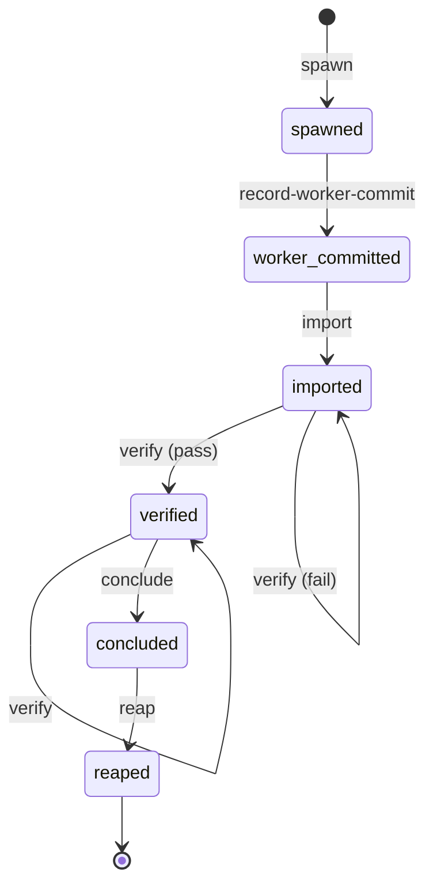

<!-- GENERATED ARTIFACT — SL-228 D7. Rendered from the single `const` transition
     table in `src/funnel_machine.rs`. Do NOT hand-edit: a golden test pins this
     file to the code byte-for-byte. To change it, change the table and re-render. -->

# Dispatch funnel — transition machine

The phase funnel's legality authority. Every position advance is approved by
`funnel_machine::attempt`; no other code path may land a position.

## Transitions

| current | transition | gate | result |
| --- | --- | --- | --- |
| none | spawn | - | spawned |
| spawned | record-worker-commit | - | worker-committed |
| worker-committed | import | - | imported |
| imported | verify | evidence recorded either way | verified on pass, imported on fail |
| verified | verify | evidence refreshed | verified |
| verified | conclude | pass evidence, tree identical modulo funnel record | concluded |
| concluded | reap | landed-oracle ok or fork already absent | reaped |
| reaped | - | - | terminal |

Everything absent from this table refuses. Positions only advance; evidence may
update in place.

## Expected next

The refusal payload and the `next` oracle read this one projection — there is no
second table.

| current | expected next |
| --- | --- |
| none | spawn |
| spawned | await-worker |
| worker-committed | import |
| imported | verify |
| verified | conclude |
| concluded | reap |
| reaped | terminal |

Two entries are facts-conditional: at `imported` with red stored evidence the
prescription is triage rather than a bare re-verify, and at `verified` with a
stale tree it reverts to verify.

## Refusal tokens

| token | raised when |
| --- | --- |
| not-spawned | the phase has no fork yet |
| worker-not-committed | the fork has not landed its commit |
| not-imported | the worker delta is not on the coordination tip |
| conclude-unverified | no verify evidence recorded |
| conclude-verify-failed | the stored verify evidence is red |
| conclude-verify-stale | non-funnel-record paths changed since the verified tip |
| not-concluded | the phase boundary is not recorded |
| already-<position> | replay attempted with mismatched identity facts |
| terminal | the phase is reaped; no transition remains |

## Diagram

