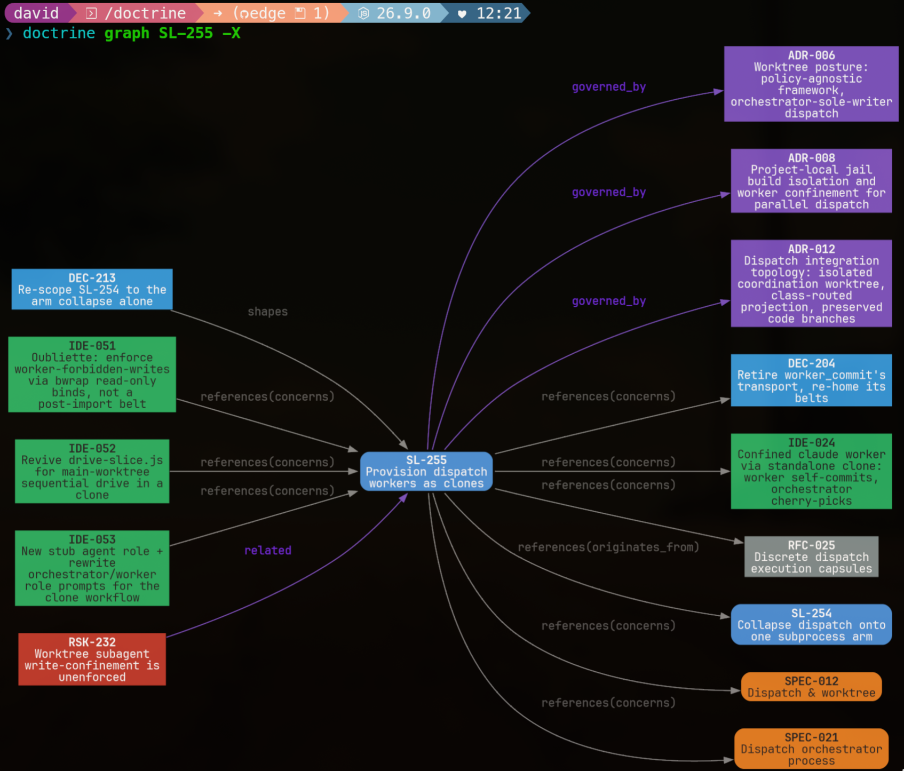

# Doctrine

Doctrine is an evolving, ambitious, but pragmatic approach to agentic engineering, expressed as a Rust CLI tool.

It promotes engineering rigour, fosters clear understanding, and bounds agent autonomy. Agents adhere to your intent, and you focus your attention on design, not supervision or repair.

Why?

You can build an effective process for small-scale projects in 80 lines of markdown - but agents follow prose instructions unreliably. As project scope and complexity grow, the effectiveness of this approach declines, and new failure modes emerge. Prose is flexible, but unstructured. A prompt, no matter how well considered, can only improve the odds so much.

Doctrine supplements coding agents with the determinism of classical software systems. Workflows are pushed down into finite state machines. Structured data alongside markdown documents allows their traversal as nodes in a graph. Decisions, assumptions, hypotheses, and evidence records make a shared semantic view of your codebase legible. Memories decay over time, and are surfaced when the files they concern are encountered.

Doctrine is designed to work with any model or harness, though specific integrations may vary slightly. Its vendor-agnostic handling of project context, and strict guardrails, make less capable and cheaper models more reliable and reduce the barriers to substitution.

 

> Heresy burns; Doctrine remains.

## Design Goals

Priorities, in order — when two conflict, the higher one wins:

1. **Correctness.** Work that is wrong is worse than work not done. Lifecycle
   rules live in the binary, not in a prompt: the CLI refuses an illegal
   transition, whatever the agent was told. Phases close green; slices close
   through an audit.
2. **Comprehension.** You should be able to understand what your agents built
   and why, months later. Intent, decisions, and evidence are recorded as they
   happen, cited by durable ids, and linked into one graph you can query.
3. **Adaptability.** Your process is not ours. Templates, skills, and
   governance are plain files you own and edit; doctrine works with any model
   or harness, at any project size.
4. **Automation.** Once the above hold, hand over more of the loop: parallel
   workers, prescribed next steps, derived priority.
5. **Efficiency.** Spend as little as possible of three budgets — complexity,
   tokens, and human attention. Agents load the context they need, when they
   need it, instead of a wall of instructions every turn.

### Why you might care

- **Agents stop drifting.** A long design session survives context compaction
  because its state lives on disk, not in the transcript. The framework tracks
  where the work stands and what is owed next; the agent spends its judgement on
  the problem.
- **You review design, not wreckage.** Scope, design, and plan are agreed
  before code is written. Review findings sit on a ledger that must be
  resolved, not in a chat scroll.
- **Knowledge compounds.** What one session learns, the next one inherits —
  scoped to the files it concerns, with staleness flagged rather than silently
  trusted.
- **Cheaper models do more.** Structure and guardrails carry weight a frontier
  model would otherwise carry in its head, which makes substitution practical.
- **It's just files.** TOML and Markdown in your repo, versioned with your
  code. A single binary, no service, no account, no lock-in.

### What's in the box

| Area | What it does |
|---|---|
| **Change lifecycle** | Every intentional change is a *slice*: scope → design → plan → phases → audit → reconcile → close. The lifecycle is a state machine; design runs are managed, so an interview resumes cleanly in a fresh context. |
| **Specifications & governance** | Product and technical specs, requirements, ADRs, policies, standards, RFCs, and revisions. A boot snapshot puts the binding rules — and who may override them — in front of every agent session. |
| **Epistemic records** | Assumptions, decisions, open questions, constraints, evidence, hypotheses, and concepts: the things a project acts on without having proven, tracked from *held* to *settled* instead of lost in prose. Useful before anything is concrete enough to build. |
| **Memory** | Typed, scoped memories anchored to the code they describe. Surfaced when an agent touches matching files; verified, aged, and flagged when stale. Usable on its own (`--only-memory`). |
| **Adversarial review** | Reviews as a first-class ledger: findings are raised, disposed, verified, or contested turn by turn — across models if you like. Audit uses the same ledger to reconcile what was built against what was designed. |
| **Backlog & priority** | Cheap capture of issues, improvements, chores, risks, and ideas. Priority and actionability are derived from the dependency graph and lifecycle state; `doctrine next` explains its answer. Value can be elicited by pairwise comparison. |
| **Parallel dispatch** | Phases run as workers in isolated git worktrees (kernel-confined on Linux). One orchestrator is the sole writer of shared state; progress is crash-resumable; nothing lands on trunk before audit. Orchestration verbs are primitives you can compose. |
| **Exploration** | Ranked search over the whole corpus, relation graphs in the terminal, and a local web explorer (`doctrine map serve`). |
| **Harness independence** | Skills install for Claude Code, Codex, pi, and other agents. Per-model prompt supplements resolve on demand, so one project works across harnesses. |
| **Self-measurement** | An observation ledger captures process friction as it happens, so the workflow itself can be tuned on evidence. |

The separation is deliberate throughout: structured, queryable data in TOML;
prose in Markdown; disposable runtime state in a gitignored directory, apart
from the artifacts worth keeping.

## Non-Goals

- SaaS integration (in core)
- Windows support (for now)
- Integrated TUI (for now)




## Installation

TL'DR:

```zsh
curl -sL https://install.doctrinal.systems | sh
```


**Prebuilt binary (macOS + Linux, no Rust toolchain) — recommended:**

``` zsh
# latest release (rolling):
curl -fsSL https://raw.githubusercontent.com/davidlee/doctrine/main/install.sh | sh

# or pin to a release tag for reproducibility:
curl -fsSL https://raw.githubusercontent.com/davidlee/doctrine/v0.8.1/install.sh | sh
```

Installs to `~/.local/bin` (override with `DOCTRINE_BIN_DIR`); choose a version
with `DOCTRINE_VERSION`. The script checksum-verifies what it downloads — read it
before piping to a shell. macOS arm64 + x86_64; Linux x86_64 + aarch64 (static
musl — runs on any distro regardless of glibc version).

**Or with [`cargo binstall`](https://github.com/cargo-bins/cargo-binstall) (prebuilt, no compile):**

``` zsh
cargo binstall doctrine
```

**Or `cargo install` (compiles from source; needs a Rust toolchain — may hit the
`-liconv` link error on some macOS toolchains, which the prebuilt paths above
sidestep):**

``` zsh
cargo install doctrine
```

Then bootstrap a project:

``` zsh
cd my_project || mkdir my_project

doctrine install                  # prompts to confirm; or use --dry-run | --yes
npx skills add davidlee/doctrine  # or `doctrine install --agent claude` for claude code only

claude 
> Let's design a feature: ...
```

or install from source (customise templates / skills):

``` zsh
gh repo clone davidlee/doctrine && cd doctrine

# optional: 
# customise install/templates and/or plugins/skills
# they'll get bundled into the binary for installation

cargo install --path .
```

or use it as a nix flake:

```nix
inputs.doctrine.url = "github:davidlee/doctrine";
# ...
doctrine = inputs.doctrine.packages.${system}.doctrine;
```

to install skills for other agents:

```zsh
npx skills add davidlee/doctrine # or your fork 
```

## Post-Install Setup 

```zsh

mkdir my-project && cd my-project
git init 
mkdir .claude 

# also run this after a new doctrine version:
doctrine install -y

git add -A && git commit -m "chore: doctrine install"
```

## Memory-only use 

Use Doctrine's memory system with your preferred tooling for the rest:

```zsh
cd my-project
doctrine install --agent claude --only-memory -y 

# doctrine memory help
# doctrine memory record --type pattern "red/green/refactor TDD" --glob "src/lib/**/*" --summary "..."
# doctrine memory list
```


## Usage

``` zsh
# start up your harness of choice 
claude

# it'll route through doctrine when it needs to
> I've got a markdown file @here.md with a task description. Take a look and let's shape it up.
```

Many / most of the CLI surface is really for agents. Once you have some content, you might find some of these useful:

```zsh

doctrine --help
doctrine slice list 
doctrine status
doctrine next
doctrine backlog list
doctrine <kind> paths <ID>
doctrine search ...
doctrine memory find ...
```

Doctrine ships with self-documenting agent memories. 

You can view them yourself with `doctrine onboard`.

The agent should be able to steer while you get used to
the default workflow.

## Hack

templates:

``` zsh
nvim .doctrine/templates
```

skills:

``` zsh
rm .claude/skills/code-review # remove symlink
cp -r .doctrine/skills/code-review/ .claude/skills/

nvim .claude/skills/code-review/SKILL.md
git add -f .claude/skills/code-review/SKILL.md

doctrine install # skips existing non-symlinks
```

or:

``` zsh
gh repo fork davidlee/doctrine --clone
cd doctrine
nvim doctrine/plugins/review
git commit -m "feat: review like a pirate" && git push
cargo install --path .             # build with your edits

# in your projects
doctrine install --agent claude --yes # from binary, or
npx skills add my-github/doctrine
```

## License

This repository is multi-licensed:

- Rust source code, application code, and compiled binaries are licensed under GPL-3.0-only.
- Files under `plugins/` are licensed under MIT.
- Files under `install/` are licensed under MIT, including templates and `config.toml`.

Where a file contains an SPDX license identifier or a directory contains its own LICENSE file, that more specific notice controls.

## Acknowledgements

The `/worktree` skill's directory-selection and safety-verification patterns are
adapted from [`superpowers:using-git-worktrees`](https://github.com/obra/superpowers)
by Jesse Vincent (MIT).

## Specifications

Product and technical specifications — the durable, agent-readable intent behind
Doctrine's capabilities. Regenerate this list with `just readme-index`.

<!-- BEGIN:readme-index -->
### Product Specifications

- [PRD-001 — Slices](.doctrine/spec/product/001/spec-001.md) — `active`
- [PRD-002 — Specifications](.doctrine/spec/product/002/spec-002.md) — `active`
- [PRD-003 — Skills](.doctrine/spec/product/003/spec-003.md) — `active`
- [PRD-004 — Memory](.doctrine/spec/product/004/spec-004.md) — `active`
- [PRD-005 — Reservation & Leasing](.doctrine/spec/product/005/spec-005.md) — `active`
- [PRD-006 — Install](.doctrine/spec/product/006/spec-006.md) — `active`
- [PRD-007 — Boot & Governance](.doctrine/spec/product/007/spec-007.md) — `active`
- [PRD-008 — ADRs](.doctrine/spec/product/008/spec-008.md) — `active`
- [PRD-009 — Backlog](.doctrine/spec/product/009/spec-009.md) — `active`
- [PRD-010 — Epistemic and Governance Records](.doctrine/spec/product/010/spec-010.md) — `active`
- [PRD-011 — Graph-Derived Priority and Actionability](.doctrine/spec/product/011/spec-011.md) — `active`
- [PRD-012 — Technical Specifications](.doctrine/spec/product/012/spec-012.md) — `active`
- [PRD-013 — Requirement Reconciliation](.doctrine/spec/product/013/spec-013.md) — `active`
- [PRD-014 — Estimation & Value](.doctrine/spec/product/014/spec-014.md) — `active`
- [PRD-015 — Dispatch & worktree](.doctrine/spec/product/015/spec-015.md) — `active`
- [PRD-016 — Graph exploration](.doctrine/spec/product/016/spec-016.md) — `active`
- [PRD-017 — Library & search](.doctrine/spec/product/017/spec-017.md) — `active`
- [PRD-018 — Observations](.doctrine/spec/product/018/spec-018.md) — `active`
- [PRD-019 — Managed design workflow](.doctrine/spec/product/019/spec-019.md) — `active`

### Technical Specifications

- [SPEC-001 — Graph-Derived Priority Engine](.doctrine/spec/tech/001/spec-001.md) — `active`
- [SPEC-002 — Requirement Reconciliation Engine](.doctrine/spec/tech/002/spec-002.md) — `active`
- [SPEC-003 — Doctrine](.doctrine/spec/tech/003/spec-003.md) — `active`
- [SPEC-004 — Entity engine](.doctrine/spec/tech/004/spec-004.md) — `active`
- [SPEC-005 — ADR entity surface](.doctrine/spec/tech/005/spec-005.md) — `active`
- [SPEC-006 — Spec composition machinery](.doctrine/spec/tech/006/spec-006.md) — `active`
- [SPEC-007 — Memory engine](.doctrine/spec/tech/007/spec-007.md) — `active`
- [SPEC-008 — Id lifecycle](.doctrine/spec/tech/008/spec-008.md) — `active`
- [SPEC-009 — Install & distribution](.doctrine/spec/tech/009/spec-009.md) — `active`
- [SPEC-010 — Skills distribution](.doctrine/spec/tech/010/spec-010.md) — `active`
- [SPEC-011 — Boot snapshot](.doctrine/spec/tech/011/spec-011.md) — `active`
- [SPEC-012 — Dispatch & worktree](.doctrine/spec/tech/012/spec-012.md) — `active`
- [SPEC-013 — CLI surface](.doctrine/spec/tech/013/spec-013.md) — `active`
- [SPEC-014 — Slice surface](.doctrine/spec/tech/014/spec-014.md) — `active`
- [SPEC-015 — Backlog entity surface](.doctrine/spec/tech/015/spec-015.md) — `active`
- [SPEC-016 — Governance kinds (POL/STD)](.doctrine/spec/tech/016/spec-016.md) — `active`
- [SPEC-017 — Tech-spec spine](.doctrine/spec/tech/017/spec-017.md) — `active`
- [SPEC-018 — Cross-corpus relation contract](.doctrine/spec/tech/018/spec-018.md) — `active`
- [SPEC-019 — Knowledge-record entity surface](.doctrine/spec/tech/019/spec-019.md) — `active`
- [SPEC-020 — Estimation facet](.doctrine/spec/tech/020/spec-020.md) — `active`
- [SPEC-021 — Dispatch orchestrator process](.doctrine/spec/tech/021/spec-021.md) — `active`
- [SPEC-022 — Git interaction model](.doctrine/spec/tech/022/spec-022.md) — `active`
- [SPEC-023 — Prompt cascade](.doctrine/spec/tech/023/spec-023.md) — `active`
- [SPEC-024 — Comparison engine](.doctrine/spec/tech/024/spec-024.md) — `active`
- [SPEC-025 — Web explorer](.doctrine/spec/tech/025/spec-025.md) — `active`
- [SPEC-026 — Publication & library](.doctrine/spec/tech/026/spec-026.md) — `active`
- [SPEC-027 — Graph projection and CLI emitter](.doctrine/spec/tech/027/spec-027.md) — `active`
- [SPEC-028 — Observation ledger](.doctrine/spec/tech/028/spec-028.md) — `active`
- [SPEC-029 — Design run engine](.doctrine/spec/tech/029/spec-029.md) — `active`
- [SPEC-030 — Dispatch execution capsules](.doctrine/spec/tech/030/spec-030.md) — `active`
- [SPEC-031 — Phase plan surface](.doctrine/spec/tech/031/spec-031.md) — `active`

### Request for Comments

- [RFC-001 — Thesis: graph value is gated on consumption surfaces](.doctrine/rfc/001/rfc-001.md) — `open`
- [RFC-002 — Consumption surfaces program: estimate, value, and scoring outward pipeline](.doctrine/rfc/002/rfc-002.md) — `open`
- [RFC-003 — Relation model: durable structural shape vs contextual role-intent](.doctrine/rfc/003/rfc-003.md) — `resolved`
- [RFC-004 — Path-intent selector: role-stamped selector+intent primitive](.doctrine/rfc/004/rfc-004.md) — `resolved`
- [RFC-005 — Dispatch funnel integrity: hazard survey and correctness posture](.doctrine/rfc/005/rfc-005.md) — `open`
- [RFC-006 — Auto-merge non-FF trunk at integrate: reversing the FF-only posture](.doctrine/rfc/006/rfc-006.md) — `resolved`
- [RFC-007 — Actionability: legibility and correctness](.doctrine/rfc/007/rfc-007.md) — `open`
- [RFC-008 — Actionability gating: association vs graph-effect](.doctrine/rfc/008/rfc-008.md) — `resolved`
- [RFC-009 — Epistemic records as the human-facing relational substrate for design ambiguity](.doctrine/rfc/009/rfc-009.md) — `open`
- [RFC-010 — Skill improvement sweep](.doctrine/rfc/010/rfc-010.md) — `resolved`
- [RFC-011 — Dispatch Token Efficiency](.doctrine/rfc/011/rfc-011.md) — `open`
- [RFC-012 — Parallel Fan-out Safety: Containment, Disjointness, and Shared Responsibility](.doctrine/rfc/012/rfc-012.md) — `open`
- [RFC-013 — Prompt cascade selection algebra: composable trait categories and disjunction-via-classification](.doctrine/rfc/013/rfc-013.md) — `open`
- [RFC-014 — Multi-harness fleet: declaration, routing, sandbox backend](.doctrine/rfc/014/rfc-014.md) — `open`
- [RFC-015 — Governance state on a dedicated ref namespace](.doctrine/rfc/015/rfc-015.md) — `open`
- [RFC-016 — Zero-rescue dispatch: invariants into verbs, lineage rows](.doctrine/rfc/016/rfc-016.md) — `open`
- [RFC-017 — Human onboarding docs: tour, quickstart, mental model](.doctrine/rfc/017/rfc-017.md) — `open`
- [RFC-018 — Claude harness field notes: empirical findings and design-artifact map](.doctrine/rfc/018/rfc-018.md) — `open`
- [RFC-019 — Comparison-based value elicitation](.doctrine/rfc/019/rfc-019.md) — `open`
- [RFC-020 — Ledgered facet claims](.doctrine/rfc/020/rfc-020.md) — `open`
- [RFC-021 — Dynamic behaviours and minimal projection](.doctrine/rfc/021/rfc-021.md) — `resolved`
- [RFC-022 — Agent trust model without human attestation](.doctrine/rfc/022/rfc-022.md) — `open`
- [RFC-023 — Executable plan gates and adversarial TDD](.doctrine/rfc/023/rfc-023.md) — `open`
- [RFC-024 — Product altitude taxonomy and the Scenario entity](.doctrine/rfc/024/rfc-024.md) — `open`
- [RFC-025 — Discrete dispatch execution capsules](.doctrine/rfc/025/rfc-025.md) — `open`
- [RFC-026 — Design review response effectiveness](.doctrine/rfc/026/rfc-026.md) — `open`
- [RFC-027 — Progressive discovery and proof-bearing plans](.doctrine/rfc/027/rfc-027.md) — `open`
- [RFC-028 — Blockchain but for AI (verifiable human authorization)](.doctrine/rfc/028/rfc-028.md) — `open`
- [RFC-029 — Proof binding and the plan surface](.doctrine/rfc/029/rfc-029.md) — `open`
- [RFC-030 — Inquiry map as a general interview substrate](.doctrine/rfc/030/rfc-030.md) — `open`
- [RFC-031 — Design run fitness](.doctrine/rfc/031/rfc-031.md) — `open`
- [RFC-032 — Review ledger effectiveness](.doctrine/rfc/032/rfc-032.md) — `open`
- [RFC-033 — Learning surface: corpus unification, format, and publication](.doctrine/rfc/033/rfc-033.md) — `open`

### Architecture Decision Records

- [ADR-001 — Module layering: leaf ← engine ← command, no cycles](.doctrine/adr/001/adr-001.md) — `accepted`
- [ADR-002 — Global orientation memory class: repo-empty, unanchored, evergreen](.doctrine/adr/002/adr-002.md) — `accepted`
- [ADR-003 — Canonical change loop: slice-first, observe, reconcile, close](.doctrine/adr/003/adr-003.md) — `accepted`
- [ADR-004 — Relations stored outbound-only; reciprocity is derived](.doctrine/adr/004/adr-004.md) — `accepted`
- [ADR-005 — Shipped knowledge is tiered by access pattern; skills route, reference docs explain](.doctrine/adr/005/adr-005.md) — `accepted`
- [ADR-006 — Worktree posture: policy-agnostic framework, orchestrator-sole-writer dispatch](.doctrine/adr/006/adr-006.md) — `accepted`
- [ADR-007 — Adversarial review as a first-class kind with turn-based ledger coordination](.doctrine/adr/007/adr-007.md) — `accepted`
- [ADR-008 — Project-local jail build isolation and worker confinement for parallel dispatch](.doctrine/adr/008/adr-008.md) — `accepted`
- [ADR-009 — Slice lifecycle state machine and conduct axis](.doctrine/adr/009/adr-009.md) — `accepted`
- [ADR-010 — Relation modelling: unify the contract and write seam, keep storage bespoke](.doctrine/adr/010/adr-010.md) — `accepted`
- [ADR-011 — Harness-agnostic orchestrator spawn interface and per-harness capability altitude](.doctrine/adr/011/adr-011.md) — `accepted`
- [ADR-012 — Dispatch integration topology: isolated coordination worktree, class-routed projection, preserved code branches](.doctrine/adr/012/adr-012.md) — `accepted`
- [ADR-013 — Revision as a first-class change-axis kind; governance dependency routes through a Revision](.doctrine/adr/013/adr-013.md) — `accepted`
- [ADR-014 — RFC: governance-neutral first-class kind, precursor to Revision](.doctrine/adr/014/adr-014.md) — `accepted`
- [ADR-015 — Multi-dimensional priority scoring](.doctrine/adr/015/adr-015.md) — `accepted`
- [ADR-016 — Relation intent as a closed role dimension](.doctrine/adr/016/adr-016.md) — `accepted`
- [ADR-017 — Actionability gating via inbound needs on unsettled records](.doctrine/adr/017/adr-017.md) — `accepted`
- [ADR-018 — Finish Axis B: neutral originates_from provenance, fulfils label with completion degree, value-burndown](.doctrine/adr/018/adr-018.md) — `accepted`
- [ADR-019 — Embedding, publication, and projection are independent asset policies](.doctrine/adr/019/adr-019.md) — `accepted`
- [ADR-020 — Adopt execution capsules as the dispatch authority boundary](.doctrine/adr/020/adr-020.md) — `accepted`
- [ADR-021 — Unsafe code deny with a two-site budget](.doctrine/adr/021/adr-021.md) — `proposed`
- [ADR-022 — Evidence ownership between peer corpora](.doctrine/adr/022/adr-022.md) — `proposed`
- [ADR-023 — Authority model for agent instruction](.doctrine/adr/023/adr-023.md) — `accepted`
- [ADR-024 — Shipped-corpus grounding: any address a client can resolve, never a repo-private id or path](.doctrine/adr/024/adr-024.md) — `accepted`
