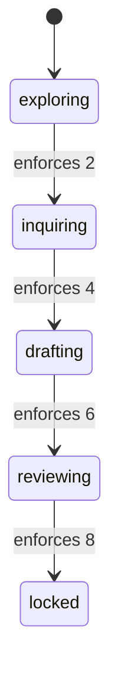

<!-- GENERATED — rendered from Doctrine's design-run gate tables and pinned to
     them by test. Not hand-editable, and not overridable: this file describes
     the machine your installed `doctrine` binary actually enforces, so an edited
     copy would describe a machine that does not exist. -->

# Design run — stage machine

The machine a design run stands in: five stages, four guarded forward edges, and
the conditions each edge enforces. Every table below is rendered from the gate
your `doctrine` binary evaluates, so what you read here is what refuses you.

## The stages

Each edge is labelled with the number of conditions the crossing enforces —
its own, plus everything it inherits.

## The edges

Each edge is guarded by its own conditions **and** by every cumulative condition
below it, re-derived against current content. A condition discharged two stages
ago is enforced again here; that is what the inherited column lists, and it is
the fact no single edge's view carries.

| edge | runbook | own conditions | inherited | enforces |
| --- | --- | --- | --- | --- |
| exploring-inquiring | exploring | `governing-context-recorded`, `initial-concerns-recorded` | — | 2 |
| inquiring-drafting | inquiring | `blocking-inquiries-dispositioned`, `user-accepts-sufficiency` | `governing-context-recorded`, `initial-concerns-recorded` | 4 |
| drafting-reviewing | drafting | `drafting-readiness-attested`, `materialisation-current` | `governing-context-recorded`, `initial-concerns-recorded`, `blocking-inquiries-dispositioned`, `user-accepts-sufficiency` | 6 |
| reviewing-locked | reviewing | `section-attestations-current`, `review-disposition-attested`, `user-acceptance-attested` | `governing-context-recorded`, `initial-concerns-recorded`, `blocking-inquiries-dispositioned`, `user-accepts-sufficiency`, `materialisation-current` | 8 |

## The conditions

`kind` says who authors the state a condition is derived over: a `derived` row is
recomputed from the run's own state, an `attested` one from acts an actor
recorded. `binding` says what invalidates it — the subject the derivation names,
plus any canonical fact outside the run that must also still match. `reach` says
whether discharging it once is the end of it: an `edge-local` row is judged by the
edge that names it, a `cumulative` one by every edge above it as well.

| condition | kind | binding | reach |
| --- | --- | --- | --- |
| `governing-context-recorded` | attested | artefact observes(governance-edges) | cumulative |
| `initial-concerns-recorded` | attested | inquiry-map | cumulative |
| `blocking-inquiries-dispositioned` | derived | engine(dispositions) | cumulative |
| `user-accepts-sufficiency` | attested | inquiry-map | cumulative |
| `drafting-readiness-attested` | attested | artefact | edge-local |
| `materialisation-current` | derived | engine(materialisation) | cumulative |
| `section-attestations-current` | attested | per-section | cumulative |
| `review-disposition-attested` | attested | artefact | cumulative |
| `user-acceptance-attested` | attested | every-section | cumulative |

### Discharging them

What each condition requires of you. A refusal names the conditions that failed;
these are the acts that clear them.

- `governing-context-recorded` — the user performs `governance-confirmed`
- `initial-concerns-recorded` — the user performs `graph-reviewed`, naming the current `blocking-set-declared`; the agent performs `blocking-set-declared`
- `blocking-inquiries-dispositioned` — dispose every blocking inquiry on the map
- `user-accepts-sufficiency` — the user performs `sufficiency-accepted`
- `drafting-readiness-attested` — the agent performs `drafting-ready`
- `materialisation-current` — materialise the design, so every section's stored digest matches the document
- `section-attestations-current` — every lane the run's review policy requires performs `section-reviewed`
- `review-disposition-attested` — the user disposes this review pass:
  conducted: name the RV whose pass has concluded; blockers still open or contested hold the edge
  waived:    state a reason; the findings stay on the RV, undisposed
- `user-acceptance-attested` — the user performs `design-accepted`

## Going back

Going back is a different verb, not a refused advance. Any earlier stage is
reachable from any later one — not merely the adjacent one — and no condition
guards the move. What it requires is a **reason**, stated and recorded; a
regression with a blank one is refused.

Nothing is replayed on the way back, because nothing needs to be: every
condition above is re-derived against current content on the way forward again,
which is the same guarantee that makes a discharge from two stages ago worth
re-checking here.
